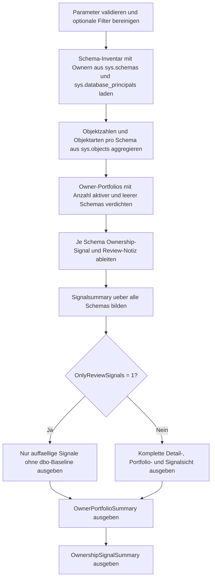

# SchemaOwnershipReview.sql

Dieses Skript bewertet Schema-Owner der aktuellen Datenbank nicht nur isoliert pro Schema, sondern auch im Kontext des gesamten Owner-Portfolios. So werden Owner-Abweichungen, geteilte Verantwortung ueber mehrere Schemas und gemischte aktive oder leere Besitzverhaeltnisse in einer gemeinsamen Reviewsicht sichtbar.

## Uebersicht

<!-- SQLDOC:SUMMARY_TABLE:BEGIN -->
| Feld | Wert |
|---|---|
| Script | [SchemaOwnershipReview.sql](SchemaOwnershipReview.sql) |
| Version | `1.0` |
| Typ | `diagnostic-query` |
| Kapitel | `22_Views_Schemata` |
| Sicherheit | `read-only` |
| Zweck | Review ueber Schema-Owner, gemeinsame Ownership-Muster und uneinheitliche Besitzverhaeltnisse. |
<!-- SQLDOC:SUMMARY_TABLE:END -->

## Einordnung

Viele Datenbanken arbeiten ueberwiegend mit `dbo` als Schema-Owner. Abweichungen davon sind nicht automatisch falsch, verdienen aber eine bewusste fachliche oder organisatorische Begruendung. Das Skript zeigt daher sowohl individuelle Custom-Owner als auch Owner, die mehrere Schemas mit unterschiedlichem Aktivitaetsgrad verantworten.

## Annahmen

- Das Skript arbeitet rein lesend auf Metadaten der aktuellen Datenbank und fuehrt keine `ALTER AUTHORIZATION`-Befehle aus.
- Systemnahe Schemas mit `schema_id <= 4` bleiben standardmaessig ausgeblendet, koennen aber ueber einen Parameter einbezogen werden.
- Ein individueller Schema-Owner wird als Review-Signal behandelt, nicht als genereller Fehler.
- Leere Schemas mit individuellem Owner gelten als besonderer Hinweis, weil sie auf vorbereitete, historische oder nur teilweise genutzte Ownership-Modelle deuten koennen.

## Anwendungsfall

Das Skript eignet sich fuer Betriebsreviews, Berechtigungsdiskussionen, Deployment-Nacharbeiten und Unterricht zu Schema-Strategien. Besonders hilfreich ist es, wenn nachvollzogen werden soll, ob Ownership-Muster konsistent gehalten werden oder ob einzelne Owner eine schwer erklaerbare Mischung aus aktiven und leeren Schemas verantworten.

## Parameter

<!-- SQLDOC:PARAMETERS_TABLE:BEGIN -->
| Parameter | SQL-Typ | Pflicht | Beschreibung |
|---|---|---|---|
| `@SchemaNameLike` | `SYSNAME` | Nein | Optionales LIKE-Muster fuer Schemanamen. |
| `@IncludeSystemSchemas` | `BIT` | Nein | Bei `1` werden auch systemnahe Schemas mit `schema_id <= 4` betrachtet. |
| `@OnlyReviewSignals` | `BIT` | Nein | Bei `1` werden nur auffaellige Ownership-Signale ohne reine `dbo`-Baseline gezeigt. |
<!-- SQLDOC:PARAMETERS_TABLE:END -->

## Abhaengigkeiten

<!-- SQLDOC:DEPENDENCIES_LIST:BEGIN -->
- `sys.schemas`
- `sys.database_principals`
- `sys.objects`
<!-- SQLDOC:DEPENDENCIES_LIST:END -->

## Hinweise

- `dbo-baseline` steht fuer das haeufige Basismuster eines aktiv genutzten Schemas mit `dbo` als Owner.
- `mixed-owner-portfolio` markiert Owner, die zugleich aktive und leere Schemas verantworten und damit ein uneinheitliches Bild erzeugen.
- Die zweite Resultset-Sicht verdichtet pro Owner, wie viele Schemas und Objekte insgesamt in dessen Portfolio liegen.

## Versionshistorie

<!-- SQLDOC:VERSION_HISTORY_TABLE:BEGIN -->
| Version | Datum | User | Beschreibung |
|---|---|---|---|
| `1.0` | `2026-04-22` | `ER` | Erstversion fuer das Review von Schema-Ownern und Ownership-Mustern |
<!-- SQLDOC:VERSION_HISTORY_TABLE:END -->

## Ablauf

<!-- SQLDOC:MERMAID:BEGIN -->

<!-- SQLDOC:MERMAID:END -->

## SQL-Code

<!-- SQLDOC:SQL_CODE:BEGIN -->
```sql
/*
BEGIN:SQL-HEADER v1
---
sql_header: v1
script_name: "SchemaOwnershipReview.sql"
script_version: "1.0"
script_type: "diagnostic-query"
chapter: "22_Views_Schemata"

purpose: >
  Prueft Schema-Owner der aktuellen Datenbank, verdichtet Abweichungen gegen
  das haeufige dbo-Baseline-Muster und markiert uneinheitliche
  Besitzverhaeltnisse wie verteilte Mehrfach-Ownership, leere Custom-Schemas
  und gemischt aktive Owner-Portfolios.

parameters:
  - name: "@SchemaNameLike"
    sql_type: "SYSNAME"
    direction: "IN"
    required: false
    description: "Optionales LIKE-Muster fuer Schemanamen"
  - name: "@IncludeSystemSchemas"
    sql_type: "BIT"
    direction: "IN"
    required: false
    description: "1 = auch systemnahe Schemas mit schema_id <= 4 einbeziehen"
  - name: "@OnlyReviewSignals"
    sql_type: "BIT"
    direction: "IN"
    required: false
    description: "1 = nur Schemas mit auffaelligem Ownership-Signal zeigen"

result_sets:
  - name: "SchemaOwnershipReview"
    description: "Detailsicht je Schema mit Owner, Objektmenge und Review-Signal"
  - name: "OwnerPortfolioSummary"
    description: "Verdichtete Sicht je Owner-Principal ueber Anzahl und Zustand seiner Schemas"
  - name: "OwnershipSignalSummary"
    description: "Zusammenfassung der gefundenen Ownership-Signale"

dependencies:
  - "sys.schemas"
  - "sys.database_principals"
  - "sys.objects"

safety:
  level: "read-only"
  writes_data: false

documentation:
  markdown_file: "T-SQL/22_Views_Schemata/SQLScripts/SchemaOwnershipReview.md"
  sync_blocks:
    - "SUMMARY_TABLE"
    - "PARAMETERS_TABLE"
    - "DEPENDENCIES_LIST"
    - "VERSION_HISTORY_TABLE"
    - "SQL_CODE"
  mermaid:
    mode: "ai-agent-from-sql"
    source: "script-body"

main_responsible:
  name: "Erhard Rainer"
  initials: "ER"

version_history:
  - version: "1.0"
    date: "2026-04-22"
    user: "ER"
    description: "Erstversion fuer das Review von Schema-Ownern und Ownership-Mustern"

notes:
  - "Nicht jeder Schema-Owner ungleich dbo ist problematisch; das Skript liefert bewusst Review-Signale statt harter Verstosse."
  - "Die Bewertung fokussiert auf Metadaten der aktuellen Datenbank und fuehrt keine Ownership-Aenderungen aus."
---
END:SQL-HEADER v1
*/

SET NOCOUNT ON;

DECLARE @SchemaNameLike SYSNAME = NULL;
DECLARE @IncludeSystemSchemas BIT = 0;
DECLARE @OnlyReviewSignals BIT = 0;

IF @IncludeSystemSchemas NOT IN (0, 1)
BEGIN
    THROW 50070, '@IncludeSystemSchemas muss 0 oder 1 sein.', 1;
END;

IF @OnlyReviewSignals NOT IN (0, 1)
BEGIN
    THROW 50071, '@OnlyReviewSignals muss 0 oder 1 sein.', 1;
END;

IF @SchemaNameLike IS NOT NULL AND LTRIM(RTRIM(@SchemaNameLike)) = ''
BEGIN
    SET @SchemaNameLike = NULL;
END;

DROP TABLE IF EXISTS #SchemaInventory;
DROP TABLE IF EXISTS #SchemaObjectCounts;
DROP TABLE IF EXISTS #OwnerPortfolio;
DROP TABLE IF EXISTS #SchemaOwnershipReview;
DROP TABLE IF EXISTS #OwnershipSignalSummary;

CREATE TABLE #SchemaInventory
(
    schema_id INT NOT NULL PRIMARY KEY,
    schema_name SYSNAME NOT NULL,
    schema_owner_principal_id INT NULL,
    schema_owner_name SYSNAME NULL,
    schema_owner_type_desc NVARCHAR(60) NULL,
    schema_owner_sid VARBINARY(85) NULL
);

INSERT INTO #SchemaInventory
(
    schema_id,
    schema_name,
    schema_owner_principal_id,
    schema_owner_name,
    schema_owner_type_desc,
    schema_owner_sid
)
SELECT
    s.schema_id,
    s.name AS schema_name,
    owner_principal.principal_id AS schema_owner_principal_id,
    owner_principal.name AS schema_owner_name,
    owner_principal.type_desc AS schema_owner_type_desc,
    owner_principal.sid AS schema_owner_sid
FROM sys.schemas AS s
LEFT JOIN sys.database_principals AS owner_principal
    ON owner_principal.principal_id = s.principal_id
WHERE (@IncludeSystemSchemas = 1 OR s.schema_id > 4)
  AND (@SchemaNameLike IS NULL OR s.name LIKE @SchemaNameLike);

CREATE TABLE #SchemaObjectCounts
(
    schema_id INT NOT NULL PRIMARY KEY,
    object_count INT NOT NULL,
    object_type_count INT NOT NULL,
    view_count INT NOT NULL,
    programmable_object_count INT NOT NULL
);

INSERT INTO #SchemaObjectCounts
(
    schema_id,
    object_count,
    object_type_count,
    view_count,
    programmable_object_count
)
SELECT
    si.schema_id,
    COUNT(o.object_id) AS object_count,
    COUNT(DISTINCT o.type) AS object_type_count,
    SUM(CASE WHEN o.type = 'V' THEN 1 ELSE 0 END) AS view_count,
    SUM(CASE WHEN o.type IN ('P', 'FN', 'IF', 'TF') THEN 1 ELSE 0 END) AS programmable_object_count
FROM #SchemaInventory AS si
LEFT JOIN sys.objects AS o
    ON o.schema_id = si.schema_id
   AND o.parent_object_id = 0
   AND o.is_ms_shipped = 0
GROUP BY
    si.schema_id;

CREATE TABLE #OwnerPortfolio
(
    schema_owner_name SYSNAME NULL,
    schema_owner_type_desc NVARCHAR(60) NULL,
    owned_schema_count INT NOT NULL,
    active_schema_count INT NOT NULL,
    empty_schema_count INT NOT NULL,
    total_object_count INT NOT NULL,
    max_objects_in_single_schema INT NOT NULL
);

INSERT INTO #OwnerPortfolio
(
    schema_owner_name,
    schema_owner_type_desc,
    owned_schema_count,
    active_schema_count,
    empty_schema_count,
    total_object_count,
    max_objects_in_single_schema
)
SELECT
    si.schema_owner_name,
    MAX(si.schema_owner_type_desc) AS schema_owner_type_desc,
    COUNT(*) AS owned_schema_count,
    SUM(CASE WHEN soc.object_count > 0 THEN 1 ELSE 0 END) AS active_schema_count,
    SUM(CASE WHEN soc.object_count = 0 THEN 1 ELSE 0 END) AS empty_schema_count,
    SUM(soc.object_count) AS total_object_count,
    MAX(soc.object_count) AS max_objects_in_single_schema
FROM #SchemaInventory AS si
INNER JOIN #SchemaObjectCounts AS soc
    ON soc.schema_id = si.schema_id
GROUP BY
    si.schema_owner_name;

CREATE TABLE #SchemaOwnershipReview
(
    schema_name SYSNAME NOT NULL,
    schema_owner_name SYSNAME NULL,
    schema_owner_type_desc NVARCHAR(60) NULL,
    object_count INT NOT NULL,
    object_type_count INT NOT NULL,
    view_count INT NOT NULL,
    programmable_object_count INT NOT NULL,
    owned_schema_count INT NOT NULL,
    active_schema_count INT NOT NULL,
    empty_schema_count INT NOT NULL,
    total_owner_object_count INT NOT NULL,
    ownership_signal VARCHAR(40) NOT NULL,
    review_note NVARCHAR(260) NOT NULL
);

INSERT INTO #SchemaOwnershipReview
(
    schema_name,
    schema_owner_name,
    schema_owner_type_desc,
    object_count,
    object_type_count,
    view_count,
    programmable_object_count,
    owned_schema_count,
    active_schema_count,
    empty_schema_count,
    total_owner_object_count,
    ownership_signal,
    review_note
)
SELECT
    si.schema_name,
    si.schema_owner_name,
    si.schema_owner_type_desc,
    soc.object_count,
    soc.object_type_count,
    soc.view_count,
    soc.programmable_object_count,
    ISNULL(op.owned_schema_count, 0) AS owned_schema_count,
    ISNULL(op.active_schema_count, 0) AS active_schema_count,
    ISNULL(op.empty_schema_count, 0) AS empty_schema_count,
    ISNULL(op.total_object_count, 0) AS total_owner_object_count,
    CASE
        WHEN si.schema_owner_name IS NULL THEN 'owner-missing'
        WHEN si.schema_owner_name = N'dbo' AND soc.object_count > 0 THEN 'dbo-baseline'
        WHEN si.schema_owner_name = N'dbo' AND soc.object_count = 0 THEN 'dbo-empty'
        WHEN ISNULL(op.owned_schema_count, 0) > 1
             AND ISNULL(op.active_schema_count, 0) > 0
             AND ISNULL(op.empty_schema_count, 0) > 0 THEN 'mixed-owner-portfolio'
        WHEN ISNULL(op.owned_schema_count, 0) > 1 THEN 'shared-custom-owner'
        WHEN soc.object_count = 0 THEN 'empty-custom-owner'
        ELSE 'single-custom-owner'
    END AS ownership_signal,
    CASE
        WHEN si.schema_owner_name IS NULL THEN N'Der Schema-Owner ist in sys.database_principals nicht aufloesbar und sollte gezielt geprueft werden.'
        WHEN si.schema_owner_name = N'dbo' AND soc.object_count > 0 THEN N'Das Schema folgt dem haeufigen dbo-Baseline-Muster und enthaelt benutzerdefinierte Objekte.'
        WHEN si.schema_owner_name = N'dbo' AND soc.object_count = 0 THEN N'Das Schema liegt bei dbo, ist derzeit aber leer; Nutzung oder Aufraeumbedarf kann separat geprueft werden.'
        WHEN ISNULL(op.owned_schema_count, 0) > 1
             AND ISNULL(op.active_schema_count, 0) > 0
             AND ISNULL(op.empty_schema_count, 0) > 0 THEN N'Derselbe Owner verantwortet zugleich aktive und leere Schemas; Ownership-Absicht und Konsistenz sollten dokumentiert werden.'
        WHEN ISNULL(op.owned_schema_count, 0) > 1 THEN N'Der Owner verantwortet mehrere Schemas; gemeinsame Ownership sollte fachlich oder organisatorisch begruendet sein.'
        WHEN soc.object_count = 0 THEN N'Das Schema hat einen individuellen Owner, enthaelt aber keine benutzerdefinierten Objekte und wirkt daher vorbereitend oder historisch.'
        ELSE N'Das Schema besitzt einen individuellen Owner ohne weitere auffaellige Verteilung; die Entscheidung sollte bewusst dokumentiert sein.'
    END AS review_note
FROM #SchemaInventory AS si
INNER JOIN #SchemaObjectCounts AS soc
    ON soc.schema_id = si.schema_id
LEFT JOIN #OwnerPortfolio AS op
    ON op.schema_owner_name = si.schema_owner_name;

CREATE TABLE #OwnershipSignalSummary
(
    ownership_signal VARCHAR(40) NOT NULL,
    schema_count INT NOT NULL,
    owner_count INT NOT NULL,
    total_object_count INT NOT NULL
);

INSERT INTO #OwnershipSignalSummary
(
    ownership_signal,
    schema_count,
    owner_count,
    total_object_count
)
SELECT
    sor.ownership_signal,
    COUNT(*) AS schema_count,
    COUNT(DISTINCT ISNULL(sor.schema_owner_name, N'(missing)')) AS owner_count,
    SUM(sor.object_count) AS total_object_count
FROM #SchemaOwnershipReview AS sor
GROUP BY
    sor.ownership_signal;

SELECT
    sor.schema_name,
    sor.schema_owner_name,
    sor.schema_owner_type_desc,
    sor.object_count,
    sor.object_type_count,
    sor.view_count,
    sor.programmable_object_count,
    sor.owned_schema_count,
    sor.active_schema_count,
    sor.empty_schema_count,
    sor.total_owner_object_count,
    sor.ownership_signal,
    sor.review_note
FROM #SchemaOwnershipReview AS sor
WHERE @OnlyReviewSignals = 0
   OR sor.ownership_signal NOT IN ('dbo-baseline', 'dbo-empty')
ORDER BY
    CASE sor.ownership_signal
        WHEN 'owner-missing' THEN 1
        WHEN 'mixed-owner-portfolio' THEN 2
        WHEN 'shared-custom-owner' THEN 3
        WHEN 'empty-custom-owner' THEN 4
        WHEN 'single-custom-owner' THEN 5
        WHEN 'dbo-empty' THEN 6
        ELSE 7
    END,
    sor.total_owner_object_count DESC,
    sor.schema_name;

SELECT
    op.schema_owner_name,
    op.schema_owner_type_desc,
    op.owned_schema_count,
    op.active_schema_count,
    op.empty_schema_count,
    op.total_object_count,
    op.max_objects_in_single_schema,
    CASE
        WHEN op.schema_owner_name IS NULL THEN 'owner-missing'
        WHEN op.schema_owner_name = N'dbo' THEN 'dbo-baseline'
        WHEN op.owned_schema_count > 1 AND op.active_schema_count > 0 AND op.empty_schema_count > 0 THEN 'mixed-owner-portfolio'
        WHEN op.owned_schema_count > 1 THEN 'shared-custom-owner'
        WHEN op.empty_schema_count = op.owned_schema_count THEN 'empty-custom-owner'
        ELSE 'single-custom-owner'
    END AS owner_portfolio_signal
FROM #OwnerPortfolio AS op
WHERE @OnlyReviewSignals = 0
   OR (
        CASE
            WHEN op.schema_owner_name IS NULL THEN 'owner-missing'
            WHEN op.schema_owner_name = N'dbo' THEN 'dbo-baseline'
            WHEN op.owned_schema_count > 1 AND op.active_schema_count > 0 AND op.empty_schema_count > 0 THEN 'mixed-owner-portfolio'
            WHEN op.owned_schema_count > 1 THEN 'shared-custom-owner'
            WHEN op.empty_schema_count = op.owned_schema_count THEN 'empty-custom-owner'
            ELSE 'single-custom-owner'
        END
      ) <> 'dbo-baseline'
ORDER BY
    CASE
        WHEN op.schema_owner_name IS NULL THEN 1
        WHEN op.schema_owner_name = N'dbo' THEN 6
        WHEN op.owned_schema_count > 1 AND op.active_schema_count > 0 AND op.empty_schema_count > 0 THEN 2
        WHEN op.owned_schema_count > 1 THEN 3
        WHEN op.empty_schema_count = op.owned_schema_count THEN 4
        ELSE 5
    END,
    op.total_object_count DESC,
    op.schema_owner_name;

SELECT
    oss.ownership_signal,
    oss.schema_count,
    oss.owner_count,
    oss.total_object_count
FROM #OwnershipSignalSummary AS oss
WHERE @OnlyReviewSignals = 0
   OR oss.ownership_signal NOT IN ('dbo-baseline', 'dbo-empty')
ORDER BY
    oss.schema_count DESC,
    oss.total_object_count DESC,
    oss.ownership_signal;
```
<!-- SQLDOC:SQL_CODE:END -->
