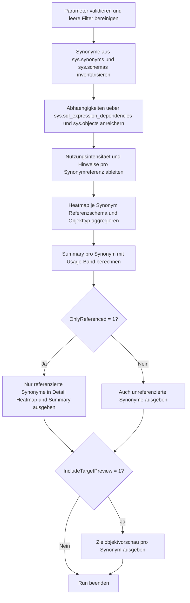

# SynonymDependencyHeatmap.sql

Dieses Skript erstellt eine lesende Heatmap fuer die Nutzung von Synonymen in der aktuellen Datenbank. Der Fokus liegt auf Metadaten aus `sys.synonyms` und `sys.sql_expression_dependencies`, damit sichtbar wird, welche Synonyme breit genutzt, nur punktuell referenziert oder aktuell gar nicht eingebunden sind.

## Uebersicht

<!-- SQLDOC:SUMMARY_TABLE:BEGIN -->
| Feld | Wert |
|---|---|
| Script | [SynonymDependencyHeatmap.sql](SynonymDependencyHeatmap.sql) |
| Version | `1.0` |
| Typ | `diagnostic-query` |
| Kapitel | `22_Views_Schemata` |
| Sicherheit | `read-only` |
| Zweck | Heatmap fuer die Nutzung von Synonymen in Objektabhaengigkeiten. |
<!-- SQLDOC:SUMMARY_TABLE:END -->

## Einordnung

Synonyme vereinfachen den Zugriff auf Zielobjekte, koennen aber gleichzeitig Kopplung verstecken, besonders bei externen oder datenbankuebergreifenden Zielen. Das Skript kombiniert deshalb eine Detailansicht pro referenzierendem Objekt mit einer Heatmap je Schema und einer verdichteten Summary pro Synonym.

## Annahmen

- Die Analyse bleibt auf die Metadaten der aktuellen Datenbank beschraenkt und bewertet keine Laufzeitaufrufe ausserhalb von `sys.sql_expression_dependencies`.
- Die Heatmap misst Nutzung ueber gefundene Abhaengigkeiten, nicht ueber reale Ausfuehrungshaeufigkeit.
- Unreferenzierte Synonyme werden bewusst mitgefuehrt, damit Inventar- und Aufraeumfragen im selben Lauf moeglich bleiben.
- Die Einordnung von Zieladressen erfolgt heuristisch ueber die Form von `base_object_name`.

## Anwendungsfall

Das Skript eignet sich fuer Architektur-Reviews, Refactoring-Vorbereitung und Aufraeumarbeiten in Datenbanken mit vielen Abstraktionsschichten. Es hilft besonders dann, wenn Synonyme ueber mehrere Schemata hinweg geteilt werden oder externe Zielobjekte gesondert beobachtet werden sollen.

## Parameter

<!-- SQLDOC:PARAMETERS_TABLE:BEGIN -->
| Parameter | SQL-Typ | Pflicht | Beschreibung |
|---|---|---|---|
| `@SynonymSchemaLike` | `SYSNAME` | Nein | Optionales LIKE-Muster fuer das Schema der Synonyme. |
| `@ReferencingSchemaLike` | `SYSNAME` | Nein | Optionales LIKE-Muster fuer Schemata referenzierender Objekte. |
| `@OnlyReferenced` | `BIT` | Nein | Zeigt bei `1` nur Synonyme mit mindestens einer gefundenen Abhaengigkeit. |
| `@IncludeTargetPreview` | `BIT` | Nein | Gibt bei `1` ein zusaetzliches Resultset mit Zielobjektvorschau aus. |
<!-- SQLDOC:PARAMETERS_TABLE:END -->

## Abhaengigkeiten

<!-- SQLDOC:DEPENDENCIES_LIST:BEGIN -->
- `sys.synonyms`
- `sys.schemas`
- `sys.objects`
- `sys.sql_expression_dependencies`
- `sys.sql_modules`
<!-- SQLDOC:DEPENDENCIES_LIST:END -->

## Hinweise

- Das Detailresultset zeigt pro Synonym die referenzierenden Objekte samt Nutzungsintensitaet und Handlungshinweis.
- Die Heatmap gruppiert nach referenzierendem Schema und Objekttyp, damit Nutzungsschwerpunkte schnell sichtbar werden.
- Die Summary verdichtet pro Synonym, ob es eher `Hot`, `Warm`, `Cool` oder `Idle` ist.

## Versionshistorie

<!-- SQLDOC:VERSION_HISTORY_TABLE:BEGIN -->
| Version | Datum | User | Beschreibung |
|---|---|---|---|
| `1.0` | `2026-04-22` | `ER` | Erstversion der Synonym-Abhaengigkeits-Heatmap |
<!-- SQLDOC:VERSION_HISTORY_TABLE:END -->

## Ablauf

<!-- SQLDOC:MERMAID:BEGIN -->

<!-- SQLDOC:MERMAID:END -->

## SQL-Code

<!-- SQLDOC:SQL_CODE:BEGIN -->
```sql
/*
BEGIN:SQL-HEADER v1
---
sql_header: v1
script_name: "SynonymDependencyHeatmap.sql"
script_version: "1.0"
script_type: "diagnostic-query"
chapter: "22_Views_Schemata"

purpose: >
  Erstellt eine Heatmap fuer die Nutzung von Synonymen in Objektabhaengigkeiten.
  Das Skript kombiniert sys.synonyms mit sys.sql_expression_dependencies,
  ordnet referenzierende Objekte nach Schema und Typ ein und zeigt sowohl
  Detailreferenzen als auch verdichtete Nutzungsschwerpunkte pro Synonym.

parameters:
  - name: "@SynonymSchemaLike"
    sql_type: "SYSNAME"
    direction: "IN"
    required: false
    description: "Optionales LIKE-Muster fuer Synonym-Schemata"
  - name: "@ReferencingSchemaLike"
    sql_type: "SYSNAME"
    direction: "IN"
    required: false
    description: "Optionales LIKE-Muster fuer referenzierende Objekt-Schemata"
  - name: "@OnlyReferenced"
    sql_type: "BIT"
    direction: "IN"
    required: false
    description: "1 = nur Synonyme mit mindestens einer Abhaengigkeit ausgeben"
  - name: "@IncludeTargetPreview"
    sql_type: "BIT"
    direction: "IN"
    required: false
    description: "1 = zusaetzliche Zielobjektvorschau pro Synonym ausgeben"

result_sets:
  - name: "SynonymReferenceDetail"
    description: "Detailansicht pro Synonym und referenzierendem Objekt"
  - name: "SynonymDependencyHeatmap"
    description: "Heatmap je Synonym, referenzierendem Schema und Objekttyp"
  - name: "SynonymUsageSummary"
    description: "Verdichtete Nutzungssicht pro Synonym mit Usage-Band"
  - name: "SynonymTargetPreview"
    description: "Optionale Vorschau auf die konfigurierten Zielobjekte der Synonyme"

dependencies:
  - "sys.synonyms"
  - "sys.schemas"
  - "sys.objects"
  - "sys.sql_expression_dependencies"
  - "sys.sql_modules"

safety:
  level: "read-only"
  writes_data: false

documentation:
  markdown_file: "T-SQL/22_Views_Schemata/SQLScripts/SynonymDependencyHeatmap.md"
  sync_blocks:
    - "SUMMARY_TABLE"
    - "PARAMETERS_TABLE"
    - "DEPENDENCIES_LIST"
    - "VERSION_HISTORY_TABLE"
    - "SQL_CODE"
  mermaid:
    mode: "ai-agent-from-sql"
    source: "script-body"

main_responsible:
  name: "Erhard Rainer"
  initials: "ER"

version_history:
  - version: "1.0"
    date: "2026-04-22"
    user: "ER"
    description: "Erstversion der Synonym-Abhaengigkeits-Heatmap"

notes:
  - "Das Skript analysiert nur Metadaten der aktuellen Datenbank und fuehrt keine Aenderungen aus."
  - "Nicht referenzierte Synonyme werden optional mitgefuehrt, damit Inventar- und Aufraeumfragen moeglich bleiben."
---
END:SQL-HEADER v1
*/

SET NOCOUNT ON;

DECLARE @SynonymSchemaLike SYSNAME = NULL;
DECLARE @ReferencingSchemaLike SYSNAME = NULL;
DECLARE @OnlyReferenced BIT = 0;
DECLARE @IncludeTargetPreview BIT = 1;

IF @OnlyReferenced NOT IN (0, 1)
BEGIN
    THROW 50030, '@OnlyReferenced muss 0 oder 1 sein.', 1;
END;

IF @IncludeTargetPreview NOT IN (0, 1)
BEGIN
    THROW 50031, '@IncludeTargetPreview muss 0 oder 1 sein.', 1;
END;

IF @SynonymSchemaLike IS NOT NULL AND LTRIM(RTRIM(@SynonymSchemaLike)) = ''
BEGIN
    SET @SynonymSchemaLike = NULL;
END;

IF @ReferencingSchemaLike IS NOT NULL AND LTRIM(RTRIM(@ReferencingSchemaLike)) = ''
BEGIN
    SET @ReferencingSchemaLike = NULL;
END;

DROP TABLE IF EXISTS #SynonymInventory;
DROP TABLE IF EXISTS #SynonymReferenceDetail;
DROP TABLE IF EXISTS #SynonymDependencyHeatmap;
DROP TABLE IF EXISTS #SynonymUsageSummary;

CREATE TABLE #SynonymInventory
(
    synonym_object_id         INT            NOT NULL,
    synonym_schema_name       SYSNAME        NOT NULL,
    synonym_name              SYSNAME        NOT NULL,
    full_synonym_name         NVARCHAR(517)  NOT NULL,
    base_object_name          NVARCHAR(1035) NOT NULL,
    target_scope              NVARCHAR(40)   NOT NULL,
    target_database_hint      SYSNAME        NULL
);

INSERT INTO #SynonymInventory
(
    synonym_object_id,
    synonym_schema_name,
    synonym_name,
    full_synonym_name,
    base_object_name,
    target_scope,
    target_database_hint
)
SELECT
    sn.object_id,
    ss.name AS synonym_schema_name,
    sn.name AS synonym_name,
    QUOTENAME(ss.name) + N'.' + QUOTENAME(sn.name) AS full_synonym_name,
    sn.base_object_name,
    CASE
        WHEN sn.base_object_name LIKE '%].[%].[%].[%]%' THEN 'linked-server-or-4-part'
        WHEN sn.base_object_name LIKE '%].[%].[%]%' THEN 'cross-database-or-3-part'
        ELSE 'local-or-unqualified'
    END AS target_scope,
    CASE
        WHEN sn.base_object_name LIKE '%].[%].[%].[%]%' THEN PARSENAME(REPLACE(REPLACE(sn.base_object_name, '[', ''), ']', ''), 3)
        WHEN sn.base_object_name LIKE '%].[%].[%]%' THEN PARSENAME(REPLACE(REPLACE(sn.base_object_name, '[', ''), ']', ''), 3)
        ELSE NULL
    END AS target_database_hint
FROM sys.synonyms AS sn
INNER JOIN sys.schemas AS ss
    ON ss.schema_id = sn.schema_id
WHERE @SynonymSchemaLike IS NULL
   OR ss.name LIKE @SynonymSchemaLike;

CREATE TABLE #SynonymReferenceDetail
(
    full_synonym_name           NVARCHAR(517)  NOT NULL,
    base_object_name            NVARCHAR(1035) NOT NULL,
    target_scope                NVARCHAR(40)   NOT NULL,
    referencing_schema_name     SYSNAME        NULL,
    referencing_object_name     SYSNAME        NULL,
    referencing_object_type     NVARCHAR(60)   NOT NULL,
    referencing_full_name       NVARCHAR(517)  NULL,
    dependency_scope            NVARCHAR(40)   NOT NULL,
    is_schema_bound_reference   BIT            NOT NULL,
    is_ambiguous                BIT            NOT NULL,
    usage_intensity             VARCHAR(10)    NOT NULL,
    finding                     NVARCHAR(260)  NOT NULL,
    recommended_action          NVARCHAR(260)  NOT NULL
);

INSERT INTO #SynonymReferenceDetail
(
    full_synonym_name,
    base_object_name,
    target_scope,
    referencing_schema_name,
    referencing_object_name,
    referencing_object_type,
    referencing_full_name,
    dependency_scope,
    is_schema_bound_reference,
    is_ambiguous,
    usage_intensity,
    finding,
    recommended_action
)
SELECT
    si.full_synonym_name,
    si.base_object_name,
    si.target_scope,
    rs.name AS referencing_schema_name,
    ro.name AS referencing_object_name,
    COALESCE(ro.type_desc, 'UNREFERENCED') AS referencing_object_type,
    CASE
        WHEN ro.object_id IS NOT NULL THEN QUOTENAME(rs.name) + N'.' + QUOTENAME(ro.name)
        ELSE NULL
    END AS referencing_full_name,
    CASE
        WHEN sed.referencing_id IS NULL THEN 'unused'
        WHEN si.target_scope = 'linked-server-or-4-part' THEN 'external'
        WHEN si.target_scope = 'cross-database-or-3-part' THEN 'cross-database'
        ELSE 'local'
    END AS dependency_scope,
    CONVERT(BIT, ISNULL(sed.is_schema_bound_reference, 0)),
    CONVERT(BIT, ISNULL(sed.is_ambiguous, 0)),
    CASE
        WHEN sed.referencing_id IS NULL THEN 'None'
        WHEN si.target_scope = 'linked-server-or-4-part' THEN 'High'
        WHEN sed.is_schema_bound_reference = 1 THEN 'Medium'
        ELSE 'Low'
    END AS usage_intensity,
    CASE
        WHEN sed.referencing_id IS NULL THEN 'Synonym ist aktuell in den Metadaten ohne referenzierendes Objekt sichtbar.'
        WHEN si.target_scope = 'linked-server-or-4-part' THEN 'Synonym fuehrt in eine externe oder vierteilige Zieladresse und sollte besonders beobachtet werden.'
        WHEN si.target_scope = 'cross-database-or-3-part' THEN 'Synonym kapselt eine datenbankuebergreifende Referenz.'
        WHEN sed.is_schema_bound_reference = 1 THEN 'Synonym wird in einer schema-gebundenen Abhaengigkeit genutzt.'
        ELSE 'Synonym wird in einer normalen Objektabhaengigkeit genutzt.'
    END AS finding,
    CASE
        WHEN sed.referencing_id IS NULL THEN 'Nicht genutzte Synonyme pruefen und bei Bedarf als Inventar- oder Aufraeumkandidat markieren.'
        WHEN si.target_scope = 'linked-server-or-4-part' THEN 'Betrieb, Sicherheit und Erreichbarkeit des externen Zielsystems in Runbooks absichern.'
        WHEN si.target_scope = 'cross-database-or-3-part' THEN 'Cross-Database-Abhaengigkeit in Deployment-Checks und Architekturuebersichten dokumentieren.'
        WHEN sed.is_schema_bound_reference = 1 THEN 'Schemaaenderungen am Synonym und Zielobjekt abgestimmt planen.'
        ELSE 'Nutzung dokumentieren und bei Objekt-Renames gezielt mitpruefen.'
    END AS recommended_action
FROM #SynonymInventory AS si
LEFT JOIN sys.sql_expression_dependencies AS sed
    ON sed.referenced_id = si.synonym_object_id
LEFT JOIN sys.objects AS ro
    ON ro.object_id = sed.referencing_id
LEFT JOIN sys.schemas AS rs
    ON rs.schema_id = ro.schema_id
WHERE @ReferencingSchemaLike IS NULL
   OR rs.name LIKE @ReferencingSchemaLike
   OR sed.referencing_id IS NULL;

CREATE TABLE #SynonymDependencyHeatmap
(
    full_synonym_name           NVARCHAR(517)  NOT NULL,
    target_scope                NVARCHAR(40)   NOT NULL,
    referencing_schema_name     SYSNAME        NOT NULL,
    referencing_object_type     NVARCHAR(60)   NOT NULL,
    referencing_object_count    INT            NOT NULL,
    schema_bound_reference_count INT           NOT NULL,
    external_target_count       INT            NOT NULL,
    heat_band                   VARCHAR(10)    NOT NULL
);

INSERT INTO #SynonymDependencyHeatmap
(
    full_synonym_name,
    target_scope,
    referencing_schema_name,
    referencing_object_type,
    referencing_object_count,
    schema_bound_reference_count,
    external_target_count,
    heat_band
)
SELECT
    srd.full_synonym_name,
    srd.target_scope,
    COALESCE(srd.referencing_schema_name, '(unreferenced)') AS referencing_schema_name,
    srd.referencing_object_type,
    COUNT(*) AS referencing_object_count,
    SUM(CASE WHEN srd.is_schema_bound_reference = 1 THEN 1 ELSE 0 END) AS schema_bound_reference_count,
    SUM(CASE WHEN srd.target_scope IN ('linked-server-or-4-part', 'cross-database-or-3-part') THEN 1 ELSE 0 END) AS external_target_count,
    CASE
        WHEN COUNT(*) >= 5 THEN 'Hot'
        WHEN COUNT(*) >= 2 THEN 'Warm'
        WHEN COUNT(*) = 1 AND MAX(CASE WHEN srd.referencing_full_name IS NULL THEN 1 ELSE 0 END) = 0 THEN 'Cool'
        ELSE 'Idle'
    END AS heat_band
FROM #SynonymReferenceDetail AS srd
GROUP BY
    srd.full_synonym_name,
    srd.target_scope,
    COALESCE(srd.referencing_schema_name, '(unreferenced)'),
    srd.referencing_object_type;

CREATE TABLE #SynonymUsageSummary
(
    full_synonym_name            NVARCHAR(517)  NOT NULL,
    base_object_name             NVARCHAR(1035) NOT NULL,
    target_scope                 NVARCHAR(40)   NOT NULL,
    referencing_object_count     INT            NOT NULL,
    referencing_schema_count     INT            NOT NULL,
    highest_usage_intensity      VARCHAR(10)    NOT NULL,
    usage_band                   VARCHAR(10)    NOT NULL,
    recommendation               NVARCHAR(260)  NOT NULL
);

INSERT INTO #SynonymUsageSummary
(
    full_synonym_name,
    base_object_name,
    target_scope,
    referencing_object_count,
    referencing_schema_count,
    highest_usage_intensity,
    usage_band,
    recommendation
)
SELECT
    srd.full_synonym_name,
    MAX(srd.base_object_name) AS base_object_name,
    MAX(srd.target_scope) AS target_scope,
    COUNT(CASE WHEN srd.referencing_full_name IS NOT NULL THEN 1 END) AS referencing_object_count,
    COUNT(DISTINCT CASE WHEN srd.referencing_schema_name IS NOT NULL THEN srd.referencing_schema_name END) AS referencing_schema_count,
    CASE
        WHEN MAX(CASE srd.usage_intensity WHEN 'High' THEN 3 WHEN 'Medium' THEN 2 WHEN 'Low' THEN 1 ELSE 0 END) = 3 THEN 'High'
        WHEN MAX(CASE srd.usage_intensity WHEN 'High' THEN 3 WHEN 'Medium' THEN 2 WHEN 'Low' THEN 1 ELSE 0 END) = 2 THEN 'Medium'
        WHEN MAX(CASE srd.usage_intensity WHEN 'High' THEN 3 WHEN 'Medium' THEN 2 WHEN 'Low' THEN 1 ELSE 0 END) = 1 THEN 'Low'
        ELSE 'None'
    END AS highest_usage_intensity,
    CASE
        WHEN COUNT(CASE WHEN srd.referencing_full_name IS NOT NULL THEN 1 END) >= 5 THEN 'Hot'
        WHEN COUNT(CASE WHEN srd.referencing_full_name IS NOT NULL THEN 1 END) >= 2 THEN 'Warm'
        WHEN COUNT(CASE WHEN srd.referencing_full_name IS NOT NULL THEN 1 END) = 1 THEN 'Cool'
        ELSE 'Idle'
    END AS usage_band,
    CASE
        WHEN COUNT(CASE WHEN srd.referencing_full_name IS NOT NULL THEN 1 END) = 0 THEN 'Unreferenzierte Synonyme als Inventar- oder Bereinigungskandidaten pruefen.'
        WHEN MAX(CASE WHEN srd.target_scope = 'linked-server-or-4-part' THEN 1 ELSE 0 END) = 1 THEN 'Externe Synonym-Ziele gesondert in Betrieb und Security absichern.'
        WHEN COUNT(DISTINCT CASE WHEN srd.referencing_schema_name IS NOT NULL THEN srd.referencing_schema_name END) >= 2 THEN 'Synonym als geteilte Kopplungsstelle dokumentieren und bei Aenderungen zentral kommunizieren.'
        ELSE 'Synonym-Nutzung im jeweiligen Modul dokumentieren und bei Objekt-Renames mitpruefen.'
    END AS recommendation
FROM #SynonymReferenceDetail AS srd
GROUP BY
    srd.full_synonym_name;

SELECT
    srd.full_synonym_name,
    srd.base_object_name,
    srd.target_scope,
    srd.referencing_full_name,
    srd.referencing_object_type,
    srd.dependency_scope,
    srd.is_schema_bound_reference,
    srd.is_ambiguous,
    srd.usage_intensity,
    srd.finding,
    srd.recommended_action
FROM #SynonymReferenceDetail AS srd
WHERE @OnlyReferenced = 0
   OR srd.referencing_full_name IS NOT NULL
ORDER BY
    srd.full_synonym_name,
    CASE srd.usage_intensity
        WHEN 'High' THEN 1
        WHEN 'Medium' THEN 2
        WHEN 'Low' THEN 3
        ELSE 4
    END,
    srd.referencing_full_name;

SELECT
    sdh.full_synonym_name,
    sdh.target_scope,
    sdh.referencing_schema_name,
    sdh.referencing_object_type,
    sdh.referencing_object_count,
    sdh.schema_bound_reference_count,
    sdh.external_target_count,
    sdh.heat_band
FROM #SynonymDependencyHeatmap AS sdh
WHERE @OnlyReferenced = 0
   OR sdh.referencing_schema_name <> '(unreferenced)'
ORDER BY
    CASE sdh.heat_band
        WHEN 'Hot' THEN 1
        WHEN 'Warm' THEN 2
        WHEN 'Cool' THEN 3
        ELSE 4
    END,
    sdh.full_synonym_name,
    sdh.referencing_schema_name,
    sdh.referencing_object_type;

SELECT
    sus.full_synonym_name,
    sus.base_object_name,
    sus.target_scope,
    sus.referencing_object_count,
    sus.referencing_schema_count,
    sus.highest_usage_intensity,
    sus.usage_band,
    sus.recommendation
FROM #SynonymUsageSummary AS sus
WHERE @OnlyReferenced = 0
   OR sus.referencing_object_count > 0
ORDER BY
    CASE sus.usage_band
        WHEN 'Hot' THEN 1
        WHEN 'Warm' THEN 2
        WHEN 'Cool' THEN 3
        ELSE 4
    END,
    sus.referencing_object_count DESC,
    sus.full_synonym_name;

IF @IncludeTargetPreview = 1
BEGIN
    SELECT
        si.full_synonym_name,
        si.base_object_name,
        si.target_scope,
        si.target_database_hint
    FROM #SynonymInventory AS si
    WHERE @OnlyReferenced = 0
       OR EXISTS
       (
           SELECT 1
           FROM #SynonymReferenceDetail AS srd
           WHERE srd.full_synonym_name = si.full_synonym_name
             AND srd.referencing_full_name IS NOT NULL
       )
    ORDER BY
        si.full_synonym_name;
END;
```
<!-- SQLDOC:SQL_CODE:END -->
