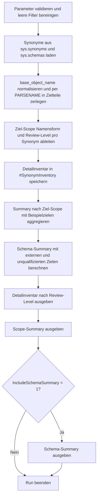

# SynonymInventoryReport.sql

Dieses Skript liefert ein lesendes Inventar aller Synonyme der aktuellen Datenbank und ordnet deren Zieladressen nach Scope, Namensform und Review-Bedarf ein. Dadurch wird sichtbar, welche Synonyme lokal bleiben, welche datenbank- oder serveruebergreifend wirken und wo Zielnamen nur schwach qualifiziert sind.

## Uebersicht

<!-- SQLDOC:SUMMARY_TABLE:BEGIN -->
| Feld | Wert |
|---|---|
| Script | [SynonymInventoryReport.sql](SynonymInventoryReport.sql) |
| Version | `1.0` |
| Typ | `diagnostic-query` |
| Kapitel | `22_Views_Schemata` |
| Sicherheit | `read-only` |
| Zweck | Inventarisiert Synonyme und klassifiziert deren Zielobjekte nach Scope und Review-Bedarf. |
<!-- SQLDOC:SUMMARY_TABLE:END -->

## Einordnung

Synonyme entkoppeln konsumierenden Code vom konkreten Zielobjekt, koennen aber gleichzeitig technische Kopplung verbergen. Das Skript fokussiert deshalb nicht auf Laufzeitverhalten, sondern auf Metadatenstruktur: Welche Zieladresse ist hinterlegt, wie stark ist sie qualifiziert und welches Review-Level ergibt sich daraus fuer Dokumentation oder Betrieb.

## Annahmen

- Die Zielklassifikation wird aus `base_object_name` heuristisch ueber die Anzahl qualifizierter Namensbestandteile abgeleitet.
- Vierteilige Namen werden als potenziell serveruebergreifend behandelt, auch wenn der konkrete Einsatzzweck davon abweichen kann.
- Unqualifizierte oder ungewoehnlich geformte Zielnamen bleiben bewusst sichtbar, weil gerade diese Eintraege im Review Aufmerksamkeit brauchen.
- Das Skript bleibt auf lesende Metadatenabfragen beschraenkt und aendert keine Synonyme oder Abhaengigkeiten.

## Anwendungsfall

Das Inventar eignet sich fuer Architektur-Reviews, Bereinigungsarbeiten und Vorbereitung von Deployments. Besonders hilfreich ist es, wenn Synonyme in verschiedenen Schemata verteilt sind und vor einer Umstellung geklaert werden soll, welche Ziele lokal, datenbankuebergreifend oder extern adressiert werden.

## Parameter

<!-- SQLDOC:PARAMETERS_TABLE:BEGIN -->
| Parameter | SQL-Typ | Pflicht | Beschreibung |
|---|---|---|---|
| `@SynonymSchemaLike` | `SYSNAME` | Nein | Optionales LIKE-Muster fuer das Schema von Synonymen. |
| `@TargetNameLike` | `NVARCHAR(256)` | Nein | Optionales LIKE-Muster fuer den rohen Zielnamen aus `base_object_name`. |
| `@OnlyExternalTargets` | `BIT` | Nein | Zeigt bei `1` nur Synonyme mit datenbankuebergreifendem oder vierteiligem Ziel. |
| `@IncludeSchemaSummary` | `BIT` | Nein | Gibt bei `1` ein zusaetzliches Resultset mit Verteilung je Synonym-Schema aus. |
<!-- SQLDOC:PARAMETERS_TABLE:END -->

## Abhaengigkeiten

<!-- SQLDOC:DEPENDENCIES_LIST:BEGIN -->
- `sys.synonyms`
- `sys.schemas`
- `PARSENAME`
- `STRING_AGG`
<!-- SQLDOC:DEPENDENCIES_LIST:END -->

## Hinweise

- Das erste Resultset zeigt pro Synonym die zerlegte Zieladresse und einen kompakten Review-Hinweis.
- Das zweite Resultset verdichtet nach Ziel-Scope, damit externe oder datenbankuebergreifende Muster schnell sichtbar werden.
- Das optionale dritte Resultset fasst zusammen, welche Synonym-Schemata besonders viele externe oder unqualifizierte Ziele enthalten.

## Versionshistorie

<!-- SQLDOC:VERSION_HISTORY_TABLE:BEGIN -->
| Version | Datum | User | Beschreibung |
|---|---|---|---|
| `1.0` | `2026-04-22` | `ER` | Erstversion des Synonym-Inventar-Reports |
<!-- SQLDOC:VERSION_HISTORY_TABLE:END -->

## Ablauf

<!-- SQLDOC:MERMAID:BEGIN -->

<!-- SQLDOC:MERMAID:END -->

## SQL-Code

<!-- SQLDOC:SQL_CODE:BEGIN -->
```sql
/*
BEGIN:SQL-HEADER v1
---
sql_header: v1
script_name: "SynonymInventoryReport.sql"
script_version: "1.0"
script_type: "diagnostic-query"
chapter: "22_Views_Schemata"

purpose: >
  Liefert ein Inventar aller Synonyme der aktuellen Datenbank und klassifiziert
  deren Zielobjekte nach Scope, Namensstruktur und moeglichem Review-Bedarf.
  Das Skript verbindet sys.synonyms mit sys.schemas, zerlegt base_object_name
  heuristisch in Zielbestandteile und verdichtet die Ergebnisse zu einem
  Schema-, Scope- und Detailreport.

parameters:
  - name: "@SynonymSchemaLike"
    sql_type: "SYSNAME"
    direction: "IN"
    required: false
    description: "Optionales LIKE-Muster fuer das Schema von Synonymen"
  - name: "@TargetNameLike"
    sql_type: "NVARCHAR(256)"
    direction: "IN"
    required: false
    description: "Optionales LIKE-Muster fuer den rohen Zielnamen aus base_object_name"
  - name: "@OnlyExternalTargets"
    sql_type: "BIT"
    direction: "IN"
    required: false
    description: "1 = nur Synonyme mit datenbankuebergreifendem oder vierteiligem Ziel anzeigen"
  - name: "@IncludeSchemaSummary"
    sql_type: "BIT"
    direction: "IN"
    required: false
    description: "1 = zusaetzliches Resultset mit Verteilung je Synonym-Schema ausgeben"

result_sets:
  - name: "SynonymInventory"
    description: "Detailinventar je Synonym mit Zielklassifikation, Review-Level und Hinweisen"
  - name: "TargetScopeSummary"
    description: "Verdichtung nach Ziel-Scope mit Anzahl Synonyme und Review-Schwerpunkten"
  - name: "SchemaSummary"
    description: "Optionale Zusammenfassung je Synonym-Schema"

dependencies:
  - "sys.synonyms"
  - "sys.schemas"
  - "PARSENAME"
  - "STRING_AGG"

safety:
  level: "read-only"
  writes_data: false

documentation:
  markdown_file: "T-SQL/22_Views_Schemata/SQLScripts/SynonymInventoryReport.md"
  sync_blocks:
    - "SUMMARY_TABLE"
    - "PARAMETERS_TABLE"
    - "DEPENDENCIES_LIST"
    - "VERSION_HISTORY_TABLE"
    - "SQL_CODE"
  mermaid:
    mode: "ai-agent-from-sql"
    source: "script-body"

main_responsible:
  name: "Erhard Rainer"
  initials: "ER"

version_history:
  - version: "1.0"
    date: "2026-04-22"
    user: "ER"
    description: "Erstversion des Synonym-Inventar-Reports"

notes:
  - "Die Zielklassifikation basiert auf der Form von base_object_name und ist damit bewusst heuristisch."
  - "Das Skript bleibt auf die aktuelle Datenbank beschraenkt und fuehrt keine Aenderungen an Synonymen aus."
---
END:SQL-HEADER v1
*/

SET NOCOUNT ON;

DECLARE @SynonymSchemaLike SYSNAME = NULL;
DECLARE @TargetNameLike NVARCHAR(256) = NULL;
DECLARE @OnlyExternalTargets BIT = 0;
DECLARE @IncludeSchemaSummary BIT = 1;

IF @OnlyExternalTargets NOT IN (0, 1)
BEGIN
    THROW 50032, '@OnlyExternalTargets muss 0 oder 1 sein.', 1;
END;

IF @IncludeSchemaSummary NOT IN (0, 1)
BEGIN
    THROW 50033, '@IncludeSchemaSummary muss 0 oder 1 sein.', 1;
END;

IF @SynonymSchemaLike IS NOT NULL AND LTRIM(RTRIM(@SynonymSchemaLike)) = ''
BEGIN
    SET @SynonymSchemaLike = NULL;
END;

IF @TargetNameLike IS NOT NULL AND LTRIM(RTRIM(@TargetNameLike)) = ''
BEGIN
    SET @TargetNameLike = NULL;
END;

DROP TABLE IF EXISTS #SynonymInventory;
DROP TABLE IF EXISTS #TargetScopeSummary;
DROP TABLE IF EXISTS #SchemaSummary;

CREATE TABLE #SynonymInventory
(
    synonym_object_id             INT             NOT NULL PRIMARY KEY,
    synonym_schema_name           SYSNAME         NOT NULL,
    synonym_name                  SYSNAME         NOT NULL,
    full_synonym_name             NVARCHAR(517)   NOT NULL,
    base_object_name              NVARCHAR(1035)  NOT NULL,
    target_server_name            SYSNAME         NULL,
    target_database_name          SYSNAME         NULL,
    target_schema_name            SYSNAME         NULL,
    target_object_name            SYSNAME         NULL,
    target_scope                  NVARCHAR(40)    NOT NULL,
    target_name_shape             NVARCHAR(40)    NOT NULL,
    review_level                  VARCHAR(10)     NOT NULL,
    review_note                   NVARCHAR(260)   NOT NULL
);

INSERT INTO #SynonymInventory
(
    synonym_object_id,
    synonym_schema_name,
    synonym_name,
    full_synonym_name,
    base_object_name,
    target_server_name,
    target_database_name,
    target_schema_name,
    target_object_name,
    target_scope,
    target_name_shape,
    review_level,
    review_note
)
SELECT
    sn.object_id,
    ss.name AS synonym_schema_name,
    sn.name AS synonym_name,
    QUOTENAME(ss.name) + N'.' + QUOTENAME(sn.name) AS full_synonym_name,
    sn.base_object_name,
    parsed.target_server_name,
    parsed.target_database_name,
    parsed.target_schema_name,
    parsed.target_object_name,
    CASE
        WHEN parsed.part_count >= 4 THEN 'linked-server-or-4-part'
        WHEN parsed.part_count = 3 THEN 'cross-database-or-3-part'
        WHEN parsed.part_count = 2 THEN 'same-database-2-part'
        ELSE 'unqualified-or-other'
    END AS target_scope,
    CASE
        WHEN sn.base_object_name LIKE '%[%]%' THEN 'quoted'
        WHEN sn.base_object_name LIKE '%.%.%.%' THEN 'multipart-unquoted'
        WHEN sn.base_object_name LIKE '%.%.%' THEN 'tripart-unquoted'
        WHEN sn.base_object_name LIKE '%.%' THEN 'bipart-unquoted'
        ELSE 'single-token'
    END AS target_name_shape,
    CASE
        WHEN parsed.part_count >= 4 THEN 'High'
        WHEN parsed.part_count = 3 THEN 'Medium'
        WHEN parsed.part_count = 2 THEN 'Low'
        ELSE 'Info'
    END AS review_level,
    CASE
        WHEN parsed.part_count >= 4 THEN N'Synonym zeigt auf eine vierteilige oder serveruebergreifende Adresse und sollte gesondert dokumentiert werden.'
        WHEN parsed.part_count = 3 THEN N'Synonym kapselt eine datenbankuebergreifende Zieladresse innerhalb des SQL Servers.'
        WHEN parsed.part_count = 2 THEN N'Synonym zeigt auf ein Objekt derselben Datenbank und eignet sich fuer lokale Abstraktion.'
        ELSE N'Zielname ist nicht zweiteilig qualifiziert und sollte auf Aufloesbarkeit und Namenskonvention geprueft werden.'
    END AS review_note
FROM sys.synonyms AS sn
INNER JOIN sys.schemas AS ss
    ON ss.schema_id = sn.schema_id
CROSS APPLY
(
    SELECT
        REPLACE(REPLACE(sn.base_object_name, '[', ''), ']', '') AS normalized_base_object_name
) AS normalized
CROSS APPLY
(
    SELECT
        CASE
            WHEN normalized.normalized_base_object_name LIKE '%.%.%.%' THEN 4
            WHEN normalized.normalized_base_object_name LIKE '%.%.%' THEN 3
            WHEN normalized.normalized_base_object_name LIKE '%.%' THEN 2
            ELSE 1
        END AS part_count,
        PARSENAME(normalized.normalized_base_object_name, 4) AS target_server_name,
        PARSENAME(normalized.normalized_base_object_name, 3) AS target_database_name,
        PARSENAME(normalized.normalized_base_object_name, 2) AS target_schema_name,
        PARSENAME(normalized.normalized_base_object_name, 1) AS target_object_name
) AS parsed
WHERE (@SynonymSchemaLike IS NULL OR ss.name LIKE @SynonymSchemaLike)
  AND (@TargetNameLike IS NULL OR sn.base_object_name LIKE @TargetNameLike)
  AND
  (
      @OnlyExternalTargets = 0
      OR parsed.part_count >= 3
  );

CREATE TABLE #TargetScopeSummary
(
    target_scope                  NVARCHAR(40)    NOT NULL PRIMARY KEY,
    synonym_count                 INT             NOT NULL,
    schema_count                  INT             NOT NULL,
    highest_review_level          VARCHAR(10)     NOT NULL,
    example_targets               NVARCHAR(MAX)   NULL
);

INSERT INTO #TargetScopeSummary
(
    target_scope,
    synonym_count,
    schema_count,
    highest_review_level,
    example_targets
)
SELECT
    si.target_scope,
    COUNT(*) AS synonym_count,
    COUNT(DISTINCT si.synonym_schema_name) AS schema_count,
    CASE
        WHEN MAX(CASE si.review_level WHEN 'High' THEN 4 WHEN 'Medium' THEN 3 WHEN 'Low' THEN 2 ELSE 1 END) = 4 THEN 'High'
        WHEN MAX(CASE si.review_level WHEN 'High' THEN 4 WHEN 'Medium' THEN 3 WHEN 'Low' THEN 2 ELSE 1 END) = 3 THEN 'Medium'
        WHEN MAX(CASE si.review_level WHEN 'High' THEN 4 WHEN 'Medium' THEN 3 WHEN 'Low' THEN 2 ELSE 1 END) = 2 THEN 'Low'
        ELSE 'Info'
    END AS highest_review_level,
    examples.example_targets
FROM #SynonymInventory AS si
OUTER APPLY
(
    SELECT
        STRING_AGG(CONVERT(NVARCHAR(MAX), sample.base_object_name), N' | ')
            WITHIN GROUP (ORDER BY sample.base_object_name) AS example_targets
    FROM
    (
        SELECT DISTINCT TOP (3)
            base_object_name
        FROM #SynonymInventory
        WHERE target_scope = si.target_scope
        ORDER BY base_object_name
    ) AS sample
) AS examples
GROUP BY
    si.target_scope,
    examples.example_targets;

CREATE TABLE #SchemaSummary
(
    synonym_schema_name           SYSNAME         NOT NULL PRIMARY KEY,
    synonym_count                 INT             NOT NULL,
    external_target_count         INT             NOT NULL,
    unqualified_target_count      INT             NOT NULL,
    highest_review_level          VARCHAR(10)     NOT NULL,
    target_scope_mix              NVARCHAR(MAX)   NULL
);

INSERT INTO #SchemaSummary
(
    synonym_schema_name,
    synonym_count,
    external_target_count,
    unqualified_target_count,
    highest_review_level,
    target_scope_mix
)
SELECT
    si.synonym_schema_name,
    COUNT(*) AS synonym_count,
    SUM(CASE WHEN si.target_scope IN ('linked-server-or-4-part', 'cross-database-or-3-part') THEN 1 ELSE 0 END) AS external_target_count,
    SUM(CASE WHEN si.target_scope = 'unqualified-or-other' THEN 1 ELSE 0 END) AS unqualified_target_count,
    CASE
        WHEN MAX(CASE si.review_level WHEN 'High' THEN 4 WHEN 'Medium' THEN 3 WHEN 'Low' THEN 2 ELSE 1 END) = 4 THEN 'High'
        WHEN MAX(CASE si.review_level WHEN 'High' THEN 4 WHEN 'Medium' THEN 3 WHEN 'Low' THEN 2 ELSE 1 END) = 3 THEN 'Medium'
        WHEN MAX(CASE si.review_level WHEN 'High' THEN 4 WHEN 'Medium' THEN 3 WHEN 'Low' THEN 2 ELSE 1 END) = 2 THEN 'Low'
        ELSE 'Info'
    END AS highest_review_level,
    scope_mix.target_scope_mix
FROM #SynonymInventory AS si
OUTER APPLY
(
    SELECT
        STRING_AGG(CONVERT(NVARCHAR(MAX), scope_list.target_scope), N', ')
            WITHIN GROUP (ORDER BY scope_list.target_scope) AS target_scope_mix
    FROM
    (
        SELECT DISTINCT
            target_scope
        FROM #SynonymInventory
        WHERE synonym_schema_name = si.synonym_schema_name
    ) AS scope_list
) AS scope_mix
GROUP BY
    si.synonym_schema_name,
    scope_mix.target_scope_mix;

SELECT
    si.full_synonym_name,
    si.base_object_name,
    si.target_server_name,
    si.target_database_name,
    si.target_schema_name,
    si.target_object_name,
    si.target_scope,
    si.target_name_shape,
    si.review_level,
    si.review_note
FROM #SynonymInventory AS si
ORDER BY
    CASE si.review_level
        WHEN 'High' THEN 1
        WHEN 'Medium' THEN 2
        WHEN 'Low' THEN 3
        ELSE 4
    END,
    si.synonym_schema_name,
    si.synonym_name;

SELECT
    tss.target_scope,
    tss.synonym_count,
    tss.schema_count,
    tss.highest_review_level,
    tss.example_targets
FROM #TargetScopeSummary AS tss
ORDER BY
    CASE tss.highest_review_level
        WHEN 'High' THEN 1
        WHEN 'Medium' THEN 2
        WHEN 'Low' THEN 3
        ELSE 4
    END,
    tss.synonym_count DESC,
    tss.target_scope;

IF @IncludeSchemaSummary = 1
BEGIN
    SELECT
        ss.synonym_schema_name,
        ss.synonym_count,
        ss.external_target_count,
        ss.unqualified_target_count,
        ss.highest_review_level,
        ss.target_scope_mix
    FROM #SchemaSummary AS ss
    ORDER BY
        CASE ss.highest_review_level
            WHEN 'High' THEN 1
            WHEN 'Medium' THEN 2
            WHEN 'Low' THEN 3
            ELSE 4
        END,
        ss.synonym_count DESC,
        ss.synonym_schema_name;
END;
```
<!-- SQLDOC:SQL_CODE:END -->
