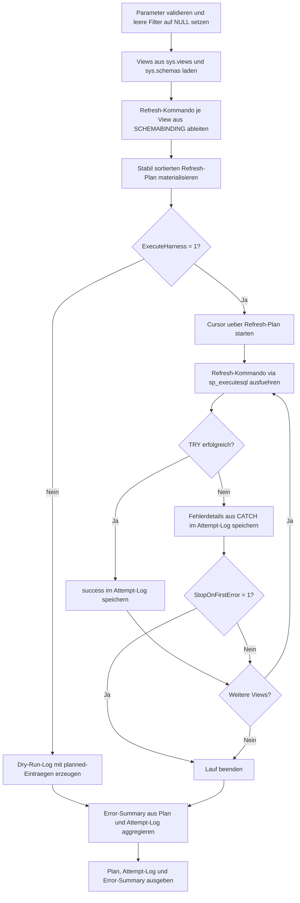

# ViewRefreshErrorHarness.sql

Dieses Skript liefert ein Fanggeruest fuer kontrollierte Refresh-Laeufe ueber mehrere Views. Es trennt bewusst zwischen Dry-Run und echter Ausfuehrung, damit der Refresh-Plan, die konkreten Kommandos und spaetere Fehlermeldungen in einer wiederholbaren Form sichtbar bleiben.

## Uebersicht

<!-- SQLDOC:SUMMARY_TABLE:BEGIN -->
| Feld | Wert |
|---|---|
| Script | [ViewRefreshErrorHarness.sql](ViewRefreshErrorHarness.sql) |
| Version | `1.0` |
| Typ | `template` |
| Kapitel | `22_Views_Schemata` |
| Sicherheit | `admin-change` |
| Zweck | Fanggeruest fuer Fehler beim Refresh mehrerer Views. |
<!-- SQLDOC:SUMMARY_TABLE:END -->

## Einordnung

Das Skript ist kein weiterer reiner Kandidatenreport, sondern ein operatives Harness fuer den naechsten Wartungsschritt. Zuerst wird aus den aktuell gefilterten Views ein stabil sortierter Refresh-Plan erzeugt. Danach werden die Kommandos entweder nur protokolliert oder kontrolliert ausgefuehrt, wobei Fehler pro View in einem separaten Versuchslog verbleiben.

## Annahmen

- Das Harness arbeitet auf Views der aktuellen Datenbank und leitet den Kommandotyp ueber `IsSchemaBound` ab.
- Standardmaessig bleibt der Lauf im Dry-Run; erst `@ExecuteHarness = 1` fuehrt `sp_refreshview` oder `sp_refreshsqlmodule` wirklich aus.
- Das Skript versucht keine automatische Fehlerbehebung, sondern sammelt Error-Nummern, Meldungen und betroffene Views fuer den Review.
- Die Reihenfolge folgt einer einfachen, stabilen Sortierung nach Schema und View-Name; fuer komplexe Abhaengigkeiten kann vorher ein Plan mit `ViewRefreshDependencyOrder.sql` sinnvoll sein.

## Anwendungsfall

Das Harness eignet sich fuer Wartungsfenster, Release-Checks und Trainingsumgebungen, in denen mehrere Views nacheinander refreshed werden sollen und Fehlversuche nachvollziehbar protokolliert werden muessen. Besonders hilfreich ist es, wenn ein Run entweder am ersten Fehler stoppen oder trotz Fehlern weiterlaufen soll.

## Parameter

<!-- SQLDOC:PARAMETERS_TABLE:BEGIN -->
| Parameter | SQL-Typ | Pflicht | Beschreibung |
|---|---|---|---|
| `@SchemaNameLike` | `SYSNAME` | Nein | Optionales LIKE-Muster fuer das Schema der zu betrachtenden Views. |
| `@ViewNameLike` | `SYSNAME` | Nein | Optionales LIKE-Muster fuer View-Namen im Harness-Lauf. |
| `@ExecuteHarness` | `BIT` | Nein | Fuehrt bei `1` die Refresh-Kommandos aus; `0` bleibt im Dry-Run. |
| `@StopOnFirstError` | `BIT` | Nein | Stoppt bei `1` den Lauf nach dem ersten protokollierten Refresh-Fehler. |
<!-- SQLDOC:PARAMETERS_TABLE:END -->

## Abhaengigkeiten

<!-- SQLDOC:DEPENDENCIES_LIST:BEGIN -->
- `sys.views`
- `sys.schemas`
- `sp_refreshview`
- `sp_refreshsqlmodule`
- `TRY...CATCH`
- `sp_executesql`
<!-- SQLDOC:DEPENDENCIES_LIST:END -->

## Hinweise

- Im Dry-Run wird je View ein `planned`-Eintrag erzeugt, damit Plan und spaeteres Laufprotokoll dieselbe Struktur behalten.
- Bei echter Ausfuehrung protokolliert das zweite Resultset Success- und Error-Zeilen inklusive `ERROR_NUMBER`, `ERROR_LINE` und `ERROR_MESSAGE`.
- `StopOnFirstError = 1` ist fuer vorsichtige Wartungslaeufe gedacht; `0` eignet sich eher fuer Bestandsaufnahmen mit mehreren bekannten Problem-Views.
- Fuer eine abhaengigkeitssensitive Reihenfolge kann der Plan dieses Harness vorab mit `ViewRefreshDependencyOrder.sql` abgeglichen werden.

## Versionshistorie

<!-- SQLDOC:VERSION_HISTORY_TABLE:BEGIN -->
| Version | Datum | User | Beschreibung |
|---|---|---|---|
| `1.0` | `2026-04-22` | `ER` | Erstversion des Fanggeruests fuer Refresh-Fehler ueber mehrere Views |
<!-- SQLDOC:VERSION_HISTORY_TABLE:END -->

## Ablauf

<!-- SQLDOC:MERMAID:BEGIN -->

<!-- SQLDOC:MERMAID:END -->

## SQL-Code

<!-- SQLDOC:SQL_CODE:BEGIN -->
```sql
/*
BEGIN:SQL-HEADER v1
---
sql_header: v1
script_name: "ViewRefreshErrorHarness.sql"
script_version: "1.0"
script_type: "template"
chapter: "22_Views_Schemata"

purpose: >
  Stellt ein Fanggeruest fuer Refresh-Laeufe ueber mehrere Views bereit.
  Das Skript baut aus Metadaten einen Refresh-Plan, fuehrt die Schritte
  optional kontrolliert aus und protokolliert Fehler, damit fehlgeschlagene
  Views, Error-Nummern und Abbruchpunkte fuer das Review sichtbar werden.

parameters:
  - name: "@SchemaNameLike"
    sql_type: "SYSNAME"
    direction: "IN"
    required: false
    description: "Optionales LIKE-Muster fuer das Schema der zu refreshenden Views"
  - name: "@ViewNameLike"
    sql_type: "SYSNAME"
    direction: "IN"
    required: false
    description: "Optionales LIKE-Muster fuer den Namen der zu refreshenden Views"
  - name: "@ExecuteHarness"
    sql_type: "BIT"
    direction: "IN"
    required: false
    description: "1 = Refresh-Kommandos kontrolliert ausfuehren, 0 = nur Plan und Vorschau erzeugen"
  - name: "@StopOnFirstError"
    sql_type: "BIT"
    direction: "IN"
    required: false
    description: "1 = Lauf nach dem ersten Refresh-Fehler stoppen"

result_sets:
  - name: "RefreshPlan"
    description: "Plan mit Reihenfolge, Kommandotyp und Dry-Run-Hinweisen je View"
  - name: "RefreshAttemptLog"
    description: "Protokoll mit Success-, Planned- oder Error-Eintrag je Schritt"
  - name: "RefreshErrorSummary"
    description: "Verdichtete Sicht auf Fehleranzahl, letzten Fehler und Laufmodus"

dependencies:
  - "sys.views"
  - "sys.schemas"
  - "sp_refreshview"
  - "sp_refreshsqlmodule"
  - "TRY...CATCH"
  - "sp_executesql"

safety:
  level: "admin-change"
  writes_data: false

documentation:
  markdown_file: "T-SQL/22_Views_Schemata/SQLScripts/ViewRefreshErrorHarness.md"
  sync_blocks:
    - "SUMMARY_TABLE"
    - "PARAMETERS_TABLE"
    - "DEPENDENCIES_LIST"
    - "VERSION_HISTORY_TABLE"
    - "SQL_CODE"
  mermaid:
    mode: "ai-agent-from-sql"
    source: "script-body"

main_responsible:
  name: "Erhard Rainer"
  initials: "ER"

version_history:
  - version: "1.0"
    date: "2026-04-22"
    user: "ER"
    description: "Erstversion des Fanggeruests fuer Refresh-Fehler ueber mehrere Views"

notes:
  - "Der Lauf bleibt standardmaessig im Dry-Run und fuehrt nur bei @ExecuteHarness = 1 Refresh-Kommandos aus."
  - "Fehler werden je Schritt protokolliert, damit betroffene Views und Error-Nummern fuer den Review sichtbar bleiben."
---
END:SQL-HEADER v1
*/

SET NOCOUNT ON;

DECLARE @SchemaNameLike SYSNAME = NULL;
DECLARE @ViewNameLike SYSNAME = NULL;
DECLARE @ExecuteHarness BIT = 0;
DECLARE @StopOnFirstError BIT = 1;

IF @ExecuteHarness NOT IN (0, 1)
BEGIN
    THROW 50100, '@ExecuteHarness muss 0 oder 1 sein.', 1;
END;

IF @StopOnFirstError NOT IN (0, 1)
BEGIN
    THROW 50101, '@StopOnFirstError muss 0 oder 1 sein.', 1;
END;

IF @SchemaNameLike IS NOT NULL AND LTRIM(RTRIM(@SchemaNameLike)) = ''
BEGIN
    SET @SchemaNameLike = NULL;
END;

IF @ViewNameLike IS NOT NULL AND LTRIM(RTRIM(@ViewNameLike)) = ''
BEGIN
    SET @ViewNameLike = NULL;
END;

DROP TABLE IF EXISTS #ViewInventory;
DROP TABLE IF EXISTS #RefreshPlan;
DROP TABLE IF EXISTS #RefreshAttemptLog;
DROP TABLE IF EXISTS #RefreshErrorSummary;

CREATE TABLE #ViewInventory
(
    plan_order             INT             NOT NULL,
    view_object_id         INT             NOT NULL,
    schema_name            SYSNAME         NOT NULL,
    view_name              SYSNAME         NOT NULL,
    full_view_name         NVARCHAR(517)   NOT NULL,
    uses_schemabinding     BIT             NOT NULL,
    refresh_command_type   NVARCHAR(40)    NOT NULL,
    refresh_command        NVARCHAR(700)   NOT NULL
);

INSERT INTO #ViewInventory
(
    plan_order,
    view_object_id,
    schema_name,
    view_name,
    full_view_name,
    uses_schemabinding,
    refresh_command_type,
    refresh_command
)
SELECT
    ROW_NUMBER() OVER (ORDER BY s.name, v.name) AS plan_order,
    v.object_id,
    s.name AS schema_name,
    v.name AS view_name,
    QUOTENAME(s.name) + N'.' + QUOTENAME(v.name) AS full_view_name,
    CONVERT(BIT, OBJECTPROPERTY(v.object_id, 'IsSchemaBound')) AS uses_schemabinding,
    CASE
        WHEN OBJECTPROPERTY(v.object_id, 'IsSchemaBound') = 1 THEN 'sp_refreshsqlmodule'
        ELSE 'sp_refreshview'
    END AS refresh_command_type,
    CASE
        WHEN OBJECTPROPERTY(v.object_id, 'IsSchemaBound') = 1 THEN
            N'EXEC sys.sp_refreshsqlmodule N'''
            + REPLACE(QUOTENAME(s.name) + N'.' + QUOTENAME(v.name), '''', '''''')
            + N''';'
        ELSE
            N'EXEC sys.sp_refreshview N'''
            + REPLACE(QUOTENAME(s.name) + N'.' + QUOTENAME(v.name), '''', '''''')
            + N''';'
    END AS refresh_command
FROM sys.views AS v
INNER JOIN sys.schemas AS s
    ON s.schema_id = v.schema_id
WHERE (@SchemaNameLike IS NULL OR s.name LIKE @SchemaNameLike)
  AND (@ViewNameLike IS NULL OR v.name LIKE @ViewNameLike);

IF NOT EXISTS
(
    SELECT 1
    FROM #ViewInventory
)
BEGIN
    THROW 50102, 'Keine Views fuer das angegebene Filterset gefunden.', 1;
END;

CREATE TABLE #RefreshPlan
(
    plan_order               INT             NOT NULL,
    full_view_name           NVARCHAR(517)   NOT NULL,
    refresh_command_type     NVARCHAR(40)    NOT NULL,
    execute_mode             NVARCHAR(20)    NOT NULL,
    stop_on_first_error      BIT             NOT NULL,
    recommended_action       NVARCHAR(260)   NOT NULL,
    refresh_command          NVARCHAR(700)   NOT NULL
);

INSERT INTO #RefreshPlan
(
    plan_order,
    full_view_name,
    refresh_command_type,
    execute_mode,
    stop_on_first_error,
    recommended_action,
    refresh_command
)
SELECT
    vi.plan_order,
    vi.full_view_name,
    vi.refresh_command_type,
    CASE
        WHEN @ExecuteHarness = 1 THEN 'execute'
        ELSE 'dry-run'
    END AS execute_mode,
    @StopOnFirstError AS stop_on_first_error,
    CASE
        WHEN @ExecuteHarness = 1 AND @StopOnFirstError = 1 THEN 'Kontrollierter Refresh-Lauf mit Abbruch beim ersten Fehler.'
        WHEN @ExecuteHarness = 1 THEN 'Kontrollierter Refresh-Lauf mit Fehlerprotokoll auch nach Fehlversuchen.'
        ELSE 'Dry-Run pruefen, anschliessend bei Bedarf @ExecuteHarness = 1 setzen.'
    END AS recommended_action,
    vi.refresh_command
FROM #ViewInventory AS vi;

CREATE TABLE #RefreshAttemptLog
(
    plan_order               INT             NOT NULL,
    full_view_name           NVARCHAR(517)   NOT NULL,
    refresh_command_type     NVARCHAR(40)    NOT NULL,
    refresh_command          NVARCHAR(700)   NOT NULL,
    attempt_status           NVARCHAR(20)    NOT NULL,
    error_number             INT             NULL,
    error_severity           INT             NULL,
    error_state              INT             NULL,
    error_line               INT             NULL,
    error_procedure          NVARCHAR(126)   NULL,
    error_message            NVARCHAR(4000)  NULL,
    attempted_at             DATETIME2(0)    NOT NULL
);

IF @ExecuteHarness = 0
BEGIN
    INSERT INTO #RefreshAttemptLog
    (
        plan_order,
        full_view_name,
        refresh_command_type,
        refresh_command,
        attempt_status,
        error_number,
        error_severity,
        error_state,
        error_line,
        error_procedure,
        error_message,
        attempted_at
    )
    SELECT
        rp.plan_order,
        rp.full_view_name,
        rp.refresh_command_type,
        rp.refresh_command,
        'planned',
        NULL,
        NULL,
        NULL,
        NULL,
        NULL,
        N'Dry-Run: kein Refresh ausgefuehrt.',
        SYSDATETIME()
    FROM #RefreshPlan AS rp;
END;
ELSE
BEGIN
    DECLARE @PlanOrder INT;
    DECLARE @FullViewName NVARCHAR(517);
    DECLARE @RefreshCommandType NVARCHAR(40);
    DECLARE @RefreshCommand NVARCHAR(700);
    DECLARE @Continue BIT = 1;

    DECLARE refresh_cursor CURSOR LOCAL FAST_FORWARD FOR
        SELECT
            rp.plan_order,
            rp.full_view_name,
            rp.refresh_command_type,
            rp.refresh_command
        FROM #RefreshPlan AS rp
        ORDER BY rp.plan_order;

    OPEN refresh_cursor;

    FETCH NEXT FROM refresh_cursor
    INTO @PlanOrder, @FullViewName, @RefreshCommandType, @RefreshCommand;

    WHILE @@FETCH_STATUS = 0 AND @Continue = 1
    BEGIN
        BEGIN TRY
            EXEC sys.sp_executesql @RefreshCommand;

            INSERT INTO #RefreshAttemptLog
            (
                plan_order,
                full_view_name,
                refresh_command_type,
                refresh_command,
                attempt_status,
                error_number,
                error_severity,
                error_state,
                error_line,
                error_procedure,
                error_message,
                attempted_at
            )
            VALUES
            (
                @PlanOrder,
                @FullViewName,
                @RefreshCommandType,
                @RefreshCommand,
                'success',
                NULL,
                NULL,
                NULL,
                NULL,
                NULL,
                N'Refresh erfolgreich ausgefuehrt.',
                SYSDATETIME()
            );
        END TRY
        BEGIN CATCH
            INSERT INTO #RefreshAttemptLog
            (
                plan_order,
                full_view_name,
                refresh_command_type,
                refresh_command,
                attempt_status,
                error_number,
                error_severity,
                error_state,
                error_line,
                error_procedure,
                error_message,
                attempted_at
            )
            VALUES
            (
                @PlanOrder,
                @FullViewName,
                @RefreshCommandType,
                @RefreshCommand,
                'error',
                ERROR_NUMBER(),
                ERROR_SEVERITY(),
                ERROR_STATE(),
                ERROR_LINE(),
                ERROR_PROCEDURE(),
                ERROR_MESSAGE(),
                SYSDATETIME()
            );

            IF @StopOnFirstError = 1
            BEGIN
                SET @Continue = 0;
            END;
        END CATCH;

        FETCH NEXT FROM refresh_cursor
        INTO @PlanOrder, @FullViewName, @RefreshCommandType, @RefreshCommand;
    END;

    CLOSE refresh_cursor;
    DEALLOCATE refresh_cursor;
END;

CREATE TABLE #RefreshErrorSummary
(
    execute_mode               NVARCHAR(20)    NOT NULL,
    stop_on_first_error        BIT             NOT NULL,
    planned_views              INT             NOT NULL,
    attempted_views            INT             NOT NULL,
    successful_refreshes       INT             NOT NULL,
    failed_refreshes           INT             NOT NULL,
    last_failed_view           NVARCHAR(517)   NULL,
    last_error_number          INT             NULL,
    summary_note               NVARCHAR(260)   NOT NULL
);

INSERT INTO #RefreshErrorSummary
(
    execute_mode,
    stop_on_first_error,
    planned_views,
    attempted_views,
    successful_refreshes,
    failed_refreshes,
    last_failed_view,
    last_error_number,
    summary_note
)
SELECT
    CASE
        WHEN @ExecuteHarness = 1 THEN 'execute'
        ELSE 'dry-run'
    END AS execute_mode,
    @StopOnFirstError AS stop_on_first_error,
    (SELECT COUNT(*) FROM #RefreshPlan) AS planned_views,
    (SELECT COUNT(*) FROM #RefreshAttemptLog) AS attempted_views,
    SUM(CASE WHEN ral.attempt_status = 'success' THEN 1 ELSE 0 END) AS successful_refreshes,
    SUM(CASE WHEN ral.attempt_status = 'error' THEN 1 ELSE 0 END) AS failed_refreshes,
    MAX(CASE WHEN last_error.rn = 1 THEN last_error.full_view_name END) AS last_failed_view,
    MAX(CASE WHEN last_error.rn = 1 THEN last_error.error_number END) AS last_error_number,
    CASE
        WHEN @ExecuteHarness = 0 THEN 'Dry-Run abgeschlossen; Kommandos vor produktivem Einsatz pruefen.'
        WHEN SUM(CASE WHEN ral.attempt_status = 'error' THEN 1 ELSE 0 END) = 0 THEN 'Refresh-Lauf ohne protokollierte Fehler abgeschlossen.'
        WHEN @StopOnFirstError = 1 THEN 'Refresh-Lauf beim ersten Fehler gestoppt; letzte Fehlerzeile fuer den Review nutzen.'
        ELSE 'Refresh-Lauf trotz Fehlern fortgesetzt; Error-Log je View pruefen.'
    END AS summary_note
FROM #RefreshAttemptLog AS ral
OUTER APPLY
(
    SELECT TOP (1)
        sub.full_view_name,
        sub.error_number,
        1 AS rn
    FROM #RefreshAttemptLog AS sub
    WHERE sub.attempt_status = 'error'
    ORDER BY sub.plan_order DESC, sub.attempted_at DESC
) AS last_error;

SELECT
    rp.plan_order AS PlanOrder,
    rp.full_view_name AS ViewName,
    rp.refresh_command_type AS RefreshCommandType,
    rp.execute_mode AS ExecuteMode,
    rp.stop_on_first_error AS StopOnFirstError,
    rp.recommended_action AS RecommendedAction,
    rp.refresh_command AS RefreshCommand
FROM #RefreshPlan AS rp
ORDER BY rp.plan_order;

SELECT
    ral.plan_order AS PlanOrder,
    ral.full_view_name AS ViewName,
    ral.refresh_command_type AS RefreshCommandType,
    ral.attempt_status AS AttemptStatus,
    ral.error_number AS ErrorNumber,
    ral.error_severity AS ErrorSeverity,
    ral.error_state AS ErrorState,
    ral.error_line AS ErrorLine,
    ral.error_procedure AS ErrorProcedure,
    ral.error_message AS ErrorMessage,
    ral.attempted_at AS AttemptedAt,
    ral.refresh_command AS RefreshCommand
FROM #RefreshAttemptLog AS ral
ORDER BY ral.plan_order;

SELECT
    res.execute_mode AS ExecuteMode,
    res.stop_on_first_error AS StopOnFirstError,
    res.planned_views AS PlannedViews,
    res.attempted_views AS AttemptedViews,
    res.successful_refreshes AS SuccessfulRefreshes,
    res.failed_refreshes AS FailedRefreshes,
    res.last_failed_view AS LastFailedView,
    res.last_error_number AS LastErrorNumber,
    res.summary_note AS SummaryNote
FROM #RefreshErrorSummary AS res;
```
<!-- SQLDOC:SQL_CODE:END -->
