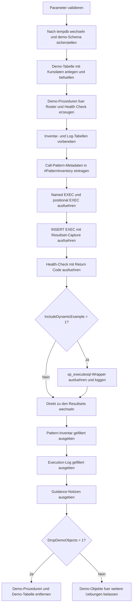

# ProcedureCallPatternInventory.sql

Dieses Skript inventarisiert typische Aufrufmuster fuer Stored Procedures anhand zweier Demo-Prozeduren in `tempdb`. Dabei werden unterschiedliche Rueckgabekanaele wie Resultsets, Output-Parameter, Return Codes und `INSERT ... EXEC` in einer didaktischen Erstversion nebeneinandergestellt.

## Uebersicht

<!-- SQLDOC:SUMMARY_TABLE:BEGIN -->
| Feld | Wert |
|---|---|
| Script | [ProcedureCallPatternInventory.sql](ProcedureCallPatternInventory.sql) |
| Version | `1.0` |
| Typ | `didactic-lab` |
| Kapitel | `23_StoredProcedures` |
| Sicherheit | `demo-write-tempdb` |
| Zweck | Inventarisiert typische Stored-Procedure-Aufrufmuster inklusive Rueckgabekanaelen und Beispielsyntax. |
<!-- SQLDOC:SUMMARY_TABLE:END -->

## Einordnung

Der Schwerpunkt liegt auf einem kompakten Ueberblick ueber gaengige Aufrufarten in T-SQL. Das Skript zeigt nicht nur die Syntax, sondern fuehrt die Muster mit Demo-Prozeduren direkt aus und protokolliert beobachtete Rueckgaben fuer einen schnellen Vergleich.

## Annahmen

- Es handelt sich um eine didaktische Erstversion mit Demo-Prozeduren und Demo-Daten in `tempdb`.
- Die Auswahl deckt typische Trainingsmuster ab: benannte Parameter, Positionsparameter, `INSERT ... EXEC`, Return Codes und optional `sp_executesql`.
- Dynamische Aufrufe werden ausschliesslich parametrisiert gezeigt; unsichere String-Konkatenation ist absichtlich kein Beispiel.
- Return Codes werden hier als kompakte Statussignale verwendet, waehrend fachliche Details ueber Resultsets oder Output-Parameter sichtbar bleiben.

## Anwendungsfall

Das Skript eignet sich fuer Kapitelabschnitte, in denen Stored Procedures als Schnittstelle und Aufruferkontrakt behandelt werden. Lernende koennen schnell sehen, welches Aufrufmuster fuer Lesbarkeit, Folgeabfragen oder Statusmeldungen sinnvoll ist und welche Trade-offs dabei entstehen.

## Parameter

<!-- SQLDOC:PARAMETERS_TABLE:BEGIN -->
| Parameter | SQL-Typ | Pflicht | Beschreibung |
|---|---|---|---|
| `@ScenarioFilter` | `NVARCHAR(50)` | Nein | LIKE-Filter fuer die aufzunehmenden Call-Pattern-Namen. |
| `@IncludeDynamicExample` | `BIT` | Nein | Nimmt bei `1` das Beispiel mit `sp_executesql` und Parameterweitergabe auf. |
| `@DropDemoObjects` | `BIT` | Nein | Entfernt Demo-Prozeduren und Demo-Tabelle am Ende wieder aus `tempdb`, wenn `1`. |
<!-- SQLDOC:PARAMETERS_TABLE:END -->

## Abhaengigkeiten

<!-- SQLDOC:DEPENDENCIES_LIST:BEGIN -->
- `tempdb`
- `sys.schemas`
- `CREATE OR ALTER PROCEDURE`
- `sp_executesql`
- `INSERT EXEC`
<!-- SQLDOC:DEPENDENCIES_LIST:END -->

## Hinweise

- Das erste Resultset ist das eigentliche Inventar und beschreibt pro Muster die wichtigsten Eigenschaften und eine sofort nutzbare Beispielsyntax.
- Das zweite Resultset protokolliert, welche Demo-Aufrufe im Skript wirklich ausgefuehrt wurden und welche Rueckgabewerte dabei sichtbar waren.
- Die Guidance-Ausgabe am Ende eignet sich als kompakte Entscheidungsstarthilfe fuer Reviews oder Unterrichtsgespräche.

## Versionshistorie

<!-- SQLDOC:VERSION_HISTORY_TABLE:BEGIN -->
| Version | Datum | User | Beschreibung |
|---|---|---|---|
| `1.0` | `2026-04-22` | `ER` | Erstversion des didaktischen Inventars fuer typische Procedure-Aufrufmuster |
<!-- SQLDOC:VERSION_HISTORY_TABLE:END -->

## Ablauf

<!-- SQLDOC:MERMAID:BEGIN -->

<!-- SQLDOC:MERMAID:END -->

## SQL-Code

<!-- SQLDOC:SQL_CODE:BEGIN -->
```sql
/*
BEGIN:SQL-HEADER v1
---
sql_header: v1
script_name: "ProcedureCallPatternInventory.sql"
script_version: "1.0"
script_type: "didactic-lab"
chapter: "23_StoredProcedures"

purpose: >
  Demonstriert typische Aufrufmuster fuer Stored Procedures in T-SQL,
  fuehrt sie mit Demo-Prozeduren in tempdb aus und inventarisiert dabei
  Parameterstil, Rueckgabekanaele und praktische Hinweise je Aufrufart.

parameters:
  - name: "@ScenarioFilter"
    sql_type: "NVARCHAR(50)"
    direction: "IN"
    required: false
    description: "LIKE-Filter fuer die aufzunehmenden Call-Pattern-Namen"
  - name: "@IncludeDynamicExample"
    sql_type: "BIT"
    direction: "IN"
    required: false
    description: "1 = das Beispiel mit sp_executesql und Parameterweitergabe aufnehmen"
  - name: "@DropDemoObjects"
    sql_type: "BIT"
    direction: "IN"
    required: false
    description: "1 = Demo-Prozeduren und Demo-Tabelle am Ende wieder aus tempdb entfernen"

result_sets:
  - name: "ProcedureCallPatternInventory"
    description: "Inventar typischer Aufrufmuster mit Merkmalen und Beispielsyntax"
  - name: "ProcedureCallPatternExecutionLog"
    description: "Ausgefuehrte Demo-Aufrufe mit beobachteten Rueckgabewerten und Kurznotizen"
  - name: "ProcedureCallPatternGuidance"
    description: "Didaktische Hinweise zur Auswahl eines passenden Aufrufmusters"

dependencies:
  - "tempdb"
  - "sys.schemas"
  - "CREATE OR ALTER PROCEDURE"
  - "sp_executesql"
  - "INSERT EXEC"

safety:
  level: "demo-write-tempdb"
  writes_data: true

documentation:
  markdown_file: "T-SQL/23_StoredProcedures/SQLScripts/ProcedureCallPatternInventory.md"
  sync_blocks:
    - "SUMMARY_TABLE"
    - "PARAMETERS_TABLE"
    - "DEPENDENCIES_LIST"
    - "VERSION_HISTORY_TABLE"
    - "SQL_CODE"
  mermaid:
    mode: "ai-agent-from-sql"
    source: "script-body"

main_responsible:
  name: "Erhard Rainer"
  initials: "ER"

version_history:
  - version: "1.0"
    date: "2026-04-22"
    user: "ER"
    description: "Erstversion des didaktischen Inventars fuer typische Procedure-Aufrufmuster"

notes:
  - "Alle Demo-Objekte werden ausschliesslich in tempdb angelegt"
  - "Die Beispielszenarien zeigen bewusst unterschiedliche Rueckgabekanaele wie Resultsets, Output-Parameter und Return Codes"
---
END:SQL-HEADER v1
*/

SET NOCOUNT ON;

DECLARE @ScenarioFilter NVARCHAR(50) = N'%';
DECLARE @IncludeDynamicExample BIT = 1;
DECLARE @DropDemoObjects BIT = 1;

IF NULLIF(LTRIM(RTRIM(@ScenarioFilter)), N'') IS NULL
BEGIN
    THROW 50000, '@ScenarioFilter darf nicht leer sein.', 1;
END;

IF @IncludeDynamicExample NOT IN (0, 1)
BEGIN
    THROW 50001, '@IncludeDynamicExample muss 0 oder 1 sein.', 1;
END;

IF @DropDemoObjects NOT IN (0, 1)
BEGIN
    THROW 50002, '@DropDemoObjects muss 0 oder 1 sein.', 1;
END;

USE tempdb;

IF NOT EXISTS
(
    SELECT 1
    FROM sys.schemas
    WHERE name = N'demo'
)
BEGIN
    EXEC(N'CREATE SCHEMA demo AUTHORIZATION dbo;');
END;

DROP PROCEDURE IF EXISTS demo.usp_CallPatternRoster;
DROP PROCEDURE IF EXISTS demo.usp_CallPatternHealthCheck;
DROP TABLE IF EXISTS demo.ProcedureCallPatternSample;

CREATE TABLE demo.ProcedureCallPatternSample
(
    EnrollmentID     INT           NOT NULL PRIMARY KEY,
    CourseCode       NVARCHAR(20)  NOT NULL,
    TermCode         NVARCHAR(20)  NOT NULL,
    StudentCount     INT           NOT NULL,
    CompletionRate   DECIMAL(5,2)  NOT NULL,
    IsActive         BIT           NOT NULL,
    LastReviewDate   DATE          NOT NULL
);

INSERT INTO demo.ProcedureCallPatternSample
(
    EnrollmentID,
    CourseCode,
    TermCode,
    StudentCount,
    CompletionRate,
    IsActive,
    LastReviewDate
)
VALUES
    (101, N'DB100',  N'2026Q1', 28, 92.50, 1, '2026-03-05'),
    (102, N'DB100',  N'2026Q2', 31, 88.10, 1, '2026-04-12'),
    (103, N'DB100',  N'2025Q4', 26, 81.40, 0, '2025-12-18'),
    (201, N'ETL200', N'2026Q1', 19, 86.75, 1, '2026-03-20'),
    (202, N'ETL200', N'2026Q2', 22, 79.20, 1, '2026-04-10'),
    (301, N'API310', N'2026Q1', 24, 95.00, 1, '2026-03-28');

EXEC sys.sp_executesql
N'
CREATE OR ALTER PROCEDURE demo.usp_CallPatternRoster
    @CourseCode NVARCHAR(20),
    @MinimumStudentCount INT = 0,
    @RowsReturned INT OUTPUT
AS
BEGIN
    SET NOCOUNT ON;

    SELECT
        sample.EnrollmentID,
        sample.CourseCode,
        sample.TermCode,
        sample.StudentCount,
        sample.CompletionRate,
        sample.LastReviewDate
    FROM demo.ProcedureCallPatternSample AS sample
    WHERE sample.CourseCode = @CourseCode
      AND sample.StudentCount >= @MinimumStudentCount
    ORDER BY
        sample.StudentCount DESC,
        sample.EnrollmentID;

    SET @RowsReturned = @@ROWCOUNT;
END;
';

EXEC sys.sp_executesql
N'
CREATE OR ALTER PROCEDURE demo.usp_CallPatternHealthCheck
    @OnlyActive BIT = 1,
    @WarningThreshold DECIMAL(5,2) = 85.00
AS
BEGIN
    SET NOCOUNT ON;

    IF EXISTS
    (
        SELECT 1
        FROM demo.ProcedureCallPatternSample AS sample
        WHERE (@OnlyActive = 0 OR sample.IsActive = 1)
          AND sample.CompletionRate < @WarningThreshold
    )
    BEGIN
        SELECT
            sample.CourseCode,
            sample.TermCode,
            sample.CompletionRate,
            sample.IsActive
        FROM demo.ProcedureCallPatternSample AS sample
        WHERE (@OnlyActive = 0 OR sample.IsActive = 1)
          AND sample.CompletionRate < @WarningThreshold
        ORDER BY
            sample.CompletionRate,
            sample.CourseCode;

        RETURN 1;
    END;

    SELECT
        sample.CourseCode,
        sample.TermCode,
        sample.CompletionRate,
        sample.IsActive
    FROM demo.ProcedureCallPatternSample AS sample
    WHERE (@OnlyActive = 0 OR sample.IsActive = 1)
    ORDER BY
        sample.CourseCode,
        sample.TermCode;

    RETURN 0;
END;
';

DROP TABLE IF EXISTS #PatternInventory;
DROP TABLE IF EXISTS #ExecutionLog;
DROP TABLE IF EXISTS #InsertExecCapture;

CREATE TABLE #PatternInventory
(
    PatternName            NVARCHAR(80)   NOT NULL PRIMARY KEY,
    CallStyle              NVARCHAR(80)   NOT NULL,
    ExampleSyntax          NVARCHAR(400)  NOT NULL,
    UsesNamedParameters    BIT            NOT NULL,
    UsesPositionalParams   BIT            NOT NULL,
    UsesOutputParameter    BIT            NOT NULL,
    UsesReturnCode         BIT            NOT NULL,
    CapturesResultSet      BIT            NOT NULL,
    RequiresDynamicSql     BIT            NOT NULL,
    RecommendedFor         NVARCHAR(200)  NOT NULL
);

CREATE TABLE #ExecutionLog
(
    LogOrder               INT            NOT NULL IDENTITY(1,1) PRIMARY KEY,
    PatternName            NVARCHAR(80)   NOT NULL,
    ProcedureName          NVARCHAR(256)  NOT NULL,
    ObservedRows           INT            NULL,
    ReturnCode             INT            NULL,
    Notes                  NVARCHAR(200)  NOT NULL
);

CREATE TABLE #InsertExecCapture
(
    EnrollmentID           INT            NOT NULL,
    CourseCode             NVARCHAR(20)   NOT NULL,
    TermCode               NVARCHAR(20)   NOT NULL,
    StudentCount           INT            NOT NULL,
    CompletionRate         DECIMAL(5,2)   NOT NULL,
    LastReviewDate         DATE           NOT NULL
);

DECLARE @RowsReturned INT = NULL;
DECLARE @ReturnCode INT = NULL;
DECLARE @DynamicSql NVARCHAR(MAX) = NULL;

INSERT INTO #PatternInventory
(
    PatternName,
    CallStyle,
    ExampleSyntax,
    UsesNamedParameters,
    UsesPositionalParams,
    UsesOutputParameter,
    UsesReturnCode,
    CapturesResultSet,
    RequiresDynamicSql,
    RecommendedFor
)
VALUES
    (
        N'NamedExecWithOutput',
        N'EXEC mit benannten Parametern',
        N'EXEC demo.usp_CallPatternRoster @CourseCode = N''DB100'', @MinimumStudentCount = 20, @RowsReturned = @RowsReturned OUTPUT;',
        1,
        0,
        1,
        0,
        0,
        0,
        N'Lesbare Aufrufe mit mehreren optionalen Parametern und Output-Kanal'
    ),
    (
        N'PositionalExec',
        N'EXEC mit Positionsparametern',
        N'EXEC demo.usp_CallPatternRoster N''ETL200'', 15, @RowsReturned OUTPUT;',
        0,
        1,
        1,
        0,
        0,
        0,
        N'Kurze Demo-Aufrufe, wenn die Reihenfolge stabil und gut bekannt ist'
    ),
    (
        N'InsertExecCapture',
        N'INSERT ... EXEC',
        N'INSERT INTO #InsertExecCapture EXEC demo.usp_CallPatternRoster @CourseCode = N''DB100'', @MinimumStudentCount = 20, @RowsReturned = @RowsReturned OUTPUT;',
        1,
        0,
        1,
        0,
        1,
        0,
        N'Weiterverarbeitung eines Resultsets innerhalb desselben Skripts'
    ),
    (
        N'ReturnCodeCheck',
        N'EXEC mit Return Code',
        N'EXEC @ReturnCode = demo.usp_CallPatternHealthCheck @OnlyActive = 1, @WarningThreshold = 85.00;',
        1,
        0,
        0,
        1,
        0,
        0,
        N'Schnelle Statusrueckmeldungen fuer Erfolg, Warnung oder Fehlerpfade'
    );

IF @IncludeDynamicExample = 1
BEGIN
    INSERT INTO #PatternInventory
    (
        PatternName,
        CallStyle,
        ExampleSyntax,
        UsesNamedParameters,
        UsesPositionalParams,
        UsesOutputParameter,
        UsesReturnCode,
        CapturesResultSet,
        RequiresDynamicSql,
        RecommendedFor
    )
    VALUES
    (
        N'SpExecuteSqlWrapper',
        N'sp_executesql mit Parameterweitergabe',
        N'EXEC sys.sp_executesql N''EXEC demo.usp_CallPatternRoster @CourseCode = @CourseCode, @MinimumStudentCount = @MinimumStudentCount, @RowsReturned = @RowsReturned OUTPUT;'', N''@CourseCode NVARCHAR(20), @MinimumStudentCount INT, @RowsReturned INT OUTPUT'', @CourseCode = N''API310'', @MinimumStudentCount = 10, @RowsReturned = @RowsReturned OUTPUT;',
        1,
        0,
        1,
        0,
        0,
        1,
        N'Dynamische Huelle mit kontrollierter Parameterisierung statt String-Konkatenation'
    );
END;

SET @RowsReturned = NULL;
EXEC demo.usp_CallPatternRoster
    @CourseCode = N'DB100',
    @MinimumStudentCount = 20,
    @RowsReturned = @RowsReturned OUTPUT;

INSERT INTO #ExecutionLog
(
    PatternName,
    ProcedureName,
    ObservedRows,
    ReturnCode,
    Notes
)
VALUES
(
    N'NamedExecWithOutput',
    N'demo.usp_CallPatternRoster',
    @RowsReturned,
    NULL,
    N'Benannte Parameter machen den Aufruf trotz Output-Parameter direkt lesbar.'
);

SET @RowsReturned = NULL;
EXEC demo.usp_CallPatternRoster
    N'ETL200',
    15,
    @RowsReturned OUTPUT;

INSERT INTO #ExecutionLog
(
    PatternName,
    ProcedureName,
    ObservedRows,
    ReturnCode,
    Notes
)
VALUES
(
    N'PositionalExec',
    N'demo.usp_CallPatternRoster',
    @RowsReturned,
    NULL,
    N'Positionsparameter sparen Schreibaufwand, sind aber bei spaeteren Signaturwechseln fragiler.'
);

SET @RowsReturned = NULL;
INSERT INTO #InsertExecCapture
(
    EnrollmentID,
    CourseCode,
    TermCode,
    StudentCount,
    CompletionRate,
    LastReviewDate
)
EXEC demo.usp_CallPatternRoster
    @CourseCode = N'DB100',
    @MinimumStudentCount = 20,
    @RowsReturned = @RowsReturned OUTPUT;

INSERT INTO #ExecutionLog
(
    PatternName,
    ProcedureName,
    ObservedRows,
    ReturnCode,
    Notes
)
SELECT
    N'InsertExecCapture',
    N'demo.usp_CallPatternRoster',
    COUNT(*),
    NULL,
    N'Resultset wurde in eine Temp-Tabelle uebernommen und steht fuer Folgeabfragen bereit.'
FROM #InsertExecCapture;

SET @ReturnCode = NULL;
EXEC @ReturnCode = demo.usp_CallPatternHealthCheck
    @OnlyActive = 1,
    @WarningThreshold = 85.00;

INSERT INTO #ExecutionLog
(
    PatternName,
    ProcedureName,
    ObservedRows,
    ReturnCode,
    Notes
)
VALUES
(
    N'ReturnCodeCheck',
    N'demo.usp_CallPatternHealthCheck',
    NULL,
    @ReturnCode,
    N'Return Code 1 signalisiert mindestens einen Warnfall unterhalb des Schwellenwerts.'
);

IF @IncludeDynamicExample = 1
BEGIN
    SET @RowsReturned = NULL;
    SET @DynamicSql = N'
        EXEC demo.usp_CallPatternRoster
            @CourseCode = @CourseCode,
            @MinimumStudentCount = @MinimumStudentCount,
            @RowsReturned = @RowsReturned OUTPUT;
    ';

    EXEC sys.sp_executesql
        @DynamicSql,
        N'@CourseCode NVARCHAR(20), @MinimumStudentCount INT, @RowsReturned INT OUTPUT',
        @CourseCode = N'API310',
        @MinimumStudentCount = 10,
        @RowsReturned = @RowsReturned OUTPUT;

    INSERT INTO #ExecutionLog
    (
        PatternName,
        ProcedureName,
        ObservedRows,
        ReturnCode,
        Notes
    )
    VALUES
    (
        N'SpExecuteSqlWrapper',
        N'demo.usp_CallPatternRoster',
        @RowsReturned,
        NULL,
        N'Dynamischer Wrapper bleibt parametriert und vermeidet unnoetige String-Konkatenation.'
    );
END;

SELECT
    inventory.PatternName,
    inventory.CallStyle,
    inventory.UsesNamedParameters,
    inventory.UsesPositionalParams,
    inventory.UsesOutputParameter,
    inventory.UsesReturnCode,
    inventory.CapturesResultSet,
    inventory.RequiresDynamicSql,
    inventory.RecommendedFor,
    inventory.ExampleSyntax
FROM #PatternInventory AS inventory
WHERE inventory.PatternName LIKE @ScenarioFilter
ORDER BY
    inventory.PatternName;

SELECT
    log.LogOrder,
    log.PatternName,
    log.ProcedureName,
    log.ObservedRows,
    log.ReturnCode,
    log.Notes
FROM #ExecutionLog AS log
WHERE log.PatternName LIKE @ScenarioFilter
ORDER BY
    log.LogOrder;

SELECT
    NoteOrder,
    NoteTitle,
    NoteText
FROM
(
    VALUES
        (1, N'Benannte Parameter bevorzugen', N'Benannte Parameter bleiben meist robuster, wenn Prozeduren viele optionale Parameter oder Output-Werte besitzen.'),
        (2, N'INSERT EXEC gezielt einsetzen', N'INSERT ... EXEC eignet sich fuer Folgeanalysen im selben Batch, koppelt den Aufrufer aber an die Form des Resultsets.'),
        (3, N'Return Codes knapp halten', N'Return Codes transportieren am besten kompakte Statusinformationen; fachliche Details gehoeren eher in Resultsets oder Output-Parameter.'),
        (4, N'Dynamische Huelle parametrieren', N'Wenn Aufrufmuster dynamisch zusammengesetzt werden muessen, ist sp_executesql mit Parametern der sichere Standard.')
) AS notes(NoteOrder, NoteTitle, NoteText)
ORDER BY
    NoteOrder;

IF @DropDemoObjects = 1
BEGIN
    DROP PROCEDURE IF EXISTS demo.usp_CallPatternRoster;
    DROP PROCEDURE IF EXISTS demo.usp_CallPatternHealthCheck;
    DROP TABLE IF EXISTS demo.ProcedureCallPatternSample;
END;
```
<!-- SQLDOC:SQL_CODE:END -->
