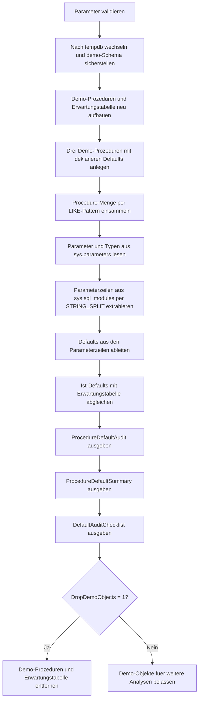

# ProcedureDefaultParameterAudit.sql

Dieses Skript baut in `tempdb` drei Demo-Prozeduren mit dokumentierten Default-Parametern auf und gleicht deren deklarierte Standardwerte gegen eine didaktische Erwartungstabelle ab. Dadurch werden fehlende, unerwartete oder abweichende Defaults sichtbar, ohne produktive Stored Procedures anfassen zu muessen.

## Uebersicht

<!-- SQLDOC:SUMMARY_TABLE:BEGIN -->
| Feld | Wert |
|---|---|
| Script | [ProcedureDefaultParameterAudit.sql](ProcedureDefaultParameterAudit.sql) |
| Version | `1.0` |
| Typ | `didactic-lab` |
| Kapitel | `23_StoredProcedures` |
| Sicherheit | `demo-write-tempdb` |
| Zweck | Listet Default-Parameterwerte und moegliche Inkonsistenzen in einem didaktischen Audit auf. |
<!-- SQLDOC:SUMMARY_TABLE:END -->

## Einordnung

Der Fokus liegt auf Stored Procedures als wartbare Schnittstellen. Default-Parameter wirken oft unauffaellig, koennen aber bei stillen Aenderungen fachliche Nebenwirkungen in Jobs, ETL-Strecken oder Client-Aufrufen verursachen. Das Skript zeigt deshalb nicht nur die im Modultext gefundenen Defaults, sondern bewertet sie gegen eine explizite Sollregel.

## Annahmen

- Es handelt sich um eine didaktische Erstversion ohne produktive Stored Procedures oder produktive Policy-Tabellen.
- Alle Demo-Objekte werden ausschliesslich in `tempdb` angelegt.
- Die Default-Werte werden bewusst aus dem Modultext der Demo-Prozeduren extrahiert; das ist fuer dieses Lab robust genug, ersetzt aber keinen vollstaendigen SQL-Parser.
- Eine absichtlich abweichende Erwartung fuer `@Channel` demonstriert den Mismatch-Fall.

## Anwendungsfall

Das Skript eignet sich fuer Kapitelabschnitte, in denen Parameterdesign, Rueckwaertskompatibilitaet und Procedure-Governance behandelt werden. Lernende sehen, wie sich deklarierte Defaults auslesen, gegen dokumentierte Erwartungen spiegeln und auf Procedure-Ebene verdichten lassen.

## Parameter

<!-- SQLDOC:PARAMETERS_TABLE:BEGIN -->
| Parameter | SQL-Typ | Pflicht | Beschreibung |
|---|---|---|---|
| `@ProcedureNamePattern` | `NVARCHAR(128)` | Nein | LIKE-Filter fuer die Demo-Prozeduren, die in das Audit eingehen. |
| `@HighlightSuspiciousOnly` | `BIT` | Nein | Zeigt bei `1` nur Parameter-Zeilen mit auffaelligem Audit-Status. |
| `@DropDemoObjects` | `BIT` | Nein | Entfernt Demo-Prozeduren und Erwartungstabelle am Ende wieder aus `tempdb`. |
<!-- SQLDOC:PARAMETERS_TABLE:END -->

## Abhaengigkeiten

<!-- SQLDOC:DEPENDENCIES_LIST:BEGIN -->
- `tempdb`
- `sys.schemas`
- `sys.procedures`
- `sys.parameters`
- `sys.types`
- `sys.sql_modules`
- `STRING_SPLIT`
- `CREATE OR ALTER PROCEDURE`
<!-- SQLDOC:DEPENDENCIES_LIST:END -->

## Hinweise

- Die erste Ausgabe arbeitet parameterweise und zeigt den gefundenen Default direkt neben Sollwert, Risiko und Regeltext.
- Die zweite Ausgabe verdichtet die Auffaelligkeiten pro Procedure zu einer kompakten Review-Sicht.
- Der Mismatch fuer `demo.usp_DefaultAuditEscalation.@Channel` ist absichtlich eingebaut, damit das Audit auch einen echten Abweichungsfall illustriert.
- `@HighlightSuspiciousOnly = 1` eignet sich fuer kurze Review-Durchlaeufe, wenn nur die problematischen Zeilen interessiert sind.

## Versionshistorie

<!-- SQLDOC:VERSION_HISTORY_TABLE:BEGIN -->
| Version | Datum | User | Beschreibung |
|---|---|---|---|
| `1.0` | `2026-04-17` | `ER` | Erstversion des didaktischen Audits fuer Procedure-Default-Parameter |
<!-- SQLDOC:VERSION_HISTORY_TABLE:END -->

## Ablauf

<!-- SQLDOC:MERMAID:BEGIN -->

<!-- SQLDOC:MERMAID:END -->

## SQL-Code

<!-- SQLDOC:SQL_CODE:BEGIN -->
```sql
/*
BEGIN:SQL-HEADER v1
---
sql_header: v1
script_name: "ProcedureDefaultParameterAudit.sql"
script_version: "1.0"
script_type: "didactic-lab"
chapter: "23_StoredProcedures"

purpose: >
  Baut in tempdb mehrere Demo-Prozeduren mit Default-Parametern und
  prueft deren deklarierte Standardwerte gegen eine didaktische
  Erwartungstabelle, um fehlende, abweichende oder unerwartete Defaults
  sichtbar zu machen.

parameters:
  - name: "@ProcedureNamePattern"
    sql_type: "NVARCHAR(128)"
    direction: "IN"
    required: false
    description: "LIKE-Filter fuer die Demo-Prozeduren, die in das Audit eingehen"
  - name: "@HighlightSuspiciousOnly"
    sql_type: "BIT"
    direction: "IN"
    required: false
    description: "1 = nur auffaellige Parameter-Zeilen anzeigen"
  - name: "@DropDemoObjects"
    sql_type: "BIT"
    direction: "IN"
    required: false
    description: "1 = Demo-Prozeduren und Erwartungstabelle am Ende wieder aus tempdb entfernen"

result_sets:
  - name: "ProcedureDefaultAudit"
    description: "Parameterweises Audit mit erkanntem Default, erwartetem Default und Bewertungsstatus"
  - name: "ProcedureDefaultSummary"
    description: "Verdichtete Uebersicht je Procedure mit Anzahl gepruefter und auffaelliger Parameter"
  - name: "DefaultAuditChecklist"
    description: "Didaktische Empfehlungen fuer den Umgang mit Default-Parametern"

dependencies:
  - "tempdb"
  - "sys.schemas"
  - "sys.procedures"
  - "sys.parameters"
  - "sys.types"
  - "sys.sql_modules"
  - "STRING_SPLIT"
  - "CREATE OR ALTER PROCEDURE"

safety:
  level: "demo-write-tempdb"
  writes_data: true

documentation:
  markdown_file: "T-SQL/23_StoredProcedures/SQLScripts/ProcedureDefaultParameterAudit.md"
  sync_blocks:
    - "SUMMARY_TABLE"
    - "PARAMETERS_TABLE"
    - "DEPENDENCIES_LIST"
    - "VERSION_HISTORY_TABLE"
    - "SQL_CODE"
  mermaid:
    mode: "ai-agent-from-sql"
    source: "script-body"

main_responsible:
  name: "Erhard Rainer"
  initials: "ER"

version_history:
  - version: "1.0"
    date: "2026-04-17"
    user: "ER"
    description: "Erstversion des didaktischen Audits fuer Procedure-Default-Parameter"

notes:
  - "Alle Demo-Objekte werden ausschliesslich in tempdb angelegt"
  - "Die Default-Werte werden didaktisch aus dem Modultext extrahiert und gegen eine Solltabelle geprueft"
---
END:SQL-HEADER v1
*/

SET NOCOUNT ON;

DECLARE @ProcedureNamePattern NVARCHAR(128) = N'usp_DefaultAudit%';
DECLARE @HighlightSuspiciousOnly BIT = 0;
DECLARE @DropDemoObjects BIT = 1;

IF NULLIF(LTRIM(RTRIM(@ProcedureNamePattern)), N'') IS NULL
BEGIN
    THROW 50000, '@ProcedureNamePattern darf nicht leer sein.', 1;
END;

IF @HighlightSuspiciousOnly NOT IN (0, 1)
BEGIN
    THROW 50001, '@HighlightSuspiciousOnly muss 0 oder 1 sein.', 1;
END;

IF @DropDemoObjects NOT IN (0, 1)
BEGIN
    THROW 50002, '@DropDemoObjects muss 0 oder 1 sein.', 1;
END;

USE tempdb;

IF NOT EXISTS
(
    SELECT 1
    FROM sys.schemas
    WHERE name = N'demo'
)
BEGIN
    EXEC(N'CREATE SCHEMA demo AUTHORIZATION dbo;');
END;

DROP PROCEDURE IF EXISTS demo.usp_DefaultAuditRoster;
DROP PROCEDURE IF EXISTS demo.usp_DefaultAuditBatchWindow;
DROP PROCEDURE IF EXISTS demo.usp_DefaultAuditEscalation;
DROP TABLE IF EXISTS demo.ProcedureDefaultExpectation;

CREATE TABLE demo.ProcedureDefaultExpectation
(
    ProcedureName     SYSNAME        NOT NULL,
    ParameterName     SYSNAME        NOT NULL,
    ExpectedDefault   NVARCHAR(200)  NULL,
    PolicyRule        NVARCHAR(200)  NOT NULL,
    RiskLevel         NVARCHAR(20)   NOT NULL,
    CONSTRAINT PK_ProcedureDefaultExpectation
        PRIMARY KEY (ProcedureName, ParameterName)
);

INSERT INTO demo.ProcedureDefaultExpectation
(
    ProcedureName,
    ParameterName,
    ExpectedDefault,
    PolicyRule,
    RiskLevel
)
VALUES
    (N'usp_DefaultAuditRoster', N'@CourseCode', N'N''DB100''', N'Standardkurs fuer reproduzierbare Demo-Ausgaben.', N'low'),
    (N'usp_DefaultAuditRoster', N'@IncludeInactive', N'0', N'Inaktive Zeilen sollen standardmaessig ausgeblendet bleiben.', N'low'),
    (N'usp_DefaultAuditRoster', N'@PreviewRows', N'25', N'Begrenzte Vorschau verhindert unnoetig grosse Resultsets.', N'medium'),
    (N'usp_DefaultAuditBatchWindow', N'@SnapshotDate', N'NULL', N'Ohne Datum soll der aktuelle Snapshot-Kontext gelten.', N'medium'),
    (N'usp_DefaultAuditBatchWindow', N'@MaxLagDays', N'3', N'Bis zu drei Tage Rueckstand gelten als tolerierbar.', N'medium'),
    (N'usp_DefaultAuditBatchWindow', N'@EmitDiagnostics', N'1', N'Diagnoseausgabe soll standardmaessig sichtbar bleiben.', N'low'),
    (N'usp_DefaultAuditEscalation', N'@Threshold', N'10', N'Zehn Faelle markieren die erste Eskalationsschwelle.', N'high'),
    (N'usp_DefaultAuditEscalation', N'@EscalationMode', N'N''warn''', N'Der Standardmodus soll zunaechst warnen statt sofort abzubrechen.', N'medium'),
    (N'usp_DefaultAuditEscalation', N'@Channel', N'N''email''', N'Die Policy erwartet eine klassische E-Mail-Benachrichtigung als Default.', N'high');

EXEC sys.sp_executesql
N'
CREATE OR ALTER PROCEDURE demo.usp_DefaultAuditRoster
    @CourseCode NVARCHAR(20) = N''DB100'',
    @IncludeInactive BIT = 0,
    @PreviewRows INT = 25
AS
BEGIN
    SET NOCOUNT ON;

    SELECT TOP (@PreviewRows)
        CourseCode = @CourseCode,
        IncludeInactive = @IncludeInactive,
        PreviewRowNo = v.RowNo
    FROM (VALUES (1), (2), (3), (4), (5)) AS v(RowNo)
    ORDER BY
        v.RowNo;
END;
';

EXEC sys.sp_executesql
N'
CREATE OR ALTER PROCEDURE demo.usp_DefaultAuditBatchWindow
    @SnapshotDate DATE = NULL,
    @MaxLagDays INT = 3,
    @EmitDiagnostics BIT = 1
AS
BEGIN
    SET NOCOUNT ON;

    SELECT
        EffectiveSnapshotDate = COALESCE(@SnapshotDate, CAST(SYSDATETIME() AS DATE)),
        MaxLagDays = @MaxLagDays,
        EmitDiagnostics = @EmitDiagnostics;
END;
';

EXEC sys.sp_executesql
N'
CREATE OR ALTER PROCEDURE demo.usp_DefaultAuditEscalation
    @Threshold INT = 10,
    @EscalationMode NVARCHAR(20) = N''warn'',
    @Channel NVARCHAR(20) = N''teams''
AS
BEGIN
    SET NOCOUNT ON;

    SELECT
        ThresholdValue = @Threshold,
        EscalationMode = @EscalationMode,
        ChannelName = @Channel,
        DefaultAssessment =
            CASE
                WHEN @Channel = N''teams'' THEN N''MessagingFirst''
                ELSE N''LegacyChannel''
            END;
END;
';

DROP TABLE IF EXISTS #AuditBase;

;WITH ProcedureScope AS
(
    SELECT
        p.object_id,
        ProcedureName = p.name,
        QualifiedName = QUOTENAME(OBJECT_SCHEMA_NAME(p.object_id)) + N'.' + QUOTENAME(p.name),
        ModuleDefinition = REPLACE(sm.definition, CHAR(13), N'')
    FROM sys.procedures AS p
    INNER JOIN sys.sql_modules AS sm
        ON sm.object_id = p.object_id
    WHERE p.schema_id = SCHEMA_ID(N'demo')
      AND p.name LIKE @ProcedureNamePattern
),
ParameterInventory AS
(
    SELECT
        ps.ProcedureName,
        ps.QualifiedName,
        ps.ModuleDefinition,
        prm.parameter_id,
        prm.name AS ParameterName,
        TypeName =
            CASE
                WHEN typ.name IN (N'nvarchar', N'varchar', N'nchar', N'char')
                    THEN CONCAT(typ.name, N'(', CASE WHEN prm.max_length = -1 THEN N'max' ELSE CONVERT(NVARCHAR(10), prm.max_length / CASE WHEN typ.name LIKE N'n%' THEN 2 ELSE 1 END) END, N')')
                WHEN typ.name IN (N'decimal', N'numeric')
                    THEN CONCAT(typ.name, N'(', prm.precision, N',', prm.scale, N')')
                ELSE typ.name
            END
    FROM ProcedureScope AS ps
    INNER JOIN sys.parameters AS prm
        ON prm.object_id = ps.object_id
    INNER JOIN sys.types AS typ
        ON typ.user_type_id = prm.user_type_id
    WHERE prm.parameter_id > 0
),
ParameterLines AS
(
    SELECT
        pi.ProcedureName,
        pi.QualifiedName,
        pi.ParameterName,
        pi.TypeName,
        LineOrdinal = lines.ordinal,
        ParameterLine = LTRIM(RTRIM(lines.value))
    FROM ParameterInventory AS pi
    CROSS APPLY STRING_SPLIT(pi.ModuleDefinition, CHAR(10), 1) AS lines
    WHERE LTRIM(lines.value) LIKE pi.ParameterName + N' %'
),
ExtractedDefaults AS
(
    SELECT
        pl.ProcedureName,
        pl.QualifiedName,
        pl.ParameterName,
        pl.TypeName,
        pl.ParameterLine,
        ActualDefault =
            CASE
                WHEN CHARINDEX(N'=', pl.ParameterLine) = 0 THEN NULL
                ELSE
                    LTRIM(RTRIM(
                        CASE
                            WHEN CHARINDEX(N',', SUBSTRING(pl.ParameterLine, CHARINDEX(N'=', pl.ParameterLine) + 1, 4000)) > 0
                                THEN LEFT(
                                    SUBSTRING(pl.ParameterLine, CHARINDEX(N'=', pl.ParameterLine) + 1, 4000),
                                    CHARINDEX(N',', SUBSTRING(pl.ParameterLine, CHARINDEX(N'=', pl.ParameterLine) + 1, 4000)) - 1
                                )
                            ELSE SUBSTRING(pl.ParameterLine, CHARINDEX(N'=', pl.ParameterLine) + 1, 4000)
                        END
                    ))
            END
    FROM ParameterLines AS pl
);

SELECT
    ProcedureName = ed.ProcedureName,
    QualifiedName = ed.QualifiedName,
    ParameterName = ed.ParameterName,
    TypeName = ed.TypeName,
    ParameterLine = ed.ParameterLine,
    ActualDefault = NULLIF(ed.ActualDefault, N''),
    exp.ExpectedDefault,
    exp.PolicyRule,
    RiskLevel = COALESCE(exp.RiskLevel, N'unknown'),
    AuditStatus =
        CASE
            WHEN exp.ParameterName IS NULL THEN N'PolicyMissing'
            WHEN exp.ExpectedDefault IS NULL AND ed.ActualDefault IS NULL THEN N'Match'
            WHEN exp.ExpectedDefault IS NULL AND ed.ActualDefault IS NOT NULL THEN N'UnexpectedDefault'
            WHEN exp.ExpectedDefault IS NOT NULL AND ed.ActualDefault IS NULL THEN N'MissingExpectedDefault'
            WHEN exp.ExpectedDefault = ed.ActualDefault THEN N'Match'
            ELSE N'Mismatch'
        END
INTO #AuditBase
FROM ExtractedDefaults AS ed
LEFT JOIN demo.ProcedureDefaultExpectation AS exp
    ON exp.ProcedureName = ed.ProcedureName
   AND exp.ParameterName = ed.ParameterName;

SELECT
    ProcedureName,
    ParameterName,
    TypeName,
    ActualDefault,
    ExpectedDefault,
    AuditStatus,
    RiskLevel,
    PolicyRule,
    ParameterLine
FROM #AuditBase
WHERE @HighlightSuspiciousOnly = 0
   OR AuditStatus <> N'Match'
ORDER BY
    ProcedureName,
    CASE AuditStatus
        WHEN N'Mismatch' THEN 1
        WHEN N'MissingExpectedDefault' THEN 2
        WHEN N'UnexpectedDefault' THEN 3
        WHEN N'PolicyMissing' THEN 4
        ELSE 5
    END,
    ParameterName;

SELECT
    ProcedureName,
    ParametersChecked = COUNT(*),
    SuspiciousParameters = SUM(CASE WHEN AuditStatus <> N'Match' THEN 1 ELSE 0 END),
    MissingExpectedDefaults = SUM(CASE WHEN AuditStatus = N'MissingExpectedDefault' THEN 1 ELSE 0 END),
    MismatchedDefaults = SUM(CASE WHEN AuditStatus = N'Mismatch' THEN 1 ELSE 0 END),
    UnexpectedDefaults = SUM(CASE WHEN AuditStatus = N'UnexpectedDefault' THEN 1 ELSE 0 END),
    PolicyGaps = SUM(CASE WHEN AuditStatus = N'PolicyMissing' THEN 1 ELSE 0 END),
    OverallStatus =
        CASE
            WHEN SUM(CASE WHEN AuditStatus IN (N'Mismatch', N'MissingExpectedDefault') THEN 1 ELSE 0 END) > 0 THEN N'ReviewRequired'
            WHEN SUM(CASE WHEN AuditStatus IN (N'UnexpectedDefault', N'PolicyMissing') THEN 1 ELSE 0 END) > 0 THEN N'ClarifyPolicy'
            ELSE N'Consistent'
        END
FROM #AuditBase
GROUP BY
    ProcedureName
ORDER BY
    SuspiciousParameters DESC,
    ProcedureName;

SELECT
    StepNo,
    ChecklistItem,
    WhyItMatters
FROM
(
    VALUES
        (1, N'Defaults mit einer expliziten Policy oder Doku abgleichen.', N'Nur so lassen sich still veraltete Standardwerte von bewusst gewaehlten Defaults trennen.'),
        (2, N'NULL-Defaults getrennt von fachlichen Literal-Defaults behandeln.', N'Ein NULL-Default beschreibt haeufig Optionalitaet und nicht denselben Vertrag wie ein fixer Startwert.'),
        (3, N'Auffaellige Defaults vor Aenderungen im Client-Code pruefen.', N'Selbst kleine Default-Aenderungen koennen bestehende Aufrufer oder Jobs unbemerkt beeinflussen.'),
        (4, N'Parsing-Ergebnisse aus dem Modultext als Diagnose und nicht als Parser-Ersatz verstehen.', N'Die Methode ist didaktisch robust fuer Demo-Skripte, ersetzt aber keinen vollstaendigen SQL-Parser.')
) AS checklist(StepNo, ChecklistItem, WhyItMatters)
ORDER BY
    StepNo;

IF @DropDemoObjects = 1
BEGIN
    DROP PROCEDURE IF EXISTS demo.usp_DefaultAuditRoster;
    DROP PROCEDURE IF EXISTS demo.usp_DefaultAuditBatchWindow;
    DROP PROCEDURE IF EXISTS demo.usp_DefaultAuditEscalation;
    DROP TABLE IF EXISTS demo.ProcedureDefaultExpectation;
END;

DROP TABLE IF EXISTS #AuditBase;
```
<!-- SQLDOC:SQL_CODE:END -->
