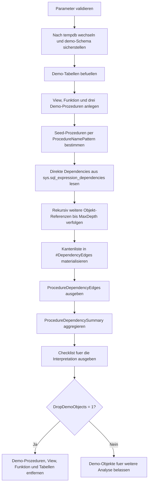

# ProcedureDependencyGraph.sql

Dieses Skript erzeugt in `tempdb` eine kleine Demo-Landschaft aus Tabellen, View, Funktion und mehreren Stored Procedures. Anschliessend wird ueber `sys.sql_expression_dependencies` ein rekursiver Abhaengigkeitsgraph aufgebaut, damit direkte und indirekte Referenzen zwischen Procedures und den von ihnen genutzten Objekten sichtbar werden.

## Uebersicht

<!-- SQLDOC:SUMMARY_TABLE:BEGIN -->
| Feld | Wert |
|---|---|
| Script | [ProcedureDependencyGraph.sql](ProcedureDependencyGraph.sql) |
| Version | `1.0` |
| Typ | `didactic-lab` |
| Kapitel | `23_StoredProcedures` |
| Sicherheit | `demo-write-tempdb` |
| Zweck | Baut einen Abhaengigkeitsgraphen zwischen Prozeduren und aufgerufenen Objekten. |
<!-- SQLDOC:SUMMARY_TABLE:END -->

## Einordnung

Der Schwerpunkt liegt auf einer didaktischen Erstversion fuer Architektur- und Review-Gespraeche zu Stored Procedures. Das Skript zeigt nicht nur direkte Tabellenzugriffe, sondern auch Zwischenschichten ueber View, Funktion und weitere Procedure-Aufrufe.

## Annahmen

- Es handelt sich um eine didaktische Erstversion ohne produktive Stored Procedures oder produktive Tabellen.
- Alle Demo-Objekte werden ausschliesslich in `tempdb` angelegt und koennen optional wieder entfernt werden.
- Der Graph basiert auf `sys.sql_expression_dependencies` und bildet damit deklarierte SQL-Abhaengigkeiten ab, nicht echte Laufzeitaufrufe oder Ausfuehrungszaehler.
- Rekursive Analyse wird bewusst ueber `@MaxDepth` begrenzt, damit der Graph kompakt und lesbar bleibt.

## Anwendungsfall

Das Skript eignet sich fuer Unterrichts- und Review-Situationen, in denen Procedure-Kopplung sichtbar gemacht werden soll. Lernende koennen nachvollziehen, wie eine Root-Procedure weitere Procedures, Views, Funktionen und Basistabellen indirekt mitzieht.

## Parameter

<!-- SQLDOC:PARAMETERS_TABLE:BEGIN -->
| Parameter | SQL-Typ | Pflicht | Beschreibung |
|---|---|---|---|
| `@ProcedureNamePattern` | `NVARCHAR(128)` | Nein | LIKE-Filter fuer Demo-Prozeduren, die als Startknoten in den Graphen eingehen. |
| `@MaxDepth` | `INT` | Nein | Maximale Rekursionstiefe fuer indirekte Abhaengigkeiten. |
| `@DropDemoObjects` | `BIT` | Nein | Entfernt Demo-Objekte am Ende wieder aus `tempdb`, wenn `1`. |
<!-- SQLDOC:PARAMETERS_TABLE:END -->

## Abhaengigkeiten

<!-- SQLDOC:DEPENDENCIES_LIST:BEGIN -->
- `tempdb`
- `sys.schemas`
- `sys.objects`
- `sys.tables`
- `sys.views`
- `sys.procedures`
- `sys.sql_expression_dependencies`
- `CREATE OR ALTER PROCEDURE`
- `CREATE OR ALTER VIEW`
- `CREATE OR ALTER FUNCTION`
<!-- SQLDOC:DEPENDENCIES_LIST:END -->

## Hinweise

- `ProcedureDependencyEdges` liefert eine Kantenliste mit Tiefe, Objekttyp und Pfadtext fuer Root-Procedure bis Zielobjekt.
- `ProcedureDependencySummary` fasst pro Root-Procedure zusammen, wie viele direkte und indirekte Abhaengigkeiten je Objekttyp gefunden wurden.
- Die Rekursion verfolgt nur aufloesbare Objekt-IDs weiter und vermeidet einfache Zyklen ueber den bisher aufgebauten Pfadtext.

## Versionshistorie

<!-- SQLDOC:VERSION_HISTORY_TABLE:BEGIN -->
| Version | Datum | User | Beschreibung |
|---|---|---|---|
| `1.0` | `2026-04-17` | `ER` | Erstversion des didaktischen Labs fuer Procedure-Abhaengigkeitsgraphen |
<!-- SQLDOC:VERSION_HISTORY_TABLE:END -->

## Ablauf

<!-- SQLDOC:MERMAID:BEGIN -->

<!-- SQLDOC:MERMAID:END -->

## SQL-Code

<!-- SQLDOC:SQL_CODE:BEGIN -->
```sql
/*
BEGIN:SQL-HEADER v1
---
sql_header: v1
script_name: "ProcedureDependencyGraph.sql"
script_version: "1.0"
script_type: "didactic-lab"
chapter: "23_StoredProcedures"

purpose: >
  Baut in tempdb mehrere Demo-Prozeduren und abhaengige Objekte auf und
  erzeugt daraus einen rekursiven Abhaengigkeitsgraphen zwischen
  Stored Procedures und den von ihnen referenzierten Tabellen, Views,
  Funktionen und weiteren Prozeduren.

parameters:
  - name: "@ProcedureNamePattern"
    sql_type: "NVARCHAR(128)"
    direction: "IN"
    required: false
    description: "LIKE-Filter fuer Demo-Prozeduren, die als Startknoten in den Graphen eingehen"
  - name: "@MaxDepth"
    sql_type: "INT"
    direction: "IN"
    required: false
    description: "Maximale Rekursionstiefe fuer indirekte Abhaengigkeiten"
  - name: "@DropDemoObjects"
    sql_type: "BIT"
    direction: "IN"
    required: false
    description: "1 = Demo-Objekte nach der Analyse wieder aus tempdb entfernen"

result_sets:
  - name: "ProcedureDependencyEdges"
    description: "Kantenliste des rekursiven Abhaengigkeitsgraphen mit Tiefe, Objektart und Pfadtext"
  - name: "ProcedureDependencySummary"
    description: "Verdichtete Uebersicht je Start-Procedure mit Anzahl direkter und indirekter Abhaengigkeiten"
  - name: "ProcedureDependencyChecklist"
    description: "Didaktische Hinweise zur Interpretation eines Procedure-Abhaengigkeitsgraphen"

dependencies:
  - "tempdb"
  - "sys.schemas"
  - "sys.objects"
  - "sys.tables"
  - "sys.views"
  - "sys.procedures"
  - "sys.sql_expression_dependencies"
  - "CREATE OR ALTER PROCEDURE"
  - "CREATE OR ALTER VIEW"
  - "CREATE OR ALTER FUNCTION"

safety:
  level: "demo-write-tempdb"
  writes_data: true

documentation:
  markdown_file: "T-SQL/23_StoredProcedures/SQLScripts/ProcedureDependencyGraph.md"
  sync_blocks:
    - "SUMMARY_TABLE"
    - "PARAMETERS_TABLE"
    - "DEPENDENCIES_LIST"
    - "VERSION_HISTORY_TABLE"
    - "SQL_CODE"
  mermaid:
    mode: "ai-agent-from-sql"
    source: "script-body"

main_responsible:
  name: "Erhard Rainer"
  initials: "ER"

version_history:
  - version: "1.0"
    date: "2026-04-17"
    user: "ER"
    description: "Erstversion des didaktischen Labs fuer Procedure-Abhaengigkeitsgraphen"

notes:
  - "Alle Demo-Objekte werden ausschliesslich in tempdb angelegt"
  - "Der Graph nutzt sys.sql_expression_dependencies und zeigt deshalb deklarierte SQL-Abhaengigkeiten statt Laufzeit-Trace-Daten"
---
END:SQL-HEADER v1
*/

SET NOCOUNT ON;

DECLARE @ProcedureNamePattern NVARCHAR(128) = N'usp_DepGraph%';
DECLARE @MaxDepth INT = 4;
DECLARE @DropDemoObjects BIT = 1;

IF NULLIF(LTRIM(RTRIM(@ProcedureNamePattern)), N'') IS NULL
BEGIN
    THROW 50000, '@ProcedureNamePattern darf nicht leer sein.', 1;
END;

IF @MaxDepth IS NULL OR @MaxDepth < 1 OR @MaxDepth > 8
BEGIN
    THROW 50001, '@MaxDepth muss zwischen 1 und 8 liegen.', 1;
END;

IF @DropDemoObjects NOT IN (0, 1)
BEGIN
    THROW 50002, '@DropDemoObjects muss 0 oder 1 sein.', 1;
END;

USE tempdb;

IF NOT EXISTS
(
    SELECT 1
    FROM sys.schemas
    WHERE name = N'demo'
)
BEGIN
    EXEC(N'CREATE SCHEMA demo AUTHORIZATION dbo;');
END;

DROP PROCEDURE IF EXISTS demo.usp_DepGraphRoster;
DROP PROCEDURE IF EXISTS demo.usp_DepGraphMetrics;
DROP PROCEDURE IF EXISTS demo.usp_DepGraphAdvisor;
DROP VIEW IF EXISTS demo.v_DepGraphActiveCourseLoad;
DROP FUNCTION IF EXISTS demo.ufn_DepGraphRiskBand;
DROP TABLE IF EXISTS demo.DepGraphEnrollment;
DROP TABLE IF EXISTS demo.DepGraphThreshold;

CREATE TABLE demo.DepGraphEnrollment
(
    EnrollmentID    INT           NOT NULL IDENTITY(1,1) PRIMARY KEY,
    CourseCode      NVARCHAR(20)  NOT NULL,
    StudentCount    INT           NOT NULL,
    WaitlistCount   INT           NOT NULL,
    IsActive        BIT           NOT NULL,
    SnapshotDate    DATE          NOT NULL
);

CREATE TABLE demo.DepGraphThreshold
(
    CourseCode            NVARCHAR(20)  NOT NULL PRIMARY KEY,
    ReviewThreshold       INT           NOT NULL,
    AdvisoryThreshold     INT           NOT NULL
);

INSERT INTO demo.DepGraphEnrollment
(
    CourseCode,
    StudentCount,
    WaitlistCount,
    IsActive,
    SnapshotDate
)
VALUES
    (N'DB100', 24, 3, 1, CAST('2026-04-17' AS DATE)),
    (N'DB100', 22, 1, 1, CAST('2026-04-10' AS DATE)),
    (N'API310', 18, 0, 1, CAST('2026-04-17' AS DATE)),
    (N'BI420', 31, 7, 1, CAST('2026-04-17' AS DATE)),
    (N'LEG200', 12, 0, 0, CAST('2026-04-17' AS DATE));

INSERT INTO demo.DepGraphThreshold
(
    CourseCode,
    ReviewThreshold,
    AdvisoryThreshold
)
VALUES
    (N'DB100', 20, 25),
    (N'API310', 16, 22),
    (N'BI420', 24, 30),
    (N'LEG200', 10, 15);

EXEC sys.sp_executesql
N'
CREATE OR ALTER VIEW demo.v_DepGraphActiveCourseLoad
AS
    SELECT
        e.CourseCode,
        ActiveRows = COUNT(*),
        AvgStudentCount = AVG(CAST(e.StudentCount AS DECIMAL(10, 2))),
        TotalWaitlist = SUM(e.WaitlistCount),
        LatestSnapshotDate = MAX(e.SnapshotDate)
    FROM demo.DepGraphEnrollment AS e
    WHERE e.IsActive = 1
    GROUP BY
        e.CourseCode;
';

EXEC sys.sp_executesql
N'
CREATE OR ALTER FUNCTION demo.ufn_DepGraphRiskBand
(
    @StudentCount INT,
    @WaitlistCount INT,
    @AdvisoryThreshold INT
)
RETURNS NVARCHAR(20)
AS
BEGIN
    DECLARE @RiskBand NVARCHAR(20);

    SET @RiskBand =
        CASE
            WHEN @StudentCount >= @AdvisoryThreshold OR @WaitlistCount >= 5 THEN N''high''
            WHEN @StudentCount >= @AdvisoryThreshold - 3 OR @WaitlistCount >= 2 THEN N''medium''
            ELSE N''low''
        END;

    RETURN @RiskBand;
END;
';

EXEC sys.sp_executesql
N'
CREATE OR ALTER PROCEDURE demo.usp_DepGraphRoster
    @CourseCode NVARCHAR(20)
AS
BEGIN
    SET NOCOUNT ON;

    SELECT
        e.CourseCode,
        e.StudentCount,
        e.WaitlistCount,
        e.SnapshotDate
    FROM demo.DepGraphEnrollment AS e
    WHERE e.CourseCode = @CourseCode
      AND e.IsActive = 1
    ORDER BY
        e.SnapshotDate DESC,
        e.EnrollmentID DESC;
END;
';

EXEC sys.sp_executesql
N'
CREATE OR ALTER PROCEDURE demo.usp_DepGraphMetrics
    @CourseCode NVARCHAR(20)
AS
BEGIN
    SET NOCOUNT ON;

    SELECT
        acl.CourseCode,
        acl.ActiveRows,
        acl.AvgStudentCount,
        acl.TotalWaitlist,
        RiskBand = demo.ufn_DepGraphRiskBand(
            CAST(ROUND(acl.AvgStudentCount, 0) AS INT),
            acl.TotalWaitlist,
            th.AdvisoryThreshold
        ),
        th.ReviewThreshold,
        th.AdvisoryThreshold
    FROM demo.v_DepGraphActiveCourseLoad AS acl
    INNER JOIN demo.DepGraphThreshold AS th
        ON th.CourseCode = acl.CourseCode
    WHERE acl.CourseCode = @CourseCode;
END;
';

EXEC sys.sp_executesql
N'
CREATE OR ALTER PROCEDURE demo.usp_DepGraphAdvisor
    @CourseCode NVARCHAR(20)
AS
BEGIN
    SET NOCOUNT ON;

    EXEC demo.usp_DepGraphRoster
        @CourseCode = @CourseCode;

    EXEC demo.usp_DepGraphMetrics
        @CourseCode = @CourseCode;
END;
';

DROP TABLE IF EXISTS #DependencyEdges;

;WITH SeedProcedures AS
(
    SELECT
        RootObjectID = p.object_id,
        RootObjectName = QUOTENAME(s.name) + N'.' + QUOTENAME(p.name)
    FROM sys.procedures AS p
    INNER JOIN sys.schemas AS s
        ON s.schema_id = p.schema_id
    WHERE p.schema_id = SCHEMA_ID(N'demo')
      AND p.name LIKE @ProcedureNamePattern
),
RecursiveDependencies AS
(
    SELECT
        sp.RootObjectID,
        sp.RootObjectName,
        ReferencingObjectID = sed.referencing_id,
        ReferencingObjectName = QUOTENAME(OBJECT_SCHEMA_NAME(sed.referencing_id)) + N'.' + QUOTENAME(OBJECT_NAME(sed.referencing_id)),
        ReferencingObjectType = oref.type_desc,
        ReferencedObjectID = sed.referenced_id,
        ReferencedObjectName = COALESCE(
            QUOTENAME(OBJECT_SCHEMA_NAME(sed.referenced_id)) + N'.' + QUOTENAME(OBJECT_NAME(sed.referenced_id)),
            COALESCE(QUOTENAME(sed.referenced_schema_name) + N'.', N'') + QUOTENAME(sed.referenced_entity_name)
        ),
        ReferencedObjectType = COALESCE(orefed.type_desc, N'EXTERNAL_OR_UNRESOLVED'),
        GraphDepth = 1,
        PathText = sp.RootObjectName + N' -> '
            + COALESCE(
                QUOTENAME(OBJECT_SCHEMA_NAME(sed.referenced_id)) + N'.' + QUOTENAME(OBJECT_NAME(sed.referenced_id)),
                COALESCE(QUOTENAME(sed.referenced_schema_name) + N'.', N'') + QUOTENAME(sed.referenced_entity_name)
            )
    FROM SeedProcedures AS sp
    INNER JOIN sys.sql_expression_dependencies AS sed
        ON sed.referencing_id = sp.RootObjectID
    INNER JOIN sys.objects AS oref
        ON oref.object_id = sed.referencing_id
    LEFT JOIN sys.objects AS orefed
        ON orefed.object_id = sed.referenced_id
    WHERE sed.referenced_id IS NOT NULL

    UNION ALL

    SELECT
        rd.RootObjectID,
        rd.RootObjectName,
        ReferencingObjectID = sed.referencing_id,
        ReferencingObjectName = QUOTENAME(OBJECT_SCHEMA_NAME(sed.referencing_id)) + N'.' + QUOTENAME(OBJECT_NAME(sed.referencing_id)),
        ReferencingObjectType = oref.type_desc,
        ReferencedObjectID = sed.referenced_id,
        ReferencedObjectName = COALESCE(
            QUOTENAME(OBJECT_SCHEMA_NAME(sed.referenced_id)) + N'.' + QUOTENAME(OBJECT_NAME(sed.referenced_id)),
            COALESCE(QUOTENAME(sed.referenced_schema_name) + N'.', N'') + QUOTENAME(sed.referenced_entity_name)
        ),
        ReferencedObjectType = COALESCE(orefed.type_desc, N'EXTERNAL_OR_UNRESOLVED'),
        GraphDepth = rd.GraphDepth + 1,
        PathText = rd.PathText + N' -> '
            + COALESCE(
                QUOTENAME(OBJECT_SCHEMA_NAME(sed.referenced_id)) + N'.' + QUOTENAME(OBJECT_NAME(sed.referenced_id)),
                COALESCE(QUOTENAME(sed.referenced_schema_name) + N'.', N'') + QUOTENAME(sed.referenced_entity_name)
            )
    FROM RecursiveDependencies AS rd
    INNER JOIN sys.sql_expression_dependencies AS sed
        ON sed.referencing_id = rd.ReferencedObjectID
    INNER JOIN sys.objects AS oref
        ON oref.object_id = sed.referencing_id
    LEFT JOIN sys.objects AS orefed
        ON orefed.object_id = sed.referenced_id
    WHERE rd.GraphDepth < @MaxDepth
      AND rd.ReferencedObjectType IN (N'SQL_STORED_PROCEDURE', N'VIEW', N'SQL_SCALAR_FUNCTION', N'SQL_INLINE_TABLE_VALUED_FUNCTION', N'SQL_TABLE_VALUED_FUNCTION')
      AND sed.referenced_id IS NOT NULL
      AND rd.PathText NOT LIKE N'%' + COALESCE(
            QUOTENAME(OBJECT_SCHEMA_NAME(sed.referenced_id)) + N'.' + QUOTENAME(OBJECT_NAME(sed.referenced_id)),
            COALESCE(QUOTENAME(sed.referenced_schema_name) + N'.', N'') + QUOTENAME(sed.referenced_entity_name)
          ) + N'%'
)
SELECT DISTINCT
    RootProcedure = rd.RootObjectName,
    ReferencingObject = rd.ReferencingObjectName,
    ReferencingObjectType = rd.ReferencingObjectType,
    ReferencedObject = rd.ReferencedObjectName,
    ReferencedObjectType = rd.ReferencedObjectType,
    GraphDepth = rd.GraphDepth,
    EdgeClassification = CASE WHEN rd.GraphDepth = 1 THEN N'direct' ELSE N'indirect' END,
    PathText = rd.PathText
INTO #DependencyEdges
FROM RecursiveDependencies AS rd;

SELECT
    RootProcedure,
    ReferencingObject,
    ReferencingObjectType,
    ReferencedObject,
    ReferencedObjectType,
    GraphDepth,
    EdgeClassification,
    PathText
FROM #DependencyEdges
ORDER BY
    RootProcedure,
    GraphDepth,
    ReferencingObject,
    ReferencedObject;

SELECT
    RootProcedure,
    DirectDependencies = SUM(CASE WHEN GraphDepth = 1 THEN 1 ELSE 0 END),
    IndirectDependencies = SUM(CASE WHEN GraphDepth > 1 THEN 1 ELSE 0 END),
    MaxObservedDepth = MAX(GraphDepth),
    ReferencedProcedures = SUM(CASE WHEN ReferencedObjectType = N'SQL_STORED_PROCEDURE' THEN 1 ELSE 0 END),
    ReferencedViews = SUM(CASE WHEN ReferencedObjectType = N'VIEW' THEN 1 ELSE 0 END),
    ReferencedFunctions = SUM(CASE WHEN ReferencedObjectType LIKE N'SQL%FUNCTION' THEN 1 ELSE 0 END),
    ReferencedTables = SUM(CASE WHEN ReferencedObjectType = N'USER_TABLE' THEN 1 ELSE 0 END)
FROM #DependencyEdges
GROUP BY
    RootProcedure
ORDER BY
    RootProcedure;

SELECT
    StepNo,
    ChecklistItem,
    WhyItMatters
FROM
(
    VALUES
        (1, N'Direkte und indirekte Kanten getrennt lesen.', N'Nur so wird sichtbar, ob eine Procedure selbst auf Tabellen zugreift oder nur ueber weitere Objekte gekoppelt ist.'),
        (2, N'Declarative Dependencies nicht mit Laufzeit-Trace-Daten verwechseln.', N'sys.sql_expression_dependencies zeigt deklarierte SQL-Bezuege, aber keine tatsaechlich ausgefuehrte Laufzeitfrequenz.'),
        (3, N'Views und Funktionen als Zwischenschichten markieren.', N'Sie erklaeren, warum eine scheinbar schlanke Procedure trotzdem an mehrere Basistabellen gekoppelt sein kann.'),
        (4, N'Die Rekursionstiefe bewusst begrenzen.', N'Ein enger Depth-Filter verhindert uferlose Graphen und haelt die Analyse didaktisch lesbar.')
) AS checklist(StepNo, ChecklistItem, WhyItMatters)
ORDER BY
    StepNo;

IF @DropDemoObjects = 1
BEGIN
    DROP PROCEDURE IF EXISTS demo.usp_DepGraphAdvisor;
    DROP PROCEDURE IF EXISTS demo.usp_DepGraphMetrics;
    DROP PROCEDURE IF EXISTS demo.usp_DepGraphRoster;
    DROP VIEW IF EXISTS demo.v_DepGraphActiveCourseLoad;
    DROP FUNCTION IF EXISTS demo.ufn_DepGraphRiskBand;
    DROP TABLE IF EXISTS demo.DepGraphThreshold;
    DROP TABLE IF EXISTS demo.DepGraphEnrollment;
END;

DROP TABLE IF EXISTS #DependencyEdges;
```
<!-- SQLDOC:SQL_CODE:END -->
