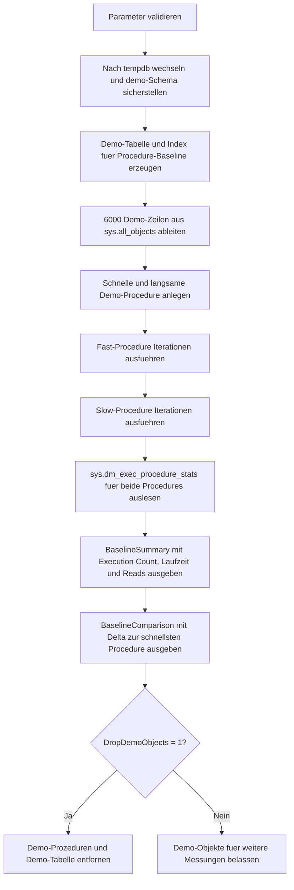

# ProcedureExecutionBaseline.sql

Dieses Skript baut in `tempdb` eine kleine Baseline fuer Stored Procedures auf. Zwei Demo-Prozeduren greifen auf denselben Demo-Datensatz zu, werden mehrfach ausgefuehrt und anschliessend ueber `sys.dm_exec_procedure_stats` nach Ausfuehrungsanzahl, durchschnittlicher Laufzeit und durchschnittlichen logischen Reads verglichen.

## Uebersicht

<!-- SQLDOC:SUMMARY_TABLE:BEGIN -->
| Feld | Wert |
|---|---|
| Script | [ProcedureExecutionBaseline.sql](ProcedureExecutionBaseline.sql) |
| Version | `1.0` |
| Typ | `didactic-lab` |
| Kapitel | `23_StoredProcedures` |
| Sicherheit | `demo-write-tempdb` |
| Zweck | Baut eine einfache Baseline fuer Laufzeit, Reads und Ausfuehrungsanzahl von Prozeduren auf. |
<!-- SQLDOC:SUMMARY_TABLE:END -->

## Einordnung

Der Schwerpunkt liegt auf einer ersten, reproduzierbaren Messbasis fuer Procedure-Performance. Das Skript ersetzt kein tiefes Monitoring, zeigt aber kompakt, welche DMV-Kennzahlen fuer einen Einstieg in Baselines und spaetere Vergleiche relevant sind.

## Annahmen

- Es handelt sich um eine didaktische Erstversion ohne produktive Tabellen oder produktive Stored Procedures.
- Alle Demo-Objekte werden ausschliesslich in `tempdb` angelegt.
- `sys.dm_exec_procedure_stats` liefert plan-cache-basierte Kennzahlen, die sich nach Recompile, Neustart oder Cache-Eviction aendern koennen.
- Die langsamere Demo-Procedure ist absichtlich weniger sargable formuliert, damit ein gut sichtbarer Vergleich entsteht.

## Anwendungsfall

Das Skript eignet sich fuer Kapitelabschnitte, in denen Procedure-Metriken erstmals eingeordnet werden sollen. Lernende koennen sehen, wie `execution_count`, `avg_elapsed_ms`, `avg_worker_ms` und `avg_logical_reads` aus derselben DMV abgeleitet und in eine einfache Baseline ueberfuehrt werden.

## Parameter

<!-- SQLDOC:PARAMETERS_TABLE:BEGIN -->
| Parameter | SQL-Typ | Pflicht | Beschreibung |
|---|---|---|---|
| `@Iterations` | `INT` | Nein | Wie oft jede Demo-Prozedur fuer die Baseline ausgefuehrt wird. |
| `@MinStudentCount` | `INT` | Nein | Untergrenze fuer Demo-Zeilen, die in die Procedure-Logik eingehen. |
| `@DropDemoObjects` | `BIT` | Nein | Entfernt Demo-Objekte am Ende wieder aus `tempdb`, wenn `1`. |
<!-- SQLDOC:PARAMETERS_TABLE:END -->

## Abhaengigkeiten

<!-- SQLDOC:DEPENDENCIES_LIST:BEGIN -->
- `tempdb`
- `sys.schemas`
- `sys.all_objects`
- `sys.objects`
- `sys.dm_exec_procedure_stats`
- `CREATE OR ALTER PROCEDURE`
<!-- SQLDOC:DEPENDENCIES_LIST:END -->

## Hinweise

- Beide Demo-Prozeduren arbeiten auf derselben Datengrundlage, damit der Vergleich nicht durch unterschiedliche Demo-Daten verzerrt wird.
- Die erste Auswertung zeigt die Baseline direkt aus der DMV, die zweite Ausgabe ergaenzt ein Delta zur schnellsten Demo-Procedure.
- Wenn `@DropDemoObjects = 1` gesetzt bleibt, werden Tabelle und Prozeduren erst nach der Ergebnis-Ausgabe entfernt.

## Versionshistorie

<!-- SQLDOC:VERSION_HISTORY_TABLE:BEGIN -->
| Version | Datum | User | Beschreibung |
|---|---|---|---|
| `1.0` | `2026-04-17` | `ER` | Erstversion des Procedure-Baseline-Labs fuer Laufzeit, Reads und Execution Count |
<!-- SQLDOC:VERSION_HISTORY_TABLE:END -->

## Ablauf

<!-- SQLDOC:MERMAID:BEGIN -->

<!-- SQLDOC:MERMAID:END -->

## SQL-Code

<!-- SQLDOC:SQL_CODE:BEGIN -->
```sql
/*
BEGIN:SQL-HEADER v1
---
sql_header: v1
script_name: "ProcedureExecutionBaseline.sql"
script_version: "1.0"
script_type: "didactic-lab"
chapter: "23_StoredProcedures"

purpose: >
  Baut in tempdb eine einfache Baseline fuer Stored-Procedure-Laufzeit,
  logische Reads und Ausfuehrungsanzahl auf, indem zwei Demo-Prozeduren
  wiederholt ausgefuehrt und ueber sys.dm_exec_procedure_stats ausgewertet
  werden.

parameters:
  - name: "@Iterations"
    sql_type: "INT"
    direction: "IN"
    required: false
    description: "Wie oft jede Demo-Prozedur fuer die Baseline ausgefuehrt wird"
  - name: "@MinStudentCount"
    sql_type: "INT"
    direction: "IN"
    required: false
    description: "Untergrenze fuer Demo-Zeilen, die in die Procedure-Logik eingehen"
  - name: "@DropDemoObjects"
    sql_type: "BIT"
    direction: "IN"
    required: false
    description: "1 = Demo-Objekte am Ende wieder aus tempdb entfernen"

result_sets:
  - name: "ProcedureBaselineSummary"
    description: "Baseline mit Ausfuehrungsanzahl, durchschnittlicher Laufzeit und durchschnittlichen logischen Reads je Procedure"
  - name: "ProcedureBaselineComparison"
    description: "Vergleich beider Demo-Prozeduren inklusive Delta zur schnellsten Baseline"

dependencies:
  - "tempdb"
  - "sys.schemas"
  - "sys.all_objects"
  - "sys.objects"
  - "sys.dm_exec_procedure_stats"
  - "CREATE OR ALTER PROCEDURE"

safety:
  level: "demo-write-tempdb"
  writes_data: true

documentation:
  markdown_file: "T-SQL/23_StoredProcedures/SQLScripts/ProcedureExecutionBaseline.md"
  sync_blocks:
    - "SUMMARY_TABLE"
    - "PARAMETERS_TABLE"
    - "DEPENDENCIES_LIST"
    - "VERSION_HISTORY_TABLE"
    - "SQL_CODE"
  mermaid:
    mode: "ai-agent-from-sql"
    source: "script-body"

main_responsible:
  name: "Erhard Rainer"
  initials: "ER"

version_history:
  - version: "1.0"
    date: "2026-04-17"
    user: "ER"
    description: "Erstversion des Procedure-Baseline-Labs fuer Laufzeit, Reads und Execution Count"

notes:
  - "Alle Demo-Objekte werden ausschliesslich in tempdb angelegt"
  - "Die DMV-Werte sind plan-cache-basiert und koennen sich bei Recompile oder Cache-Eviction aendern"
---
END:SQL-HEADER v1
*/

SET NOCOUNT ON;

DECLARE @Iterations INT = 5;
DECLARE @MinStudentCount INT = 20;
DECLARE @DropDemoObjects BIT = 1;

IF @Iterations IS NULL OR @Iterations < 1
BEGIN
    THROW 50000, '@Iterations muss mindestens 1 sein.', 1;
END;

IF @MinStudentCount IS NULL OR @MinStudentCount < 0
BEGIN
    THROW 50001, '@MinStudentCount darf nicht negativ sein.', 1;
END;

IF @DropDemoObjects NOT IN (0, 1)
BEGIN
    THROW 50002, '@DropDemoObjects muss 0 oder 1 sein.', 1;
END;

USE tempdb;

IF NOT EXISTS
(
    SELECT 1
    FROM sys.schemas
    WHERE name = N'demo'
)
BEGIN
    EXEC(N'CREATE SCHEMA demo AUTHORIZATION dbo;');
END;

DROP PROCEDURE IF EXISTS demo.usp_ProcedureBaselineFast;
DROP PROCEDURE IF EXISTS demo.usp_ProcedureBaselineSlow;
DROP TABLE IF EXISTS demo.ProcedureExecutionBaselineSample;

CREATE TABLE demo.ProcedureExecutionBaselineSample
(
    SampleID        INT           NOT NULL IDENTITY(1,1) PRIMARY KEY,
    CourseCode      NVARCHAR(20)  NOT NULL,
    InstructorCode  NVARCHAR(20)  NOT NULL,
    StudentCount    INT           NOT NULL,
    DurationMs      INT           NOT NULL,
    IsActive        BIT           NOT NULL,
    ExecutionDate   DATE          NOT NULL
);

CREATE INDEX IX_ProcedureExecutionBaselineSample_CourseActive
ON demo.ProcedureExecutionBaselineSample (CourseCode, IsActive, StudentCount)
INCLUDE (DurationMs, ExecutionDate, InstructorCode);

;WITH SeedRows AS
(
    SELECT TOP (6000)
        ROW_NUMBER() OVER (ORDER BY a.object_id, b.object_id) AS RowNo
    FROM sys.all_objects AS a
    CROSS JOIN sys.all_objects AS b
)
INSERT INTO demo.ProcedureExecutionBaselineSample
(
    CourseCode,
    InstructorCode,
    StudentCount,
    DurationMs,
    IsActive,
    ExecutionDate
)
SELECT
    CASE RowNo % 4
        WHEN 0 THEN N'DB100'
        WHEN 1 THEN N'API310'
        WHEN 2 THEN N'ETL200'
        ELSE N'BI420'
    END AS CourseCode,
    CONCAT(N'INST', RIGHT(CONCAT(N'00', (RowNo % 9) + 1), 2)) AS InstructorCode,
    12 + (RowNo % 24) AS StudentCount,
    15 + ((RowNo * 7) % 180) AS DurationMs,
    CASE WHEN RowNo % 5 = 0 THEN 0 ELSE 1 END AS IsActive,
    DATEADD(DAY, -(RowNo % 180), CAST('2026-04-17' AS DATE)) AS ExecutionDate
FROM SeedRows;

EXEC sys.sp_executesql
N'
CREATE OR ALTER PROCEDURE demo.usp_ProcedureBaselineFast
    @CourseCode NVARCHAR(20),
    @MinStudentCount INT
AS
BEGIN
    SET NOCOUNT ON;

    SELECT
        COUNT(*) AS execution_rows,
        AVG(CAST(s.DurationMs AS DECIMAL(10, 2))) AS avg_duration_ms,
        MAX(s.ExecutionDate) AS latest_execution_date
    FROM demo.ProcedureExecutionBaselineSample AS s
    WHERE s.CourseCode = @CourseCode
      AND s.IsActive = 1
      AND s.StudentCount >= @MinStudentCount;
END;
';

EXEC sys.sp_executesql
N'
CREATE OR ALTER PROCEDURE demo.usp_ProcedureBaselineSlow
    @CourseCode NVARCHAR(20),
    @MinStudentCount INT
AS
BEGIN
    SET NOCOUNT ON;

    ;WITH ExpandedScan AS
    (
        SELECT
            s.SampleID,
            s.CourseCode,
            s.DurationMs,
            s.ExecutionDate,
            s.StudentCount,
            s.IsActive,
            CourseMatches = CASE WHEN UPPER(s.CourseCode) = UPPER(@CourseCode) THEN 1 ELSE 0 END,
            ActivityLabel = CASE WHEN s.IsActive = 1 THEN N''Active'' ELSE N''Inactive'' END
        FROM demo.ProcedureExecutionBaselineSample AS s
    )
    SELECT
        COUNT(*) AS execution_rows,
        AVG(CAST(es.DurationMs AS DECIMAL(10, 2))) AS avg_duration_ms,
        MAX(es.ExecutionDate) AS latest_execution_date
    FROM ExpandedScan AS es
    WHERE es.CourseMatches = 1
      AND es.ActivityLabel = N''Active''
      AND es.StudentCount >= @MinStudentCount;
END;
';

DECLARE @LoopCounter INT = 1;

WHILE @LoopCounter <= @Iterations
BEGIN
    EXEC demo.usp_ProcedureBaselineFast
        @CourseCode = N'DB100',
        @MinStudentCount = @MinStudentCount;

    SET @LoopCounter += 1;
END;

SET @LoopCounter = 1;

WHILE @LoopCounter <= @Iterations
BEGIN
    EXEC demo.usp_ProcedureBaselineSlow
        @CourseCode = N'DB100',
        @MinStudentCount = @MinStudentCount;

    SET @LoopCounter += 1;
END;

;WITH ProcedureStats AS
(
    SELECT
        ProcedureName = CONCAT(s.name, N'.', o.name),
        ps.execution_count,
        avg_elapsed_ms = CAST((ps.total_elapsed_time * 1.0 / NULLIF(ps.execution_count, 0)) / 1000.0 AS DECIMAL(18, 3)),
        avg_worker_ms = CAST((ps.total_worker_time * 1.0 / NULLIF(ps.execution_count, 0)) / 1000.0 AS DECIMAL(18, 3)),
        avg_logical_reads = CAST(ps.total_logical_reads * 1.0 / NULLIF(ps.execution_count, 0) AS DECIMAL(18, 2)),
        ps.cached_time,
        ps.last_execution_time
    FROM sys.dm_exec_procedure_stats AS ps
    INNER JOIN sys.objects AS o
        ON ps.object_id = o.object_id
    INNER JOIN sys.schemas AS s
        ON o.schema_id = s.schema_id
    WHERE ps.database_id = DB_ID(N'tempdb')
      AND o.object_id IN
      (
          OBJECT_ID(N'demo.usp_ProcedureBaselineFast'),
          OBJECT_ID(N'demo.usp_ProcedureBaselineSlow')
      )
)
SELECT
    ProcedureName,
    execution_count,
    avg_elapsed_ms,
    avg_worker_ms,
    avg_logical_reads,
    cached_time,
    last_execution_time
FROM ProcedureStats
ORDER BY
    avg_elapsed_ms,
    ProcedureName;

;WITH ProcedureStats AS
(
    SELECT
        ProcedureName = CONCAT(s.name, N'.', o.name),
        ps.execution_count,
        avg_elapsed_ms = CAST((ps.total_elapsed_time * 1.0 / NULLIF(ps.execution_count, 0)) / 1000.0 AS DECIMAL(18, 3)),
        avg_worker_ms = CAST((ps.total_worker_time * 1.0 / NULLIF(ps.execution_count, 0)) / 1000.0 AS DECIMAL(18, 3)),
        avg_logical_reads = CAST(ps.total_logical_reads * 1.0 / NULLIF(ps.execution_count, 0) AS DECIMAL(18, 2))
    FROM sys.dm_exec_procedure_stats AS ps
    INNER JOIN sys.objects AS o
        ON ps.object_id = o.object_id
    INNER JOIN sys.schemas AS s
        ON o.schema_id = s.schema_id
    WHERE ps.database_id = DB_ID(N'tempdb')
      AND o.object_id IN
      (
          OBJECT_ID(N'demo.usp_ProcedureBaselineFast'),
          OBJECT_ID(N'demo.usp_ProcedureBaselineSlow')
      )
),
RankedStats AS
(
    SELECT
        ProcedureName,
        execution_count,
        avg_elapsed_ms,
        avg_worker_ms,
        avg_logical_reads,
        fastest_elapsed_ms = MIN(avg_elapsed_ms) OVER ()
    FROM ProcedureStats
)
SELECT
    ProcedureName,
    execution_count,
    avg_elapsed_ms,
    avg_worker_ms,
    avg_logical_reads,
    elapsed_delta_ms = CAST(avg_elapsed_ms - fastest_elapsed_ms AS DECIMAL(18, 3))
FROM RankedStats
ORDER BY
    elapsed_delta_ms,
    ProcedureName;

IF @DropDemoObjects = 1
BEGIN
    DROP PROCEDURE IF EXISTS demo.usp_ProcedureBaselineFast;
    DROP PROCEDURE IF EXISTS demo.usp_ProcedureBaselineSlow;
    DROP TABLE IF EXISTS demo.ProcedureExecutionBaselineSample;
END;
```
<!-- SQLDOC:SQL_CODE:END -->
