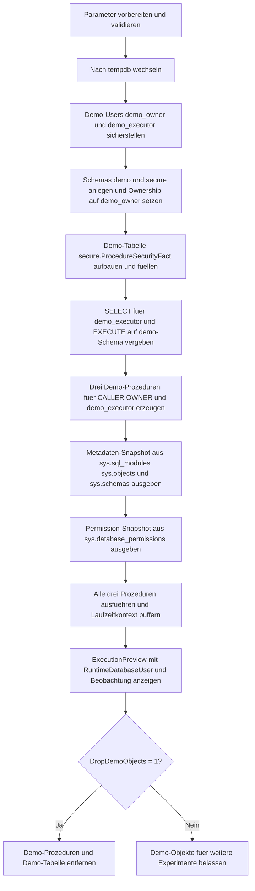

# ProcedureExecutionContextSnapshot.sql

Dieses Skript baut in `tempdb` drei Demo-Prozeduren mit verschiedenen `EXECUTE AS`-Modellen auf und kombiniert zwei Sichtweisen: einen Metadaten-Schnappschuss aus den Systemkatalogen und eine kleine Laufzeitbeobachtung waehrend der Ausfuehrung. So werden Ausfuehrungskontext, Eigentuemerschaft und Berechtigungen im Zusammenhang sichtbar.

## Uebersicht

<!-- SQLDOC:SUMMARY_TABLE:BEGIN -->
| Feld | Wert |
|---|---|
| Script | [ProcedureExecutionContextSnapshot.sql](ProcedureExecutionContextSnapshot.sql) |
| Version | `1.0` |
| Typ | `didactic-lab` |
| Kapitel | `23_StoredProcedures` |
| Sicherheit | `demo-write-tempdb` |
| Zweck | Erstellt einen Snapshot fuer Ausfuehrungskontext, Eigentuemerschaft und Sicherheitsmodell von Stored Procedures. |
<!-- SQLDOC:SUMMARY_TABLE:END -->

## Einordnung

Stored Procedures koennen unter dem aufrufenden Benutzer, unter dem Owner oder unter einem expliziten Principal laufen. Fuer Reviews reicht es deshalb nicht, nur den SQL-Code zu lesen. Man muss auch sehen, wem das Schema gehoert, welches `EXECUTE AS` aktiv ist und welche Berechtigungen auf Objekt- oder Schemaebene dahinterliegen.

## Annahmen

- Es handelt sich um eine didaktische Erstversion ohne produktive Tabellen oder produktive Sicherheitsrollen.
- Alle Demo-Objekte werden ausschliesslich in `tempdb` angelegt.
- Die Demo-Users `demo_owner` und `demo_executor` werden als Benutzer ohne Login erzeugt.
- `@DropDemoObjects = 1` entfernt Demo-Prozeduren und Demo-Tabelle, laesst die Demo-Users und Schema-Owner-Zuordnung aber in `tempdb` bestehen.

## Anwendungsfall

Das Skript eignet sich fuer Kapitelabschnitte, in denen `EXECUTE AS CALLER`, `EXECUTE AS OWNER` und ein expliziter Datenbank-Principal verglichen werden sollen. Es ist besonders nuetzlich, wenn Lernende Ownership-Chains, Schema-Owner und effektive Laufzeitkontexte in einem kompakten Labor nachvollziehen sollen.

## Parameter

<!-- SQLDOC:PARAMETERS_TABLE:BEGIN -->
| Parameter | SQL-Typ | Pflicht | Beschreibung |
|---|---|---|---|
| `@SensitivityFilter` | `NVARCHAR(30)` | Nein | Filtert die Demo-Daten optional auf eine Sensitivitaetsklasse. |
| `@DropDemoObjects` | `BIT` | Nein | Entfernt Demo-Prozeduren und Demo-Tabelle am Ende wieder aus `tempdb`, wenn `1`. |
<!-- SQLDOC:PARAMETERS_TABLE:END -->

## Abhaengigkeiten

<!-- SQLDOC:DEPENDENCIES_LIST:BEGIN -->
- `tempdb`
- `sys.schemas`
- `sys.objects`
- `sys.sql_modules`
- `sys.database_principals`
- `sys.database_permissions`
- `CREATE USER`
- `CREATE OR ALTER PROCEDURE`
- `ALTER AUTHORIZATION`
- `GRANT`
<!-- SQLDOC:DEPENDENCIES_LIST:END -->

## Hinweise

- Die erste Ausgabe liest nur Katalogmetadaten und zeigt damit, wie `EXECUTE AS`, Schema-Owner und Objekt-Owner zusammenhaengen.
- Die zweite Ausgabe fokussiert auf die fuer das Demo-Lab relevanten Berechtigungen fuer `demo_owner`, `demo_executor` und `public`.
- Die dritte Ausgabe fuehrt alle drei Demo-Prozeduren aus und zeigt den zur Laufzeit sichtbaren Datenbankbenutzer inklusive Beobachtungstext.

## Versionshistorie

<!-- SQLDOC:VERSION_HISTORY_TABLE:BEGIN -->
| Version | Datum | User | Beschreibung |
|---|---|---|---|
| `1.0` | `2026-04-17` | `ER` | Erstversion des didaktischen Labs fuer Procedure-Ausfuehrungskontext und Ownership |
<!-- SQLDOC:VERSION_HISTORY_TABLE:END -->

## Ablauf

<!-- SQLDOC:MERMAID:BEGIN -->

<!-- SQLDOC:MERMAID:END -->

## SQL-Code

<!-- SQLDOC:SQL_CODE:BEGIN -->
```sql
/*
BEGIN:SQL-HEADER v1
---
sql_header: v1
script_name: "ProcedureExecutionContextSnapshot.sql"
script_version: "1.0"
script_type: "didactic-lab"
chapter: "23_StoredProcedures"

purpose: >
  Baut in tempdb drei Demo-Prozeduren mit unterschiedlichen EXECUTE-AS-
  Modellen auf und erstellt einen Schnappschuss fuer Ausfuehrungskontext,
  Eigentuemerschaft und relevante Berechtigungen von Stored Procedures.

parameters:
  - name: "@SensitivityFilter"
    sql_type: "NVARCHAR(30)"
    direction: "IN"
    required: false
    description: "Optionaler Filter fuer eine Sensitivitaetsklasse der Demo-Daten"
  - name: "@DropDemoObjects"
    sql_type: "BIT"
    direction: "IN"
    required: false
    description: "1 = Demo-Prozeduren und Demo-Tabelle am Ende wieder aus tempdb entfernen"

result_sets:
  - name: "ProcedureContextSnapshot"
    description: "Metadaten-Schnappschuss fuer Procedure, EXECUTE-AS-Modell, Schema-Owner und Objekt-Owner"
  - name: "PermissionSnapshot"
    description: "Relevante Berechtigungen fuer Demo-Principals, Demo-Schemas und Demo-Objekte"
  - name: "ExecutionPreview"
    description: "Laufzeitbeobachtung fuer CALLER, OWNER und expliziten Demo-Benutzer"

dependencies:
  - "tempdb"
  - "sys.schemas"
  - "sys.objects"
  - "sys.sql_modules"
  - "sys.database_principals"
  - "sys.database_permissions"
  - "CREATE USER"
  - "CREATE OR ALTER PROCEDURE"
  - "ALTER AUTHORIZATION"
  - "GRANT"

safety:
  level: "demo-write-tempdb"
  writes_data: true

documentation:
  markdown_file: "T-SQL/23_StoredProcedures/SQLScripts/ProcedureExecutionContextSnapshot.md"
  sync_blocks:
    - "SUMMARY_TABLE"
    - "PARAMETERS_TABLE"
    - "DEPENDENCIES_LIST"
    - "VERSION_HISTORY_TABLE"
    - "SQL_CODE"
  mermaid:
    mode: "ai-agent-from-sql"
    source: "script-body"

main_responsible:
  name: "Erhard Rainer"
  initials: "ER"

version_history:
  - version: "1.0"
    date: "2026-04-17"
    user: "ER"
    description: "Erstversion des didaktischen Labs fuer Procedure-Ausfuehrungskontext und Ownership"

notes:
  - "Alle Demo-Objekte werden ausschliesslich in tempdb angelegt"
  - "EXECUTE AS OWNER wird ueber den Schema-Owner demo_owner sichtbar gemacht"
  - "Demo-Users ohne Login bleiben in tempdb bis zum Instanz-Neustart oder manueller Bereinigung erhalten"
---
END:SQL-HEADER v1
*/

SET NOCOUNT ON;

DECLARE @SensitivityFilter NVARCHAR(30) = NULL;
DECLARE @DropDemoObjects BIT = 1;

IF NULLIF(LTRIM(RTRIM(@SensitivityFilter)), N'') IS NOT NULL
BEGIN
    SET @SensitivityFilter = LTRIM(RTRIM(@SensitivityFilter));
END;
ELSE
BEGIN
    SET @SensitivityFilter = NULL;
END;

IF @DropDemoObjects NOT IN (0, 1)
BEGIN
    THROW 50000, '@DropDemoObjects muss 0 oder 1 sein.', 1;
END;

USE tempdb;

IF DATABASE_PRINCIPAL_ID(N'demo_owner') IS NULL
BEGIN
    CREATE USER demo_owner WITHOUT LOGIN;
END;

IF DATABASE_PRINCIPAL_ID(N'demo_executor') IS NULL
BEGIN
    CREATE USER demo_executor WITHOUT LOGIN;
END;

IF NOT EXISTS
(
    SELECT 1
    FROM sys.schemas
    WHERE name = N'demo'
)
BEGIN
    EXEC(N'CREATE SCHEMA demo AUTHORIZATION dbo;');
END;

IF NOT EXISTS
(
    SELECT 1
    FROM sys.schemas
    WHERE name = N'secure'
)
BEGIN
    EXEC(N'CREATE SCHEMA secure AUTHORIZATION dbo;');
END;

ALTER AUTHORIZATION ON SCHEMA::demo TO demo_owner;
ALTER AUTHORIZATION ON SCHEMA::secure TO demo_owner;

DROP PROCEDURE IF EXISTS demo.usp_ContextAsCaller;
DROP PROCEDURE IF EXISTS demo.usp_ContextAsOwner;
DROP PROCEDURE IF EXISTS demo.usp_ContextAsExecutor;
DROP TABLE IF EXISTS secure.ProcedureSecurityFact;

CREATE TABLE secure.ProcedureSecurityFact
(
    FactID                    INT           NOT NULL IDENTITY(1,1) PRIMARY KEY,
    SensitivityLabel          NVARCHAR(30)  NOT NULL,
    SecurityRule              NVARCHAR(120) NOT NULL,
    RequiresElevatedContext   BIT           NOT NULL,
    ReviewOwner               SYSNAME       NOT NULL,
    LastReviewed              DATE          NOT NULL
);

INSERT INTO secure.ProcedureSecurityFact
(
    SensitivityLabel,
    SecurityRule,
    RequiresElevatedContext,
    ReviewOwner,
    LastReviewed
)
VALUES
    (N'Internal',     N'CALLER reicht fuer reine Inventur-Informationen.', 0, N'demo_owner',    '2026-03-01'),
    (N'Restricted',   N'OWNER oder dedizierter Principal fuer Sicherheitsreview.', 1, N'demo_owner',    '2026-03-10'),
    (N'Audit',        N'Expliziter Review durch Sicherheitsrolle.', 1, N'demo_executor', '2026-03-15'),
    (N'PublicFacing', N'Keine besondere Elevation erforderlich.', 0, N'demo_owner',    '2026-03-20');

GRANT SELECT ON OBJECT::secure.ProcedureSecurityFact TO demo_executor;
GRANT EXECUTE ON SCHEMA::demo TO PUBLIC;

EXEC sys.sp_executesql
N'
CREATE OR ALTER PROCEDURE demo.usp_ContextAsCaller
    @SensitivityFilter NVARCHAR(30) = NULL
WITH EXECUTE AS CALLER
AS
BEGIN
    SET NOCOUNT ON;

    BEGIN TRY
        SELECT
            ProcedureName = CONCAT(OBJECT_SCHEMA_NAME(@@PROCID), N''.'', OBJECT_NAME(@@PROCID)),
            ExecuteAsModel = N''CALLER'',
            RuntimeDatabaseUser = USER_NAME(),
            OriginalLogin = ORIGINAL_LOGIN(),
            SessionLogin = SUSER_SNAME(),
            FilterApplied = COALESCE(@SensitivityFilter, N''<all>''),
            VisibleRows = COUNT(*),
            ElevatedRows = SUM(CASE WHEN fact.RequiresElevatedContext = 1 THEN 1 ELSE 0 END),
            SecurityObservation = N''Laufzeit unter dem aufrufenden Datenbankkontext''
        FROM secure.ProcedureSecurityFact AS fact
        WHERE @SensitivityFilter IS NULL
           OR fact.SensitivityLabel = @SensitivityFilter;
    END TRY
    BEGIN CATCH
        SELECT
            ProcedureName = CONCAT(OBJECT_SCHEMA_NAME(@@PROCID), N''.'', OBJECT_NAME(@@PROCID)),
            ExecuteAsModel = N''CALLER'',
            RuntimeDatabaseUser = USER_NAME(),
            OriginalLogin = ORIGINAL_LOGIN(),
            SessionLogin = SUSER_SNAME(),
            FilterApplied = COALESCE(@SensitivityFilter, N''<all>''),
            VisibleRows = CAST(NULL AS INT),
            ElevatedRows = CAST(NULL AS INT),
            SecurityObservation = CONCAT(N''ERROR: '', ERROR_MESSAGE());
    END CATCH
END;
';

EXEC sys.sp_executesql
N'
CREATE OR ALTER PROCEDURE demo.usp_ContextAsOwner
    @SensitivityFilter NVARCHAR(30) = NULL
WITH EXECUTE AS OWNER
AS
BEGIN
    SET NOCOUNT ON;

    BEGIN TRY
        SELECT
            ProcedureName = CONCAT(OBJECT_SCHEMA_NAME(@@PROCID), N''.'', OBJECT_NAME(@@PROCID)),
            ExecuteAsModel = N''OWNER'',
            RuntimeDatabaseUser = USER_NAME(),
            OriginalLogin = ORIGINAL_LOGIN(),
            SessionLogin = SUSER_SNAME(),
            FilterApplied = COALESCE(@SensitivityFilter, N''<all>''),
            VisibleRows = COUNT(*),
            ElevatedRows = SUM(CASE WHEN fact.RequiresElevatedContext = 1 THEN 1 ELSE 0 END),
            SecurityObservation = N''Laufzeit unter dem Owner-Kontext der Procedure''
        FROM secure.ProcedureSecurityFact AS fact
        WHERE @SensitivityFilter IS NULL
           OR fact.SensitivityLabel = @SensitivityFilter;
    END TRY
    BEGIN CATCH
        SELECT
            ProcedureName = CONCAT(OBJECT_SCHEMA_NAME(@@PROCID), N''.'', OBJECT_NAME(@@PROCID)),
            ExecuteAsModel = N''OWNER'',
            RuntimeDatabaseUser = USER_NAME(),
            OriginalLogin = ORIGINAL_LOGIN(),
            SessionLogin = SUSER_SNAME(),
            FilterApplied = COALESCE(@SensitivityFilter, N''<all>''),
            VisibleRows = CAST(NULL AS INT),
            ElevatedRows = CAST(NULL AS INT),
            SecurityObservation = CONCAT(N''ERROR: '', ERROR_MESSAGE());
    END CATCH
END;
';

EXEC sys.sp_executesql
N'
CREATE OR ALTER PROCEDURE demo.usp_ContextAsExecutor
    @SensitivityFilter NVARCHAR(30) = NULL
WITH EXECUTE AS ''demo_executor''
AS
BEGIN
    SET NOCOUNT ON;

    BEGIN TRY
        SELECT
            ProcedureName = CONCAT(OBJECT_SCHEMA_NAME(@@PROCID), N''.'', OBJECT_NAME(@@PROCID)),
            ExecuteAsModel = N''demo_executor'',
            RuntimeDatabaseUser = USER_NAME(),
            OriginalLogin = ORIGINAL_LOGIN(),
            SessionLogin = SUSER_SNAME(),
            FilterApplied = COALESCE(@SensitivityFilter, N''<all>''),
            VisibleRows = COUNT(*),
            ElevatedRows = SUM(CASE WHEN fact.RequiresElevatedContext = 1 THEN 1 ELSE 0 END),
            SecurityObservation = N''Laufzeit unter explizitem Demo-Benutzer''
        FROM secure.ProcedureSecurityFact AS fact
        WHERE @SensitivityFilter IS NULL
           OR fact.SensitivityLabel = @SensitivityFilter;
    END TRY
    BEGIN CATCH
        SELECT
            ProcedureName = CONCAT(OBJECT_SCHEMA_NAME(@@PROCID), N''.'', OBJECT_NAME(@@PROCID)),
            ExecuteAsModel = N''demo_executor'',
            RuntimeDatabaseUser = USER_NAME(),
            OriginalLogin = ORIGINAL_LOGIN(),
            SessionLogin = SUSER_SNAME(),
            FilterApplied = COALESCE(@SensitivityFilter, N''<all>''),
            VisibleRows = CAST(NULL AS INT),
            ElevatedRows = CAST(NULL AS INT),
            SecurityObservation = CONCAT(N''ERROR: '', ERROR_MESSAGE());
    END CATCH
END;
';

;WITH ProcedureModules AS
(
    SELECT
        ProcedureName = CONCAT(SCHEMA_NAME(schema_id), N'.', name),
        object_id
    FROM sys.procedures
    WHERE object_id IN
    (
        OBJECT_ID(N'demo.usp_ContextAsCaller'),
        OBJECT_ID(N'demo.usp_ContextAsOwner'),
        OBJECT_ID(N'demo.usp_ContextAsExecutor')
    )
),
ModuleContext AS
(
    SELECT
        pm.ProcedureName,
        pm.object_id,
        ExecuteAsDescription =
            CASE
                WHEN sm.execute_as_principal_id IS NULL THEN N'CALLER'
                WHEN sm.execute_as_principal_id = -2 THEN N'OWNER'
                ELSE exec_principal.name
            END
    FROM ProcedureModules AS pm
    INNER JOIN sys.sql_modules AS sm
        ON pm.object_id = sm.object_id
    LEFT JOIN sys.database_principals AS exec_principal
        ON sm.execute_as_principal_id = exec_principal.principal_id
)
SELECT
    mc.ProcedureName,
    mc.ExecuteAsDescription,
    SchemaOwner = schema_owner.name,
    ObjectOwner = COALESCE(object_owner.name, schema_owner.name),
    HasExplicitObjectOwner = CAST(CASE WHEN obj.principal_id IS NULL THEN 0 ELSE 1 END AS BIT),
    SecurityModelSummary =
        CASE
            WHEN mc.ExecuteAsDescription = N'CALLER' THEN N'Procedure nutzt die Rechte des Aufrufers.'
            WHEN mc.ExecuteAsDescription = N'OWNER' THEN N'Procedure laeuft unter dem Owner des Schemas bzw. Objekts.'
            ELSE N'Procedure laeuft unter einem expliziten Datenbank-Principal.'
        END
FROM ModuleContext AS mc
INNER JOIN sys.objects AS obj
    ON mc.object_id = obj.object_id
INNER JOIN sys.schemas AS sch
    ON obj.schema_id = sch.schema_id
INNER JOIN sys.database_principals AS schema_owner
    ON sch.principal_id = schema_owner.principal_id
LEFT JOIN sys.database_principals AS object_owner
    ON obj.principal_id = object_owner.principal_id
ORDER BY
    mc.ProcedureName;

SELECT
    PrincipalName = dp.name,
    PrincipalType = dp.type_desc,
    PermissionState = perm.state_desc,
    PermissionName = perm.permission_name,
    PermissionScope =
        CASE perm.class_desc
            WHEN N'OBJECT_OR_COLUMN' THEN COALESCE(OBJECT_SCHEMA_NAME(perm.major_id) + N'.' + OBJECT_NAME(perm.major_id), N'<unknown-object>')
            WHEN N'SCHEMA' THEN SCHEMA_NAME(perm.major_id)
            WHEN N'DATABASE' THEN DB_NAME()
            ELSE perm.class_desc
        END
FROM sys.database_principals AS dp
LEFT JOIN sys.database_permissions AS perm
    ON dp.principal_id = perm.grantee_principal_id
WHERE dp.name IN (N'demo_owner', N'demo_executor', N'public')
  AND
  (
      perm.permission_name IS NULL
      OR perm.major_id IN
      (
          OBJECT_ID(N'demo.usp_ContextAsCaller'),
          OBJECT_ID(N'demo.usp_ContextAsOwner'),
          OBJECT_ID(N'demo.usp_ContextAsExecutor'),
          OBJECT_ID(N'secure.ProcedureSecurityFact'),
          SCHEMA_ID(N'demo'),
          SCHEMA_ID(N'secure')
      )
  )
ORDER BY
    dp.name,
    perm.permission_name,
    PermissionScope;

DROP TABLE IF EXISTS #ExecutionPreview;

CREATE TABLE #ExecutionPreview
(
    ProcedureName        NVARCHAR(256)  NOT NULL,
    ExecuteAsModel       NVARCHAR(128)  NOT NULL,
    RuntimeDatabaseUser  SYSNAME        NULL,
    OriginalLogin        SYSNAME        NULL,
    SessionLogin         SYSNAME        NULL,
    FilterApplied        NVARCHAR(30)   NOT NULL,
    VisibleRows          INT            NULL,
    ElevatedRows         INT            NULL,
    SecurityObservation  NVARCHAR(4000) NOT NULL
);

INSERT INTO #ExecutionPreview
(
    ProcedureName,
    ExecuteAsModel,
    RuntimeDatabaseUser,
    OriginalLogin,
    SessionLogin,
    FilterApplied,
    VisibleRows,
    ElevatedRows,
    SecurityObservation
)
EXEC demo.usp_ContextAsCaller
    @SensitivityFilter = @SensitivityFilter;

INSERT INTO #ExecutionPreview
(
    ProcedureName,
    ExecuteAsModel,
    RuntimeDatabaseUser,
    OriginalLogin,
    SessionLogin,
    FilterApplied,
    VisibleRows,
    ElevatedRows,
    SecurityObservation
)
EXEC demo.usp_ContextAsOwner
    @SensitivityFilter = @SensitivityFilter;

INSERT INTO #ExecutionPreview
(
    ProcedureName,
    ExecuteAsModel,
    RuntimeDatabaseUser,
    OriginalLogin,
    SessionLogin,
    FilterApplied,
    VisibleRows,
    ElevatedRows,
    SecurityObservation
)
EXEC demo.usp_ContextAsExecutor
    @SensitivityFilter = @SensitivityFilter;

SELECT
    preview.ProcedureName,
    preview.ExecuteAsModel,
    preview.RuntimeDatabaseUser,
    preview.OriginalLogin,
    preview.SessionLogin,
    preview.FilterApplied,
    preview.VisibleRows,
    preview.ElevatedRows,
    preview.SecurityObservation
FROM #ExecutionPreview AS preview
ORDER BY
    preview.ProcedureName;

IF @DropDemoObjects = 1
BEGIN
    DROP PROCEDURE IF EXISTS demo.usp_ContextAsCaller;
    DROP PROCEDURE IF EXISTS demo.usp_ContextAsOwner;
    DROP PROCEDURE IF EXISTS demo.usp_ContextAsExecutor;
    DROP TABLE IF EXISTS secure.ProcedureSecurityFact;
END;
```
<!-- SQLDOC:SQL_CODE:END -->
