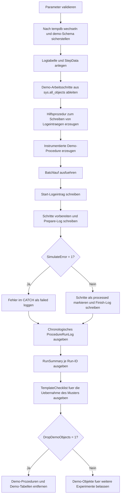

# ProcedureLoggingTemplate.sql

Dieses Skript baut in `tempdb` ein kleines Logging-Labor fuer Stored Procedures auf. Eine Hilfsprozedur schreibt standardisierte Logeintraege, eine zweite Demo-Procedure nutzt dieses Muster fuer Start, Vorbereitung, Abschluss und optionalen Fehlerpfad.

## Uebersicht

<!-- SQLDOC:SUMMARY_TABLE:BEGIN -->
| Feld | Wert |
|---|---|
| Script | [ProcedureLoggingTemplate.sql](ProcedureLoggingTemplate.sql) |
| Version | `1.0` |
| Typ | `didactic-lab` |
| Kapitel | `23_StoredProcedures` |
| Sicherheit | `demo-write-tempdb` |
| Zweck | Logging-Template fuer instrumentierte Prozedurlaeufe. |
<!-- SQLDOC:SUMMARY_TABLE:END -->

## Einordnung

Das Artefakt zeigt kein produktives Logging-Framework, sondern ein bewusst kleines Muster fuer Lehr- und Review-Zwecke. Im Vordergrund stehen wiederverwendbare Bausteine: eine Run-ID, klar benannte Phasen, ein eigener Fehlerpfad und eine verdichtete Auswertung der Logtabelle.

## Annahmen

- Es handelt sich um eine didaktische Erstversion ohne produktive Jobsteuerung oder persistente Logging-Infrastruktur.
- Alle Demo-Objekte werden ausschliesslich in `tempdb` angelegt.
- Die Demo-Procedure loggt Fehler intern und gibt sie ueber die Logtabelle sichtbar aus, statt sie nach aussen erneut zu werfen.
- Das Muster ist als Vorlage fuer spaetere produktionsnahe Erweiterungen gedacht, zum Beispiel mit Session-Kontext, Hostname oder persistenter Log-Retention.

## Anwendungsfall

Das Skript eignet sich fuer Kapitelabschnitte, in denen nachvollziehbar gezeigt werden soll, wie eine Stored Procedure ihre eigenen Laufphasen dokumentiert. Lernende sehen, welche Informationen bereits mit wenig SQL-Aufwand protokolliert werden koennen und wie daraus direkt ein Laufprotokoll plus Summary entsteht.

## Parameter

<!-- SQLDOC:PARAMETERS_TABLE:BEGIN -->
| Parameter | SQL-Typ | Pflicht | Beschreibung |
|---|---|---|---|
| `@BatchSize` | `INT` | Nein | Anzahl der Demo-Arbeitsschritte, die der instrumentierte Lauf verarbeitet. |
| `@SimulateError` | `BIT` | Nein | Erzwingt bei `1` einen Fehlerpfad innerhalb der Demo-Procedure. |
| `@DropDemoObjects` | `BIT` | Nein | Entfernt Demo-Prozeduren und Demo-Tabellen am Ende wieder aus `tempdb`, wenn `1`. |
<!-- SQLDOC:PARAMETERS_TABLE:END -->

## Abhaengigkeiten

<!-- SQLDOC:DEPENDENCIES_LIST:BEGIN -->
- `tempdb`
- `sys.schemas`
- `sys.all_objects`
- `sys.sp_executesql`
- `CREATE OR ALTER PROCEDURE`
- `NEWID()`
<!-- SQLDOC:DEPENDENCIES_LIST:END -->

## Hinweise

- `demo.usp_TemplateWriteLog` kapselt das eigentliche Schreiben in die Logtabelle und ist damit der Kern des wiederverwendbaren Musters.
- `demo.usp_RunLoggedBatch` zeigt, wie Start-, Fortschritts-, Abschluss- und Fehlerereignisse mit derselben Run-ID verbunden werden.
- Die Summary-Ausgabe verdichtet die Logeintraege pro Run und eignet sich als Grundlage fuer spaetere Monitoring- oder Dashboard-Schritte.

## Versionshistorie

<!-- SQLDOC:VERSION_HISTORY_TABLE:BEGIN -->
| Version | Datum | User | Beschreibung |
|---|---|---|---|
| `1.0` | `2026-04-17` | `ER` | Erstversion des Logging-Templates fuer instrumentierte Stored-Procedure-Laeufe |
<!-- SQLDOC:VERSION_HISTORY_TABLE:END -->

## Ablauf

<!-- SQLDOC:MERMAID:BEGIN -->

<!-- SQLDOC:MERMAID:END -->

## SQL-Code

<!-- SQLDOC:SQL_CODE:BEGIN -->
```sql
/*
BEGIN:SQL-HEADER v1
---
sql_header: v1
script_name: "ProcedureLoggingTemplate.sql"
script_version: "1.0"
script_type: "didactic-lab"
chapter: "23_StoredProcedures"

purpose: >
  Baut in tempdb ein Logging-Template fuer instrumentierte Stored-
  Procedure-Laeufe auf, inklusive Start-/Ende-Logging, Fehlerbehandlung
  und einer kompakten Auswertung der entstandenen Logeintraege.

parameters:
  - name: "@BatchSize"
    sql_type: "INT"
    direction: "IN"
    required: false
    description: "Anzahl der Demo-Arbeitsschritte, die der instrumentierte Lauf verarbeitet"
  - name: "@SimulateError"
    sql_type: "BIT"
    direction: "IN"
    required: false
    description: "1 = erzwingt einen Fehlerpfad innerhalb der Demo-Procedure"
  - name: "@DropDemoObjects"
    sql_type: "BIT"
    direction: "IN"
    required: false
    description: "1 = Demo-Prozeduren und Demo-Tabellen am Ende wieder aus tempdb entfernen"

result_sets:
  - name: "ProcedureRunLog"
    description: "Chronologisches Laufprotokoll mit Run-ID, Phase, Status und Meldung"
  - name: "ProcedureRunSummary"
    description: "Verdichtete Auswertung je Run mit Start-/Endzeit, Dauer und Fehlerstatus"
  - name: "TemplateChecklist"
    description: "Didaktische Checkliste fuer die Uebernahme des Logging-Musters in eigene Prozeduren"

dependencies:
  - "tempdb"
  - "sys.schemas"
  - "sys.all_objects"
  - "sys.sp_executesql"
  - "CREATE OR ALTER PROCEDURE"
  - "NEWID()"

safety:
  level: "demo-write-tempdb"
  writes_data: true

documentation:
  markdown_file: "T-SQL/23_StoredProcedures/SQLScripts/ProcedureLoggingTemplate.md"
  sync_blocks:
    - "SUMMARY_TABLE"
    - "PARAMETERS_TABLE"
    - "DEPENDENCIES_LIST"
    - "VERSION_HISTORY_TABLE"
    - "SQL_CODE"
  mermaid:
    mode: "ai-agent-from-sql"
    source: "script-body"

main_responsible:
  name: "Erhard Rainer"
  initials: "ER"

version_history:
  - version: "1.0"
    date: "2026-04-17"
    user: "ER"
    description: "Erstversion des Logging-Templates fuer instrumentierte Stored-Procedure-Laeufe"

notes:
  - "Alle Demo-Objekte werden ausschliesslich in tempdb angelegt"
  - "RunLog und StepData zeigen ein minimales, erweiterbares Muster fuer Start-, Fortschritts- und Fehler-Logging"
---
END:SQL-HEADER v1
*/

SET NOCOUNT ON;

DECLARE @BatchSize INT = 6;
DECLARE @SimulateError BIT = 0;
DECLARE @DropDemoObjects BIT = 1;

IF @BatchSize IS NULL OR @BatchSize < 1
BEGIN
    THROW 50000, '@BatchSize muss mindestens 1 sein.', 1;
END;

IF @SimulateError NOT IN (0, 1)
BEGIN
    THROW 50001, '@SimulateError muss 0 oder 1 sein.', 1;
END;

IF @DropDemoObjects NOT IN (0, 1)
BEGIN
    THROW 50002, '@DropDemoObjects muss 0 oder 1 sein.', 1;
END;

USE tempdb;

IF NOT EXISTS
(
    SELECT 1
    FROM sys.schemas
    WHERE name = N'demo'
)
BEGIN
    EXEC(N'CREATE SCHEMA demo AUTHORIZATION dbo;');
END;

DROP PROCEDURE IF EXISTS demo.usp_TemplateWriteLog;
DROP PROCEDURE IF EXISTS demo.usp_RunLoggedBatch;
DROP TABLE IF EXISTS demo.ProcedureRunLog;
DROP TABLE IF EXISTS demo.ProcedureStepData;

CREATE TABLE demo.ProcedureRunLog
(
    LogID            INT             NOT NULL IDENTITY(1,1) PRIMARY KEY,
    RunID            UNIQUEIDENTIFIER NOT NULL,
    ProcedureName    SYSNAME         NOT NULL,
    PhaseName        NVARCHAR(40)    NOT NULL,
    StatusLabel      NVARCHAR(20)    NOT NULL,
    StepNumber       INT             NULL,
    RowsAffected     INT             NULL,
    MessageText      NVARCHAR(4000)  NOT NULL,
    ErrorNumber      INT             NULL,
    LoggedAt         DATETIME2(0)    NOT NULL
        CONSTRAINT DF_ProcedureRunLog_LoggedAt DEFAULT SYSUTCDATETIME()
);

CREATE TABLE demo.ProcedureStepData
(
    StepNumber      INT            NOT NULL PRIMARY KEY,
    WorkloadLabel   NVARCHAR(40)   NOT NULL,
    WorkUnits       INT            NOT NULL,
    ProcessingState NVARCHAR(20)   NOT NULL
);

;WITH SeedRows AS
(
    SELECT TOP (@BatchSize)
        ROW_NUMBER() OVER (ORDER BY object_id) AS StepNumber
    FROM sys.all_objects
)
INSERT INTO demo.ProcedureStepData
(
    StepNumber,
    WorkloadLabel,
    WorkUnits,
    ProcessingState
)
SELECT
    sr.StepNumber,
    CONCAT(N'BatchStep-', RIGHT(CONCAT(N'00', sr.StepNumber), 2)) AS WorkloadLabel,
    10 + (sr.StepNumber * 5) AS WorkUnits,
    N'queued'
FROM SeedRows AS sr;

EXEC sys.sp_executesql
N'
CREATE OR ALTER PROCEDURE demo.usp_TemplateWriteLog
    @RunID UNIQUEIDENTIFIER,
    @ProcedureName SYSNAME,
    @PhaseName NVARCHAR(40),
    @StatusLabel NVARCHAR(20),
    @MessageText NVARCHAR(4000),
    @StepNumber INT = NULL,
    @RowsAffected INT = NULL,
    @ErrorNumber INT = NULL
AS
BEGIN
    SET NOCOUNT ON;

    INSERT INTO demo.ProcedureRunLog
    (
        RunID,
        ProcedureName,
        PhaseName,
        StatusLabel,
        StepNumber,
        RowsAffected,
        MessageText,
        ErrorNumber
    )
    VALUES
    (
        @RunID,
        @ProcedureName,
        @PhaseName,
        @StatusLabel,
        @StepNumber,
        @RowsAffected,
        @MessageText,
        @ErrorNumber
    );
END;
';

EXEC sys.sp_executesql
N'
CREATE OR ALTER PROCEDURE demo.usp_RunLoggedBatch
    @BatchSize INT,
    @SimulateError BIT = 0
AS
BEGIN
    SET NOCOUNT ON;

    DECLARE @RunID UNIQUEIDENTIFIER = NEWID();
    DECLARE @ProcedureName SYSNAME = CONCAT(OBJECT_SCHEMA_NAME(@@PROCID), N''.'', OBJECT_NAME(@@PROCID));
    DECLARE @ProcessedRows INT = 0;

    EXEC demo.usp_TemplateWriteLog
        @RunID = @RunID,
        @ProcedureName = @ProcedureName,
        @PhaseName = N''start'',
        @StatusLabel = N''started'',
        @MessageText = CONCAT(N''Batchlauf gestartet fuer '', @BatchSize, N'' Arbeitsschritte.'');

    BEGIN TRY
        IF @BatchSize < 1
        BEGIN
            THROW 51000, ''@BatchSize muss mindestens 1 sein.'', 1;
        END;

        IF @SimulateError NOT IN (0, 1)
        BEGIN
            THROW 51001, ''@SimulateError muss 0 oder 1 sein.'', 1;
        END;

        UPDATE step_data
        SET ProcessingState = N''ready''
        FROM demo.ProcedureStepData AS step_data
        WHERE step_data.StepNumber <= @BatchSize;

        SET @ProcessedRows = @@ROWCOUNT;

        EXEC demo.usp_TemplateWriteLog
            @RunID = @RunID,
            @ProcedureName = @ProcedureName,
            @PhaseName = N''prepare'',
            @StatusLabel = N''ok'',
            @RowsAffected = @ProcessedRows,
            @MessageText = N''Arbeitsschritte fuer die Verarbeitung vorbereitet.'';

        IF @SimulateError = 1
        BEGIN
            THROW 51002, ''Simulierter Fehler fuer das Logging-Template.'', 1;
        END;

        UPDATE step_data
        SET ProcessingState =
            CASE
                WHEN step_data.StepNumber <= @BatchSize THEN N''processed''
                ELSE step_data.ProcessingState
            END
        FROM demo.ProcedureStepData AS step_data;

        SET @ProcessedRows = @@ROWCOUNT;

        EXEC demo.usp_TemplateWriteLog
            @RunID = @RunID,
            @ProcedureName = @ProcedureName,
            @PhaseName = N''finish'',
            @StatusLabel = N''ok'',
            @RowsAffected = @ProcessedRows,
            @MessageText = N''Batchlauf erfolgreich abgeschlossen.'';
    END TRY
    BEGIN CATCH
        EXEC demo.usp_TemplateWriteLog
            @RunID = @RunID,
            @ProcedureName = @ProcedureName,
            @PhaseName = N''error'',
            @StatusLabel = N''failed'',
            @MessageText = ERROR_MESSAGE(),
            @ErrorNumber = ERROR_NUMBER();
    END CATCH
END;
';

EXEC demo.usp_RunLoggedBatch
    @BatchSize = @BatchSize,
    @SimulateError = @SimulateError;

SELECT
    log_entry.LogID,
    log_entry.RunID,
    log_entry.ProcedureName,
    log_entry.PhaseName,
    log_entry.StatusLabel,
    log_entry.StepNumber,
    log_entry.RowsAffected,
    log_entry.MessageText,
    log_entry.ErrorNumber,
    log_entry.LoggedAt
FROM demo.ProcedureRunLog AS log_entry
ORDER BY
    log_entry.LogID;

;WITH RunSummary AS
(
    SELECT
        log_entry.RunID,
        log_entry.ProcedureName,
        StartedAt = MIN(log_entry.LoggedAt),
        FinishedAt = MAX(log_entry.LoggedAt),
        DurationSeconds = DATEDIFF(SECOND, MIN(log_entry.LoggedAt), MAX(log_entry.LoggedAt)),
        LoggedEvents = COUNT(*),
        HadFailure = MAX(CASE WHEN log_entry.StatusLabel = N'failed' THEN 1 ELSE 0 END),
        RowsTouched = SUM(COALESCE(log_entry.RowsAffected, 0))
    FROM demo.ProcedureRunLog AS log_entry
    GROUP BY
        log_entry.RunID,
        log_entry.ProcedureName
)
SELECT
    rs.RunID,
    rs.ProcedureName,
    rs.StartedAt,
    rs.FinishedAt,
    rs.DurationSeconds,
    rs.LoggedEvents,
    HadFailure = CAST(rs.HadFailure AS BIT),
    rs.RowsTouched
FROM RunSummary AS rs
ORDER BY
    rs.StartedAt,
    rs.RunID;

SELECT
    ChecklistOrder,
    ChecklistItem,
    WhyItMatters
FROM
(
    VALUES
        (1, N''Run-ID frueh erzeugen'', N''Verbindet alle Logeintraege eines einzelnen Procedure-Laufs eindeutig.''),
        (2, N''Start und Ende explizit loggen'', N''Erleichtert Dauerberechnung und den Nachweis vollstaendiger Laeufe.''),
        (3, N''TRY/CATCH mit Fehlerlog'', N''Fehlermeldungen bleiben sichtbar, auch wenn kein THROW nach aussen erfolgt.''),
        (4, N''RowsAffected oder Kennzahlen mitloggen'', N''Macht Erfolg und Umfang eines Laufs nachvollziehbar.''),
        (5, N''Demo-Muster spaeter in persistente Logtabellen ueberfuehren'', N''Trennt didaktisches Lab von produktionsnaher Instrumentierung.'')
) AS checklist(ChecklistOrder, ChecklistItem, WhyItMatters)
ORDER BY
    ChecklistOrder;

IF @DropDemoObjects = 1
BEGIN
    DROP PROCEDURE IF EXISTS demo.usp_RunLoggedBatch;
    DROP PROCEDURE IF EXISTS demo.usp_TemplateWriteLog;
    DROP TABLE IF EXISTS demo.ProcedureRunLog;
    DROP TABLE IF EXISTS demo.ProcedureStepData;
END;
```
<!-- SQLDOC:SQL_CODE:END -->
