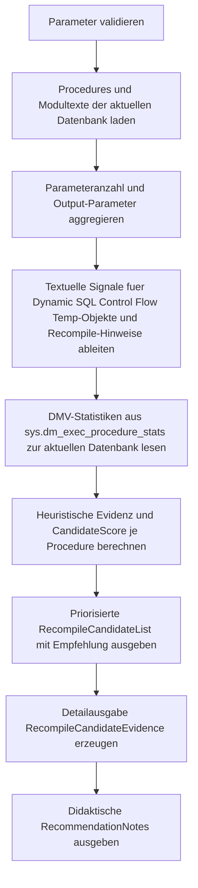

# ProcedureRecompileCandidateList.sql

Dieses Skript erstellt fuer die aktuelle Datenbank eine didaktische Kandidatenliste fuer gezielte Recompile-Strategien bei Stored Procedures. Es kombiniert DMV-Metriken und strukturelle Hinweise aus dem Procedure-Text, damit moegliche Recompile-Faelle schneller priorisiert werden koennen.

## Uebersicht

<!-- SQLDOC:SUMMARY_TABLE:BEGIN -->
| Feld | Wert |
|---|---|
| Script | [ProcedureRecompileCandidateList.sql](ProcedureRecompileCandidateList.sql) |
| Version | `1.0` |
| Typ | `diagnostic-query` |
| Kapitel | `23_StoredProcedures` |
| Sicherheit | `read-only` |
| Zweck | Heuristische Liste moeglicher Kandidaten fuer gezielte Recompile-Strategien. |
<!-- SQLDOC:SUMMARY_TABLE:END -->

## Einordnung

Gezieltes Recompile ist meist nur dann sinnvoll, wenn dieselbe Procedure unter unterschiedlichen Parametern oder Pfaden deutlich verschiedene Planformen benoetigt. Das Skript liefert dafuer eine priorisierte Sicht, ohne selbst eine automatische Performance-Entscheidung zu treffen.

## Annahmen

- Die Analyse laeuft rein lesend gegen die aktuelle Datenbank und nutzt dort vorhandene Stored Procedures.
- DMV-Werte aus `sys.dm_exec_procedure_stats` sind nur fuer bereits kompilierte oder gecachte Procedures verfuegbar.
- Hinweise auf optionale Parameter werden textuell aus dem Modultext abgeleitet und sind daher bewusst heuristisch.
- Ein hoher Score ist ein Pruefsignal fuer weitere Messungen, kein direkter Auftrag fuer `WITH RECOMPILE`.

## Anwendungsfall

Das Skript eignet sich fuer Reviews, Schulungen und erste Performance-Sichtung, wenn Procedures mit vielen Parametern, starker Verzweigungslogik oder Dynamic SQL schnell priorisiert werden sollen. Besonders hilfreich ist es als Vorsortierung vor tieferer Analyse mit Ausfuehrungsplaenen, Query Store oder reproduzierbaren Lasttests.

## Parameter

<!-- SQLDOC:PARAMETERS_TABLE:BEGIN -->
| Parameter | SQL-Typ | Pflicht | Beschreibung |
|---|---|---|---|
| `@SchemaLike` | `NVARCHAR(128)` | Nein | LIKE-Filter fuer Schemanamen. |
| `@ProcedureLike` | `NVARCHAR(128)` | Nein | LIKE-Filter fuer Procedure-Namen. |
| `@MinExecutionCount` | `BIGINT` | Nein | Mindestanzahl an DMV-Ausfuehrungen fuer die priorisierte Kandidatenliste. |
| `@MinAvgWorkerMs` | `DECIMAL(18,3)` | Nein | Schwellwert fuer durchschnittliche Worker-Zeit je Ausfuehrung. |
| `@TopN` | `INT` | Nein | Maximalzahl der priorisierten Kandidaten in der ersten Ausgabe. |
<!-- SQLDOC:PARAMETERS_TABLE:END -->

## Abhaengigkeiten

<!-- SQLDOC:DEPENDENCIES_LIST:BEGIN -->
- `sys.schemas`
- `sys.procedures`
- `sys.parameters`
- `sys.sql_modules`
- `sys.dm_exec_procedure_stats`
- `DB_NAME`
<!-- SQLDOC:DEPENDENCIES_LIST:END -->

## Hinweise

- Die erste Ausgabe zeigt die priorisierte Kandidatenliste mit Score, Band und kurzer Empfehlung.
- Die zweite Ausgabe legt die einzelnen Heuristik-Signale offen, damit die Bewertung transparent bleibt.
- Die dritte Ausgabe fasst didaktische Hinweise zusammen, wie Recompile-Indizien fachlich eingeordnet werden sollten.

## Versionshistorie

<!-- SQLDOC:VERSION_HISTORY_TABLE:BEGIN -->
| Version | Datum | User | Beschreibung |
|---|---|---|---|
| `1.0` | `2026-04-22` | `ER` | Erstversion der heuristischen Kandidatenliste fuer gezielte Recompile-Strategien |
<!-- SQLDOC:VERSION_HISTORY_TABLE:END -->

## Ablauf

<!-- SQLDOC:MERMAID:BEGIN -->

<!-- SQLDOC:MERMAID:END -->

## SQL-Code

<!-- SQLDOC:SQL_CODE:BEGIN -->
```sql
/*
BEGIN:SQL-HEADER v1
---
sql_header: v1
script_name: "ProcedureRecompileCandidateList.sql"
script_version: "1.0"
script_type: "diagnostic-query"
chapter: "23_StoredProcedures"

purpose: >
  Bewertet Stored Procedures der aktuellen Datenbank mit einer
  didaktischen Heuristik, um moegliche Kandidaten fuer gezielte
  Recompile-Strategien sichtbar zu machen.

parameters:
  - name: "@SchemaLike"
    sql_type: "NVARCHAR(128)"
    direction: "IN"
    required: false
    description: "LIKE-Filter fuer Schemanamen"
  - name: "@ProcedureLike"
    sql_type: "NVARCHAR(128)"
    direction: "IN"
    required: false
    description: "LIKE-Filter fuer Procedure-Namen"
  - name: "@MinExecutionCount"
    sql_type: "BIGINT"
    direction: "IN"
    required: false
    description: "Mindestanzahl an DMV-Ausfuehrungen fuer die Kandidatenliste"
  - name: "@MinAvgWorkerMs"
    sql_type: "DECIMAL(18,3)"
    direction: "IN"
    required: false
    description: "Schwelle fuer durchschnittliche Worker-Zeit pro Ausfuehrung"
  - name: "@TopN"
    sql_type: "INT"
    direction: "IN"
    required: false
    description: "Maximale Anzahl ausgegebener Kandidaten"

result_sets:
  - name: "RecompileCandidateList"
    description: "Priorisierte Liste mit Score, Heuristik-Signalen und DMV-Metriken"
  - name: "RecompileCandidateEvidence"
    description: "Detaillierte Evidenz pro Procedure fuer die Einordnung des Scores"
  - name: "RecommendationNotes"
    description: "Didaktische Hinweise zur Interpretation gezielter Recompile-Strategien"

dependencies:
  - "sys.schemas"
  - "sys.procedures"
  - "sys.parameters"
  - "sys.sql_modules"
  - "sys.dm_exec_procedure_stats"
  - "DB_NAME"

safety:
  level: "read-only"
  writes_data: false

documentation:
  markdown_file: "T-SQL/23_StoredProcedures/SQLScripts/ProcedureRecompileCandidateList.md"
  sync_blocks:
    - "SUMMARY_TABLE"
    - "PARAMETERS_TABLE"
    - "DEPENDENCIES_LIST"
    - "VERSION_HISTORY_TABLE"
    - "SQL_CODE"
  mermaid:
    mode: "ai-agent-from-sql"
    source: "script-body"

main_responsible:
  name: "Erhard Rainer"
  initials: "ER"

version_history:
  - version: "1.0"
    date: "2026-04-22"
    user: "ER"
    description: "Erstversion der heuristischen Kandidatenliste fuer gezielte Recompile-Strategien"

notes:
  - "Das Skript arbeitet rein lesend in der aktuellen Datenbank"
  - "Die Bewertung ist eine didaktische Heuristik und ersetzt keine tiefe Performance-Analyse"
---
END:SQL-HEADER v1
*/

SET NOCOUNT ON;

DECLARE @SchemaLike NVARCHAR(128) = N'%';
DECLARE @ProcedureLike NVARCHAR(128) = N'%';
DECLARE @MinExecutionCount BIGINT = 0;
DECLARE @MinAvgWorkerMs DECIMAL(18,3) = 5.000;
DECLARE @TopN INT = 25;

IF NULLIF(LTRIM(RTRIM(@SchemaLike)), N'') IS NULL
BEGIN
    THROW 50000, '@SchemaLike darf nicht leer sein.', 1;
END;

IF NULLIF(LTRIM(RTRIM(@ProcedureLike)), N'') IS NULL
BEGIN
    THROW 50001, '@ProcedureLike darf nicht leer sein.', 1;
END;

IF @MinExecutionCount IS NULL OR @MinExecutionCount < 0
BEGIN
    THROW 50002, '@MinExecutionCount darf nicht negativ sein.', 1;
END;

IF @MinAvgWorkerMs IS NULL OR @MinAvgWorkerMs < 0
BEGIN
    THROW 50003, '@MinAvgWorkerMs darf nicht negativ sein.', 1;
END;

IF @TopN IS NULL OR @TopN <= 0
BEGIN
    THROW 50004, '@TopN muss groesser als 0 sein.', 1;
END;

;WITH ProcedureCatalog AS
(
    SELECT
        proc.object_id,
        SchemaName = sch.name,
        ProcedureName = proc.name,
        QualifiedName = CONCAT(QUOTENAME(sch.name), N'.', QUOTENAME(proc.name)),
        DefinitionText = CAST(sm.definition AS NVARCHAR(MAX))
    FROM sys.procedures AS proc
    INNER JOIN sys.schemas AS sch
        ON proc.schema_id = sch.schema_id
    LEFT JOIN sys.sql_modules AS sm
        ON proc.object_id = sm.object_id
    WHERE sch.name LIKE @SchemaLike
      AND proc.name LIKE @ProcedureLike
),
ParameterStats AS
(
    SELECT
        p.object_id,
        ParameterCount = COUNT(*),
        OutputParameterCount = SUM(CASE WHEN p.is_output = 1 THEN 1 ELSE 0 END)
    FROM sys.parameters AS p
    GROUP BY
        p.object_id
),
ModuleSignals AS
(
    SELECT
        pc.object_id,
        HasDynamicSql =
            CAST
            (
                CASE
                    WHEN pc.DefinitionText LIKE N'%sp_executesql%'
                      OR pc.DefinitionText LIKE N'%EXEC (%'
                      OR pc.DefinitionText LIKE N'%EXEC(%'
                        THEN 1
                    ELSE 0
                END
                AS BIT
            ),
        HasControlFlow =
            CAST
            (
                CASE
                    WHEN pc.DefinitionText LIKE N'%IF %'
                      OR pc.DefinitionText LIKE N'%WHILE %'
                      OR pc.DefinitionText LIKE N'%CASE %'
                        THEN 1
                    ELSE 0
                END
                AS BIT
            ),
        UsesTempObjects =
            CAST
            (
                CASE
                    WHEN pc.DefinitionText LIKE N'%#%'
                        THEN 1
                    ELSE 0
                END
                AS BIT
            ),
        HasOptionalParameterHint =
            CAST
            (
                CASE
                    WHEN pc.DefinitionText LIKE N'%@%=%'
                        THEN 1
                    ELSE 0
                END
                AS BIT
            ),
        HasExistingRecompileHint =
            CAST
            (
                CASE
                    WHEN pc.DefinitionText LIKE N'%WITH RECOMPILE%'
                      OR pc.DefinitionText LIKE N'%OPTION (RECOMPILE)%'
                        THEN 1
                    ELSE 0
                END
                AS BIT
            )
    FROM ProcedureCatalog AS pc
),
CachedStats AS
(
    SELECT
        ps.object_id,
        ps.execution_count,
        total_worker_ms = CAST(ps.total_worker_time / 1000.0 AS DECIMAL(18,3)),
        total_elapsed_ms = CAST(ps.total_elapsed_time / 1000.0 AS DECIMAL(18,3)),
        avg_worker_ms = CAST((ps.total_worker_time * 1.0 / NULLIF(ps.execution_count, 0)) / 1000.0 AS DECIMAL(18,3)),
        avg_elapsed_ms = CAST((ps.total_elapsed_time * 1.0 / NULLIF(ps.execution_count, 0)) / 1000.0 AS DECIMAL(18,3)),
        avg_logical_reads = CAST(ps.total_logical_reads * 1.0 / NULLIF(ps.execution_count, 0) AS DECIMAL(18,2)),
        ps.cached_time,
        ps.last_execution_time
    FROM sys.dm_exec_procedure_stats AS ps
    WHERE ps.database_id = DB_ID()
),
Evidence AS
(
    SELECT
        DatabaseName = DB_NAME(),
        pc.SchemaName,
        pc.ProcedureName,
        pc.QualifiedName,
        ParameterCount = COALESCE(par.ParameterCount, 0),
        OutputParameterCount = COALESCE(par.OutputParameterCount, 0),
        ms.HasDynamicSql,
        ms.HasControlFlow,
        ms.UsesTempObjects,
        ms.HasOptionalParameterHint,
        ms.HasExistingRecompileHint,
        execution_count = COALESCE(cs.execution_count, 0),
        cs.total_worker_ms,
        cs.total_elapsed_ms,
        cs.avg_worker_ms,
        cs.avg_elapsed_ms,
        cs.avg_logical_reads,
        cs.cached_time,
        cs.last_execution_time,
        CandidateScore =
              CASE WHEN COALESCE(par.ParameterCount, 0) >= 3 THEN 2 ELSE 0 END
            + CASE WHEN COALESCE(par.OutputParameterCount, 0) > 0 THEN 1 ELSE 0 END
            + CASE WHEN ms.HasOptionalParameterHint = 1 THEN 1 ELSE 0 END
            + CASE WHEN ms.HasControlFlow = 1 THEN 1 ELSE 0 END
            + CASE WHEN ms.HasDynamicSql = 1 THEN 2 ELSE 0 END
            + CASE WHEN ms.UsesTempObjects = 1 THEN 1 ELSE 0 END
            + CASE WHEN COALESCE(cs.execution_count, 0) >= @MinExecutionCount AND COALESCE(cs.execution_count, 0) > 0 THEN 1 ELSE 0 END
            + CASE WHEN COALESCE(cs.avg_worker_ms, 0.000) >= @MinAvgWorkerMs THEN 2 ELSE 0 END
            + CASE WHEN COALESCE(cs.avg_logical_reads, 0.00) >= 1000.00 THEN 1 ELSE 0 END
    FROM ProcedureCatalog AS pc
    LEFT JOIN ParameterStats AS par
        ON pc.object_id = par.object_id
    LEFT JOIN ModuleSignals AS ms
        ON pc.object_id = ms.object_id
    LEFT JOIN CachedStats AS cs
        ON pc.object_id = cs.object_id
),
RankedCandidates AS
(
    SELECT
        e.*,
        RecommendationBand =
            CASE
                WHEN e.CandidateScore >= 8 THEN N'High'
                WHEN e.CandidateScore >= 5 THEN N'Medium'
                ELSE N'Observe'
            END
    FROM Evidence AS e
    WHERE e.execution_count >= @MinExecutionCount
       OR e.execution_count = 0
)
SELECT TOP (@TopN)
    rc.DatabaseName,
    rc.SchemaName,
    rc.ProcedureName,
    rc.QualifiedName,
    rc.RecommendationBand,
    rc.CandidateScore,
    rc.ParameterCount,
    rc.OutputParameterCount,
    rc.execution_count,
    rc.avg_worker_ms,
    rc.avg_elapsed_ms,
    rc.avg_logical_reads,
    rc.HasDynamicSql,
    rc.HasControlFlow,
    rc.UsesTempObjects,
    rc.HasOptionalParameterHint,
    rc.HasExistingRecompileHint,
    RecommendationText =
        CASE
            WHEN rc.HasExistingRecompileHint = 1
                THEN N'Recompile-Hinweis bereits vorhanden; Einsatz und Umfang zuerst bestaetigen.'
            WHEN rc.CandidateScore >= 8
                THEN N'Gezielte Pruefung fuer WITH RECOMPILE, sp_recompile oder alternative Planstabilisierung sinnvoll.'
            WHEN rc.CandidateScore >= 5
                THEN N'Als Beobachtungskandidat fuer parameterabhaengige Planunterschiede oder komplexe Steuerlogik einordnen.'
            ELSE N'Zunaechst messen und nur bei reproduzierbaren Planproblemen ueber Recompile sprechen.'
        END,
    rc.cached_time,
    rc.last_execution_time
FROM RankedCandidates AS rc
ORDER BY
    rc.CandidateScore DESC,
    rc.avg_worker_ms DESC,
    rc.execution_count DESC,
    rc.QualifiedName;

SELECT
    e.DatabaseName,
    e.SchemaName,
    e.ProcedureName,
    e.QualifiedName,
    e.CandidateScore,
    ParameterComplexitySignal = CASE WHEN e.ParameterCount >= 3 THEN N'yes' ELSE N'no' END,
    OutputParameterSignal = CASE WHEN e.OutputParameterCount > 0 THEN N'yes' ELSE N'no' END,
    OptionalParameterSignal = CASE WHEN e.HasOptionalParameterHint = 1 THEN N'yes' ELSE N'no' END,
    ControlFlowSignal = CASE WHEN e.HasControlFlow = 1 THEN N'yes' ELSE N'no' END,
    DynamicSqlSignal = CASE WHEN e.HasDynamicSql = 1 THEN N'yes' ELSE N'no' END,
    TempObjectSignal = CASE WHEN e.UsesTempObjects = 1 THEN N'yes' ELSE N'no' END,
    ExistingRecompileSignal = CASE WHEN e.HasExistingRecompileHint = 1 THEN N'yes' ELSE N'no' END,
    e.execution_count,
    e.total_worker_ms,
    e.total_elapsed_ms,
    e.avg_worker_ms,
    e.avg_elapsed_ms,
    e.avg_logical_reads,
    e.cached_time,
    e.last_execution_time
FROM Evidence AS e
ORDER BY
    e.CandidateScore DESC,
    e.QualifiedName;

SELECT
    NoteOrder,
    NoteTitle,
    NoteText
FROM
(
    VALUES
        (1, N'Heuristik statt Beweis', N'Der Score zeigt nur Indizien. Eine belastbare Entscheidung fuer gezieltes Recompile braucht reproduzierbare Messungen und Planvergleich.'),
        (2, N'Parameter und Verzweigungen', N'Viele Parameter, optionale Filter und starke IF-Zweige koennen darauf hindeuten, dass dieselbe Procedure sehr unterschiedliche Planformen benoetigt.'),
        (3, N'Dynamic SQL getrennt betrachten', N'Dynamic SQL kann gezielt fuer stabilere Plaene eingesetzt werden, ist aber kein Automatismus fuer WITH RECOMPILE.'),
        (4, N'Vorhandene Recompile-Hinweise pruefen', N'Wenn eine Procedure bereits WITH RECOMPILE oder OPTION (RECOMPILE) nutzt, sollte zuerst begruendet werden, ob dieser Umfang weiterhin passend ist.')
) AS notes(NoteOrder, NoteTitle, NoteText)
ORDER BY
    NoteOrder;
```
<!-- SQLDOC:SQL_CODE:END -->
