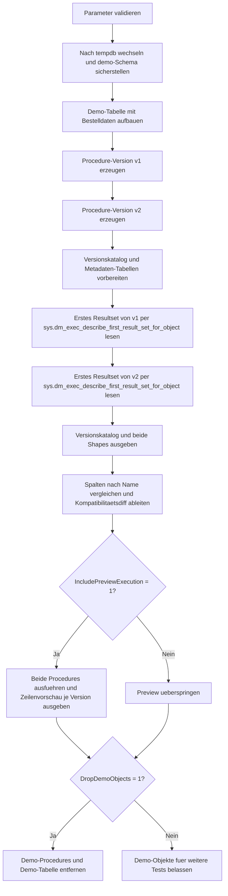

# ProcedureResultSetVersioning.sql

Dieses Skript baut in `tempdb` zwei bewusst unterschiedliche Stored-Procedure-Versionen auf und vergleicht ihr erstes Resultset ueber Metadaten statt ueber zufaellige Sichtkontrolle. Damit laesst sich didaktisch zeigen, welche Aenderungen an Spalten, Reihenfolge oder Datentypen als echte Vertragsaenderung behandelt werden sollten.

## Uebersicht

<!-- SQLDOC:SUMMARY_TABLE:BEGIN -->
| Feld | Wert |
|---|---|
| Script | [ProcedureResultSetVersioning.sql](ProcedureResultSetVersioning.sql) |
| Version | `1.0` |
| Typ | `didactic-lab` |
| Kapitel | `23_StoredProcedures` |
| Sicherheit | `demo-write-tempdb` |
| Zweck | Vergleicht zwei Procedure-Versionen ueber ihr erstes Resultset und macht strukturelle Breaking Changes sichtbar. |
<!-- SQLDOC:SUMMARY_TABLE:END -->

## Einordnung

Bei Stored Procedures ist nicht nur die fachliche Logik relevant, sondern auch die Form des zurueckgegebenen Resultsets. Das Skript behandelt diese Form als API-Vertrag und zeigt, wie man Version `v1` und `v2` ueber Metadaten freigabefaehig miteinander vergleichen kann.

## Annahmen

- Die Umsetzung ist ein didaktisches Lab und nutzt ausschliesslich Demo-Objekte in `tempdb`.
- Verglichen wird bewusst nur das erste Resultset, weil genau dieser Fall in vielen Clients und ETL-Strecken die stabilste Schnittstelle bildet.
- Die Vorschauausgabe ist optional und dient nur dazu, die Metadaten mit konkreten Demo-Zeilen zu verknuepfen.
- Spaltenreihenfolge wird als relevanter Vertragsbestandteil betrachtet, weil positionsbasierte Konsumenten daran haengen koennen.

## Anwendungsfall

Das Skript eignet sich fuer Reviews vor API-Aenderungen an Stored Procedures, fuer Schulungen zu Breaking Changes und fuer die Dokumentation von Resultset-Vertraegen. Besonders hilfreich ist es, wenn eine bestehende Procedure fachlich erweitert werden soll, ohne unbeabsichtigt alte Konsumenten zu brechen.

## Parameter

<!-- SQLDOC:PARAMETERS_TABLE:BEGIN -->
| Parameter | SQL-Typ | Pflicht | Beschreibung |
|---|---|---|---|
| `@ProcedureBaseName` | `SYSNAME` | Nein | Basename fuer die Demo-Procedures im Schema `demo`. |
| `@IncludePreviewExecution` | `BIT` | Nein | Fuehrt bei `1` beide Demo-Procedures aus und zeigt eine Datenvorschau. |
| `@DropDemoObjects` | `BIT` | Nein | Entfernt Demo-Objekte am Ende wieder aus `tempdb`. |
<!-- SQLDOC:PARAMETERS_TABLE:END -->

## Abhaengigkeiten

<!-- SQLDOC:DEPENDENCIES_LIST:BEGIN -->
- `tempdb`
- `sys.schemas`
- `sys.dm_exec_describe_first_result_set_for_object`
- `CREATE OR ALTER PROCEDURE`
<!-- SQLDOC:DEPENDENCIES_LIST:END -->

## Hinweise

- `v1` liefert ein kompaktes Baseline-Resultset mit `NetAmount`.
- `v2` fuegt neue Spalten hinzu, verschiebt die Reihenfolge und ersetzt `NetAmount` durch `GrossAmount`.
- Der Diff zeigt nicht nur Unterschiede, sondern ordnet sie direkt als Kompatibilitaetsrisiko ein.
- Fuer echte Releases kann derselbe Vergleich mit produktionsnahen Procedure-Versionen oder in Build-Pipelines wiederverwendet werden.

## Versionshistorie

<!-- SQLDOC:VERSION_HISTORY_TABLE:BEGIN -->
| Version | Datum | User | Beschreibung |
|---|---|---|---|
| `1.0` | `2026-04-22` | `ER` | Erstversion des tempdb-Labs fuer Resultset-Versionierung und Metadatenvergleich |
<!-- SQLDOC:VERSION_HISTORY_TABLE:END -->

## Ablauf

<!-- SQLDOC:MERMAID:BEGIN -->

<!-- SQLDOC:MERMAID:END -->

## SQL-Code

<!-- SQLDOC:SQL_CODE:BEGIN -->
```sql
/*
BEGIN:SQL-HEADER v1
---
sql_header: v1
script_name: "ProcedureResultSetVersioning.sql"
script_version: "1.0"
script_type: "didactic-lab"
chapter: "23_StoredProcedures"

purpose: >
  Baut in tempdb zwei Demo-Procedures mit unterschiedlichen ersten Resultsets
  auf und zeigt, wie Resultset-Versionen ueber Metadaten verglichen,
  dokumentiert und als Delta ausgewertet werden koennen.

parameters:
  - name: "@ProcedureBaseName"
    sql_type: "SYSNAME"
    direction: "IN"
    required: false
    description: "Basename fuer die Demo-Procedures im Schema demo"
  - name: "@IncludePreviewExecution"
    sql_type: "BIT"
    direction: "IN"
    required: false
    description: "1 = fuehrt beide Demo-Procedures aus und zeigt eine Vorschau ihrer Daten"
  - name: "@DropDemoObjects"
    sql_type: "BIT"
    direction: "IN"
    required: false
    description: "1 = entfernt Demo-Objekte am Ende wieder aus tempdb"

result_sets:
  - name: "VersionCatalog"
    description: "Didaktischer Katalog der beiden Resultset-Versionen mit Freigabehinweisen"
  - name: "ResultSetShape_V1"
    description: "Metadaten des ersten Resultsets der Version 1"
  - name: "ResultSetShape_V2"
    description: "Metadaten des ersten Resultsets der Version 2"
  - name: "ResultSetVersionDiff"
    description: "Vergleich der Spalten, Datentypen, Nullability und Reihenfolge zwischen beiden Versionen"
  - name: "ExecutionPreview"
    description: "Optionale Demo-Ausfuehrung beider Procedure-Versionen mit Versionslabel"

dependencies:
  - "tempdb"
  - "sys.schemas"
  - "sys.dm_exec_describe_first_result_set_for_object"
  - "CREATE OR ALTER PROCEDURE"

safety:
  level: "demo-write-tempdb"
  writes_data: true

documentation:
  markdown_file: "T-SQL/23_StoredProcedures/SQLScripts/ProcedureResultSetVersioning.md"
  sync_blocks:
    - "SUMMARY_TABLE"
    - "PARAMETERS_TABLE"
    - "DEPENDENCIES_LIST"
    - "VERSION_HISTORY_TABLE"
    - "SQL_CODE"
  mermaid:
    mode: "ai-agent-from-sql"
    source: "script-body"

main_responsible:
  name: "Erhard Rainer"
  initials: "ER"

version_history:
  - version: "1.0"
    date: "2026-04-22"
    user: "ER"
    description: "Erstversion des tempdb-Labs fuer Resultset-Versionierung und Metadatenvergleich"

notes:
  - "Alle Demo-Objekte entstehen ausschliesslich in tempdb"
  - "Verglichen wird bewusst nur das erste Resultset der jeweiligen Procedure-Version"
---
END:SQL-HEADER v1
*/

SET NOCOUNT ON;

DECLARE @ProcedureBaseName SYSNAME = N'usp_ResultSetVersioningDemo';
DECLARE @IncludePreviewExecution BIT = 1;
DECLARE @DropDemoObjects BIT = 1;

DECLARE @ProcedureObjectNameV1 SYSNAME = @ProcedureBaseName + N'_v1';
DECLARE @ProcedureObjectNameV2 SYSNAME = @ProcedureBaseName + N'_v2';
DECLARE @ProcedureFullNameV1 NVARCHAR(300) = N'demo.' + @ProcedureObjectNameV1;
DECLARE @ProcedureFullNameV2 NVARCHAR(300) = N'demo.' + @ProcedureObjectNameV2;
DECLARE @QualifiedProcedureV1 NVARCHAR(320) = N'[demo].' + QUOTENAME(@ProcedureObjectNameV1);
DECLARE @QualifiedProcedureV2 NVARCHAR(320) = N'[demo].' + QUOTENAME(@ProcedureObjectNameV2);

IF NULLIF(LTRIM(RTRIM(@ProcedureBaseName)), N'') IS NULL
BEGIN
    THROW 50000, '@ProcedureBaseName darf nicht leer sein.', 1;
END;

IF @IncludePreviewExecution NOT IN (0, 1)
BEGIN
    THROW 50001, '@IncludePreviewExecution muss 0 oder 1 sein.', 1;
END;

IF @DropDemoObjects NOT IN (0, 1)
BEGIN
    THROW 50002, '@DropDemoObjects muss 0 oder 1 sein.', 1;
END;

USE tempdb;

IF NOT EXISTS
(
    SELECT 1
    FROM sys.schemas
    WHERE name = N'demo'
)
BEGIN
    EXEC(N'CREATE SCHEMA demo AUTHORIZATION dbo;');
END;

EXEC(N'DROP PROCEDURE IF EXISTS ' + @QualifiedProcedureV1 + N';');
EXEC(N'DROP PROCEDURE IF EXISTS ' + @QualifiedProcedureV2 + N';');
DROP TABLE IF EXISTS demo.ResultSetVersioningOrders;

CREATE TABLE demo.ResultSetVersioningOrders
(
    OrderID       INT             NOT NULL PRIMARY KEY,
    CustomerCode  NVARCHAR(20)    NOT NULL,
    OrderDate     DATE            NOT NULL,
    NetAmount     DECIMAL(12,2)   NOT NULL,
    CurrencyCode  CHAR(3)         NOT NULL,
    StatusLabel   NVARCHAR(20)    NOT NULL,
    SalesChannel  NVARCHAR(20)    NULL
);

INSERT INTO demo.ResultSetVersioningOrders
(
    OrderID,
    CustomerCode,
    OrderDate,
    NetAmount,
    CurrencyCode,
    StatusLabel,
    SalesChannel
)
VALUES
    (1001, N'CUST-100', '2026-02-03', 1250.00, 'EUR', N'Open',      N'Portal'),
    (1002, N'CUST-100', '2026-02-17',  320.00, 'EUR', N'Invoiced',  N'Portal'),
    (1003, N'CUST-210', '2026-03-02',  899.90, 'USD', N'Open',      N'Partner'),
    (1004, N'CUST-305', '2026-03-08', 1420.50, 'EUR', N'Shipped',   NULL),
    (1005, N'CUST-450', '2026-03-12',  210.00, 'GBP', N'Cancelled', N'Phone');

EXEC
(
    N'CREATE OR ALTER PROCEDURE ' + @QualifiedProcedureV1 + N'
AS
BEGIN
    SET NOCOUNT ON;

    SELECT
        o.OrderID,
        o.CustomerCode,
        o.OrderDate,
        o.NetAmount
    FROM demo.ResultSetVersioningOrders AS o
    WHERE o.StatusLabel <> N''Cancelled''
    ORDER BY
        o.OrderDate,
        o.OrderID;
END;'
);

EXEC
(
    N'CREATE OR ALTER PROCEDURE ' + @QualifiedProcedureV2 + N'
AS
BEGIN
    SET NOCOUNT ON;

    SELECT
        o.OrderID,
        o.CustomerCode,
        GrossAmount = CAST(o.NetAmount * 1.19 AS DECIMAL(12,2)),
        o.OrderDate,
        o.StatusLabel,
        IsInternational =
            CAST
            (
                CASE
                    WHEN o.CurrencyCode <> ''EUR'' THEN 1
                    ELSE 0
                END
                AS BIT
            )
    FROM demo.ResultSetVersioningOrders AS o
    WHERE o.StatusLabel <> N''Cancelled''
    ORDER BY
        o.OrderDate,
        o.OrderID;
END;'
);

DROP TABLE IF EXISTS #VersionCatalog;
DROP TABLE IF EXISTS #ResultShapeV1;
DROP TABLE IF EXISTS #ResultShapeV2;

CREATE TABLE #VersionCatalog
(
    VersionLabel          NVARCHAR(10)   NOT NULL,
    ProcedureName         NVARCHAR(256)  NOT NULL,
    ReleaseIntent         NVARCHAR(120)  NOT NULL,
    CompatibilityContract NVARCHAR(160)  NOT NULL
);

CREATE TABLE #ResultShapeV1
(
    is_hidden                    BIT             NULL,
    column_ordinal               INT             NULL,
    name                         SYSNAME         NULL,
    is_nullable                  BIT             NULL,
    system_type_id               INT             NULL,
    system_type_name             NVARCHAR(256)   NULL,
    max_length                   SMALLINT        NULL,
    precision                    TINYINT         NULL,
    scale                        TINYINT         NULL,
    collation_name               SYSNAME         NULL,
    user_type_id                 INT             NULL,
    user_type_database           SYSNAME         NULL,
    user_type_schema             SYSNAME         NULL,
    user_type_name               SYSNAME         NULL,
    assembly_qualified_type_name NVARCHAR(4000)  NULL,
    xml_collection_id            INT             NULL,
    xml_collection_database      SYSNAME         NULL,
    xml_collection_schema        SYSNAME         NULL,
    xml_collection_name          SYSNAME         NULL,
    is_xml_document              BIT             NULL,
    is_case_sensitive            BIT             NULL,
    is_fixed_length_clr_type     BIT             NULL,
    source_server                SYSNAME         NULL,
    source_database              SYSNAME         NULL,
    source_schema                SYSNAME         NULL,
    source_table                 SYSNAME         NULL,
    source_column                SYSNAME         NULL,
    is_identity_column           BIT             NULL,
    is_part_of_unique_key        BIT             NULL,
    is_updateable                BIT             NULL,
    is_computed_column           BIT             NULL,
    is_sparse_column_set         BIT             NULL,
    ordinal_in_order_by_list     SMALLINT        NULL,
    order_by_list_length         SMALLINT        NULL,
    order_by_is_descending       SMALLINT        NULL,
    tds_type_id                  INT             NULL,
    tds_length                   INT             NULL,
    tds_collation_id             INT             NULL,
    tds_collation_sort_id        TINYINT         NULL
);

CREATE TABLE #ResultShapeV2
(
    is_hidden                    BIT             NULL,
    column_ordinal               INT             NULL,
    name                         SYSNAME         NULL,
    is_nullable                  BIT             NULL,
    system_type_id               INT             NULL,
    system_type_name             NVARCHAR(256)   NULL,
    max_length                   SMALLINT        NULL,
    precision                    TINYINT         NULL,
    scale                        TINYINT         NULL,
    collation_name               SYSNAME         NULL,
    user_type_id                 INT             NULL,
    user_type_database           SYSNAME         NULL,
    user_type_schema             SYSNAME         NULL,
    user_type_name               SYSNAME         NULL,
    assembly_qualified_type_name NVARCHAR(4000)  NULL,
    xml_collection_id            INT             NULL,
    xml_collection_database      SYSNAME         NULL,
    xml_collection_schema        SYSNAME         NULL,
    xml_collection_name          SYSNAME         NULL,
    is_xml_document              BIT             NULL,
    is_case_sensitive            BIT             NULL,
    is_fixed_length_clr_type     BIT             NULL,
    source_server                SYSNAME         NULL,
    source_database              SYSNAME         NULL,
    source_schema                SYSNAME         NULL,
    source_table                 SYSNAME         NULL,
    source_column                SYSNAME         NULL,
    is_identity_column           BIT             NULL,
    is_part_of_unique_key        BIT             NULL,
    is_updateable                BIT             NULL,
    is_computed_column           BIT             NULL,
    is_sparse_column_set         BIT             NULL,
    ordinal_in_order_by_list     SMALLINT        NULL,
    order_by_list_length         SMALLINT        NULL,
    order_by_is_descending       SMALLINT        NULL,
    tds_type_id                  INT             NULL,
    tds_length                   INT             NULL,
    tds_collation_id             INT             NULL,
    tds_collation_sort_id        TINYINT         NULL
);

INSERT INTO #VersionCatalog
(
    VersionLabel,
    ProcedureName,
    ReleaseIntent,
    CompatibilityContract
)
VALUES
    (N'v1', @ProcedureFullNameV1, N'Baseline fuer bestehende Konsumenten', N'Vier Spalten mit NetAmount als Geldwert der Ausgangsversion'),
    (N'v2', @ProcedureFullNameV2, N'Erweitertes Reporting fuer API-Version 2', N'Neue Spalten und geaenderte Reihenfolge erfordern eine bewusste Versionsentscheidung');

INSERT INTO #ResultShapeV1
SELECT *
FROM sys.dm_exec_describe_first_result_set_for_object
(
    OBJECT_ID(@ProcedureFullNameV1),
    0
);

INSERT INTO #ResultShapeV2
SELECT *
FROM sys.dm_exec_describe_first_result_set_for_object
(
    OBJECT_ID(@ProcedureFullNameV2),
    0
);

SELECT
    vc.VersionLabel,
    vc.ProcedureName,
    vc.ReleaseIntent,
    vc.CompatibilityContract
FROM #VersionCatalog AS vc
ORDER BY
    vc.VersionLabel;

SELECT
    VersionLabel = N'v1',
    r.column_ordinal,
    r.name AS column_name,
    r.system_type_name,
    r.is_nullable,
    r.source_table,
    r.source_column
FROM #ResultShapeV1 AS r
WHERE r.is_hidden = 0 OR r.is_hidden IS NULL
ORDER BY
    r.column_ordinal;

SELECT
    VersionLabel = N'v2',
    r.column_ordinal,
    r.name AS column_name,
    r.system_type_name,
    r.is_nullable,
    r.source_table,
    r.source_column
FROM #ResultShapeV2 AS r
WHERE r.is_hidden = 0 OR r.is_hidden IS NULL
ORDER BY
    r.column_ordinal;

;WITH Version1 AS
(
    SELECT
        column_ordinal,
        column_name = name,
        system_type_name,
        is_nullable
    FROM #ResultShapeV1
    WHERE is_hidden = 0 OR is_hidden IS NULL
),
Version2 AS
(
    SELECT
        column_ordinal,
        column_name = name,
        system_type_name,
        is_nullable
    FROM #ResultShapeV2
    WHERE is_hidden = 0 OR is_hidden IS NULL
),
DiffByName AS
(
    SELECT
        ColumnName = COALESCE(v1.column_name, v2.column_name),
        OrdinalV1 = v1.column_ordinal,
        OrdinalV2 = v2.column_ordinal,
        TypeV1 = v1.system_type_name,
        TypeV2 = v2.system_type_name,
        NullableV1 = v1.is_nullable,
        NullableV2 = v2.is_nullable,
        ChangeType =
            CASE
                WHEN v1.column_name IS NULL THEN N'added'
                WHEN v2.column_name IS NULL THEN N'removed'
                WHEN v1.system_type_name <> v2.system_type_name THEN N'type_changed'
                WHEN ISNULL(v1.is_nullable, 0) <> ISNULL(v2.is_nullable, 0) THEN N'nullability_changed'
                WHEN v1.column_ordinal <> v2.column_ordinal THEN N'ordinal_changed'
                ELSE N'unchanged'
            END
    FROM Version1 AS v1
    FULL OUTER JOIN Version2 AS v2
        ON v1.column_name = v2.column_name
)
SELECT
    d.ColumnName,
    d.ChangeType,
    d.OrdinalV1,
    d.OrdinalV2,
    d.TypeV1,
    d.TypeV2,
    d.NullableV1,
    d.NullableV2,
    CompatibilityImpact =
        CASE d.ChangeType
            WHEN N'added' THEN N'Kann fuer SELECT * und positionsbasierte Konsumenten brechen.'
            WHEN N'removed' THEN N'Entfernte Spalten brechen bestehende Konsumenten in der Regel direkt.'
            WHEN N'type_changed' THEN N'Datentypwechsel erfordert abgestimmte Freigabe und Anpassung der Konsumenten.'
            WHEN N'nullability_changed' THEN N'Nullability-Aenderungen sollten vertraglich dokumentiert und getestet werden.'
            WHEN N'ordinal_changed' THEN N'Spaltenreihenfolge ist fuer positionsbasierte Leser ein Breaking Change.'
            ELSE N'Keine Strukturabweichung fuer diese Spalte.'
        END
FROM DiffByName AS d
ORDER BY
    CASE d.ChangeType
        WHEN N'unchanged' THEN 2
        ELSE 1
    END,
    COALESCE(d.OrdinalV2, d.OrdinalV1),
    d.ColumnName;

IF @IncludePreviewExecution = 1
BEGIN
    DROP TABLE IF EXISTS #PreviewV1;
    DROP TABLE IF EXISTS #PreviewV2;

    CREATE TABLE #PreviewV1
    (
        OrderID       INT            NOT NULL,
        CustomerCode  NVARCHAR(20)   NOT NULL,
        OrderDate     DATE           NOT NULL,
        NetAmount     DECIMAL(12,2)  NOT NULL
    );

    CREATE TABLE #PreviewV2
    (
        OrderID         INT            NOT NULL,
        CustomerCode    NVARCHAR(20)   NOT NULL,
        GrossAmount     DECIMAL(12,2)  NOT NULL,
        OrderDate       DATE           NOT NULL,
        StatusLabel     NVARCHAR(20)   NOT NULL,
        IsInternational BIT            NOT NULL
    );

    EXEC(N'INSERT INTO #PreviewV1 EXEC ' + @QualifiedProcedureV1 + N';');
    EXEC(N'INSERT INTO #PreviewV2 EXEC ' + @QualifiedProcedureV2 + N';');

    SELECT
        VersionLabel = N'v1',
        p.OrderID,
        p.CustomerCode,
        GrossAmount = CAST(NULL AS DECIMAL(12,2)),
        p.OrderDate,
        StatusLabel = CAST(NULL AS NVARCHAR(20)),
        IsInternational = CAST(NULL AS BIT),
        p.NetAmount
    FROM #PreviewV1 AS p

    UNION ALL

    SELECT
        VersionLabel = N'v2',
        p.OrderID,
        p.CustomerCode,
        p.GrossAmount,
        p.OrderDate,
        p.StatusLabel,
        p.IsInternational,
        NetAmount = CAST(NULL AS DECIMAL(12,2))
    FROM #PreviewV2 AS p
    ORDER BY
        VersionLabel,
        OrderDate,
        OrderID;
END;

IF @DropDemoObjects = 1
BEGIN
    EXEC(N'DROP PROCEDURE IF EXISTS ' + @QualifiedProcedureV1 + N';');
    EXEC(N'DROP PROCEDURE IF EXISTS ' + @QualifiedProcedureV2 + N';');
    DROP TABLE IF EXISTS demo.ResultSetVersioningOrders;
END;
```
<!-- SQLDOC:SQL_CODE:END -->
