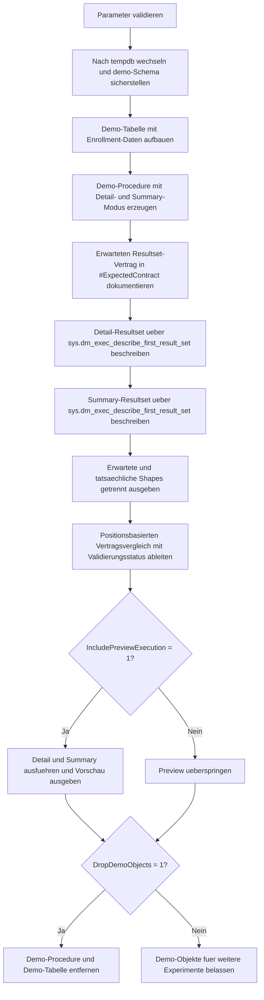

# ProcedureResultShapeContract.sql

Dieses Skript baut in `tempdb` eine Demo-Procedure mit den beiden expliziten Modi `Detail` und `Summary` auf. Anschliessend beschreibt es die tatsaechlichen Resultset-Spalten je Modus ueber Systemmetadaten und vergleicht sie positionsbasiert mit einem dokumentierten Vertrag.

## Uebersicht

<!-- SQLDOC:SUMMARY_TABLE:BEGIN -->
| Feld | Wert |
|---|---|
| Script | [ProcedureResultShapeContract.sql](ProcedureResultShapeContract.sql) |
| Version | `1.0` |
| Typ | `didactic-lab` |
| Kapitel | `23_StoredProcedures` |
| Sicherheit | `demo-write-tempdb` |
| Zweck | Validiert die erwartete Resultset-Form einer Demo-Procedure fuer Detail- und Summary-Ausfuehrungen. |
<!-- SQLDOC:SUMMARY_TABLE:END -->

## Einordnung

Stored Procedures wirken fuer viele Konsumenten wie eine API. Dieses Lab behandelt deshalb nicht nur die Daten selbst, sondern die Rueckgabeform als Vertrag: Welche Spalten kommen in welcher Reihenfolge, mit welchem Datentyp und mit welcher Nullability zurueck?

## Annahmen

- Die Umsetzung ist ein didaktisches Lab und legt alle Demo-Objekte ausschliesslich in `tempdb` an.
- Der Vertragsvergleich betrachtet bewusst nur das erste Resultset der Procedure, weil dieser Fall in Reporting-, ETL- und App-Schnittstellen am haeufigsten stabil gehalten werden muss.
- Die Vertragspruefung arbeitet positionsbasiert, damit auch veraenderte Spaltenreihenfolgen als moegliche Breaking Changes sichtbar werden.
- Die Modi `Detail` und `Summary` stehen fuer zwei bewusst unterschiedliche, aber jeweils klar dokumentierte Rueckgabeformen derselben Procedure.

## Anwendungsfall

Das Skript eignet sich fuer Schulungen zu Procedure-Vertraegen, fuer Reviews vor Schnittstellenfreigaben und fuer Teams, die Resultset-Formen nicht nur implizit, sondern explizit dokumentieren und testen wollen. Besonders nuetzlich ist es, wenn ein Team verhindern moechte, dass eine scheinbar kleine Procedure-Aenderung unbemerkt Clients mit starrem Spaltenmapping bricht.

## Parameter

<!-- SQLDOC:PARAMETERS_TABLE:BEGIN -->
| Parameter | SQL-Typ | Pflicht | Beschreibung |
|---|---|---|---|
| `@ProcedureBaseName` | `SYSNAME` | Nein | Basename fuer die Demo-Procedure im Schema `demo`. |
| `@IncludePreviewExecution` | `BIT` | Nein | Fuehrt bei `1` beide Modi aus und zeigt Beispielzeilen. |
| `@DropDemoObjects` | `BIT` | Nein | Entfernt Demo-Objekte am Ende wieder aus `tempdb`. |
<!-- SQLDOC:PARAMETERS_TABLE:END -->

## Abhaengigkeiten

<!-- SQLDOC:DEPENDENCIES_LIST:BEGIN -->
- `tempdb`
- `sys.schemas`
- `sys.dm_exec_describe_first_result_set`
- `CREATE OR ALTER PROCEDURE`
<!-- SQLDOC:DEPENDENCIES_LIST:END -->

## Hinweise

- `#ExpectedContract` dokumentiert die erwarteten Spalten je Modus inklusive Stabilitaetsregel.
- `sys.dm_exec_describe_first_result_set` liest die reale erste Rueckgabeform aus der Procedure, ohne dass dafuer ein externer Client geschrieben werden muss.
- Der Vergleich markiert fehlende, unerwartete oder typabweichende Spalten direkt als Validierungsstatus.
- Die optionale Vorschauausgabe verbindet den abstrakten Vertrag mit konkreten Demo-Zeilen aus `Detail` und `Summary`.

## Versionshistorie

<!-- SQLDOC:VERSION_HISTORY_TABLE:BEGIN -->
| Version | Datum | User | Beschreibung |
|---|---|---|---|
| `1.0` | `2026-04-22` | `ER` | Erstversion des tempdb-Labs fuer Procedure-Resultset-Vertraege |
<!-- SQLDOC:VERSION_HISTORY_TABLE:END -->

## Ablauf

<!-- SQLDOC:MERMAID:BEGIN -->

<!-- SQLDOC:MERMAID:END -->

## SQL-Code

<!-- SQLDOC:SQL_CODE:BEGIN -->
```sql
/*
BEGIN:SQL-HEADER v1
---
sql_header: v1
script_name: "ProcedureResultShapeContract.sql"
script_version: "1.0"
script_type: "didactic-lab"
chapter: "23_StoredProcedures"

purpose: >
  Baut in tempdb eine Demo-Procedure mit zwei expliziten Resultset-Formen auf
  und validiert die tatsaechlichen Spalten gegen einen erwarteten
  Resultset-Vertrag pro Ausfuehrungsmodus.

parameters:
  - name: "@ProcedureBaseName"
    sql_type: "SYSNAME"
    direction: "IN"
    required: false
    description: "Basename fuer die Demo-Procedure im Schema demo"
  - name: "@IncludePreviewExecution"
    sql_type: "BIT"
    direction: "IN"
    required: false
    description: "1 = fuehrt die Demo-Procedure fuer beide Modi aus und zeigt Beispielzeilen"
  - name: "@DropDemoObjects"
    sql_type: "BIT"
    direction: "IN"
    required: false
    description: "1 = entfernt Demo-Objekte am Ende wieder aus tempdb"

result_sets:
  - name: "ContractShapeCatalog"
    description: "Erwartete Resultset-Spalten pro Modus inklusive Stabilitaetsregeln"
  - name: "ActualResultShapes"
    description: "Tatsaechliche Metadaten des ersten Resultsets je Modus"
  - name: "ContractValidation"
    description: "Vergleich zwischen erwartetem Vertrag und tatsaechlicher Resultset-Form"
  - name: "ExecutionPreview"
    description: "Optionale Demo-Ausfuehrung fuer Detail- und Summary-Modus"

dependencies:
  - "tempdb"
  - "sys.schemas"
  - "sys.dm_exec_describe_first_result_set"
  - "CREATE OR ALTER PROCEDURE"

safety:
  level: "demo-write-tempdb"
  writes_data: true

documentation:
  markdown_file: "T-SQL/23_StoredProcedures/SQLScripts/ProcedureResultShapeContract.md"
  sync_blocks:
    - "SUMMARY_TABLE"
    - "PARAMETERS_TABLE"
    - "DEPENDENCIES_LIST"
    - "VERSION_HISTORY_TABLE"
    - "SQL_CODE"
  mermaid:
    mode: "ai-agent-from-sql"
    source: "script-body"

main_responsible:
  name: "Erhard Rainer"
  initials: "ER"

version_history:
  - version: "1.0"
    date: "2026-04-22"
    user: "ER"
    description: "Erstversion des tempdb-Labs fuer Procedure-Resultset-Vertraege"

notes:
  - "Alle Demo-Objekte werden ausschliesslich in tempdb angelegt"
  - "Die Validierung betrachtet bewusst nur das erste Resultset pro Ausfuehrungsmodus"
---
END:SQL-HEADER v1
*/

SET NOCOUNT ON;

DECLARE @ProcedureBaseName SYSNAME = N'usp_ResultShapeContractDemo';
DECLARE @IncludePreviewExecution BIT = 1;
DECLARE @DropDemoObjects BIT = 1;

DECLARE @ProcedureFullName NVARCHAR(300) = N'demo.' + @ProcedureBaseName;
DECLARE @QualifiedProcedureName NVARCHAR(320) = N'[demo].' + QUOTENAME(@ProcedureBaseName);

IF NULLIF(LTRIM(RTRIM(@ProcedureBaseName)), N'') IS NULL
BEGIN
    THROW 50000, '@ProcedureBaseName darf nicht leer sein.', 1;
END;

IF @IncludePreviewExecution NOT IN (0, 1)
BEGIN
    THROW 50001, '@IncludePreviewExecution muss 0 oder 1 sein.', 1;
END;

IF @DropDemoObjects NOT IN (0, 1)
BEGIN
    THROW 50002, '@DropDemoObjects muss 0 oder 1 sein.', 1;
END;

USE tempdb;

IF NOT EXISTS
(
    SELECT 1
    FROM sys.schemas
    WHERE name = N'demo'
)
BEGIN
    EXEC(N'CREATE SCHEMA demo AUTHORIZATION dbo;');
END;

EXEC(N'DROP PROCEDURE IF EXISTS ' + @QualifiedProcedureName + N';');
DROP TABLE IF EXISTS demo.ResultShapeContractEnrollments;

CREATE TABLE demo.ResultShapeContractEnrollments
(
    EnrollmentID    INT           NOT NULL PRIMARY KEY,
    CourseCode      NVARCHAR(20)  NOT NULL,
    StudentName     NVARCHAR(80)  NOT NULL,
    CompletionPct   DECIMAL(5,2)  NOT NULL,
    IsCertified     BIT           NOT NULL,
    SnapshotMonth   DATE          NOT NULL
);

INSERT INTO demo.ResultShapeContractEnrollments
(
    EnrollmentID,
    CourseCode,
    StudentName,
    CompletionPct,
    IsCertified,
    SnapshotMonth
)
VALUES
    (1001, N'DB100', N'Anna Keller',  92.50, 1, '2026-02-01'),
    (1002, N'DB100', N'Jonas Weiss',  76.00, 0, '2026-02-01'),
    (1003, N'DB100', N'Mira Lang',    88.00, 1, '2026-03-01'),
    (2001, N'ETL200', N'Noah Stern',  67.50, 0, '2026-02-01'),
    (2002, N'ETL200', N'Sarah Blum',  81.00, 1, '2026-03-01'),
    (3001, N'API310', N'Lea Winter',  95.00, 1, '2026-03-01');

EXEC
(
    N'CREATE OR ALTER PROCEDURE ' + @QualifiedProcedureName + N'
        @CourseCode NVARCHAR(20),
        @ResultShape NVARCHAR(20) = N''Detail''
AS
BEGIN
    SET NOCOUNT ON;

    IF NULLIF(LTRIM(RTRIM(@CourseCode)), N'''') IS NULL
    BEGIN
        THROW 51000, N''@CourseCode darf nicht leer sein.'', 1;
    END;

    IF @ResultShape NOT IN (N''Detail'', N''Summary'')
    BEGIN
        THROW 51001, N''@ResultShape muss Detail oder Summary sein.'', 1;
    END;

    IF @ResultShape = N''Detail''
    BEGIN
        SELECT
            e.EnrollmentID,
            e.CourseCode,
            e.StudentName,
            e.CompletionPct,
            e.IsCertified,
            e.SnapshotMonth
        FROM demo.ResultShapeContractEnrollments AS e
        WHERE e.CourseCode = @CourseCode
        ORDER BY
            e.SnapshotMonth,
            e.EnrollmentID;

        RETURN;
    END;

    SELECT
        e.CourseCode,
        ParticipantCount = COUNT_BIG(*),
        AverageCompletionPct = ISNULL(CAST(AVG(e.CompletionPct) AS DECIMAL(5,2)), CONVERT(DECIMAL(5,2), 0.00)),
        CertifiedCount = ISNULL(SUM(CASE WHEN e.IsCertified = 1 THEN 1 ELSE 0 END), 0),
        LatestSnapshotMonth = ISNULL(MAX(e.SnapshotMonth), CONVERT(DATE, '19000101'))
    FROM demo.ResultShapeContractEnrollments AS e
    WHERE e.CourseCode = @CourseCode
    GROUP BY
        e.CourseCode
    ORDER BY
        e.CourseCode;
END;'
);

DROP TABLE IF EXISTS #ExpectedContract;
DROP TABLE IF EXISTS #ActualResultShape;

CREATE TABLE #ExpectedContract
(
    ResultShape     NVARCHAR(20)   NOT NULL,
    ColumnOrdinal   INT            NOT NULL,
    ColumnName      SYSNAME        NOT NULL,
    ExpectedType    NVARCHAR(128)  NOT NULL,
    ExpectedNullable BIT           NOT NULL,
    StabilityRule   NVARCHAR(160)  NOT NULL
);

CREATE TABLE #ActualResultShape
(
    ResultShape       NVARCHAR(20)   NOT NULL,
    column_ordinal    INT            NULL,
    column_name       SYSNAME        NULL,
    system_type_name  NVARCHAR(256)  NULL,
    is_nullable       BIT            NULL,
    error_type_desc   NVARCHAR(60)   NULL
);

INSERT INTO #ExpectedContract
(
    ResultShape,
    ColumnOrdinal,
    ColumnName,
    ExpectedType,
    ExpectedNullable,
    StabilityRule
)
VALUES
    (N'Detail',  1, N'EnrollmentID',          N'int',            0, N'Primarschluessel je Teilnehmerzeile bleibt an Position 1.'),
    (N'Detail',  2, N'CourseCode',            N'nvarchar(20)',   0, N'Kurscode bleibt als Filterkontext sichtbar.'),
    (N'Detail',  3, N'StudentName',           N'nvarchar(80)',   0, N'Detailmodus liefert lesbare Teilnehmernamen.'),
    (N'Detail',  4, N'CompletionPct',         N'decimal(5,2)',   0, N'Fortschritt bleibt als Prozentwert verfuegbar.'),
    (N'Detail',  5, N'IsCertified',           N'bit',            0, N'Zertifizierungsstatus bleibt als boolesches Signal erhalten.'),
    (N'Detail',  6, N'SnapshotMonth',         N'date',           0, N'Detailmodus zeigt die zugehoerige Snapshot-Periode.'),
    (N'Summary', 1, N'CourseCode',            N'nvarchar(20)',   0, N'Summary beginnt weiterhin mit dem Kursbezug.'),
    (N'Summary', 2, N'ParticipantCount',      N'bigint',         0, N'Anzahl der Teilnehmer bleibt als Aggregat an Position 2.'),
    (N'Summary', 3, N'AverageCompletionPct',  N'decimal(5,2)',   0, N'Der Durchschnitt bleibt als dezimaler Kennwert dokumentiert.'),
    (N'Summary', 4, N'CertifiedCount',        N'int',            0, N'Zahl zertifizierter Teilnehmer bleibt separat auswertbar.'),
    (N'Summary', 5, N'LatestSnapshotMonth',   N'date',           0, N'Letzte beruecksichtigte Periode bleibt Teil des Vertrags.');

INSERT INTO #ActualResultShape
(
    ResultShape,
    column_ordinal,
    column_name,
    system_type_name,
    is_nullable,
    error_type_desc
)
SELECT
    ResultShape = N'Detail',
    metadata.column_ordinal,
    metadata.name,
    metadata.system_type_name,
    metadata.is_nullable,
    metadata.error_type_desc
FROM sys.dm_exec_describe_first_result_set
(
    N'EXEC demo.usp_ResultShapeContractDemo @CourseCode = N''DB100'', @ResultShape = N''Detail'';',
    NULL,
    0
) AS metadata
WHERE metadata.column_ordinal IS NOT NULL;

INSERT INTO #ActualResultShape
(
    ResultShape,
    column_ordinal,
    column_name,
    system_type_name,
    is_nullable,
    error_type_desc
)
SELECT
    ResultShape = N'Summary',
    metadata.column_ordinal,
    metadata.name,
    metadata.system_type_name,
    metadata.is_nullable,
    metadata.error_type_desc
FROM sys.dm_exec_describe_first_result_set
(
    N'EXEC demo.usp_ResultShapeContractDemo @CourseCode = N''DB100'', @ResultShape = N''Summary'';',
    NULL,
    0
) AS metadata
WHERE metadata.column_ordinal IS NOT NULL;

SELECT
    c.ResultShape,
    c.ColumnOrdinal,
    c.ColumnName,
    c.ExpectedType,
    c.ExpectedNullable,
    c.StabilityRule
FROM #ExpectedContract AS c
ORDER BY
    c.ResultShape,
    c.ColumnOrdinal;

SELECT
    a.ResultShape,
    a.column_ordinal,
    a.column_name,
    a.system_type_name,
    a.is_nullable,
    a.error_type_desc
FROM #ActualResultShape AS a
ORDER BY
    a.ResultShape,
    a.column_ordinal;

;WITH Compared AS
(
    SELECT
        ResultShape = COALESCE(c.ResultShape, a.ResultShape),
        ExpectedOrdinal = c.ColumnOrdinal,
        ActualOrdinal = a.column_ordinal,
        ExpectedColumnName = c.ColumnName,
        ActualColumnName = a.column_name,
        ExpectedType = c.ExpectedType,
        ActualType = a.system_type_name,
        ExpectedNullable = c.ExpectedNullable,
        ActualNullable = a.is_nullable,
        StabilityRule = c.StabilityRule,
        ValidationStatus =
            CASE
                WHEN c.ColumnName IS NULL THEN N'unexpected_column'
                WHEN a.column_name IS NULL THEN N'missing_column'
                WHEN c.ColumnName <> a.column_name THEN N'name_mismatch'
                WHEN c.ExpectedType <> a.system_type_name THEN N'type_mismatch'
                WHEN c.ExpectedNullable <> ISNULL(a.is_nullable, 0) THEN N'nullability_mismatch'
                ELSE N'match'
            END
    FROM #ExpectedContract AS c
    FULL OUTER JOIN #ActualResultShape AS a
        ON c.ResultShape = a.ResultShape
       AND c.ColumnOrdinal = a.column_ordinal
)
SELECT
    cmp.ResultShape,
    cmp.ValidationStatus,
    cmp.ExpectedOrdinal,
    cmp.ActualOrdinal,
    cmp.ExpectedColumnName,
    cmp.ActualColumnName,
    cmp.ExpectedType,
    cmp.ActualType,
    cmp.ExpectedNullable,
    cmp.ActualNullable,
    ValidationNote =
        CASE cmp.ValidationStatus
            WHEN N'match' THEN N'Erwartete Resultset-Form stimmt mit dem Vertrag ueberein.'
            WHEN N'unexpected_column' THEN N'Die Procedure liefert an dieser Position eine nicht dokumentierte Zusatzspalte.'
            WHEN N'missing_column' THEN N'Die dokumentierte Vertragsspalte fehlt im tatsaechlichen Resultset.'
            WHEN N'name_mismatch' THEN N'Der Spaltenname an dieser Position weicht vom dokumentierten Vertrag ab.'
            WHEN N'type_mismatch' THEN N'Der Datentyp an dieser Position entspricht nicht dem dokumentierten Vertrag.'
            WHEN N'nullability_mismatch' THEN N'Die Nullability entspricht nicht dem dokumentierten Vertrag.'
            ELSE N'Unbekannter Validierungsstatus.'
        END,
    cmp.StabilityRule
FROM Compared AS cmp
ORDER BY
    cmp.ResultShape,
    cmp.ExpectedOrdinal,
    cmp.ActualOrdinal;

IF @IncludePreviewExecution = 1
BEGIN
    DROP TABLE IF EXISTS #DetailPreview;
    DROP TABLE IF EXISTS #SummaryPreview;

    CREATE TABLE #DetailPreview
    (
        EnrollmentID   INT           NOT NULL,
        CourseCode     NVARCHAR(20)  NOT NULL,
        StudentName    NVARCHAR(80)  NOT NULL,
        CompletionPct  DECIMAL(5,2)  NOT NULL,
        IsCertified    BIT           NOT NULL,
        SnapshotMonth  DATE          NOT NULL
    );

    CREATE TABLE #SummaryPreview
    (
        CourseCode             NVARCHAR(20)  NOT NULL,
        ParticipantCount       BIGINT        NOT NULL,
        AverageCompletionPct   DECIMAL(5,2)  NULL,
        CertifiedCount         INT           NOT NULL,
        LatestSnapshotMonth    DATE          NOT NULL
    );

    INSERT INTO #DetailPreview
    (
        EnrollmentID,
        CourseCode,
        StudentName,
        CompletionPct,
        IsCertified,
        SnapshotMonth
    )
    EXEC demo.usp_ResultShapeContractDemo
        @CourseCode = N'DB100',
        @ResultShape = N'Detail';

    INSERT INTO #SummaryPreview
    (
        CourseCode,
        ParticipantCount,
        AverageCompletionPct,
        CertifiedCount,
        LatestSnapshotMonth
    )
    EXEC demo.usp_ResultShapeContractDemo
        @CourseCode = N'DB100',
        @ResultShape = N'Summary';

    SELECT
        ResultShape = N'Detail',
        d.EnrollmentID,
        d.CourseCode,
        d.StudentName,
        d.CompletionPct,
        d.IsCertified,
        d.SnapshotMonth,
        ParticipantCount = CAST(NULL AS BIGINT),
        AverageCompletionPct = CAST(NULL AS DECIMAL(5,2)),
        CertifiedCount = CAST(NULL AS INT),
        LatestSnapshotMonth = CAST(NULL AS DATE)
    FROM #DetailPreview AS d

    UNION ALL

    SELECT
        ResultShape = N'Summary',
        EnrollmentID = CAST(NULL AS INT),
        s.CourseCode,
        StudentName = CAST(NULL AS NVARCHAR(80)),
        CompletionPct = CAST(NULL AS DECIMAL(5,2)),
        IsCertified = CAST(NULL AS BIT),
        SnapshotMonth = CAST(NULL AS DATE),
        s.ParticipantCount,
        s.AverageCompletionPct,
        s.CertifiedCount,
        s.LatestSnapshotMonth
    FROM #SummaryPreview AS s
    ORDER BY
        ResultShape,
        CourseCode,
        EnrollmentID;
END;

IF @DropDemoObjects = 1
BEGIN
    EXEC(N'DROP PROCEDURE IF EXISTS ' + @QualifiedProcedureName + N';');
    DROP TABLE IF EXISTS demo.ResultShapeContractEnrollments;
END;
```
<!-- SQLDOC:SQL_CODE:END -->
