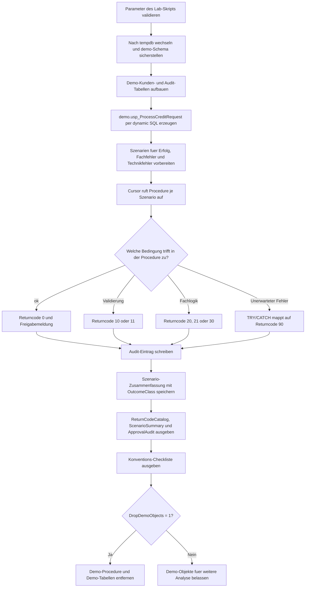

# ProcedureReturnCodeConvention.sql

Dieses Skript zeigt ein didaktisches Muster fuer konsistente Returncodes bei Stored Procedures. Es trennt bewusst zwischen Erfolg, validierten Eingabefehlern, fachlichen Rueckgaben und unerwarteten technischen Fehlern, damit aufrufende Prozesse stabil reagieren koennen.

## Uebersicht

<!-- SQLDOC:SUMMARY_TABLE:BEGIN -->
| Feld | Wert |
|---|---|
| Script | [ProcedureReturnCodeConvention.sql](ProcedureReturnCodeConvention.sql) |
| Version | `1.0` |
| Typ | `didactic-lab` |
| Kapitel | `23_StoredProcedures` |
| Sicherheit | `demo-write-tempdb` |
| Zweck | Demonstriert konsistente Returncodes, Output-Meldungen und Auditierung fuer Stored Procedures. |
<!-- SQLDOC:SUMMARY_TABLE:END -->

## Einordnung

Returncodes wirken oft klein, werden aber schnell chaotisch, wenn Erfolg, Validierung und Technikfehler nicht systematisch getrennt sind. Das Lab baut deshalb eine einzige Demo-Procedure auf, ruft sie in mehreren Szenarien auf und dokumentiert sowohl den maschinenlesbaren Code als auch die fachliche Meldung.

## Annahmen

- Die Umsetzung ist ein didaktisches Lab und arbeitet ausschliesslich mit Demo-Objekten in `tempdb`.
- Validierungs- und Fachfehler werden bewusst ueber `RETURN` kommuniziert, waehrend unerwartete Fehler intern gefangen und auf Code `90` gemappt werden.
- Das Beispiel nutzt ein Output-Parameter-Muster fuer die erklaerende Nachricht, damit der Returncode kompakt und maschinenlesbar bleibt.
- Die Audit-Tabelle dient nur der Demonstration und kann spaeter in produktionsnahe Logging-Strukturen ueberfuehrt werden.

## Anwendungsfall

Das Skript eignet sich fuer Schulungen, Architektur-Reviews und Teamkonventionen rund um Stored Procedures. Besonders hilfreich ist es, wenn unterschiedliche Aufrufer klar unterscheiden muessen, ob sie Eingaben korrigieren, einen Fachworkflow anstossen oder einen technischen Incident untersuchen sollen.

## Parameter

<!-- SQLDOC:PARAMETERS_TABLE:BEGIN -->
| Parameter | SQL-Typ | Pflicht | Beschreibung |
|---|---|---|---|
| `@RequestedCustomerID` | `INT` | Nein | Kundennummer fuer den primaeren Demo-Aufruf. |
| `@RequestedAmount` | `DECIMAL(12,2)` | Nein | Beantragter Betrag fuer die simulierte Freigabe. |
| `@ForceUnexpectedError` | `BIT` | Nein | Erzwingt bei `1` einen technischen Fehlerpfad innerhalb der Demo-Procedure. |
| `@DropDemoObjects` | `BIT` | Nein | Entfernt Demo-Objekte am Ende wieder aus `tempdb`. |
<!-- SQLDOC:PARAMETERS_TABLE:END -->

## Abhaengigkeiten

<!-- SQLDOC:DEPENDENCIES_LIST:BEGIN -->
- `tempdb`
- `sys.schemas`
- `sys.sp_executesql`
- `CREATE OR ALTER PROCEDURE`
- `TRY...CATCH`
<!-- SQLDOC:DEPENDENCIES_LIST:END -->

## Hinweise

- Code `0` steht exklusiv fuer Erfolg.
- Die Bereiche `10` bis `19` und `20` bis `39` gruppieren Validierung und Fachlogik getrennt.
- Unerwartete Technikfehler werden nicht an beliebigen SQL-Fehlernummern erkannt, sondern konsistent auf `90` abgebildet.
- Das Resultset `ReturnCodeCatalog` dokumentiert die Vereinbarung so, dass auch aufrufende Anwendungen oder ETL-Strecken sie leicht uebernehmen koennen.

## Versionshistorie

<!-- SQLDOC:VERSION_HISTORY_TABLE:BEGIN -->
| Version | Datum | User | Beschreibung |
|---|---|---|---|
| `1.0` | `2026-04-22` | `ER` | Erstversion des tempdb-Labs fuer konsistente Returncodes und Fehlerkonventionen |
<!-- SQLDOC:VERSION_HISTORY_TABLE:END -->

## Ablauf

<!-- SQLDOC:MERMAID:BEGIN -->

<!-- SQLDOC:MERMAID:END -->

## SQL-Code

<!-- SQLDOC:SQL_CODE:BEGIN -->
```sql
/*
BEGIN:SQL-HEADER v1
---
sql_header: v1
script_name: "ProcedureReturnCodeConvention.sql"
script_version: "1.0"
script_type: "didactic-lab"
chapter: "23_StoredProcedures"

purpose: >
  Baut in tempdb eine Demo-Procedure mit konsistenten Returncodes,
  Fehlerkonventionen und Audit-Ausgabe auf, damit Aufrufer den Unterschied
  zwischen Erfolg, validierten Fachfehlern und unerwarteten Fehlern sauber
  behandeln koennen.

parameters:
  - name: "@RequestedCustomerID"
    sql_type: "INT"
    direction: "IN"
    required: false
    description: "Kundennummer fuer den Demo-Aufruf"
  - name: "@RequestedAmount"
    sql_type: "DECIMAL(12,2)"
    direction: "IN"
    required: false
    description: "Beantragter Betrag fuer die simulierte Freigabe"
  - name: "@ForceUnexpectedError"
    sql_type: "BIT"
    direction: "IN"
    required: false
    description: "1 = erzwingt einen unerwarteten Fehlerpfad innerhalb der Demo-Procedure"
  - name: "@DropDemoObjects"
    sql_type: "BIT"
    direction: "IN"
    required: false
    description: "1 = entfernt Demo-Objekte am Ende wieder aus tempdb"

result_sets:
  - name: "ReturnCodeCatalog"
    description: "Definition der verwendeten Returncodes mit Behandlungsstrategie"
  - name: "ScenarioSummary"
    description: "Auswertung mehrerer Demo-Aufrufe mit Returncode, Meldung und Outcome"
  - name: "ApprovalAudit"
    description: "Audit-Tabelle der Procedure-Aufrufe mit technischer und fachlicher Einordnung"
  - name: "ConventionChecklist"
    description: "Didaktische Checkliste fuer robuste Returncode-Konventionen"

dependencies:
  - "tempdb"
  - "sys.schemas"
  - "sys.sp_executesql"
  - "CREATE OR ALTER PROCEDURE"
  - "TRY...CATCH"

safety:
  level: "demo-write-tempdb"
  writes_data: true

documentation:
  markdown_file: "T-SQL/23_StoredProcedures/SQLScripts/ProcedureReturnCodeConvention.md"
  sync_blocks:
    - "SUMMARY_TABLE"
    - "PARAMETERS_TABLE"
    - "DEPENDENCIES_LIST"
    - "VERSION_HISTORY_TABLE"
    - "SQL_CODE"
  mermaid:
    mode: "ai-agent-from-sql"
    source: "script-body"

main_responsible:
  name: "Erhard Rainer"
  initials: "ER"

version_history:
  - version: "1.0"
    date: "2026-04-22"
    user: "ER"
    description: "Erstversion des tempdb-Labs fuer konsistente Returncodes und Fehlerkonventionen"

notes:
  - "Alle Demo-Objekte werden ausschliesslich in tempdb angelegt"
  - "Validierungs- und Fachfaelle liefern bewusst Returncodes statt THROW, unerwartete Fehler werden intern protokolliert"
---
END:SQL-HEADER v1
*/

SET NOCOUNT ON;

DECLARE @RequestedCustomerID INT = 1002;
DECLARE @RequestedAmount DECIMAL(12,2) = 2800.00;
DECLARE @ForceUnexpectedError BIT = 0;
DECLARE @DropDemoObjects BIT = 1;

IF @RequestedCustomerID IS NULL OR @RequestedCustomerID < 1
BEGIN
    THROW 50000, '@RequestedCustomerID muss eine positive Zahl sein.', 1;
END;

IF @RequestedAmount IS NULL OR @RequestedAmount <= 0
BEGIN
    THROW 50001, '@RequestedAmount muss groesser als 0 sein.', 1;
END;

IF @ForceUnexpectedError NOT IN (0, 1)
BEGIN
    THROW 50002, '@ForceUnexpectedError muss 0 oder 1 sein.', 1;
END;

IF @DropDemoObjects NOT IN (0, 1)
BEGIN
    THROW 50003, '@DropDemoObjects muss 0 oder 1 sein.', 1;
END;

USE tempdb;

IF NOT EXISTS
(
    SELECT 1
    FROM sys.schemas
    WHERE name = N'demo'
)
BEGIN
    EXEC(N'CREATE SCHEMA demo AUTHORIZATION dbo;');
END;

DROP PROCEDURE IF EXISTS demo.usp_ProcessCreditRequest;
DROP TABLE IF EXISTS demo.ProcedureReturnCodeAudit;
DROP TABLE IF EXISTS demo.ProcedureReturnCodeCustomers;

CREATE TABLE demo.ProcedureReturnCodeCustomers
(
    CustomerID        INT            NOT NULL PRIMARY KEY,
    CustomerName      NVARCHAR(80)   NOT NULL,
    CustomerTier      NVARCHAR(20)   NOT NULL,
    CreditLimit       DECIMAL(12,2)  NOT NULL,
    CurrentExposure   DECIMAL(12,2)  NOT NULL,
    IsActive          BIT            NOT NULL
);

CREATE TABLE demo.ProcedureReturnCodeAudit
(
    AuditID            INT             NOT NULL IDENTITY(1,1) PRIMARY KEY,
    CalledAtUtc        DATETIME2(0)    NOT NULL
        CONSTRAINT DF_ProcedureReturnCodeAudit_CalledAtUtc DEFAULT SYSUTCDATETIME(),
    CustomerID         INT             NULL,
    RequestedAmount    DECIMAL(12,2)   NULL,
    ReturnCode         INT             NOT NULL,
    OutcomeLabel       NVARCHAR(40)    NOT NULL,
    ConventionCategory NVARCHAR(40)    NOT NULL,
    MessageText        NVARCHAR(4000)  NOT NULL
);

INSERT INTO demo.ProcedureReturnCodeCustomers
(
    CustomerID,
    CustomerName,
    CustomerTier,
    CreditLimit,
    CurrentExposure,
    IsActive
)
VALUES
    (1001, N'Alpha Retail GmbH',   N'Standard', 2500.00, 1200.00, 1),
    (1002, N'Beta Industrie AG',   N'Gold',     5000.00, 1700.00, 1),
    (1003, N'Gamma Logistics KG',  N'Standard', 1800.00,  900.00, 0),
    (1004, N'Delta Services GmbH', N'Platin',   8000.00, 4200.00, 1);

EXEC sys.sp_executesql
N'
CREATE OR ALTER PROCEDURE demo.usp_ProcessCreditRequest
    @CustomerID INT,
    @RequestedAmount DECIMAL(12,2),
    @ForceUnexpectedError BIT = 0,
    @DecisionMessage NVARCHAR(4000) OUTPUT
AS
BEGIN
    SET NOCOUNT ON;

    DECLARE @ReturnCode INT = 0;
    DECLARE @CreditLimit DECIMAL(12,2);
    DECLARE @CurrentExposure DECIMAL(12,2);
    DECLARE @IsActive BIT;
    DECLARE @ConventionCategory NVARCHAR(40) = N''success'';
    DECLARE @OutcomeLabel NVARCHAR(40) = N''approved'';

    BEGIN TRY
        IF @CustomerID IS NULL OR @CustomerID < 1
        BEGIN
            SET @ReturnCode = 10;
            SET @ConventionCategory = N''validation'';
            SET @OutcomeLabel = N''invalid_input'';
            SET @DecisionMessage = N''CustomerID muss positiv und gesetzt sein.'';
        END
        ELSE IF @RequestedAmount IS NULL OR @RequestedAmount <= 0
        BEGIN
            SET @ReturnCode = 11;
            SET @ConventionCategory = N''validation'';
            SET @OutcomeLabel = N''invalid_input'';
            SET @DecisionMessage = N''RequestedAmount muss groesser als 0 sein.'';
        END
        ELSE
        BEGIN
            SELECT
                @CreditLimit = customer_data.CreditLimit,
                @CurrentExposure = customer_data.CurrentExposure,
                @IsActive = customer_data.IsActive
            FROM demo.ProcedureReturnCodeCustomers AS customer_data
            WHERE customer_data.CustomerID = @CustomerID;

            IF @CreditLimit IS NULL
            BEGIN
                SET @ReturnCode = 20;
                SET @ConventionCategory = N''business'';
                SET @OutcomeLabel = N''customer_missing'';
                SET @DecisionMessage = N''Der Kunde ist im Demo-Bestand nicht vorhanden.'';
            END
            ELSE IF @IsActive = 0
            BEGIN
                SET @ReturnCode = 21;
                SET @ConventionCategory = N''business'';
                SET @OutcomeLabel = N''customer_inactive'';
                SET @DecisionMessage = N''Der Kunde ist inaktiv und kann nicht freigegeben werden.'';
            END
            ELSE IF @ForceUnexpectedError = 1
            BEGIN
                DECLARE @UnexpectedDivisor INT = 0;
                DECLARE @Explode INT = 1 / @UnexpectedDivisor;
                SET @DecisionMessage = CONCAT(N''Unerwarteter Wert: '', @Explode);
            END
            ELSE IF (@CurrentExposure + @RequestedAmount) > @CreditLimit
            BEGIN
                SET @ReturnCode = 30;
                SET @ConventionCategory = N''business'';
                SET @OutcomeLabel = N''approval_required'';
                SET @DecisionMessage =
                    N''Der beantragte Betrag ueberschreitet das verfuegbare Kreditlimit und muss eskaliert werden.'';
            END
            ELSE
            BEGIN
                SET @DecisionMessage =
                    N''Der Antrag liegt innerhalb des Kreditlimits und kann ohne Eskalation freigegeben werden.'';
            END
        END
    END TRY
    BEGIN CATCH
        SET @ReturnCode = 90;
        SET @ConventionCategory = N''unexpected_error'';
        SET @OutcomeLabel = N''error'';
        SET @DecisionMessage =
            CONCAT
            (
                N''Unerwarteter Fehler in demo.usp_ProcessCreditRequest: '',
                ERROR_MESSAGE(),
                N'' (Error '',
                ERROR_NUMBER(),
                N'').''
            );
    END CATCH;

    INSERT INTO demo.ProcedureReturnCodeAudit
    (
        CustomerID,
        RequestedAmount,
        ReturnCode,
        OutcomeLabel,
        ConventionCategory,
        MessageText
    )
    VALUES
    (
        @CustomerID,
        @RequestedAmount,
        @ReturnCode,
        @OutcomeLabel,
        @ConventionCategory,
        @DecisionMessage
    );

    RETURN @ReturnCode;
END;
';

DROP TABLE IF EXISTS #ScenarioInput;
DROP TABLE IF EXISTS #ScenarioSummary;

CREATE TABLE #ScenarioInput
(
    ScenarioLabel         NVARCHAR(40)   NOT NULL PRIMARY KEY,
    CustomerID            INT            NULL,
    RequestedAmount       DECIMAL(12,2)  NULL,
    ForceUnexpectedError  BIT            NOT NULL
);

CREATE TABLE #ScenarioSummary
(
    ScenarioOrder         INT             NOT NULL IDENTITY(1,1),
    ScenarioLabel         NVARCHAR(40)    NOT NULL,
    CustomerID            INT             NULL,
    RequestedAmount       DECIMAL(12,2)   NULL,
    ReturnCode            INT             NOT NULL,
    OutcomeClass          NVARCHAR(40)    NOT NULL,
    DecisionMessage       NVARCHAR(4000)  NOT NULL
);

INSERT INTO #ScenarioInput
(
    ScenarioLabel,
    CustomerID,
    RequestedAmount,
    ForceUnexpectedError
)
VALUES
    (N'success',             @RequestedCustomerID, @RequestedAmount, 0),
    (N'credit_limit_hit',    1001,                1800.00,          0),
    (N'inactive_customer',   1003,                 200.00,          0),
    (N'unknown_customer',    9999,                 100.00,          0),
    (N'unexpected_error',    1002,                 150.00,          1);

DECLARE
    @ScenarioLabel NVARCHAR(40),
    @CustomerID INT,
    @ScenarioAmount DECIMAL(12,2),
    @ScenarioForceUnexpectedError BIT,
    @DecisionMessage NVARCHAR(4000),
    @ReturnCode INT;

DECLARE scenario_cursor CURSOR LOCAL FAST_FORWARD FOR
SELECT
    scenario_data.ScenarioLabel,
    scenario_data.CustomerID,
    scenario_data.RequestedAmount,
    scenario_data.ForceUnexpectedError
FROM #ScenarioInput AS scenario_data
ORDER BY
    scenario_data.ScenarioLabel;

OPEN scenario_cursor;

FETCH NEXT FROM scenario_cursor
INTO
    @ScenarioLabel,
    @CustomerID,
    @ScenarioAmount,
    @ScenarioForceUnexpectedError;

WHILE @@FETCH_STATUS = 0
BEGIN
    SET @DecisionMessage = N'';

    EXEC @ReturnCode = demo.usp_ProcessCreditRequest
        @CustomerID = @CustomerID,
        @RequestedAmount = @ScenarioAmount,
        @ForceUnexpectedError = @ScenarioForceUnexpectedError,
        @DecisionMessage = @DecisionMessage OUTPUT;

    INSERT INTO #ScenarioSummary
    (
        ScenarioLabel,
        CustomerID,
        RequestedAmount,
        ReturnCode,
        OutcomeClass,
        DecisionMessage
    )
    VALUES
    (
        @ScenarioLabel,
        @CustomerID,
        @ScenarioAmount,
        @ReturnCode,
        CASE
            WHEN @ReturnCode = 0 THEN N'success'
            WHEN @ReturnCode BETWEEN 10 AND 19 THEN N'validation'
            WHEN @ReturnCode BETWEEN 20 AND 39 THEN N'business'
            ELSE N'unexpected_error'
        END,
        @DecisionMessage
    );

    FETCH NEXT FROM scenario_cursor
    INTO
        @ScenarioLabel,
        @CustomerID,
        @ScenarioAmount,
        @ScenarioForceUnexpectedError;
END;

CLOSE scenario_cursor;
DEALLOCATE scenario_cursor;

SELECT
    ReturnCode,
    ConventionCategory,
    Meaning,
    CallerAction
FROM
(
    VALUES
        (0,  N'success',          N'Antrag freigegeben',                                   N'Normale Weiterverarbeitung'),
        (10, N'validation',       N'CustomerID fehlt oder ist ungueltig',                  N'Aufrufer korrigiert Eingabe'),
        (11, N'validation',       N'RequestedAmount fehlt oder ist ungueltig',             N'Aufrufer korrigiert Eingabe'),
        (20, N'business',         N'Kunde nicht gefunden',                                 N'Fachliche Rueckfrage oder Stammdaten pruefen'),
        (21, N'business',         N'Kunde ist inaktiv',                                    N'Kundenstatus pruefen oder Auftrag stoppen'),
        (30, N'business',         N'Kreditlimit reicht nicht aus, Freigabe erforderlich',  N'Manuelle Eskalation oder Genehmigungsworkflow'),
        (90, N'unexpected_error', N'Unerwarteter technischer Fehler im TRY/CATCH',         N'Logging pruefen und technische Stoerung analysieren')
) AS return_code_catalog(ReturnCode, ConventionCategory, Meaning, CallerAction)
ORDER BY
    ReturnCode;

SELECT
    summary_data.ScenarioOrder,
    summary_data.ScenarioLabel,
    summary_data.CustomerID,
    summary_data.RequestedAmount,
    summary_data.ReturnCode,
    summary_data.OutcomeClass,
    summary_data.DecisionMessage
FROM #ScenarioSummary AS summary_data
ORDER BY
    summary_data.ScenarioOrder;

SELECT
    audit_entry.AuditID,
    audit_entry.CalledAtUtc,
    audit_entry.CustomerID,
    audit_entry.RequestedAmount,
    audit_entry.ReturnCode,
    audit_entry.OutcomeLabel,
    audit_entry.ConventionCategory,
    audit_entry.MessageText
FROM demo.ProcedureReturnCodeAudit AS audit_entry
ORDER BY
    audit_entry.AuditID;

SELECT
    ChecklistOrder,
    ChecklistItem,
    WhyItMatters
FROM
(
    VALUES
        (1, N'0 fuer Erfolg reservieren', N'Positive und negative Sonderfaelle bleiben klar von erfolgreicher Verarbeitung getrennt.'),
        (2, N'Validierungs- und Fachfehler gruppieren', N'Aufrufer koennen anhand stabiler Returncode-Bereiche schneller reagieren.'),
        (3, N'Nachrichten ueber Output-Parameter liefern', N'Der Returncode bleibt maschinenlesbar, die fachliche Erklaerung bleibt separat.'),
        (4, N'Unerwartete Fehler in TRY/CATCH auf einen eigenen Code mappen', N'Aufrufer erkennen technische Stoerungen sofort und muessen keine Fehltexte parsen.'),
        (5, N'Jeden Aufruf auditieren', N'Konventionen werden erst belastbar, wenn Returncode und Message im Nachgang nachvollziehbar sind.')
 ) AS checklist(ChecklistOrder, ChecklistItem, WhyItMatters)
ORDER BY
    ChecklistOrder;

IF @DropDemoObjects = 1
BEGIN
    DROP PROCEDURE IF EXISTS demo.usp_ProcessCreditRequest;
    DROP TABLE IF EXISTS demo.ProcedureReturnCodeAudit;
    DROP TABLE IF EXISTS demo.ProcedureReturnCodeCustomers;
END;
```
<!-- SQLDOC:SQL_CODE:END -->
