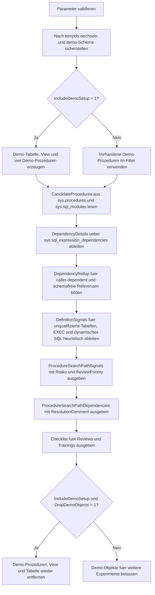

# ProcedureSearchPathAudit.sql

Dieses Skript baut in `tempdb` mehrere Demo-Prozeduren mit unterschiedlich qualifizierten Objektverweisen auf und erstellt daraus ein Audit fuer Namensaufloesung, caller-dependent Aufrufe und Suchpfad-Risiken. Der Fokus liegt auf einem didaktischen Review-Muster, das statische Dependencies mit heuristischen Signalen aus dem Modultext kombiniert.

## Uebersicht

<!-- SQLDOC:SUMMARY_TABLE:BEGIN -->
| Feld | Wert |
|---|---|
| Script | [ProcedureSearchPathAudit.sql](ProcedureSearchPathAudit.sql) |
| Version | `1.0` |
| Typ | `didactic-lab` |
| Kapitel | `23_StoredProcedures` |
| Sicherheit | `demo-write-tempdb` |
| Zweck | Auditiert Suchpfade, caller-dependent Referenzen und Namensaufloesung in Demo-Prozeduren. |
<!-- SQLDOC:SUMMARY_TABLE:END -->

## Einordnung

In Stored Procedures wirken unqualifizierte Objektaufrufe oft harmlos, erschweren aber Reviews und koennen die Herkunft einer Referenz verschleiern. Dieses Lab zeigt deshalb nicht nur die sichtbaren Dependencies aus dem Katalog, sondern legt daneben bewusst heuristische Hinweise aus dem Modultext, damit Suchpfad-Risiken frueh und nachvollziehbar diskutiert werden koennen.

## Annahmen

- Die Umsetzung ist bewusst ein didaktisches `tempdb`-Lab und greift nicht auf produktive Prozeduren zu.
- Die Bewertung bleibt absichtlich heuristisch: `sys.sql_expression_dependencies` und `sys.sql_modules` liefern Review-Signale, aber keinen vollstaendigen Laufzeitbeweis.
- Unqualifizierte Referenzen werden als Audit-Hinweis behandelt, nicht automatisch als fachlicher Fehler.
- Dynamisches SQL kann einen Teil der Namensaufloesung aus dem statischen Dependency-Katalog herausziehen und wird deshalb separat markiert.

## Anwendungsfall

Das Skript eignet sich fuer Schulungen zu Stored-Procedure-Konventionen, fuer Team-Reviews zu Schema-Qualifikation und fuer erste Governance-Checks in Datenbankprojekten. Besonders hilfreich ist es, wenn Procedures als stabile API-Schicht betrachtet werden und Namensaufloesung bewusst dokumentiert werden soll.

## Parameter

<!-- SQLDOC:PARAMETERS_TABLE:BEGIN -->
| Parameter | SQL-Typ | Pflicht | Beschreibung |
|---|---|---|---|
| `@ProcedureNamePattern` | `NVARCHAR(128)` | Nein | LIKE-Filter fuer die zu auditierenden Demo-Prozeduren. |
| `@IncludeDemoSetup` | `BIT` | Nein | Baut Demo-Objekte in `tempdb` auf oder aktualisiert sie, wenn `1`. |
| `@DropDemoObjects` | `BIT` | Nein | Entfernt die Demo-Objekte nach dem Audit wieder, wenn `1`. |
<!-- SQLDOC:PARAMETERS_TABLE:END -->

## Abhaengigkeiten

<!-- SQLDOC:DEPENDENCIES_LIST:BEGIN -->
- `tempdb`
- `sys.schemas`
- `sys.tables`
- `sys.views`
- `sys.procedures`
- `sys.sql_modules`
- `sys.sql_expression_dependencies`
- `sys.sp_executesql`
- `CREATE OR ALTER PROCEDURE`
- `CREATE OR ALTER VIEW`
<!-- SQLDOC:DEPENDENCIES_LIST:END -->

## Hinweise

- `ProcedureSearchPathSignals` kombiniert statische Dependency-Daten mit Text-Heuristiken fuer unqualifizierte Tabellen- und EXEC-Muster.
- `ProcedureSearchPathDependencies` zeigt, welche Referenzen im Katalog sichtbar sind und wo `is_caller_dependent` oder fehlende Schemata als Review-Signal auftauchen.
- `ProcedureSearchPathDynamicDispatch` illustriert bewusst, dass dynamisches SQL nur teilweise statisch greifbar ist.
- Die Demo-Prozeduren kontrastieren qualifizierte Referenzen mit absichtlich locker geschriebenen Varianten, damit das Audit einen klaren didaktischen Vergleich liefern kann.

## Versionshistorie

<!-- SQLDOC:VERSION_HISTORY_TABLE:BEGIN -->
| Version | Datum | User | Beschreibung |
|---|---|---|---|
| `1.0` | `2026-04-22` | `ER` | Erstversion des didaktischen Audits fuer Suchpfade und Namensaufloesung in Stored Procedures |
<!-- SQLDOC:VERSION_HISTORY_TABLE:END -->

## Ablauf

<!-- SQLDOC:MERMAID:BEGIN -->

<!-- SQLDOC:MERMAID:END -->

## SQL-Code

<!-- SQLDOC:SQL_CODE:BEGIN -->
```sql
/*
BEGIN:SQL-HEADER v1
---
sql_header: v1
script_name: "ProcedureSearchPathAudit.sql"
script_version: "1.0"
script_type: "didactic-lab"
chapter: "23_StoredProcedures"

purpose: >
  Baut in tempdb mehrere Demo-Prozeduren mit unterschiedlich stark
  qualifizierten Objektverweisen auf und erstellt ein Audit ueber
  Namensaufloesung, caller-dependent EXEC-Muster und heuristische
  Suchpfad-Risiken in Stored Procedures.

parameters:
  - name: "@ProcedureNamePattern"
    sql_type: "NVARCHAR(128)"
    direction: "IN"
    required: false
    description: "LIKE-Filter fuer die zu auditierenden Demo-Prozeduren"
  - name: "@IncludeDemoSetup"
    sql_type: "BIT"
    direction: "IN"
    required: false
    description: "1 = Demo-Objekte in tempdb erzeugen oder aktualisieren"
  - name: "@DropDemoObjects"
    sql_type: "BIT"
    direction: "IN"
    required: false
    description: "1 = Demo-Objekte nach dem Audit wieder entfernen"

result_sets:
  - name: "ProcedureSearchPathSignals"
    description: "Verdichtete Audit-Signale je Procedure zu Qualifikation, caller-dependent Verhalten und Review-Prioritaet"
  - name: "ProcedureSearchPathDependencies"
    description: "Detailansicht der ueber sys.sql_expression_dependencies sichtbaren Referenzen"
  - name: "ProcedureSearchPathChecklist"
    description: "Didaktische Hinweise fuer Reviews rund um Suchpfade und Namensaufloesung"

dependencies:
  - "tempdb"
  - "sys.schemas"
  - "sys.tables"
  - "sys.views"
  - "sys.procedures"
  - "sys.sql_modules"
  - "sys.sql_expression_dependencies"
  - "sys.sp_executesql"
  - "CREATE OR ALTER PROCEDURE"
  - "CREATE OR ALTER VIEW"

safety:
  level: "demo-write-tempdb"
  writes_data: true

documentation:
  markdown_file: "T-SQL/23_StoredProcedures/SQLScripts/ProcedureSearchPathAudit.md"
  sync_blocks:
    - "SUMMARY_TABLE"
    - "PARAMETERS_TABLE"
    - "DEPENDENCIES_LIST"
    - "VERSION_HISTORY_TABLE"
    - "SQL_CODE"
  mermaid:
    mode: "ai-agent-from-sql"
    source: "script-body"

main_responsible:
  name: "Erhard Rainer"
  initials: "ER"

version_history:
  - version: "1.0"
    date: "2026-04-22"
    user: "ER"
    description: "Erstversion des didaktischen Audits fuer Suchpfade und Namensaufloesung in Stored Procedures"

notes:
  - "Die Bewertung kombiniert sys.sql_expression_dependencies mit heuristischen Textmustern aus sys.sql_modules"
  - "Alle Demo-Objekte werden ausschliesslich in tempdb angelegt"
---
END:SQL-HEADER v1
*/

SET NOCOUNT ON;

DECLARE @ProcedureNamePattern NVARCHAR(128) = N'usp_SearchPath%';
DECLARE @IncludeDemoSetup BIT = 1;
DECLARE @DropDemoObjects BIT = 1;

IF NULLIF(LTRIM(RTRIM(@ProcedureNamePattern)), N'') IS NULL
BEGIN
    THROW 50000, '@ProcedureNamePattern darf nicht leer sein.', 1;
END;

IF @IncludeDemoSetup NOT IN (0, 1)
BEGIN
    THROW 50001, '@IncludeDemoSetup muss 0 oder 1 sein.', 1;
END;

IF @DropDemoObjects NOT IN (0, 1)
BEGIN
    THROW 50002, '@DropDemoObjects muss 0 oder 1 sein.', 1;
END;

USE tempdb;

IF NOT EXISTS
(
    SELECT 1
    FROM sys.schemas
    WHERE name = N'demo'
)
BEGIN
    EXEC(N'CREATE SCHEMA demo AUTHORIZATION dbo;');
END;

IF @IncludeDemoSetup = 1
BEGIN
    DROP PROCEDURE IF EXISTS demo.usp_SearchPathQualifiedRoster;
    DROP PROCEDURE IF EXISTS demo.usp_SearchPathLooseTable;
    DROP PROCEDURE IF EXISTS demo.usp_SearchPathLooseExec;
    DROP PROCEDURE IF EXISTS demo.usp_SearchPathDynamicDispatch;
    DROP VIEW IF EXISTS demo.v_SearchPathDeliverySummary;
    DROP TABLE IF EXISTS demo.SearchPathCourseCatalog;

    CREATE TABLE demo.SearchPathCourseCatalog
    (
        CourseCode      NVARCHAR(20)  NOT NULL PRIMARY KEY,
        CourseName      NVARCHAR(100) NOT NULL,
        DeliveryMode    NVARCHAR(20)  NOT NULL,
        ParticipantCount INT          NOT NULL,
        OwnerTeam       NVARCHAR(40)  NOT NULL
    );

    INSERT INTO demo.SearchPathCourseCatalog
    (
        CourseCode,
        CourseName,
        DeliveryMode,
        ParticipantCount,
        OwnerTeam
    )
    VALUES
        (N'DB110', N'Database Foundations', N'on_site', 24, N'Academy'),
        (N'API220', N'Procedure APIs', N'hybrid', 18, N'Backend'),
        (N'OPS310', N'Operations Troubleshooting', N'remote', 12, N'Platform');

    EXEC sys.sp_executesql
    N'
    CREATE OR ALTER VIEW demo.v_SearchPathDeliverySummary
    AS
        SELECT
            c.DeliveryMode,
            CourseCount = COUNT(*),
            TotalParticipants = SUM(c.ParticipantCount)
        FROM demo.SearchPathCourseCatalog AS c
        GROUP BY
            c.DeliveryMode;
    ';

    EXEC sys.sp_executesql
    N'
    CREATE OR ALTER PROCEDURE demo.usp_SearchPathQualifiedRoster
        @MinimumParticipants INT = 0
    AS
    BEGIN
        SET NOCOUNT ON;

        SELECT
            c.CourseCode,
            c.CourseName,
            c.DeliveryMode,
            c.ParticipantCount,
            c.OwnerTeam
        FROM demo.SearchPathCourseCatalog AS c
        WHERE c.ParticipantCount >= @MinimumParticipants
        ORDER BY
            c.ParticipantCount DESC,
            c.CourseCode;
    END;
    ';

    EXEC sys.sp_executesql
    N'
    CREATE OR ALTER PROCEDURE demo.usp_SearchPathLooseTable
        @OwnerTeam NVARCHAR(40) = NULL
    AS
    BEGIN
        SET NOCOUNT ON;

        SELECT
            c.CourseCode,
            c.CourseName,
            c.OwnerTeam
        FROM SearchPathCourseCatalog AS c
        WHERE @OwnerTeam IS NULL
           OR c.OwnerTeam = @OwnerTeam
        ORDER BY
            c.CourseCode;
    END;
    ';

    EXEC sys.sp_executesql
    N'
    CREATE OR ALTER PROCEDURE demo.usp_SearchPathLooseExec
    AS
    BEGIN
        SET NOCOUNT ON;

        EXEC usp_SearchPathQualifiedRoster
            @MinimumParticipants = 10;
    END;
    ';

    EXEC sys.sp_executesql
    N'
    CREATE OR ALTER PROCEDURE demo.usp_SearchPathDynamicDispatch
        @DeliveryMode NVARCHAR(20) = NULL
    AS
    BEGIN
        SET NOCOUNT ON;

        DECLARE @Sql NVARCHAR(MAX) =
            N''SELECT
                  c.CourseCode,
                  c.CourseName,
                  c.DeliveryMode
              FROM SearchPathCourseCatalog AS c
              WHERE @DeliveryMode IS NULL
                 OR c.DeliveryMode = @DeliveryMode
              ORDER BY
                  c.CourseCode;'';

        EXEC sys.sp_executesql
            @stmt = @Sql,
            @params = N''@DeliveryMode NVARCHAR(20)'',
            @DeliveryMode = @DeliveryMode;
    END;
    ';
END;

;WITH CandidateProcedures AS
(
    SELECT
        ProcedureName = QUOTENAME(s.name) + N'.' + QUOTENAME(p.name),
        ProcedureSchema = s.name,
        ProcedureBaseName = p.name,
        p.object_id,
        ModuleDefinition = sm.definition,
        ModuleDefinitionLower = LOWER(sm.definition)
    FROM sys.procedures AS p
    INNER JOIN sys.schemas AS s
        ON s.schema_id = p.schema_id
    INNER JOIN sys.sql_modules AS sm
        ON sm.object_id = p.object_id
    WHERE s.name = N'demo'
      AND p.name LIKE @ProcedureNamePattern
),
DependencyDetails AS
(
    SELECT
        cp.ProcedureName,
        ReferencedEntity =
            COALESCE(
                QUOTENAME(OBJECT_SCHEMA_NAME(sed.referenced_id)) + N'.' + QUOTENAME(OBJECT_NAME(sed.referenced_id)),
                COALESCE(QUOTENAME(sed.referenced_schema_name) + N'.', N'') + QUOTENAME(sed.referenced_entity_name)
            ),
        ReferencedType = COALESCE(o.type_desc, N'EXTERNAL_OR_UNRESOLVED'),
        sed.referenced_schema_name,
        sed.referenced_entity_name,
        sed.is_caller_dependent
    FROM CandidateProcedures AS cp
    LEFT JOIN sys.sql_expression_dependencies AS sed
        ON sed.referencing_id = cp.object_id
    LEFT JOIN sys.objects AS o
        ON o.object_id = sed.referenced_id
),
DependencyRollup AS
(
    SELECT
        dd.ProcedureName,
        DependencyCount = SUM(CASE WHEN dd.referenced_entity_name IS NOT NULL THEN 1 ELSE 0 END),
        CallerDependentReferences = SUM(CASE WHEN dd.is_caller_dependent = 1 THEN 1 ELSE 0 END),
        DependenciesWithoutSchema = SUM(CASE WHEN dd.referenced_entity_name IS NOT NULL AND dd.referenced_schema_name IS NULL THEN 1 ELSE 0 END)
    FROM DependencyDetails AS dd
    GROUP BY
        dd.ProcedureName
),
DefinitionSignals AS
(
    SELECT
        cp.ProcedureName,
        ContainsUnqualifiedTableReference = CASE
            WHEN cp.ModuleDefinitionLower LIKE N'% from searchpathcoursecatalog %' THEN 1
            WHEN cp.ModuleDefinitionLower LIKE N'% join searchpathcoursecatalog %' THEN 1
            ELSE 0
        END,
        ContainsUnqualifiedExec = CASE
            WHEN cp.ModuleDefinitionLower LIKE N'%exec usp_searchpathqualifiedroster%' THEN 1
            WHEN cp.ModuleDefinitionLower LIKE N'%execute usp_searchpathqualifiedroster%' THEN 1
            ELSE 0
        END,
        UsesDynamicSql = CASE
            WHEN cp.ModuleDefinitionLower LIKE N'%sp_executesql%' THEN 1
            WHEN cp.ModuleDefinitionLower LIKE N'%exec(@sql%' THEN 1
            WHEN cp.ModuleDefinitionLower LIKE N'%exec (@sql%' THEN 1
            ELSE 0
        END,
        QualifiedDemoReferenceCount =
            (LEN(cp.ModuleDefinitionLower) - LEN(REPLACE(cp.ModuleDefinitionLower, N'demo.', N''))) / LEN(N'demo.')
    FROM CandidateProcedures AS cp
)
SELECT
    cp.ProcedureName,
    dr.DependencyCount,
    dr.CallerDependentReferences,
    dr.DependenciesWithoutSchema,
    ds.ContainsUnqualifiedTableReference,
    ds.ContainsUnqualifiedExec,
    ds.UsesDynamicSql,
    ds.QualifiedDemoReferenceCount,
    SearchPathRisk =
        CASE
            WHEN dr.CallerDependentReferences > 0 THEN N'caller_dependent'
            WHEN ds.ContainsUnqualifiedExec = 1 OR ds.ContainsUnqualifiedTableReference = 1 THEN N'heuristic_review'
            WHEN ds.UsesDynamicSql = 1 THEN N'dynamic_sql_review'
            ELSE N'qualified_or_bound'
        END,
    ReviewPriority =
        CASE
            WHEN dr.CallerDependentReferences > 0 THEN N'high'
            WHEN ds.ContainsUnqualifiedExec = 1 OR ds.ContainsUnqualifiedTableReference = 1 THEN N'medium'
            WHEN ds.UsesDynamicSql = 1 THEN N'medium'
            ELSE N'low'
        END,
    ReviewNote =
        CASE
            WHEN dr.CallerDependentReferences > 0 THEN N'Sys dependencies melden caller-dependent Referenzen; Schema-Qualifikation fuer EXEC und Objektaufrufe pruefen.'
            WHEN ds.ContainsUnqualifiedExec = 1 THEN N'Die Moduldefinition enthaelt einen unqualifizierten EXEC-Aufruf und sollte bewusst geprueft werden.'
            WHEN ds.ContainsUnqualifiedTableReference = 1 THEN N'Die Moduldefinition enthaelt mindestens einen unqualifizierten Tabellenzugriff.'
            WHEN ds.UsesDynamicSql = 1 THEN N'Dynamisches SQL kann Abhaengigkeiten teilweise aus dem statischen Dependency-Graphen herausziehen.'
            ELSE N'Die Demo-Procedure nutzt sichtbare, qualifizierte Referenzen ohne akutes Suchpfad-Signal.'
        END
FROM CandidateProcedures AS cp
LEFT JOIN DependencyRollup AS dr
    ON dr.ProcedureName = cp.ProcedureName
LEFT JOIN DefinitionSignals AS ds
    ON ds.ProcedureName = cp.ProcedureName
ORDER BY
    CASE
        WHEN dr.CallerDependentReferences > 0 THEN 1
        WHEN ds.ContainsUnqualifiedExec = 1 OR ds.ContainsUnqualifiedTableReference = 1 THEN 2
        WHEN ds.UsesDynamicSql = 1 THEN 3
        ELSE 4
    END,
    cp.ProcedureName;

SELECT
    dd.ProcedureName,
    dd.ReferencedEntity,
    dd.ReferencedType,
    ReferencedSchemaName = dd.referenced_schema_name,
    ReferencedEntityName = dd.referenced_entity_name,
    IsCallerDependent = dd.is_caller_dependent,
    ResolutionComment =
        CASE
            WHEN dd.referenced_entity_name IS NULL THEN N'Keine statische Referenz im Dependency-Katalog sichtbar.'
            WHEN dd.is_caller_dependent = 1 THEN N'Die Aufloesung kann zur Laufzeit vom Caller-Kontext abhaengen.'
            WHEN dd.referenced_schema_name IS NULL THEN N'Die Referenz ist ohne sichtbaren Schemanamen gespeichert.'
            ELSE N'Die Referenz ist statisch und mit Schema im Dependency-Katalog sichtbar.'
        END
FROM DependencyDetails AS dd
ORDER BY
    dd.ProcedureName,
    dd.ReferencedEntity;

SELECT
    StepNo,
    ChecklistItem,
    WhyItMatters
FROM
(
    VALUES
        (1, N'Unqualifizierte EXEC-Aufrufe getrennt markieren.', N'Gerade Procedure-zu-Procedure-Aufrufe koennen caller-dependent Signale ausloesen und sollten explizit mit Schema geschrieben werden.'),
        (2, N'Statische Dependencies und Modultext zusammen lesen.', N'sys.sql_expression_dependencies zeigt nicht jedes dynamische SQL; die Moduldefinition liefert den noetigen Kontext dazu.'),
        (3, N'Unqualifizierte Tabellen- und View-Namen nicht automatisch als Fehler, aber immer als Review-Signal behandeln.', N'Das Audit bleibt bewusst heuristisch und soll Sichtbarkeit schaffen, nicht heimlich Businessregeln erfinden.'),
        (4, N'Demo-Objekte in tempdb fuer sichere Experimente kapseln.', N'Dadurch laesst sich Suchpfad- und Namensaufloesungstraining reproduzierbar und ohne produktive Nebeneffekte durchfuehren.')
) AS checklist(StepNo, ChecklistItem, WhyItMatters)
ORDER BY
    StepNo;

IF @IncludeDemoSetup = 1 AND @DropDemoObjects = 1
BEGIN
    DROP PROCEDURE IF EXISTS demo.usp_SearchPathDynamicDispatch;
    DROP PROCEDURE IF EXISTS demo.usp_SearchPathLooseExec;
    DROP PROCEDURE IF EXISTS demo.usp_SearchPathLooseTable;
    DROP PROCEDURE IF EXISTS demo.usp_SearchPathQualifiedRoster;
    DROP VIEW IF EXISTS demo.v_SearchPathDeliverySummary;
    DROP TABLE IF EXISTS demo.SearchPathCourseCatalog;
END;
```
<!-- SQLDOC:SQL_CODE:END -->
