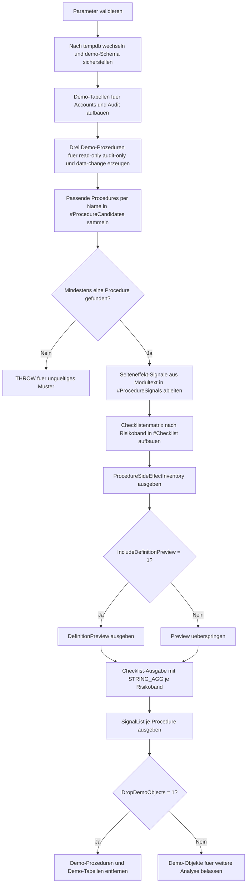

# ProcedureSideEffectChecklist.sql

Dieses Skript baut in `tempdb` drei Demo-Prozeduren mit unterschiedlichen Seiteneffekt-Profilen auf und leitet daraus eine Review-Checkliste ab. So laesst sich systematisch unterscheiden, ob eine Procedure rein liest, nur auditierend schreibt oder fachliche Daten aendert.

## Uebersicht

<!-- SQLDOC:SUMMARY_TABLE:BEGIN -->
| Feld | Wert |
|---|---|
| Script | [ProcedureSideEffectChecklist.sql](ProcedureSideEffectChecklist.sql) |
| Version | `1.0` |
| Typ | `didactic-lab` |
| Kapitel | `23_StoredProcedures` |
| Sicherheit | `demo-write-tempdb` |
| Zweck | Ordnet Seiteneffekte von Demo-Prozeduren ueber Metadaten und Moduldefinitionen in eine Review-Checkliste ein. |
<!-- SQLDOC:SUMMARY_TABLE:END -->

## Einordnung

Seiteneffekte sind bei Stored Procedures oft nicht auf den ersten Blick sichtbar. Ein `SELECT` wirkt harmlos, ein `INSERT` kann nur auditieren, und ein `UPDATE` kann fachliche Zustandswechsel ausloesen. Das Lab verbindet deshalb Demo-Prozeduren mit einer heuristischen Metadatenanalyse, damit Review-Gespraeche eine klare Struktur bekommen.

## Annahmen

- Die Umsetzung ist didaktisch und arbeitet ausschliesslich mit Demo-Objekten in `tempdb`.
- Die Seiteneffekt-Klassifikation basiert bewusst auf Modultext und Katalogsicht, nicht auf einem vollstaendigen statischen SQL-Parser.
- `INSERT` wird hier als mittleres Risiko behandelt, weil Audit- und Stage-Writes typischerweise weniger kritisch sind als fachliche `UPDATE`- oder `DELETE`-Pfade.
- Das Muster ist als Review-Starter gedacht und kann spaeter um teamspezifische Regeln wie Freigabestufen oder Logging-Konventionen erweitert werden.

## Anwendungsfall

Das Skript eignet sich fuer Kapitelabschnitte zu Procedure-Reviews, Deployments und Betriebsfreigaben. Es ist besonders hilfreich, wenn Lernende schnell erkennen sollen, welche Fragen bei lesenden, auditierenden oder datenveraendernden Procedures jeweils zuerst gestellt werden sollten.

## Parameter

<!-- SQLDOC:PARAMETERS_TABLE:BEGIN -->
| Parameter | SQL-Typ | Pflicht | Beschreibung |
|---|---|---|---|
| `@ProcedureNamePattern` | `SYSNAME` | Nein | LIKE-Muster fuer die zu analysierenden Demo-Prozeduren. |
| `@IncludeDefinitionPreview` | `BIT` | Nein | Zeigt bei `1` eine Kurzvorschau der Procedure-Definitionen. |
| `@DropDemoObjects` | `BIT` | Nein | Entfernt Demo-Objekte am Ende wieder aus `tempdb`, wenn `1`. |
<!-- SQLDOC:PARAMETERS_TABLE:END -->

## Abhaengigkeiten

<!-- SQLDOC:DEPENDENCIES_LIST:BEGIN -->
- `tempdb`
- `sys.schemas`
- `sys.procedures`
- `sys.parameters`
- `sys.sql_modules`
- `CREATE OR ALTER PROCEDURE`
- `STRING_AGG`
<!-- SQLDOC:DEPENDENCIES_LIST:END -->

## Hinweise

- `ProcedureSideEffectInventory` liefert die verdichtete Hauptsicht fuer das Review.
- `ProcedureDefinitionPreview` hilft dabei, die heuristische Einordnung mit einem kurzen Modultext-Abgleich zu plausibilisieren.
- `ProcedureSideEffectChecklist` gruppiert Review-Fragen nach Risikoband, damit nicht jede Procedure identisch geprueft wird.
- `ProcedureSideEffectSignals` zeigt die konkret erkannten Signale wie `INSERT`, `UPDATE`, `TRANSACTION` oder `TRY_CATCH`.

## Versionshistorie

<!-- SQLDOC:VERSION_HISTORY_TABLE:BEGIN -->
| Version | Datum | User | Beschreibung |
|---|---|---|---|
| `1.0` | `2026-04-22` | `ER` | Erstversion des tempdb-Labs fuer Seiteneffekt-Checklisten bei Stored Procedures |
<!-- SQLDOC:VERSION_HISTORY_TABLE:END -->

## Ablauf

<!-- SQLDOC:MERMAID:BEGIN -->

<!-- SQLDOC:MERMAID:END -->

## SQL-Code

<!-- SQLDOC:SQL_CODE:BEGIN -->
```sql
/*
BEGIN:SQL-HEADER v1
---
sql_header: v1
script_name: "ProcedureSideEffectChecklist.sql"
script_version: "1.0"
script_type: "didactic-lab"
chapter: "23_StoredProcedures"

purpose: >
  Baut in tempdb mehrere Demo-Prozeduren mit unterschiedlichen
  Seiteneffekten auf und erstellt eine Checkliste, die lesende,
  auditierende und datenveraendernde Muster ueber Metadaten und
  Moduldefinitionen systematisch einordnet.

parameters:
  - name: "@ProcedureNamePattern"
    sql_type: "SYSNAME"
    direction: "IN"
    required: false
    description: "LIKE-Muster fuer die zu analysierenden Demo-Prozeduren"
  - name: "@IncludeDefinitionPreview"
    sql_type: "BIT"
    direction: "IN"
    required: false
    description: "1 = zeigt zusaetzlich eine Kurzvorschau der Procedure-Definitionen"
  - name: "@DropDemoObjects"
    sql_type: "BIT"
    direction: "IN"
    required: false
    description: "1 = entfernt Demo-Objekte am Ende wieder aus tempdb"

result_sets:
  - name: "ProcedureSideEffectInventory"
    description: "Metadatenbasierte Uebersicht je Demo-Procedure mit Seiteneffekt-Klassifikation"
  - name: "ProcedureDefinitionPreview"
    description: "Optionale Kurzvorschau der Definitionsfragmente fuer die analysierten Prozeduren"
  - name: "ProcedureSideEffectChecklist"
    description: "Checkliste mit Prueffragen, Risiken und empfohlenen Review-Schwerpunkten"
  - name: "ProcedureSideEffectSignals"
    description: "Detailansicht der erkannten Seiteneffekt-Signale je Procedure"

dependencies:
  - "tempdb"
  - "sys.schemas"
  - "sys.procedures"
  - "sys.parameters"
  - "sys.sql_modules"
  - "CREATE OR ALTER PROCEDURE"
  - "STRING_AGG"

safety:
  level: "demo-write-tempdb"
  writes_data: true

documentation:
  markdown_file: "T-SQL/23_StoredProcedures/SQLScripts/ProcedureSideEffectChecklist.md"
  sync_blocks:
    - "SUMMARY_TABLE"
    - "PARAMETERS_TABLE"
    - "DEPENDENCIES_LIST"
    - "VERSION_HISTORY_TABLE"
    - "SQL_CODE"
  mermaid:
    mode: "ai-agent-from-sql"
    source: "script-body"

main_responsible:
  name: "Erhard Rainer"
  initials: "ER"

version_history:
  - version: "1.0"
    date: "2026-04-22"
    user: "ER"
    description: "Erstversion des tempdb-Labs fuer Seiteneffekt-Checklisten bei Stored Procedures"

notes:
  - "Alle Demo-Objekte werden ausschliesslich in tempdb angelegt"
  - "Die Seiteneffekt-Einordnung ist heuristisch und fuer Schulungs- und Reviewzwecke gedacht"
---
END:SQL-HEADER v1
*/

SET NOCOUNT ON;

DECLARE @ProcedureNamePattern SYSNAME = N'usp_SideEffect%';
DECLARE @IncludeDefinitionPreview BIT = 1;
DECLARE @DropDemoObjects BIT = 1;

IF NULLIF(LTRIM(RTRIM(@ProcedureNamePattern)), N'') IS NULL
BEGIN
    THROW 50000, '@ProcedureNamePattern darf nicht leer sein.', 1;
END;

IF @IncludeDefinitionPreview NOT IN (0, 1)
BEGIN
    THROW 50001, '@IncludeDefinitionPreview muss 0 oder 1 sein.', 1;
END;

IF @DropDemoObjects NOT IN (0, 1)
BEGIN
    THROW 50002, '@DropDemoObjects muss 0 oder 1 sein.', 1;
END;

USE tempdb;

IF NOT EXISTS
(
    SELECT 1
    FROM sys.schemas
    WHERE name = N'demo'
)
BEGIN
    EXEC(N'CREATE SCHEMA demo AUTHORIZATION dbo;');
END;

DROP PROCEDURE IF EXISTS demo.usp_SideEffectExposureSync;
DROP PROCEDURE IF EXISTS demo.usp_SideEffectAuditOnly;
DROP PROCEDURE IF EXISTS demo.usp_SideEffectReadOnly;
DROP TABLE IF EXISTS demo.ProcedureSideEffectAudit;
DROP TABLE IF EXISTS demo.ProcedureSideEffectAccounts;

CREATE TABLE demo.ProcedureSideEffectAccounts
(
    AccountID         INT            NOT NULL PRIMARY KEY,
    AccountName       NVARCHAR(80)   NOT NULL,
    RegionCode        NVARCHAR(10)   NOT NULL,
    CreditLimit       DECIMAL(12,2)  NOT NULL,
    CurrentExposure   DECIMAL(12,2)  NOT NULL,
    StatusCode        NVARCHAR(20)   NOT NULL,
    LastReviewedAt    DATE           NOT NULL
);

CREATE TABLE demo.ProcedureSideEffectAudit
(
    AuditID            INT             NOT NULL IDENTITY(1,1) PRIMARY KEY,
    EventType          NVARCHAR(40)    NOT NULL,
    ProcedureName      SYSNAME         NOT NULL,
    AccountID          INT             NULL,
    AmountDelta        DECIMAL(12,2)   NULL,
    LoggedAtUtc        DATETIME2(0)    NOT NULL
        CONSTRAINT DF_ProcedureSideEffectAudit_LoggedAtUtc DEFAULT SYSUTCDATETIME(),
    NoteText           NVARCHAR(400)   NOT NULL
);

INSERT INTO demo.ProcedureSideEffectAccounts
(
    AccountID,
    AccountName,
    RegionCode,
    CreditLimit,
    CurrentExposure,
    StatusCode,
    LastReviewedAt
)
VALUES
    (1001, N'Alpha Retail GmbH',    N'DE-N', 2500.00, 1100.00, N'active',   '2026-04-10'),
    (1002, N'Beta Industrie AG',    N'DE-S', 5000.00, 1700.00, N'active',   '2026-04-11'),
    (1003, N'Gamma Logistics KG',   N'AT-W', 1800.00,  950.00, N'watch',    '2026-04-12'),
    (1004, N'Delta Services GmbH',  N'CH-ZH', 8000.00, 4200.00, N'active',  '2026-04-12');

EXEC sys.sp_executesql
N'
CREATE OR ALTER PROCEDURE demo.usp_SideEffectReadOnly
    @RegionCode NVARCHAR(10)
AS
BEGIN
    SET NOCOUNT ON;

    IF NULLIF(LTRIM(RTRIM(@RegionCode)), N'''') IS NULL
    BEGIN
        THROW 51000, N''@RegionCode darf nicht leer sein.'', 1;
    END;

    SELECT
        account_data.AccountID,
        account_data.AccountName,
        account_data.RegionCode,
        account_data.CreditLimit,
        account_data.CurrentExposure,
        account_data.StatusCode
    FROM demo.ProcedureSideEffectAccounts AS account_data
    WHERE account_data.RegionCode = @RegionCode
    ORDER BY
        account_data.AccountID;
END;
';

EXEC sys.sp_executesql
N'
CREATE OR ALTER PROCEDURE demo.usp_SideEffectAuditOnly
    @AccountID INT,
    @ReviewNote NVARCHAR(200)
AS
BEGIN
    SET NOCOUNT ON;

    IF @AccountID IS NULL OR @AccountID < 1
    BEGIN
        THROW 51010, N''@AccountID muss positiv sein.'', 1;
    END;

    IF NULLIF(LTRIM(RTRIM(@ReviewNote)), N'''') IS NULL
    BEGIN
        THROW 51011, N''@ReviewNote darf nicht leer sein.'', 1;
    END;

    INSERT INTO demo.ProcedureSideEffectAudit
    (
        EventType,
        ProcedureName,
        AccountID,
        AmountDelta,
        NoteText
    )
    VALUES
    (
        N''audit-review'',
        N''demo.usp_SideEffectAuditOnly'',
        @AccountID,
        NULL,
        @ReviewNote
    );

    SELECT
        LastAuditID = SCOPE_IDENTITY(),
        LoggedRows = @@ROWCOUNT,
        ReviewNote = @ReviewNote;
END;
';

EXEC sys.sp_executesql
N'
CREATE OR ALTER PROCEDURE demo.usp_SideEffectExposureSync
    @AccountID INT,
    @AmountDelta DECIMAL(12,2),
    @AppendAuditRow BIT = 1
AS
BEGIN
    SET NOCOUNT ON;

    IF @AccountID IS NULL OR @AccountID < 1
    BEGIN
        THROW 51020, N''@AccountID muss positiv sein.'', 1;
    END;

    IF @AmountDelta IS NULL
    BEGIN
        THROW 51021, N''@AmountDelta darf nicht NULL sein.'', 1;
    END;

    IF @AppendAuditRow NOT IN (0, 1)
    BEGIN
        THROW 51022, N''@AppendAuditRow muss 0 oder 1 sein.'', 1;
    END;

    BEGIN TRY
        BEGIN TRANSACTION;

        UPDATE demo.ProcedureSideEffectAccounts
        SET
            CurrentExposure = CurrentExposure + @AmountDelta,
            StatusCode =
                CASE
                    WHEN CurrentExposure + @AmountDelta > CreditLimit THEN N''watch''
                    ELSE N''active''
                END,
            LastReviewedAt = CONVERT(date, SYSUTCDATETIME())
        WHERE AccountID = @AccountID;

        IF @@ROWCOUNT = 0
        BEGIN
            THROW 51023, N''AccountID wurde im Demo-Bestand nicht gefunden.'', 1;
        END;

        IF @AppendAuditRow = 1
        BEGIN
            INSERT INTO demo.ProcedureSideEffectAudit
            (
                EventType,
                ProcedureName,
                AccountID,
                AmountDelta,
                NoteText
            )
            VALUES
            (
                N''exposure-sync'',
                N''demo.usp_SideEffectExposureSync'',
                @AccountID,
                @AmountDelta,
                N''CurrentExposure und StatusCode wurden angepasst.''
            );
        END;

        COMMIT TRANSACTION;
    END TRY
    BEGIN CATCH
        IF XACT_STATE() <> 0
        BEGIN
            ROLLBACK TRANSACTION;
        END;

        THROW;
    END CATCH;

    SELECT
        account_data.AccountID,
        account_data.CurrentExposure,
        account_data.CreditLimit,
        account_data.StatusCode,
        account_data.LastReviewedAt
    FROM demo.ProcedureSideEffectAccounts AS account_data
    WHERE account_data.AccountID = @AccountID;
END;
';

DROP TABLE IF EXISTS #ProcedureCandidates;
DROP TABLE IF EXISTS #ProcedureSignals;
DROP TABLE IF EXISTS #Checklist;

CREATE TABLE #ProcedureCandidates
(
    ObjectID         INT            NOT NULL PRIMARY KEY,
    SchemaName       SYSNAME        NOT NULL,
    ProcedureName    SYSNAME        NOT NULL,
    ParameterCount   INT            NOT NULL,
    DefinitionText   NVARCHAR(MAX)  NOT NULL
);

INSERT INTO #ProcedureCandidates
(
    ObjectID,
    SchemaName,
    ProcedureName,
    ParameterCount,
    DefinitionText
)
SELECT
    proc.object_id,
    schema_name(proc.schema_id) AS SchemaName,
    proc.name AS ProcedureName,
    COUNT(param.parameter_id) AS ParameterCount,
    module_def.definition AS DefinitionText
FROM sys.procedures AS proc
INNER JOIN sys.sql_modules AS module_def
    ON module_def.object_id = proc.object_id
LEFT JOIN sys.parameters AS param
    ON param.object_id = proc.object_id
WHERE schema_name(proc.schema_id) = N'demo'
  AND proc.name LIKE @ProcedureNamePattern
GROUP BY
    proc.object_id,
    proc.schema_id,
    proc.name,
    module_def.definition;

IF NOT EXISTS
(
    SELECT 1
    FROM #ProcedureCandidates
)
BEGIN
    THROW 50003, 'Es wurden keine Demo-Prozeduren fuer das angegebene Muster gefunden.', 1;
END;

CREATE TABLE #ProcedureSignals
(
    ObjectID              INT           NOT NULL PRIMARY KEY,
    QualifiedName         NVARCHAR(258) NOT NULL,
    ParameterCount        INT           NOT NULL,
    HasInsert             BIT           NOT NULL,
    HasUpdate             BIT           NOT NULL,
    HasDelete             BIT           NOT NULL,
    HasMerge              BIT           NOT NULL,
    HasTransaction        BIT           NOT NULL,
    HasDynamicSql         BIT           NOT NULL,
    HasTryCatch           BIT           NOT NULL,
    HasTempObjectUsage    BIT           NOT NULL,
    SideEffectClass       NVARCHAR(40)  NOT NULL,
    ReviewRisk            NVARCHAR(20)  NOT NULL,
    PrimaryChecklistFocus NVARCHAR(160) NOT NULL
);

INSERT INTO #ProcedureSignals
(
    ObjectID,
    QualifiedName,
    ParameterCount,
    HasInsert,
    HasUpdate,
    HasDelete,
    HasMerge,
    HasTransaction,
    HasDynamicSql,
    HasTryCatch,
    HasTempObjectUsage,
    SideEffectClass,
    ReviewRisk,
    PrimaryChecklistFocus
)
SELECT
    candidate.ObjectID,
    QUOTENAME(candidate.SchemaName) + N''.'' + QUOTENAME(candidate.ProcedureName) AS QualifiedName,
    candidate.ParameterCount,
    CAST(CASE WHEN candidate.DefinitionText LIKE N''%INSERT INTO%'' THEN 1 ELSE 0 END AS BIT) AS HasInsert,
    CAST(CASE WHEN candidate.DefinitionText LIKE N''%UPDATE %'' THEN 1 ELSE 0 END AS BIT) AS HasUpdate,
    CAST(CASE WHEN candidate.DefinitionText LIKE N''%DELETE %'' THEN 1 ELSE 0 END AS BIT) AS HasDelete,
    CAST(CASE WHEN candidate.DefinitionText LIKE N''%MERGE %'' THEN 1 ELSE 0 END AS BIT) AS HasMerge,
    CAST(CASE WHEN candidate.DefinitionText LIKE N''%BEGIN TRANSACTION%'' OR candidate.DefinitionText LIKE N''%COMMIT TRANSACTION%'' THEN 1 ELSE 0 END AS BIT) AS HasTransaction,
    CAST(CASE WHEN candidate.DefinitionText LIKE N''%sp_executesql%'' OR candidate.DefinitionText LIKE N''%EXEC(%'' OR candidate.DefinitionText LIKE N''%EXEC (%'' THEN 1 ELSE 0 END AS BIT) AS HasDynamicSql,
    CAST(CASE WHEN candidate.DefinitionText LIKE N''%BEGIN TRY%'' AND candidate.DefinitionText LIKE N''%BEGIN CATCH%'' THEN 1 ELSE 0 END AS BIT) AS HasTryCatch,
    CAST(CASE WHEN candidate.DefinitionText LIKE N''%#%'' THEN 1 ELSE 0 END AS BIT) AS HasTempObjectUsage,
    CASE
        WHEN candidate.DefinitionText LIKE N''%UPDATE %'' OR candidate.DefinitionText LIKE N''%DELETE %'' OR candidate.DefinitionText LIKE N''%MERGE %''
            THEN N''data-change''
        WHEN candidate.DefinitionText LIKE N''%INSERT INTO%''
            THEN N''audit-or-stage-write''
        ELSE N''read-only''
    END AS SideEffectClass,
    CASE
        WHEN candidate.DefinitionText LIKE N''%UPDATE %'' OR candidate.DefinitionText LIKE N''%DELETE %'' OR candidate.DefinitionText LIKE N''%MERGE %''
            THEN N''high''
        WHEN candidate.DefinitionText LIKE N''%INSERT INTO%'' OR candidate.DefinitionText LIKE N''%BEGIN TRANSACTION%''
            THEN N''medium''
        ELSE N''low''
    END AS ReviewRisk,
    CASE
        WHEN candidate.DefinitionText LIKE N''%UPDATE %'' OR candidate.DefinitionText LIKE N''%DELETE %'' OR candidate.DefinitionText LIKE N''%MERGE %''
            THEN N''Vorbedingungen, Transaktionsgrenzen und Rollback-Pfade pruefen''
        WHEN candidate.DefinitionText LIKE N''%INSERT INTO%''
            THEN N''Ziel der Writes, Idempotenz und Audit-Volumen pruefen''
        ELSE N''Lesepfade, Filter und Resultset-Vertrag pruefen''
    END AS PrimaryChecklistFocus
FROM #ProcedureCandidates AS candidate;

CREATE TABLE #Checklist
(
    RiskBand         NVARCHAR(20)   NOT NULL,
    ChecklistItem    NVARCHAR(160)  NOT NULL,
    WhyItMatters     NVARCHAR(220)  NOT NULL,
    SuggestedAction  NVARCHAR(220)  NOT NULL
);

INSERT INTO #Checklist
(
    RiskBand,
    ChecklistItem,
    WhyItMatters,
    SuggestedAction
)
VALUES
    (
        N''low'',
        N''Leselogik und Resultset stabil?'',
        N''Rein lesende Procedures sollen trotz fehlender Writes einen stabilen Filter- und Sortiervertrag haben.'',
        N''Filter, ORDER BY und Spaltennamen mit dem fachlichen Vertrag abgleichen.''
    ),
    (
        N''medium'',
        N''Audit- oder Stage-Writes kontrolliert?'',
        N''Insert-only-Muster koennen trotzdem Volumen, Wiederholbarkeit und Logging-Kosten verursachen.'',
        N''Zieltabellen, Schluessel und Deduplizierung fuer wiederholte Aufrufe pruefen.''
    ),
    (
        N''high'',
        N''Datenaenderung transaktional abgesichert?'',
        N''Update-, Delete- oder Merge-Pfade veraendern fachliche Daten und brauchen Guardrails.'',
        N''Vorbedingungen, Isolationsannahmen, Fehlerpfade und Rollback-Verhalten reviewen.''
    );

SELECT
    signal.QualifiedName,
    signal.ParameterCount,
    signal.SideEffectClass,
    signal.ReviewRisk,
    signal.HasInsert,
    signal.HasUpdate,
    signal.HasDelete,
    signal.HasMerge,
    signal.HasTransaction,
    signal.HasDynamicSql,
    signal.HasTryCatch,
    signal.HasTempObjectUsage,
    signal.PrimaryChecklistFocus
FROM #ProcedureSignals AS signal
ORDER BY
    CASE signal.ReviewRisk
        WHEN N''high'' THEN 1
        WHEN N''medium'' THEN 2
        ELSE 3
    END,
    signal.QualifiedName;

IF @IncludeDefinitionPreview = 1
BEGIN
    SELECT
        signal.QualifiedName,
        DefinitionPreview =
            LEFT
            (
                REPLACE(REPLACE(candidate.DefinitionText, CHAR(13), N'' ''), CHAR(10), N'' ''),
                220
            ) + N''...''
    FROM #ProcedureSignals AS signal
    INNER JOIN #ProcedureCandidates AS candidate
        ON candidate.ObjectID = signal.ObjectID
    ORDER BY
        signal.QualifiedName;
END;

SELECT
    signal.ReviewRisk,
    checklist.ChecklistItem,
    checklist.WhyItMatters,
    checklist.SuggestedAction,
    MatchedProcedures =
        STRING_AGG(signal.QualifiedName, N'', '')
FROM #Checklist AS checklist
INNER JOIN #ProcedureSignals AS signal
    ON signal.ReviewRisk = checklist.RiskBand
GROUP BY
    signal.ReviewRisk,
    checklist.ChecklistItem,
    checklist.WhyItMatters,
    checklist.SuggestedAction
ORDER BY
    CASE signal.ReviewRisk
        WHEN N''high'' THEN 1
        WHEN N''medium'' THEN 2
        ELSE 3
    END,
    checklist.ChecklistItem;

SELECT
    signal.QualifiedName,
    SignalList =
        STRING_AGG(signal_name.SignalName, N'', '')
FROM #ProcedureSignals AS signal
CROSS APPLY
(
    SELECT N''INSERT'' AS SignalName WHERE signal.HasInsert = 1
    UNION ALL
    SELECT N''UPDATE'' WHERE signal.HasUpdate = 1
    UNION ALL
    SELECT N''DELETE'' WHERE signal.HasDelete = 1
    UNION ALL
    SELECT N''MERGE'' WHERE signal.HasMerge = 1
    UNION ALL
    SELECT N''TRANSACTION'' WHERE signal.HasTransaction = 1
    UNION ALL
    SELECT N''DYNAMIC_SQL'' WHERE signal.HasDynamicSql = 1
    UNION ALL
    SELECT N''TRY_CATCH'' WHERE signal.HasTryCatch = 1
    UNION ALL
    SELECT N''TEMP_OBJECT_USAGE'' WHERE signal.HasTempObjectUsage = 1
) AS signal_name
GROUP BY
    signal.QualifiedName
ORDER BY
    signal.QualifiedName;

IF @DropDemoObjects = 1
BEGIN
    DROP PROCEDURE IF EXISTS demo.usp_SideEffectExposureSync;
    DROP PROCEDURE IF EXISTS demo.usp_SideEffectAuditOnly;
    DROP PROCEDURE IF EXISTS demo.usp_SideEffectReadOnly;
    DROP TABLE IF EXISTS demo.ProcedureSideEffectAudit;
    DROP TABLE IF EXISTS demo.ProcedureSideEffectAccounts;
END;
```
<!-- SQLDOC:SQL_CODE:END -->
