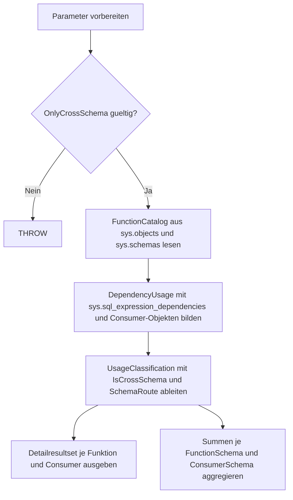

# FunctionCrossSchemaUsage.sql

Diagnose-Skript fuer Kapitel `24_UserDefinedFunctions`, das schemauebergreifende Verwendungen von User-Defined Functions ueber Katalog-Dependencies sichtbar macht.

## Uebersicht

<!-- SQLDOC:SUMMARY_TABLE:BEGIN -->
| Feld | Wert |
|---|---|
| Script | [FunctionCrossSchemaUsage.sql](FunctionCrossSchemaUsage.sql) |
| Version | `1.0` |
| Typ | `diagnostic-query` |
| Kapitel | `24_UserDefinedFunctions` |
| Sicherheit | `read-only` |
| Zweck | Zeigt User-Defined Functions, die von Objekten aus anderen Schemas referenziert werden, und fasst die schemauebergreifende Nutzung nach Funktions- und Consumer-Schema zusammen. |
<!-- SQLDOC:SUMMARY_TABLE:END -->

## Einordnung

Das Skript ist als lesende Erstversion fuer Trainings-, Review- und Discovery-Zwecke gedacht. Es eignet sich, um Abhaengigkeiten zwischen Funktionsbibliotheken und konsumierenden Schemata sichtbar zu machen.

## Annahmen

- Als gesicherte Nutzung gelten nur aufgeloeste Referenzen aus `sys.sql_expression_dependencies`.
- Dynamisches SQL oder nicht aufgeloeste Namensbindungen werden nicht als belastbare schemauebergreifende Nutzung ausgewiesen.
- Referenzierende Objekte werden ueber `sys.objects` betrachtet; serverweite oder externe Consumer sind nicht Teil dieser Erstversion.

## Anwendungsfall

Nutze das Skript, wenn du schnell erkennen moechtest:

- welche Funktionen von Objekten aus anderen Schemas konsumiert werden,
- welche Schema-Paare besonders viele Abhaengigkeiten aufweisen,
- wo Refactoring, Schemabereinigung oder Schnittstellen-Dokumentation sinnvoll sein koennte.

## Hinweise und Grenzen

- Das Skript veraendert keine Objekte und schreibt keine Daten.
- Es betrachtet nur Dependencies mit aufgeloester `referenced_id`.
- Mehrdeutige oder unvollstaendig aufloesbare Abhaengigkeiten werden als Signal im Resultset ausgewiesen.

## Parameter

<!-- SQLDOC:PARAMETERS_TABLE:BEGIN -->
| Name | Typ | Richtung | Pflicht | Beschreibung |
|---|---|---|---|---|
| `@FunctionSchema` | `SYSNAME` | `IN` | nein | Optionales Schema zur Eingrenzung der untersuchten Funktionen |
| `@ConsumerSchema` | `SYSNAME` | `IN` | nein | Optionales Schema zur Eingrenzung der referenzierenden Objekte |
| `@OnlyCrossSchema` | `BIT` | `IN` | nein | `1` = nur schemauebergreifende Verwendungen ausgeben |
<!-- SQLDOC:PARAMETERS_TABLE:END -->

## Abhaengigkeiten

<!-- SQLDOC:DEPENDENCIES_LIST:BEGIN -->
- `sys.objects`
- `sys.schemas`
- `sys.sql_expression_dependencies`
- `COALESCE`
- `CASE`
<!-- SQLDOC:DEPENDENCIES_LIST:END -->

## Versionshistorie

<!-- SQLDOC:VERSION_HISTORY_TABLE:BEGIN -->
| Version | Datum | Bearbeiter | Beschreibung |
|---|---|---|---|
| `1.0` | `2026-04-22` | `ER` | Erstversion des Diagnose-Skripts fuer schemauebergreifende Funktionsnutzung |
<!-- SQLDOC:VERSION_HISTORY_TABLE:END -->

## Ablauf

<!-- SQLDOC:MERMAID:BEGIN -->

<!-- SQLDOC:MERMAID:END -->

## SQL-Code

<!-- SQLDOC:SQL_CODE:BEGIN -->
```sql
/*
BEGIN:SQL-HEADER v1
---
sql_header: v1
script_name: "FunctionCrossSchemaUsage.sql"
script_version: "1.0"
script_type: "diagnostic-query"
chapter: "24_UserDefinedFunctions"

purpose: >
  Zeigt User-Defined Functions, die von Objekten aus anderen Schemas
  referenziert werden, und fasst die schemauebergreifende Nutzung nach
  Funktions- und Consumer-Schema zusammen.

parameters:
  - name: "@FunctionSchema"
    sql_type: "SYSNAME"
    direction: "IN"
    required: false
    description: "Optionales Schema zur Eingrenzung der untersuchten Funktionen"
  - name: "@ConsumerSchema"
    sql_type: "SYSNAME"
    direction: "IN"
    required: false
    description: "Optionales Schema zur Eingrenzung der referenzierenden Objekte"
  - name: "@OnlyCrossSchema"
    sql_type: "BIT"
    direction: "IN"
    required: false
    description: "1 = nur schemauebergreifende Verwendungen ausgeben"

result_sets:
  - name: "FunctionCrossSchemaUsage"
    description: "Detailansicht je referenzierter Funktion und konsumierendem Objekt"
  - name: "FunctionCrossSchemaUsageSummary"
    description: "Aggregierte Anzahl der Nutzungen je Funktions- und Consumer-Schema"

dependencies:
  - "sys.objects"
  - "sys.schemas"
  - "sys.sql_expression_dependencies"
  - "COALESCE"
  - "CASE"

safety:
  level: "read-only"
  writes_data: false

documentation:
  markdown_file: "T-SQL/24_UserDefinedFunctions/SQLScripts/FunctionCrossSchemaUsage.md"
  sync_blocks:
    - "SUMMARY_TABLE"
    - "PARAMETERS_TABLE"
    - "DEPENDENCIES_LIST"
    - "VERSION_HISTORY_TABLE"
    - "SQL_CODE"
  mermaid:
    mode: "ai-agent-from-sql"
    source: "script-body"

main_responsible:
  name: "Erhard Rainer"
  initials: "ER"

version_history:
  - version: "1.0"
    date: "2026-04-22"
    user: "ER"
    description: "Erstversion des Diagnose-Skripts fuer schemauebergreifende Funktionsnutzung"

notes:
  - "Die Auswertung basiert auf aufgeloesten Eintraegen in sys.sql_expression_dependencies"
  - "Nicht aufloesbare dynamische Referenzen werden bewusst nicht als gesicherte Nutzung interpretiert"
---
END:SQL-HEADER v1
*/

SET NOCOUNT ON;

DECLARE @FunctionSchema SYSNAME = NULL;
DECLARE @ConsumerSchema SYSNAME = NULL;
DECLARE @OnlyCrossSchema BIT = 1;

IF @OnlyCrossSchema NOT IN (0, 1)
BEGIN
    THROW 50000, '@OnlyCrossSchema muss 0 oder 1 sein.', 1;
END;

;WITH FunctionCatalog AS
(
    SELECT
        f.object_id AS function_id,
        fs.name AS function_schema_name,
        f.name AS function_name,
        f.type AS function_type,
        f.type_desc AS function_type_desc,
        f.create_date,
        f.modify_date
    FROM sys.objects AS f
    INNER JOIN sys.schemas AS fs
        ON fs.schema_id = f.schema_id
    WHERE f.type IN ('FN', 'IF', 'TF', 'FS', 'FT')
      AND (@FunctionSchema IS NULL OR fs.name = @FunctionSchema)
),
DependencyUsage AS
(
    SELECT
        fc.function_id,
        fc.function_schema_name,
        fc.function_name,
        fc.function_type,
        fc.function_type_desc,
        ro.object_id AS consumer_object_id,
        cs.name AS consumer_schema_name,
        ro.name AS consumer_object_name,
        ro.type AS consumer_object_type,
        ro.type_desc AS consumer_object_type_desc,
        sed.referencing_class_desc,
        sed.referenced_class_desc,
        sed.is_ambiguous,
        sed.is_schema_bound_reference
    FROM FunctionCatalog AS fc
    INNER JOIN sys.sql_expression_dependencies AS sed
        ON sed.referenced_id = fc.function_id
    INNER JOIN sys.objects AS ro
        ON ro.object_id = sed.referencing_id
    INNER JOIN sys.schemas AS cs
        ON cs.schema_id = ro.schema_id
    WHERE (@ConsumerSchema IS NULL OR cs.name = @ConsumerSchema)
),
UsageClassification AS
(
    SELECT
        du.function_schema_name,
        du.function_name,
        du.function_type,
        du.function_type_desc,
        du.consumer_schema_name,
        du.consumer_object_name,
        du.consumer_object_type,
        du.consumer_object_type_desc,
        du.referencing_class_desc,
        du.referenced_class_desc,
        du.is_ambiguous,
        du.is_schema_bound_reference,
        CASE
            WHEN du.consumer_schema_name <> du.function_schema_name THEN CAST(1 AS BIT)
            ELSE CAST(0 AS BIT)
        END AS is_cross_schema,
        CASE
            WHEN du.consumer_schema_name <> du.function_schema_name
                THEN CONCAT(du.consumer_schema_name, ' -> ', du.function_schema_name)
            ELSE CONCAT(du.function_schema_name, ' -> ', du.function_schema_name)
        END AS schema_route
    FROM DependencyUsage AS du
)
SELECT
    uc.function_schema_name AS FunctionSchema,
    uc.function_name AS FunctionName,
    uc.function_type AS FunctionType,
    uc.function_type_desc AS FunctionTypeDescription,
    uc.consumer_schema_name AS ConsumerSchema,
    uc.consumer_object_name AS ConsumerObject,
    uc.consumer_object_type AS ConsumerType,
    uc.consumer_object_type_desc AS ConsumerTypeDescription,
    uc.is_cross_schema AS IsCrossSchemaUsage,
    uc.schema_route AS SchemaRoute,
    uc.referencing_class_desc AS ReferencingClass,
    uc.referenced_class_desc AS ReferencedClass,
    uc.is_schema_bound_reference AS IsSchemaBoundReference,
    uc.is_ambiguous AS IsAmbiguousDependency
FROM UsageClassification AS uc
WHERE @OnlyCrossSchema = 0
   OR uc.is_cross_schema = 1
ORDER BY
    uc.function_schema_name,
    uc.function_name,
    uc.consumer_schema_name,
    uc.consumer_object_name;

SELECT
    uc.function_schema_name AS FunctionSchema,
    uc.consumer_schema_name AS ConsumerSchema,
    COUNT(*) AS UsageCount,
    COUNT(DISTINCT uc.function_name) AS DistinctFunctions,
    COUNT(DISTINCT CONCAT(uc.consumer_schema_name, '.', uc.consumer_object_name)) AS DistinctConsumers,
    SUM(CASE WHEN uc.is_cross_schema = 1 THEN 1 ELSE 0 END) AS CrossSchemaUsageCount,
    SUM(CASE WHEN uc.is_schema_bound_reference = 1 THEN 1 ELSE 0 END) AS SchemaBoundUsageCount,
    SUM(CASE WHEN uc.is_ambiguous = 1 THEN 1 ELSE 0 END) AS AmbiguousDependencyCount
FROM UsageClassification AS uc
WHERE @OnlyCrossSchema = 0
   OR uc.is_cross_schema = 1
GROUP BY
    uc.function_schema_name,
    uc.consumer_schema_name
ORDER BY
    CrossSchemaUsageCount DESC,
    UsageCount DESC,
    uc.function_schema_name,
    uc.consumer_schema_name;
```
<!-- SQLDOC:SQL_CODE:END -->
