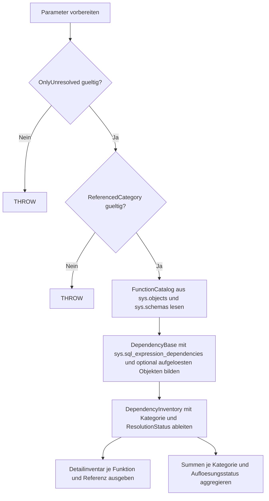

# FunctionDependencyInventory.sql

Diagnose-Skript fuer Kapitel `24_UserDefinedFunctions`, das Funktionsabhaengigkeiten zu Tabellen, Views und anderen Modulen ueber Katalogmetadaten inventarisiert.

## Uebersicht

<!-- SQLDOC:SUMMARY_TABLE:BEGIN -->
| Feld | Wert |
|---|---|
| Script | [FunctionDependencyInventory.sql](FunctionDependencyInventory.sql) |
| Version | `1.0` |
| Typ | `diagnostic-query` |
| Kapitel | `24_UserDefinedFunctions` |
| Sicherheit | `read-only` |
| Zweck | Inventarisiert User-Defined Functions und ihre Abhaengigkeiten zu Tabellen, Views und anderen SQL-Modulen auf Basis von Katalogmetadaten. |
<!-- SQLDOC:SUMMARY_TABLE:END -->

## Einordnung

Das Skript ist als lesende Erstversion fuer Trainings-, Review- und Discovery-Zwecke gedacht. Es zeigt sowohl aufgeloeste Objektbindungen als auch nicht aufgeloeste Namensreferenzen, damit Funktionslandschaften systematisch analysiert werden koennen.

## Annahmen

- Die Auswertung basiert auf `sys.sql_expression_dependencies` und betrachtet nur Abhaengigkeiten, die SQL Server dort als Referenz signalisiert.
- Nicht aufgeloeste Namen bleiben als didaktische Signalsicht erhalten und werden nicht als gesicherte Objektbindung interpretiert.
- Kategorien wie `MODULE` und `TABLE_OR_VIEW` werden ueber Objekt-Typen heuristisch zusammengefasst, um ein kompakteres Inventar zu liefern.

## Anwendungsfall

Nutze das Skript, wenn du schnell erkennen moechtest:

- welche Funktionen von Tabellen, Views oder anderen Modulen abhaengen,
- wo mehrdeutige oder nicht aufgeloeste Referenzen manuelle Nachpruefung verdienen,
- welche Abhaengigkeitstypen in einer Funktionssammlung dominieren.

## Hinweise und Grenzen

- Das Skript veraendert keine Objekte und schreibt keine Daten.
- Dynamisches SQL oder nicht erfasste Metadatenpfade koennen im Inventar fehlen.
- Externe oder serverweite Namensbestandteile werden nur dann angezeigt, wenn sie in `sys.sql_expression_dependencies` befuellt sind.

## Parameter

<!-- SQLDOC:PARAMETERS_TABLE:BEGIN -->
| Name | Typ | Richtung | Pflicht | Beschreibung |
|---|---|---|---|---|
| `@FunctionSchema` | `SYSNAME` | `IN` | nein | Optionales Schema zur Eingrenzung der untersuchten Funktionen |
| `@ReferencedCategory` | `NVARCHAR(20)` | `IN` | nein | Optionaler Filter auf `MODULE`, `TABLE_OR_VIEW` oder `OTHER` |
| `@OnlyUnresolved` | `BIT` | `IN` | nein | `1` = nur nicht aufgeloeste oder mehrdeutige Referenzen ausgeben |
<!-- SQLDOC:PARAMETERS_TABLE:END -->

## Abhaengigkeiten

<!-- SQLDOC:DEPENDENCIES_LIST:BEGIN -->
- `sys.objects`
- `sys.schemas`
- `sys.sql_expression_dependencies`
- `COALESCE`
- `CASE`
<!-- SQLDOC:DEPENDENCIES_LIST:END -->

## Versionshistorie

<!-- SQLDOC:VERSION_HISTORY_TABLE:BEGIN -->
| Version | Datum | Bearbeiter | Beschreibung |
|---|---|---|---|
| `1.0` | `2026-04-22` | `ER` | Erstversion des Diagnose-Skripts fuer Funktionsabhaengigkeiten |
<!-- SQLDOC:VERSION_HISTORY_TABLE:END -->

## Ablauf

<!-- SQLDOC:MERMAID:BEGIN -->

<!-- SQLDOC:MERMAID:END -->

## SQL-Code

<!-- SQLDOC:SQL_CODE:BEGIN -->
```sql
/*
BEGIN:SQL-HEADER v1
---
sql_header: v1
script_name: "FunctionDependencyInventory.sql"
script_version: "1.0"
script_type: "diagnostic-query"
chapter: "24_UserDefinedFunctions"

purpose: >
  Inventarisiert User-Defined Functions und ihre Abhaengigkeiten zu
  Tabellen, Views und anderen SQL-Modulen auf Basis von
  Katalogmetadaten.

parameters:
  - name: "@FunctionSchema"
    sql_type: "SYSNAME"
    direction: "IN"
    required: false
    description: "Optionales Schema zur Eingrenzung der untersuchten Funktionen"
  - name: "@ReferencedCategory"
    sql_type: "NVARCHAR(20)"
    direction: "IN"
    required: false
    description: "Optionaler Filter auf MODULE, TABLE_OR_VIEW oder OTHER"
  - name: "@OnlyUnresolved"
    sql_type: "BIT"
    direction: "IN"
    required: false
    description: "1 = nur nicht aufgeloeste oder mehrdeutige Referenzen ausgeben"

result_sets:
  - name: "FunctionDependencyInventory"
    description: "Detailinventar je Funktion und referenziertem Objekt oder Namensfragment"
  - name: "FunctionDependencySummary"
    description: "Aggregierte Anzahl der Referenzen je Kategorie und Aufloesungsstatus"

dependencies:
  - "sys.objects"
  - "sys.schemas"
  - "sys.sql_expression_dependencies"
  - "COALESCE"
  - "CASE"

safety:
  level: "read-only"
  writes_data: false

documentation:
  markdown_file: "T-SQL/24_UserDefinedFunctions/SQLScripts/FunctionDependencyInventory.md"
  sync_blocks:
    - "SUMMARY_TABLE"
    - "PARAMETERS_TABLE"
    - "DEPENDENCIES_LIST"
    - "VERSION_HISTORY_TABLE"
    - "SQL_CODE"
  mermaid:
    mode: "ai-agent-from-sql"
    source: "script-body"

main_responsible:
  name: "Erhard Rainer"
  initials: "ER"

version_history:
  - version: "1.0"
    date: "2026-04-22"
    user: "ER"
    description: "Erstversion des Diagnose-Skripts fuer Funktionsabhaengigkeiten"

notes:
  - "Die Erstversion nutzt aufgeloeste und nicht aufgeloeste Eintraege aus sys.sql_expression_dependencies."
  - "Nicht aufgeloeste Namen bleiben als didaktische Signalsicht erhalten und werden nicht als gesicherte Objektbindung gewertet."
---
END:SQL-HEADER v1
*/

SET NOCOUNT ON;

DECLARE @FunctionSchema SYSNAME = NULL;
DECLARE @ReferencedCategory NVARCHAR(20) = NULL;
DECLARE @OnlyUnresolved BIT = 0;

IF @OnlyUnresolved NOT IN (0, 1)
BEGIN
    THROW 50000, '@OnlyUnresolved muss 0 oder 1 sein.', 1;
END;

IF @ReferencedCategory IS NOT NULL
   AND UPPER(@ReferencedCategory) NOT IN ('MODULE', 'TABLE_OR_VIEW', 'OTHER')
BEGIN
    THROW 50001, '@ReferencedCategory muss MODULE, TABLE_OR_VIEW oder OTHER sein.', 1;
END;

;WITH FunctionCatalog AS
(
    SELECT
        f.object_id AS function_id,
        fs.name AS function_schema_name,
        f.name AS function_name,
        f.type AS function_type,
        f.type_desc AS function_type_desc,
        f.create_date,
        f.modify_date
    FROM sys.objects AS f
    INNER JOIN sys.schemas AS fs
        ON fs.schema_id = f.schema_id
    WHERE f.type IN ('FN', 'IF', 'TF', 'FS', 'FT')
      AND (@FunctionSchema IS NULL OR fs.name = @FunctionSchema)
),
DependencyBase AS
(
    SELECT
        fc.function_schema_name,
        fc.function_name,
        fc.function_type,
        fc.function_type_desc,
        sed.referencing_id,
        sed.referenced_id,
        sed.referenced_class_desc,
        sed.referenced_server_name,
        sed.referenced_database_name,
        sed.referenced_schema_name,
        sed.referenced_entity_name,
        sed.is_schema_bound_reference,
        sed.is_ambiguous,
        ro.type AS referenced_object_type,
        ro.type_desc AS referenced_object_type_desc,
        rs.name AS resolved_schema_name,
        ro.name AS resolved_object_name
    FROM FunctionCatalog AS fc
    INNER JOIN sys.sql_expression_dependencies AS sed
        ON sed.referencing_id = fc.function_id
    LEFT JOIN sys.objects AS ro
        ON ro.object_id = sed.referenced_id
    LEFT JOIN sys.schemas AS rs
        ON rs.schema_id = ro.schema_id
),
DependencyInventory AS
(
    SELECT
        db.function_schema_name,
        db.function_name,
        db.function_type,
        db.function_type_desc,
        db.referenced_class_desc,
        db.referenced_server_name,
        db.referenced_database_name,
        COALESCE(db.resolved_schema_name, db.referenced_schema_name) AS referenced_schema_name,
        COALESCE(db.resolved_object_name, db.referenced_entity_name) AS referenced_entity_name,
        db.referenced_object_type,
        db.referenced_object_type_desc,
        db.is_schema_bound_reference,
        db.is_ambiguous,
        CASE
            WHEN db.referenced_object_type IN ('FN', 'IF', 'TF', 'FS', 'FT', 'P', 'V', 'TR')
                THEN 'MODULE'
            WHEN db.referenced_object_type IN ('U', 'S', 'SN', 'TT')
                THEN 'TABLE_OR_VIEW'
            WHEN db.referenced_class_desc = 'OBJECT_OR_COLUMN'
                 AND db.referenced_id IS NULL
                 AND db.referenced_entity_name IS NOT NULL
                THEN 'OTHER'
            WHEN db.referenced_object_type IS NULL
                THEN 'OTHER'
            ELSE 'OTHER'
        END AS referenced_category,
        CASE
            WHEN db.referenced_id IS NULL THEN 'unresolved_name'
            WHEN db.is_ambiguous = 1 THEN 'ambiguous'
            ELSE 'resolved'
        END AS resolution_status
    FROM DependencyBase AS db
)
SELECT
    di.function_schema_name AS FunctionSchema,
    di.function_name AS FunctionName,
    di.function_type AS FunctionType,
    di.function_type_desc AS FunctionTypeDescription,
    di.referenced_category AS ReferencedCategory,
    di.resolution_status AS ResolutionStatus,
    di.referenced_class_desc AS ReferencedClass,
    di.referenced_server_name AS ReferencedServer,
    di.referenced_database_name AS ReferencedDatabase,
    di.referenced_schema_name AS ReferencedSchema,
    di.referenced_entity_name AS ReferencedEntity,
    di.referenced_object_type AS ReferencedObjectType,
    di.referenced_object_type_desc AS ReferencedObjectTypeDescription,
    di.is_schema_bound_reference AS IsSchemaBoundReference,
    di.is_ambiguous AS IsAmbiguousDependency
FROM DependencyInventory AS di
WHERE (@ReferencedCategory IS NULL OR di.referenced_category = UPPER(@ReferencedCategory))
  AND (@OnlyUnresolved = 0 OR di.resolution_status <> 'resolved')
ORDER BY
    di.function_schema_name,
    di.function_name,
    CASE di.resolution_status
        WHEN 'resolved' THEN 1
        WHEN 'ambiguous' THEN 2
        ELSE 3
    END,
    di.referenced_category,
    di.referenced_schema_name,
    di.referenced_entity_name;

SELECT
    di.referenced_category AS ReferencedCategory,
    di.resolution_status AS ResolutionStatus,
    COUNT(*) AS DependencyCount,
    COUNT(DISTINCT CONCAT(di.function_schema_name, '.', di.function_name)) AS DistinctFunctions,
    SUM(CASE WHEN di.is_schema_bound_reference = 1 THEN 1 ELSE 0 END) AS SchemaBoundReferenceCount,
    SUM(CASE WHEN di.is_ambiguous = 1 THEN 1 ELSE 0 END) AS AmbiguousReferenceCount,
    SUM(CASE WHEN di.referenced_database_name IS NOT NULL THEN 1 ELSE 0 END) AS CrossDatabaseNameCount
FROM DependencyInventory AS di
WHERE (@ReferencedCategory IS NULL OR di.referenced_category = UPPER(@ReferencedCategory))
  AND (@OnlyUnresolved = 0 OR di.resolution_status <> 'resolved')
GROUP BY
    di.referenced_category,
    di.resolution_status
ORDER BY
    di.referenced_category,
    CASE di.resolution_status
        WHEN 'resolved' THEN 1
        WHEN 'ambiguous' THEN 2
        ELSE 3
    END;
```
<!-- SQLDOC:SQL_CODE:END -->
