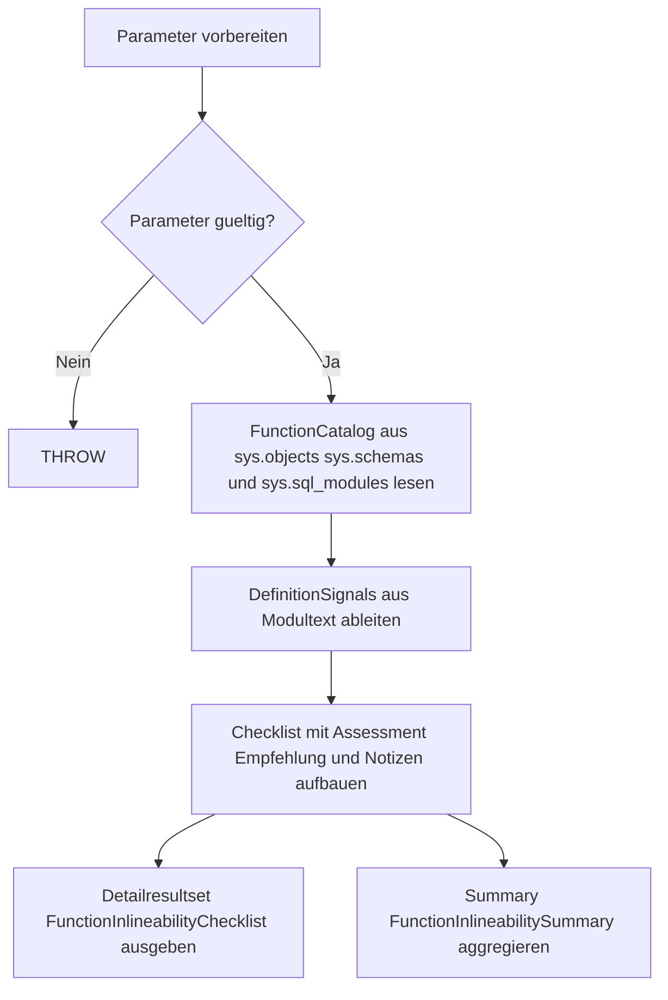

# FunctionInlineabilityChecklist.sql

Diagnose-Skript fuer Kapitel `24_UserDefinedFunctions`, das eine neutrale Checkliste fuer moegliche Inline-Strategien bei Funktionen erzeugt.

## Uebersicht

<!-- SQLDOC:SUMMARY_TABLE:BEGIN -->
| Feld | Wert |
|---|---|
| Script | [FunctionInlineabilityChecklist.sql](FunctionInlineabilityChecklist.sql) |
| Version | `1.0` |
| Typ | `diagnostic-query` |
| Kapitel | `24_UserDefinedFunctions` |
| Sicherheit | `read-only` |
| Zweck | Erstellt eine didaktische Checkliste fuer moegliche Inline-Strategien bei User-Defined Functions, indem Funktionsart, Moduloptionen und Definitions-Heuristiken zu konkreten Review-Hinweisen verdichtet werden. |
<!-- SQLDOC:SUMMARY_TABLE:END -->

## Einordnung

Das Skript ist als didaktische Review-Hilfe gedacht. Es liefert keine harte Engine-Freigabe fuer Inlining, sondern strukturiert typische Refactoring-Signale fuer skalare UDFs, Inline TVFs und mehrstufige TVFs.

## Annahmen

- Die Auswertung bleibt absichtlich versionsfreundlich und nutzt nur breit verfuegbare Metadaten aus `sys.objects`, `sys.schemas` und `sys.sql_modules`.
- Engine-spezifische Felder wie moegliche direkte Inlining-Flags werden nicht vorausgesetzt, damit das Skript auch in konservativeren Trainingsumgebungen lesbar bleibt.
- Textmuster in der Moduldefinition sind Heuristiken fuer Review und keine vollstaendige semantische Analyse des Funktionskoerpers.

## Anwendungsfall

Nutze das Skript, wenn du schnell erkennen moechtest:

- welche skalaren Funktionen strukturell nach schlanken Inlining-Kandidaten aussehen,
- welche mehrstufigen TVFs sich eventuell in eine einzelne `SELECT`-basierte Inline TVF ueberfuehren lassen,
- bei welchen Funktionen Muster wie `EXEC`, `WHILE`, `TRY/CATCH` oder Table-Variable-Insertions eine genauere manuelle Pruefung erfordern.

## Hinweise und Grenzen

- Das Skript arbeitet rein lesend und veraendert keine Funktionsdefinitionen.
- Eine positive Einstufung ersetzt keinen fachlichen und performancebezogenen Test mit realen Consumer-Abfragen.
- Die Erkennung von Schluesselwoertern basiert auf Textmustern und kann absichtlich konservativ oder vereinfachend wirken.

## Parameter

<!-- SQLDOC:PARAMETERS_TABLE:BEGIN -->
| Name | Typ | Richtung | Pflicht | Beschreibung |
|---|---|---|---|---|
| `@SchemaFilter` | `SYSNAME` | `IN` | nein | Optionales Schema zur Eingrenzung der untersuchten Funktionen |
| `@OnlyActionable` | `BIT` | `IN` | nein | `1` = nur Funktionen mit konkreter Inline- oder Refactoring-Empfehlung ausgeben |
| `@DefinitionSnippetLength` | `INT` | `IN` | nein | Maximale Laenge des Definitionsausschnitts im Detailresultset |
<!-- SQLDOC:PARAMETERS_TABLE:END -->

## Abhaengigkeiten

<!-- SQLDOC:DEPENDENCIES_LIST:BEGIN -->
- `sys.objects`
- `sys.schemas`
- `sys.sql_modules`
- `UPPER`
- `LIKE`
- `REPLACE`
<!-- SQLDOC:DEPENDENCIES_LIST:END -->

## Versionshistorie

<!-- SQLDOC:VERSION_HISTORY_TABLE:BEGIN -->
| Version | Datum | Bearbeiter | Beschreibung |
|---|---|---|---|
| `1.0` | `2026-04-22` | `ER` | Erstversion der Diagnose-Checkliste fuer Inline-Strategien bei Funktionen |
<!-- SQLDOC:VERSION_HISTORY_TABLE:END -->

## Ablauf

<!-- SQLDOC:MERMAID:BEGIN -->

<!-- SQLDOC:MERMAID:END -->

## SQL-Code

<!-- SQLDOC:SQL_CODE:BEGIN -->
```sql
/*
BEGIN:SQL-HEADER v1
---
sql_header: v1
script_name: "FunctionInlineabilityChecklist.sql"
script_version: "1.0"
script_type: "diagnostic-query"
chapter: "24_UserDefinedFunctions"

purpose: >
  Erstellt eine didaktische Checkliste fuer moegliche Inline-Strategien
  bei User-Defined Functions, indem Funktionsart, Moduloptionen und
  Definitions-Heuristiken zu konkreten Review-Hinweisen verdichtet werden.

parameters:
  - name: "@SchemaFilter"
    sql_type: "SYSNAME"
    direction: "IN"
    required: false
    description: "Optionales Schema zur Eingrenzung der untersuchten Funktionen"
  - name: "@OnlyActionable"
    sql_type: "BIT"
    direction: "IN"
    required: false
    description: "1 = nur Funktionen mit konkreter Inline- oder Refactoring-Empfehlung ausgeben"
  - name: "@DefinitionSnippetLength"
    sql_type: "INT"
    direction: "IN"
    required: false
    description: "Maximale Laenge des Definitionsausschnitts im Detailresultset"

result_sets:
  - name: "FunctionInlineabilityChecklist"
    description: "Detailansicht je Funktion mit Heuristiken, Checklisten-Signalen und Empfehlung"
  - name: "FunctionInlineabilitySummary"
    description: "Aggregierte Uebersicht nach Empfehlung und Funktionsart"

dependencies:
  - "sys.objects"
  - "sys.schemas"
  - "sys.sql_modules"
  - "UPPER"
  - "LIKE"
  - "REPLACE"

safety:
  level: "read-only"
  writes_data: false

documentation:
  markdown_file: "T-SQL/24_UserDefinedFunctions/SQLScripts/FunctionInlineabilityChecklist.md"
  sync_blocks:
    - "SUMMARY_TABLE"
    - "PARAMETERS_TABLE"
    - "DEPENDENCIES_LIST"
    - "VERSION_HISTORY_TABLE"
    - "SQL_CODE"
  mermaid:
    mode: "ai-agent-from-sql"
    source: "script-body"

main_responsible:
  name: "Erhard Rainer"
  initials: "ER"

version_history:
  - version: "1.0"
    date: "2026-04-22"
    user: "ER"
    description: "Erstversion der Diagnose-Checkliste fuer Inline-Strategien bei Funktionen"

notes:
  - "Die Bewertung ist bewusst heuristisch und soll Review-Gespraeche vorbereiten"
  - "Das Skript bleibt versionsfreundlich und verzichtet auf engine-spezifische Metadatenfelder, die nicht in jeder SQL-Server-Version vorhanden sind"
---
END:SQL-HEADER v1
*/

SET NOCOUNT ON;

DECLARE @SchemaFilter SYSNAME = NULL;
DECLARE @OnlyActionable BIT = 0;
DECLARE @DefinitionSnippetLength INT = 180;

IF @OnlyActionable NOT IN (0, 1)
BEGIN
    THROW 50000, '@OnlyActionable muss 0 oder 1 sein.', 1;
END;

IF @DefinitionSnippetLength IS NULL OR @DefinitionSnippetLength < 40 OR @DefinitionSnippetLength > 4000
BEGIN
    THROW 50001, '@DefinitionSnippetLength muss zwischen 40 und 4000 liegen.', 1;
END;

;WITH FunctionCatalog AS
(
    SELECT
        o.object_id,
        s.name AS schema_name,
        o.name AS function_name,
        o.type AS function_type,
        o.type_desc AS function_type_desc,
        o.create_date,
        o.modify_date,
        sm.definition,
        sm.is_schema_bound,
        sm.null_on_null_input,
        sm.uses_ansi_nulls,
        sm.uses_quoted_identifier,
        sm.execute_as_principal_id
    FROM sys.objects AS o
    INNER JOIN sys.schemas AS s
        ON s.schema_id = o.schema_id
    LEFT JOIN sys.sql_modules AS sm
        ON sm.object_id = o.object_id
    WHERE o.type IN ('FN', 'IF', 'TF', 'FS', 'FT')
      AND (@SchemaFilter IS NULL OR s.name = @SchemaFilter)
),
DefinitionSignals AS
(
    SELECT
        fc.object_id,
        CAST(CASE WHEN fc.definition IS NOT NULL AND UPPER(fc.definition) LIKE '%BEGIN%' THEN 1 ELSE 0 END AS BIT) AS has_begin_block,
        CAST(CASE WHEN fc.definition IS NOT NULL AND UPPER(fc.definition) LIKE '%DECLARE @%' THEN 1 ELSE 0 END AS BIT) AS has_local_variables,
        CAST(CASE WHEN fc.definition IS NOT NULL AND UPPER(fc.definition) LIKE '%TABLE%' THEN 1 ELSE 0 END AS BIT) AS mentions_table_keyword,
        CAST(CASE WHEN fc.definition IS NOT NULL AND UPPER(fc.definition) LIKE '%INSERT INTO @%' THEN 1 ELSE 0 END AS BIT) AS inserts_into_table_variable,
        CAST(CASE WHEN fc.definition IS NOT NULL AND UPPER(fc.definition) LIKE '%UPDATE %' THEN 1 ELSE 0 END AS BIT) AS mentions_update_keyword,
        CAST(CASE WHEN fc.definition IS NOT NULL AND UPPER(fc.definition) LIKE '%DELETE %' THEN 1 ELSE 0 END AS BIT) AS mentions_delete_keyword,
        CAST(CASE WHEN fc.definition IS NOT NULL AND UPPER(fc.definition) LIKE '%MERGE %' THEN 1 ELSE 0 END AS BIT) AS mentions_merge_keyword,
        CAST(CASE WHEN fc.definition IS NOT NULL AND UPPER(fc.definition) LIKE '%WHILE %' THEN 1 ELSE 0 END AS BIT) AS has_while_loop,
        CAST(CASE WHEN fc.definition IS NOT NULL AND UPPER(fc.definition) LIKE '%TRY%' THEN 1 ELSE 0 END AS BIT) AS has_try_keyword,
        CAST(CASE WHEN fc.definition IS NOT NULL AND UPPER(fc.definition) LIKE '%CATCH%' THEN 1 ELSE 0 END AS BIT) AS has_catch_keyword,
        CAST(CASE WHEN fc.definition IS NOT NULL AND UPPER(fc.definition) LIKE '%EXEC %' THEN 1 ELSE 0 END AS BIT) AS has_exec_keyword,
        CAST(CASE WHEN fc.definition IS NOT NULL AND UPPER(fc.definition) LIKE '%RETURN @%' THEN 1 ELSE 0 END AS BIT) AS returns_named_variable,
        CAST(CASE WHEN fc.definition IS NOT NULL AND UPPER(fc.definition) LIKE '%SELECT%' THEN 1 ELSE 0 END AS BIT) AS has_select_statement
    FROM FunctionCatalog AS fc
),
Checklist AS
(
    SELECT
        fc.schema_name,
        fc.function_name,
        fc.function_type,
        fc.function_type_desc,
        fc.is_schema_bound,
        fc.null_on_null_input,
        fc.uses_ansi_nulls,
        fc.uses_quoted_identifier,
        fc.execute_as_principal_id,
        ds.has_begin_block,
        ds.has_local_variables,
        ds.mentions_table_keyword,
        ds.inserts_into_table_variable,
        ds.mentions_update_keyword,
        ds.mentions_delete_keyword,
        ds.mentions_merge_keyword,
        ds.has_while_loop,
        ds.has_try_keyword,
        ds.has_catch_keyword,
        ds.has_exec_keyword,
        ds.returns_named_variable,
        ds.has_select_statement,
        CASE
            WHEN fc.function_type = 'IF' THEN 'already_inline_tvf'
            WHEN fc.function_type = 'TF' AND ds.inserts_into_table_variable = 1 THEN 'refactor_to_inline_tvf'
            WHEN fc.function_type = 'TF' THEN 'review_mstvf_shape'
            WHEN fc.function_type = 'FN'
                 AND ds.has_exec_keyword = 0
                 AND ds.has_while_loop = 0
                 AND ds.has_try_keyword = 0
                 AND ds.has_catch_keyword = 0
                 AND ds.mentions_update_keyword = 0
                 AND ds.mentions_delete_keyword = 0
                 AND ds.mentions_merge_keyword = 0
                 THEN 'candidate_scalar_inline_review'
            WHEN fc.function_type IN ('FS', 'FT') THEN 'clr_or_external_review'
            ELSE 'manual_review_required'
        END AS inlineability_assessment,
        CASE
            WHEN fc.function_type = 'IF'
                THEN 'Inline TVF bereits vorhanden; Fokus auf Lesbarkeit, Praedikate und Consumer-Abfragen.'
            WHEN fc.function_type = 'TF' AND ds.inserts_into_table_variable = 1
                THEN 'Mehrstufige TVF nutzt Table-Variable; pruefe Umstellung auf eine einzelne SELECT-basierte Inline TVF.'
            WHEN fc.function_type = 'TF'
                THEN 'Tabellenwertige Funktion pruefen: falls Rueckgabe aus einer einzigen Abfrage ableitbar ist, als Inline TVF neu formulieren.'
            WHEN fc.function_type = 'FN'
                 AND ds.has_exec_keyword = 0
                 AND ds.has_while_loop = 0
                 AND ds.has_try_keyword = 0
                 AND ds.has_catch_keyword = 0
                 AND ds.mentions_update_keyword = 0
                 AND ds.mentions_delete_keyword = 0
                 AND ds.mentions_merge_keyword = 0
                THEN 'Skalare Funktion wirkt strukturell schlank; pruefe Ausdrucksvereinfachung, deterministische Logik und moegliche Inlining-Eignung.'
            WHEN fc.function_type IN ('FS', 'FT')
                THEN 'CLR- oder externe Funktion separat bewerten; Inline-Strategien liegen eher ausserhalb klassischer T-SQL-Refactorings.'
            ELSE 'Funktion enthaelt Muster, die eine manuelle Detailpruefung fuer Inline-Strategien erfordern.'
        END AS recommended_action,
        CONCAT(
            CASE WHEN fc.function_type = 'IF' THEN 'Bereits als Inline TVF definiert. ' ELSE '' END,
            CASE WHEN fc.function_type = 'TF' THEN 'Mehrstufige TVF-Kandidaten auf Einzel-SELECT pruefen. ' ELSE '' END,
            CASE WHEN ds.has_local_variables = 1 THEN 'Lokale Variablen gefunden. ' ELSE '' END,
            CASE WHEN ds.inserts_into_table_variable = 1 THEN 'Insert in Table-Variable gefunden. ' ELSE '' END,
            CASE WHEN ds.has_begin_block = 1 THEN 'BEGIN-Block vorhanden. ' ELSE '' END,
            CASE WHEN ds.has_while_loop = 1 THEN 'WHILE-Schleife erkannt. ' ELSE '' END,
            CASE WHEN ds.has_try_keyword = 1 OR ds.has_catch_keyword = 1 THEN 'TRY/CATCH-Muster erkannt. ' ELSE '' END,
            CASE WHEN ds.has_exec_keyword = 1 THEN 'EXEC-Muster erkannt. ' ELSE '' END,
            CASE WHEN fc.execute_as_principal_id IS NOT NULL THEN 'EXECUTE AS-Kontext gesetzt. ' ELSE '' END,
            CASE WHEN fc.is_schema_bound = 1 THEN 'SCHEMABINDING aktiv. ' ELSE 'Kein SCHEMABINDING gesetzt. ' END,
            CASE WHEN fc.null_on_null_input = 1 THEN 'RETURNS NULL ON NULL INPUT aktiv. ' ELSE '' END
        ) AS checklist_notes,
        CASE
            WHEN fc.definition IS NOT NULL
                THEN LEFT(REPLACE(REPLACE(fc.definition, CHAR(13), ' '), CHAR(10), ' '), @DefinitionSnippetLength)
            ELSE NULL
        END AS definition_snippet,
        fc.create_date,
        fc.modify_date
    FROM FunctionCatalog AS fc
    INNER JOIN DefinitionSignals AS ds
        ON ds.object_id = fc.object_id
)
SELECT
    c.schema_name AS SchemaName,
    c.function_name AS FunctionName,
    c.function_type AS FunctionType,
    c.function_type_desc AS FunctionTypeDescription,
    c.inlineability_assessment AS InlineabilityAssessment,
    c.recommended_action AS RecommendedAction,
    c.is_schema_bound AS IsSchemaBound,
    c.null_on_null_input AS NullOnNullInput,
    c.uses_ansi_nulls AS UsesAnsiNulls,
    c.uses_quoted_identifier AS UsesQuotedIdentifier,
    CASE WHEN c.execute_as_principal_id IS NULL THEN CAST(0 AS BIT) ELSE CAST(1 AS BIT) END AS HasExecuteAsContext,
    c.has_begin_block AS HasBeginBlock,
    c.has_local_variables AS HasLocalVariables,
    c.mentions_table_keyword AS MentionsTableKeyword,
    c.inserts_into_table_variable AS InsertsIntoTableVariable,
    c.has_while_loop AS HasWhileLoop,
    c.has_try_keyword AS HasTryKeyword,
    c.has_catch_keyword AS HasCatchKeyword,
    c.has_exec_keyword AS HasExecKeyword,
    c.returns_named_variable AS ReturnsNamedVariable,
    c.has_select_statement AS HasSelectStatement,
    NULLIF(c.checklist_notes, '') AS ChecklistNotes,
    c.definition_snippet AS DefinitionSnippet,
    c.create_date AS CreateDate,
    c.modify_date AS ModifyDate
FROM Checklist AS c
WHERE @OnlyActionable = 0
   OR c.inlineability_assessment <> 'already_inline_tvf'
ORDER BY
    CASE c.inlineability_assessment
        WHEN 'candidate_scalar_inline_review' THEN 1
        WHEN 'refactor_to_inline_tvf' THEN 2
        WHEN 'review_mstvf_shape' THEN 3
        WHEN 'manual_review_required' THEN 4
        WHEN 'clr_or_external_review' THEN 5
        ELSE 6
    END,
    c.schema_name,
    c.function_name;

SELECT
    c.inlineability_assessment AS InlineabilityAssessment,
    c.function_type AS FunctionType,
    COUNT(*) AS FunctionCount,
    SUM(CASE WHEN c.is_schema_bound = 1 THEN 1 ELSE 0 END) AS SchemaBoundCount,
    SUM(CASE WHEN c.has_local_variables = 1 THEN 1 ELSE 0 END) AS LocalVariableCount,
    SUM(CASE WHEN c.inserts_into_table_variable = 1 THEN 1 ELSE 0 END) AS TableVariableInsertCount,
    SUM(CASE WHEN c.has_exec_keyword = 1 THEN 1 ELSE 0 END) AS ExecPatternCount,
    SUM(CASE WHEN c.has_while_loop = 1 THEN 1 ELSE 0 END) AS WhileLoopCount,
    SUM(CASE WHEN c.execute_as_principal_id IS NOT NULL THEN 1 ELSE 0 END) AS ExecuteAsCount
FROM Checklist AS c
WHERE @OnlyActionable = 0
   OR c.inlineability_assessment <> 'already_inline_tvf'
GROUP BY
    c.inlineability_assessment,
    c.function_type
ORDER BY
    FunctionCount DESC,
    c.inlineability_assessment,
    c.function_type;
```
<!-- SQLDOC:SQL_CODE:END -->
