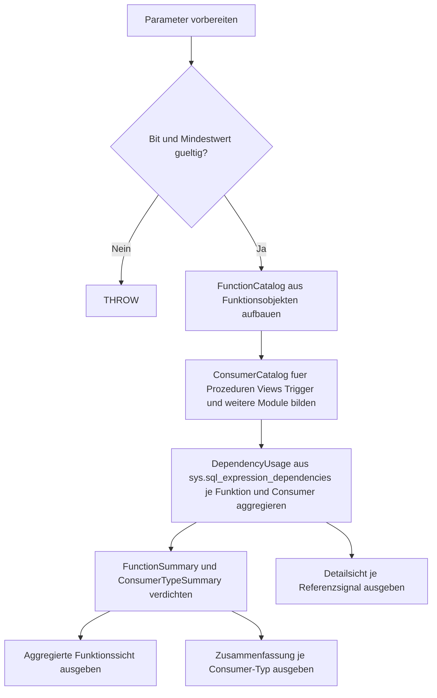

# FunctionInvocationSummary.sql

Diagnose-Skript fuer Kapitel `24_UserDefinedFunctions`, das die Nutzung von Funktionen in persistierten Modulen der aktuellen Datenbank zusammenfasst.

## Uebersicht

<!-- SQLDOC:SUMMARY_TABLE:BEGIN -->
| Feld | Wert |
|---|---|
| Script | [FunctionInvocationSummary.sql](FunctionInvocationSummary.sql) |
| Version | `1.0` |
| Typ | `diagnostic-query` |
| Kapitel | `24_UserDefinedFunctions` |
| Sicherheit | `read-only` |
| Zweck | Fasst die Nutzung von User-Defined Functions in persistierten Modulen ueber Katalog-Dependencies zusammen und zeigt, welche Prozeduren, Views, Trigger oder anderen Funktionen auf sie verweisen. |
<!-- SQLDOC:SUMMARY_TABLE:END -->

## Einordnung

Das Skript ist als lesende Erstversion fuer Unterricht, Review und Inventur gedacht. Es macht sichtbar, welche Funktionen stark wiederverwendet werden und in welchen Modultypen die Referenzen liegen.

## Annahmen

- Die Erstversion wertet persistierte Moduldefinitionen der aktuellen Datenbank ueber `sys.sql_expression_dependencies` aus.
- Ad-hoc-Abfragen ausserhalb gespeicherter Module werden nicht direkt erfasst und muessen bei Bedarf separat ueber Monitoring oder Query Store analysiert werden.
- Die Nutzung wird als Referenzsignal aus Katalog-Dependencies interpretiert; Laufzeitfrequenz oder Performance-Haeufigkeit sind nicht Bestandteil dieses Skripts.

## Anwendungsfall

Nutze das Skript, wenn du schnell erkennen moechtest:

- welche Funktionen von besonders vielen Modulen referenziert werden,
- ob Nutzungen eher in Prozeduren, Views, Triggern oder Funktionsketten auftreten,
- wo caller-dependent oder mehrdeutige Dependency-Signale eine manuelle Nachpruefung sinnvoll machen.

## Hinweise und Grenzen

- Das Skript schreibt keine Daten und aendert keine Objekte.
- Nicht jede fehlende Referenz bedeutet fachliche Unnutzung; manche Funktionen werden nur ad hoc oder dynamisch adressiert.
- Die Detailsicht zeigt Katalog-Referencesignale, keine gemessenen Ausfuehrungszahlen.

## Parameter

<!-- SQLDOC:PARAMETERS_TABLE:BEGIN -->
| Name | Typ | Richtung | Pflicht | Beschreibung |
|---|---|---|---|---|
| `@FunctionSchema` | `SYSNAME` | `IN` | nein | Optionales Schema zur Eingrenzung der untersuchten Funktionen |
| `@ConsumerSchema` | `SYSNAME` | `IN` | nein | Optionales Schema zur Eingrenzung der konsumierenden Module |
| `@IncludeSelfReferences` | `BIT` | `IN` | nein | `1` = auch Selbstreferenzen von Funktionen in die Auswertung aufnehmen |
| `@MinimumInvocationCount` | `INT` | `IN` | nein | Untergrenze fuer die Anzahl gefundener Referenzsignale je Funktion |
<!-- SQLDOC:PARAMETERS_TABLE:END -->

## Abhaengigkeiten

<!-- SQLDOC:DEPENDENCIES_LIST:BEGIN -->
- `sys.objects`
- `sys.schemas`
- `sys.sql_modules`
- `sys.sql_expression_dependencies`
- `STRING_AGG`
- `QUOTENAME`
<!-- SQLDOC:DEPENDENCIES_LIST:END -->

## Versionshistorie

<!-- SQLDOC:VERSION_HISTORY_TABLE:BEGIN -->
| Version | Datum | Bearbeiter | Beschreibung |
|---|---|---|---|
| `1.0` | `2026-04-22` | `ER` | Erstversion des Diagnose-Skripts fuer zusammengefasste Funktionsnutzung |
<!-- SQLDOC:VERSION_HISTORY_TABLE:END -->

## Ablauf

<!-- SQLDOC:MERMAID:BEGIN -->

<!-- SQLDOC:MERMAID:END -->

## SQL-Code

<!-- SQLDOC:SQL_CODE:BEGIN -->
```sql
/*
BEGIN:SQL-HEADER v1
---
sql_header: v1
script_name: "FunctionInvocationSummary.sql"
script_version: "1.0"
script_type: "diagnostic-query"
chapter: "24_UserDefinedFunctions"

purpose: >
  Fasst die Nutzung von User-Defined Functions in persistierten
  Modulen ueber Katalog-Dependencies zusammen und zeigt, welche
  Prozeduren, Views, Trigger oder anderen Funktionen auf sie
  verweisen.

parameters:
  - name: "@FunctionSchema"
    sql_type: "SYSNAME"
    direction: "IN"
    required: false
    description: "Optionales Schema zur Eingrenzung der untersuchten Funktionen"
  - name: "@ConsumerSchema"
    sql_type: "SYSNAME"
    direction: "IN"
    required: false
    description: "Optionales Schema zur Eingrenzung der konsumierenden Module"
  - name: "@IncludeSelfReferences"
    sql_type: "BIT"
    direction: "IN"
    required: false
    description: "1 = auch Selbstreferenzen von Funktionen in die Auswertung aufnehmen"
  - name: "@MinimumInvocationCount"
    sql_type: "INT"
    direction: "IN"
    required: false
    description: "Untergrenze fuer die Anzahl gefundener Referenzsignale je Funktion"

result_sets:
  - name: "FunctionInvocationSummary"
    description: "Aggregierte Sicht pro Funktion mit Anzahl und Typen der konsumierenden Module"
  - name: "FunctionInvocationByConsumerType"
    description: "Zusammenfassung je Funktion und Consumer-Typ"
  - name: "FunctionInvocationDetails"
    description: "Detailansicht jeder gefundenen Funktionsreferenz mit Consumer-Modul"

dependencies:
  - "sys.objects"
  - "sys.schemas"
  - "sys.sql_modules"
  - "sys.sql_expression_dependencies"
  - "STRING_AGG"
  - "QUOTENAME"

safety:
  level: "read-only"
  writes_data: false

documentation:
  markdown_file: "T-SQL/24_UserDefinedFunctions/SQLScripts/FunctionInvocationSummary.md"
  sync_blocks:
    - "SUMMARY_TABLE"
    - "PARAMETERS_TABLE"
    - "DEPENDENCIES_LIST"
    - "VERSION_HISTORY_TABLE"
    - "SQL_CODE"
  mermaid:
    mode: "ai-agent-from-sql"
    source: "script-body"

main_responsible:
  name: "Erhard Rainer"
  initials: "ER"

version_history:
  - version: "1.0"
    date: "2026-04-22"
    user: "ER"
    description: "Erstversion des Diagnose-Skripts fuer zusammengefasste Funktionsnutzung"

notes:
  - "Die Erstversion wertet persistierte Moduldefinitionen und Katalog-Dependencies der aktuellen Datenbank aus."
  - "Ad-hoc-Abfragen ausserhalb gespeicherter Module werden nicht direkt erfasst."
---
END:SQL-HEADER v1
*/

SET NOCOUNT ON;

DECLARE @FunctionSchema SYSNAME = NULL;
DECLARE @ConsumerSchema SYSNAME = NULL;
DECLARE @IncludeSelfReferences BIT = 0;
DECLARE @MinimumInvocationCount INT = 0;

IF @IncludeSelfReferences NOT IN (0, 1)
BEGIN
    THROW 50000, '@IncludeSelfReferences muss 0 oder 1 sein.', 1;
END;

IF @MinimumInvocationCount IS NULL OR @MinimumInvocationCount < 0
BEGIN
    THROW 50001, '@MinimumInvocationCount muss groesser oder gleich 0 sein.', 1;
END;

;WITH FunctionCatalog AS
(
    SELECT
        o.object_id AS function_id,
        s.name AS function_schema_name,
        o.name AS function_name,
        o.type AS function_type,
        o.type_desc AS function_type_desc,
        o.create_date AS function_created_at,
        o.modify_date AS function_modified_at,
        sm.is_schema_bound
    FROM sys.objects AS o
    INNER JOIN sys.schemas AS s
        ON s.schema_id = o.schema_id
    LEFT JOIN sys.sql_modules AS sm
        ON sm.object_id = o.object_id
    WHERE o.type IN ('FN', 'IF', 'TF', 'FS', 'FT')
      AND (@FunctionSchema IS NULL OR s.name = @FunctionSchema)
),
ConsumerCatalog AS
(
    SELECT
        o.object_id AS consumer_id,
        s.name AS consumer_schema_name,
        o.name AS consumer_name,
        o.type AS consumer_type,
        o.type_desc AS consumer_type_desc,
        o.modify_date AS consumer_modified_at
    FROM sys.objects AS o
    INNER JOIN sys.schemas AS s
        ON s.schema_id = o.schema_id
    WHERE o.type IN ('P', 'V', 'TR', 'FN', 'IF', 'TF', 'AF', 'PC')
      AND (@ConsumerSchema IS NULL OR s.name = @ConsumerSchema)
),
DependencyUsage AS
(
    SELECT
        fc.function_id,
        cc.consumer_id,
        fc.function_schema_name,
        fc.function_name,
        fc.function_type,
        fc.function_type_desc,
        fc.function_created_at,
        fc.function_modified_at,
        fc.is_schema_bound,
        cc.consumer_schema_name,
        cc.consumer_name,
        cc.consumer_type,
        cc.consumer_type_desc,
        cc.consumer_modified_at,
        COUNT(*) AS invocation_signals,
        SUM(CASE WHEN sed.is_caller_dependent = 1 THEN 1 ELSE 0 END) AS caller_dependent_refs,
        SUM(CASE WHEN sed.is_ambiguous = 1 THEN 1 ELSE 0 END) AS ambiguous_refs
    FROM FunctionCatalog AS fc
    INNER JOIN sys.sql_expression_dependencies AS sed
        ON sed.referenced_id = fc.function_id
    INNER JOIN ConsumerCatalog AS cc
        ON cc.consumer_id = sed.referencing_id
    WHERE @IncludeSelfReferences = 1
       OR fc.function_id <> cc.consumer_id
    GROUP BY
        fc.function_id,
        cc.consumer_id,
        fc.function_schema_name,
        fc.function_name,
        fc.function_type,
        fc.function_type_desc,
        fc.function_created_at,
        fc.function_modified_at,
        fc.is_schema_bound,
        cc.consumer_schema_name,
        cc.consumer_name,
        cc.consumer_type,
        cc.consumer_type_desc,
        cc.consumer_modified_at
),
FunctionSummary AS
(
    SELECT
        fc.function_id,
        fc.function_schema_name,
        fc.function_name,
        fc.function_type,
        fc.function_type_desc,
        fc.function_created_at,
        fc.function_modified_at,
        fc.is_schema_bound,
        COUNT(du.consumer_id) AS consumer_count,
        COALESCE(SUM(du.invocation_signals), 0) AS invocation_signal_count,
        COALESCE(SUM(CASE WHEN du.consumer_type IN ('P', 'PC') THEN 1 ELSE 0 END), 0) AS procedure_consumers,
        COALESCE(SUM(CASE WHEN du.consumer_type = 'V' THEN 1 ELSE 0 END), 0) AS view_consumers,
        COALESCE(SUM(CASE WHEN du.consumer_type = 'TR' THEN 1 ELSE 0 END), 0) AS trigger_consumers,
        COALESCE(SUM(CASE WHEN du.consumer_type IN ('FN', 'IF', 'TF', 'FS', 'FT') THEN 1 ELSE 0 END), 0) AS function_consumers,
        COALESCE(SUM(CASE WHEN du.consumer_type NOT IN ('P', 'PC', 'V', 'TR', 'FN', 'IF', 'TF', 'FS', 'FT') THEN 1 ELSE 0 END), 0) AS other_consumers,
        COALESCE(SUM(du.caller_dependent_refs), 0) AS caller_dependent_refs,
        COALESCE(SUM(du.ambiguous_refs), 0) AS ambiguous_refs,
        MAX(du.consumer_modified_at) AS latest_consumer_change
    FROM FunctionCatalog AS fc
    LEFT JOIN DependencyUsage AS du
        ON du.function_id = fc.function_id
    GROUP BY
        fc.function_id,
        fc.function_schema_name,
        fc.function_name,
        fc.function_type,
        fc.function_type_desc,
        fc.function_created_at,
        fc.function_modified_at,
        fc.is_schema_bound
),
TopConsumers AS
(
    SELECT
        du.function_id,
        STRING_AGG(
            QUOTENAME(du.consumer_schema_name) + N'.' + QUOTENAME(du.consumer_name),
            N', '
        ) WITHIN GROUP
        (
            ORDER BY du.invocation_signals DESC,
                     du.consumer_schema_name,
                     du.consumer_name
        ) AS consumer_list
    FROM DependencyUsage AS du
    GROUP BY
        du.function_id
),
ConsumerTypeSummary AS
(
    SELECT
        du.function_id,
        du.function_schema_name,
        du.function_name,
        du.consumer_type_desc,
        COUNT(*) AS consumer_count,
        SUM(du.invocation_signals) AS invocation_signal_count,
        MAX(du.consumer_modified_at) AS latest_consumer_change
    FROM DependencyUsage AS du
    GROUP BY
        du.function_id,
        du.function_schema_name,
        du.function_name,
        du.consumer_type_desc
)
SELECT
    fs.function_schema_name,
    fs.function_name,
    fs.function_type,
    fs.function_type_desc,
    fs.is_schema_bound,
    fs.consumer_count,
    fs.invocation_signal_count,
    fs.procedure_consumers,
    fs.view_consumers,
    fs.trigger_consumers,
    fs.function_consumers,
    fs.other_consumers,
    fs.caller_dependent_refs,
    fs.ambiguous_refs,
    fs.function_created_at,
    fs.function_modified_at,
    fs.latest_consumer_change,
    tc.consumer_list AS sampled_consumers,
    CASE
        WHEN fs.procedure_consumers > 0 AND fs.view_consumers > 0 THEN 'mixed_runtime_and_projection'
        WHEN fs.function_consumers >= fs.consumer_count THEN 'primarily_function_chains'
        WHEN fs.view_consumers > 0 THEN 'projection_heavy'
        ELSE 'module_invocations'
    END AS usage_profile
FROM FunctionSummary AS fs
LEFT JOIN TopConsumers AS tc
    ON tc.function_id = fs.function_id
WHERE fs.invocation_signal_count >= @MinimumInvocationCount
ORDER BY
    fs.invocation_signal_count DESC,
    fs.consumer_count DESC,
    fs.function_schema_name,
    fs.function_name;

SELECT
    cts.function_schema_name,
    cts.function_name,
    cts.consumer_type_desc,
    cts.consumer_count,
    cts.invocation_signal_count,
    cts.latest_consumer_change
FROM ConsumerTypeSummary AS cts
WHERE cts.invocation_signal_count >= @MinimumInvocationCount
ORDER BY
    cts.function_schema_name,
    cts.function_name,
    cts.invocation_signal_count DESC,
    cts.consumer_type_desc;

SELECT
    du.function_schema_name,
    du.function_name,
    du.function_type_desc,
    du.consumer_schema_name,
    du.consumer_name,
    du.consumer_type_desc,
    du.invocation_signals,
    du.caller_dependent_refs,
    du.ambiguous_refs,
    du.consumer_modified_at,
    CASE
        WHEN du.consumer_type IN ('P', 'PC') THEN 'procedure_call_context'
        WHEN du.consumer_type = 'V' THEN 'view_projection_context'
        WHEN du.consumer_type = 'TR' THEN 'trigger_side_effect_context'
        WHEN du.consumer_type IN ('FN', 'IF', 'TF', 'FS', 'FT') THEN 'function_chain_context'
        ELSE 'other_module_context'
    END AS invocation_context
FROM DependencyUsage AS du
ORDER BY
    du.function_schema_name,
    du.function_name,
    du.invocation_signals DESC,
    du.consumer_schema_name,
    du.consumer_name;
```
<!-- SQLDOC:SQL_CODE:END -->
