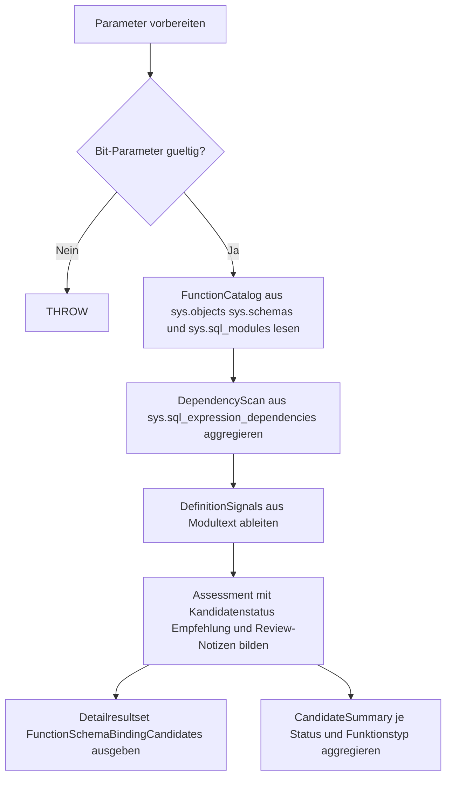

# FunctionSchemaBindingCandidates.sql

Diagnose-Skript fuer Kapitel `24_UserDefinedFunctions`, das konservative Kandidaten fuer `SCHEMABINDING` sichtbar macht und typische Gegenargumente fuer ein manuelles Review strukturiert.

## Uebersicht

<!-- SQLDOC:SUMMARY_TABLE:BEGIN -->
| Feld | Wert |
|---|---|
| Script | [FunctionSchemaBindingCandidates.sql](FunctionSchemaBindingCandidates.sql) |
| Version | `1.0` |
| Typ | `diagnostic-query` |
| Kapitel | `24_UserDefinedFunctions` |
| Sicherheit | `read-only` |
| Zweck | Bewertet User-Defined Functions anhand von Metadaten, Abhaengigkeiten und Definitions-Heuristiken darauf, ob sie sich als konservative SCHEMABINDING-Kandidaten fuer ein Review eignen koennten. |
<!-- SQLDOC:SUMMARY_TABLE:END -->

## Einordnung

Das Skript soll keine automatische Freigabe fuer `SCHEMABINDING` erzeugen. Es priorisiert vielmehr Funktionen, bei denen Katalogmetadaten, aufloesbare lokale Abhaengigkeiten und unkritische Definitionsmuster fuer ein vertieftes Review sprechen.

## Annahmen

- Die Analyse bleibt bewusst lesend und verwendet nur Metadaten aus `sys.objects`, `sys.schemas`, `sys.sql_modules` und `sys.sql_expression_dependencies`.
- `SCHEMABINDING` wird hier didaktisch als konservatives Review-Ziel modelliert; fachliche Nebenbedingungen der konkreten Funktion muessen weiterhin manuell geprueft werden.
- Textmuster wie `SELECT *`, `EXEC`, `GETDATE()` oder `tempdb` sind Heuristiken und koennen Kommentare oder Sonderfaelle nicht vollstaendig semantisch aufloesen.

## Anwendungsfall

Nutze das Skript, wenn du schnell erkennen moechtest:

- welche Funktionen bereits stabile Signale fuer ein `SCHEMABINDING`-Review zeigen,
- wo datenbankuebergreifende, caller-abhaengige oder nicht aufgeloeste Referenzen gegen einen direkten Einsatz sprechen,
- welche Definitionen zuerst auf Wildcards, nicht deterministische Built-ins oder dynamische Ausfuehrung bereinigt werden sollten.

## Hinweise und Grenzen

- Das Skript veraendert keine Funktionen und setzt kein `SCHEMABINDING`.
- Eine positive Einstufung ersetzt keine fachliche Pruefung von Return-Typ, Referenzobjekten und Consumer-Abfragen.
- `sys.sql_expression_dependencies` bildet nur aufloesbare Abhaengigkeiten ab; bei uneindeutigen Namen bleibt deshalb ein manueller Review-Schritt sinnvoll.

## Parameter

<!-- SQLDOC:PARAMETERS_TABLE:BEGIN -->
| Name | Typ | Richtung | Pflicht | Beschreibung |
|---|---|---|---|---|
| `@SchemaFilter` | `SYSNAME` | `IN` | nein | Optionales Schema zur Eingrenzung der analysierten Funktionen |
| `@OnlyRecommended` | `BIT` | `IN` | nein | `1` = nur starke Kandidaten oder Review-Kandidaten ausgeben |
| `@IncludeDefinitionSnippet` | `BIT` | `IN` | nein | `1` = gekuerzten Definitionsausschnitt im Detailresultset anzeigen |
<!-- SQLDOC:PARAMETERS_TABLE:END -->

## Abhaengigkeiten

<!-- SQLDOC:DEPENDENCIES_LIST:BEGIN -->
- `sys.objects`
- `sys.schemas`
- `sys.sql_modules`
- `sys.sql_expression_dependencies`
- `OBJECTPROPERTYEX`
- `UPPER`
- `LIKE`
<!-- SQLDOC:DEPENDENCIES_LIST:END -->

## Versionshistorie

<!-- SQLDOC:VERSION_HISTORY_TABLE:BEGIN -->
| Version | Datum | Bearbeiter | Beschreibung |
|---|---|---|---|
| `1.0` | `2026-04-22` | `ER` | Erstversion des Diagnose-Skripts fuer SCHEMABINDING-Kandidaten bei Funktionen |
<!-- SQLDOC:VERSION_HISTORY_TABLE:END -->

## Ablauf

<!-- SQLDOC:MERMAID:BEGIN -->

<!-- SQLDOC:MERMAID:END -->

## SQL-Code

<!-- SQLDOC:SQL_CODE:BEGIN -->
```sql
/*
BEGIN:SQL-HEADER v1
---
sql_header: v1
script_name: "FunctionSchemaBindingCandidates.sql"
script_version: "1.0"
script_type: "diagnostic-query"
chapter: "24_UserDefinedFunctions"

purpose: >
  Bewertet User-Defined Functions anhand von Metadaten, Abhaengigkeiten
  und Definitions-Heuristiken darauf, ob sie sich als konservative
  SCHEMABINDING-Kandidaten fuer ein Review eignen koennten.

parameters:
  - name: "@SchemaFilter"
    sql_type: "SYSNAME"
    direction: "IN"
    required: false
    description: "Optionales Schema zur Eingrenzung der analysierten Funktionen"
  - name: "@OnlyRecommended"
    sql_type: "BIT"
    direction: "IN"
    required: false
    description: "1 = nur starke Kandidaten oder Review-Kandidaten ausgeben"
  - name: "@IncludeDefinitionSnippet"
    sql_type: "BIT"
    direction: "IN"
    required: false
    description: "1 = gekuerzten Definitionsausschnitt im Detailresultset anzeigen"

result_sets:
  - name: "FunctionSchemaBindingCandidates"
    description: "Detailansicht pro Funktion mit Bewertung, Gegenargumenten und Review-Hinweisen"
  - name: "CandidateSummary"
    description: "Aggregierte Anzahl je Bewertungsstatus und Funktionsart"

dependencies:
  - "sys.objects"
  - "sys.schemas"
  - "sys.sql_modules"
  - "sys.sql_expression_dependencies"
  - "OBJECTPROPERTYEX"
  - "UPPER"
  - "LIKE"

safety:
  level: "read-only"
  writes_data: false

documentation:
  markdown_file: "T-SQL/24_UserDefinedFunctions/SQLScripts/FunctionSchemaBindingCandidates.md"
  sync_blocks:
    - "SUMMARY_TABLE"
    - "PARAMETERS_TABLE"
    - "DEPENDENCIES_LIST"
    - "VERSION_HISTORY_TABLE"
    - "SQL_CODE"
  mermaid:
    mode: "ai-agent-from-sql"
    source: "script-body"

main_responsible:
  name: "Erhard Rainer"
  initials: "ER"

version_history:
  - version: "1.0"
    date: "2026-04-22"
    user: "ER"
    description: "Erstversion des Diagnose-Skripts fuer SCHEMABINDING-Kandidaten bei Funktionen"

notes:
  - "Die Bewertung ist konservativ und soll Review-Kandidaten priorisieren, nicht automatisch freigeben"
  - "Abhaengigkeiten aus sys.sql_expression_dependencies und Textmuster aus sys.sql_modules.definition werden kombiniert"
---
END:SQL-HEADER v1
*/

SET NOCOUNT ON;

DECLARE @SchemaFilter SYSNAME = NULL;
DECLARE @OnlyRecommended BIT = 0;
DECLARE @IncludeDefinitionSnippet BIT = 1;

IF @OnlyRecommended NOT IN (0, 1)
BEGIN
    THROW 50000, '@OnlyRecommended muss 0 oder 1 sein.', 1;
END;

IF @IncludeDefinitionSnippet NOT IN (0, 1)
BEGIN
    THROW 50001, '@IncludeDefinitionSnippet muss 0 oder 1 sein.', 1;
END;

;WITH FunctionCatalog AS
(
    SELECT
        o.object_id,
        s.name AS schema_name,
        o.name AS function_name,
        o.type AS function_type,
        o.type_desc AS function_type_desc,
        o.create_date,
        o.modify_date,
        sm.definition,
        sm.is_schema_bound,
        sm.uses_ansi_nulls,
        sm.uses_quoted_identifier,
        CAST(OBJECTPROPERTYEX(o.object_id, 'IsDeterministic') AS BIT) AS is_deterministic,
        CAST(OBJECTPROPERTYEX(o.object_id, 'IsPrecise') AS BIT) AS is_precise
    FROM sys.objects AS o
    INNER JOIN sys.schemas AS s
        ON s.schema_id = o.schema_id
    LEFT JOIN sys.sql_modules AS sm
        ON sm.object_id = o.object_id
    WHERE o.type IN ('FN', 'IF', 'TF', 'FS', 'FT')
      AND (@SchemaFilter IS NULL OR s.name = @SchemaFilter)
),
DependencyScan AS
(
    SELECT
        fc.object_id,
        COUNT(sed.referenced_id) AS dependency_count,
        CAST(MAX(CASE WHEN sed.referenced_server_name IS NOT NULL THEN 1 ELSE 0 END) AS BIT) AS has_cross_server_reference,
        CAST(MAX(CASE WHEN sed.referenced_database_name IS NOT NULL THEN 1 ELSE 0 END) AS BIT) AS has_cross_database_reference,
        CAST(MAX(CASE WHEN sed.is_caller_dependent = 1 THEN 1 ELSE 0 END) AS BIT) AS has_caller_dependent_reference,
        CAST(MAX(CASE WHEN sed.referenced_id IS NULL
                           AND sed.referenced_entity_name IS NOT NULL
                           AND sed.referenced_server_name IS NULL
                           AND sed.referenced_database_name IS NULL
                      THEN 1 ELSE 0 END) AS BIT) AS has_unresolved_local_reference,
        CAST(MAX(CASE WHEN sed.referenced_class_desc = 'OBJECT_OR_COLUMN' THEN 1 ELSE 0 END) AS BIT) AS has_object_reference
    FROM FunctionCatalog AS fc
    LEFT JOIN sys.sql_expression_dependencies AS sed
        ON sed.referencing_id = fc.object_id
    GROUP BY
        fc.object_id
),
DefinitionSignals AS
(
    SELECT
        fc.object_id,
        CASE
            WHEN fc.definition IS NULL THEN NULL
            ELSE UPPER(fc.definition)
        END AS definition_upper,
        CAST(CASE WHEN fc.definition IS NOT NULL AND UPPER(fc.definition) LIKE '%SELECT *%' THEN 1 ELSE 0 END AS BIT) AS uses_select_star,
        CAST(CASE WHEN fc.definition IS NOT NULL AND (UPPER(fc.definition) LIKE '%GETDATE(%'
                                                      OR UPPER(fc.definition) LIKE '%SYSDATETIME(%'
                                                      OR UPPER(fc.definition) LIKE '%SYSUTCDATETIME(%'
                                                      OR UPPER(fc.definition) LIKE '%CURRENT_TIMESTAMP%'
                                                      OR UPPER(fc.definition) LIKE '%NEWID(%'
                                                      OR UPPER(fc.definition) LIKE '%RAND(%')
                  THEN 1 ELSE 0 END AS BIT) AS uses_nondeterministic_function,
        CAST(CASE WHEN fc.definition IS NOT NULL AND (UPPER(fc.definition) LIKE '%OPENQUERY(%'
                                                      OR UPPER(fc.definition) LIKE '%OPENROWSET(%'
                                                      OR UPPER(fc.definition) LIKE '%OPENDATASOURCE(%')
                  THEN 1 ELSE 0 END AS BIT) AS uses_external_access,
        CAST(CASE WHEN fc.definition IS NOT NULL AND (UPPER(fc.definition) LIKE '%EXEC %'
                                                      OR UPPER(fc.definition) LIKE '%SP_EXECUTESQL%')
                  THEN 1 ELSE 0 END AS BIT) AS uses_dynamic_execution,
        CAST(CASE WHEN fc.definition IS NOT NULL AND (UPPER(fc.definition) LIKE '%#%'
                                                      OR UPPER(fc.definition) LIKE '%TEMPDB%')
                  THEN 1 ELSE 0 END AS BIT) AS mentions_temp_objects
    FROM FunctionCatalog AS fc
),
Assessment AS
(
    SELECT
        fc.schema_name,
        fc.function_name,
        fc.function_type,
        fc.function_type_desc,
        fc.is_schema_bound,
        fc.uses_ansi_nulls,
        fc.uses_quoted_identifier,
        fc.is_deterministic,
        fc.is_precise,
        dsn.dependency_count,
        dsn.has_cross_server_reference,
        dsn.has_cross_database_reference,
        dsn.has_caller_dependent_reference,
        dsn.has_unresolved_local_reference,
        dsn.has_object_reference,
        def.uses_select_star,
        def.uses_nondeterministic_function,
        def.uses_external_access,
        def.uses_dynamic_execution,
        def.mentions_temp_objects,
        CASE
            WHEN fc.is_schema_bound = 1 THEN 'already_schema_bound'
            WHEN fc.function_type IN ('FS', 'FT') THEN 'manual_review_required'
            WHEN dsn.has_cross_server_reference = 1
              OR dsn.has_cross_database_reference = 1
              OR def.uses_external_access = 1
              OR def.uses_dynamic_execution = 1
              OR def.mentions_temp_objects = 1
                THEN 'unlikely_candidate'
            WHEN dsn.has_caller_dependent_reference = 1
              OR dsn.has_unresolved_local_reference = 1
              OR def.uses_select_star = 1
              OR def.uses_nondeterministic_function = 1
                THEN 'needs_manual_review'
            WHEN fc.uses_ansi_nulls = 1
              AND fc.uses_quoted_identifier = 1
              AND dsn.has_object_reference = 1
              AND dsn.has_cross_server_reference = 0
              AND dsn.has_cross_database_reference = 0
              AND dsn.has_caller_dependent_reference = 0
              AND dsn.has_unresolved_local_reference = 0
              AND def.uses_select_star = 0
              AND def.uses_nondeterministic_function = 0
              AND def.uses_external_access = 0
              AND def.uses_dynamic_execution = 0
              AND def.mentions_temp_objects = 0
                THEN 'strong_candidate'
            ELSE 'needs_manual_review'
        END AS schema_binding_assessment,
        CASE
            WHEN fc.is_schema_bound = 1
                THEN 'Bereits schema-gebunden; pruefe eher Folgeeffekte fuer Consumer und Index-Strategien.'
            WHEN fc.function_type IN ('FS', 'FT')
                THEN 'CLR- oder externe Funktion separat pruefen; Schema Binding haengt hier von Implementierungsdetails ausserhalb des T-SQL-Moduls ab.'
            WHEN dsn.has_cross_server_reference = 1 OR dsn.has_cross_database_reference = 1
                THEN 'Referenzen ueber Datenbank- oder Servergrenzen zuerst beseitigen oder separat kapseln.'
            WHEN def.uses_external_access = 1 OR def.uses_dynamic_execution = 1 OR def.mentions_temp_objects = 1
                THEN 'Definition auf externe Zugriffe, dynamische Ausfuehrung oder tempdb-Muster ueberarbeiten, bevor Schema Binding sinnvoll ist.'
            WHEN dsn.has_caller_dependent_reference = 1 OR dsn.has_unresolved_local_reference = 1
                THEN 'Aufloesbare lokale Referenzen und eindeutige Objektbezeichner herstellen.'
            WHEN def.uses_select_star = 1
                THEN 'Wildcard-Projektionen zuerst in explizite Spaltenlisten umstellen.'
            WHEN def.uses_nondeterministic_function = 1
                THEN 'Nicht deterministische Funktionen fuer eine belastbare Schema-Binding-Bewertung entfernen oder isolieren.'
            WHEN fc.uses_ansi_nulls = 1 AND fc.uses_quoted_identifier = 1
                THEN 'Wirkt als konservativer Review-Kandidat fuer SCHEMABINDING; Moduloptionen und Abhaengigkeiten sehen stabil aus.'
            ELSE 'Moduloptionen und Objektbezug manuell nachpruefen, bevor SCHEMABINDING gesetzt wird.'
        END AS recommendation,
        LTRIM(RTRIM(CONCAT(
            CASE WHEN fc.uses_ansi_nulls = 1 THEN 'ANSI_NULLS aktiv. ' ELSE 'ANSI_NULLS nicht aktiv. ' END,
            CASE WHEN fc.uses_quoted_identifier = 1 THEN 'QUOTED_IDENTIFIER aktiv. ' ELSE 'QUOTED_IDENTIFIER nicht aktiv. ' END,
            CASE WHEN dsn.has_object_reference = 1 THEN 'Objektreferenz erkannt. ' ELSE 'Keine aufloesbare Objektreferenz erkannt. ' END,
            CASE WHEN dsn.has_cross_server_reference = 1 THEN 'Cross-Server-Referenz erkannt. ' ELSE '' END,
            CASE WHEN dsn.has_cross_database_reference = 1 THEN 'Cross-Database-Referenz erkannt. ' ELSE '' END,
            CASE WHEN dsn.has_caller_dependent_reference = 1 THEN 'Caller-dependent Referenz erkannt. ' ELSE '' END,
            CASE WHEN dsn.has_unresolved_local_reference = 1 THEN 'Nicht aufgeloeste lokale Referenz erkannt. ' ELSE '' END,
            CASE WHEN def.uses_select_star = 1 THEN 'SELECT * erkannt. ' ELSE '' END,
            CASE WHEN def.uses_nondeterministic_function = 1 THEN 'Nicht deterministische Built-ins erkannt. ' ELSE '' END,
            CASE WHEN def.uses_external_access = 1 THEN 'Externe Datenzugriffe erkannt. ' ELSE '' END,
            CASE WHEN def.uses_dynamic_execution = 1 THEN 'Dynamische Ausfuehrung erkannt. ' ELSE '' END,
            CASE WHEN def.mentions_temp_objects = 1 THEN 'Tempdb- oder Temp-Objekte erkannt. ' ELSE '' END,
            CASE WHEN fc.is_deterministic = 1 THEN 'Metadaten melden deterministisch. ' ELSE '' END,
            CASE WHEN fc.is_precise = 1 THEN 'Metadaten melden praezise. ' ELSE '' END
        ))) AS review_notes,
        CASE
            WHEN @IncludeDefinitionSnippet = 1 AND fc.definition IS NOT NULL
                THEN LEFT(REPLACE(REPLACE(fc.definition, CHAR(13), ' '), CHAR(10), ' '), 220)
            ELSE NULL
        END AS definition_snippet,
        fc.create_date,
        fc.modify_date
    FROM FunctionCatalog AS fc
    INNER JOIN DependencyScan AS dsn
        ON dsn.object_id = fc.object_id
    INNER JOIN DefinitionSignals AS def
        ON def.object_id = fc.object_id
)
SELECT
    a.schema_name,
    a.function_name,
    a.function_type,
    a.function_type_desc,
    a.schema_binding_assessment,
    a.recommendation,
    a.is_schema_bound,
    a.uses_ansi_nulls,
    a.uses_quoted_identifier,
    a.is_deterministic,
    a.is_precise,
    a.dependency_count,
    a.has_object_reference,
    a.has_cross_server_reference,
    a.has_cross_database_reference,
    a.has_caller_dependent_reference,
    a.has_unresolved_local_reference,
    a.uses_select_star,
    a.uses_nondeterministic_function,
    a.uses_external_access,
    a.uses_dynamic_execution,
    a.mentions_temp_objects,
    a.review_notes,
    a.definition_snippet,
    a.create_date,
    a.modify_date
FROM Assessment AS a
WHERE @OnlyRecommended = 0
   OR a.schema_binding_assessment IN ('strong_candidate', 'needs_manual_review')
ORDER BY
    CASE a.schema_binding_assessment
        WHEN 'strong_candidate' THEN 1
        WHEN 'needs_manual_review' THEN 2
        WHEN 'already_schema_bound' THEN 3
        ELSE 4
    END,
    a.schema_name,
    a.function_name;

SELECT
    a.schema_binding_assessment,
    a.function_type,
    COUNT(*) AS function_count
FROM Assessment AS a
WHERE @OnlyRecommended = 0
   OR a.schema_binding_assessment IN ('strong_candidate', 'needs_manual_review')
GROUP BY
    a.schema_binding_assessment,
    a.function_type
ORDER BY
    CASE a.schema_binding_assessment
        WHEN 'strong_candidate' THEN 1
        WHEN 'needs_manual_review' THEN 2
        WHEN 'already_schema_bound' THEN 3
        ELSE 4
    END,
    a.function_type;
```
<!-- SQLDOC:SQL_CODE:END -->
