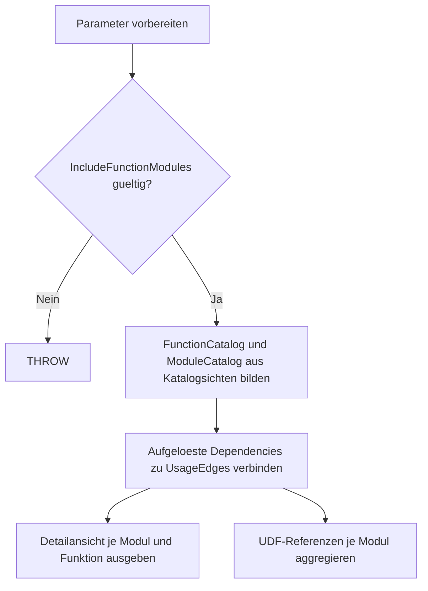

# FunctionUsageByModule.sql

Dieses lesende Diagnose-Skript ordnet aufgeloeste UDF-Referenzen den persistierten
Modulen zu, die sie verwenden. Es eignet sich fuer Reviews, Refactorings und die
Suche nach Auswirkungen einer Funktionsaenderung.

## Uebersicht

<!-- SQLDOC:SUMMARY_TABLE:BEGIN -->
| Feld | Wert |
|---|---|
| Script | [FunctionUsageByModule.sql](FunctionUsageByModule.sql) |
| Version | `1.0` |
| Typ | `diagnostic-query` |
| Kapitel | `24_UserDefinedFunctions` |
| Sicherheit | `read-only` |
| Zweck | Zeigt die Nutzung von UDFs durch persistierte SQL-Module. |
<!-- SQLDOC:SUMMARY_TABLE:END -->

## Einordnung

Die Auswertung basiert auf Katalog-Dependencies der aktuell verbundenen
Datenbank. Sie trennt die Detailansicht einzelner Referenzen von einer
Zusammenfassung je konsumierendem Modul.

## Annahmen

- Nur aufgeloeste Referenzen aus `sys.sql_expression_dependencies` werden als
  gesicherte UDF-Nutzung ausgegeben.
- Dynamisches SQL und Ad-hoc-Abfragen ausserhalb persistierter Module koennen
  nicht vollstaendig erfasst werden.
- Das Skript aendert weder Objekte noch Daten.

## Anwendungsfall

Nutze die Detailansicht, um die Konsumenten einer bestimmten UDF zu finden.
Nutze die Zusammenfassung, um Module mit vielen Funktionsreferenzen fuer einen
Review oder ein Refactoring zu priorisieren.

## Parameter

<!-- SQLDOC:PARAMETERS_TABLE:BEGIN -->
| Name | Typ | Richtung | Pflicht | Beschreibung |
|---|---|---|---|---|
| `@ModuleSchema` | `SYSNAME` | `IN` | nein | Optionales Schema fuer konsumierende Module |
| `@ModuleNamePattern` | `NVARCHAR(128)` | `IN` | nein | Optionales LIKE-Muster fuer Modulnamen |
| `@IncludeFunctionModules` | `BIT` | `IN` | nein | `1` schliesst Funktionen als konsumierende Module ein |
<!-- SQLDOC:PARAMETERS_TABLE:END -->

## Abhaengigkeiten

<!-- SQLDOC:DEPENDENCIES_LIST:BEGIN -->
- `sys.objects`
- `sys.schemas`
- `sys.sql_expression_dependencies`
- `STRING_AGG`
<!-- SQLDOC:DEPENDENCIES_LIST:END -->

## Versionshistorie

<!-- SQLDOC:VERSION_HISTORY_TABLE:BEGIN -->
| Version | Datum | Bearbeiter | Beschreibung |
|---|---|---|---|
| `1.0` | `2026-08-19` | `ER` | Erstversion der Modul-Funktionsnutzungsanalyse |
<!-- SQLDOC:VERSION_HISTORY_TABLE:END -->

## Ablauf

<!-- SQLDOC:MERMAID:BEGIN -->

<!-- SQLDOC:MERMAID:END -->

## SQL-Code

<!-- SQLDOC:SQL_CODE:BEGIN -->
```sql
/*
BEGIN:SQL-HEADER v1
---
sql_header: v1
script_name: "FunctionUsageByModule.sql"
script_version: "1.0"
script_type: "diagnostic-query"
chapter: "24_UserDefinedFunctions"

purpose: >
  Zeigt, welche User-Defined Functions von welchen persistierten SQL-Modulen
  referenziert werden, und fasst die Nutzung je konsumierendem Modul zusammen.

parameters:
  - name: "@ModuleSchema"
    sql_type: "SYSNAME"
    direction: "IN"
    required: false
    description: "Optionales Schema fuer konsumierende Module"
  - name: "@ModuleNamePattern"
    sql_type: "NVARCHAR(128)"
    direction: "IN"
    required: false
    description: "Optionales LIKE-Muster fuer Modulnamen"
  - name: "@IncludeFunctionModules"
    sql_type: "BIT"
    direction: "IN"
    required: false
    description: "1 = auch Funktionen als konsumierende Module einbeziehen"

result_sets:
  - name: "FunctionUsageByModule"
    description: "Detailansicht jeder aufgeloesten Funktionsreferenz je Modul"
  - name: "ModuleFunctionUsageSummary"
    description: "Zusammenfassung der verwendeten Funktionen je Modul"

dependencies:
  - "sys.objects"
  - "sys.schemas"
  - "sys.sql_expression_dependencies"
  - "STRING_AGG"

safety:
  level: "read-only"
  writes_data: false

documentation:
  markdown_file: "T-SQL/24_UserDefinedFunctions/SQLScripts/FunctionUsageByModule.md"
  sync_blocks:
    - "SUMMARY_TABLE"
    - "PARAMETERS_TABLE"
    - "DEPENDENCIES_LIST"
    - "VERSION_HISTORY_TABLE"
    - "SQL_CODE"
  mermaid:
    mode: "ai-agent-from-sql"
    source: "script-body"

main_responsible:
  name: "Erhard Rainer"
  initials: "ER"

version_history:
  - version: "1.0"
    date: "2026-08-19"
    user: "ER"
    description: "Erstversion der Modul-Funktionsnutzungsanalyse"
---
END:SQL-HEADER v1
*/

SET NOCOUNT ON;

DECLARE @ModuleSchema SYSNAME = NULL;
DECLARE @ModuleNamePattern NVARCHAR(128) = NULL;
DECLARE @IncludeFunctionModules BIT = 1;

IF @IncludeFunctionModules NOT IN (0, 1)
BEGIN
    THROW 50000, '@IncludeFunctionModules muss 0 oder 1 sein.', 1;
END;

;WITH FunctionCatalog AS
(
    SELECT o.object_id, s.name AS function_schema_name, o.name AS function_name,
           o.type_desc AS function_type_desc
    FROM sys.objects AS o
    INNER JOIN sys.schemas AS s ON s.schema_id = o.schema_id
    WHERE o.type IN ('FN', 'IF', 'TF', 'FS', 'FT')
),
ModuleCatalog AS
(
    SELECT o.object_id, s.name AS module_schema_name, o.name AS module_name,
           o.type, o.type_desc AS module_type_desc, o.modify_date
    FROM sys.objects AS o
    INNER JOIN sys.schemas AS s ON s.schema_id = o.schema_id
    WHERE o.type IN ('P', 'PC', 'V', 'TR', 'FN', 'IF', 'TF')
      AND (@IncludeFunctionModules = 1 OR o.type NOT IN ('FN', 'IF', 'TF'))
      AND (@ModuleSchema IS NULL OR s.name = @ModuleSchema)
      AND (@ModuleNamePattern IS NULL OR o.name LIKE @ModuleNamePattern)
),
UsageEdges AS
(
    SELECT mc.module_schema_name, mc.module_name, mc.module_type_desc,
           mc.modify_date AS module_modified_at,
           fc.function_schema_name, fc.function_name, fc.function_type_desc,
           sed.is_ambiguous, sed.is_caller_dependent, sed.is_schema_bound_reference
    FROM sys.sql_expression_dependencies AS sed
    INNER JOIN ModuleCatalog AS mc ON mc.object_id = sed.referencing_id
    INNER JOIN FunctionCatalog AS fc ON fc.object_id = sed.referenced_id
    WHERE mc.object_id <> fc.object_id
)
SELECT module_schema_name AS ModuleSchema, module_name AS ModuleName,
       module_type_desc AS ModuleType, function_schema_name AS FunctionSchema,
       function_name AS FunctionName, function_type_desc AS FunctionType,
       is_schema_bound_reference AS IsSchemaBoundReference,
       is_caller_dependent AS IsCallerDependent,
       is_ambiguous AS IsAmbiguousReference, module_modified_at AS ModuleModifiedAt
FROM UsageEdges
ORDER BY module_schema_name, module_name, function_schema_name, function_name;

SELECT module_schema_name AS ModuleSchema, module_name AS ModuleName,
       module_type_desc AS ModuleType, COUNT(*) AS FunctionReferenceCount,
       COUNT(DISTINCT CONCAT(function_schema_name, '.', function_name)) AS DistinctFunctionCount,
       STRING_AGG(CONCAT(QUOTENAME(function_schema_name), '.', QUOTENAME(function_name)), ', ')
           WITHIN GROUP (ORDER BY function_schema_name, function_name) AS ReferencedFunctions,
       MAX(module_modified_at) AS ModuleModifiedAt
FROM UsageEdges
GROUP BY module_schema_name, module_name, module_type_desc
ORDER BY FunctionReferenceCount DESC, module_schema_name, module_name;
```
<!-- SQLDOC:SQL_CODE:END -->
