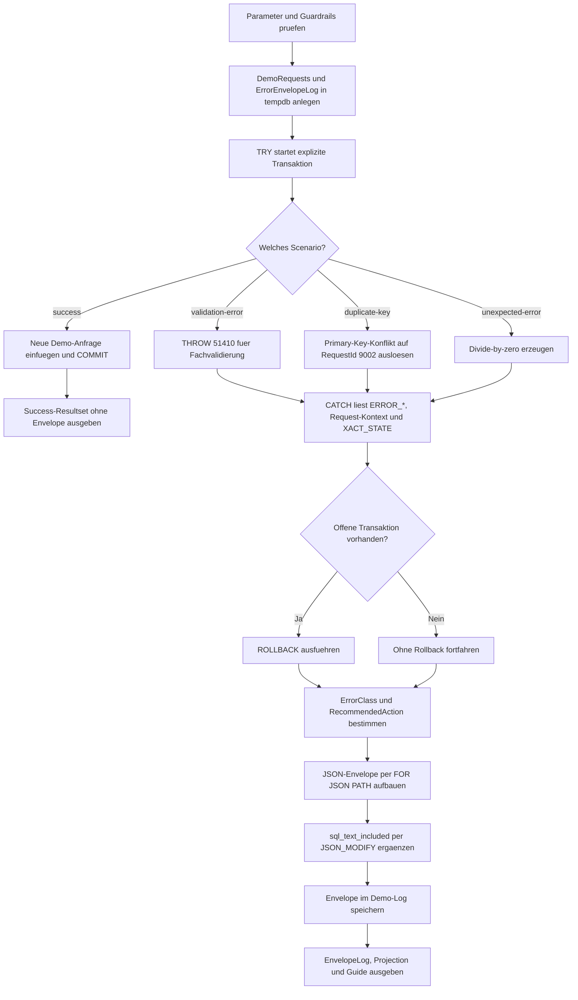

# ErrorContextEnvelopePattern.sql

Dieses Skript zeigt ein einheitliches Pattern, mit dem Fehlerkontext aus `TRY...CATCH` in ein JSON-Envelope ueberfuehrt wird. Die Demo verbindet Request-Metadaten, `ERROR_*()`-Felder, Transaktionsstatus und eine audience-spezifische Folgeaktion in einem strukturierten Protokollformat.

## Uebersicht

<!-- SQLDOC:SUMMARY_TABLE:BEGIN -->
| Feld | Wert |
|---|---|
| Script | [ErrorContextEnvelopePattern.sql](ErrorContextEnvelopePattern.sql) |
| Version | `1.0` |
| Typ | `template` |
| Kapitel | `25_ErrorHandling_TryCatch` |
| Sicherheit | `read-only-tempdb` |
| Zweck | Packt Fehlerkontext aus `TRY...CATCH` in ein einheitliches JSON-Envelope-Format. |
<!-- SQLDOC:SUMMARY_TABLE:END -->

## Einordnung

Das Pattern trennt drei Ebenen sauber voneinander: die fachliche Request-Sicht, die technische Fehlerdiagnose und die empfohlene Folgeaktion fuer die jeweilige Zielgruppe. Dadurch koennen Logs, Incident-Analysen und Caller-Antworten denselben Kernkontext nutzen, ohne jedes Mal neue freie Textstrukturen zu erfinden.

## Annahmen

- Das Skript ist eine didaktische Erstversion mit ausschliesslich temporaeren Objekten in `tempdb`.
- Der Envelope wird als JSON-Struktur aufgebaut, weil dieses Format in Logging-, Queue- und API-Strecken haeufig als kleinster gemeinsamer Nenner funktioniert.
- `support`, `operator` und `caller` stehen fuer typische Empfaengergruppen mit leicht unterschiedlicher Folgeaktion.
- Der enthaltene SQL-Text ist ein bewusst vereinfachter Demo-Ausschnitt und keine vollstaendige Statement-Aufzeichnung.

## Anwendungsfall

Das Skript eignet sich fuer Service-Templates, Fehlerlogs und Schulungen zu `TRY...CATCH`. Es zeigt, wie sich ein einmalig definiertes Envelope-Schema fuer Constraint-Fehler, fachliche Validierungen und unerwartete Laufzeitfehler wiederverwenden laesst.

## Parameter

<!-- SQLDOC:PARAMETERS_TABLE:BEGIN -->
| Parameter | SQL-Typ | Pflicht | Beschreibung |
|---|---|---|---|
| `@Scenario` | `VARCHAR(30)` | Nein | Steuert `success`, `validation-error`, `duplicate-key` oder `unexpected-error`. |
| `@IncludeSqlText` | `BIT` | Nein | Fuegt bei `1` einen Demo-SQL-Ausschnitt in den Envelope ein. |
| `@EnvelopeAudience` | `VARCHAR(20)` | Nein | Waehlt `support`, `operator` oder `caller` fuer die Folgeaktion. |
<!-- SQLDOC:PARAMETERS_TABLE:END -->

## Abhaengigkeiten

<!-- SQLDOC:DEPENDENCIES_LIST:BEGIN -->
- `tempdb` fuer temporaere Demo-Requests und Envelope-Logs
- `TRY...CATCH`
- `THROW`
- `ERROR_*()`-Funktionen
- `JSON_MODIFY` und `JSON_VALUE`
- `FOR JSON PATH`
- explizite Transaktionen und ein Primary-Key-Konflikt als Technikpfad
<!-- SQLDOC:DEPENDENCIES_LIST:END -->

## Hinweise

- Im Erfolgsfall wird bewusst kein Fehler-Envelope erzeugt, damit der Unterschied zwischen Normalpfad und Catch-Pfad sichtbar bleibt.
- `ErrorEnvelopeLog` zeigt den kompletten JSON-Envelope unveraendert als technische Hauptsicht.
- `EnvelopeProjection` extrahiert zentrale JSON-Felder wieder in relationale Spalten, damit Reporting und Alerting nicht direkt auf Roh-JSON angewiesen sind.
- `EnvelopeGuide` komprimiert das Pattern auf vier didaktische Schritte von der Kontextaufnahme bis zur audience-spezifischen Folgeaktion.

## Versionshistorie

<!-- SQLDOC:VERSION_HISTORY_TABLE:BEGIN -->
| Version | Datum | User | Beschreibung |
|---|---|---|---|
| `1.0` | `2026-04-17` | `ER` | Erstversion fuer ein einheitliches Error-Context-Envelope-Pattern |
<!-- SQLDOC:VERSION_HISTORY_TABLE:END -->

## Ablauf

<!-- SQLDOC:MERMAID:BEGIN -->

<!-- SQLDOC:MERMAID:END -->

## SQL-Code

<!-- SQLDOC:SQL_CODE:BEGIN -->
```sql
/*
BEGIN:SQL-HEADER v1
---
sql_header: v1
script_name: "ErrorContextEnvelopePattern.sql"
script_version: "1.0"
script_type: "template"
chapter: "25_ErrorHandling_TryCatch"

purpose: >
  Zeigt ein ausfuehrbares Pattern, das Fehlerkontext aus TRY...CATCH
  in ein einheitliches JSON-Envelope-Format ueberfuehrt und dadurch
  Logging, Analyse und Weitergabe an nachgelagerte Strecken stabilisiert.

parameters:
  - name: "@Scenario"
    sql_type: "VARCHAR(30)"
    direction: "IN"
    required: false
    description: "Steuert success, validation-error, duplicate-key oder unexpected-error"
  - name: "@IncludeSqlText"
    sql_type: "BIT"
    direction: "IN"
    required: false
    description: "1 fuegt Demo-SQL-Text in den Envelope ein, 0 laesst das Feld leer"
  - name: "@EnvelopeAudience"
    sql_type: "VARCHAR(20)"
    direction: "IN"
    required: false
    description: "Waehlt support, operator oder caller fuer unterschiedliche Folgeaktionen"

result_sets:
  - name: "ErrorEnvelopeLog"
    description: "Zeigt den aufgebauten Fehler-Envelope inklusive JSON und klassifizierter Folgeaktion"
  - name: "EnvelopeProjection"
    description: "Projiziert wichtige JSON-Felder fuer Reporting und Review auf relationale Spalten"
  - name: "EnvelopeGuide"
    description: "Verdichtet das Pattern zu Source, Catch, Envelope und Audience-spezifischer Aktion"

dependencies:
  - "tempdb temporary tables"
  - "TRY...CATCH"
  - "THROW"
  - "ERROR_* functions"
  - "JSON_MODIFY"
  - "JSON_VALUE"
  - "FOR JSON PATH"
  - "explicit transactions"
  - "primary key constraint"

safety:
  level: "read-only-tempdb"
  writes_data: false

documentation:
  markdown_file: "T-SQL/25_ErrorHandling_TryCatch/SQLScripts/ErrorContextEnvelopePattern.md"
  sync_blocks:
    - "SUMMARY_TABLE"
    - "PARAMETERS_TABLE"
    - "DEPENDENCIES_LIST"
    - "VERSION_HISTORY_TABLE"
    - "SQL_CODE"
  mermaid:
    mode: "ai-agent-from-sql"
    source: "script-body"

main_responsible:
  name: "Erhard Rainer"
  initials: "ER"

version_history:
  - version: "1.0"
    date: "2026-04-17"
    user: "ER"
    description: "Erstversion fuer ein einheitliches Error-Context-Envelope-Pattern"

notes:
  - "Das Skript arbeitet ausschliesslich mit tempdb-Objekten und Demo-Requests."
  - "Der Envelope ist als didaktisches JSON-Muster fuer Logging und Weitergabe gedacht."
---
END:SQL-HEADER v1
*/

SET NOCOUNT ON;
SET XACT_ABORT ON;

DECLARE @Scenario VARCHAR(30) = 'duplicate-key';
DECLARE @IncludeSqlText BIT = 1;
DECLARE @EnvelopeAudience VARCHAR(20) = 'support';

IF @Scenario NOT IN ('success', 'validation-error', 'duplicate-key', 'unexpected-error')
BEGIN
    THROW 51400, '@Scenario muss success, validation-error, duplicate-key oder unexpected-error sein.', 1;
END;

IF @IncludeSqlText NOT IN (0, 1)
BEGIN
    THROW 51401, '@IncludeSqlText muss 0 oder 1 sein.', 1;
END;

IF @EnvelopeAudience NOT IN ('support', 'operator', 'caller')
BEGIN
    THROW 51402, '@EnvelopeAudience muss support, operator oder caller sein.', 1;
END;

DROP TABLE IF EXISTS #DemoRequests;
DROP TABLE IF EXISTS #ErrorEnvelopeLog;

CREATE TABLE #DemoRequests
(
    RequestId INT NOT NULL PRIMARY KEY,
    WorkflowName VARCHAR(60) NOT NULL,
    CorrelationId UNIQUEIDENTIFIER NOT NULL,
    RequestedBy SYSNAME NOT NULL,
    TargetEntity VARCHAR(60) NOT NULL,
    PayloadLabel VARCHAR(80) NOT NULL
);

CREATE TABLE #ErrorEnvelopeLog
(
    EnvelopeId INT IDENTITY(1,1) NOT NULL PRIMARY KEY,
    ScenarioName VARCHAR(30) NOT NULL,
    EnvelopeAudience VARCHAR(20) NOT NULL,
    ErrorClass VARCHAR(30) NOT NULL,
    RecommendedAction NVARCHAR(220) NOT NULL,
    EnvelopeJson NVARCHAR(MAX) NOT NULL,
    LoggedAt DATETIME2(0) NOT NULL
);

INSERT INTO #DemoRequests
(
    RequestId,
    WorkflowName,
    CorrelationId,
    RequestedBy,
    TargetEntity,
    PayloadLabel
)
VALUES
    (9001, 'invoice-close', '2C4D5A82-0A78-4E47-8A3A-AF61F1D4A111', 'trainer.demo', 'Invoice', 'invoice-7743'),
    (9002, 'order-import', '7D3A9C42-1B22-4B54-AF11-11A8E1C55422', 'trainer.demo', 'Order', 'order-1003.csv');

BEGIN TRY
    BEGIN TRANSACTION;

    IF @Scenario = 'validation-error'
    BEGIN
        THROW 51410, 'Die Demo-Nutzlast verletzt eine fachliche Vorbedingung.', 1;
    END;

    IF @Scenario = 'duplicate-key'
    BEGIN
        INSERT INTO #DemoRequests
        (
            RequestId,
            WorkflowName,
            CorrelationId,
            RequestedBy,
            TargetEntity,
            PayloadLabel
        )
        VALUES
        (
            9002,
            'order-import',
            '7D3A9C42-1B22-4B54-AF11-11A8E1C55422',
            'trainer.demo',
            'Order',
            'order-1003.csv'
        );
    END
    ELSE IF @Scenario = 'unexpected-error'
    BEGIN
        DECLARE @DivisionByZero INT = 1 / 0;
        SELECT @DivisionByZero AS DivisionByZero;
    END
    ELSE
    BEGIN
        INSERT INTO #DemoRequests
        (
            RequestId,
            WorkflowName,
            CorrelationId,
            RequestedBy,
            TargetEntity,
            PayloadLabel
        )
        VALUES
        (
            9003,
            'invoice-close',
            NEWID(),
            'trainer.demo',
            'Invoice',
            'invoice-8840'
        );
    END;

    COMMIT TRANSACTION;

    SELECT
        CAST('success-path' AS VARCHAR(20)) AS EnvelopeState,
        @Scenario AS ScenarioName,
        COUNT(*) AS VisibleRequestCount,
        CAST('Kein Envelope erzeugt, weil der TRY-Block erfolgreich abgeschlossen wurde.' AS NVARCHAR(120)) AS TeachingNote
    FROM #DemoRequests;
END TRY
BEGIN CATCH
    DECLARE
        @ErrorNumber INT = ERROR_NUMBER(),
        @ErrorSeverity INT = ERROR_SEVERITY(),
        @ErrorState INT = ERROR_STATE(),
        @ErrorLine INT = ERROR_LINE(),
        @ErrorProcedure SYSNAME = ERROR_PROCEDURE(),
        @ErrorMessage NVARCHAR(4000) = ERROR_MESSAGE(),
        @XactStateAtCatch INT = XACT_STATE(),
        @TranCountAtCatch INT = @@TRANCOUNT,
        @RequestId INT,
        @WorkflowName VARCHAR(60),
        @CorrelationId UNIQUEIDENTIFIER,
        @RequestedBy SYSNAME,
        @TargetEntity VARCHAR(60),
        @PayloadLabel VARCHAR(80),
        @ErrorClass VARCHAR(30),
        @RecommendedAction NVARCHAR(220),
        @SqlText NVARCHAR(4000),
        @EnvelopeJson NVARCHAR(MAX);

    SELECT TOP (1)
        @RequestId = dr.RequestId,
        @WorkflowName = dr.WorkflowName,
        @CorrelationId = dr.CorrelationId,
        @RequestedBy = dr.RequestedBy,
        @TargetEntity = dr.TargetEntity,
        @PayloadLabel = dr.PayloadLabel
    FROM #DemoRequests AS dr
    ORDER BY dr.RequestId DESC;

    SET @ErrorClass =
        CASE
            WHEN @ErrorNumber BETWEEN 51410 AND 51499 THEN 'business-validation'
            WHEN @ErrorNumber IN (2601, 2627) THEN 'constraint'
            ELSE 'unexpected'
        END;

    SET @RecommendedAction =
        CASE
            WHEN @EnvelopeAudience = 'caller' THEN N'Fachlich sichere Meldung aus dem Envelope ableiten und technische Details intern behalten.'
            WHEN @ErrorClass = 'constraint' THEN N'Envelope an Support oder Entwicklung geben und Korrektur des Schluessels oder der Idempotenz pruefen.'
            WHEN @ErrorClass = 'business-validation' THEN N'Envelope fuer Review speichern und fachliche Vorbedingung mit dem Caller klaeren.'
            ELSE N'Envelope an Betrieb oder Incident-Analyse weiterreichen und technische Ursache untersuchen.'
        END;

    SET @SqlText =
        CASE
            WHEN @IncludeSqlText = 1 AND @Scenario = 'validation-error' THEN N'THROW 51410, ''Die Demo-Nutzlast verletzt eine fachliche Vorbedingung.'', 1;'
            WHEN @IncludeSqlText = 1 AND @Scenario = 'duplicate-key' THEN N'INSERT INTO #DemoRequests (RequestId, ...) VALUES (9002, ...);'
            WHEN @IncludeSqlText = 1 AND @Scenario = 'unexpected-error' THEN N'DECLARE @DivisionByZero INT = 1 / 0;'
            ELSE NULL
        END;

    IF @XactStateAtCatch <> 0
    BEGIN
        ROLLBACK TRANSACTION;
    END;

    SELECT
        @EnvelopeJson =
        (
            SELECT
                'sql-error-envelope.v1' AS envelope_type,
                CONVERT(VARCHAR(33), SYSDATETIMEOFFSET(), 127) AS captured_at,
                @Scenario AS scenario_name,
                @EnvelopeAudience AS audience,
                @RecommendedAction AS recommended_action,
                JSON_QUERY(
                (
                    SELECT
                        @RequestId AS request_id,
                        @WorkflowName AS workflow_name,
                        CAST(@CorrelationId AS CHAR(36)) AS correlation_id,
                        @RequestedBy AS requested_by,
                        @TargetEntity AS target_entity,
                        @PayloadLabel AS payload_label
                    FOR JSON PATH, WITHOUT_ARRAY_WRAPPER
                )) AS request_context,
                JSON_QUERY(
                (
                    SELECT
                        @ErrorClass AS error_class,
                        @ErrorNumber AS error_number,
                        @ErrorSeverity AS error_severity,
                        @ErrorState AS error_state,
                        @ErrorLine AS error_line,
                        @ErrorProcedure AS error_procedure,
                        @ErrorMessage AS error_message
                    FOR JSON PATH, WITHOUT_ARRAY_WRAPPER
                )) AS error_context,
                JSON_QUERY(
                (
                    SELECT
                        @XactStateAtCatch AS xact_state_at_catch,
                        @TranCountAtCatch AS tran_count_at_catch,
                        IIF(@XactStateAtCatch <> 0, 'rollback-issued', 'no-open-transaction') AS transaction_resolution
                    FOR JSON PATH, WITHOUT_ARRAY_WRAPPER
                )) AS transaction_context,
                JSON_QUERY(
                (
                    SELECT
                        HOST_NAME() AS host_name,
                        APP_NAME() AS app_name,
                        DB_NAME() AS database_name,
                        ORIGINAL_LOGIN() AS original_login,
                        @SqlText AS sql_text
                    FOR JSON PATH, WITHOUT_ARRAY_WRAPPER
                )) AS diagnostic_context
            FOR JSON PATH, WITHOUT_ARRAY_WRAPPER
        );

    SET @EnvelopeJson = JSON_MODIFY(@EnvelopeJson, '$.diagnostic_context.sql_text_included', IIF(@IncludeSqlText = 1, 'true', 'false'));

    INSERT INTO #ErrorEnvelopeLog
    (
        ScenarioName,
        EnvelopeAudience,
        ErrorClass,
        RecommendedAction,
        EnvelopeJson,
        LoggedAt
    )
    VALUES
    (
        @Scenario,
        @EnvelopeAudience,
        @ErrorClass,
        @RecommendedAction,
        @EnvelopeJson,
        SYSDATETIME()
    );

    SELECT
        eel.EnvelopeId,
        eel.ScenarioName,
        eel.EnvelopeAudience,
        eel.ErrorClass,
        eel.RecommendedAction,
        eel.EnvelopeJson,
        eel.LoggedAt
    FROM #ErrorEnvelopeLog AS eel;

    SELECT
        eel.EnvelopeId,
        JSON_VALUE(eel.EnvelopeJson, '$.request_context.workflow_name') AS WorkflowName,
        JSON_VALUE(eel.EnvelopeJson, '$.request_context.correlation_id') AS CorrelationId,
        JSON_VALUE(eel.EnvelopeJson, '$.error_context.error_number') AS ErrorNumber,
        JSON_VALUE(eel.EnvelopeJson, '$.error_context.error_class') AS ErrorClass,
        JSON_VALUE(eel.EnvelopeJson, '$.transaction_context.transaction_resolution') AS TransactionResolution,
        JSON_VALUE(eel.EnvelopeJson, '$.diagnostic_context.sql_text_included') AS SqlTextIncluded,
        JSON_VALUE(eel.EnvelopeJson, '$.recommended_action') AS RecommendedAction
    FROM #ErrorEnvelopeLog AS eel;

    SELECT
        CAST('1. Request-Kontext aus der Demo-Anfrage sichern' AS NVARCHAR(90)) AS PatternStep,
        CAST('2. ERROR_* und Transaktionszustand im CATCH lesen' AS NVARCHAR(90)) AS CatchSource,
        CAST('3. Einheitliches JSON-Envelope fuer Logging und Weitergabe formen' AS NVARCHAR(90)) AS EnvelopeConstruction,
        CAST(@RecommendedAction AS NVARCHAR(220)) AS AudienceAction;
END CATCH;
```
<!-- SQLDOC:SQL_CODE:END -->
