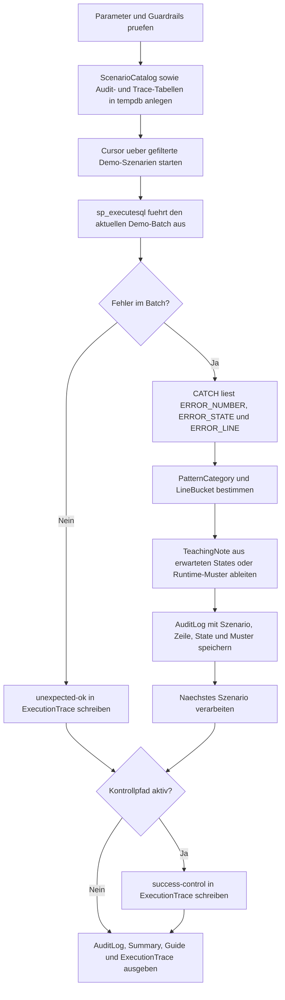

# ErrorLineAndStateAudit.sql

Dieses Skript fuehrt mehrere kontrollierte Fehlerszenarien aus und sammelt dabei `ERROR_LINE()`, `ERROR_STATE()` sowie wiederkehrende Fehlermuster in einem Audit-Log. Dadurch laesst sich ueben, wie Teams Zeilenbezug, State und Fehlerklasse gemeinsam fuer Diagnose und Review nutzen.

## Uebersicht

<!-- SQLDOC:SUMMARY_TABLE:BEGIN -->
| Feld | Wert |
|---|---|
| Script | [ErrorLineAndStateAudit.sql](ErrorLineAndStateAudit.sql) |
| Version | `1.0` |
| Typ | `diagnostic-query` |
| Kapitel | `25_ErrorHandling_TryCatch` |
| Sicherheit | `read-only-tempdb` |
| Zweck | Auditiert Fehlerzeilen, States und wiederkehrende Fehlermuster ueber mehrere Demo-Szenarien. |
<!-- SQLDOC:SUMMARY_TABLE:END -->

## Einordnung

Der Fokus liegt auf der Beobachtung, nicht auf einem einzelnen Recovery-Pattern. Das Skript zeigt, dass `ERROR_STATE()` fuer bewusst gesetzte Demo-Fehler ein nuetzlicher Zusatzschluessel sein kann, waehrend `ERROR_LINE()` den technischen Einstiegspunkt im Batch liefert. Zusammen mit einer kleinen Musterklassifikation entsteht daraus ein kompaktes Audit fuer Schulung, Incident-Review und Troubleshooting-Gespraeche.

## Annahmen

- Das Skript ist eine didaktische Erstversion mit kontrollierten Demo-Batches statt produktiver Fehlerlogs.
- Die Fehlerzeilen werden aus dynamisch ausgefuehrten Mini-Batches gemessen und sind deshalb als reproduzierbare Schulungswerte zu verstehen.
- `RAISERROR` ist bewusst enthalten, obwohl `THROW` fuer neue Entwicklungen meist vorzuziehen ist, damit der Vergleich im Audit sichtbar wird.
- Der Erfolgs-Kontrollpfad landet absichtlich nicht im eigentlichen Audit-Log, damit Catch-Eintraege sauber von normalen Ausfuehrungen getrennt bleiben.

## Anwendungsfall

Das Skript eignet sich fuer Lernsequenzen zu `TRY...CATCH`, fuers gemeinsame Lesen von Fehlerprotokollen und als Vorlage fuer spaetere Audits gegen echte Fehlerlog-Tabellen. Besonders nuetzlich ist es, wenn Teams diskutieren wollen, ob ein Fehler eher ueber Fehlernummer, State, Zeile oder ueber ein fachliches Muster gruppiert werden sollte.

## Parameter

<!-- SQLDOC:PARAMETERS_TABLE:BEGIN -->
| Parameter | SQL-Typ | Pflicht | Beschreibung |
|---|---|---|---|
| `@ScenarioFilter` | `VARCHAR(30)` | Nein | Filtert auf `all`, `throw`, `raiserror`, `divide-by-zero` oder `conversion`. |
| `@IncludeSuccessfulControl` | `BIT` | Nein | Fuegt bei `1` einen Erfolgs-Kontrollpfad in die Ausfuehrungsspur ein. |
| `@LineBucketSize` | `INT` | Nein | Legt die Groesse der Zeilen-Buckets fuer die Audit-Zusammenfassung fest. |
<!-- SQLDOC:PARAMETERS_TABLE:END -->

## Abhaengigkeiten

<!-- SQLDOC:DEPENDENCIES_LIST:BEGIN -->
- `tempdb` fuer temporaere Audit-Tabellen
- `TRY...CATCH`
- `THROW`
- `RAISERROR`
- `ERROR_LINE()` und `ERROR_STATE()`
- dynamisches SQL ueber `sys.sp_executesql`
<!-- SQLDOC:DEPENDENCIES_LIST:END -->

## Hinweise

- `AuditLog` zeigt pro Fehlerszenario die gemessene Fehlerzeile, den State und eine kleine Musterklassifikation.
- `StateAndLineSummary` gruppiert die Eintraege nach State, Linien-Bucket und PatternCategory, damit wiederkehrende Cluster sichtbar werden.
- `AuditGuide` verdichtet den Ablauf in vier Leseschritte fuer Reviews oder Unterricht.
- `ExecutionTrace` enthaelt zusaetzlich den Erfolgs-Kontrollpfad und hilft dabei, Catch-Eintraege von normalen Ausfuehrungen abzugrenzen.

## Versionshistorie

<!-- SQLDOC:VERSION_HISTORY_TABLE:BEGIN -->
| Version | Datum | User | Beschreibung |
|---|---|---|---|
| `1.0` | `2026-04-17` | `ER` | Erstversion fuer ein Audit von Fehlerzeilen, States und Fehlermustern |
<!-- SQLDOC:VERSION_HISTORY_TABLE:END -->

## Ablauf

<!-- SQLDOC:MERMAID:BEGIN -->

<!-- SQLDOC:MERMAID:END -->

## SQL-Code

<!-- SQLDOC:SQL_CODE:BEGIN -->
```sql
/*
BEGIN:SQL-HEADER v1
---
sql_header: v1
script_name: "ErrorLineAndStateAudit.sql"
script_version: "1.0"
script_type: "diagnostic-query"
chapter: "25_ErrorHandling_TryCatch"

purpose: >
  Fuehrt mehrere Demo-Fehlerszenarien kontrolliert aus und auditiert dabei
  ERROR_LINE(), ERROR_STATE(), Fehlerklassen und wiederkehrende Muster fuer
  anschliessende Review- und Troubleshooting-Gespraeche.

parameters:
  - name: "@ScenarioFilter"
    sql_type: "VARCHAR(30)"
    direction: "IN"
    required: false
    description: "Filtert auf all, throw, raiserror, divide-by-zero oder conversion"
  - name: "@IncludeSuccessfulControl"
    sql_type: "BIT"
    direction: "IN"
    required: false
    description: "1 fuegt einen kontrollierten Erfolgsfall ohne Catch-Eintrag hinzu"
  - name: "@LineBucketSize"
    sql_type: "INT"
    direction: "IN"
    required: false
    description: "Groesse der Zeilen-Buckets fuer die Audit-Zusammenfassung"

result_sets:
  - name: "AuditLog"
    description: "Zeigt pro ausgefuehrtem Fehlerszenario die geloggte Fehlerzeile, den State und das Muster"
  - name: "StateAndLineSummary"
    description: "Verdichtet die Fehlerhaeufigkeit nach State, Linien-Bucket und Musterklasse"
  - name: "AuditGuide"
    description: "Erklaert, wie sich State, Fehlerzeile und Muster im Troubleshooting nutzen lassen"

dependencies:
  - "tempdb temporary tables"
  - "TRY...CATCH"
  - "THROW"
  - "RAISERROR"
  - "ERROR_LINE"
  - "ERROR_STATE"
  - "dynamic SQL via sp_executesql"

safety:
  level: "read-only-tempdb"
  writes_data: false

documentation:
  markdown_file: "T-SQL/25_ErrorHandling_TryCatch/SQLScripts/ErrorLineAndStateAudit.md"
  sync_blocks:
    - "SUMMARY_TABLE"
    - "PARAMETERS_TABLE"
    - "DEPENDENCIES_LIST"
    - "VERSION_HISTORY_TABLE"
    - "SQL_CODE"
  mermaid:
    mode: "ai-agent-from-sql"
    source: "script-body"

main_responsible:
  name: "Erhard Rainer"
  initials: "ER"

version_history:
  - version: "1.0"
    date: "2026-04-17"
    user: "ER"
    description: "Erstversion fuer ein Audit von Fehlerzeilen, States und Fehlermustern"

notes:
  - "Das Skript verwendet ausschliesslich tempdb-Objekte und Demo-Batches."
  - "Die Fehlerzeilen stammen aus den kontrollierten Demo-Batches und eignen sich fuer Schulungszwecke."
---
END:SQL-HEADER v1
*/

SET NOCOUNT ON;
SET XACT_ABORT ON;

DECLARE @ScenarioFilter VARCHAR(30) = 'all';
DECLARE @IncludeSuccessfulControl BIT = 1;
DECLARE @LineBucketSize INT = 5;

IF @ScenarioFilter NOT IN ('all', 'throw', 'raiserror', 'divide-by-zero', 'conversion')
BEGIN
    THROW 52100, '@ScenarioFilter muss all, throw, raiserror, divide-by-zero oder conversion sein.', 1;
END;

IF @IncludeSuccessfulControl NOT IN (0, 1)
BEGIN
    THROW 52101, '@IncludeSuccessfulControl muss 0 oder 1 sein.', 1;
END;

IF @LineBucketSize < 1
BEGIN
    THROW 52102, '@LineBucketSize muss groesser oder gleich 1 sein.', 1;
END;

DROP TABLE IF EXISTS #ScenarioCatalog;
DROP TABLE IF EXISTS #AuditLog;
DROP TABLE IF EXISTS #ExecutionTrace;

CREATE TABLE #ScenarioCatalog
(
    ScenarioId INT NOT NULL PRIMARY KEY,
    ScenarioName VARCHAR(30) NOT NULL,
    PatternLabel VARCHAR(40) NOT NULL,
    ExpectedState INT NULL,
    BatchText NVARCHAR(MAX) NOT NULL
);

CREATE TABLE #AuditLog
(
    AuditId INT IDENTITY(1,1) NOT NULL PRIMARY KEY,
    ScenarioName VARCHAR(30) NOT NULL,
    PatternLabel VARCHAR(40) NOT NULL,
    ExpectedState INT NULL,
    ErrorNumber INT NOT NULL,
    ErrorSeverity INT NOT NULL,
    ErrorState INT NOT NULL,
    ErrorLine INT NULL,
    ErrorProcedure SYSNAME NULL,
    ErrorMessage NVARCHAR(4000) NOT NULL,
    PatternCategory VARCHAR(30) NOT NULL,
    LineBucket VARCHAR(30) NOT NULL,
    TeachingNote NVARCHAR(220) NOT NULL,
    LoggedAt DATETIME2(0) NOT NULL
);

CREATE TABLE #ExecutionTrace
(
    TraceId INT IDENTITY(1,1) NOT NULL PRIMARY KEY,
    ScenarioName VARCHAR(30) NOT NULL,
    OutcomeLabel VARCHAR(20) NOT NULL,
    DetailText NVARCHAR(200) NOT NULL,
    LoggedAt DATETIME2(0) NOT NULL
);

INSERT INTO #ScenarioCatalog
(
    ScenarioId,
    ScenarioName,
    PatternLabel,
    ExpectedState,
    BatchText
)
VALUES
    (
        1,
        'throw',
        'explicit-throw',
        7,
        N'
IF 1 = 1
BEGIN
    THROW 52110, ''Demo-THROW mit bewusstem State 7.'', 7;
END;'
    ),
    (
        2,
        'raiserror',
        'raiserror-message',
        9,
        N'
DECLARE @Message NVARCHAR(200) = N''Demo-RAISERROR mit State 9.'';
RAISERROR(@Message, 16, 9);'
    ),
    (
        3,
        'divide-by-zero',
        'runtime-arithmetic',
        NULL,
        N'
DECLARE @Numerator INT = 42;
DECLARE @Denominator INT = 0;
SELECT @Numerator / @Denominator AS BrokenValue;'
    ),
    (
        4,
        'conversion',
        'runtime-conversion',
        NULL,
        N'
DECLARE @BadDate NVARCHAR(20) = N''31-02-2026'';
SELECT CONVERT(DATE, @BadDate, 104) AS BrokenDate;'
    );

DECLARE
    @ScenarioName VARCHAR(30),
    @PatternLabel VARCHAR(40),
    @ExpectedState INT,
    @BatchText NVARCHAR(MAX);

DECLARE scenario_cursor CURSOR LOCAL FAST_FORWARD FOR
SELECT
    sc.ScenarioName,
    sc.PatternLabel,
    sc.ExpectedState,
    sc.BatchText
FROM #ScenarioCatalog AS sc
WHERE @ScenarioFilter = 'all'
   OR sc.ScenarioName = @ScenarioFilter
ORDER BY sc.ScenarioId;

OPEN scenario_cursor;

FETCH NEXT FROM scenario_cursor INTO @ScenarioName, @PatternLabel, @ExpectedState, @BatchText;

WHILE @@FETCH_STATUS = 0
BEGIN
    BEGIN TRY
        EXEC sys.sp_executesql @BatchText;

        INSERT INTO #ExecutionTrace
        (
            ScenarioName,
            OutcomeLabel,
            DetailText,
            LoggedAt
        )
        VALUES
        (
            @ScenarioName,
            'unexpected-ok',
            N'Das Szenario sollte einen Catch-Pfad liefern, lief aber ohne Fehler durch.',
            SYSDATETIME()
        );
    END TRY
    BEGIN CATCH
        DECLARE
            @ErrorNumber INT = ERROR_NUMBER(),
            @ErrorSeverity INT = ERROR_SEVERITY(),
            @ErrorState INT = ERROR_STATE(),
            @ErrorLine INT = ERROR_LINE(),
            @ErrorProcedure SYSNAME = ERROR_PROCEDURE(),
            @ErrorMessage NVARCHAR(4000) = ERROR_MESSAGE(),
            @PatternCategory VARCHAR(30),
            @LineBucketStart INT,
            @LineBucketEnd INT,
            @LineBucket VARCHAR(30),
            @TeachingNote NVARCHAR(220);

        SET @PatternCategory =
            CASE
                WHEN @ErrorNumber BETWEEN 52110 AND 52119 THEN 'custom-throw'
                WHEN @PatternLabel = 'raiserror-message' THEN 'legacy-raiserror'
                WHEN @ErrorNumber = 8134 THEN 'arithmetic-runtime'
                WHEN @ErrorNumber = 241 THEN 'conversion-runtime'
                ELSE 'other'
            END;

        SET @LineBucketStart = ((ISNULL(@ErrorLine, 1) - 1) / @LineBucketSize) * @LineBucketSize + 1;
        SET @LineBucketEnd = @LineBucketStart + @LineBucketSize - 1;
        SET @LineBucket = CONCAT(@LineBucketStart, '-', @LineBucketEnd);

        SET @TeachingNote =
            CASE
                WHEN @ExpectedState IS NOT NULL AND @ExpectedState = @ErrorState THEN N'Der geloggte State trifft den absichtlich gesetzten Demo-State.'
                WHEN @ExpectedState IS NOT NULL AND @ExpectedState <> @ErrorState THEN N'Der gemessene State weicht vom erwarteten Demo-State ab und sollte geprueft werden.'
                WHEN @PatternCategory = 'arithmetic-runtime' THEN N'Runtime-Fehler liefern ihre Zeile direkt aus dem fehlerhaften Ausdruck.'
                WHEN @PatternCategory = 'conversion-runtime' THEN N'Konvertierungsfehler zeigen gut, wie Datenqualitaet und Zeilenbezug zusammen betrachtet werden koennen.'
                ELSE N'Die Kombination aus Fehlerzeile, State und Pattern hilft beim Wiedererkennen aehnlicher Vorfaelle.'
            END;

        INSERT INTO #AuditLog
        (
            ScenarioName,
            PatternLabel,
            ExpectedState,
            ErrorNumber,
            ErrorSeverity,
            ErrorState,
            ErrorLine,
            ErrorProcedure,
            ErrorMessage,
            PatternCategory,
            LineBucket,
            TeachingNote,
            LoggedAt
        )
        VALUES
        (
            @ScenarioName,
            @PatternLabel,
            @ExpectedState,
            @ErrorNumber,
            @ErrorSeverity,
            @ErrorState,
            @ErrorLine,
            @ErrorProcedure,
            @ErrorMessage,
            @PatternCategory,
            @LineBucket,
            @TeachingNote,
            SYSDATETIME()
        );
    END CATCH;

    FETCH NEXT FROM scenario_cursor INTO @ScenarioName, @PatternLabel, @ExpectedState, @BatchText;
END;

CLOSE scenario_cursor;
DEALLOCATE scenario_cursor;

IF @IncludeSuccessfulControl = 1
BEGIN
    INSERT INTO #ExecutionTrace
    (
        ScenarioName,
        OutcomeLabel,
        DetailText,
        LoggedAt
    )
    VALUES
    (
        'success-control',
        'expected-ok',
        N'Kontrollpfad ohne Fehler zeigt, dass nur Catch-Szenarien im AuditLog landen.',
        SYSDATETIME()
    );
END;

SELECT
    al.AuditId,
    al.ScenarioName,
    al.PatternLabel,
    al.ExpectedState,
    al.ErrorNumber,
    al.ErrorSeverity,
    al.ErrorState,
    al.ErrorLine,
    al.ErrorProcedure,
    al.PatternCategory,
    al.LineBucket,
    al.TeachingNote,
    al.LoggedAt
FROM #AuditLog AS al
ORDER BY al.AuditId;

SELECT
    al.ErrorState,
    al.LineBucket,
    al.PatternCategory,
    COUNT(*) AS ErrorCount,
    STRING_AGG(al.ScenarioName, ', ') WITHIN GROUP (ORDER BY al.ScenarioName) AS ScenarioNames,
    MIN(al.ErrorLine) AS MinObservedLine,
    MAX(al.ErrorLine) AS MaxObservedLine
FROM #AuditLog AS al
GROUP BY
    al.ErrorState,
    al.LineBucket,
    al.PatternCategory
ORDER BY
    al.ErrorState,
    MIN(al.ErrorLine),
    al.PatternCategory;

SELECT
    CAST('1. Mehrere Demo-Batches mit definierten Fehlermustern ausfuehren' AS NVARCHAR(90)) AS AuditStep,
    CAST('2. Im CATCH ErrorNumber, ErrorState und ErrorLine protokollieren' AS NVARCHAR(90)) AS CaptureStep,
    CAST('3. Linien-Buckets und PatternCategory fuer Wiedererkennung bilden' AS NVARCHAR(90)) AS GroupingStep,
    CAST('4. States, Linien-Bereiche und Kontrollpfad gemeinsam interpretieren' AS NVARCHAR(90)) AS InterpretationStep;

SELECT
    et.TraceId,
    et.ScenarioName,
    et.OutcomeLabel,
    et.DetailText,
    et.LoggedAt
FROM #ExecutionTrace AS et
ORDER BY et.TraceId;
```
<!-- SQLDOC:SQL_CODE:END -->
