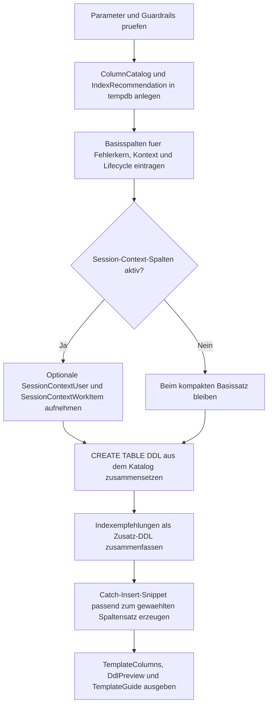

# ErrorLogTableTemplate.sql

Dieses Skript liefert eine didaktische Startvorlage fuer eine zentrale Fehlerlog-Tabelle. Es definiert einen konservativen Standard-Spaltensatz, erzeugt eine copy-ready DDL-Vorschau und zeigt direkt ein passendes `INSERT`-Snippet fuer den `CATCH`-Pfad.

## Uebersicht

<!-- SQLDOC:SUMMARY_TABLE:BEGIN -->
| Feld | Wert |
|---|---|
| Script | [ErrorLogTableTemplate.sql](ErrorLogTableTemplate.sql) |
| Version | `1.0` |
| Typ | `template` |
| Kapitel | `25_ErrorHandling_TryCatch` |
| Sicherheit | `read-only-tempdb` |
| Zweck | Liefert eine zentrale Fehlerlog-Tabellenvorlage mit Standardspalten, DDL-Vorschau und Catch-Insert-Snippet. |
<!-- SQLDOC:SUMMARY_TABLE:END -->

## Einordnung

Die Vorlage fokussiert nicht auf ein bestimmtes Business-System, sondern auf einen robusten Kern fuer Lern-, Review- und Startprojekte. Dadurch laesst sich die Tabelle spaeter fuer APIs, ETL-Strecken, Queue-Worker oder klassische Stored Procedures konkretisieren, ohne dass der Grundaufbau jedes Mal neu erfunden werden muss.

## Annahmen

- Das Skript ist eine didaktische Erstversion und erzeugt nur Vorschautexte in `tempdb`, keine persistente Produktivtabelle.
- `PayloadJson` dient als neutraler Container fuer Request-, Envelope- oder Zusatzdiagnose und ersetzt kein vollstaendiges Domain-Schema.
- `RetentionUntilUtc` ist als einfache Startheuristik fuer Archivierung oder Loeschregeln gedacht.
- Die optionalen `SESSION_CONTEXT`-Spalten sind nur sinnvoll, wenn aufrufende Anwendungen diese Werte bewusst setzen.

## Anwendungsfall

Die Vorlage eignet sich fuer Teams, die ein gemeinsames Mindestformat fuer Fehlerlogs brauchen. Typische Einsatzorte sind zentrale Logging-Tabellen fuer `TRY...CATCH`, Schulungsbeispiele fuer Fehlerbehandlung und Reviews, bei denen geklaert werden soll, welche Metadaten fuer Support, Betrieb und Fachbereich wirklich notwendig sind.

## Parameter

<!-- SQLDOC:PARAMETERS_TABLE:BEGIN -->
| Parameter | SQL-Typ | Pflicht | Beschreibung |
|---|---|---|---|
| `@TargetSchema` | `SYSNAME` | Nein | Schema fuer die vorgeschlagene Fehlerlog-Tabelle. |
| `@TargetTable` | `SYSNAME` | Nein | Tabellenname fuer die vorgeschlagene Fehlerlog-Tabelle. |
| `@IncludeSessionContextColumns` | `BIT` | Nein | Fuegt bei `1` optionale `SESSION_CONTEXT`-Spalten hinzu. |
| `@RetentionDays` | `SMALLINT` | Nein | Definiert die vorgeschlagene Anzahl Tage bis zur Aufbewahrungsgrenze. |
<!-- SQLDOC:PARAMETERS_TABLE:END -->

## Abhaengigkeiten

<!-- SQLDOC:DEPENDENCIES_LIST:BEGIN -->
- `tempdb` fuer temporaere Katalog- und Indexdaten
- `TRY...CATCH` und `ERROR_*()` als fachlicher Zielkontext
- `QUOTENAME`
- `SYSUTCDATETIME()`
- `HOST_NAME()`, `APP_NAME()` und `ORIGINAL_LOGIN()`
- `FOR XML PATH` fuer die DDL-Zusammensetzung
<!-- SQLDOC:DEPENDENCIES_LIST:END -->

## Hinweise

- `TemplateColumns` beschreibt den vorgeschlagenen Spaltensatz inklusive Zweck und Default-Logik.
- `DdlPreview` liefert das eigentliche `CREATE TABLE`, die empfohlenen Indizes und ein direkt uebernehmbares `INSERT`-Snippet fuer den `CATCH`-Pfad.
- `TemplateGuide` verdichtet die Spalten in Kern-, Kontext- und Lifecycle-Bloecke, damit Anpassungen schneller diskutiert werden koennen.
- Das Skript arbeitet mit `UTC`, damit spaetere Korrelation ueber Jobs, APIs und mehrere Systeme leichter bleibt.

## Versionshistorie

<!-- SQLDOC:VERSION_HISTORY_TABLE:BEGIN -->
| Version | Datum | User | Beschreibung |
|---|---|---|---|
| `1.0` | `2026-04-17` | `ER` | Erstversion fuer eine zentrale Fehlerlog-Tabellenvorlage |
<!-- SQLDOC:VERSION_HISTORY_TABLE:END -->

## Ablauf

<!-- SQLDOC:MERMAID:BEGIN -->

<!-- SQLDOC:MERMAID:END -->

## SQL-Code

<!-- SQLDOC:SQL_CODE:BEGIN -->
```sql
/*
BEGIN:SQL-HEADER v1
---
sql_header: v1
script_name: "ErrorLogTableTemplate.sql"
script_version: "1.0"
script_type: "template"
chapter: "25_ErrorHandling_TryCatch"

purpose: >
  Liefert eine didaktische Startvorlage fuer eine zentrale Fehlerlog-Tabelle
  mit Standardspalten, DDL-Vorschau, Indexempfehlungen und einem passenden
  Insert-Snippet fuer TRY...CATCH-basierte Routinen.

parameters:
  - name: "@TargetSchema"
    sql_type: "SYSNAME"
    direction: "IN"
    required: false
    description: "Schemasname fuer die vorgeschlagene Fehlerlog-Tabelle"
  - name: "@TargetTable"
    sql_type: "SYSNAME"
    direction: "IN"
    required: false
    description: "Tabellenname fuer die vorgeschlagene Fehlerlog-Tabelle"
  - name: "@IncludeSessionContextColumns"
    sql_type: "BIT"
    direction: "IN"
    required: false
    description: "1 fuegt optionale Session-Context-Spalten hinzu, 0 laesst nur den Basissatz"
  - name: "@RetentionDays"
    sql_type: "SMALLINT"
    direction: "IN"
    required: false
    description: "Anzahl Tage fuer die vorgeschlagene Aufbewahrungsgrenze"

result_sets:
  - name: "TemplateColumns"
    description: "Zeigt den vorgeschlagenen Spaltensatz inklusive Defaults und didaktischer Begruendung"
  - name: "DdlPreview"
    description: "Liefert CREATE TABLE, Indexvorschlaege und ein Insert-Snippet als copy-ready Vorlage"
  - name: "TemplateGuide"
    description: "Verdichtet die Einsatzzwecke der wichtigsten Spaltengruppen fuer Review und Anpassung"

dependencies:
  - "tempdb temporary tables"
  - "TRY...CATCH"
  - "ERROR_* functions"
  - "QUOTENAME"
  - "SYSUTCDATETIME"
  - "HOST_NAME"
  - "APP_NAME"
  - "ORIGINAL_LOGIN"
  - "FOR XML PATH"

safety:
  level: "read-only-tempdb"
  writes_data: false

documentation:
  markdown_file: "T-SQL/25_ErrorHandling_TryCatch/SQLScripts/ErrorLogTableTemplate.md"
  sync_blocks:
    - "SUMMARY_TABLE"
    - "PARAMETERS_TABLE"
    - "DEPENDENCIES_LIST"
    - "VERSION_HISTORY_TABLE"
    - "SQL_CODE"
  mermaid:
    mode: "ai-agent-from-sql"
    source: "script-body"

main_responsible:
  name: "Erhard Rainer"
  initials: "ER"

version_history:
  - version: "1.0"
    date: "2026-04-17"
    user: "ER"
    description: "Erstversion fuer eine zentrale Fehlerlog-Tabellenvorlage"

notes:
  - "Das Skript erzeugt nur Vorlagen und Demo-Metadaten in tempdb."
  - "Die DDL ist als Startpunkt fuer spaetere produktive Anpassungen gedacht."
---
END:SQL-HEADER v1
*/

SET NOCOUNT ON;
SET XACT_ABORT ON;

DECLARE @TargetSchema SYSNAME = N'dbo';
DECLARE @TargetTable SYSNAME = N'ErrorLog';
DECLARE @IncludeSessionContextColumns BIT = 1;
DECLARE @RetentionDays SMALLINT = 30;

IF NULLIF(LTRIM(RTRIM(@TargetSchema)), N'') IS NULL
BEGIN
    THROW 52200, '@TargetSchema darf nicht leer sein.', 1;
END;

IF NULLIF(LTRIM(RTRIM(@TargetTable)), N'') IS NULL
BEGIN
    THROW 52201, '@TargetTable darf nicht leer sein.', 1;
END;

IF @IncludeSessionContextColumns NOT IN (0, 1)
BEGIN
    THROW 52202, '@IncludeSessionContextColumns muss 0 oder 1 sein.', 1;
END;

IF @RetentionDays < 1
BEGIN
    THROW 52203, '@RetentionDays muss groesser oder gleich 1 sein.', 1;
END;

DROP TABLE IF EXISTS #ErrorLogColumnCatalog;
DROP TABLE IF EXISTS #IndexRecommendation;

CREATE TABLE #ErrorLogColumnCatalog
(
    ColumnOrder INT NOT NULL PRIMARY KEY,
    ColumnName SYSNAME NOT NULL,
    SqlType NVARCHAR(120) NOT NULL,
    Nullability VARCHAR(10) NOT NULL,
    DefaultExpression NVARCHAR(200) NULL,
    IncludeWhen BIT NOT NULL,
    ColumnPurpose NVARCHAR(220) NOT NULL
);

CREATE TABLE #IndexRecommendation
(
    RecommendationOrder INT NOT NULL PRIMARY KEY,
    IndexName SYSNAME NOT NULL,
    IndexStatement NVARCHAR(MAX) NOT NULL,
    RecommendationPurpose NVARCHAR(220) NOT NULL
);

INSERT INTO #ErrorLogColumnCatalog
(
    ColumnOrder,
    ColumnName,
    SqlType,
    Nullability,
    DefaultExpression,
    IncludeWhen,
    ColumnPurpose
)
VALUES
    (10, N'ErrorLogId', N'BIGINT IDENTITY(1,1)', N'NOT NULL', NULL, 1, N'Technischer Primaerschluessel fuer chronologische Inserts und stabile Referenzen.'),
    (20, N'LoggedAtUtc', N'DATETIME2(3)', N'NOT NULL', N'SYSUTCDATETIME()', 1, N'UTC-Zeitstempel fuer systemuebergreifende Korrelation.'),
    (30, N'ErrorNumber', N'INT', N'NOT NULL', NULL, 1, N'Originale Fehlernummer aus ERROR_NUMBER().'),
    (40, N'ErrorSeverity', N'TINYINT', N'NOT NULL', NULL, 1, N'Schweregrad fuer technische Priorisierung und Routing.'),
    (50, N'ErrorState', N'TINYINT', N'NOT NULL', NULL, 1, N'State-Wert zur genaueren Unterscheidung aehnlicher Fehlerbilder.'),
    (60, N'ErrorProcedure', N'SYSNAME', N'NULL', NULL, 1, N'Quellprozedur oder Batch-Name, sofern verfuegbar.'),
    (70, N'ErrorLine', N'INT', N'NULL', NULL, 1, N'Zeilenbezug fuer Review und Troubleshooting.'),
    (80, N'ErrorMessage', N'NVARCHAR(4000)', N'NOT NULL', NULL, 1, N'Vollstaendige Fehlermeldung fuer Analyse und Support.'),
    (90, N'ErrorClass', N'VARCHAR(40)', N'NULL', NULL, 1, N'Freies Klassifikationsfeld fuer business, constraint oder runtime.'),
    (100, N'CorrelationId', N'UNIQUEIDENTIFIER', N'NULL', NULL, 1, N'Verknuepft den Fehler mit Workflow-, Request- oder API-Korrelation.'),
    (110, N'SourceArea', N'VARCHAR(80)', N'NULL', NULL, 1, N'Fachlicher oder technischer Herkunftsbereich des Fehlers.'),
    (120, N'SessionId', N'INT', N'NOT NULL', N'@@SPID', 1, N'Dokumentiert die SQL-Session fuer parallele Fehlersuche.'),
    (130, N'LoginName', N'SYSNAME', N'NOT NULL', N'ORIGINAL_LOGIN()', 1, N'Originales Login fuer Audit- und Betriebszwecke.'),
    (140, N'HostName', N'NVARCHAR(128)', N'NULL', N'HOST_NAME()', 1, N'Client- oder Host-Kontext fuer Support-Faelle.'),
    (150, N'ApplicationName', N'NVARCHAR(128)', N'NULL', N'APP_NAME()', 1, N'Anwendungskontext fuer Routing und Musteranalyse.'),
    (160, N'XactStateAtCatch', N'SMALLINT', N'NULL', NULL, 1, N'Zeigt, ob die Transaktion noch commitbar oder nur rollback-bar war.'),
    (170, N'TranCountAtCatch', N'SMALLINT', N'NULL', NULL, 1, N'Erfasst die beobachtete Transaktionstiefe im Catch-Block.'),
    (180, N'PayloadJson', N'NVARCHAR(MAX)', N'NULL', NULL, 1, N'Optionaler JSON-Kontext mit Request-, Envelope- oder Diagnosedaten.'),
    (190, N'RemediationHint', N'NVARCHAR(400)', N'NULL', NULL, 1, N'Kurzer operativer Hinweis fuer naechste Schritte.'),
    (200, N'IsResolved', N'BIT', N'NOT NULL', N'0', 1, N'Steuert den Lebenszyklus zwischen offenem und behobenem Fehler.'),
    (210, N'ResolvedAtUtc', N'DATETIME2(3)', N'NULL', NULL, 1, N'Abschlusszeitpunkt fuer Auswertung von Reaktions- und Loesedauer.'),
    (220, N'RetentionUntilUtc', N'DATETIME2(3)', N'NOT NULL', N'DATEADD(DAY, ' + CONVERT(NVARCHAR(10), @RetentionDays) + N', SYSUTCDATETIME())', 1, N'Vorgeschlagene Aufbewahrungsgrenze fuer Archivierung oder Loeschkonzepte.'),
    (230, N'SessionContextUser', N'NVARCHAR(128)', N'NULL', N'CAST(SESSION_CONTEXT(N''user'') AS NVARCHAR(128))', @IncludeSessionContextColumns, N'Optionale Uebernahme eines fachlichen Users aus SESSION_CONTEXT.'),
    (240, N'SessionContextWorkItem', N'NVARCHAR(128)', N'NULL', N'CAST(SESSION_CONTEXT(N''work_item'') AS NVARCHAR(128))', @IncludeSessionContextColumns, N'Optionale Uebernahme einer Work-Item-Referenz aus SESSION_CONTEXT.');

INSERT INTO #IndexRecommendation
(
    RecommendationOrder,
    IndexName,
    IndexStatement,
    RecommendationPurpose
)
VALUES
    (
        10,
        N'PK_' + @TargetTable,
        N'ALTER TABLE ' + QUOTENAME(@TargetSchema) + N'.' + QUOTENAME(@TargetTable) +
        N' ADD CONSTRAINT ' + QUOTENAME(N'PK_' + @TargetTable) +
        N' PRIMARY KEY CLUSTERED (ErrorLogId);',
        N'Clustered Primary Key fuer stabile Inserts und eindeutige Referenzen.'
    ),
    (
        20,
        N'IX_' + @TargetTable + N'_LoggedAtUtc',
        N'CREATE INDEX ' + QUOTENAME(N'IX_' + @TargetTable + N'_LoggedAtUtc') +
        N' ON ' + QUOTENAME(@TargetSchema) + N'.' + QUOTENAME(@TargetTable) +
        N' (LoggedAtUtc DESC) INCLUDE (ErrorNumber, ErrorSeverity, ErrorState, SourceArea, IsResolved);',
        N'Beschleunigt zeitbasierte Sichtung offener Vorfaelle.'
    ),
    (
        30,
        N'IX_' + @TargetTable + N'_CorrelationId',
        N'CREATE INDEX ' + QUOTENAME(N'IX_' + @TargetTable + N'_CorrelationId') +
        N' ON ' + QUOTENAME(@TargetSchema) + N'.' + QUOTENAME(@TargetTable) +
        N' (CorrelationId) INCLUDE (LoggedAtUtc, ErrorNumber, ErrorMessage);',
        N'Unterstuetzt Korrelation ueber API-, Queue- oder Workflow-Ids.'
    );

DECLARE
    @CreateTableSql NVARCHAR(MAX),
    @CreateIndexSql NVARCHAR(MAX),
    @InsertSnippet NVARCHAR(MAX),
    @GuideText NVARCHAR(220);

SELECT
    @CreateTableSql =
        N'CREATE TABLE ' + QUOTENAME(@TargetSchema) + N'.' + QUOTENAME(@TargetTable) + N'
(
' +
        STUFF
        (
            (
                SELECT
                    CHAR(13) + CHAR(10) +
                    CASE
                        WHEN c.ColumnOrder =
                             (
                                 SELECT MIN(c2.ColumnOrder)
                                 FROM #ErrorLogColumnCatalog AS c2
                                 WHERE c2.IncludeWhen = 1
                             )
                            THEN N'    ' + QUOTENAME(c.ColumnName) + N' ' + c.SqlType + N' ' + c.Nullability +
                                 COALESCE(N' CONSTRAINT ' + QUOTENAME(N'DF_' + @TargetTable + N'_' + c.ColumnName) + N' DEFAULT (' + c.DefaultExpression + N')', N'')
                        ELSE N'    , ' + QUOTENAME(c.ColumnName) + N' ' + c.SqlType + N' ' + c.Nullability +
                             COALESCE(N' CONSTRAINT ' + QUOTENAME(N'DF_' + @TargetTable + N'_' + c.ColumnName) + N' DEFAULT (' + c.DefaultExpression + N')', N'')
                    END
                FROM #ErrorLogColumnCatalog AS c
                WHERE c.IncludeWhen = 1
                ORDER BY c.ColumnOrder
                FOR XML PATH(''), TYPE
            ).value('.', 'NVARCHAR(MAX)'),
            1,
            2,
            N''
        ) + CHAR(13) + CHAR(10) + N');';

SELECT
    @CreateIndexSql =
        STUFF
        (
            (
                SELECT
                    CHAR(13) + CHAR(10) + CHAR(13) + CHAR(10) + ir.IndexStatement
                FROM #IndexRecommendation AS ir
                ORDER BY ir.RecommendationOrder
                FOR XML PATH(''), TYPE
            ).value('.', 'NVARCHAR(MAX)'),
            1,
            4,
            N''
        );

SET @InsertSnippet = N'INSERT INTO ' + QUOTENAME(@TargetSchema) + N'.' + QUOTENAME(@TargetTable) + N'
(
    LoggedAtUtc,
    ErrorNumber,
    ErrorSeverity,
    ErrorState,
    ErrorProcedure,
    ErrorLine,
    ErrorMessage,
    ErrorClass,
    CorrelationId,
    SourceArea,
    SessionId,
    LoginName,
    HostName,
    ApplicationName,
    XactStateAtCatch,
    TranCountAtCatch,
    PayloadJson,
    RemediationHint
' +
CASE
    WHEN @IncludeSessionContextColumns = 1
        THEN N',
    SessionContextUser,
    SessionContextWorkItem'
    ELSE N''
END + N'
)
VALUES
(
    SYSUTCDATETIME(),
    ERROR_NUMBER(),
    ERROR_SEVERITY(),
    ERROR_STATE(),
    ERROR_PROCEDURE(),
    ERROR_LINE(),
    ERROR_MESSAGE(),
    @ErrorClass,
    @CorrelationId,
    @SourceArea,
    @@SPID,
    ORIGINAL_LOGIN(),
    HOST_NAME(),
    APP_NAME(),
    XACT_STATE(),
    @@TRANCOUNT,
    @PayloadJson,
    @RemediationHint' +
CASE
    WHEN @IncludeSessionContextColumns = 1
        THEN N',
    CAST(SESSION_CONTEXT(N''user'') AS NVARCHAR(128)),
    CAST(SESSION_CONTEXT(N''work_item'') AS NVARCHAR(128))'
    ELSE N''
END + N'
);';

SET @GuideText =
    CASE
        WHEN @IncludeSessionContextColumns = 1
            THEN N'Der Spaltensatz kombiniert Basiskontext mit optionalen SESSION_CONTEXT-Feldern fuer Workflows oder APIs.'
        ELSE N'Der Spaltensatz bleibt bewusst kompakt und konzentriert sich auf Fehler-, Session- und Routing-Basisdaten.'
    END;

SELECT
    c.ColumnOrder,
    c.ColumnName,
    c.SqlType,
    c.Nullability,
    c.DefaultExpression,
    c.ColumnPurpose
FROM #ErrorLogColumnCatalog AS c
WHERE c.IncludeWhen = 1
ORDER BY c.ColumnOrder;

SELECT
    QUOTENAME(@TargetSchema) + N'.' + QUOTENAME(@TargetTable) AS TargetObject,
    @RetentionDays AS RetentionDays,
    @GuideText AS TemplateNote,
    @CreateTableSql AS CreateTableSql,
    @CreateIndexSql AS CreateIndexSql,
    @InsertSnippet AS CatchInsertSnippet;

SELECT
    CAST(N'Identity, Zeitstempel und Fehlerkern bilden die minimale Basis fuer jedes zentrale Error Log.' AS NVARCHAR(180)) AS CoreColumns,
    CAST(N'Korrelation, Quelle und Session-Kontext helfen bei Workflow- und API-uebergreifender Diagnose.' AS NVARCHAR(180)) AS ContextColumns,
    CAST(N'RetentionUntilUtc und IsResolved erleichtern Betrieb, Archivierung und offene Backlogs.' AS NVARCHAR(180)) AS LifecycleColumns,
    CAST(@GuideText AS NVARCHAR(220)) AS TailoringHint;
```
<!-- SQLDOC:SQL_CODE:END -->
