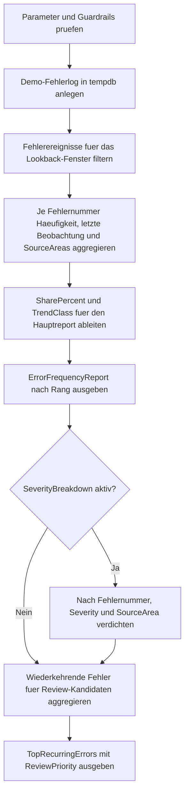

# ErrorNumberFrequencyReport.sql

Dieses Skript aggregiert einen didaktischen Fehlerlog-Katalog nach Fehlernummern und verdichtet dabei Haeufigkeit, Anteile und aktuelle Aktivitaet. So entsteht ein kompakter Report, der fuer Reviews, Alert-Diskussionen und erste Priorisierung von Fehlerclustern genutzt werden kann.

## Uebersicht

<!-- SQLDOC:SUMMARY_TABLE:BEGIN -->
| Feld | Wert |
|---|---|
| Script | [ErrorNumberFrequencyReport.sql](ErrorNumberFrequencyReport.sql) |
| Version | `1.0` |
| Typ | `diagnostic-query` |
| Kapitel | `25_ErrorHandling_TryCatch` |
| Sicherheit | `read-only-tempdb` |
| Zweck | Aggregiert Fehlernummern aus einem Demo-Log nach Haeufigkeit, Anteil und Trendklasse. |
<!-- SQLDOC:SUMMARY_TABLE:END -->

## Einordnung

Der Report trennt die Frage "Welche Fehler treten oft auf?" von der spaeteren Ursachenanalyse. Dadurch koennen Teams zuerst stabile Cluster ueber Fehlernummern erkennen und anschliessend entscheiden, ob eher Retry-Policy, Datenqualitaet, Deployments oder Betriebsparameter untersucht werden sollten.

## Annahmen

- Das Skript arbeitet mit einem kuratierten Demo-Fehlerlog in `tempdb` statt mit produktiven Protokolltabellen.
- Die Trendklasse `surging`, `active` oder `historical` basiert nur auf dem Anteil der Beobachtungen in den letzten 24 Stunden des gewaehlten Lookback-Fensters.
- `TopRecurringErrors` ist bewusst knapp gehalten und dient als Review-Startpunkt, nicht als vollstaendige Incident-Priorisierung.
- `HandlingHint` repraesentiert didaktische Naechstschritte und keine verbindliche Betriebsrichtlinie.

## Anwendungsfall

Das Skript eignet sich fuer Schulungen zu Fehlerbehandlung, fuer Review-Routinen nach Testlaeufen und als Muster, um spaeter echte Fehlerlogs zu verdichten. Besonders nuetzlich ist es, wenn ein Team sehen will, welche Fehlernummern haeufig wiederkehren, aus wie vielen Quellbereichen sie stammen und ob gerade ein akuter Peak vorliegt.

## Parameter

<!-- SQLDOC:PARAMETERS_TABLE:BEGIN -->
| Parameter | SQL-Typ | Pflicht | Beschreibung |
|---|---|---|---|
| `@LookbackHours` | `INT` | Nein | Legt das betrachtete Zeitfenster in Stunden fest. |
| `@MinOccurrences` | `INT` | Nein | Filtert Fehlernummern unterhalb der Mindesthaeufigkeit aus dem Hauptreport. |
| `@IncludeSeverityBreakdown` | `BIT` | Nein | Blendet bei `1` eine zusaetzliche Verteilung nach Severity und SourceArea ein. |
<!-- SQLDOC:PARAMETERS_TABLE:END -->

## Abhaengigkeiten

<!-- SQLDOC:DEPENDENCIES_LIST:BEGIN -->
- `tempdb` fuer den temporaeren Demo-Fehlerlog
- Common Table Expressions
- Window Functions
- `STRING_AGG`
- `DATEADD`
- `CASE`
<!-- SQLDOC:DEPENDENCIES_LIST:END -->

## Hinweise

- `ErrorFrequencyReport` liefert Rang, Haeufigkeit, Anteil, Quellbereiche und eine einfache Trendklasse pro Fehlernummer.
- `SeverityBreakdown` zeigt optional, ob dieselbe Fehlernummer in unterschiedlichen Schweregraden oder SourceAreas sichtbar wird.
- `TopRecurringErrors` reduziert die haeufigsten Muster auf eine kurze priorisierte Review-Liste.
- Fehlernummern unterhalb von `@MinOccurrences` bleiben im Hauptreport aussen vor, koennen aber weiterhin im Breakdown sichtbar sein.

## Versionshistorie

<!-- SQLDOC:VERSION_HISTORY_TABLE:BEGIN -->
| Version | Datum | User | Beschreibung |
|---|---|---|---|
| `1.0` | `2026-04-17` | `ER` | Erstversion fuer einen didaktischen Report ueber Fehlernummern-Haeufigkeiten |
<!-- SQLDOC:VERSION_HISTORY_TABLE:END -->

## Ablauf

<!-- SQLDOC:MERMAID:BEGIN -->

<!-- SQLDOC:MERMAID:END -->

## SQL-Code

<!-- SQLDOC:SQL_CODE:BEGIN -->
```sql
/*
BEGIN:SQL-HEADER v1
---
sql_header: v1
script_name: "ErrorNumberFrequencyReport.sql"
script_version: "1.0"
script_type: "diagnostic-query"
chapter: "25_ErrorHandling_TryCatch"

purpose: >
  Aggregiert einen didaktischen Fehlerlog-Katalog nach Fehlernummer,
  Schweregrad und Beobachtungsfenster, damit Haeufigkeit, Wiederholungen
  und relative Anteile fuer Review- und Alert-Gespraeche schnell sichtbar
  werden.

parameters:
  - name: "@LookbackHours"
    sql_type: "INT"
    direction: "IN"
    required: false
    description: "Begrenzt den betrachteten Demo-Zeitraum in Stunden"
  - name: "@MinOccurrences"
    sql_type: "INT"
    direction: "IN"
    required: false
    description: "Filtert Fehlernummern mit weniger Beobachtungen aus dem Frequenzreport"
  - name: "@IncludeSeverityBreakdown"
    sql_type: "BIT"
    direction: "IN"
    required: false
    description: "1 zeigt zusaetzlich die Verteilung nach Severity und SourceArea"

result_sets:
  - name: "ErrorFrequencyReport"
    description: "Zeigt pro Fehlernummer Haeufigkeit, letzten Vorfall, Anteil und Trendklasse"
  - name: "SeverityBreakdown"
    description: "Verdichtet Fehlernummern optional nach Severity und SourceArea"
  - name: "TopRecurringErrors"
    description: "Hebt die am staerksten wiederkehrenden Fehler fuer Reviews hervor"

dependencies:
  - "tempdb temporary tables"
  - "common table expressions"
  - "window functions"
  - "STRING_AGG"
  - "DATEADD"
  - "CASE"

safety:
  level: "read-only-tempdb"
  writes_data: false

documentation:
  markdown_file: "T-SQL/25_ErrorHandling_TryCatch/SQLScripts/ErrorNumberFrequencyReport.md"
  sync_blocks:
    - "SUMMARY_TABLE"
    - "PARAMETERS_TABLE"
    - "DEPENDENCIES_LIST"
    - "VERSION_HISTORY_TABLE"
    - "SQL_CODE"
  mermaid:
    mode: "ai-agent-from-sql"
    source: "script-body"

main_responsible:
  name: "Erhard Rainer"
  initials: "ER"

version_history:
  - version: "1.0"
    date: "2026-04-17"
    user: "ER"
    description: "Erstversion fuer einen didaktischen Report ueber Fehlernummern-Haeufigkeiten"

notes:
  - "Das Skript nutzt einen kuratierten Demo-Fehlerkatalog statt produktiver Logtabellen."
  - "Alle Daten werden in tempdb erzeugt und nur lesend verdichtet."
---
END:SQL-HEADER v1
*/

SET NOCOUNT ON;
SET XACT_ABORT ON;

DECLARE @LookbackHours INT = 72;
DECLARE @MinOccurrences INT = 2;
DECLARE @IncludeSeverityBreakdown BIT = 1;

IF @LookbackHours < 1
BEGIN
    THROW 52300, '@LookbackHours muss groesser oder gleich 1 sein.', 1;
END;

IF @MinOccurrences < 1
BEGIN
    THROW 52301, '@MinOccurrences muss groesser oder gleich 1 sein.', 1;
END;

IF @IncludeSeverityBreakdown NOT IN (0, 1)
BEGIN
    THROW 52302, '@IncludeSeverityBreakdown muss 0 oder 1 sein.', 1;
END;

DROP TABLE IF EXISTS #ErrorEventLog;

CREATE TABLE #ErrorEventLog
(
    EventId INT IDENTITY(1,1) NOT NULL PRIMARY KEY,
    ErrorNumber INT NOT NULL,
    ErrorSeverity TINYINT NOT NULL,
    SourceArea VARCHAR(40) NOT NULL,
    ErrorLabel VARCHAR(100) NOT NULL,
    OccurredAt DATETIME2(0) NOT NULL,
    HandlingHint NVARCHAR(220) NOT NULL
);

INSERT INTO #ErrorEventLog
(
    ErrorNumber,
    ErrorSeverity,
    SourceArea,
    ErrorLabel,
    OccurredAt,
    HandlingHint
)
VALUES
    (1205, 13, 'OrderImport', 'Deadlock victim', DATEADD(HOUR, -2, SYSDATETIME()), N'Retry mit Jitter und kurzer Beobachtung.'),
    (1205, 13, 'OrderImport', 'Deadlock victim', DATEADD(HOUR, -8, SYSDATETIME()), N'Konkurrierende Schreibpfade pruefen.'),
    (1205, 13, 'OrderImport', 'Deadlock victim', DATEADD(HOUR, -28, SYSDATETIME()), N'Wiederholungen fuer Review markieren.'),
    (1222, 16, 'BillingSync', 'Lock request timeout', DATEADD(HOUR, -4, SYSDATETIME()), N'Blockierung und Timeout-Schwelle vergleichen.'),
    (1222, 16, 'BillingSync', 'Lock request timeout', DATEADD(HOUR, -18, SYSDATETIME()), N'Nur begrenzte Retries zulassen.'),
    (2627, 14, 'CustomerImport', 'Unique constraint violation', DATEADD(HOUR, -3, SYSDATETIME()), N'Input und Idempotenz der Lade-Strecke pruefen.'),
    (2627, 14, 'CustomerImport', 'Unique constraint violation', DATEADD(HOUR, -6, SYSDATETIME()), N'Dubletten nicht durch Retry behandeln.'),
    (2627, 14, 'CustomerImport', 'Unique constraint violation', DATEADD(HOUR, -27, SYSDATETIME()), N'Fehlerbild als persistentes Datenproblem markieren.'),
    (2627, 14, 'SelfServiceApi', 'Unique constraint violation', DATEADD(HOUR, -30, SYSDATETIME()), N'Caller auf bestehende Entitaet hinweisen.'),
    (40501, 20, 'NightlyWarehouseLoad', 'Service busy / throttling', DATEADD(HOUR, -1, SYSDATETIME()), N'Exponentielles Backoff einplanen.'),
    (40501, 20, 'NightlyWarehouseLoad', 'Service busy / throttling', DATEADD(HOUR, -5, SYSDATETIME()), N'Telemetrie zur Lastspitze verknuepfen.'),
    (40501, 20, 'NightlyWarehouseLoad', 'Service busy / throttling', DATEADD(HOUR, -7, SYSDATETIME()), N'Transiente Serie fuer Trendbeobachtung sammeln.'),
    (40501, 20, 'NightlyWarehouseLoad', 'Service busy / throttling', DATEADD(HOUR, -26, SYSDATETIME()), N'Vorfaelle pro Zeitfenster verdichten.'),
    (547, 16, 'FulfillmentWorker', 'Constraint violation', DATEADD(HOUR, -15, SYSDATETIME()), N'Reihenfolge der Stammdaten und Referenzen pruefen.'),
    (547, 16, 'FulfillmentWorker', 'Constraint violation', DATEADD(HOUR, -49, SYSDATETIME()), N'Fachliche Reihenfolge statt Retry korrigieren.'),
    (50000, 16, 'SelfServiceApi', 'Business validation throw', DATEADD(HOUR, -9, SYSDATETIME()), N'Fachliche Rueckmeldung an Caller geben.'),
    (50000, 16, 'SelfServiceApi', 'Business validation throw', DATEADD(HOUR, -13, SYSDATETIME()), N'Input-Regeln in UI und API angleichen.'),
    (18456, 14, 'OperationsJob', 'Login failed', DATEADD(HOUR, -11, SYSDATETIME()), N'Credential oder Secret-Rotation pruefen.');

;WITH FilteredEvents AS
(
    SELECT
        eel.EventId,
        eel.ErrorNumber,
        eel.ErrorSeverity,
        eel.SourceArea,
        eel.ErrorLabel,
        eel.OccurredAt,
        eel.HandlingHint
    FROM #ErrorEventLog AS eel
    WHERE eel.OccurredAt >= DATEADD(HOUR, -@LookbackHours, SYSDATETIME())
),
SourceAreaCatalog AS
(
    SELECT DISTINCT
        fe.ErrorNumber,
        fe.SourceArea
    FROM FilteredEvents AS fe
),
SourceAreaRollup AS
(
    SELECT
        sac.ErrorNumber,
        STRING_AGG(sac.SourceArea, ', ') WITHIN GROUP (ORDER BY sac.SourceArea) AS SourceAreas
    FROM SourceAreaCatalog AS sac
    GROUP BY
        sac.ErrorNumber
),
FrequencyBase AS
(
    SELECT
        fe.ErrorNumber,
        fe.ErrorLabel,
        COUNT(*) AS OccurrenceCount,
        COUNT(DISTINCT fe.SourceArea) AS SourceAreaCount,
        MIN(fe.OccurredAt) AS FirstSeenAt,
        MAX(fe.OccurredAt) AS LastSeenAt,
        MAX(fe.ErrorSeverity) AS MaxSeverity,
        SUM(CASE WHEN fe.OccurredAt >= DATEADD(HOUR, -24, SYSDATETIME()) THEN 1 ELSE 0 END) AS Last24HoursCount
    FROM FilteredEvents AS fe
    GROUP BY
        fe.ErrorNumber,
        fe.ErrorLabel
),
FrequencyReport AS
(
    SELECT
        ROW_NUMBER() OVER (ORDER BY fb.OccurrenceCount DESC, fb.LastSeenAt DESC, fb.ErrorNumber) AS FrequencyRank,
        fb.ErrorNumber,
        fb.ErrorLabel,
        fb.OccurrenceCount,
        fb.SourceAreaCount,
        fb.FirstSeenAt,
        fb.LastSeenAt,
        fb.MaxSeverity,
        fb.Last24HoursCount,
        CAST(100.0 * fb.OccurrenceCount / NULLIF(SUM(fb.OccurrenceCount) OVER (), 0) AS DECIMAL(5,2)) AS SharePercent,
        CASE
            WHEN fb.Last24HoursCount >= 3 THEN 'surging'
            WHEN fb.Last24HoursCount >= 1 THEN 'active'
            ELSE 'historical'
        END AS TrendClass,
        sar.SourceAreas
    FROM FrequencyBase AS fb
    INNER JOIN SourceAreaRollup AS sar
        ON sar.ErrorNumber = fb.ErrorNumber
    WHERE fb.OccurrenceCount >= @MinOccurrences
)
SELECT
    fr.FrequencyRank,
    fr.ErrorNumber,
    fr.ErrorLabel,
    fr.OccurrenceCount,
    fr.Last24HoursCount,
    fr.SharePercent,
    fr.MaxSeverity,
    fr.SourceAreaCount,
    fr.SourceAreas,
    fr.FirstSeenAt,
    fr.LastSeenAt,
    fr.TrendClass
FROM FrequencyReport AS fr
ORDER BY
    fr.FrequencyRank;

IF @IncludeSeverityBreakdown = 1
BEGIN
    ;WITH FilteredEvents AS
    (
        SELECT
            eel.ErrorNumber,
            eel.ErrorSeverity,
            eel.SourceArea
        FROM #ErrorEventLog AS eel
        WHERE eel.OccurredAt >= DATEADD(HOUR, -@LookbackHours, SYSDATETIME())
    ),
    SeverityBreakdown AS
    (
        SELECT
            fe.ErrorNumber,
            fe.ErrorSeverity,
            fe.SourceArea,
            COUNT(*) AS OccurrenceCount
        FROM FilteredEvents AS fe
        GROUP BY
            fe.ErrorNumber,
            fe.ErrorSeverity,
            fe.SourceArea
    )
    SELECT
        sb.ErrorNumber,
        sb.ErrorSeverity,
        sb.SourceArea,
        sb.OccurrenceCount
    FROM SeverityBreakdown AS sb
    ORDER BY
        sb.ErrorNumber,
        sb.ErrorSeverity DESC,
        sb.SourceArea;
END;

;WITH FilteredEvents AS
(
    SELECT
        eel.ErrorNumber,
        eel.ErrorLabel,
        eel.SourceArea,
        eel.HandlingHint,
        eel.OccurredAt
    FROM #ErrorEventLog AS eel
    WHERE eel.OccurredAt >= DATEADD(HOUR, -@LookbackHours, SYSDATETIME())
),
RecurringCandidates AS
(
    SELECT
        fe.ErrorNumber,
        fe.ErrorLabel,
        COUNT(*) AS OccurrenceCount,
        COUNT(DISTINCT fe.SourceArea) AS SourceAreaCount,
        MAX(fe.OccurredAt) AS LastSeenAt,
        MAX(fe.HandlingHint) AS SampleHandlingHint
    FROM FilteredEvents AS fe
    GROUP BY
        fe.ErrorNumber,
        fe.ErrorLabel
    HAVING COUNT(*) >= @MinOccurrences
)
SELECT TOP (3)
    ROW_NUMBER() OVER (ORDER BY rc.OccurrenceCount DESC, rc.LastSeenAt DESC, rc.ErrorNumber) AS PriorityRank,
    rc.ErrorNumber,
    rc.ErrorLabel,
    rc.OccurrenceCount,
    rc.SourceAreaCount,
    rc.LastSeenAt,
    rc.SampleHandlingHint,
    CASE
        WHEN rc.OccurrenceCount >= 4 THEN 'review-immediately'
        WHEN rc.SourceAreaCount >= 2 THEN 'review-cross-team'
        ELSE 'review-during-next-retro'
    END AS ReviewPriority
FROM RecurringCandidates AS rc
ORDER BY
    rc.OccurrenceCount DESC,
    rc.LastSeenAt DESC,
    rc.ErrorNumber;
```
<!-- SQLDOC:SQL_CODE:END -->
