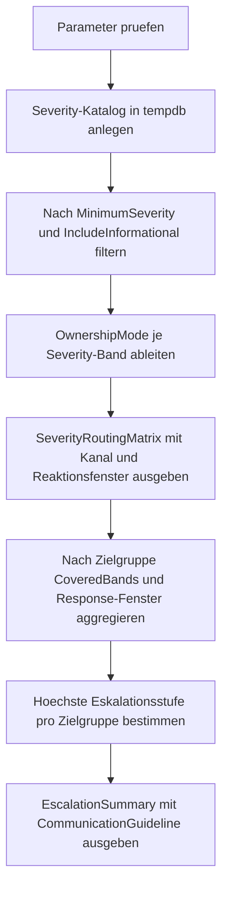

# ErrorSeverityRoutingMatrix.sql

Dieses Skript liefert eine didaktische Routing-Matrix fuer Fehler-Schweregrade im Umfeld von `TRY...CATCH`. Die Ausgabe verbindet Severity-Baender mit Zielgruppe, Reaktionsfenster und Eskalationsstufe, damit aus einem Fehler nicht nur ein Log-Eintrag, sondern eine nachvollziehbare Folgeaktion entsteht.

## Uebersicht

<!-- SQLDOC:SUMMARY_TABLE:BEGIN -->
| Feld | Wert |
|---|---|
| Script | [ErrorSeverityRoutingMatrix.sql](ErrorSeverityRoutingMatrix.sql) |
| Version | `1.0` |
| Typ | `template` |
| Kapitel | `25_ErrorHandling_TryCatch` |
| Sicherheit | `read-only-tempdb` |
| Zweck | Ordnet Severity-Baendern Routing, Reaktionsfenster und Eskalationsstufe zu. |
<!-- SQLDOC:SUMMARY_TABLE:END -->

## Einordnung

Die Matrix trennt drei Fragen, die in vielen Catch-Pfaden sonst vermischt werden: Wer soll reagieren, ueber welchen Kanal wird informiert und wie dringend ist die Reaktion? Dadurch bleibt die Fehlerbehandlung nicht auf `THROW` oder Logging beschraenkt, sondern wird in einen klaren Betriebsfluss ueberfuehrt.

## Annahmen

- Das Skript nutzt einen didaktischen Severity-Katalog in `tempdb` statt produktiver Incident-Daten.
- Severity-Baender sind bewusst grob gruppiert, damit das Muster leicht auf eigene Policies uebertragbar bleibt.
- Severity `0-10` wird als informativ behandelt und standardmaessig nur angezeigt, wenn `@IncludeInformational = 1` gesetzt ist.
- Die vorgeschlagenen Kanaele wie `pager`, `incident-bridge` oder `operations-mailbox` sind Platzhalter fuer die spaetere Tool-Landschaft.

## Anwendungsfall

Das Skript eignet sich fuer Schulungen, Template-Reviews und den Aufbau einer konsistenten Fehler-Routing-Logik. Besonders nuetzlich ist es, wenn Teams bereits Catch- und Logging-Standards haben, aber noch keine einheitliche Antwort auf die Frage "Wohin mit welchem Fehler?" definiert haben.

## Parameter

<!-- SQLDOC:PARAMETERS_TABLE:BEGIN -->
| Parameter | SQL-Typ | Pflicht | Beschreibung |
|---|---|---|---|
| `@MinimumSeverity` | `TINYINT` | Nein | Filtert Severity-Baender unterhalb dieses Startwerts aus. |
| `@IncludeInformational` | `BIT` | Nein | Zeigt bei `1` auch rein informative Severity-Baender `0-10`. |
<!-- SQLDOC:PARAMETERS_TABLE:END -->

## Abhaengigkeiten

<!-- SQLDOC:DEPENDENCIES_LIST:BEGIN -->
- `tempdb` fuer den temporaeren Severity-Katalog
- `CASE`
- Common Table Expressions
- `STRING_AGG`
- Window Functions
<!-- SQLDOC:DEPENDENCIES_LIST:END -->

## Hinweise

- `SeverityRoutingMatrix` zeigt pro Severity-Band Zielgruppe, Kanal, Reaktionsfenster und Retry-Hinweis.
- `OwnershipMode` verdichtet die operative Fuehrung auf `team-owned`, `owner-led`, `ops-led` oder `incident-led`.
- `EscalationSummary` fasst die Matrix nach Zielgruppe zusammen und zeigt, welches Eskalationsniveau pro Team maximal erreicht wird.
- Das Template ist konservativ: hohe Severity-Baender werden nicht automatisch retried, sondern zuerst in einen Incident- oder Plattformkontext ueberfuehrt.

## Versionshistorie

<!-- SQLDOC:VERSION_HISTORY_TABLE:BEGIN -->
| Version | Datum | User | Beschreibung |
|---|---|---|---|
| `1.0` | `2026-04-17` | `ER` | Erstversion fuer eine didaktische Severity-Routing-Matrix |
<!-- SQLDOC:VERSION_HISTORY_TABLE:END -->

## Ablauf

<!-- SQLDOC:MERMAID:BEGIN -->

<!-- SQLDOC:MERMAID:END -->

## SQL-Code

<!-- SQLDOC:SQL_CODE:BEGIN -->
```sql
/*
BEGIN:SQL-HEADER v1
---
sql_header: v1
script_name: "ErrorSeverityRoutingMatrix.sql"
script_version: "1.0"
script_type: "template"
chapter: "25_ErrorHandling_TryCatch"

purpose: >
  Zeigt eine didaktische Routing-Matrix fuer Fehler nach Severity-Band,
  Fehlerklasse und Betriebswirkung, damit fuer TRY...CATCH-basierte
  Fehlerpfade eine nachvollziehbare Reaktion pro Schweregrad festgelegt
  werden kann.

parameters:
  - name: "@MinimumSeverity"
    sql_type: "TINYINT"
    direction: "IN"
    required: false
    description: "Filtert Severity-Eintraege unterhalb dieses Werts aus der Matrix"
  - name: "@IncludeInformational"
    sql_type: "BIT"
    direction: "IN"
    required: false
    description: "1 zeigt auch rein informative Severity-Baender, 0 startet ab operativ relevanten Faellen"

result_sets:
  - name: "SeverityRoutingMatrix"
    description: "Ordnet Severity-Baendern eine Zielgruppe, Reaktion und Eskalationsstufe zu"
  - name: "EscalationSummary"
    description: "Verdichtet die Matrix nach Team, Kanal und bevorzugter Reaktionsform"

dependencies:
  - "tempdb temporary tables"
  - "CASE"
  - "common table expressions"
  - "STRING_AGG"
  - "window functions"

safety:
  level: "read-only-tempdb"
  writes_data: false

documentation:
  markdown_file: "T-SQL/25_ErrorHandling_TryCatch/SQLScripts/ErrorSeverityRoutingMatrix.md"
  sync_blocks:
    - "SUMMARY_TABLE"
    - "PARAMETERS_TABLE"
    - "DEPENDENCIES_LIST"
    - "VERSION_HISTORY_TABLE"
    - "SQL_CODE"
  mermaid:
    mode: "ai-agent-from-sql"
    source: "script-body"

main_responsible:
  name: "Erhard Rainer"
  initials: "ER"

version_history:
  - version: "1.0"
    date: "2026-04-17"
    user: "ER"
    description: "Erstversion fuer eine didaktische Severity-Routing-Matrix"

notes:
  - "Die Matrix ist ein didaktisches Template und ersetzt keine verbindliche Incident-Policy."
  - "Alle Beispieldaten liegen nur in tempdb und koennen gefahrlos angepasst werden."
---
END:SQL-HEADER v1
*/

SET NOCOUNT ON;

DECLARE @MinimumSeverity TINYINT = 11;
DECLARE @IncludeInformational BIT = 0;

IF @MinimumSeverity > 25
BEGIN
    THROW 52400, '@MinimumSeverity darf hoechstens 25 sein.', 1;
END;

IF @IncludeInformational NOT IN (0, 1)
BEGIN
    THROW 52401, '@IncludeInformational muss 0 oder 1 sein.', 1;
END;

DROP TABLE IF EXISTS #SeverityRoutingCatalog;

CREATE TABLE #SeverityRoutingCatalog
(
    SeverityBandLabel VARCHAR(20) NOT NULL PRIMARY KEY,
    SeverityFrom TINYINT NOT NULL,
    SeverityTo TINYINT NOT NULL,
    ErrorClass VARCHAR(30) NOT NULL,
    OperationalImpact VARCHAR(40) NOT NULL,
    PrimaryAudience VARCHAR(30) NOT NULL,
    RoutingChannel VARCHAR(30) NOT NULL,
    ResponseWindowMinutes INT NOT NULL,
    EscalationTier VARCHAR(20) NOT NULL,
    RetryGuidance NVARCHAR(180) NOT NULL,
    RoutingDecision NVARCHAR(220) NOT NULL
);

INSERT INTO #SeverityRoutingCatalog
(
    SeverityBandLabel,
    SeverityFrom,
    SeverityTo,
    ErrorClass,
    OperationalImpact,
    PrimaryAudience,
    RoutingChannel,
    ResponseWindowMinutes,
    EscalationTier,
    RetryGuidance,
    RoutingDecision
)
VALUES
    ('sev-00-10', 0, 10, 'informational', 'teaching-only', 'trainer', 'learning-log', 240, 'observe', N'Kein Retry-Pfad notwendig; nur zur Einordnung sichtbar halten.', N'Nur in Schulung oder Review zeigen; keine operative Eskalation.'),
    ('sev-11-13', 11, 13, 'transient-runtime', 'contained', 'application-team', 'ticket', 120, 'triage', N'Wenige idempotente Retries mit Jitter erlauben.', N'Anwendungsteam prueft Retry-Regeln und bekannte Deadlock- oder Timeout-Muster.'),
    ('sev-14-16', 14, 16, 'corrective-action', 'user-visible', 'service-owner', 'operations-mailbox', 60, 'owner-review', N'Nicht pauschal retryen; zuerst Fach- oder Konfigurationsursache klaeren.', N'Service-Owner bewertet Input, Berechtigungen, Constraints oder Business-Validierung.'),
    ('sev-17-18', 17, 18, 'resource-or-platform', 'degraded-service', 'database-operations', 'pager', 15, 'urgent', N'Nur kurze Retries mit Obergrenze; parallel Betriebsdaten sichern.', N'Database Operations und verantwortliches Team sofort informieren.'),
    ('sev-19-19', 19, 19, 'manual-intervention', 'high-risk', 'incident-manager', 'incident-bridge', 5, 'major-incident', N'Kein automatischer Retry ohne menschliche Freigabe.', N'Incident-Bridge oeffnen und koordinierte Massnahmen abstimmen.'),
    ('sev-20-25', 20, 25, 'fatal-or-connection', 'service-stop', 'incident-manager', 'major-incident-room', 1, 'critical', N'Nur nach stabilisierter Plattform und Idempotenzpruefung erneut starten.', N'Kritischer Vorfall: On-call, Plattformteam und Stakeholder sofort einbinden.');

;WITH FilteredCatalog AS
(
    SELECT
        src.SeverityBandLabel,
        src.SeverityFrom,
        src.SeverityTo,
        src.ErrorClass,
        src.OperationalImpact,
        src.PrimaryAudience,
        src.RoutingChannel,
        src.ResponseWindowMinutes,
        src.EscalationTier,
        src.RetryGuidance,
        src.RoutingDecision
    FROM #SeverityRoutingCatalog AS src
    WHERE src.SeverityTo >= @MinimumSeverity
      AND (@IncludeInformational = 1 OR src.SeverityFrom >= 11)
),
SeverityRoutingMatrix AS
(
    SELECT
        ROW_NUMBER() OVER (ORDER BY fc.SeverityFrom, fc.SeverityTo) AS RoutingRank,
        CONCAT(fc.SeverityFrom, '-', fc.SeverityTo) AS SeverityRange,
        fc.SeverityBandLabel,
        fc.ErrorClass,
        fc.OperationalImpact,
        fc.PrimaryAudience,
        fc.RoutingChannel,
        fc.ResponseWindowMinutes,
        fc.EscalationTier,
        CASE
            WHEN fc.SeverityTo <= 13 THEN 'team-owned'
            WHEN fc.SeverityTo <= 16 THEN 'owner-led'
            WHEN fc.SeverityTo <= 18 THEN 'ops-led'
            ELSE 'incident-led'
        END AS OwnershipMode,
        fc.RetryGuidance,
        fc.RoutingDecision
    FROM FilteredCatalog AS fc
)
SELECT
    srm.RoutingRank,
    srm.SeverityRange,
    srm.SeverityBandLabel,
    srm.ErrorClass,
    srm.OperationalImpact,
    srm.PrimaryAudience,
    srm.RoutingChannel,
    srm.ResponseWindowMinutes,
    srm.EscalationTier,
    srm.OwnershipMode,
    srm.RetryGuidance,
    srm.RoutingDecision
FROM SeverityRoutingMatrix AS srm
ORDER BY
    srm.RoutingRank;

;WITH FilteredCatalog AS
(
    SELECT
        src.PrimaryAudience,
        src.RoutingChannel,
        src.ResponseWindowMinutes,
        src.EscalationTier,
        src.SeverityBandLabel
    FROM #SeverityRoutingCatalog AS src
    WHERE src.SeverityTo >= @MinimumSeverity
      AND (@IncludeInformational = 1 OR src.SeverityFrom >= 11)
),
AudienceBands AS
(
    SELECT
        fc.PrimaryAudience,
        STRING_AGG(fc.SeverityBandLabel, ', ') WITHIN GROUP (ORDER BY fc.SeverityBandLabel) AS CoveredBands,
        MIN(fc.ResponseWindowMinutes) AS FastestResponseWindowMinutes,
        MAX(fc.ResponseWindowMinutes) AS SlowestResponseWindowMinutes,
        MAX(CASE fc.EscalationTier
                WHEN 'critical' THEN 5
                WHEN 'major-incident' THEN 4
                WHEN 'urgent' THEN 3
                WHEN 'owner-review' THEN 2
                WHEN 'triage' THEN 1
                ELSE 0
            END) AS HighestEscalationScore
    FROM FilteredCatalog AS fc
    GROUP BY
        fc.PrimaryAudience
),
EscalationSummary AS
(
    SELECT
        ab.PrimaryAudience,
        MIN(fc.RoutingChannel) AS PreferredRoutingChannel,
        ab.CoveredBands,
        ab.FastestResponseWindowMinutes,
        ab.SlowestResponseWindowMinutes,
        CASE ab.HighestEscalationScore
            WHEN 5 THEN 'critical'
            WHEN 4 THEN 'major-incident'
            WHEN 3 THEN 'urgent'
            WHEN 2 THEN 'owner-review'
            WHEN 1 THEN 'triage'
            ELSE 'observe'
        END AS HighestEscalationTier
    FROM AudienceBands AS ab
    INNER JOIN FilteredCatalog AS fc
        ON fc.PrimaryAudience = ab.PrimaryAudience
    GROUP BY
        ab.PrimaryAudience,
        ab.CoveredBands,
        ab.FastestResponseWindowMinutes,
        ab.SlowestResponseWindowMinutes,
        ab.HighestEscalationScore
)
SELECT
    es.PrimaryAudience,
    es.PreferredRoutingChannel,
    es.CoveredBands,
    es.FastestResponseWindowMinutes,
    es.SlowestResponseWindowMinutes,
    es.HighestEscalationTier,
    CASE
        WHEN es.HighestEscalationTier IN ('critical', 'major-incident') THEN 'Direkte Alarmierung und Incident-Kommunikation.'
        WHEN es.HighestEscalationTier = 'urgent' THEN 'On-call oder DB-Ops zeitnah einschalten.'
        ELSE 'Asynchron pruefen und in Ticket- oder Review-Backlog aufnehmen.'
    END AS CommunicationGuideline
FROM EscalationSummary AS es
ORDER BY
    es.FastestResponseWindowMinutes,
    es.PrimaryAudience;
```
<!-- SQLDOC:SQL_CODE:END -->
