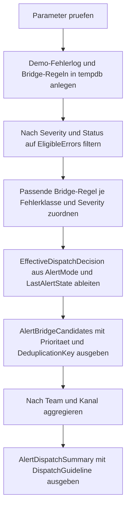

# ErrorToAlertBridgeTemplate.sql

Dieses Skript zeigt eine didaktische Bruecke zwischen protokollierten SQL-Fehlern und spaeteren Alert-Strecken. Statt direkt produktive Integrationen zu bauen, werden Fehlerlogs in `tempdb` gesammelt, mit Routing-Regeln abgeglichen und als nachvollziehbare Dispatch-Vorschau fuer Ticket-, Pager- oder Incident-Kanaele ausgegeben.

## Uebersicht

<!-- SQLDOC:SUMMARY_TABLE:BEGIN -->
| Feld | Wert |
|---|---|
| Script | [ErrorToAlertBridgeTemplate.sql](ErrorToAlertBridgeTemplate.sql) |
| Version | `1.0` |
| Typ | `template` |
| Kapitel | `25_ErrorHandling_TryCatch` |
| Sicherheit | `read-only-tempdb` |
| Zweck | Fuehrt Fehlerlogs in eine didaktische Alert-Bridge mit Dispatch-Vorschau ueber. |
<!-- SQLDOC:SUMMARY_TABLE:END -->

## Einordnung

Viele TRY...CATCH-Muster enden bei Logging oder einem erneuten `THROW`. Das Template setzt einen Schritt spaeter an: Es behandelt den Fehlerlog als Eingangsmenge fuer spaetere Alarmierung. Dadurch wird sichtbar, wie Severity, Fehlerklasse und Bearbeitungsstatus die naechste operative Strecke beeinflussen.

## Annahmen

- Das Skript nutzt einen didaktischen Fehlerlog in `tempdb` statt produktiver Log- oder Queue-Tabellen.
- Alert-Kanaele wie `ticket`, `pager` oder `incident-bridge` sind Platzhalter fuer spaetere Integrationen.
- Bereits `resolved` markierte Fehler werden nicht erneut in die Bridge aufgenommen.
- `acknowledged` bleibt standardmaessig ausgefiltert, kann aber ueber `@IncludeAcknowledged = 1` wieder sichtbar gemacht werden.

## Anwendungsfall

Das Template eignet sich fuer Schulungen, Architektur-Reviews und erste Entwuerfe einer Error-to-Alert-Strecke. Besonders hilfreich ist es, wenn Teams schon Fehler loggen, aber noch keine klare Regel besitzen, wann ein Eintrag nur dokumentiert, wann ein Ticket erzeugt und wann sofort eskaliert werden soll.

## Parameter

<!-- SQLDOC:PARAMETERS_TABLE:BEGIN -->
| Parameter | SQL-Typ | Pflicht | Beschreibung |
|---|---|---|---|
| `@MinimumSeverity` | `TINYINT` | Nein | Filtert Fehler unterhalb dieser Severity aus der Bridge-Vorschau. |
| `@IncludeAcknowledged` | `BIT` | Nein | Beruecksichtigt bei `1` auch bestaetigte Fehler; sonst nur neue oder triagierte Kandidaten. |
| `@AlertMode` | `VARCHAR(20)` | Nein | Steuert `auto`, `notify-only` oder `backlog` fuer die Weitergabe. |
<!-- SQLDOC:PARAMETERS_TABLE:END -->

## Abhaengigkeiten

<!-- SQLDOC:DEPENDENCIES_LIST:BEGIN -->
- `tempdb` fuer Demo-Fehlerlogs und Routing-Regeln
- `CASE`
- Common Table Expressions
- Window Functions
- `STRING_AGG`
<!-- SQLDOC:DEPENDENCIES_LIST:END -->

## Hinweise

- `AlertBridgeCandidates` zeigt den Einzelfallblick: Fehler, Route, Prioritaet, Deduplication-Key und naechste Aktion.
- `AlertDispatchSummary` verdichtet die Kandidaten nach Team, Kanal und effektiver Dispatch-Entscheidung.
- `@AlertMode = 'notify-only'` stuft Paging auf eine weichere Benachrichtigung herunter.
- `@AlertMode = 'backlog'` eignet sich fuer Review- oder Trainingsrunden, in denen keine direkte Alarmierung erfolgen soll.

## Versionshistorie

<!-- SQLDOC:VERSION_HISTORY_TABLE:BEGIN -->
| Version | Datum | User | Beschreibung |
|---|---|---|---|
| `1.0` | `2026-04-17` | `ER` | Erstversion fuer ein didaktisches Error-to-Alert-Bridge-Template |
<!-- SQLDOC:VERSION_HISTORY_TABLE:END -->

## Ablauf

<!-- SQLDOC:MERMAID:BEGIN -->

<!-- SQLDOC:MERMAID:END -->

## SQL-Code

<!-- SQLDOC:SQL_CODE:BEGIN -->
```sql
/*
BEGIN:SQL-HEADER v1
---
sql_header: v1
script_name: "ErrorToAlertBridgeTemplate.sql"
script_version: "1.0"
script_type: "template"
chapter: "25_ErrorHandling_TryCatch"

purpose: >
  Zeigt ein didaktisches Bridge-Pattern, das protokollierte Fehler anhand
  von Severity, Fehlerklasse und Bearbeitungsstatus in spaetere
  Alert-Strecken ueberfuehrt und daraus eine nachvollziehbare
  Dispatch-Vorschau ableitet.

parameters:
  - name: "@MinimumSeverity"
    sql_type: "TINYINT"
    direction: "IN"
    required: false
    description: "Filtert Fehler unterhalb dieser Severity aus der Bridge-Vorschau"
  - name: "@IncludeAcknowledged"
    sql_type: "BIT"
    direction: "IN"
    required: false
    description: "1 beruecksichtigt auch bereits bestaetigte Fehler, 0 nur neue oder triagierte Kandidaten"
  - name: "@AlertMode"
    sql_type: "VARCHAR(20)"
    direction: "IN"
    required: false
    description: "Steuert auto, notify-only oder backlog fuer die Alert-Weitergabe"

result_sets:
  - name: "AlertBridgeCandidates"
    description: "Zeigt pro Fehlerlog die abgeleitete Alert-Strecke, Prioritaet und naechste Aktion"
  - name: "AlertDispatchSummary"
    description: "Verdichtet die berechneten Kandidaten nach Kanal, Team und Dispatch-Entscheidung"

dependencies:
  - "tempdb temporary tables"
  - "CASE"
  - "common table expressions"
  - "window functions"
  - "STRING_AGG"

safety:
  level: "read-only-tempdb"
  writes_data: false

documentation:
  markdown_file: "T-SQL/25_ErrorHandling_TryCatch/SQLScripts/ErrorToAlertBridgeTemplate.md"
  sync_blocks:
    - "SUMMARY_TABLE"
    - "PARAMETERS_TABLE"
    - "DEPENDENCIES_LIST"
    - "VERSION_HISTORY_TABLE"
    - "SQL_CODE"
  mermaid:
    mode: "ai-agent-from-sql"
    source: "script-body"

main_responsible:
  name: "Erhard Rainer"
  initials: "ER"

version_history:
  - version: "1.0"
    date: "2026-04-17"
    user: "ER"
    description: "Erstversion fuer ein didaktisches Error-to-Alert-Bridge-Template"

notes:
  - "Alle Fehlerlogs und Routing-Regeln liegen ausschliesslich in tempdb."
  - "Die Alert-Strecken sind Platzhalter fuer Ticket-, Pager- oder Incident-Systeme."
---
END:SQL-HEADER v1
*/

SET NOCOUNT ON;

DECLARE @MinimumSeverity TINYINT = 14;
DECLARE @IncludeAcknowledged BIT = 0;
DECLARE @AlertMode VARCHAR(20) = 'auto';

IF @MinimumSeverity > 25
BEGIN
    THROW 52600, '@MinimumSeverity darf hoechstens 25 sein.', 1;
END;

IF @IncludeAcknowledged NOT IN (0, 1)
BEGIN
    THROW 52601, '@IncludeAcknowledged muss 0 oder 1 sein.', 1;
END;

IF @AlertMode NOT IN ('auto', 'notify-only', 'backlog')
BEGIN
    THROW 52602, '@AlertMode muss auto, notify-only oder backlog sein.', 1;
END;

DROP TABLE IF EXISTS #LoggedErrors;
DROP TABLE IF EXISTS #AlertBridgeRules;

CREATE TABLE #LoggedErrors
(
    ErrorLogId INT NOT NULL PRIMARY KEY,
    LoggedAt DATETIME2(0) NOT NULL,
    ErrorNumber INT NOT NULL,
    ErrorSeverity TINYINT NOT NULL,
    ErrorClass VARCHAR(30) NOT NULL,
    ProcessingState VARCHAR(20) NOT NULL,
    ServiceName VARCHAR(50) NOT NULL,
    CorrelationId CHAR(36) NOT NULL,
    ErrorMessage NVARCHAR(200) NOT NULL,
    LastAlertState VARCHAR(20) NOT NULL
);

CREATE TABLE #AlertBridgeRules
(
    RuleId INT IDENTITY(1,1) NOT NULL PRIMARY KEY,
    ErrorClass VARCHAR(30) NOT NULL,
    SeverityFrom TINYINT NOT NULL,
    SeverityTo TINYINT NOT NULL,
    RouteTeam VARCHAR(40) NOT NULL,
    AlertChannel VARCHAR(30) NOT NULL,
    DispatchDecision VARCHAR(20) NOT NULL,
    EscalationTier VARCHAR(20) NOT NULL,
    SuppressIfAlreadyAlerted BIT NOT NULL,
    BridgeReason NVARCHAR(180) NOT NULL
);

INSERT INTO #LoggedErrors
(
    ErrorLogId,
    LoggedAt,
    ErrorNumber,
    ErrorSeverity,
    ErrorClass,
    ProcessingState,
    ServiceName,
    CorrelationId,
    ErrorMessage,
    LastAlertState
)
VALUES
    (3001, DATEADD(MINUTE, -65, SYSDATETIME()), 2627, 16, 'constraint', 'new', 'billing-api', '4AC3E126-8B6E-4B19-9269-1E0C0C000301', N'Duplicate settlement key in billing batch.', 'none'),
    (3002, DATEADD(MINUTE, -42, SYSDATETIME()), 1205, 13, 'transient-runtime', 'triaged', 'checkout-api', '4AC3E126-8B6E-4B19-9269-1E0C0C000302', N'Deadlock victim while reserving inventory.', 'none'),
    (3003, DATEADD(MINUTE, -30, SYSDATETIME()), 51410, 14, 'business-validation', 'acknowledged', 'order-import', '4AC3E126-8B6E-4B19-9269-1E0C0C000303', N'Die Demo-Nutzlast verletzt eine fachliche Vorbedingung.', 'ticket-open'),
    (3004, DATEADD(MINUTE, -18, SYSDATETIME()), 824, 24, 'fatal-or-connection', 'new', 'ledger-sync', '4AC3E126-8B6E-4B19-9269-1E0C0C000304', N'Logical consistency-based I/O error detected.', 'none'),
    (3005, DATEADD(MINUTE, -8, SYSDATETIME()), 90001, 10, 'informational', 'resolved', 'training-job', '4AC3E126-8B6E-4B19-9269-1E0C0C000305', N'Retry completed after transient warning.', 'suppressed');

INSERT INTO #AlertBridgeRules
(
    ErrorClass,
    SeverityFrom,
    SeverityTo,
    RouteTeam,
    AlertChannel,
    DispatchDecision,
    EscalationTier,
    SuppressIfAlreadyAlerted,
    BridgeReason
)
VALUES
    ('transient-runtime', 11, 13, 'application-team', 'ticket', 'notify', 'triage', 0, N'Transiente Laufzeitfehler sollen in eine nachvollziehbare Ticket- oder Retry-Strecke ueberfuehrt werden.'),
    ('business-validation', 14, 16, 'service-owner', 'operations-mailbox', 'backlog', 'owner-review', 1, N'Validierungsfehler werden dokumentiert und gezielt an den fachlichen Owner weitergegeben.'),
    ('constraint', 14, 18, 'application-team', 'ticket', 'notify', 'owner-review', 0, N'Constraint-Fehler brauchen meist eine gezielte Korrektur statt eines blinden Retries.'),
    ('fatal-or-connection', 19, 25, 'incident-manager', 'incident-bridge', 'page', 'critical', 0, N'Kritische Plattform- oder Verbindungsfehler muenden direkt in die Incident-Strecke.'),
    ('unexpected', 17, 25, 'database-operations', 'pager', 'page', 'urgent', 0, N'Unerwartete technische Fehler ab Severity 17 sollen rasch Betrieb und Datenbankteam erreichen.');

;WITH EligibleErrors AS
(
    SELECT
        le.ErrorLogId,
        le.LoggedAt,
        le.ErrorNumber,
        le.ErrorSeverity,
        le.ErrorClass,
        le.ProcessingState,
        le.ServiceName,
        le.CorrelationId,
        le.ErrorMessage,
        le.LastAlertState
    FROM #LoggedErrors AS le
    WHERE le.ErrorSeverity >= @MinimumSeverity
      AND le.ProcessingState <> 'resolved'
      AND (@IncludeAcknowledged = 1 OR le.ProcessingState <> 'acknowledged')
),
RuleMatchedErrors AS
(
    SELECT
        ee.ErrorLogId,
        ee.LoggedAt,
        ee.ErrorNumber,
        ee.ErrorSeverity,
        ee.ErrorClass,
        ee.ProcessingState,
        ee.ServiceName,
        ee.CorrelationId,
        ee.ErrorMessage,
        ee.LastAlertState,
        abr.RouteTeam,
        abr.AlertChannel,
        abr.DispatchDecision,
        abr.EscalationTier,
        abr.SuppressIfAlreadyAlerted,
        abr.BridgeReason,
        ROW_NUMBER() OVER
        (
            PARTITION BY ee.ErrorLogId
            ORDER BY abr.SeverityTo - abr.SeverityFrom, abr.RuleId
        ) AS RuleRank
    FROM EligibleErrors AS ee
    INNER JOIN #AlertBridgeRules AS abr
        ON abr.ErrorClass = ee.ErrorClass
       AND ee.ErrorSeverity BETWEEN abr.SeverityFrom AND abr.SeverityTo
),
BridgeCandidates AS
(
    SELECT
        rme.ErrorLogId,
        rme.LoggedAt,
        rme.ErrorNumber,
        rme.ErrorSeverity,
        rme.ErrorClass,
        rme.ProcessingState,
        rme.ServiceName,
        rme.CorrelationId,
        rme.ErrorMessage,
        rme.RouteTeam,
        rme.AlertChannel,
        rme.DispatchDecision,
        rme.EscalationTier,
        rme.LastAlertState,
        CASE
            WHEN rme.SuppressIfAlreadyAlerted = 1 AND rme.LastAlertState IN ('ticket-open', 'page-open', 'incident-open') THEN 'suppressed'
            WHEN @AlertMode = 'notify-only' AND rme.DispatchDecision = 'page' THEN 'notify'
            WHEN @AlertMode = 'backlog' THEN 'backlog'
            ELSE rme.DispatchDecision
        END AS EffectiveDispatchDecision,
        CASE
            WHEN rme.ErrorSeverity >= 20 THEN 'P1'
            WHEN rme.ErrorSeverity >= 17 THEN 'P2'
            WHEN rme.ErrorSeverity >= 14 THEN 'P3'
            ELSE 'P4'
        END AS AlertPriority,
        CONCAT(rme.ServiceName, ':', rme.ErrorClass, ':', rme.CorrelationId) AS DeduplicationKey,
        rme.BridgeReason
    FROM RuleMatchedErrors AS rme
    WHERE rme.RuleRank = 1
)
SELECT
    bc.ErrorLogId,
    bc.LoggedAt,
    bc.ServiceName,
    bc.ErrorNumber,
    bc.ErrorSeverity,
    bc.ErrorClass,
    bc.ProcessingState,
    bc.RouteTeam,
    bc.AlertChannel,
    bc.AlertPriority,
    bc.EscalationTier,
    bc.LastAlertState,
    bc.EffectiveDispatchDecision,
    bc.DeduplicationKey,
    bc.BridgeReason,
    CASE
        WHEN bc.EffectiveDispatchDecision = 'page' THEN 'Sofortige Alarmierung oder Incident-Eskalation vorbereiten.'
        WHEN bc.EffectiveDispatchDecision = 'notify' THEN 'Asynchronen Alarm oder Ticket erzeugen.'
        WHEN bc.EffectiveDispatchDecision = 'backlog' THEN 'Kandidaten im Review-Backlog sammeln.'
        ELSE 'Bereits alarmiert oder bewusst unterdrueckt; nur protokollieren.'
    END AS NextAction
FROM BridgeCandidates AS bc
ORDER BY
    bc.ErrorSeverity DESC,
    bc.LoggedAt ASC,
    bc.ErrorLogId ASC;

;WITH EligibleErrors AS
(
    SELECT
        le.ErrorLogId,
        le.ErrorSeverity,
        le.ErrorClass,
        le.ProcessingState,
        le.ServiceName,
        le.CorrelationId,
        le.LastAlertState
    FROM #LoggedErrors AS le
    WHERE le.ErrorSeverity >= @MinimumSeverity
      AND le.ProcessingState <> 'resolved'
      AND (@IncludeAcknowledged = 1 OR le.ProcessingState <> 'acknowledged')
),
RuleMatchedErrors AS
(
    SELECT
        ee.ErrorLogId,
        ee.ErrorSeverity,
        ee.ErrorClass,
        ee.ProcessingState,
        ee.ServiceName,
        ee.CorrelationId,
        ee.LastAlertState,
        abr.RouteTeam,
        abr.AlertChannel,
        abr.DispatchDecision,
        abr.EscalationTier,
        abr.SuppressIfAlreadyAlerted,
        ROW_NUMBER() OVER
        (
            PARTITION BY ee.ErrorLogId
            ORDER BY abr.SeverityTo - abr.SeverityFrom, abr.RuleId
        ) AS RuleRank
    FROM EligibleErrors AS ee
    INNER JOIN #AlertBridgeRules AS abr
        ON abr.ErrorClass = ee.ErrorClass
       AND ee.ErrorSeverity BETWEEN abr.SeverityFrom AND abr.SeverityTo
),
BridgeCandidates AS
(
    SELECT
        rme.RouteTeam,
        rme.AlertChannel,
        rme.ServiceName,
        CASE
            WHEN rme.SuppressIfAlreadyAlerted = 1 AND rme.LastAlertState IN ('ticket-open', 'page-open', 'incident-open') THEN 'suppressed'
            WHEN @AlertMode = 'notify-only' AND rme.DispatchDecision = 'page' THEN 'notify'
            WHEN @AlertMode = 'backlog' THEN 'backlog'
            ELSE rme.DispatchDecision
        END AS EffectiveDispatchDecision,
        rme.EscalationTier
    FROM RuleMatchedErrors AS rme
    WHERE rme.RuleRank = 1
),
DispatchSummary AS
(
    SELECT
        bc.RouteTeam,
        bc.AlertChannel,
        bc.EffectiveDispatchDecision,
        COUNT(*) AS CandidateCount,
        STRING_AGG(bc.ServiceName, ', ') WITHIN GROUP (ORDER BY bc.ServiceName) AS ServicesInScope,
        MAX(CASE bc.EscalationTier
                WHEN 'critical' THEN 4
                WHEN 'urgent' THEN 3
                WHEN 'owner-review' THEN 2
                ELSE 1
            END) AS MaxEscalationScore
    FROM BridgeCandidates AS bc
    GROUP BY
        bc.RouteTeam,
        bc.AlertChannel,
        bc.EffectiveDispatchDecision
)
SELECT
    ds.RouteTeam,
    ds.AlertChannel,
    ds.EffectiveDispatchDecision,
    ds.CandidateCount,
    ds.ServicesInScope,
    CASE ds.MaxEscalationScore
        WHEN 4 THEN 'critical'
        WHEN 3 THEN 'urgent'
        WHEN 2 THEN 'owner-review'
        ELSE 'triage'
    END AS HighestEscalationTier,
    CASE
        WHEN ds.EffectiveDispatchDecision = 'page' THEN 'Bridge an Pager oder Incident-Workflow koppeln.'
        WHEN ds.EffectiveDispatchDecision = 'notify' THEN 'Ticket- oder Mail-Benachrichtigung erzeugen.'
        WHEN ds.EffectiveDispatchDecision = 'backlog' THEN 'Review-Backlog fortschreiben und spaeter verdichten.'
        ELSE 'Unterdrueckte Kandidaten nur fuer Audit sichtbar halten.'
    END AS DispatchGuideline
FROM DispatchSummary AS ds
ORDER BY
    ds.CandidateCount DESC,
    ds.RouteTeam,
    ds.AlertChannel;
```
<!-- SQLDOC:SQL_CODE:END -->
