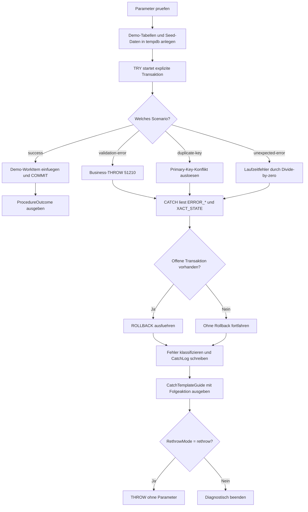

# ProcedureCatchBlockTemplate.sql

Dieses Skript zeigt ein konsistentes Template fuer `TRY...CATCH`-Bloecke in Prozeduren. Die Demo verbindet Transaktionsrahmen, Fehlerklassifikation, Rollback-Regel und optionales Rethrow zu einem Ablauf, der sich direkt auf eigene Stored Procedures uebertragen laesst.

## Uebersicht

<!-- SQLDOC:SUMMARY_TABLE:BEGIN -->
| Feld | Wert |
|---|---|
| Script | [ProcedureCatchBlockTemplate.sql](ProcedureCatchBlockTemplate.sql) |
| Version | `1.0` |
| Typ | `template` |
| Kapitel | `25_ErrorHandling_TryCatch` |
| Sicherheit | `read-only-tempdb` |
| Zweck | Liefert ein ausfuehrbares Template fuer konsistente `TRY...CATCH`-Bloecke in Prozeduren. |
<!-- SQLDOC:SUMMARY_TABLE:END -->

## Einordnung

Der Schwerpunkt liegt nicht auf einer einzelnen Fehlersorte, sondern auf der Form des `CATCH`-Blocks. Das Template sammelt zuerst die `ERROR_*()`-Metadaten, entscheidet danach ueber `ROLLBACK`, schreibt einen strukturierten Log-Eintrag und fuehrt erst ganz am Ende optional ein `THROW` ohne Parameter aus.

## Annahmen

- Das Skript ist eine didaktische Erstversion mit ausschliesslich temporaeren Objekten in `tempdb`.
- `dbo.usp_ProcessWorkItem` ist ein Platzhaltername fuer die spaetere Zielprozedur.
- Fehlernummern ab `51210` repraesentieren im Beispiel fachliche Validierungsfehler.
- `duplicate-key` und `unexpected-error` zeigen technische Fehlerpfade, damit das Template mehrere Catch-Kategorien abdeckt.

## Anwendungsfall

Das Template eignet sich fuer Prozeduren, die innerhalb einer expliziten Transaktion arbeiten und bei Fehlern konsistent zwischen Fachfehlern, Constraint-Konflikten und unerwarteten Laufzeitfehlern unterscheiden sollen. Ueber `@Scenario` kann jeder Pfad gezielt demonstriert werden.

## Parameter

<!-- SQLDOC:PARAMETERS_TABLE:BEGIN -->
| Parameter | SQL-Typ | Pflicht | Beschreibung |
|---|---|---|---|
| `@Scenario` | `VARCHAR(30)` | Nein | Waehlt `success`, `validation-error`, `duplicate-key` oder `unexpected-error`. |
| `@RethrowMode` | `VARCHAR(20)` | Nein | Steuert `diagnostics-only` oder `rethrow` nach dem Logging im `CATCH`. |
<!-- SQLDOC:PARAMETERS_TABLE:END -->

## Abhaengigkeiten

<!-- SQLDOC:DEPENDENCIES_LIST:BEGIN -->
- `tempdb` fuer temporaere Demo-Tabellen
- `TRY...CATCH`
- `THROW`
- `ERROR_*()`-Funktionen
- `XACT_STATE()`
- explizite Transaktionen und ein Primary-Key-Konflikt fuer den Technikpfad
<!-- SQLDOC:DEPENDENCIES_LIST:END -->

## Hinweise

- Im Erfolgsfall zeigt `ProcedureOutcome`, dass der `TRY`-Block mit `COMMIT` endet und kein `CATCH` benoetigt wird.
- Im Fehlerfall landen alle relevanten Metadaten zuerst in `CatchLog`, bevor eine Abschlussentscheidung getroffen wird.
- `CatchTemplateGuide` verdichtet den Ablauf zu vier Template-Schritten, die sich leicht in echte Prozeduren uebernehmen lassen.
- Mit `@RethrowMode = 'rethrow'` bleibt das Logging erhalten, waehrend der originale Fehlerkontext ueber `THROW;` weitergereicht wird.

## Versionshistorie

<!-- SQLDOC:VERSION_HISTORY_TABLE:BEGIN -->
| Version | Datum | User | Beschreibung |
|---|---|---|---|
| `1.0` | `2026-04-17` | `ER` | Erstversion fuer ein konsistentes Procedure-CATCH-Template |
<!-- SQLDOC:VERSION_HISTORY_TABLE:END -->

## Ablauf

<!-- SQLDOC:MERMAID:BEGIN -->

<!-- SQLDOC:MERMAID:END -->

## SQL-Code

<!-- SQLDOC:SQL_CODE:BEGIN -->
```sql
/*
BEGIN:SQL-HEADER v1
---
sql_header: v1
script_name: "ProcedureCatchBlockTemplate.sql"
script_version: "1.0"
script_type: "template"
chapter: "25_ErrorHandling_TryCatch"

purpose: >
  Liefert ein didaktisches, ausfuehrbares Template fuer konsistente
  TRY...CATCH-Bloecke in Prozeduren, inklusive Rollback-Regel,
  Fehlerklassifikation, Log-Kontext und optionalem Rethrow.

parameters:
  - name: "@Scenario"
    sql_type: "VARCHAR(30)"
    direction: "IN"
    required: false
    description: "Steuert, ob der Ablauf erfolgreich, fachlich oder technisch fehlschlaegt"
  - name: "@RethrowMode"
    sql_type: "VARCHAR(20)"
    direction: "IN"
    required: false
    description: "Bestimmt diagnostics-only oder rethrow nach dem CATCH-Logging"

result_sets:
  - name: "ProcedureOutcome"
    description: "Zeigt den erfolgreichen Template-Pfad mit Commit und Statusdaten"
  - name: "CatchLog"
    description: "Zeigt die im CATCH gesammelten Fehlerdaten und die empfohlene Folgeaktion"
  - name: "CatchTemplateGuide"
    description: "Verdichtet die CATCH-Entscheidung zu Rollback-, Logging- und Rethrow-Hinweisen"

dependencies:
  - "tempdb temporary tables"
  - "TRY...CATCH"
  - "THROW"
  - "ERROR_* functions"
  - "XACT_STATE"
  - "explicit transactions"
  - "primary key constraint"

safety:
  level: "read-only-tempdb"
  writes_data: false

documentation:
  markdown_file: "T-SQL/25_ErrorHandling_TryCatch/SQLScripts/ProcedureCatchBlockTemplate.md"
  sync_blocks:
    - "SUMMARY_TABLE"
    - "PARAMETERS_TABLE"
    - "DEPENDENCIES_LIST"
    - "VERSION_HISTORY_TABLE"
    - "SQL_CODE"
  mermaid:
    mode: "ai-agent-from-sql"
    source: "script-body"

main_responsible:
  name: "Erhard Rainer"
  initials: "ER"

version_history:
  - version: "1.0"
    date: "2026-04-17"
    user: "ER"
    description: "Erstversion fuer ein konsistentes Procedure-CATCH-Template"

notes:
  - "Das Skript arbeitet ausschliesslich mit tempdb-Objekten und simulierten Requests."
  - "Das Template zeigt einen klaren Ablauf fuer Rollback, Logging und optionales Rethrow."
---
END:SQL-HEADER v1
*/

SET NOCOUNT ON;
SET XACT_ABORT ON;

DECLARE @Scenario VARCHAR(30) = 'success';
DECLARE @RethrowMode VARCHAR(20) = 'diagnostics-only';

IF @Scenario NOT IN ('success', 'validation-error', 'duplicate-key', 'unexpected-error')
BEGIN
    THROW 51200, '@Scenario ist ungueltig.', 1;
END;

IF @RethrowMode NOT IN ('diagnostics-only', 'rethrow')
BEGIN
    THROW 51201, '@RethrowMode muss diagnostics-only oder rethrow sein.', 1;
END;

DROP TABLE IF EXISTS #WorkItems;
DROP TABLE IF EXISTS #ProcedureErrorLog;

CREATE TABLE #WorkItems
(
    WorkItemId INT NOT NULL PRIMARY KEY,
    RequestLabel VARCHAR(80) NOT NULL,
    ProcessingState VARCHAR(20) NOT NULL,
    RequestedBy SYSNAME NOT NULL
);

CREATE TABLE #ProcedureErrorLog
(
    LogId INT IDENTITY(1,1) NOT NULL PRIMARY KEY,
    ProcedureName SYSNAME NOT NULL,
    ScenarioName VARCHAR(30) NOT NULL,
    ErrorNumber INT NOT NULL,
    ErrorSeverity INT NOT NULL,
    ErrorState INT NOT NULL,
    ErrorLine INT NULL,
    ErrorProcedure SYSNAME NULL,
    ErrorMessage NVARCHAR(4000) NOT NULL,
    ErrorCategory VARCHAR(30) NOT NULL,
    XactStateAtCatch INT NOT NULL,
    TranCountAtCatch INT NOT NULL,
    RollbackAction VARCHAR(30) NOT NULL,
    RecommendedAction NVARCHAR(200) NOT NULL,
    RethrowMode VARCHAR(20) NOT NULL,
    LoggedAt DATETIME2(0) NOT NULL
);

INSERT INTO #WorkItems
(
    WorkItemId,
    RequestLabel,
    ProcessingState,
    RequestedBy
)
VALUES
    (1001, 'Existing baseline row', 'seeded', 'trainer.seed');

BEGIN TRY
    BEGIN TRANSACTION;

    IF @Scenario = 'validation-error'
    BEGIN
        THROW 51210, 'Die Demo-Validierung verhindert die Prozedurausfuehrung.', 1;
    END;

    IF @Scenario = 'duplicate-key'
    BEGIN
        INSERT INTO #WorkItems
        (
            WorkItemId,
            RequestLabel,
            ProcessingState,
            RequestedBy
        )
        VALUES
        (
            1001,
            'Duplicate key demo row',
            'staged',
            'trainer.demo'
        );
    END
    ELSE IF @Scenario = 'unexpected-error'
    BEGIN
        DECLARE @ForceDivideByZero INT = 1 / 0;
        SELECT @ForceDivideByZero AS ForceDivideByZero;
    END
    ELSE
    BEGIN
        INSERT INTO #WorkItems
        (
            WorkItemId,
            RequestLabel,
            ProcessingState,
            RequestedBy
        )
        VALUES
        (
            2001,
            'Procedure template demo row',
            'committed',
            'trainer.demo'
        );
    END;

    COMMIT TRANSACTION;

    SELECT
        CAST('dbo.usp_ProcessWorkItem' AS SYSNAME) AS ProcedureName,
        @Scenario AS ScenarioName,
        CAST('committed' AS VARCHAR(20)) AS OutcomeStatus,
        COUNT(*) AS VisibleRowsAfterCommit,
        MAX(CASE WHEN WorkItemId = 2001 THEN RequestLabel END) AS InsertedDemoRow,
        CAST('TRY-Block erfolgreich beendet; CATCH bleibt ungenutzt.' AS NVARCHAR(120)) AS TeachingNote
    FROM #WorkItems;
END TRY
BEGIN CATCH
    DECLARE
        @ErrorNumber INT = ERROR_NUMBER(),
        @ErrorSeverity INT = ERROR_SEVERITY(),
        @ErrorState INT = ERROR_STATE(),
        @ErrorLine INT = ERROR_LINE(),
        @ErrorProcedure SYSNAME = ERROR_PROCEDURE(),
        @ErrorMessage NVARCHAR(4000) = ERROR_MESSAGE(),
        @XactStateAtCatch INT = XACT_STATE(),
        @TranCountAtCatch INT = @@TRANCOUNT,
        @ErrorCategory VARCHAR(30),
        @RollbackAction VARCHAR(30),
        @RecommendedAction NVARCHAR(200);

    SET @ErrorCategory =
        CASE
            WHEN @ErrorNumber BETWEEN 51210 AND 51299 THEN 'business-validation'
            WHEN @ErrorNumber IN (2601, 2627) THEN 'constraint'
            ELSE 'unexpected'
        END;

    SET @RollbackAction =
        CASE
            WHEN @XactStateAtCatch <> 0 THEN 'rollback-issued'
            ELSE 'no-open-transaction'
        END;

    IF @XactStateAtCatch <> 0
    BEGIN
        ROLLBACK TRANSACTION;
    END;

    SET @RecommendedAction =
        CASE
            WHEN @ErrorCategory = 'business-validation' THEN N'Fehlermeldung fuer den Caller uebernehmen und keine technischen Details maskieren.'
            WHEN @ErrorCategory = 'constraint' THEN N'Konflikt fachlich oder technisch beheben; unveraenderte Wiederholung fuehrt erneut zum Fehler.'
            ELSE N'Fehler protokollieren, Ursache untersuchen und nur bei bewusstem Template-Wunsch erneut werfen.'
        END;

    INSERT INTO #ProcedureErrorLog
    (
        ProcedureName,
        ScenarioName,
        ErrorNumber,
        ErrorSeverity,
        ErrorState,
        ErrorLine,
        ErrorProcedure,
        ErrorMessage,
        ErrorCategory,
        XactStateAtCatch,
        TranCountAtCatch,
        RollbackAction,
        RecommendedAction,
        RethrowMode,
        LoggedAt
    )
    VALUES
    (
        'dbo.usp_ProcessWorkItem',
        @Scenario,
        @ErrorNumber,
        @ErrorSeverity,
        @ErrorState,
        @ErrorLine,
        @ErrorProcedure,
        @ErrorMessage,
        @ErrorCategory,
        @XactStateAtCatch,
        @TranCountAtCatch,
        @RollbackAction,
        @RecommendedAction,
        @RethrowMode,
        SYSDATETIME()
    );

    SELECT
        pel.LogId,
        pel.ProcedureName,
        pel.ScenarioName,
        pel.ErrorNumber,
        pel.ErrorSeverity,
        pel.ErrorState,
        pel.ErrorLine,
        pel.ErrorProcedure,
        pel.ErrorMessage,
        pel.ErrorCategory,
        pel.XactStateAtCatch,
        pel.TranCountAtCatch,
        pel.RollbackAction,
        pel.RecommendedAction,
        pel.RethrowMode,
        pel.LoggedAt
    FROM #ProcedureErrorLog AS pel;

    SELECT
        CAST('1. Fehlerdaten aus ERROR_* lesen' AS NVARCHAR(80)) AS CatchStep,
        CAST(@RollbackAction AS NVARCHAR(30)) AS RollbackDecision,
        CAST(@ErrorCategory AS NVARCHAR(30)) AS ErrorCategory,
        CAST(@RecommendedAction AS NVARCHAR(200)) AS RecommendedAction,
        CAST(
            CASE
                WHEN @RethrowMode = 'rethrow' THEN 'THROW ohne Parameter nach Logging ausfuehren'
                ELSE 'Diagnose ausgeben und kontrolliert beenden'
            END AS NVARCHAR(80)
        ) AS FinalStep;

    IF @RethrowMode = 'rethrow'
    BEGIN
        THROW;
    END;
END CATCH;
```
<!-- SQLDOC:SQL_CODE:END -->
