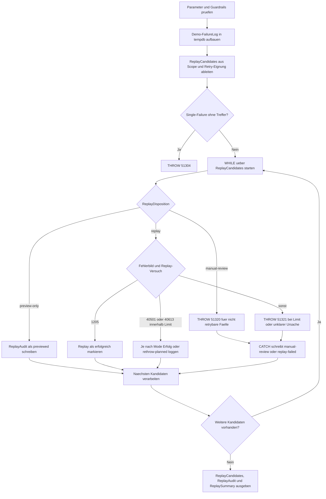

# ProcedureFailureLogReplay.sql

Dieses Skript zeigt, wie eine protokollierte Fehlerliste in eine didaktische Replay-Worklist ueberfuehrt werden kann. Der Ablauf trennt dabei zwischen reinen Vorschauen, retrybaren Fehlern und Faellen, die bewusst nur fuer manuelle Nacharbeit markiert werden.

## Uebersicht

<!-- SQLDOC:SUMMARY_TABLE:BEGIN -->
| Feld | Wert |
|---|---|
| Script | [ProcedureFailureLogReplay.sql](ProcedureFailureLogReplay.sql) |
| Version | `1.0` |
| Typ | `didactic-lab` |
| Kapitel | `25_ErrorHandling_TryCatch` |
| Sicherheit | `read-only-tempdb` |
| Zweck | Spielt protokollierte Fehlerfaelle als Replay-Queue nach und zeigt Replay- oder Review-Entscheidungen. |
<!-- SQLDOC:SUMMARY_TABLE:END -->

## Einordnung

Der Schwerpunkt liegt auf der Frage, wie ein Fehlerlog in eine nachvollziehbare Replay-Entscheidung uebersetzt wird. Das Skript baut erst einen Demo-Katalog von Failure-Eintraegen auf, leitet daraus Replay-Kandidaten ab und verarbeitet diese dann in einer `WHILE`-Schleife mit internem `TRY...CATCH`.

## Annahmen

- Das Skript verwendet ausschliesslich temporaere Tabellen in `tempdb` und simulierte Failure-Log-Daten.
- Retrybare Fehler werden didaktisch ueber die Fehlernummern `1205`, `40501` und `40613` abgebildet.
- Nicht retrybare Eintraege werden nicht automatisch erneut gestartet, sondern gezielt als `manual-review` markiert.
- `simulate-rethrow` modelliert nur die Folgereaktion eines Orchestrators und fuehrt keinen echten aeusseren Replay-Controller aus.

## Anwendungsfall

Das Skript eignet sich fuer Trainings zu `TRY...CATCH`, Retry-Policies und Replay-Orchestrierung. Es zeigt, wie eine Prozedur nach einem Fehlerlog zwischen Vorschau, erneutem Versuch und manueller Eskalation unterscheiden kann, ohne produktive Tabellen zu veraendern.

## Parameter

<!-- SQLDOC:PARAMETERS_TABLE:BEGIN -->
| Parameter | SQL-Typ | Pflicht | Beschreibung |
|---|---|---|---|
| `@ReplayScope` | `VARCHAR(20)` | Nein | Waehlt `all`, `retryable-only` oder `single-failure`. |
| `@FailureId` | `INT` | Nein | Filtert optional genau einen Failure-Log-Eintrag. |
| `@ReplayMode` | `VARCHAR(20)` | Nein | Steuert `preview`, `simulate-replay` oder `simulate-rethrow`. |
| `@MaxReplayAttempts` | `TINYINT` | Nein | Begrenzt Replay-Versuche fuer retrybare Faelle. |
<!-- SQLDOC:PARAMETERS_TABLE:END -->

## Abhaengigkeiten

<!-- SQLDOC:DEPENDENCIES_LIST:BEGIN -->
- `tempdb` fuer temporaere Demo-Tabellen
- `TRY...CATCH`
- `THROW`
- `WHILE`
- Window Functions ueber `ROW_NUMBER()`
- `CASE` fuer Replay-Disposition und Folgeaktionen
<!-- SQLDOC:DEPENDENCIES_LIST:END -->

## Hinweise

- `ReplayCandidates` zeigt die Worklist vor der eigentlichen Verarbeitung, inklusive geplanter Aktion.
- `ReplayAudit` dokumentiert pro Failure-Eintrag, ob der Kandidat nur betrachtet, erfolgreich replayt oder zur manuellen Nacharbeit markiert wurde.
- `ReplaySummary` verdichtet die Ergebnisse nach Disposition und Outcome, damit sich Replay-Regeln leichter vergleichen lassen.
- Fuer `single-failure` wird ein Guardrail gesetzt, damit ein nicht vorhandener Demo-Eintrag klar als Fehler endet.

## Versionshistorie

<!-- SQLDOC:VERSION_HISTORY_TABLE:BEGIN -->
| Version | Datum | User | Beschreibung |
|---|---|---|---|
| `1.0` | `2026-04-17` | `ER` | Erstversion fuer ein didaktisches Replay-Lab auf Basis einer Fehlerlogtabelle |
<!-- SQLDOC:VERSION_HISTORY_TABLE:END -->

## Ablauf

<!-- SQLDOC:MERMAID:BEGIN -->

<!-- SQLDOC:MERMAID:END -->

## SQL-Code

<!-- SQLDOC:SQL_CODE:BEGIN -->
```sql
/*
BEGIN:SQL-HEADER v1
---
sql_header: v1
script_name: "ProcedureFailureLogReplay.sql"
script_version: "1.0"
script_type: "didactic-lab"
chapter: "25_ErrorHandling_TryCatch"

purpose: >
  Spielt protokollierte Fehlerfaelle aus einer Demo-Logtabelle als
  Replay-Queue nach und zeigt, welche Eintraege erneut versucht, nur
  begutachtet oder fuer manuellen Eingriff markiert werden.

parameters:
  - name: "@ReplayScope"
    sql_type: "VARCHAR(20)"
    direction: "IN"
    required: false
    description: "Waehlt all, retryable-only oder single-failure"
  - name: "@FailureId"
    sql_type: "INT"
    direction: "IN"
    required: false
    description: "Optionaler Filter fuer genau einen FailureLog-Eintrag"
  - name: "@ReplayMode"
    sql_type: "VARCHAR(20)"
    direction: "IN"
    required: false
    description: "preview, simulate-replay oder simulate-rethrow"
  - name: "@MaxReplayAttempts"
    sql_type: "TINYINT"
    direction: "IN"
    required: false
    description: "Begrenzt Replay-Versuche fuer retrybare Eintraege"

result_sets:
  - name: "ReplayCandidates"
    description: "Zeigt die gefilterte Replay-Worklist mit Disposition und naechster Aktion"
  - name: "ReplayAudit"
    description: "Zeigt pro bearbeitetem Failure-Eintrag Ergebnis, Catch-Details und Folgeaktion"
  - name: "ReplaySummary"
    description: "Verdichtet die Replay-Ergebnisse nach Disposition und Outcome"

dependencies:
  - "tempdb temporary tables"
  - "TRY...CATCH"
  - "THROW"
  - "WHILE"
  - "window functions"
  - "CASE"

safety:
  level: "read-only-tempdb"
  writes_data: false

documentation:
  markdown_file: "T-SQL/25_ErrorHandling_TryCatch/SQLScripts/ProcedureFailureLogReplay.md"
  sync_blocks:
    - "SUMMARY_TABLE"
    - "PARAMETERS_TABLE"
    - "DEPENDENCIES_LIST"
    - "VERSION_HISTORY_TABLE"
    - "SQL_CODE"
  mermaid:
    mode: "ai-agent-from-sql"
    source: "script-body"

main_responsible:
  name: "Erhard Rainer"
  initials: "ER"

version_history:
  - version: "1.0"
    date: "2026-04-17"
    user: "ER"
    description: "Erstversion fuer ein didaktisches Replay-Lab auf Basis einer Fehlerlogtabelle"

notes:
  - "Das Skript verwendet nur tempdb-Objekte und simulierte Failure-Logs."
  - "Replay-Entscheidungen sind didaktische Muster und keine produktive Orchestrierungslogik."
---
END:SQL-HEADER v1
*/

SET NOCOUNT ON;
SET XACT_ABORT ON;

DECLARE @ReplayScope VARCHAR(20) = 'all';
DECLARE @FailureId INT = NULL;
DECLARE @ReplayMode VARCHAR(20) = 'simulate-replay';
DECLARE @MaxReplayAttempts TINYINT = 3;

IF @ReplayScope NOT IN ('all', 'retryable-only', 'single-failure')
BEGIN
    THROW 51300, '@ReplayScope muss all, retryable-only oder single-failure sein.', 1;
END;

IF @ReplayMode NOT IN ('preview', 'simulate-replay', 'simulate-rethrow')
BEGIN
    THROW 51301, '@ReplayMode muss preview, simulate-replay oder simulate-rethrow sein.', 1;
END;

IF @MaxReplayAttempts NOT BETWEEN 1 AND 5
BEGIN
    THROW 51302, '@MaxReplayAttempts muss zwischen 1 und 5 liegen.', 1;
END;

IF @ReplayScope = 'single-failure' AND @FailureId IS NULL
BEGIN
    THROW 51303, '@FailureId ist fuer ReplayScope = single-failure erforderlich.', 1;
END;

DROP TABLE IF EXISTS #FailureLog;
DROP TABLE IF EXISTS #ReplayCandidates;
DROP TABLE IF EXISTS #ReplayAudit;

CREATE TABLE #FailureLog
(
    FailureId INT NOT NULL PRIMARY KEY,
    ProcedureName SYSNAME NOT NULL,
    FailedAt DATETIME2(0) NOT NULL,
    ErrorNumber INT NOT NULL,
    ErrorClass VARCHAR(20) NOT NULL,
    RetryRecommended BIT NOT NULL,
    RetryGroup VARCHAR(20) NOT NULL,
    LastKnownAttempt TINYINT NOT NULL,
    RequestLabel VARCHAR(80) NOT NULL,
    ErrorMessage NVARCHAR(300) NOT NULL
);

CREATE TABLE #ReplayCandidates
(
    ReplayOrdinal INT NOT NULL PRIMARY KEY,
    FailureId INT NOT NULL,
    ProcedureName SYSNAME NOT NULL,
    FailedAt DATETIME2(0) NOT NULL,
    ErrorNumber INT NOT NULL,
    ErrorClass VARCHAR(20) NOT NULL,
    RetryRecommended BIT NOT NULL,
    RetryGroup VARCHAR(20) NOT NULL,
    LastKnownAttempt TINYINT NOT NULL,
    RequestLabel VARCHAR(80) NOT NULL,
    ErrorMessage NVARCHAR(300) NOT NULL,
    ReplayDisposition VARCHAR(20) NOT NULL,
    PlannedAction NVARCHAR(160) NOT NULL
);

CREATE TABLE #ReplayAudit
(
    AuditId INT IDENTITY(1,1) NOT NULL PRIMARY KEY,
    FailureId INT NOT NULL,
    ProcedureName SYSNAME NOT NULL,
    ReplayMode VARCHAR(20) NOT NULL,
    ReplayDisposition VARCHAR(20) NOT NULL,
    ReplayAttempt TINYINT NOT NULL,
    OutcomeStatus VARCHAR(30) NOT NULL,
    OriginalErrorNumber INT NOT NULL,
    ReplayErrorNumber INT NULL,
    ReplayErrorMessage NVARCHAR(4000) NULL,
    RecommendedNextStep NVARCHAR(220) NOT NULL,
    ProcessedAt DATETIME2(0) NOT NULL
);

INSERT INTO #FailureLog
(
    FailureId,
    ProcedureName,
    FailedAt,
    ErrorNumber,
    ErrorClass,
    RetryRecommended,
    RetryGroup,
    LastKnownAttempt,
    RequestLabel,
    ErrorMessage
)
VALUES
    (101, 'dbo.usp_ProcessOrderImport', DATEADD(MINUTE, -95, SYSDATETIME()), 1205, 'retryable', 1, 'concurrency', 1, 'order-1001.csv', N'Deadlock victim during order import transaction.'),
    (102, 'dbo.usp_ProcessOrderImport', DATEADD(MINUTE, -72, SYSDATETIME()), 40501, 'retryable', 1, 'service-busy', 2, 'order-1002.csv', N'Azure SQL throttling interrupted the import batch.'),
    (103, 'dbo.usp_ProcessOrderImport', DATEADD(MINUTE, -48, SYSDATETIME()), 2627, 'non-retryable', 0, 'constraint', 1, 'order-1003.csv', N'Duplicate business key would fail again without data correction.'),
    (104, 'dbo.usp_ProcessInvoiceClose', DATEADD(MINUTE, -33, SYSDATETIME()), 50011, 'non-retryable', 0, 'business-validation', 1, 'invoice-7743', N'Invoice cannot be closed while approval is still pending.'),
    (105, 'dbo.usp_ProcessOrderImport', DATEADD(MINUTE, -18, SYSDATETIME()), 40613, 'retryable', 1, 'database-reconnect', 1, 'order-1004.csv', N'Database was temporarily unavailable during replay candidate capture.');

;WITH FilteredFailures AS
(
    SELECT
        fl.FailureId,
        fl.ProcedureName,
        fl.FailedAt,
        fl.ErrorNumber,
        fl.ErrorClass,
        fl.RetryRecommended,
        fl.RetryGroup,
        fl.LastKnownAttempt,
        fl.RequestLabel,
        fl.ErrorMessage
    FROM #FailureLog AS fl
    WHERE (@ReplayScope = 'all')
       OR (@ReplayScope = 'retryable-only' AND fl.RetryRecommended = 1)
       OR (@ReplayScope = 'single-failure' AND fl.FailureId = @FailureId)
),
CandidateCatalog AS
(
    SELECT
        ROW_NUMBER() OVER (ORDER BY ff.RetryRecommended DESC, ff.FailedAt, ff.FailureId) AS ReplayOrdinal,
        ff.FailureId,
        ff.ProcedureName,
        ff.FailedAt,
        ff.ErrorNumber,
        ff.ErrorClass,
        ff.RetryRecommended,
        ff.RetryGroup,
        ff.LastKnownAttempt,
        ff.RequestLabel,
        ff.ErrorMessage,
        CASE
            WHEN @ReplayMode = 'preview' THEN 'preview-only'
            WHEN ff.RetryRecommended = 1 THEN 'replay'
            ELSE 'manual-review'
        END AS ReplayDisposition,
        CASE
            WHEN @ReplayMode = 'preview' THEN N'Nur Vorschau; kein Replay-Aufruf.'
            WHEN ff.RetryRecommended = 1 THEN N'Replay-Simulation mit internem TRY...CATCH ausfuehren.'
            ELSE N'Nicht automatisch replayen; Fach- oder Datenkorrektur anstossen.'
        END AS PlannedAction
    FROM FilteredFailures AS ff
)
INSERT INTO #ReplayCandidates
(
    ReplayOrdinal,
    FailureId,
    ProcedureName,
    FailedAt,
    ErrorNumber,
    ErrorClass,
    RetryRecommended,
    RetryGroup,
    LastKnownAttempt,
    RequestLabel,
    ErrorMessage,
    ReplayDisposition,
    PlannedAction
)
SELECT
    cc.ReplayOrdinal,
    cc.FailureId,
    cc.ProcedureName,
    cc.FailedAt,
    cc.ErrorNumber,
    cc.ErrorClass,
    cc.RetryRecommended,
    cc.RetryGroup,
    cc.LastKnownAttempt,
    cc.RequestLabel,
    cc.ErrorMessage,
    cc.ReplayDisposition,
    cc.PlannedAction
FROM CandidateCatalog AS cc;

IF @ReplayScope = 'single-failure' AND NOT EXISTS
(
    SELECT 1
    FROM #ReplayCandidates AS rc
)
BEGIN
    THROW 51304, 'Der angegebene FailureId-Eintrag wurde in der Demo-Logtabelle nicht gefunden.', 1;
END;

DECLARE
    @ReplayOrdinal INT = 1,
    @ReplayCount INT = (SELECT COUNT(*) FROM #ReplayCandidates),
    @CurrentFailureId INT,
    @CurrentProcedureName SYSNAME,
    @CurrentErrorNumber INT,
    @CurrentRetryRecommended BIT,
    @CurrentRetryGroup VARCHAR(20),
    @CurrentLastKnownAttempt TINYINT,
    @CurrentDisposition VARCHAR(20),
    @ReplayAttempt TINYINT;

WHILE @ReplayOrdinal <= @ReplayCount
BEGIN
    SELECT
        @CurrentFailureId = rc.FailureId,
        @CurrentProcedureName = rc.ProcedureName,
        @CurrentErrorNumber = rc.ErrorNumber,
        @CurrentRetryRecommended = rc.RetryRecommended,
        @CurrentRetryGroup = rc.RetryGroup,
        @CurrentLastKnownAttempt = rc.LastKnownAttempt,
        @CurrentDisposition = rc.ReplayDisposition
    FROM #ReplayCandidates AS rc
    WHERE rc.ReplayOrdinal = @ReplayOrdinal;

    SET @ReplayAttempt = @CurrentLastKnownAttempt + 1;

    BEGIN TRY
        IF @CurrentDisposition = 'preview-only'
        BEGIN
            INSERT INTO #ReplayAudit
            (
                FailureId,
                ProcedureName,
                ReplayMode,
                ReplayDisposition,
                ReplayAttempt,
                OutcomeStatus,
                OriginalErrorNumber,
                ReplayErrorNumber,
                ReplayErrorMessage,
                RecommendedNextStep,
                ProcessedAt
            )
            VALUES
            (
                @CurrentFailureId,
                @CurrentProcedureName,
                @ReplayMode,
                @CurrentDisposition,
                @ReplayAttempt,
                'previewed',
                @CurrentErrorNumber,
                NULL,
                NULL,
                N'Kandidat nur sichten und danach Replay-Freigabe separat entscheiden.',
                SYSDATETIME()
            );
        END
        ELSE IF @CurrentRetryRecommended = 0
        BEGIN
            THROW 51320, 'Der Failure-Eintrag ist nicht retrybar und wird nur fuer manuelle Nacharbeit markiert.', 1;
        END
        ELSE IF @CurrentErrorNumber = 1205
        BEGIN
            INSERT INTO #ReplayAudit
            (
                FailureId,
                ProcedureName,
                ReplayMode,
                ReplayDisposition,
                ReplayAttempt,
                OutcomeStatus,
                OriginalErrorNumber,
                ReplayErrorNumber,
                ReplayErrorMessage,
                RecommendedNextStep,
                ProcessedAt
            )
            VALUES
            (
                @CurrentFailureId,
                @CurrentProcedureName,
                @ReplayMode,
                @CurrentDisposition,
                @ReplayAttempt,
                'replayed-successfully',
                @CurrentErrorNumber,
                NULL,
                NULL,
                N'Deadlock-Fall gilt als erfolgreich replayt; idempotente Wiederaufnahme dokumentieren.',
                SYSDATETIME()
            );
        END
        ELSE IF @CurrentErrorNumber IN (40501, 40613) AND @ReplayAttempt <= @MaxReplayAttempts
        BEGIN
            INSERT INTO #ReplayAudit
            (
                FailureId,
                ProcedureName,
                ReplayMode,
                ReplayDisposition,
                ReplayAttempt,
                OutcomeStatus,
                OriginalErrorNumber,
                ReplayErrorNumber,
                ReplayErrorMessage,
                RecommendedNextStep,
                ProcessedAt
            )
            VALUES
            (
                @CurrentFailureId,
                @CurrentProcedureName,
                @ReplayMode,
                @CurrentDisposition,
                @ReplayAttempt,
                CASE WHEN @ReplayMode = 'simulate-rethrow' THEN 'rethrow-planned' ELSE 'replayed-successfully' END,
                @CurrentErrorNumber,
                CASE WHEN @ReplayMode = 'simulate-rethrow' THEN @CurrentErrorNumber END,
                CASE WHEN @ReplayMode = 'simulate-rethrow' THEN N'Der Replay-Pfad wuerde den transienten Fehler nach Logging erneut werfen.' END,
                CASE
                    WHEN @ReplayMode = 'simulate-rethrow' THEN N'Nach Logging wuerde ein aeusserer Orchestrator den naechsten Versuch planen.'
                    ELSE N'Transienter Infrastrukturfehler wurde didaktisch als erfolgreich replayt markiert.'
                END,
                SYSDATETIME()
            );
        END
        ELSE
        BEGIN
            THROW 51321, 'Das Replay-Limit ist erreicht oder der Fehler muss ausserhalb des Skripts untersucht werden.', 1;
        END;
    END TRY
    BEGIN CATCH
        INSERT INTO #ReplayAudit
        (
            FailureId,
            ProcedureName,
            ReplayMode,
            ReplayDisposition,
            ReplayAttempt,
            OutcomeStatus,
            OriginalErrorNumber,
            ReplayErrorNumber,
            ReplayErrorMessage,
            RecommendedNextStep,
            ProcessedAt
        )
        VALUES
        (
            @CurrentFailureId,
            @CurrentProcedureName,
            @ReplayMode,
            @CurrentDisposition,
            @ReplayAttempt,
            CASE
                WHEN @CurrentRetryRecommended = 0 THEN 'manual-review-required'
                ELSE 'replay-failed'
            END,
            @CurrentErrorNumber,
            ERROR_NUMBER(),
            ERROR_MESSAGE(),
            CASE
                WHEN @CurrentRetryRecommended = 0 THEN N'Fachliche oder datenbezogene Korrektur vor erneutem Lauf einplanen.'
                WHEN @CurrentRetryGroup = 'service-busy' THEN N'Backoff oder Plattformzustand pruefen, bevor ein weiterer Replay-Lauf gestartet wird.'
                ELSE N'Fehlerursache untersuchen und Replay-Regel anpassen.'
            END,
            SYSDATETIME()
        );
    END CATCH;

    SET @ReplayOrdinal += 1;
END;

SELECT
    rc.ReplayOrdinal,
    rc.FailureId,
    rc.ProcedureName,
    rc.FailedAt,
    rc.ErrorNumber,
    rc.ErrorClass,
    rc.RetryRecommended,
    rc.RetryGroup,
    rc.LastKnownAttempt,
    rc.RequestLabel,
    rc.ReplayDisposition,
    rc.PlannedAction
FROM #ReplayCandidates AS rc
ORDER BY
    rc.ReplayOrdinal;

SELECT
    ra.AuditId,
    ra.FailureId,
    ra.ProcedureName,
    ra.ReplayMode,
    ra.ReplayDisposition,
    ra.ReplayAttempt,
    ra.OutcomeStatus,
    ra.OriginalErrorNumber,
    ra.ReplayErrorNumber,
    ra.ReplayErrorMessage,
    ra.RecommendedNextStep,
    ra.ProcessedAt
FROM #ReplayAudit AS ra
ORDER BY
    ra.AuditId;

SELECT
    rc.ReplayDisposition,
    ra.OutcomeStatus,
    COUNT(*) AS FailureCount,
    MIN(ra.ReplayAttempt) AS MinReplayAttempt,
    MAX(ra.ReplayAttempt) AS MaxReplayAttempt,
    STRING_AGG(CAST(ra.FailureId AS VARCHAR(12)), ', ') WITHIN GROUP (ORDER BY ra.FailureId) AS FailureIds
FROM #ReplayCandidates AS rc
INNER JOIN #ReplayAudit AS ra
    ON ra.FailureId = rc.FailureId
GROUP BY
    rc.ReplayDisposition,
    ra.OutcomeStatus
ORDER BY
    rc.ReplayDisposition,
    ra.OutcomeStatus;
```
<!-- SQLDOC:SQL_CODE:END -->
