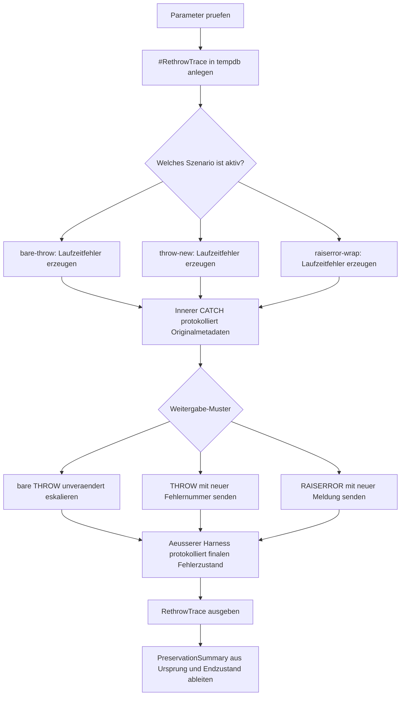

# RethrowPreserveContextDemo.sql

Dieses Skript stellt drei kleine Fehlerpfade gegenueber, um den Unterschied zwischen sauberem `THROW;` und neu formulierten Signalen aus dem `CATCH` sichtbar zu machen. Im Mittelpunkt steht dabei, welche Fehler-Metadaten nach aussen unveraendert erhalten bleiben.

## Uebersicht

<!-- SQLDOC:SUMMARY_TABLE:BEGIN -->
| Feld | Wert |
|---|---|
| Script | [RethrowPreserveContextDemo.sql](RethrowPreserveContextDemo.sql) |
| Version | `1.0` |
| Typ | `didactic-lab` |
| Kapitel | `25_ErrorHandling_TryCatch` |
| Sicherheit | `read-only-tempdb` |
| Zweck | Vergleicht sauberes Rethrow mit `THROW;` gegen Kontextverlust bei neu formulierten Fehlersignalen. |
<!-- SQLDOC:SUMMARY_TABLE:END -->

## Einordnung

Das Lab trennt bewusst zwischen dem Originalfehler im inneren `CATCH` und dem Zustand, der nach der Weitergabe im aeusseren Harness ankommt. Dadurch laesst sich ohne produktive Nebenwirkungen nachvollziehen, warum `THROW;` fuer die unveraenderte Fehlerweitergabe meist das robustere Muster ist.

## Annahmen

- Das Skript ist eine didaktische Erstversion und arbeitet ausschliesslich mit dynamischen Demo-Batches sowie einer temporaeren Trace-Tabelle.
- Der aeussere Harness dient nur der Beobachtbarkeit; in echtem Anwendungscode wuerde der eskalierte Fehler oft direkt an den Aufrufer weitergehen.
- `throw-new` und `raiserror-wrap` sind absichtlich als Gegenbeispiele modelliert, um Kontextverlust sichtbar zu machen.
- Fehlende `ERROR_PROCEDURE()`-Werte aus dynamischen Batches werden in der Auswertung als `<ad hoc batch>` dargestellt.

## Anwendungsfall

Das Skript eignet sich fuer Schulungen, Code-Reviews und Modernisierungsdiskussionen rund um Fehlerweitergabe in Stored Procedures oder Batch-Jobs. Besonders nuetzlich ist es, wenn Teams entscheiden muessen, ob ein vorhandener Fehler unveraendert eskaliert oder bewusst in ein neues Signal umgeformt werden soll.

## Parameter

<!-- SQLDOC:PARAMETERS_TABLE:BEGIN -->
| Parameter | SQL-Typ | Pflicht | Beschreibung |
|---|---|---|---|
| `@ScenarioFilter` | `VARCHAR(30)` | Nein | Fuehrt `bare-throw`, `throw-new`, `raiserror-wrap` oder alle Szenarien aus. |
| `@IncludeLegacyWrap` | `BIT` | Nein | Deaktiviert bei `0` den `RAISERROR`-Weitergabepfad als Legacy-Gegenbeispiel. |
<!-- SQLDOC:PARAMETERS_TABLE:END -->

## Abhaengigkeiten

<!-- SQLDOC:DEPENDENCIES_LIST:BEGIN -->
- `tempdb` fuer die temporaere Trace-Tabelle
- `sys.sp_executesql`
- `TRY...CATCH`
- `THROW`
- `RAISERROR`
- `ERROR_*()`-Funktionen
<!-- SQLDOC:DEPENDENCIES_LIST:END -->

## Hinweise

- `RethrowTrace` zeigt pro Szenario erst den Originalfehler im inneren `CATCH` und danach den Fehlerzustand im aeusseren Harness.
- `PreservationSummary` vergleicht Fehlernummer, State, Zeile und Procedure zwischen Ursprung und weitergegebenem Signal.
- `bare-throw` ist das Referenzmuster fuer unveraenderte Eskalation.
- `throw-new` und `raiserror-wrap` demonstrieren bewusst, dass neue Signale zwar erklaerenden Text liefern koennen, aber den technischen Ursprung nicht mehr unveraendert transportieren.

## Versionshistorie

<!-- SQLDOC:VERSION_HISTORY_TABLE:BEGIN -->
| Version | Datum | User | Beschreibung |
|---|---|---|---|
| `1.0` | `2026-04-17` | `ER` | Erstversion fuer den Vergleich von sauberem Rethrow und Kontextverlust |
<!-- SQLDOC:VERSION_HISTORY_TABLE:END -->

## Ablauf

<!-- SQLDOC:MERMAID:BEGIN -->

<!-- SQLDOC:MERMAID:END -->

## SQL-Code

<!-- SQLDOC:SQL_CODE:BEGIN -->
```sql
/*
BEGIN:SQL-HEADER v1
---
sql_header: v1
script_name: "RethrowPreserveContextDemo.sql"
script_version: "1.0"
script_type: "didactic-lab"
chapter: "25_ErrorHandling_TryCatch"

purpose: >
  Demonstriert den Unterschied zwischen sauberem Rethrow mit THROW; und
  neu formulierten Fehlersignalen im CATCH, damit sichtbar wird, wann
  Fehlernummer, State und Ursprungszeile erhalten bleiben oder verloren gehen.

parameters:
  - name: "@ScenarioFilter"
    sql_type: "VARCHAR(30)"
    direction: "IN"
    required: false
    description: "Waehlt bare-throw, throw-new, raiserror-wrap oder all fuer alle Vergleichspfade"
  - name: "@IncludeLegacyWrap"
    sql_type: "BIT"
    direction: "IN"
    required: false
    description: "0 ueberspringt den RAISERROR-Weitergabepfad als Legacy-Gegenbeispiel"

result_sets:
  - name: "RethrowTrace"
    description: "Zeigt Originalfehler im inneren CATCH und den spaeteren Zustand im aeusseren Harness"
  - name: "PreservationSummary"
    description: "Vergleicht den Erhalt von Fehlernummer, State und Zeile pro Szenario"

dependencies:
  - "tempdb temporary tables"
  - "sp_executesql"
  - "TRY...CATCH"
  - "THROW"
  - "RAISERROR"
  - "ERROR_* functions"

safety:
  level: "read-only-tempdb"
  writes_data: false

documentation:
  markdown_file: "T-SQL/25_ErrorHandling_TryCatch/SQLScripts/RethrowPreserveContextDemo.md"
  sync_blocks:
    - "SUMMARY_TABLE"
    - "PARAMETERS_TABLE"
    - "DEPENDENCIES_LIST"
    - "VERSION_HISTORY_TABLE"
    - "SQL_CODE"
  mermaid:
    mode: "ai-agent-from-sql"
    source: "script-body"

main_responsible:
  name: "Erhard Rainer"
  initials: "ER"

version_history:
  - version: "1.0"
    date: "2026-04-17"
    user: "ER"
    description: "Erstversion fuer den Vergleich von sauberem Rethrow und Kontextverlust"

notes:
  - "Das Skript nutzt einen aeusseren Harness, damit auch eskalierte Fehler kontrolliert verglichen werden koennen."
  - "Bare THROW im CATCH ist das Referenzmuster fuer unveraenderte Fehlerweitergabe."
---
END:SQL-HEADER v1
*/

SET NOCOUNT ON;

DECLARE @ScenarioFilter VARCHAR(30) = 'all';
DECLARE @IncludeLegacyWrap BIT = 1;

IF @ScenarioFilter NOT IN ('all', 'bare-throw', 'throw-new', 'raiserror-wrap')
BEGIN
    THROW 51060, '@ScenarioFilter muss all, bare-throw, throw-new oder raiserror-wrap sein.', 1;
END;

IF @IncludeLegacyWrap NOT IN (0, 1)
BEGIN
    THROW 51061, '@IncludeLegacyWrap muss 0 oder 1 sein.', 1;
END;

DROP TABLE IF EXISTS #RethrowTrace;

CREATE TABLE #RethrowTrace
(
    TraceId INT IDENTITY(1,1) NOT NULL PRIMARY KEY,
    ScenarioName VARCHAR(30) NOT NULL,
    StageName VARCHAR(40) NOT NULL,
    ErrorOrigin VARCHAR(20) NOT NULL,
    ErrorNumber INT NULL,
    ErrorSeverity INT NULL,
    ErrorState INT NULL,
    ErrorLine INT NULL,
    ErrorProcedure SYSNAME NULL,
    MessageText NVARCHAR(4000) NOT NULL,
    SortOrder INT NOT NULL
);

IF @ScenarioFilter IN ('all', 'bare-throw')
BEGIN
    BEGIN TRY
        EXEC sys.sp_executesql N'
            BEGIN TRY
                DECLARE @Numerator INT = 12;
                DECLARE @Denominator INT = 0;

                SELECT @Numerator / @Denominator AS TriggerDivideByZero;
            END TRY
            BEGIN CATCH
                INSERT INTO #RethrowTrace
                (
                    ScenarioName,
                    StageName,
                    ErrorOrigin,
                    ErrorNumber,
                    ErrorSeverity,
                    ErrorState,
                    ErrorLine,
                    ErrorProcedure,
                    MessageText,
                    SortOrder
                )
                VALUES
                (
                    ''bare-throw'',
                    ''inner-catch-before-rethrow'',
                    ''original'',
                    ERROR_NUMBER(),
                    ERROR_SEVERITY(),
                    ERROR_STATE(),
                    ERROR_LINE(),
                    ERROR_PROCEDURE(),
                    ERROR_MESSAGE(),
                    10
                );

                THROW;
            END CATCH;';
    END TRY
    BEGIN CATCH
        INSERT INTO #RethrowTrace
        (
            ScenarioName,
            StageName,
            ErrorOrigin,
            ErrorNumber,
            ErrorSeverity,
            ErrorState,
            ErrorLine,
            ErrorProcedure,
            MessageText,
            SortOrder
        )
        VALUES
        (
            'bare-throw',
            'outer-harness-after-rethrow',
            'rethrow-result',
            ERROR_NUMBER(),
            ERROR_SEVERITY(),
            ERROR_STATE(),
            ERROR_LINE(),
            ERROR_PROCEDURE(),
            ERROR_MESSAGE(),
            20
        );
    END CATCH;
END;

IF @ScenarioFilter IN ('all', 'throw-new')
BEGIN
    BEGIN TRY
        EXEC sys.sp_executesql N'
            BEGIN TRY
                DECLARE @AmountText NVARCHAR(20) = N''not-a-number'';

                SELECT CAST(@AmountText AS INT) AS TriggerConversionError;
            END TRY
            BEGIN CATCH
                INSERT INTO #RethrowTrace
                (
                    ScenarioName,
                    StageName,
                    ErrorOrigin,
                    ErrorNumber,
                    ErrorSeverity,
                    ErrorState,
                    ErrorLine,
                    ErrorProcedure,
                    MessageText,
                    SortOrder
                )
                VALUES
                (
                    ''throw-new'',
                    ''inner-catch-before-new-throw'',
                    ''original'',
                    ERROR_NUMBER(),
                    ERROR_SEVERITY(),
                    ERROR_STATE(),
                    ERROR_LINE(),
                    ERROR_PROCEDURE(),
                    ERROR_MESSAGE(),
                    10
                );

                THROW 51062, N''Neu formulierter THROW aus dem CATCH verliert den Ursprungskontext.'', 1;
            END CATCH;';
    END TRY
    BEGIN CATCH
        INSERT INTO #RethrowTrace
        (
            ScenarioName,
            StageName,
            ErrorOrigin,
            ErrorNumber,
            ErrorSeverity,
            ErrorState,
            ErrorLine,
            ErrorProcedure,
            MessageText,
            SortOrder
        )
        VALUES
        (
            'throw-new',
            'outer-harness-after-new-throw',
            'rewrapped-result',
            ERROR_NUMBER(),
            ERROR_SEVERITY(),
            ERROR_STATE(),
            ERROR_LINE(),
            ERROR_PROCEDURE(),
            ERROR_MESSAGE(),
            20
        );
    END CATCH;
END;

IF @IncludeLegacyWrap = 1
   AND @ScenarioFilter IN ('all', 'raiserror-wrap')
BEGIN
    BEGIN TRY
        EXEC sys.sp_executesql N'
            BEGIN TRY
                DECLARE @InventoryCount INT = 8;
                DECLARE @ReservedCount INT = 0;

                SELECT @InventoryCount / @ReservedCount AS TriggerSecondDivideByZero;
            END TRY
            BEGIN CATCH
                INSERT INTO #RethrowTrace
                (
                    ScenarioName,
                    StageName,
                    ErrorOrigin,
                    ErrorNumber,
                    ErrorSeverity,
                    ErrorState,
                    ErrorLine,
                    ErrorProcedure,
                    MessageText,
                    SortOrder
                )
                VALUES
                (
                    ''raiserror-wrap'',
                    ''inner-catch-before-raiserror'',
                    ''original'',
                    ERROR_NUMBER(),
                    ERROR_SEVERITY(),
                    ERROR_STATE(),
                    ERROR_LINE(),
                    ERROR_PROCEDURE(),
                    ERROR_MESSAGE(),
                    10
                );

                DECLARE @WrappedMessage NVARCHAR(4000) =
                    N''RAISERROR verpackt den Originalfehler neu: '' + ERROR_MESSAGE();

                RAISERROR(@WrappedMessage, 16, 1);
            END CATCH;';
    END TRY
    BEGIN CATCH
        INSERT INTO #RethrowTrace
        (
            ScenarioName,
            StageName,
            ErrorOrigin,
            ErrorNumber,
            ErrorSeverity,
            ErrorState,
            ErrorLine,
            ErrorProcedure,
            MessageText,
            SortOrder
        )
        VALUES
        (
            'raiserror-wrap',
            'outer-harness-after-raiserror',
            'rewrapped-result',
            ERROR_NUMBER(),
            ERROR_SEVERITY(),
            ERROR_STATE(),
            ERROR_LINE(),
            ERROR_PROCEDURE(),
            ERROR_MESSAGE(),
            20
        );
    END CATCH;
END;

SELECT
    rt.TraceId,
    rt.ScenarioName,
    rt.StageName,
    rt.ErrorOrigin,
    rt.ErrorNumber,
    rt.ErrorSeverity,
    rt.ErrorState,
    COALESCE(rt.ErrorProcedure, '<ad hoc batch>') AS ErrorProcedure,
    rt.ErrorLine,
    rt.MessageText
FROM #RethrowTrace AS rt
ORDER BY
    rt.ScenarioName,
    rt.SortOrder,
    rt.TraceId;

WITH ScenarioPivot AS
(
    SELECT
        rt.ScenarioName,
        MAX(CASE WHEN rt.ErrorOrigin = 'original' THEN rt.ErrorNumber END) AS OriginalErrorNumber,
        MAX(CASE WHEN rt.ErrorOrigin = 'original' THEN rt.ErrorState END) AS OriginalErrorState,
        MAX(CASE WHEN rt.ErrorOrigin = 'original' THEN rt.ErrorLine END) AS OriginalErrorLine,
        MAX(CASE WHEN rt.ErrorOrigin = 'original' THEN COALESCE(rt.ErrorProcedure, '<ad hoc batch>') END) AS OriginalErrorProcedure,
        MAX(CASE WHEN rt.ErrorOrigin <> 'original' THEN rt.ErrorNumber END) AS FinalErrorNumber,
        MAX(CASE WHEN rt.ErrorOrigin <> 'original' THEN rt.ErrorState END) AS FinalErrorState,
        MAX(CASE WHEN rt.ErrorOrigin <> 'original' THEN rt.ErrorLine END) AS FinalErrorLine,
        MAX(CASE WHEN rt.ErrorOrigin <> 'original' THEN COALESCE(rt.ErrorProcedure, '<ad hoc batch>') END) AS FinalErrorProcedure,
        MAX(CASE WHEN rt.ErrorOrigin <> 'original' THEN rt.MessageText END) AS FinalMessage
    FROM #RethrowTrace AS rt
    GROUP BY
        rt.ScenarioName
)
SELECT
    sp.ScenarioName,
    sp.OriginalErrorNumber,
    sp.FinalErrorNumber,
    sp.OriginalErrorState,
    sp.FinalErrorState,
    sp.OriginalErrorLine,
    sp.FinalErrorLine,
    sp.OriginalErrorProcedure,
    sp.FinalErrorProcedure,
    CASE
        WHEN sp.OriginalErrorNumber = sp.FinalErrorNumber
         AND sp.OriginalErrorState = sp.FinalErrorState
         AND sp.OriginalErrorLine = sp.FinalErrorLine
         AND sp.OriginalErrorProcedure = sp.FinalErrorProcedure THEN 'preserved'
        ELSE 'changed'
    END AS ContextPreservation,
    CASE
        WHEN sp.ScenarioName = 'bare-throw' THEN 'Bare THROW behaelt Fehlernummer, State und Ursprungszeile des Originalfehlers.'
        WHEN sp.ScenarioName = 'throw-new' THEN 'THROW mit neuer Nummer erzeugt ein neues Fehlersignal und ersetzt den alten Kontext.'
        ELSE 'RAISERROR aus dem CATCH formt ebenfalls ein neues Signal und verliert den direkten Ursprung.'
    END AS Interpretation,
    sp.FinalMessage
FROM ScenarioPivot AS sp
ORDER BY
    CASE sp.ScenarioName
        WHEN 'bare-throw' THEN 1
        WHEN 'throw-new' THEN 2
        WHEN 'raiserror-wrap' THEN 3
        ELSE 99
    END;
```
<!-- SQLDOC:SQL_CODE:END -->
