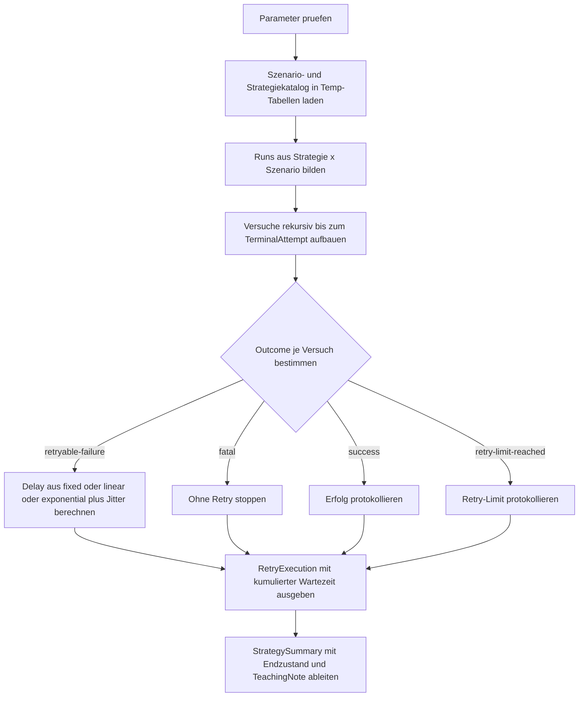

# RetryDelayBackoffDemo.sql

Dieses Skript demonstriert feste, lineare und exponentielle Backoff-Strategien fuer retrybare SQL-Fehler. Statt echter Wartezeiten protokolliert das Lab bewusst nur die geplanten Delay-Werte, damit der Retry-Ablauf reproduzierbar und schnell bleibt.

## Uebersicht

<!-- SQLDOC:SUMMARY_TABLE:BEGIN -->
| Feld | Wert |
|---|---|
| Script | [RetryDelayBackoffDemo.sql](RetryDelayBackoffDemo.sql) |
| Version | `1.0` |
| Typ | `didactic-lab` |
| Kapitel | `25_ErrorHandling_TryCatch` |
| Sicherheit | `read-only-tempdb` |
| Zweck | Demonstriert feste, lineare und exponentielle Backoff-Strategien fuer retrybare SQL-Fehler. |
<!-- SQLDOC:SUMMARY_TABLE:END -->

## Einordnung

Das Lab trennt bewusst zwischen retrybaren Infrastrukturfehlern und nicht retrybaren Validierungsfehlern. So wird sichtbar, dass eine Retry-Schleife nicht nur eine Delay-Formel braucht, sondern vor allem eine klare Regel, wann ueberhaupt erneut versucht werden darf.

## Annahmen

- Das Skript ist eine didaktische Erstversion und arbeitet ausschliesslich mit `tempdb`-Objekten.
- Fehlernummern wie `1205` und `40501` werden als typische retrybare Beispiele simuliert.
- Die Ausgabe zeigt geplante Wartezeiten, fuehrt aber keine echten `WAITFOR`-Pausen aus.
- Jitter wird deterministisch aus Strategie, Szenario und Versuch abgeleitet, damit die Demo stabil bleibt.

## Anwendungsfall

Das Skript eignet sich fuer Schulungen, Reviews und Architekturgespraeche rund um Retry-Policies in Stored Procedures, ETL-Jobs und Integrationsschichten. Es zeigt, warum fixe Delays fuer kurze Stoerungen reichen koennen, exponentielles Backoff bei Throttling aber meist robuster reagiert.

## Parameter

<!-- SQLDOC:PARAMETERS_TABLE:BEGIN -->
| Parameter | SQL-Typ | Pflicht | Beschreibung |
|---|---|---|---|
| `@ScenarioFilter` | `VARCHAR(40)` | Nein | Waehlt ein einzelnes Fehlerszenario oder `all`. |
| `@StrategyFilter` | `VARCHAR(20)` | Nein | Waehlt `fixed`, `linear`, `exponential` oder `all`. |
| `@MaxRetries` | `INT` | Nein | Begrenzt die Anzahl zusaetzlicher Retry-Versuche nach dem Erstversuch. |
| `@BaseDelayMs` | `INT` | Nein | Definiert den Basisschritt fuer die Delay-Berechnung in Millisekunden. |
| `@MaxDelayMs` | `INT` | Nein | Setzt die Obergrenze fuer die geplante Wartezeit pro Retry. |
<!-- SQLDOC:PARAMETERS_TABLE:END -->

## Abhaengigkeiten

<!-- SQLDOC:DEPENDENCIES_LIST:BEGIN -->
- `tempdb` fuer die temporaeren Demo-Tabellen
- `DATEADD`
- `POWER`
- Window Functions fuer kumulierte Wartezeiten
<!-- SQLDOC:DEPENDENCIES_LIST:END -->

## Hinweise

- `RetryExecution` zeigt jeden Versuch mit Fehlerklasse, Delay-Plan und naechster Aktion.
- `StrategySummary` verdichtet pro Strategie und Szenario Endzustand und Gesamtwartezeit.
- `validation-stop` endet absichtlich ohne Retry, damit der Unterschied zu transienten Fehlern sichtbar bleibt.
- Das Skript ist ein didaktisches Planungslab und kein produktionsfertiger Retry-Wrapper.

## Versionshistorie

<!-- SQLDOC:VERSION_HISTORY_TABLE:BEGIN -->
| Version | Datum | User | Beschreibung |
|---|---|---|---|
| `1.0` | `2026-04-17` | `ER` | Erstversion fuer ein didaktisches Backoff- und Retry-Lab |
<!-- SQLDOC:VERSION_HISTORY_TABLE:END -->

## Ablauf

<!-- SQLDOC:MERMAID:BEGIN -->

<!-- SQLDOC:MERMAID:END -->

## SQL-Code

<!-- SQLDOC:SQL_CODE:BEGIN -->
`sql
/*
BEGIN:SQL-HEADER v1
---
sql_header: v1
script_name: "RetryDelayBackoffDemo.sql"
script_version: "1.0"
script_type: "didactic-lab"
chapter: "25_ErrorHandling_TryCatch"

purpose: >
  Demonstriert feste, lineare und exponentielle Backoff-Strategien fuer
  retrybare Fehler anhand simulierten Deadlock-, Throttling- und
  Validierungs-Szenarien.

parameters:
  - name: "@ScenarioFilter"
    sql_type: "VARCHAR(40)"
    direction: "IN"
    required: false
    description: "Waehlt ein einzelnes Fehlerszenario oder all"
  - name: "@StrategyFilter"
    sql_type: "VARCHAR(20)"
    direction: "IN"
    required: false
    description: "Waehlt fixed, linear, exponential oder all"
  - name: "@MaxRetries"
    sql_type: "INT"
    direction: "IN"
    required: false
    description: "Maximale Anzahl zusaetzlicher Retries nach dem Erstversuch"
  - name: "@BaseDelayMs"
    sql_type: "INT"
    direction: "IN"
    required: false
    description: "Basisschritt in Millisekunden fuer die Delay-Berechnung"
  - name: "@MaxDelayMs"
    sql_type: "INT"
    direction: "IN"
    required: false
    description: "Obergrenze fuer die geplante Wartezeit pro Retry"

result_sets:
  - name: "RetryExecution"
    description: "Zeigt jeden simulierten Versuch mit Fehlerklasse, Delay-Plan und naechster Aktion"
  - name: "StrategySummary"
    description: "Verdichtet Endzustand und Gesamtwartezeit je Strategie und Szenario"

dependencies:
  - "tempdb temporary tables"
  - "DATEADD"
  - "POWER"
  - "window functions"

safety:
  level: "read-only-tempdb"
  writes_data: false

documentation:
  markdown_file: "T-SQL/25_ErrorHandling_TryCatch/SQLScripts/RetryDelayBackoffDemo.md"
  sync_blocks:
    - "SUMMARY_TABLE"
    - "PARAMETERS_TABLE"
    - "DEPENDENCIES_LIST"
    - "VERSION_HISTORY_TABLE"
    - "SQL_CODE"
  mermaid:
    mode: "ai-agent-from-sql"
    source: "script-body"

main_responsible:
  name: "Erhard Rainer"
  initials: "ER"

version_history:
  - version: "1.0"
    date: "2026-04-17"
    user: "ER"
    description: "Erstversion fuer ein didaktisches Backoff- und Retry-Lab"

notes:
  - "Das Skript simuliert Fehler und protokolliert nur geplante Delays; es fuehrt keine echten WAITFOR-Pausen aus."
  - "Fehlernummern 1205 und 40501 dienen als typische retrybare Beispiele."
---
END:SQL-HEADER v1
*/

SET NOCOUNT ON;

DECLARE @ScenarioFilter VARCHAR(40) = 'all';
DECLARE @StrategyFilter VARCHAR(20) = 'all';
DECLARE @MaxRetries INT = 4;
DECLARE @BaseDelayMs INT = 200;
DECLARE @MaxDelayMs INT = 2000;

IF @ScenarioFilter NOT IN ('all', 'deadlock-recovery', 'service-throttle', 'validation-stop')
    THROW 51050, '@ScenarioFilter ist ungueltig.', 1;
IF @StrategyFilter NOT IN ('all', 'fixed', 'linear', 'exponential')
    THROW 51051, '@StrategyFilter ist ungueltig.', 1;
IF @MaxRetries NOT BETWEEN 0 AND 10
    THROW 51052, '@MaxRetries muss zwischen 0 und 10 liegen.', 1;
IF @BaseDelayMs NOT BETWEEN 50 AND 5000
    THROW 51053, '@BaseDelayMs muss zwischen 50 und 5000 liegen.', 1;
IF @MaxDelayMs < @BaseDelayMs OR @MaxDelayMs > 10000
    THROW 51054, '@MaxDelayMs muss mindestens @BaseDelayMs und hoechstens 10000 sein.', 1;

DROP TABLE IF EXISTS #ScenarioCatalog;
DROP TABLE IF EXISTS #StrategyCatalog;

CREATE TABLE #ScenarioCatalog
(
    ScenarioName VARCHAR(40) NOT NULL PRIMARY KEY,
    SuccessAttempt INT NULL,
    ErrorNumber INT NOT NULL,
    ErrorSeverity INT NOT NULL,
    ErrorState INT NOT NULL,
    ErrorClass VARCHAR(20) NOT NULL,
    FailureMessage NVARCHAR(200) NOT NULL
);

CREATE TABLE #StrategyCatalog
(
    StrategyName VARCHAR(20) NOT NULL PRIMARY KEY,
    StrategySort INT NOT NULL
);

INSERT INTO #ScenarioCatalog (ScenarioName, SuccessAttempt, ErrorNumber, ErrorSeverity, ErrorState, ErrorClass, FailureMessage)
VALUES
    ('deadlock-recovery', 3, 1205, 13, 1, 'retryable', N'Deadlock victim wird simuliert; ein Folgeversuch kann erfolgreich sein.'),
    ('service-throttle', 5, 40501, 16, 1, 'retryable', N'Service Busy wird simuliert; laengere Delays sollen die Last entspannen.'),
    ('validation-stop', NULL, 50001, 16, 1, 'non-retryable', N'Fachliche Validierung wird simuliert; Retries aendern den Zustand nicht.');

INSERT INTO #StrategyCatalog (StrategyName, StrategySort)
VALUES ('fixed', 1), ('linear', 2), ('exponential', 3);

;WITH SelectedRuns AS
(
    SELECT
        st.StrategyName,
        sc.ScenarioName,
        sc.SuccessAttempt,
        sc.ErrorNumber,
        sc.ErrorSeverity,
        sc.ErrorState,
        sc.ErrorClass,
        sc.FailureMessage,
        CASE
            WHEN sc.ErrorClass = 'non-retryable' THEN 1
            WHEN sc.SuccessAttempt IS NOT NULL AND sc.SuccessAttempt <= @MaxRetries + 1 THEN sc.SuccessAttempt
            ELSE @MaxRetries + 1
        END AS TerminalAttempt
    FROM #StrategyCatalog AS st
    CROSS JOIN #ScenarioCatalog AS sc
    WHERE (@StrategyFilter = 'all' OR st.StrategyName = @StrategyFilter)
      AND (@ScenarioFilter = 'all' OR sc.ScenarioName = @ScenarioFilter)
),
Attempts AS
(
    SELECT
        sr.*,
        1 AS AttemptNo
    FROM SelectedRuns AS sr
    UNION ALL
    SELECT
        a.StrategyName,
        a.ScenarioName,
        a.SuccessAttempt,
        a.ErrorNumber,
        a.ErrorSeverity,
        a.ErrorState,
        a.ErrorClass,
        a.FailureMessage,
        a.TerminalAttempt,
        a.AttemptNo + 1
    FROM Attempts AS a
    WHERE a.AttemptNo < a.TerminalAttempt
),
AttemptLog AS
(
    SELECT
        a.StrategyName,
        a.ScenarioName,
        a.AttemptNo,
        CASE
            WHEN a.ErrorClass = 'non-retryable' THEN 'fatal'
            WHEN a.AttemptNo = a.TerminalAttempt AND a.SuccessAttempt = a.TerminalAttempt THEN 'success'
            WHEN a.AttemptNo = a.TerminalAttempt THEN 'retry-limit-reached'
            ELSE 'retryable-failure'
        END AS OutcomeClass,
        CAST(CASE WHEN a.ErrorClass = 'retryable' AND a.AttemptNo < a.TerminalAttempt THEN 1 ELSE 0 END AS BIT) AS IsRetryable,
        CASE WHEN a.ErrorClass = 'non-retryable' THEN a.ErrorNumber WHEN a.AttemptNo < a.TerminalAttempt OR a.AttemptNo = a.TerminalAttempt AND a.SuccessAttempt IS NULL THEN a.ErrorNumber END AS ErrorNumber,
        CASE WHEN a.ErrorClass = 'non-retryable' THEN a.ErrorSeverity WHEN a.AttemptNo < a.TerminalAttempt OR a.AttemptNo = a.TerminalAttempt AND a.SuccessAttempt IS NULL THEN a.ErrorSeverity END AS ErrorSeverity,
        CASE WHEN a.ErrorClass = 'non-retryable' THEN a.ErrorState WHEN a.AttemptNo < a.TerminalAttempt OR a.AttemptNo = a.TerminalAttempt AND a.SuccessAttempt IS NULL THEN a.ErrorState END AS ErrorState,
        CASE
            WHEN a.ErrorClass = 'retryable' AND a.AttemptNo < a.TerminalAttempt THEN
                CASE
                    WHEN
                        CASE a.StrategyName
                            WHEN 'fixed' THEN @BaseDelayMs
                            WHEN 'linear' THEN @BaseDelayMs * a.AttemptNo
                            ELSE @BaseDelayMs * POWER(2, a.AttemptNo - 1)
                        END + ABS(CHECKSUM(CONCAT(a.StrategyName, ':', a.ScenarioName, ':', a.AttemptNo))) % 75 > @MaxDelayMs
                    THEN @MaxDelayMs
                    ELSE
                        CASE a.StrategyName
                            WHEN 'fixed' THEN @BaseDelayMs
                            WHEN 'linear' THEN @BaseDelayMs * a.AttemptNo
                            ELSE @BaseDelayMs * POWER(2, a.AttemptNo - 1)
                        END + ABS(CHECKSUM(CONCAT(a.StrategyName, ':', a.ScenarioName, ':', a.AttemptNo))) % 75
                END
        END AS PlannedDelayMs,
        CASE
            WHEN a.ErrorClass = 'non-retryable' THEN 'stop-fatal'
            WHEN a.AttemptNo = a.TerminalAttempt AND a.SuccessAttempt = a.TerminalAttempt THEN 'stop-success'
            WHEN a.AttemptNo = a.TerminalAttempt THEN 'stop-limit'
            ELSE 'schedule-retry'
        END AS NextAction,
        CASE
            WHEN a.ErrorClass = 'non-retryable' THEN a.FailureMessage + N' Kein Retry.'
            WHEN a.AttemptNo = a.TerminalAttempt AND a.SuccessAttempt = a.TerminalAttempt THEN N'Versuch ' + CAST(a.AttemptNo AS NVARCHAR(10)) + N' erreicht den Erfolgspfad.'
            WHEN a.AttemptNo = a.TerminalAttempt THEN N'Die retrybare Stoerung besteht fort, aber das Retry-Limit ist erreicht.'
            ELSE a.FailureMessage + N' Backoff nach Strategie ' + a.StrategyName + N' plant den naechsten Versuch.'
        END AS DetailMessage
    FROM Attempts AS a
),
RetryExecution AS
(
    SELECT
        ROW_NUMBER() OVER (ORDER BY CASE StrategyName WHEN 'fixed' THEN 1 WHEN 'linear' THEN 2 ELSE 3 END, CASE ScenarioName WHEN 'deadlock-recovery' THEN 1 WHEN 'service-throttle' THEN 2 ELSE 3 END, AttemptNo) AS ExecutionId,
        al.StrategyName,
        al.ScenarioName,
        al.AttemptNo,
        al.OutcomeClass,
        al.IsRetryable,
        al.ErrorNumber,
        al.ErrorSeverity,
        al.ErrorState,
        al.PlannedDelayMs,
        CASE WHEN al.PlannedDelayMs IS NOT NULL THEN CONVERT(CHAR(12), DATEADD(MILLISECOND, al.PlannedDelayMs, CAST('00:00:00.000' AS DATETIME)), 114) END AS PlannedDelayClock,
        SUM(ISNULL(al.PlannedDelayMs, 0)) OVER (PARTITION BY al.StrategyName, al.ScenarioName ORDER BY al.AttemptNo ROWS UNBOUNDED PRECEDING) AS CumulativeDelayMs,
        al.NextAction,
        al.DetailMessage
    FROM AttemptLog AS al
)
SELECT
    re.ExecutionId,
    re.StrategyName,
    re.ScenarioName,
    re.AttemptNo,
    re.OutcomeClass,
    re.IsRetryable,
    re.ErrorNumber,
    re.ErrorSeverity,
    re.ErrorState,
    re.PlannedDelayMs,
    re.PlannedDelayClock,
    re.CumulativeDelayMs,
    re.NextAction,
    re.DetailMessage
FROM RetryExecution AS re
ORDER BY
    re.ExecutionId;

;WITH SelectedRuns AS
(
    SELECT
        st.StrategyName,
        sc.ScenarioName,
        sc.SuccessAttempt,
        sc.ErrorClass
    FROM #StrategyCatalog AS st
    CROSS JOIN #ScenarioCatalog AS sc
    WHERE (@StrategyFilter = 'all' OR st.StrategyName = @StrategyFilter)
      AND (@ScenarioFilter = 'all' OR sc.ScenarioName = @ScenarioFilter)
),
Attempts AS
(
    SELECT
        sr.StrategyName,
        sr.ScenarioName,
        CASE
            WHEN sr.ErrorClass = 'non-retryable' THEN 1
            WHEN sr.SuccessAttempt IS NOT NULL AND sr.SuccessAttempt <= @MaxRetries + 1 THEN sr.SuccessAttempt
            ELSE @MaxRetries + 1
        END AS FinalAttemptNo,
        sr.SuccessAttempt,
        sr.ErrorClass
    FROM SelectedRuns AS sr
),
RetryExecution AS
(
    SELECT
        st.StrategyName,
        sc.ScenarioName,
        a.FinalAttemptNo,
        CASE
            WHEN sc.ErrorClass = 'non-retryable' THEN 0
            WHEN st.StrategyName = 'fixed' AND a.FinalAttemptNo > 1 THEN (@BaseDelayMs * (a.FinalAttemptNo - 1))
            WHEN st.StrategyName = 'linear' AND a.FinalAttemptNo > 1 THEN (@BaseDelayMs * ((a.FinalAttemptNo - 1) * a.FinalAttemptNo / 2))
            WHEN st.StrategyName = 'exponential' AND a.FinalAttemptNo > 1 THEN NULL
            ELSE 0
        END AS FormulaHint,
        a.SuccessAttempt,
        sc.ErrorClass
    FROM #StrategyCatalog AS st
    CROSS JOIN #ScenarioCatalog AS sc
    INNER JOIN Attempts AS a
        ON a.StrategyName = st.StrategyName
       AND a.ScenarioName = sc.ScenarioName
    WHERE (@StrategyFilter = 'all' OR st.StrategyName = @StrategyFilter)
      AND (@ScenarioFilter = 'all' OR sc.ScenarioName = @ScenarioFilter)
),
AttemptLog AS
(
    SELECT
        re.StrategyName,
        re.ScenarioName,
        re.FinalAttemptNo,
        SUM(
            CASE
                WHEN nums.AttemptNo < re.FinalAttemptNo AND re.ErrorClass = 'retryable' THEN
                    CASE
                        WHEN
                            CASE re.StrategyName
                                WHEN 'fixed' THEN @BaseDelayMs
                                WHEN 'linear' THEN @BaseDelayMs * nums.AttemptNo
                                ELSE @BaseDelayMs * POWER(2, nums.AttemptNo - 1)
                            END + ABS(CHECKSUM(CONCAT(re.StrategyName, ':', re.ScenarioName, ':', nums.AttemptNo))) % 75 > @MaxDelayMs
                        THEN @MaxDelayMs
                        ELSE
                            CASE re.StrategyName
                                WHEN 'fixed' THEN @BaseDelayMs
                                WHEN 'linear' THEN @BaseDelayMs * nums.AttemptNo
                                ELSE @BaseDelayMs * POWER(2, nums.AttemptNo - 1)
                            END + ABS(CHECKSUM(CONCAT(re.StrategyName, ':', re.ScenarioName, ':', nums.AttemptNo))) % 75
                    END
                ELSE 0
            END
        ) AS TotalPlannedDelayMs,
        re.SuccessAttempt,
        re.ErrorClass
    FROM RetryExecution AS re
    CROSS APPLY
    (
        SELECT TOP (@MaxRetries + 1) ROW_NUMBER() OVER (ORDER BY (SELECT NULL)) AS AttemptNo
        FROM sys.all_objects
    ) AS nums
    GROUP BY
        re.StrategyName,
        re.ScenarioName,
        re.FinalAttemptNo,
        re.SuccessAttempt,
        re.ErrorClass
)
SELECT
    al.StrategyName,
    al.ScenarioName,
    al.FinalAttemptNo,
    al.TotalPlannedDelayMs,
    CASE
        WHEN al.ErrorClass = 'non-retryable' THEN 'stopped-non-retryable'
        WHEN al.SuccessAttempt IS NOT NULL AND al.SuccessAttempt <= @MaxRetries + 1 THEN 'recovered'
        ELSE 'stopped-retry-limit'
    END AS TerminalOutcome,
    CASE
        WHEN al.ScenarioName = 'deadlock-recovery' THEN 'Kurze Stoerung: selbst fixed oder linear koennen ausreichend sein.'
        WHEN al.ScenarioName = 'service-throttle' AND al.StrategyName = 'exponential' THEN 'Exponentielles Backoff streckt die Last am staerksten und ist fuer Throttling oft die robusteste Wahl.'
        WHEN al.ScenarioName = 'service-throttle' THEN 'Bei laengerem Throttling steigt die geplante Wartezeit sichtbar mit jeder Runde.'
        ELSE 'Nicht retrybare Fehler sollten direkt an den fachlichen Caller zurueckgegeben werden.'
    END AS TeachingNote
FROM AttemptLog AS al
ORDER BY
    CASE al.StrategyName WHEN 'fixed' THEN 1 WHEN 'linear' THEN 2 ELSE 3 END,
    CASE al.ScenarioName WHEN 'deadlock-recovery' THEN 1 WHEN 'service-throttle' THEN 2 ELSE 3 END
OPTION (MAXRECURSION 100);

```
<!-- SQLDOC:SQL_CODE:END -->

