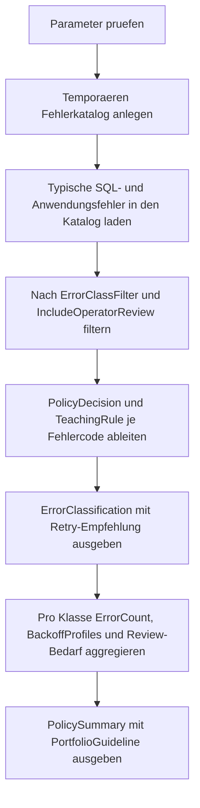

# RetryableErrorClassifier.sql

Dieses Skript klassifiziert typische SQL-Fehlercodes in einem didaktischen Katalog nach retrybar oder nicht retrybar. Die Ausgabe verbindet jeden Fehlercode mit einer knappen Policy-Entscheidung, damit Retry-Logik nicht pauschal auf alle Fehler angewendet wird.

## Uebersicht

<!-- SQLDOC:SUMMARY_TABLE:BEGIN -->
| Feld | Wert |
|---|---|
| Script | [RetryableErrorClassifier.sql](RetryableErrorClassifier.sql) |
| Version | `1.0` |
| Typ | `didactic-lab` |
| Kapitel | `25_ErrorHandling_TryCatch` |
| Sicherheit | `read-only-tempdb` |
| Zweck | Klassifiziert typische SQL-Fehlercodes nach retrybar oder nicht retrybar. |
<!-- SQLDOC:SUMMARY_TABLE:END -->

## Einordnung

Die Kernidee des Labs lautet: Nicht der `CATCH`-Block allein entscheidet ueber einen Retry, sondern eine vorab definierte Fehlerklassifikation. Dadurch bleiben Deadlocks oder Throttling von fachlichen Dubletten, Deploymentschaeden und Berechtigungsfehlern sauber getrennt.

## Annahmen

- Das Skript arbeitet mit einem kuratierten Demo-Katalog statt mit produktiven Fehlerprotokollen.
- Azure-SQL-Fehler wie `40501`, `40613` und `49918` dienen als typische transiente Beispiele mit Backoff-Bedarf.
- Constraint-, Berechtigungs- und fachliche `THROW`-Fehler werden als nicht retrybar behandelt, solange sich die Eingabe nicht aendert.
- `NeedsOperatorReview` markiert Faelle, die zwar klar nicht retrybar sind, aber zusaetzlich auf Betrieb oder Deployment hinweisen.

## Anwendungsfall

Das Skript eignet sich fuer Schulungen, Architektur-Reviews und Service-Templates, in denen eine Retry-Policy bewusst begrenzt werden soll. Es liefert sowohl eine feingranulare Liste pro Fehlercode als auch eine verdichtete Sicht pro Fehlerklasse.

## Parameter

<!-- SQLDOC:PARAMETERS_TABLE:BEGIN -->
| Parameter | SQL-Typ | Pflicht | Beschreibung |
|---|---|---|---|
| `@ErrorClassFilter` | `VARCHAR(20)` | Nein | Filtert `retryable`, `non-retryable` oder `all`. |
| `@IncludeOperatorReview` | `BIT` | Nein | Blendet bei `1` auch Betreiber- und Deployment-Hinweise ein. |
<!-- SQLDOC:PARAMETERS_TABLE:END -->

## Abhaengigkeiten

<!-- SQLDOC:DEPENDENCIES_LIST:BEGIN -->
- `tempdb` fuer den temporaeren Fehlerkatalog
- `CASE`
- `STRING_AGG`
- Window Functions fuer die laufende Klassifikations-ID
<!-- SQLDOC:DEPENDENCIES_LIST:END -->

## Hinweise

- `ErrorClassification` zeigt pro Fehlercode die Policy-Entscheidung `retry-with-guardrails` oder `fail-fast`.
- `TeachingRule` reduziert die Klassifikation auf eine schnell lesbare Handlungsempfehlung fuer Schulung und Review.
- `PolicySummary` verdichtet pro Klasse Anzahl, Backoff-Profile und Operator-Review-Bedarf.
- Das Lab ist absichtlich konservativ: Fachliche oder strukturelle Fehler werden nicht durch Zeitablauf geheilt.

## Versionshistorie

<!-- SQLDOC:VERSION_HISTORY_TABLE:BEGIN -->
| Version | Datum | User | Beschreibung |
|---|---|---|---|
| `1.0` | `2026-04-17` | `ER` | Erstversion fuer ein didaktisches Lab zur Retry-Klassifikation |
<!-- SQLDOC:VERSION_HISTORY_TABLE:END -->

## Ablauf

<!-- SQLDOC:MERMAID:BEGIN -->

<!-- SQLDOC:MERMAID:END -->

## SQL-Code

<!-- SQLDOC:SQL_CODE:BEGIN -->
```sql
/*
BEGIN:SQL-HEADER v1
---
sql_header: v1
script_name: "RetryableErrorClassifier.sql"
script_version: "1.0"
script_type: "didactic-lab"
chapter: "25_ErrorHandling_TryCatch"

purpose: >
  Klassifiziert typische SQL-Fehlercodes nach retrybar oder nicht
  retrybar und zeigt fuer jede Klasse eine knappe Handlungsregel fuer
  Retry-Policies in T-SQL-nahen Anwendungen.

parameters:
  - name: "@ErrorClassFilter"
    sql_type: "VARCHAR(20)"
    direction: "IN"
    required: false
    description: "Filtert retryable, non-retryable oder all"
  - name: "@IncludeOperatorReview"
    sql_type: "BIT"
    direction: "IN"
    required: false
    description: "1 blendet Hinweise fuer Operator-Review ein, 0 zeigt nur klare Policy-Faelle"

result_sets:
  - name: "ErrorClassification"
    description: "Zeigt pro Fehlercode Klasse, Retry-Empfehlung und didaktische Begruendung"
  - name: "PolicySummary"
    description: "Verdichtet pro Fehlerklasse Anzahl, typische Aktionen und Backoff-Hinweise"

dependencies:
  - "tempdb temporary tables"
  - "CASE"
  - "STRING_AGG"
  - "window functions"

safety:
  level: "read-only-tempdb"
  writes_data: false

documentation:
  markdown_file: "T-SQL/25_ErrorHandling_TryCatch/SQLScripts/RetryableErrorClassifier.md"
  sync_blocks:
    - "SUMMARY_TABLE"
    - "PARAMETERS_TABLE"
    - "DEPENDENCIES_LIST"
    - "VERSION_HISTORY_TABLE"
    - "SQL_CODE"
  mermaid:
    mode: "ai-agent-from-sql"
    source: "script-body"

main_responsible:
  name: "Erhard Rainer"
  initials: "ER"

version_history:
  - version: "1.0"
    date: "2026-04-17"
    user: "ER"
    description: "Erstversion fuer ein didaktisches Lab zur Retry-Klassifikation"

notes:
  - "Das Skript nutzt einen kuratierten Demo-Katalog statt produktiver Fehler-Logs."
  - "Die Klassifikation ist als Lehrmuster gedacht und ersetzt keine systemspezifische Betriebsrichtlinie."
---
END:SQL-HEADER v1
*/

SET NOCOUNT ON;

DECLARE @ErrorClassFilter VARCHAR(20) = 'all';
DECLARE @IncludeOperatorReview BIT = 1;

IF @ErrorClassFilter NOT IN ('all', 'retryable', 'non-retryable')
BEGIN
    THROW 51120, '@ErrorClassFilter muss all, retryable oder non-retryable sein.', 1;
END;

IF @IncludeOperatorReview NOT IN (0, 1)
BEGIN
    THROW 51121, '@IncludeOperatorReview muss 0 oder 1 sein.', 1;
END;

DROP TABLE IF EXISTS #ErrorCatalog;

CREATE TABLE #ErrorCatalog
(
    ErrorNumber INT NOT NULL PRIMARY KEY,
    ErrorLabel VARCHAR(80) NOT NULL,
    ErrorSource VARCHAR(30) NOT NULL,
    ErrorClass VARCHAR(20) NOT NULL,
    RetryRecommended BIT NOT NULL,
    SuggestedMaxRetries TINYINT NOT NULL,
    BackoffProfile VARCHAR(20) NOT NULL,
    NeedsOperatorReview BIT NOT NULL,
    Rationale NVARCHAR(300) NOT NULL,
    TypicalAction NVARCHAR(220) NOT NULL
);

INSERT INTO #ErrorCatalog
(
    ErrorNumber,
    ErrorLabel,
    ErrorSource,
    ErrorClass,
    RetryRecommended,
    SuggestedMaxRetries,
    BackoffProfile,
    NeedsOperatorReview,
    Rationale,
    TypicalAction
)
VALUES
    (1205, 'Deadlock victim', 'SQL Server', 'retryable', 1, 4, 'exponential', 0, N'Konkurrierende Transaktionen koennen beim naechsten Versuch bereits anders ineinandergreifen.', N'Kurzes Retry mit Jitter und idempotentem Aufruf einplanen.'),
    (1222, 'Lock request timeout', 'SQL Server', 'retryable', 1, 3, 'linear', 1, N'Der Fehler deutet oft auf temporaere Blockierung hin, sollte aber bei Haeufung analysiert werden.', N'Begrenzte Retries zulassen und Blockierungsursache pruefen.'),
    (40501, 'Service busy / throttling', 'Azure SQL', 'retryable', 1, 5, 'exponential', 0, N'Ressourcenengpaesse oder Throttling sind typischerweise transient und profitieren von wachsendem Backoff.', N'Exponentielles Backoff mit Obergrenze verwenden.'),
    (40613, 'Database unavailable', 'Azure SQL', 'retryable', 1, 4, 'exponential', 1, N'Kurzzeitige Umschaltungen oder Failover koennen die Datenbank voruebergehend unerreichbar machen.', N'Einige Retries versuchen und bei Serienfehlern Plattformstatus pruefen.'),
    (49918, 'Cannot process create or update request', 'Azure SQL', 'retryable', 1, 4, 'exponential', 1, N'Der Dienst meldet Kapazitaetsgrenzen, die sich nach kurzer Entlastung wieder entspannen koennen.', N'Retry mit exponentiellem Backoff und Telemetrie kombinieren.'),
    (2601, 'Cannot insert duplicate key row', 'SQL Server', 'non-retryable', 0, 0, 'none', 0, N'Dieselbe Eingabe verletzt stabil einen Eindeutigkeitskonflikt; ein unveraenderter Retry wuerde erneut scheitern.', N'Fachliche Dublette behandeln oder Upsert-Strategie korrigieren.'),
    (2627, 'Violation of primary key or unique constraint', 'SQL Server', 'non-retryable', 0, 0, 'none', 0, N'Persistente Schluesselverletzungen werden nicht durch Zeitablauf behoben.', N'Input pruefen, Konflikt aufloesen oder idempotente Logik nachziehen.'),
    (547, 'Constraint check violation', 'SQL Server', 'non-retryable', 0, 0, 'none', 0, N'Fremdschluessel- oder Check-Constraints deuten auf ungueltige Fachdaten oder falsche Reihenfolge hin.', N'Datenmodell oder Prozessreihenfolge korrigieren statt retryen.'),
    (18456, 'Login failed for user', 'SQL Server', 'non-retryable', 0, 0, 'none', 1, N'Authentifizierungsfehler verschwinden ohne Credential- oder Konfigurationsaenderung in der Regel nicht.', N'Credentials, Identitaet und Secret-Verwaltung pruefen.'),
    (229, 'Permission denied', 'SQL Server', 'non-retryable', 0, 0, 'none', 1, N'Fehlende Rechte sind ein Konfigurations- oder Rollenproblem, kein transienter Lastfehler.', N'Berechtigungen oder Ausfuehrungskontext anpassen.'),
    (207, 'Invalid column name', 'SQL Server', 'non-retryable', 0, 0, 'none', 1, N'Der Code oder das Deployment ist inkonsistent; Wiederholen derselben Anweisung bringt keinen Erkenntnisgewinn.', N'Deploymentstand und SQL-Code abgleichen.'),
    (50000, 'User-defined business validation', 'Application', 'non-retryable', 0, 0, 'none', 0, N'Bewusst geworfene Business-Fehler signalisieren fachliche Eingabeprobleme statt Infrastrukturstoerungen.', N'Fachliche Meldung an Caller geben und Eingabedaten korrigieren.');

;WITH FilteredCatalog AS
(
    SELECT
        ec.ErrorNumber,
        ec.ErrorLabel,
        ec.ErrorSource,
        ec.ErrorClass,
        ec.RetryRecommended,
        ec.SuggestedMaxRetries,
        ec.BackoffProfile,
        ec.NeedsOperatorReview,
        ec.Rationale,
        ec.TypicalAction
    FROM #ErrorCatalog AS ec
    WHERE (@ErrorClassFilter = 'all' OR ec.ErrorClass = @ErrorClassFilter)
      AND (@IncludeOperatorReview = 1 OR ec.NeedsOperatorReview = 0)
),
ErrorClassification AS
(
    SELECT
        ROW_NUMBER() OVER (ORDER BY CASE fc.ErrorClass WHEN 'retryable' THEN 1 ELSE 2 END, fc.ErrorNumber) AS ClassificationId,
        fc.ErrorNumber,
        fc.ErrorLabel,
        fc.ErrorSource,
        fc.ErrorClass,
        CAST(fc.RetryRecommended AS BIT) AS RetryRecommended,
        fc.SuggestedMaxRetries,
        fc.BackoffProfile,
        CAST(fc.NeedsOperatorReview AS BIT) AS NeedsOperatorReview,
        CASE
            WHEN fc.RetryRecommended = 1 THEN 'retry-with-guardrails'
            ELSE 'fail-fast'
        END AS PolicyDecision,
        CASE
            WHEN fc.RetryRecommended = 1 AND fc.BackoffProfile = 'exponential' THEN 'Retry nur mit Backoff und Idempotenzschutz.'
            WHEN fc.RetryRecommended = 1 THEN 'Nur wenige Retries und Ursache beobachten.'
            WHEN fc.NeedsOperatorReview = 1 THEN 'Nicht retryen; Betreiber oder Deployment pruefen.'
            ELSE 'Nicht retryen; Eingabe oder Fachlogik korrigieren.'
        END AS TeachingRule,
        fc.Rationale,
        fc.TypicalAction
    FROM FilteredCatalog AS fc
)
SELECT
    ec.ClassificationId,
    ec.ErrorNumber,
    ec.ErrorLabel,
    ec.ErrorSource,
    ec.ErrorClass,
    ec.RetryRecommended,
    ec.SuggestedMaxRetries,
    ec.BackoffProfile,
    ec.NeedsOperatorReview,
    ec.PolicyDecision,
    ec.TeachingRule,
    ec.Rationale,
    ec.TypicalAction
FROM ErrorClassification AS ec
ORDER BY
    ec.ClassificationId;

;WITH FilteredCatalog AS
(
    SELECT
        ec.ErrorClass,
        ec.RetryRecommended,
        ec.SuggestedMaxRetries,
        ec.BackoffProfile,
        ec.NeedsOperatorReview
    FROM #ErrorCatalog AS ec
    WHERE (@ErrorClassFilter = 'all' OR ec.ErrorClass = @ErrorClassFilter)
      AND (@IncludeOperatorReview = 1 OR ec.NeedsOperatorReview = 0)
),
BackoffProfileCatalog AS
(
    SELECT DISTINCT
        fc.ErrorClass,
        fc.BackoffProfile
    FROM FilteredCatalog AS fc
),
PolicySummary AS
(
    SELECT
        fc.ErrorClass,
        COUNT(*) AS ErrorCount,
        SUM(CASE WHEN fc.RetryRecommended = 1 THEN 1 ELSE 0 END) AS RetryableCount,
        MAX(fc.SuggestedMaxRetries) AS MaxSuggestedRetries,
        SUM(CASE WHEN fc.NeedsOperatorReview = 1 THEN 1 ELSE 0 END) AS OperatorReviewCount
    FROM FilteredCatalog AS fc
    GROUP BY
        fc.ErrorClass
),
PolicyProfiles AS
(
    SELECT
        bpc.ErrorClass,
        STRING_AGG(bpc.BackoffProfile, ', ') WITHIN GROUP (ORDER BY bpc.BackoffProfile) AS BackoffProfiles
    FROM BackoffProfileCatalog AS bpc
    GROUP BY
        bpc.ErrorClass
)
SELECT
    ps.ErrorClass,
    ps.ErrorCount,
    ps.RetryableCount,
    ps.MaxSuggestedRetries,
    pp.BackoffProfiles,
    ps.OperatorReviewCount,
    CASE
        WHEN ps.ErrorClass = 'retryable' THEN 'Retry-Policy mit Idempotenz, Jitter und Limit pflegen.'
        ELSE 'Fehler direkt melden und Ursache fachlich oder technisch beheben.'
    END AS PortfolioGuideline
FROM PolicySummary AS ps
INNER JOIN PolicyProfiles AS pp
    ON pp.ErrorClass = ps.ErrorClass
ORDER BY
    CASE ps.ErrorClass WHEN 'retryable' THEN 1 ELSE 2 END;
```
<!-- SQLDOC:SQL_CODE:END -->
