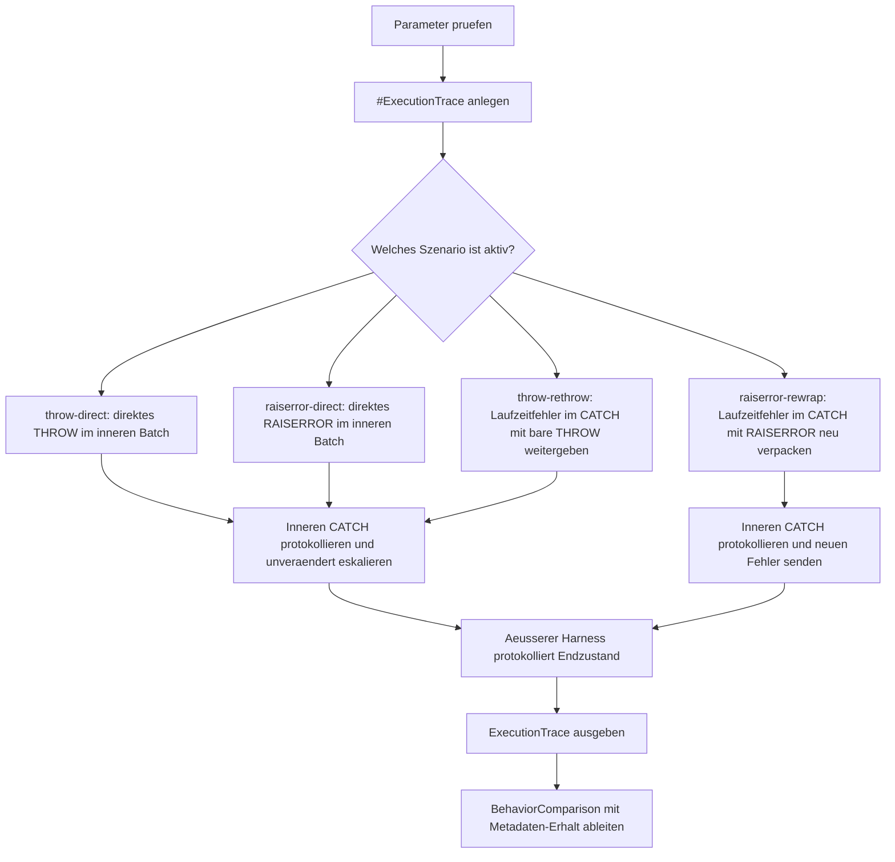

# ThrowRaiserrorBehaviorCompare.sql

Dieses Skript vergleicht vier typische Fehlerpfade rund um `THROW` und `RAISERROR`: direkte Signale sowie Weitergabe aus einem `CATCH`. Der Fokus liegt darauf, welche Fehler-Metadaten unveraendert bleiben und wo ein neuer Fehlerkontext entsteht.

## Uebersicht

<!-- SQLDOC:SUMMARY_TABLE:BEGIN -->
| Feld | Wert |
|---|---|
| Script | [ThrowRaiserrorBehaviorCompare.sql](ThrowRaiserrorBehaviorCompare.sql) |
| Version | `1.0` |
| Typ | `didactic-lab` |
| Kapitel | `25_ErrorHandling_TryCatch` |
| Sicherheit | `read-only-tempdb` |
| Zweck | Vergleicht direkte Signale und CATCH-Pfade von `THROW` und `RAISERROR`. |
<!-- SQLDOC:SUMMARY_TABLE:END -->

## Einordnung

Das Lab trennt bewusst zwischen zwei Fragestellungen: Welches Sprachmittel eignet sich fuer neue Fehler? Und welches Verhalten entsteht, wenn ein vorhandener Fehler aus dem `CATCH` weitergegeben wird? Dazu wird jeder innere Batch von einem aeusseren Harness eingefasst, damit auch eskalierte Fehler kontrolliert protokolliert werden koennen.

## Annahmen

- Das Skript ist eine didaktische Erstversion und arbeitet ausschliesslich mit `tempdb`-Objekten.
- Der aeussere Harness dient nur der Beobachtbarkeit; im produktiven Code wuerde der weitergeworfene Fehler meist den aufrufenden Kontext verlassen.
- `throw-rethrow` verwendet einen nativen Laufzeitfehler, damit der Erhalt von Fehlernummer und Zeile sichtbar bleibt.
- `raiserror-rewrap` zeigt bewusst ein neu verpacktes Fehlersignal und nicht bloss eine textgleiche Weitergabe.

## Anwendungsfall

Das Skript eignet sich fuer Modernisierungsdiskussionen in Stored Procedures, Jobs und Service-Endpunkten. Besonders nuetzlich ist es, wenn bestehender `RAISERROR`-Code in `TRY...CATCH`-Bloeken bewertet werden soll und klar werden muss, wann `THROW;` die bessere Weitergabe ist.

## Parameter

<!-- SQLDOC:PARAMETERS_TABLE:BEGIN -->
| Parameter | SQL-Typ | Pflicht | Beschreibung |
|---|---|---|---|
| `@ScenarioFilter` | `VARCHAR(40)` | Nein | Fuehrt alle Vergleichsszenarien oder genau einen benannten Pfad aus. |
| `@IncludeLegacyBranch` | `BIT` | Nein | Deaktiviert bei `0` den direkten `RAISERROR`-Vergleichszweig. |
<!-- SQLDOC:PARAMETERS_TABLE:END -->

## Abhaengigkeiten

<!-- SQLDOC:DEPENDENCIES_LIST:BEGIN -->
- `tempdb` fuer die temporaere Protokolltabelle
- `sys.sp_executesql`
- `TRY...CATCH`
- `THROW`
- `RAISERROR`
- `ERROR_*()`-Funktionen
<!-- SQLDOC:DEPENDENCIES_LIST:END -->

## Hinweise

- `ExecutionTrace` zeigt pro Szenario den inneren Fehlerzustand und den spaeteren Zustand im aeusseren Harness.
- `BehaviorComparison` markiert, ob Fehlernummer und Ursprungszeile erhalten (`preserved`) oder veraendert (`changed`) wurden.
- Das direkte `RAISERROR`-Szenario bleibt absichtlich als Legacy-Gegenbeispiel erhalten, kann aber ueber `@IncludeLegacyBranch = 0` ausgeblendet werden.
- Der Vergleich zeigt nicht nur Textunterschiede, sondern auch die Frage, ob das zweite Signal noch denselben Fehler repraesentiert.

## Versionshistorie

<!-- SQLDOC:VERSION_HISTORY_TABLE:BEGIN -->
| Version | Datum | User | Beschreibung |
|---|---|---|---|
| `1.0` | `2026-04-17` | `ER` | Erstversion fuer den Vergleich moderner `THROW`- und `RAISERROR`-Fehlerpfade |
<!-- SQLDOC:VERSION_HISTORY_TABLE:END -->

## Ablauf

<!-- SQLDOC:MERMAID:BEGIN -->

<!-- SQLDOC:MERMAID:END -->

## SQL-Code

<!-- SQLDOC:SQL_CODE:BEGIN -->
```sql
/*
BEGIN:SQL-HEADER v1
---
sql_header: v1
script_name: "ThrowRaiserrorBehaviorCompare.sql"
script_version: "1.0"
script_type: "didactic-lab"
chapter: "25_ErrorHandling_TryCatch"

purpose: >
  Vergleicht direkte THROW- und RAISERROR-Signale sowie zwei moderne
  CATCH-Pfade, damit sichtbar wird, wie sich Fehlernummer, Severity,
  Ursprungszeile und empfohlene Weitergabe unterscheiden.

parameters:
  - name: "@ScenarioFilter"
    sql_type: "VARCHAR(40)"
    direction: "IN"
    required: false
    description: "Waehlt ein einzelnes Vergleichsszenario oder all fuer alle Pfade"
  - name: "@IncludeLegacyBranch"
    sql_type: "BIT"
    direction: "IN"
    required: false
    description: "0 ueberspringt den direkten RAISERROR-Zweig als Legacy-Gegenbeispiel"

result_sets:
  - name: "ExecutionTrace"
    description: "Chronologisches Log aller vorbereiteten Signale, CATCH-Aktionen und Abschlussphasen"
  - name: "BehaviorComparison"
    description: "Vergleicht Fehler-Metadaten und leitet den empfohlenen Einsatz pro Szenario ab"

dependencies:
  - "tempdb temporary tables"
  - "sp_executesql"
  - "TRY...CATCH"
  - "THROW"
  - "RAISERROR"
  - "ERROR_* functions"

safety:
  level: "read-only-tempdb"
  writes_data: false

documentation:
  markdown_file: "T-SQL/25_ErrorHandling_TryCatch/SQLScripts/ThrowRaiserrorBehaviorCompare.md"
  sync_blocks:
    - "SUMMARY_TABLE"
    - "PARAMETERS_TABLE"
    - "DEPENDENCIES_LIST"
    - "VERSION_HISTORY_TABLE"
    - "SQL_CODE"
  mermaid:
    mode: "ai-agent-from-sql"
    source: "script-body"

main_responsible:
  name: "Erhard Rainer"
  initials: "ER"

version_history:
  - version: "1.0"
    date: "2026-04-17"
    user: "ER"
    description: "Erstversion fuer den Vergleich moderner THROW- und RAISERROR-Fehlerpfade"

notes:
  - "Der Vergleich nutzt einen aeusseren Harness, damit auch eskalierte Fehler kontrolliert protokolliert werden koennen."
  - "Bare THROW im CATCH dient als modernes Referenzmuster fuer unveraenderte Fehlerweitergabe."
---
END:SQL-HEADER v1
*/

SET NOCOUNT ON;

DECLARE @ScenarioFilter VARCHAR(40) = 'all';
DECLARE @IncludeLegacyBranch BIT = 1;

IF @IncludeLegacyBranch NOT IN (0, 1)
BEGIN
    THROW 51030, '@IncludeLegacyBranch muss 0 oder 1 sein.', 1;
END;

IF @ScenarioFilter NOT IN
(
    'all',
    'throw-direct',
    'raiserror-direct',
    'throw-rethrow',
    'raiserror-rewrap'
)
BEGIN
    THROW 51031, '@ScenarioFilter ist ungueltig.', 1;
END;

DROP TABLE IF EXISTS #ExecutionTrace;

CREATE TABLE #ExecutionTrace
(
    TraceId INT IDENTITY(1,1) NOT NULL PRIMARY KEY,
    ScenarioName VARCHAR(40) NOT NULL,
    StageName VARCHAR(40) NOT NULL,
    ErrorSource VARCHAR(30) NOT NULL,
    CapturedErrorNumber INT NULL,
    CapturedSeverity INT NULL,
    CapturedState INT NULL,
    CapturedProcedure SYSNAME NULL,
    CapturedLine INT NULL,
    MessageText NVARCHAR(4000) NOT NULL,
    SortOrder INT NOT NULL
);

IF @ScenarioFilter IN ('all', 'throw-direct')
BEGIN
    BEGIN TRY
        EXEC sys.sp_executesql N'
            BEGIN TRY
                INSERT INTO #ExecutionTrace
                (
                    ScenarioName,
                    StageName,
                    ErrorSource,
                    CapturedErrorNumber,
                    CapturedSeverity,
                    CapturedState,
                    CapturedProcedure,
                    CapturedLine,
                    MessageText,
                    SortOrder
                )
                VALUES
                (
                    ''throw-direct'',
                    ''before-signal'',
                    ''inner-batch'',
                    NULL,
                    NULL,
                    NULL,
                    NULL,
                    NULL,
                    N''Direkter THROW startet mit eigener Fehlernummer fuer einen modernen Signalpfad.'',
                    10
                );

                THROW 51040, N''Direkter THROW fuer den Modernisierungspfad.'', 1;
            END TRY
            BEGIN CATCH
                INSERT INTO #ExecutionTrace
                (
                    ScenarioName,
                    StageName,
                    ErrorSource,
                    CapturedErrorNumber,
                    CapturedSeverity,
                    CapturedState,
                    CapturedProcedure,
                    CapturedLine,
                    MessageText,
                    SortOrder
                )
                VALUES
                (
                    ''throw-direct'',
                    ''inner-catch-before-rethrow'',
                    ''inner-catch'',
                    ERROR_NUMBER(),
                    ERROR_SEVERITY(),
                    ERROR_STATE(),
                    ERROR_PROCEDURE(),
                    ERROR_LINE(),
                    ERROR_MESSAGE(),
                    20
                );

                THROW;
            END CATCH;';
    END TRY
    BEGIN CATCH
        INSERT INTO #ExecutionTrace
        (
            ScenarioName,
            StageName,
            ErrorSource,
            CapturedErrorNumber,
            CapturedSeverity,
            CapturedState,
            CapturedProcedure,
            CapturedLine,
            MessageText,
            SortOrder
        )
        VALUES
        (
            'throw-direct',
            'outer-harness',
            'outer-catch',
            ERROR_NUMBER(),
            ERROR_SEVERITY(),
            ERROR_STATE(),
            ERROR_PROCEDURE(),
            ERROR_LINE(),
            ERROR_MESSAGE(),
            30
        );
    END CATCH;
END;

IF @IncludeLegacyBranch = 1
   AND @ScenarioFilter IN ('all', 'raiserror-direct')
BEGIN
    BEGIN TRY
        EXEC sys.sp_executesql N'
            BEGIN TRY
                INSERT INTO #ExecutionTrace
                (
                    ScenarioName,
                    StageName,
                    ErrorSource,
                    CapturedErrorNumber,
                    CapturedSeverity,
                    CapturedState,
                    CapturedProcedure,
                    CapturedLine,
                    MessageText,
                    SortOrder
                )
                VALUES
                (
                    ''raiserror-direct'',
                    ''before-signal'',
                    ''inner-batch'',
                    NULL,
                    NULL,
                    NULL,
                    NULL,
                    NULL,
                    N''Direkter RAISERROR startet als Legacy-Gegenbeispiel mit Severity 16.'',
                    10
                );

                RAISERROR(N''Direkter RAISERROR fuer den Legacy-Pfad.'', 16, 1);
            END TRY
            BEGIN CATCH
                INSERT INTO #ExecutionTrace
                (
                    ScenarioName,
                    StageName,
                    ErrorSource,
                    CapturedErrorNumber,
                    CapturedSeverity,
                    CapturedState,
                    CapturedProcedure,
                    CapturedLine,
                    MessageText,
                    SortOrder
                )
                VALUES
                (
                    ''raiserror-direct'',
                    ''inner-catch-before-rethrow'',
                    ''inner-catch'',
                    ERROR_NUMBER(),
                    ERROR_SEVERITY(),
                    ERROR_STATE(),
                    ERROR_PROCEDURE(),
                    ERROR_LINE(),
                    ERROR_MESSAGE(),
                    20
                );

                THROW;
            END CATCH;';
    END TRY
    BEGIN CATCH
        INSERT INTO #ExecutionTrace
        (
            ScenarioName,
            StageName,
            ErrorSource,
            CapturedErrorNumber,
            CapturedSeverity,
            CapturedState,
            CapturedProcedure,
            CapturedLine,
            MessageText,
            SortOrder
        )
        VALUES
        (
            'raiserror-direct',
            'outer-harness',
            'outer-catch',
            ERROR_NUMBER(),
            ERROR_SEVERITY(),
            ERROR_STATE(),
            ERROR_PROCEDURE(),
            ERROR_LINE(),
            ERROR_MESSAGE(),
            30
        );
    END CATCH;
END;

IF @ScenarioFilter IN ('all', 'throw-rethrow')
BEGIN
    BEGIN TRY
        EXEC sys.sp_executesql N'
            BEGIN TRY
                SELECT 1 / 0 AS TriggerDivideByZero;
            END TRY
            BEGIN CATCH
                INSERT INTO #ExecutionTrace
                (
                    ScenarioName,
                    StageName,
                    ErrorSource,
                    CapturedErrorNumber,
                    CapturedSeverity,
                    CapturedState,
                    CapturedProcedure,
                    CapturedLine,
                    MessageText,
                    SortOrder
                )
                VALUES
                (
                    ''throw-rethrow'',
                    ''inner-catch-before-rethrow'',
                    ''inner-catch'',
                    ERROR_NUMBER(),
                    ERROR_SEVERITY(),
                    ERROR_STATE(),
                    ERROR_PROCEDURE(),
                    ERROR_LINE(),
                    ERROR_MESSAGE(),
                    10
                );

                THROW;
            END CATCH;';
    END TRY
    BEGIN CATCH
        INSERT INTO #ExecutionTrace
        (
            ScenarioName,
            StageName,
            ErrorSource,
            CapturedErrorNumber,
            CapturedSeverity,
            CapturedState,
            CapturedProcedure,
            CapturedLine,
            MessageText,
            SortOrder
        )
        VALUES
        (
            'throw-rethrow',
            'outer-harness',
            'outer-catch',
            ERROR_NUMBER(),
            ERROR_SEVERITY(),
            ERROR_STATE(),
            ERROR_PROCEDURE(),
            ERROR_LINE(),
            ERROR_MESSAGE(),
            20
        );
    END CATCH;
END;

IF @ScenarioFilter IN ('all', 'raiserror-rewrap')
BEGIN
    BEGIN TRY
        EXEC sys.sp_executesql N'
            BEGIN TRY
                SELECT CAST(N''ABC'' AS INT) AS TriggerConversionError;
            END TRY
            BEGIN CATCH
                INSERT INTO #ExecutionTrace
                (
                    ScenarioName,
                    StageName,
                    ErrorSource,
                    CapturedErrorNumber,
                    CapturedSeverity,
                    CapturedState,
                    CapturedProcedure,
                    CapturedLine,
                    MessageText,
                    SortOrder
                )
                VALUES
                (
                    ''raiserror-rewrap'',
                    ''inner-catch-before-raiserror'',
                    ''inner-catch'',
                    ERROR_NUMBER(),
                    ERROR_SEVERITY(),
                    ERROR_STATE(),
                    ERROR_PROCEDURE(),
                    ERROR_LINE(),
                    ERROR_MESSAGE(),
                    10
                );

                DECLARE @WrappedMessage NVARCHAR(4000) =
                    N''RAISERROR im CATCH verpackt Ursprung '' +
                    CAST(ERROR_NUMBER() AS NVARCHAR(20)) +
                    N'': '' + ERROR_MESSAGE();

                RAISERROR(@WrappedMessage, 16, 1);
            END CATCH;';
    END TRY
    BEGIN CATCH
        INSERT INTO #ExecutionTrace
        (
            ScenarioName,
            StageName,
            ErrorSource,
            CapturedErrorNumber,
            CapturedSeverity,
            CapturedState,
            CapturedProcedure,
            CapturedLine,
            MessageText,
            SortOrder
        )
        VALUES
        (
            'raiserror-rewrap',
            'outer-harness',
            'outer-catch',
            ERROR_NUMBER(),
            ERROR_SEVERITY(),
            ERROR_STATE(),
            ERROR_PROCEDURE(),
            ERROR_LINE(),
            ERROR_MESSAGE(),
            20
        );
    END CATCH;
END;

SELECT
    et.TraceId,
    et.ScenarioName,
    et.StageName,
    et.ErrorSource,
    et.CapturedErrorNumber,
    et.CapturedSeverity,
    et.CapturedState,
    et.CapturedProcedure,
    et.CapturedLine,
    et.MessageText
FROM #ExecutionTrace AS et
ORDER BY
    et.ScenarioName,
    et.SortOrder,
    et.TraceId;

WITH ScenarioPivot AS
(
    SELECT
        et.ScenarioName,
        MAX(CASE WHEN et.ErrorSource = 'inner-catch' THEN et.CapturedErrorNumber END) AS InnerErrorNumber,
        MAX(CASE WHEN et.ErrorSource = 'inner-catch' THEN et.CapturedSeverity END) AS InnerSeverity,
        MAX(CASE WHEN et.ErrorSource = 'inner-catch' THEN et.CapturedLine END) AS InnerLine,
        MAX(CASE WHEN et.ErrorSource = 'outer-catch' THEN et.CapturedErrorNumber END) AS OuterErrorNumber,
        MAX(CASE WHEN et.ErrorSource = 'outer-catch' THEN et.CapturedSeverity END) AS OuterSeverity,
        MAX(CASE WHEN et.ErrorSource = 'outer-catch' THEN et.CapturedLine END) AS OuterLine,
        MAX(CASE WHEN et.ErrorSource = 'outer-catch' THEN et.MessageText END) AS OuterMessage
    FROM #ExecutionTrace AS et
    GROUP BY
        et.ScenarioName
)
SELECT
    sp.ScenarioName,
    sp.InnerErrorNumber,
    sp.OuterErrorNumber,
    sp.InnerSeverity,
    sp.OuterSeverity,
    sp.InnerLine,
    sp.OuterLine,
    CASE
        WHEN sp.InnerErrorNumber = sp.OuterErrorNumber
             AND ISNULL(sp.InnerLine, -1) = ISNULL(sp.OuterLine, -1) THEN 'preserved'
        ELSE 'changed'
    END AS MetadataPreservation,
    CASE
        WHEN sp.ScenarioName = 'throw-rethrow' THEN 'Bare THROW behaelt Originalnummer und Ursprungszeile.'
        WHEN sp.ScenarioName = 'raiserror-rewrap' THEN 'RAISERROR im CATCH verpackt den Fehler neu und verliert Originalmetadaten.'
        WHEN sp.ScenarioName = 'throw-direct' THEN 'Direkter THROW ist fuer neue fachliche Signale meist der klarste Startpunkt.'
        ELSE 'Direkter RAISERROR bleibt Legacy-kompatibel, ist fuer neue Pfade aber selten die erste Wahl.'
    END AS Interpretation,
    CASE
        WHEN sp.ScenarioName IN ('throw-direct', 'throw-rethrow') THEN 'prefer-throw'
        ELSE 'legacy-or-formatting-only'
    END AS RecommendationClass,
    sp.OuterMessage
FROM ScenarioPivot AS sp
ORDER BY
    CASE sp.ScenarioName
        WHEN 'throw-direct' THEN 1
        WHEN 'raiserror-direct' THEN 2
        WHEN 'throw-rethrow' THEN 3
        WHEN 'raiserror-rewrap' THEN 4
        ELSE 99
    END;
```
<!-- SQLDOC:SQL_CODE:END -->
