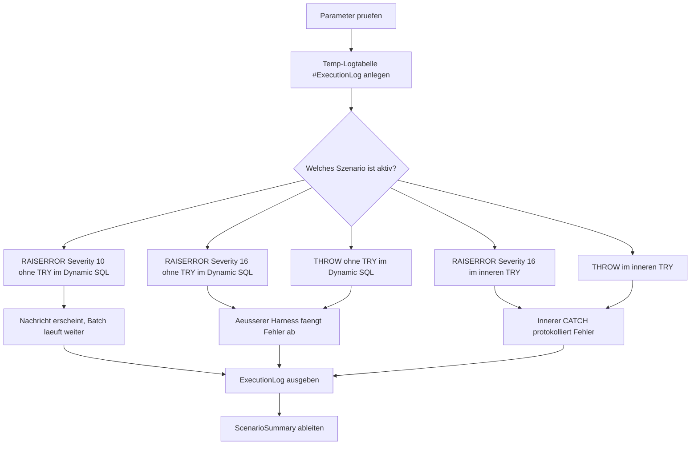

# ThrowVsRaiserrorDemo.sql

Dieses Skript vergleicht `THROW` und `RAISERROR` in mehreren kleinen Demo-Szenarien. Der Fokus liegt darauf, wann ein Fehler direkt im lokalen `CATCH` landet, wann ein aeusserer Harness einspringen muss und wann eine Meldung den Batch ueberhaupt nicht abbricht.

## Uebersicht

<!-- SQLDOC:SUMMARY_TABLE:BEGIN -->
| Feld | Wert |
|---|---|
| Script | [ThrowVsRaiserrorDemo.sql](ThrowVsRaiserrorDemo.sql) |
| Version | `1.0` |
| Typ | `didactic-lab` |
| Kapitel | `25_ErrorHandling_TryCatch` |
| Sicherheit | `read-only-tempdb` |
| Zweck | Vergleicht `THROW` und `RAISERROR` innerhalb und ausserhalb von `TRY...CATCH`. |
<!-- SQLDOC:SUMMARY_TABLE:END -->

## Einordnung

Das Lab nutzt bewusst einen aeusseren Harness mit `TRY...CATCH`, damit auch Fehlerfaelle ohne inneres Fehlerhandling beobachtet werden koennen, ohne das Gesamtskript fruehzeitig abzubrechen. Dadurch entstehen reproduzierbare Vergleichsdaten fuer beide Sprachmittel und fuer unterschiedliche Kontexte.

## Annahmen

- Das Skript ist eine didaktische Erstversion und arbeitet ausschliesslich mit `tempdb`-Objekten.
- "Ausserhalb von `TRY...CATCH`" wird ueber einen dynamischen Batch ohne inneren `TRY...CATCH` demonstriert; der aeussere Harness dient nur dazu, das Vergleichslab danach fortsetzen zu koennen.
- `RAISERROR` mit Severity `10` wird als informatives Gegenbeispiel genutzt, weil dieses Signal keine klassische Fehlerbehandlung ausloest.
- Fuer `THROW` werden eigene Fehlernummern ab `51020` verwendet, damit die Szenarien klar unterscheidbar bleiben.

## Anwendungsfall

Das Skript eignet sich fuer Schulungen, Code-Reviews und Teamdiskussionen rund um die Frage, wann bestehender `RAISERROR`-Code modernisiert werden sollte und welche Unterschiede im Control Flow dabei relevant bleiben. Besonders nuetzlich ist die Gegenueberstellung fuer Stored Procedures, API-Endpunkte und Batch-Jobs mit klaren Fehlergrenzen.

## Parameter

<!-- SQLDOC:PARAMETERS_TABLE:BEGIN -->
| Parameter | SQL-Typ | Pflicht | Beschreibung |
|---|---|---|---|
| `@ScenarioFilter` | `VARCHAR(40)` | Nein | Fuehrt entweder alle Demo-Szenarien oder genau ein ausgewaehltes Szenario aus. |
| `@IncludeInformationalDemo` | `BIT` | Nein | Schaltet das Severity-10-Beispiel fuer rein informative `RAISERROR`-Meldungen ein oder aus. |
<!-- SQLDOC:PARAMETERS_TABLE:END -->

## Abhaengigkeiten

<!-- SQLDOC:DEPENDENCIES_LIST:BEGIN -->
- `tempdb` fuer die temporaere Log-Tabelle
- `sys.sp_executesql`
- `TRY...CATCH`
- `THROW`
- `RAISERROR`
- `ERROR_*()`-Funktionen
<!-- SQLDOC:DEPENDENCIES_LIST:END -->

## Hinweise

- `ExecutionLog` zeigt die reale Schrittfolge pro Szenario mit Phasen wie `before-signal`, `catch` und `after-catch`.
- `ScenarioSummary` verdichtet daraus, ob ein lokaler Catch erreicht wurde, ob nach dem Signal noch Code lief und ob ein aeusserer Harness noetig war.
- Die Szenarien `raiserror-error-outside` und `throw-outside` unterscheiden sich in diesem Lab vor allem durch Fehlernummer und Semantik; beide verlassen ohne inneres `TRY...CATCH` den dynamischen Batch.
- Das Severity-10-Beispiel macht sichtbar, dass `RAISERROR` nicht immer einen echten Fehlerfluss startet.

## Versionshistorie

<!-- SQLDOC:VERSION_HISTORY_TABLE:BEGIN -->
| Version | Datum | User | Beschreibung |
|---|---|---|---|
| `1.0` | `2026-04-17` | `ER` | Erstversion fuer den Vergleich von `THROW` und `RAISERROR` |
<!-- SQLDOC:VERSION_HISTORY_TABLE:END -->

## Ablauf

<!-- SQLDOC:MERMAID:BEGIN -->

<!-- SQLDOC:MERMAID:END -->

## SQL-Code

<!-- SQLDOC:SQL_CODE:BEGIN -->```sql
/*
BEGIN:SQL-HEADER v1
---
sql_header: v1
script_name: "ThrowVsRaiserrorDemo.sql"
script_version: "1.0"
script_type: "didactic-lab"
chapter: "25_ErrorHandling_TryCatch"

purpose: >
  Vergleicht THROW und RAISERROR in mehreren Demo-Szenarien innerhalb und
  ausserhalb von TRY...CATCH, sodass Abbruchverhalten, Catch-Pfade und
  Weiterlauf des Batchs nachvollziehbar sichtbar werden.

parameters:
  - name: "@ScenarioFilter"
    sql_type: "VARCHAR(40)"
    direction: "IN"
    required: false
    description: "Waehlt ein einzelnes Demo-Szenario oder all fuer die Gesamtausfuehrung"
  - name: "@IncludeInformationalDemo"
    sql_type: "BIT"
    direction: "IN"
    required: false
    description: "0 ueberspringt das informative RAISERROR-Severity-10-Szenario"

result_sets:
  - name: "ExecutionLog"
    description: "Chronologisches Log der einzelnen Demo-Szenarien"
  - name: "ScenarioSummary"
    description: "Verdichtete Gegenueberstellung von Catch- und Weiterlaufverhalten"

dependencies:
  - "tempdb temporary tables"
  - "sp_executesql"
  - "TRY...CATCH"
  - "THROW"
  - "RAISERROR"
  - "ERROR_* functions"

safety:
  level: "read-only-tempdb"
  writes_data: false

documentation:
  markdown_file: "T-SQL/25_ErrorHandling_TryCatch/SQLScripts/ThrowVsRaiserrorDemo.md"
  sync_blocks:
    - "SUMMARY_TABLE"
    - "PARAMETERS_TABLE"
    - "DEPENDENCIES_LIST"
    - "VERSION_HISTORY_TABLE"
    - "SQL_CODE"
  mermaid:
    mode: "ai-agent-from-sql"
    source: "script-body"

main_responsible:
  name: "Erhard Rainer"
  initials: "ER"

version_history:
  - version: "1.0"
    date: "2026-04-17"
    user: "ER"
    description: "Erstversion fuer den Vergleich von THROW und RAISERROR"

notes:
  - "Fehlerszenarien ohne inneres TRY...CATCH werden ueber einen aeusseren Harness abgefangen, damit das Vergleichsskript komplett durchlaufen kann."
  - "RAISERROR mit Severity 10 dient als rein informatives Gegenbeispiel ohne Batch-Abbruch."
---
END:SQL-HEADER v1
*/

SET NOCOUNT ON;

DECLARE @ScenarioFilter VARCHAR(40) = 'all';
DECLARE @IncludeInformationalDemo BIT = 1;

IF @IncludeInformationalDemo NOT IN (0, 1)
BEGIN
    THROW 51000, '@IncludeInformationalDemo muss 0 oder 1 sein.', 1;
END;

IF @ScenarioFilter NOT IN
(
    'all',
    'raiserror-info-outside',
    'raiserror-error-outside',
    'throw-outside',
    'raiserror-inside',
    'throw-inside'
)
BEGIN
    THROW 51001, '@ScenarioFilter ist ungueltig.', 1;
END;

DROP TABLE IF EXISTS #ExecutionLog;

CREATE TABLE #ExecutionLog
(
    LogId INT IDENTITY(1,1) NOT NULL PRIMARY KEY,
    ScenarioName VARCHAR(40) NOT NULL,
    ExecutionContext VARCHAR(30) NOT NULL,
    EventPhase VARCHAR(30) NOT NULL,
    OutcomeClass VARCHAR(40) NOT NULL,
    ErrorNumber INT NULL,
    ErrorSeverity INT NULL,
    ErrorState INT NULL,
    MessageText NVARCHAR(4000) NOT NULL,
    SortOrder INT NOT NULL
);

IF @IncludeInformationalDemo = 1
   AND @ScenarioFilter IN ('all', 'raiserror-info-outside')
BEGIN
    EXEC sys.sp_executesql N'
        INSERT INTO #ExecutionLog
        (
            ScenarioName,
            ExecutionContext,
            EventPhase,
            OutcomeClass,
            ErrorNumber,
            ErrorSeverity,
            ErrorState,
            MessageText,
            SortOrder
        )
        VALUES
        (
            ''raiserror-info-outside'',
            ''no-try-in-dynamic-sql'',
            ''before-signal'',
            ''start'',
            NULL,
            NULL,
            NULL,
            N''Dynamic SQL startet ohne TRY...CATCH und sendet gleich eine informative RAISERROR-Meldung.'',
            10
        );

        RAISERROR(N''Informational RAISERROR outside TRY.'', 10, 1);

        INSERT INTO #ExecutionLog
        (
            ScenarioName,
            ExecutionContext,
            EventPhase,
            OutcomeClass,
            ErrorNumber,
            ErrorSeverity,
            ErrorState,
            MessageText,
            SortOrder
        )
        VALUES
        (
            ''raiserror-info-outside'',
            ''no-try-in-dynamic-sql'',
            ''after-signal'',
            ''continued'',
            50000,
            10,
            1,
            N''Severity 10 fuehrt nur zu einer Meldung; die Anweisung danach wird weiterhin ausgefuehrt.'',
            20
        );';

    INSERT INTO #ExecutionLog
    (
        ScenarioName,
        ExecutionContext,
        EventPhase,
        OutcomeClass,
        ErrorNumber,
        ErrorSeverity,
        ErrorState,
        MessageText,
        SortOrder
    )
    VALUES
    (
        'raiserror-info-outside',
        'outer-batch',
        'after-exec',
        'outer-batch-continued',
        NULL,
        NULL,
        NULL,
        N'Der aeussere Batch laeuft ohne CATCH weiter, weil Severity 10 kein echtes Fehlerereignis ausloest.',
        30
    );
END;

IF @ScenarioFilter IN ('all', 'raiserror-error-outside')
BEGIN
    BEGIN TRY
        EXEC sys.sp_executesql N'
            INSERT INTO #ExecutionLog
            (
                ScenarioName,
                ExecutionContext,
                EventPhase,
                OutcomeClass,
                ErrorNumber,
                ErrorSeverity,
                ErrorState,
                MessageText,
                SortOrder
            )
            VALUES
            (
                ''raiserror-error-outside'',
                ''no-try-in-dynamic-sql'',
                ''before-signal'',
                ''start'',
                NULL,
                NULL,
                NULL,
                N''Dynamic SQL startet ohne TRY...CATCH und loest gleich RAISERROR mit Severity 16 aus.'',
                10
            );

            RAISERROR(N''RAISERROR severity 16 outside TRY.'', 16, 1);

            INSERT INTO #ExecutionLog
            (
                ScenarioName,
                ExecutionContext,
                EventPhase,
                OutcomeClass,
                ErrorNumber,
                ErrorSeverity,
                ErrorState,
                MessageText,
                SortOrder
            )
            VALUES
            (
                ''raiserror-error-outside'',
                ''no-try-in-dynamic-sql'',
                ''after-signal'',
                ''unexpected'',
                NULL,
                NULL,
                NULL,
                N''Diese Zeile sollte bei Severity 16 nicht mehr erreicht werden.'',
                20
            );';
    END TRY
    BEGIN CATCH
        INSERT INTO #ExecutionLog
        (
            ScenarioName,
            ExecutionContext,
            EventPhase,
            OutcomeClass,
            ErrorNumber,
            ErrorSeverity,
            ErrorState,
            MessageText,
            SortOrder
        )
        VALUES
        (
            'raiserror-error-outside',
            'outer-harness',
            'catch',
            'outer-harness-catch',
            ERROR_NUMBER(),
            ERROR_SEVERITY(),
            ERROR_STATE(),
            ERROR_MESSAGE(),
            30
        );
    END CATCH;
END;

IF @ScenarioFilter IN ('all', 'throw-outside')
BEGIN
    BEGIN TRY
        EXEC sys.sp_executesql N'
            INSERT INTO #ExecutionLog
            (
                ScenarioName,
                ExecutionContext,
                EventPhase,
                OutcomeClass,
                ErrorNumber,
                ErrorSeverity,
                ErrorState,
                MessageText,
                SortOrder
            )
            VALUES
            (
                ''throw-outside'',
                ''no-try-in-dynamic-sql'',
                ''before-signal'',
                ''start'',
                NULL,
                NULL,
                NULL,
                N''Dynamic SQL startet ohne TRY...CATCH und loest danach THROW aus.'',
                10
            );

            THROW 51020, N''THROW outside TRY.'', 1;

            INSERT INTO #ExecutionLog
            (
                ScenarioName,
                ExecutionContext,
                EventPhase,
                OutcomeClass,
                ErrorNumber,
                ErrorSeverity,
                ErrorState,
                MessageText,
                SortOrder
            )
            VALUES
            (
                ''throw-outside'',
                ''no-try-in-dynamic-sql'',
                ''after-signal'',
                ''unexpected'',
                NULL,
                NULL,
                NULL,
                N''Diese Zeile sollte nach THROW nicht mehr erreicht werden.'',
                20
            );';
    END TRY
    BEGIN CATCH
        INSERT INTO #ExecutionLog
        (
            ScenarioName,
            ExecutionContext,
            EventPhase,
            OutcomeClass,
            ErrorNumber,
            ErrorSeverity,
            ErrorState,
            MessageText,
            SortOrder
        )
        VALUES
        (
            'throw-outside',
            'outer-harness',
            'catch',
            'outer-harness-catch',
            ERROR_NUMBER(),
            ERROR_SEVERITY(),
            ERROR_STATE(),
            ERROR_MESSAGE(),
            30
        );
    END CATCH;
END;

IF @ScenarioFilter IN ('all', 'raiserror-inside')
BEGIN
    EXEC sys.sp_executesql N'
        BEGIN TRY
            INSERT INTO #ExecutionLog
            (
                ScenarioName,
                ExecutionContext,
                EventPhase,
                OutcomeClass,
                ErrorNumber,
                ErrorSeverity,
                ErrorState,
                MessageText,
                SortOrder
            )
            VALUES
            (
                ''raiserror-inside'',
                ''inner-try-catch'',
                ''before-signal'',
                ''start'',
                NULL,
                NULL,
                NULL,
                N''Inneres TRY startet und fuehrt gleich RAISERROR Severity 16 aus.'',
                10
            );

            RAISERROR(N''RAISERROR severity 16 inside TRY.'', 16, 1);

            INSERT INTO #ExecutionLog
            (
                ScenarioName,
                ExecutionContext,
                EventPhase,
                OutcomeClass,
                ErrorNumber,
                ErrorSeverity,
                ErrorState,
                MessageText,
                SortOrder
            )
            VALUES
            (
                ''raiserror-inside'',
                ''inner-try-catch'',
                ''after-signal'',
                ''unexpected'',
                NULL,
                NULL,
                NULL,
                N''Diese Zeile sollte im inneren TRY nicht mehr erscheinen.'',
                20
            );
        END TRY
        BEGIN CATCH
            INSERT INTO #ExecutionLog
            (
                ScenarioName,
                ExecutionContext,
                EventPhase,
                OutcomeClass,
                ErrorNumber,
                ErrorSeverity,
                ErrorState,
                MessageText,
                SortOrder
            )
            VALUES
            (
                ''raiserror-inside'',
                ''inner-try-catch'',
                ''catch'',
                ''inner-catch'',
                ERROR_NUMBER(),
                ERROR_SEVERITY(),
                ERROR_STATE(),
                ERROR_MESSAGE(),
                30
            );
        END CATCH;

        INSERT INTO #ExecutionLog
        (
            ScenarioName,
            ExecutionContext,
            EventPhase,
            OutcomeClass,
            ErrorNumber,
            ErrorSeverity,
            ErrorState,
            MessageText,
            SortOrder
        )
        VALUES
        (
            ''raiserror-inside'',
            ''inner-try-catch'',
            ''after-catch'',
            ''continued'',
            NULL,
            NULL,
            NULL,
            N''Nach dem inneren CATCH laeuft das Demo-Szenario kontrolliert weiter.'',
            40
        );';
END;

IF @ScenarioFilter IN ('all', 'throw-inside')
BEGIN
    EXEC sys.sp_executesql N'
        BEGIN TRY
            INSERT INTO #ExecutionLog
            (
                ScenarioName,
                ExecutionContext,
                EventPhase,
                OutcomeClass,
                ErrorNumber,
                ErrorSeverity,
                ErrorState,
                MessageText,
                SortOrder
            )
            VALUES
            (
                ''throw-inside'',
                ''inner-try-catch'',
                ''before-signal'',
                ''start'',
                NULL,
                NULL,
                NULL,
                N''Inneres TRY startet und loest danach THROW aus.'',
                10
            );

            THROW 51021, N''THROW inside TRY.'', 1;

            INSERT INTO #ExecutionLog
            (
                ScenarioName,
                ExecutionContext,
                EventPhase,
                OutcomeClass,
                ErrorNumber,
                ErrorSeverity,
                ErrorState,
                MessageText,
                SortOrder
            )
            VALUES
            (
                ''throw-inside'',
                ''inner-try-catch'',
                ''after-signal'',
                ''unexpected'',
                NULL,
                NULL,
                NULL,
                N''Diese Zeile sollte nach THROW im TRY nicht mehr erscheinen.'',
                20
            );
        END TRY
        BEGIN CATCH
            INSERT INTO #ExecutionLog
            (
                ScenarioName,
                ExecutionContext,
                EventPhase,
                OutcomeClass,
                ErrorNumber,
                ErrorSeverity,
                ErrorState,
                MessageText,
                SortOrder
            )
            VALUES
            (
                ''throw-inside'',
                ''inner-try-catch'',
                ''catch'',
                ''inner-catch'',
                ERROR_NUMBER(),
                ERROR_SEVERITY(),
                ERROR_STATE(),
                ERROR_MESSAGE(),
                30
            );
        END CATCH;

        INSERT INTO #ExecutionLog
        (
            ScenarioName,
            ExecutionContext,
            EventPhase,
            OutcomeClass,
            ErrorNumber,
            ErrorSeverity,
            ErrorState,
            MessageText,
            SortOrder
        )
        VALUES
        (
            ''throw-inside'',
            ''inner-try-catch'',
            ''after-catch'',
            ''continued'',
            NULL,
            NULL,
            NULL,
            N''Auch nach THROW kann der umgebende Demo-Ablauf nach dem CATCH kontrolliert weiterlaufen.'',
            40
        );';
END;

SELECT
    el.LogId,
    el.ScenarioName,
    el.ExecutionContext,
    el.EventPhase,
    el.OutcomeClass,
    el.ErrorNumber,
    el.ErrorSeverity,
    el.ErrorState,
    el.MessageText
FROM #ExecutionLog AS el
ORDER BY
    el.ScenarioName,
    el.SortOrder,
    el.LogId;

WITH ScenarioSummary AS
(
    SELECT
        el.ScenarioName,
        MAX(CASE WHEN el.EventPhase = 'catch' THEN 1 ELSE 0 END) AS EnteredCatch,
        MAX(CASE WHEN el.EventPhase = 'after-signal' THEN 1 ELSE 0 END) AS ReachedAfterSignal,
        MAX(CASE WHEN el.EventPhase = 'after-catch' THEN 1 ELSE 0 END) AS RecoveredAfterCatch,
        MAX(CASE WHEN el.OutcomeClass = 'outer-harness-catch' THEN 1 ELSE 0 END) AS NeededOuterHarness,
        MAX(CASE WHEN el.ErrorSeverity = 10 THEN 1 ELSE 0 END) AS UsedInformationalSeverity
    FROM #ExecutionLog AS el
    GROUP BY
        el.ScenarioName
)
SELECT
    ss.ScenarioName,
    CASE
        WHEN ss.UsedInformationalSeverity = 1 THEN 'informational-only'
        WHEN ss.NeededOuterHarness = 1 THEN 'escaped-inner-batch'
        ELSE 'handled-inside-demo'
    END AS BehaviorClass,
    CAST(ss.EnteredCatch AS BIT) AS EnteredCatch,
    CAST(ss.ReachedAfterSignal AS BIT) AS ReachedAfterSignal,
    CAST(ss.RecoveredAfterCatch AS BIT) AS RecoveredAfterCatch,
    CAST(ss.NeededOuterHarness AS BIT) AS NeededOuterHarness,
    CASE
        WHEN ss.UsedInformationalSeverity = 1 THEN 'Severity 10 meldet nur und laesst den Batch weiterlaufen.'
        WHEN ss.NeededOuterHarness = 1 THEN 'Ohne inneres TRY...CATCH verlaesst der Fehler den dynamischen Batch und wird erst aussen abgefangen.'
        ELSE 'Im inneren TRY...CATCH werden Fehler lokal diagnostiziert und danach kontrolliert fortgesetzt.'
    END AS Interpretation
FROM ScenarioSummary AS ss
ORDER BY
    ss.ScenarioName;
```
<!-- SQLDOC:SQL_CODE:END -->

