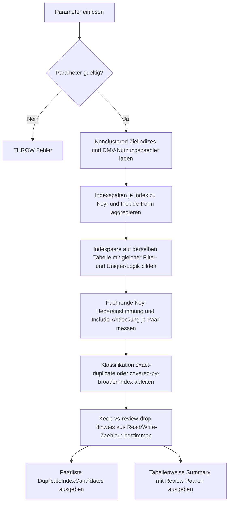

# DuplicateIndexCandidates.sql

Dieses Skript untersucht Nonclustered-Indizes derselben Tabelle auf vollstaendige Gleichheit oder weitgehende Ueberdeckung. Es ist als konservative Review-Hilfe fuer das Kapitel `26_Indexes_Basics` gedacht und leitet keine automatische Drop-Entscheidung ab.

## Uebersicht

<!-- SQLDOC:SUMMARY_TABLE:BEGIN -->
| Feld | Wert |
|---|---|
| Script | [DuplicateIndexCandidates.sql](DuplicateIndexCandidates.sql) |
| Version | `1.0` |
| Typ | `diagnostic-query` |
| Kapitel | `26_Indexes_Basics` |
| Sicherheit | `read-only` |
| Zweck | Findet auf derselben Tabelle vollstaendig oder weitgehend ueberlappende Nonclustered-Indizes als Konsolidierungs-Kandidaten. |
<!-- SQLDOC:SUMMARY_TABLE:END -->

## Einordnung

Im Unterschied zu einem reinen Definitionsvergleich verbindet dieses Skript Metadaten zu Keys und Include-Spalten mit Nutzungszaehlern aus `sys.dm_db_index_usage_stats`. Dadurch entstehen konservative Review-Paare, bei denen ein Index technisch gleich oder groesstenteils von einem breiteren Index ueberdeckt wirkt.

## Annahmen

- Die Analyse beschraenkt sich auf aktive Nonclustered-Indizes der aktuellen Datenbank.
- Ein `covered-by-broader-index`-Signal bedeutet nur, dass die Spalten eines Indexes vollstaendig in einem zweiten Index enthalten sind; Praedikate, Sortierbedarf und reale Plaene muessen separat geprueft werden.
- Nutzungszaehler dienen nur als grober Behaltens-Hinweis und koennen nach Neustarts oder Statistikwechseln unvollstaendig sein.
- Primary Keys und Unique Constraints werden sichtbar markiert, damit geschuetzte Objekte nicht versehentlich als einfache Drop-Kandidaten missverstanden werden.

## Anwendungsfall

Die erste Ausgabe zeigt konkrete Vergleichspaare mit Klassifikation, Coverage-Verhaeltnis und einem vorsichtigen Keep-vs-Review-Drop-Hinweis. Die zweite Ausgabe verdichtet diese Signale pro Tabelle und listet moegliche Review-Paare fuer eine spaetere Konsolidierungsentscheidung.

## Parameter

<!-- SQLDOC:PARAMETERS_TABLE:BEGIN -->
| Parameter | SQL-Typ | Pflicht | Beschreibung |
|---|---|---|---|
| `@SchemaName` | `SYSNAME` | Nein | Optionaler Filter auf ein Schema. |
| `@TableName` | `SYSNAME` | Nein | Optionaler Filter auf einen Tabellennamen. |
| `@ShowOnlyCandidates` | `BIT` | Nein | Zeigt bei `1` nur erkannte Konsolidierungs-Kandidaten, bei `0` auch neutrale Vergleichspaare. |
| `@MinimumCoverageRatio` | `DECIMAL(5,2)` | Nein | Mindestanteil der abgedeckten Spalten fuer near-duplicate-Kandidaten. |
<!-- SQLDOC:PARAMETERS_TABLE:END -->

## Abhaengigkeiten

<!-- SQLDOC:DEPENDENCIES_LIST:BEGIN -->
- `sys.tables`
- `sys.schemas`
- `sys.indexes`
- `sys.index_columns`
- `sys.columns`
- `sys.dm_db_index_usage_stats`
- `sys.dm_db_partition_stats`
- `CTE`
<!-- SQLDOC:DEPENDENCIES_LIST:END -->

## Hinweise

- `exact-duplicate` steht fuer Paare mit gleicher Key- und Include-Struktur innerhalb derselben Filter- und Eindeutigkeitslogik.
- `covered-by-broader-index` bedeutet, dass ein zweiter Index alle Spalten des Kandidaten traegt und zusaetzliche Schluessel- oder Include-Spalten besitzt.
- `PreferredKeepIndex` und `PreferredReviewDropIndex` basieren nur auf Lese-/Schreibzaehlern und sind bewusst konservative Review-Hilfen.
- Ein hohes `CoverageRatio` ist ohne Workload-Kontext keine Garantie dafuer, dass ein schmalerer Index entbehrlich ist.

## Versionshistorie

<!-- SQLDOC:VERSION_HISTORY_TABLE:BEGIN -->
| Version | Datum | User | Beschreibung |
|---|---|---|---|
| `1.0` | `2026-04-17` | `ER` | Erstversion fuer konservative Konsolidierungs-Kandidaten bei doppelten Indizes |
<!-- SQLDOC:VERSION_HISTORY_TABLE:END -->

## Ablauf

<!-- SQLDOC:MERMAID:BEGIN -->

<!-- SQLDOC:MERMAID:END -->

## SQL-Code

<!-- SQLDOC:SQL_CODE:BEGIN -->
```sql
/*
BEGIN:SQL-HEADER v1
---
sql_header: v1
script_name: "DuplicateIndexCandidates.sql"
script_version: "1.0"
script_type: "diagnostic-query"
chapter: "26_Indexes_Basics"
purpose: >
  Findet auf derselben Tabelle vollstaendig oder weitgehend ueberlappende
  Nonclustered-Indizes und markiert konservative Konsolidierungs-Kandidaten
  fuer ein manuelles Review.
parameters:
  - name: "@SchemaName"
    sql_type: "SYSNAME"
    direction: "IN"
    required: false
    description: "Optionaler Filter auf ein Schema"
  - name: "@TableName"
    sql_type: "SYSNAME"
    direction: "IN"
    required: false
    description: "Optionaler Filter auf einen Tabellennamen"
  - name: "@ShowOnlyCandidates"
    sql_type: "BIT"
    direction: "IN"
    required: false
    description: "1 = nur erkannte Konsolidierungs-Kandidaten zeigen, 0 = auch neutrale Vergleichspaare ausgeben"
  - name: "@MinimumCoverageRatio"
    sql_type: "DECIMAL(5,2)"
    direction: "IN"
    required: false
    description: "Mindestanteil der durch einen breiteren Index abgedeckten Spalten fuer near-duplicate-Kandidaten"
result_sets:
  - name: "DuplicateIndexCandidates"
    description: "Paarweise Sicht auf exakte oder weitgehend ueberdeckte Indexdefinitionen mit Review-Empfehlung"
  - name: "DuplicateIndexSummary"
    description: "Verdichtete Sicht je Tabelle mit Anzahl der Kandidaten und vorgeschlagenem Behaltens-Fokus"
dependencies:
  - "sys.tables"
  - "sys.schemas"
  - "sys.indexes"
  - "sys.index_columns"
  - "sys.columns"
  - "sys.dm_db_index_usage_stats"
  - "sys.dm_db_partition_stats"
  - "CTE"
safety:
  level: "read-only"
  writes_data: false
documentation:
  markdown_file: "T-SQL/26_Indexes_Basics/SQLScripts/DuplicateIndexCandidates.md"
  sync_blocks:
    - "SUMMARY_TABLE"
    - "PARAMETERS_TABLE"
    - "DEPENDENCIES_LIST"
    - "VERSION_HISTORY_TABLE"
    - "SQL_CODE"
  mermaid:
    mode: "ai-agent-from-sql"
    source: "script-body"
main_responsible:
  name: "Erhard Rainer"
  initials: "ER"
version_history:
  - version: "1.0"
    date: "2026-04-17"
    user: "ER"
    description: "Erstversion fuer konservative Konsolidierungs-Kandidaten bei doppelten Indizes"
notes:
  - "Die Diagnose bewertet nur Metadaten und DMVs der aktuellen Datenbank."
  - "Ein Kandidat signalisiert Review-Bedarf und ersetzt keine Workload- oder Ausfuehrungsplan-Analyse."
---
END:SQL-HEADER v1
*/

SET NOCOUNT ON;

DECLARE @SchemaName SYSNAME = NULL;
DECLARE @TableName SYSNAME = NULL;
DECLARE @ShowOnlyCandidates BIT = 1;
DECLARE @MinimumCoverageRatio DECIMAL(5,2) = 0.80;

IF @ShowOnlyCandidates NOT IN (0, 1)
BEGIN
    THROW 50000, '@ShowOnlyCandidates muss 0 oder 1 sein.', 1;
END;

IF @MinimumCoverageRatio <= 0 OR @MinimumCoverageRatio > 1
BEGIN
    THROW 50000, '@MinimumCoverageRatio muss groesser als 0 und kleiner oder gleich 1 sein.', 1;
END;

;WITH PartitionRowCounts AS
(
    SELECT
        ps.object_id,
        ps.index_id,
        SUM(ps.row_count) AS RowCount
    FROM sys.dm_db_partition_stats AS ps
    GROUP BY
        ps.object_id,
        ps.index_id
),
TargetIndexes AS
(
    SELECT
        s.name AS SchemaName,
        t.name AS TableName,
        t.object_id,
        i.index_id,
        i.name AS IndexName,
        i.type_desc AS IndexType,
        CAST(i.is_unique AS BIT) AS IsUnique,
        CAST(i.has_filter AS BIT) AS HasFilter,
        i.filter_definition AS FilterDefinition,
        i.fill_factor AS FillFactor,
        CAST(i.is_primary_key AS BIT) AS IsPrimaryKey,
        CAST(i.is_unique_constraint AS BIT) AS IsUniqueConstraint,
        ISNULL(us.user_seeks, 0) AS UserSeeks,
        ISNULL(us.user_scans, 0) AS UserScans,
        ISNULL(us.user_lookups, 0) AS UserLookups,
        ISNULL(us.user_updates, 0) AS UserUpdates,
        ISNULL(pr.RowCount, 0) AS RowCount
    FROM sys.tables AS t
    INNER JOIN sys.schemas AS s
        ON s.schema_id = t.schema_id
    INNER JOIN sys.indexes AS i
        ON i.object_id = t.object_id
    LEFT JOIN sys.dm_db_index_usage_stats AS us
        ON us.database_id = DB_ID()
       AND us.object_id = i.object_id
       AND us.index_id = i.index_id
    LEFT JOIN PartitionRowCounts AS pr
        ON pr.object_id = i.object_id
       AND pr.index_id = i.index_id
    WHERE t.is_ms_shipped = 0
      AND i.type = 2
      AND i.is_hypothetical = 0
      AND i.is_disabled = 0
      AND (@SchemaName IS NULL OR s.name = @SchemaName)
      AND (@TableName IS NULL OR t.name = @TableName)
),
IndexColumnDetail AS
(
    SELECT
        ti.SchemaName,
        ti.TableName,
        ti.object_id,
        ti.index_id,
        ti.IndexName,
        ic.index_column_id,
        ic.key_ordinal,
        ic.is_included_column,
        ic.is_descending_key,
        c.name AS ColumnName,
        c.column_id
    FROM TargetIndexes AS ti
    INNER JOIN sys.index_columns AS ic
        ON ic.object_id = ti.object_id
       AND ic.index_id = ti.index_id
    INNER JOIN sys.columns AS c
        ON c.object_id = ic.object_id
       AND c.column_id = ic.column_id
),
IndexShapes AS
(
    SELECT
        ti.SchemaName,
        ti.TableName,
        ti.object_id,
        ti.index_id,
        ti.IndexName,
        ti.IndexType,
        ti.IsUnique,
        ti.HasFilter,
        ti.FilterDefinition,
        ti.FillFactor,
        ti.IsPrimaryKey,
        ti.IsUniqueConstraint,
        ti.UserSeeks,
        ti.UserScans,
        ti.UserLookups,
        ti.UserUpdates,
        ti.RowCount,
        STRING_AGG(
            CASE
                WHEN icd.is_included_column = 0 AND icd.key_ordinal > 0
                    THEN CONCAT(
                        QUOTENAME(icd.ColumnName),
                        ' ',
                        CASE WHEN icd.is_descending_key = 1 THEN 'DESC' ELSE 'ASC' END
                    )
            END,
            ', '
        ) WITHIN GROUP (ORDER BY icd.key_ordinal) AS KeySignature,
        STRING_AGG(
            CASE
                WHEN icd.is_included_column = 1
                    THEN QUOTENAME(icd.ColumnName)
            END,
            ', '
        ) WITHIN GROUP (ORDER BY icd.index_column_id) AS IncludeSignature,
        COUNT(CASE WHEN icd.is_included_column = 0 AND icd.key_ordinal > 0 THEN 1 END) AS KeyColumnCount,
        COUNT(CASE WHEN icd.is_included_column = 1 THEN 1 END) AS IncludeColumnCount
    FROM TargetIndexes AS ti
    INNER JOIN IndexColumnDetail AS icd
        ON icd.object_id = ti.object_id
       AND icd.index_id = ti.index_id
    GROUP BY
        ti.SchemaName,
        ti.TableName,
        ti.object_id,
        ti.index_id,
        ti.IndexName,
        ti.IndexType,
        ti.IsUnique,
        ti.HasFilter,
        ti.FilterDefinition,
        ti.FillFactor,
        ti.IsPrimaryKey,
        ti.IsUniqueConstraint,
        ti.UserSeeks,
        ti.UserScans,
        ti.UserLookups,
        ti.UserUpdates,
        ti.RowCount
),
PairBase AS
(
    SELECT
        left_idx.SchemaName,
        left_idx.TableName,
        left_idx.object_id,
        left_idx.index_id AS CandidateIndexId,
        left_idx.IndexName AS CandidateIndexName,
        right_idx.index_id AS CoveringIndexId,
        right_idx.IndexName AS CoveringIndexName,
        left_idx.IndexType,
        left_idx.IsUnique,
        left_idx.HasFilter,
        left_idx.FilterDefinition,
        left_idx.IsPrimaryKey AS CandidateIsPrimaryKey,
        left_idx.IsUniqueConstraint AS CandidateIsUniqueConstraint,
        right_idx.IsPrimaryKey AS CoveringIsPrimaryKey,
        right_idx.IsUniqueConstraint AS CoveringIsUniqueConstraint,
        left_idx.KeySignature AS CandidateKeySignature,
        right_idx.KeySignature AS CoveringKeySignature,
        COALESCE(left_idx.IncludeSignature, '(no include columns)') AS CandidateIncludeSignature,
        COALESCE(right_idx.IncludeSignature, '(no include columns)') AS CoveringIncludeSignature,
        left_idx.KeyColumnCount AS CandidateKeyCount,
        right_idx.KeyColumnCount AS CoveringKeyCount,
        left_idx.IncludeColumnCount AS CandidateIncludeCount,
        right_idx.IncludeColumnCount AS CoveringIncludeCount,
        left_idx.UserSeeks + left_idx.UserScans + left_idx.UserLookups AS CandidateReadOps,
        right_idx.UserSeeks + right_idx.UserScans + right_idx.UserLookups AS CoveringReadOps,
        left_idx.UserUpdates AS CandidateWriteOps,
        right_idx.UserUpdates AS CoveringWriteOps,
        left_idx.RowCount
    FROM IndexShapes AS left_idx
    INNER JOIN IndexShapes AS right_idx
        ON right_idx.object_id = left_idx.object_id
       AND right_idx.index_id <> left_idx.index_id
       AND right_idx.IsUnique = left_idx.IsUnique
       AND right_idx.HasFilter = left_idx.HasFilter
       AND ISNULL(right_idx.FilterDefinition, '') = ISNULL(left_idx.FilterDefinition, '')
),
PairEvidence AS
(
    SELECT
        pb.SchemaName,
        pb.TableName,
        pb.object_id,
        pb.CandidateIndexId,
        pb.CandidateIndexName,
        pb.CoveringIndexId,
        pb.CoveringIndexName,
        pb.IndexType,
        pb.IsUnique,
        pb.HasFilter,
        pb.FilterDefinition,
        pb.CandidateIsPrimaryKey,
        pb.CandidateIsUniqueConstraint,
        pb.CoveringIsPrimaryKey,
        pb.CoveringIsUniqueConstraint,
        pb.CandidateKeySignature,
        pb.CoveringKeySignature,
        pb.CandidateIncludeSignature,
        pb.CoveringIncludeSignature,
        pb.CandidateKeyCount,
        pb.CoveringKeyCount,
        pb.CandidateIncludeCount,
        pb.CoveringIncludeCount,
        pb.CandidateReadOps,
        pb.CoveringReadOps,
        pb.CandidateWriteOps,
        pb.CoveringWriteOps,
        pb.RowCount,
        SUM(CASE WHEN lcd.is_included_column = 0 AND lcd.key_ordinal > 0 AND rcd.column_id IS NOT NULL THEN 1 ELSE 0 END) AS MatchingLeadingKeyColumns,
        SUM(CASE WHEN lcd.is_included_column = 1 AND rca.column_id IS NOT NULL THEN 1 ELSE 0 END) AS CoveredIncludeColumns
    FROM PairBase AS pb
    INNER JOIN sys.index_columns AS lcd
        ON lcd.object_id = pb.object_id
       AND lcd.index_id = pb.CandidateIndexId
    LEFT JOIN sys.index_columns AS rcd
        ON rcd.object_id = pb.object_id
       AND rcd.index_id = pb.CoveringIndexId
       AND lcd.is_included_column = 0
       AND lcd.key_ordinal > 0
       AND rcd.is_included_column = 0
       AND rcd.key_ordinal = lcd.key_ordinal
       AND rcd.column_id = lcd.column_id
       AND rcd.is_descending_key = lcd.is_descending_key
    LEFT JOIN sys.index_columns AS rca
        ON rca.object_id = pb.object_id
       AND rca.index_id = pb.CoveringIndexId
       AND lcd.is_included_column = 1
       AND rca.column_id = lcd.column_id
    GROUP BY
        pb.SchemaName,
        pb.TableName,
        pb.object_id,
        pb.CandidateIndexId,
        pb.CandidateIndexName,
        pb.CoveringIndexId,
        pb.CoveringIndexName,
        pb.IndexType,
        pb.IsUnique,
        pb.HasFilter,
        pb.FilterDefinition,
        pb.CandidateIsPrimaryKey,
        pb.CandidateIsUniqueConstraint,
        pb.CoveringIsPrimaryKey,
        pb.CoveringIsUniqueConstraint,
        pb.CandidateKeySignature,
        pb.CoveringKeySignature,
        pb.CandidateIncludeSignature,
        pb.CoveringIncludeSignature,
        pb.CandidateKeyCount,
        pb.CoveringKeyCount,
        pb.CandidateIncludeCount,
        pb.CoveringIncludeCount,
        pb.CandidateReadOps,
        pb.CoveringReadOps,
        pb.CandidateWriteOps,
        pb.CoveringWriteOps,
        pb.RowCount
),
PairClassified AS
(
    SELECT
        DB_NAME() AS DatabaseName,
        pe.SchemaName,
        pe.TableName,
        pe.CandidateIndexName,
        pe.CoveringIndexName,
        pe.IndexType,
        pe.IsUnique,
        pe.HasFilter,
        pe.FilterDefinition,
        pe.CandidateKeySignature,
        pe.CoveringKeySignature,
        pe.CandidateIncludeSignature,
        pe.CoveringIncludeSignature,
        pe.CandidateReadOps,
        pe.CoveringReadOps,
        pe.CandidateWriteOps,
        pe.CoveringWriteOps,
        pe.RowCount,
        pe.MatchingLeadingKeyColumns,
        pe.CoveredIncludeColumns,
        CAST(
            1.0 * (pe.MatchingLeadingKeyColumns + pe.CoveredIncludeColumns)
            / NULLIF(pe.CandidateKeyCount + pe.CandidateIncludeCount, 0)
            AS DECIMAL(6,2)
        ) AS CoverageRatio,
        CAST(
            CASE
                WHEN pe.CandidateKeyCount = pe.CoveringKeyCount
                 AND pe.CandidateIncludeCount = pe.CoveringIncludeCount
                 AND pe.MatchingLeadingKeyColumns = pe.CandidateKeyCount
                 AND pe.CoveredIncludeColumns = pe.CandidateIncludeCount
                    THEN 1
                ELSE 0
            END AS BIT
        ) AS IsExactDuplicate,
        CAST(
            CASE
                WHEN pe.MatchingLeadingKeyColumns = pe.CandidateKeyCount
                 AND pe.CoveredIncludeColumns = pe.CandidateIncludeCount
                 AND (pe.CoveringKeyCount > pe.CandidateKeyCount OR pe.CoveringIncludeCount > pe.CandidateIncludeCount)
                    THEN 1
                ELSE 0
            END AS BIT
        ) AS IsCoveredByBroaderIndex,
        CAST(
            CASE
                WHEN pe.CandidateIsPrimaryKey = 1 OR pe.CandidateIsUniqueConstraint = 1
                  OR pe.CoveringIsPrimaryKey = 1 OR pe.CoveringIsUniqueConstraint = 1
                    THEN 1
                ELSE 0
            END AS BIT
        ) AS TouchesProtectedIndex
    FROM PairEvidence AS pe
),
RankedCandidates AS
(
    SELECT
        pc.*,
        CASE
            WHEN pc.IsExactDuplicate = 1 THEN 'exact-duplicate'
            WHEN pc.IsCoveredByBroaderIndex = 1 AND pc.CoverageRatio >= @MinimumCoverageRatio THEN 'covered-by-broader-index'
            ELSE 'non-candidate'
        END AS CandidateClass,
        CASE
            WHEN pc.CoveringReadOps > pc.CandidateReadOps THEN pc.CoveringIndexName
            WHEN pc.CoveringReadOps < pc.CandidateReadOps THEN pc.CandidateIndexName
            WHEN pc.CoveringWriteOps < pc.CandidateWriteOps THEN pc.CoveringIndexName
            WHEN pc.CoveringWriteOps > pc.CandidateWriteOps THEN pc.CandidateIndexName
            WHEN pc.CoveringIndexName < pc.CandidateIndexName THEN pc.CoveringIndexName
            ELSE pc.CandidateIndexName
        END AS PreferredKeepIndex,
        CASE
            WHEN pc.CoveringReadOps > pc.CandidateReadOps THEN pc.CandidateIndexName
            WHEN pc.CoveringReadOps < pc.CandidateReadOps THEN pc.CoveringIndexName
            WHEN pc.CoveringWriteOps < pc.CandidateWriteOps THEN pc.CandidateIndexName
            WHEN pc.CoveringWriteOps > pc.CandidateWriteOps THEN pc.CoveringIndexName
            WHEN pc.CoveringIndexName < pc.CandidateIndexName THEN pc.CandidateIndexName
            ELSE pc.CoveringIndexName
        END AS PreferredReviewDropIndex
    FROM PairClassified AS pc
),
DeduplicatedCandidates AS
(
    SELECT *
    FROM
    (
        SELECT
            rc.*,
            ROW_NUMBER() OVER
            (
                PARTITION BY
                    rc.SchemaName,
                    rc.TableName,
                    CASE WHEN rc.CandidateIndexName < rc.CoveringIndexName THEN rc.CandidateIndexName ELSE rc.CoveringIndexName END,
                    CASE WHEN rc.CandidateIndexName < rc.CoveringIndexName THEN rc.CoveringIndexName ELSE rc.CandidateIndexName END
                ORDER BY
                    CASE rc.CandidateClass
                        WHEN 'exact-duplicate' THEN 1
                        WHEN 'covered-by-broader-index' THEN 2
                        ELSE 3
                    END,
                    rc.CoverageRatio DESC
            ) AS PairRank
        FROM RankedCandidates AS rc
    ) AS ranked
    WHERE ranked.PairRank = 1
)
SELECT
    dc.DatabaseName,
    dc.SchemaName,
    dc.TableName,
    dc.CandidateClass,
    dc.CandidateIndexName,
    dc.CoveringIndexName,
    dc.PreferredKeepIndex,
    dc.PreferredReviewDropIndex,
    dc.IndexType,
    dc.IsUnique,
    dc.HasFilter,
    dc.FilterDefinition,
    dc.CandidateKeySignature,
    dc.CoveringKeySignature,
    dc.CandidateIncludeSignature,
    dc.CoveringIncludeSignature,
    dc.CandidateReadOps,
    dc.CoveringReadOps,
    dc.CandidateWriteOps,
    dc.CoveringWriteOps,
    dc.RowCount,
    dc.MatchingLeadingKeyColumns,
    dc.CoveredIncludeColumns,
    dc.CoverageRatio,
    dc.TouchesProtectedIndex,
    CASE
        WHEN dc.CandidateClass = 'exact-duplicate' THEN 'Beide Indizes wirken technisch gleich; einen Behaltens-Favoriten mit Nutzungszaehlern abgleichen.'
        WHEN dc.CandidateClass = 'covered-by-broader-index' THEN 'Der breitere Index deckt die Spalten des Kandidaten ab; Pruefung gegen reale Praedikate und Sortierungen bleibt Pflicht.'
        ELSE 'Kein Konsolidierungs-Signal.'
    END AS ReviewReason,
    CASE
        WHEN dc.TouchesProtectedIndex = 1 THEN 'Constraint- oder Schluesselbindung zuerst pruefen; keine automatische Konsolidierung.'
        WHEN dc.CandidateClass = 'exact-duplicate' THEN 'Ausfuehrungsplaene, Hint-Nutzung und Wartungsfenster pruefen; dann moeglichen Drop des Review-Drop-Kandidaten bewerten.'
        WHEN dc.CandidateClass = 'covered-by-broader-index' THEN 'Nur konsolidieren, wenn Fuehrungsspalten, Sortierreihenfolge und Selektivitaet in der Workload wirklich passen.'
        ELSE 'Keine Aktion.'
    END AS SuggestedAction
FROM DeduplicatedCandidates AS dc
WHERE @ShowOnlyCandidates = 0
   OR dc.CandidateClass <> 'non-candidate'
ORDER BY
    CASE dc.CandidateClass
        WHEN 'exact-duplicate' THEN 1
        WHEN 'covered-by-broader-index' THEN 2
        ELSE 3
    END,
    dc.CoverageRatio DESC,
    dc.SchemaName,
    dc.TableName,
    dc.CandidateIndexName,
    dc.CoveringIndexName;

SELECT
    dc.DatabaseName,
    dc.SchemaName,
    dc.TableName,
    COUNT(*) AS CandidatePairCount,
    SUM(CASE WHEN dc.CandidateClass = 'exact-duplicate' THEN 1 ELSE 0 END) AS ExactDuplicatePairCount,
    SUM(CASE WHEN dc.CandidateClass = 'covered-by-broader-index' THEN 1 ELSE 0 END) AS CoveredPairCount,
    STRING_AGG(
        CONCAT(
            QUOTENAME(dc.PreferredKeepIndex),
            ' keep / ',
            QUOTENAME(dc.PreferredReviewDropIndex),
            ' review'
        ),
        '; '
    ) WITHIN GROUP (ORDER BY dc.PreferredKeepIndex, dc.PreferredReviewDropIndex) AS SuggestedReviewPairs
FROM DeduplicatedCandidates AS dc
WHERE dc.CandidateClass <> 'non-candidate'
GROUP BY
    dc.DatabaseName,
    dc.SchemaName,
    dc.TableName
ORDER BY
    CandidatePairCount DESC,
    dc.SchemaName,
    dc.TableName;
```
<!-- SQLDOC:SQL_CODE:END -->


