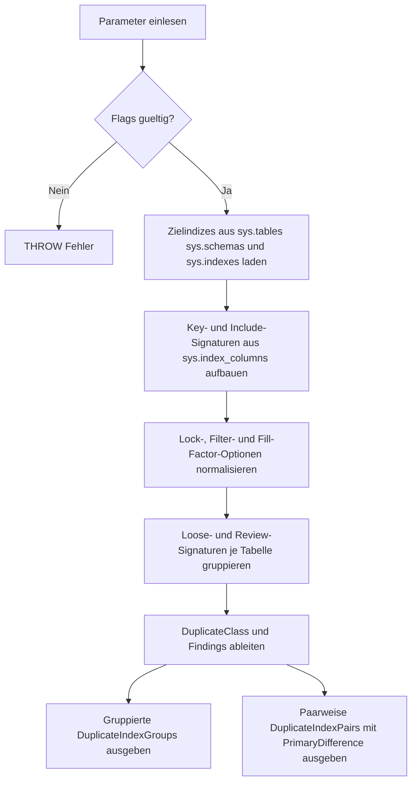

# DuplicateIndexDefinitionCheck.sql

Dieses Skript durchsucht die aktuelle Datenbank nach Indizes, deren technische Definition auf derselben Tabelle identisch oder fast identisch wirkt. Es ist als konservative Diagnose fuer Unterricht, Reviews und Aufraeumarbeiten gedacht und spricht bewusst nur Review-Signale aus.

## Uebersicht

<!-- SQLDOC:SUMMARY_TABLE:BEGIN -->
| Feld | Wert |
|---|---|
| Script | [DuplicateIndexDefinitionCheck.sql](DuplicateIndexDefinitionCheck.sql) |
| Version | `1.0` |
| Typ | `diagnostic-query` |
| Kapitel | `26_Indexes_Basics` |
| Sicherheit | `read-only` |
| Zweck | Findet auf derselben Tabelle technisch gleiche oder nahezu gleiche Indexdefinitionen. |
<!-- SQLDOC:SUMMARY_TABLE:END -->

## Einordnung

Im Kapitel `26_Indexes_Basics` ergaenzt das Skript die vorhandenen Inventur- und Review-Skripte um eine gezielte Frage: Welche Indizes unterscheiden sich praktisch nur im Namen oder in wenigen Randoptionen? Damit laesst sich die Indexlandschaft auf moegliche Doppelgaenger oder inkonsistente Varianten untersuchen.

## Annahmen

- Das Skript arbeitet rein lesend auf den Systemkatalogen der aktuellen Datenbank.
- Als Kern-Definition gelten Indextyp, Eindeutigkeit, Filterdefinition sowie Reihenfolge der Key- und Include-Spalten.
- Fast-Duplikate unterscheiden sich nur in Optionen wie `fill_factor`, `is_padded`, `allow_row_locks` oder `allow_page_locks`.
- Ein Duplikat-Signal ist keine automatische Drop-Empfehlung, weil Constraints, Workload und Deployment-Historie separat bewertet werden muessen.

## Anwendungsfall

Die erste Ausgabe gruppiert Indizes je Tabelle nach gleicher oder nahezu gleicher Definition. Die zweite Ausgabe zeigt die konkreten Indexpaare und benennt die wichtigste erkannte Differenz, damit Konsolidierungen oder Design-Korrekturen gezielt vorbereitet werden koennen.

## Parameter

<!-- SQLDOC:PARAMETERS_TABLE:BEGIN -->
| Parameter | SQL-Typ | Pflicht | Beschreibung |
|---|---|---|---|
| `@SchemaName` | `SYSNAME` | Nein | Optionaler Filter auf ein Schema. |
| `@TableName` | `SYSNAME` | Nein | Optionaler Filter auf einen Tabellennamen. |
| `@ShowOnlyDuplicates` | `BIT` | Nein | Zeigt bei `1` nur Gruppen mit Duplikat- oder Fast-Duplikat-Signal, bei `0` alle geprueften Indizes. |
| `@IgnoreFillFactor` | `BIT` | Nein | Ignoriert bei `1` den Fill Factor fuer das Fast-Duplikat-Signal, beruecksichtigt ihn bei `0`. |
<!-- SQLDOC:PARAMETERS_TABLE:END -->

## Abhaengigkeiten

<!-- SQLDOC:DEPENDENCIES_LIST:BEGIN -->
- `sys.tables`
- `sys.schemas`
- `sys.indexes`
- `sys.index_columns`
- `sys.columns`
- `sys.key_constraints`
- `CTE`
<!-- SQLDOC:DEPENDENCIES_LIST:END -->

## Hinweise

- `DuplicateIndexGroups` ist die kompakte Review-Sicht und zeigt gruppierte Kandidaten pro Tabelle.
- `DuplicateIndexPairs` zeigt nur Paare, deren Kern-Definition identisch ist; die Spalte `PrimaryDifference` fokussiert die wichtigste Optionabweichung.
- Wenn `@IgnoreFillFactor = 1`, werden unterschiedliche Fill-Factor-Werte im Review-Signal bewusst als Randoption behandelt.
- Primary Keys und Unique Constraints bleiben sichtbar, damit technische Doppelgaenger im Umfeld geschuetzter Objekte nicht uebersehen werden.

## Versionshistorie

<!-- SQLDOC:VERSION_HISTORY_TABLE:BEGIN -->
| Version | Datum | User | Beschreibung |
|---|---|---|---|
| `1.0` | `2026-04-17` | `ER` | Erstversion fuer die Diagnose nahezu identischer Indexdefinitionen |
<!-- SQLDOC:VERSION_HISTORY_TABLE:END -->

## Ablauf

<!-- SQLDOC:MERMAID:BEGIN -->

<!-- SQLDOC:MERMAID:END -->

## SQL-Code

<!-- SQLDOC:SQL_CODE:BEGIN -->
```sql
/*
BEGIN:SQL-HEADER v1
---
sql_header: v1
script_name: "DuplicateIndexDefinitionCheck.sql"
script_version: "1.0"
script_type: "diagnostic-query"
chapter: "26_Indexes_Basics"
purpose: >
  Findet auf derselben Tabelle technisch gleiche oder nahezu gleiche
  Indexdefinitionen und markiert moegliche Doppelgaenger fuer ein
  Review der Indexlandschaft.
parameters:
  - name: "@SchemaName"
    sql_type: "SYSNAME"
    direction: "IN"
    required: false
    description: "Optionaler Filter auf ein Schema"
  - name: "@TableName"
    sql_type: "SYSNAME"
    direction: "IN"
    required: false
    description: "Optionaler Filter auf einen Tabellennamen"
  - name: "@ShowOnlyDuplicates"
    sql_type: "BIT"
    direction: "IN"
    required: false
    description: "1 = nur Gruppen mit Duplikat- oder Fast-Duplikat-Signal zeigen, 0 = alle geprueften Indizes"
  - name: "@IgnoreFillFactor"
    sql_type: "BIT"
    direction: "IN"
    required: false
    description: "1 = Fill Factor fuer das Fast-Duplikat-Signal ignorieren, 0 = Fill Factor beruecksichtigen"
result_sets:
  - name: "DuplicateIndexGroups"
    description: "Gruppierte Sicht auf identische oder nahezu identische Indexdefinitionen je Tabelle"
  - name: "DuplicateIndexPairs"
    description: "Paarweise Detailansicht der betroffenen Indizes innerhalb einer Signaturgruppe"
dependencies:
  - "sys.tables"
  - "sys.schemas"
  - "sys.indexes"
  - "sys.index_columns"
  - "sys.columns"
  - "sys.key_constraints"
  - "CTE"
safety:
  level: "read-only"
  writes_data: false
documentation:
  markdown_file: "T-SQL/26_Indexes_Basics/SQLScripts/DuplicateIndexDefinitionCheck.md"
  sync_blocks:
    - "SUMMARY_TABLE"
    - "PARAMETERS_TABLE"
    - "DEPENDENCIES_LIST"
    - "VERSION_HISTORY_TABLE"
    - "SQL_CODE"
  mermaid:
    mode: "ai-agent-from-sql"
    source: "script-body"
main_responsible:
  name: "Erhard Rainer"
  initials: "ER"
version_history:
  - version: "1.0"
    date: "2026-04-17"
    user: "ER"
    description: "Erstversion fuer die Diagnose nahezu identischer Indexdefinitionen"
notes:
  - "Die Pruefung ist metadatenbasiert und ersetzt keine Bewertung gegen Query-Workload oder Zwangsobjekte"
  - "Fast-Duplikate koennen sich nur in Fill Factor oder Lock-Optionen unterscheiden und muessen fachlich bewertet werden"
---
END:SQL-HEADER v1
*/

SET NOCOUNT ON;

DECLARE @SchemaName SYSNAME = NULL;
DECLARE @TableName SYSNAME = NULL;
DECLARE @ShowOnlyDuplicates BIT = 1;
DECLARE @IgnoreFillFactor BIT = 1;

IF @ShowOnlyDuplicates NOT IN (0, 1)
BEGIN
    THROW 50000, '@ShowOnlyDuplicates muss 0 oder 1 sein.', 1;
END;

IF @IgnoreFillFactor NOT IN (0, 1)
BEGIN
    THROW 50000, '@IgnoreFillFactor muss 0 oder 1 sein.', 1;
END;

;WITH TargetIndexes AS
(
    SELECT
        s.name AS SchemaName,
        t.name AS TableName,
        t.object_id,
        i.index_id,
        i.name AS IndexName,
        i.type_desc AS IndexType,
        i.is_unique,
        i.is_primary_key,
        i.is_unique_constraint,
        i.has_filter,
        i.filter_definition,
        i.fill_factor,
        i.is_padded,
        i.allow_row_locks,
        i.allow_page_locks,
        kc.name AS ConstraintName
    FROM sys.tables AS t
    INNER JOIN sys.schemas AS s
        ON s.schema_id = t.schema_id
    INNER JOIN sys.indexes AS i
        ON i.object_id = t.object_id
    LEFT JOIN sys.key_constraints AS kc
        ON kc.parent_object_id = i.object_id
       AND kc.unique_index_id = i.index_id
    WHERE t.is_ms_shipped = 0
      AND i.index_id > 0
      AND i.is_hypothetical = 0
      AND i.is_disabled = 0
      AND (@SchemaName IS NULL OR s.name = @SchemaName)
      AND (@TableName IS NULL OR t.name = @TableName)
),
ColumnShapes AS
(
    SELECT
        ti.SchemaName,
        ti.TableName,
        ti.object_id,
        ti.index_id,
        ti.IndexName,
        STRING_AGG(
            CASE
                WHEN ic.is_included_column = 0 AND ic.key_ordinal > 0
                    THEN CONCAT(
                        QUOTENAME(c.name),
                        ' ',
                        CASE WHEN ic.is_descending_key = 1 THEN 'DESC' ELSE 'ASC' END
                    )
            END,
            ', '
        ) WITHIN GROUP (ORDER BY ic.key_ordinal) AS KeySignature,
        STRING_AGG(
            CASE
                WHEN ic.is_included_column = 1
                    THEN QUOTENAME(c.name)
            END,
            ', '
        ) WITHIN GROUP (ORDER BY ic.index_column_id) AS IncludeSignature
    FROM TargetIndexes AS ti
    INNER JOIN sys.index_columns AS ic
        ON ic.object_id = ti.object_id
       AND ic.index_id = ti.index_id
    INNER JOIN sys.columns AS c
        ON c.object_id = ic.object_id
       AND c.column_id = ic.column_id
    GROUP BY
        ti.SchemaName,
        ti.TableName,
        ti.object_id,
        ti.index_id,
        ti.IndexName
),
Normalized AS
(
    SELECT
        DB_NAME() AS DatabaseName,
        ti.SchemaName,
        ti.TableName,
        ti.object_id,
        ti.index_id,
        ti.IndexName,
        ti.IndexType,
        CAST(ti.is_unique AS BIT) AS IsUnique,
        CAST(ti.is_primary_key AS BIT) AS IsPrimaryKey,
        CAST(ti.is_unique_constraint AS BIT) AS IsUniqueConstraint,
        ti.ConstraintName,
        CAST(ti.has_filter AS BIT) AS HasFilter,
        ti.filter_definition AS FilterDefinition,
        ti.fill_factor AS FillFactor,
        CAST(ti.is_padded AS BIT) AS IsPadded,
        CAST(ti.allow_row_locks AS BIT) AS AllowRowLocks,
        CAST(ti.allow_page_locks AS BIT) AS AllowPageLocks,
        COALESCE(cs.KeySignature, '(no key columns)') AS KeySignature,
        COALESCE(cs.IncludeSignature, '(no include columns)') AS IncludeSignature,
        CONCAT(
            ti.IndexType, '|',
            CAST(ti.is_unique AS INT), '|',
            CAST(ti.has_filter AS INT), '|',
            COALESCE(ti.filter_definition, ''), '|',
            COALESCE(cs.KeySignature, ''), '|',
            COALESCE(cs.IncludeSignature, '')
        ) AS LooseSignature,
        CONCAT(
            ti.IndexType, '|',
            CAST(ti.is_unique AS INT), '|',
            CAST(ti.has_filter AS INT), '|',
            COALESCE(ti.filter_definition, ''), '|',
            COALESCE(cs.KeySignature, ''), '|',
            COALESCE(cs.IncludeSignature, ''), '|',
            CASE WHEN @IgnoreFillFactor = 1 THEN '*' ELSE CONVERT(VARCHAR(10), ti.fill_factor) END, '|',
            CAST(ti.is_padded AS INT), '|',
            CAST(ti.allow_row_locks AS INT), '|',
            CAST(ti.allow_page_locks AS INT)
        ) AS ReviewSignature
    FROM TargetIndexes AS ti
    LEFT JOIN ColumnShapes AS cs
        ON cs.object_id = ti.object_id
       AND cs.index_id = ti.index_id
),
LooseGroups AS
(
    SELECT
        n.object_id,
        n.LooseSignature,
        COUNT(*) AS LooseGroupCount
    FROM Normalized AS n
    GROUP BY
        n.object_id,
        n.LooseSignature
),
ReviewGroups AS
(
    SELECT
        n.object_id,
        n.ReviewSignature,
        COUNT(*) AS ReviewGroupCount
    FROM Normalized AS n
    GROUP BY
        n.object_id,
        n.ReviewSignature
),
Classified AS
(
    SELECT
        n.DatabaseName,
        n.SchemaName,
        n.TableName,
        n.object_id,
        n.index_id,
        n.IndexName,
        n.IndexType,
        n.IsUnique,
        n.IsPrimaryKey,
        n.IsUniqueConstraint,
        n.ConstraintName,
        n.HasFilter,
        n.FilterDefinition,
        n.FillFactor,
        n.IsPadded,
        n.AllowRowLocks,
        n.AllowPageLocks,
        n.KeySignature,
        n.IncludeSignature,
        lg.LooseGroupCount,
        rg.ReviewGroupCount,
        CAST(CASE WHEN lg.LooseGroupCount > 1 THEN 1 ELSE 0 END AS BIT) AS HasLooseDuplicateSignal,
        CAST(CASE WHEN rg.ReviewGroupCount > 1 THEN 1 ELSE 0 END AS BIT) AS HasReviewDuplicateSignal,
        CASE
            WHEN rg.ReviewGroupCount > 1 THEN 'exact-or-option-equal'
            WHEN lg.LooseGroupCount > 1 THEN 'near-duplicate-different-options'
            ELSE 'distinct-definition'
        END AS DuplicateClass,
        CASE
            WHEN rg.ReviewGroupCount > 1 THEN 'Definition stimmt inklusive beruecksichtigter Optionen ueberein.'
            WHEN lg.LooseGroupCount > 1 THEN 'Definition stimmt im Kern ueberein, unterscheidet sich aber nur in Randoptionen.'
            ELSE 'Keine weitere sehr aehnliche Definition auf derselben Tabelle gefunden.'
        END AS Finding
    FROM Normalized AS n
    INNER JOIN LooseGroups AS lg
        ON lg.object_id = n.object_id
       AND lg.LooseSignature = n.LooseSignature
    INNER JOIN ReviewGroups AS rg
        ON rg.object_id = n.object_id
       AND rg.ReviewSignature = n.ReviewSignature
),
SignatureSummary AS
(
    SELECT
        c.DatabaseName,
        c.SchemaName,
        c.TableName,
        c.object_id,
        c.DuplicateClass,
        c.KeySignature,
        c.IncludeSignature,
        c.HasFilter,
        c.FilterDefinition,
        c.IsUnique,
        MIN(c.FillFactor) AS MinFillFactor,
        MAX(c.FillFactor) AS MaxFillFactor,
        MIN(CAST(c.IsPadded AS INT)) AS MinIsPadded,
        MAX(CAST(c.IsPadded AS INT)) AS MaxIsPadded,
        MIN(CAST(c.AllowRowLocks AS INT)) AS MinAllowRowLocks,
        MAX(CAST(c.AllowRowLocks AS INT)) AS MaxAllowRowLocks,
        MIN(CAST(c.AllowPageLocks AS INT)) AS MinAllowPageLocks,
        MAX(CAST(c.AllowPageLocks AS INT)) AS MaxAllowPageLocks,
        COUNT(*) AS MatchingIndexCount,
        SUM(CASE WHEN c.IsPrimaryKey = 1 OR c.IsUniqueConstraint = 1 THEN 1 ELSE 0 END) AS ProtectedIndexCount,
        STRING_AGG(QUOTENAME(c.IndexName), ', ')
            WITHIN GROUP (ORDER BY c.IndexName) AS IndexNames
    FROM Classified AS c
    GROUP BY
        c.DatabaseName,
        c.SchemaName,
        c.TableName,
        c.object_id,
        c.DuplicateClass,
        c.KeySignature,
        c.IncludeSignature,
        c.HasFilter,
        c.FilterDefinition,
        c.IsUnique
)
SELECT
    ss.DatabaseName,
    ss.SchemaName,
    ss.TableName,
    ss.DuplicateClass,
    ss.MatchingIndexCount,
    ss.ProtectedIndexCount,
    ss.IsUnique,
    ss.HasFilter,
    ss.FilterDefinition,
    ss.KeySignature,
    ss.IncludeSignature,
    ss.MinFillFactor,
    ss.MaxFillFactor,
    ss.MinIsPadded,
    ss.MaxIsPadded,
    ss.MinAllowRowLocks,
    ss.MaxAllowRowLocks,
    ss.MinAllowPageLocks,
    ss.MaxAllowPageLocks,
    ss.IndexNames,
    CASE
        WHEN ss.DuplicateClass = 'exact-or-option-equal' THEN 'Moeglicher Doppelgaenger mit gleicher Review-Signatur.'
        WHEN ss.DuplicateClass = 'near-duplicate-different-options' THEN 'Kern-Definition doppelt; Unterschiede liegen nur in Randoptionen.'
        ELSE 'Nur Einzeldefinition.'
    END AS GroupFinding,
    CASE
        WHEN ss.ProtectedIndexCount > 0 THEN 'Zuerst pruefen, ob Primary Key oder Unique Constraint bewusst geschuetzt werden muss.'
        WHEN ss.DuplicateClass = 'exact-or-option-equal' THEN 'Mit Workload und Deployments pruefen, ob ein Index konsolidiert werden kann.'
        WHEN ss.DuplicateClass = 'near-duplicate-different-options' THEN 'Optionen vergleichen und nur bei fachlicher Gleichheit konsolidieren.'
        ELSE 'Keine Aktion erforderlich.'
    END AS SuggestedAction
FROM SignatureSummary AS ss
WHERE @ShowOnlyDuplicates = 0
   OR ss.MatchingIndexCount > 1
ORDER BY
    ss.MatchingIndexCount DESC,
    ss.SchemaName,
    ss.TableName,
    ss.DuplicateClass,
    ss.IndexNames;

SELECT
    left_idx.DatabaseName,
    left_idx.SchemaName,
    left_idx.TableName,
    left_idx.DuplicateClass,
    left_idx.IndexName AS IndexNameA,
    right_idx.IndexName AS IndexNameB,
    left_idx.IndexType,
    left_idx.IsUnique,
    left_idx.IsPrimaryKey,
    left_idx.IsUniqueConstraint,
    left_idx.ConstraintName,
    left_idx.HasFilter,
    left_idx.FilterDefinition,
    left_idx.KeySignature,
    left_idx.IncludeSignature,
    left_idx.FillFactor AS FillFactorA,
    right_idx.FillFactor AS FillFactorB,
    left_idx.IsPadded AS IsPaddedA,
    right_idx.IsPadded AS IsPaddedB,
    left_idx.AllowRowLocks AS AllowRowLocksA,
    right_idx.AllowRowLocks AS AllowRowLocksB,
    left_idx.AllowPageLocks AS AllowPageLocksA,
    right_idx.AllowPageLocks AS AllowPageLocksB,
    CASE
        WHEN left_idx.FillFactor <> right_idx.FillFactor THEN 'fill-factor'
        WHEN left_idx.IsPadded <> right_idx.IsPadded THEN 'is-padded'
        WHEN left_idx.AllowRowLocks <> right_idx.AllowRowLocks THEN 'allow-row-locks'
        WHEN left_idx.AllowPageLocks <> right_idx.AllowPageLocks THEN 'allow-page-locks'
        ELSE 'none'
    END AS PrimaryDifference,
    left_idx.Finding
FROM Classified AS left_idx
INNER JOIN Classified AS right_idx
    ON right_idx.object_id = left_idx.object_id
   AND right_idx.index_id > left_idx.index_id
   AND right_idx.LooseGroupCount > 1
   AND left_idx.LooseGroupCount > 1
   AND right_idx.KeySignature = left_idx.KeySignature
   AND right_idx.IncludeSignature = left_idx.IncludeSignature
   AND right_idx.IndexType = left_idx.IndexType
   AND right_idx.IsUnique = left_idx.IsUnique
   AND right_idx.HasFilter = left_idx.HasFilter
   AND ISNULL(right_idx.FilterDefinition, '') = ISNULL(left_idx.FilterDefinition, '')
WHERE @ShowOnlyDuplicates = 0
   OR left_idx.HasLooseDuplicateSignal = 1
ORDER BY
    left_idx.SchemaName,
    left_idx.TableName,
    left_idx.DuplicateClass,
    left_idx.IndexName,
    right_idx.IndexName;
```
<!-- SQLDOC:SQL_CODE:END -->
