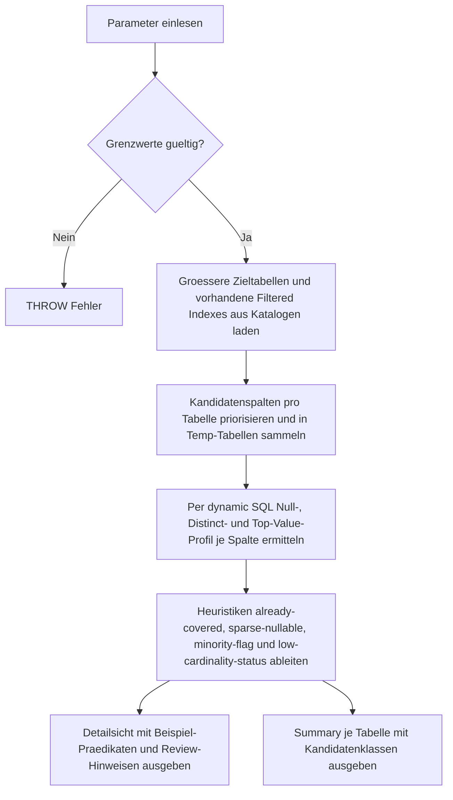

# FilteredIndexCandidateFinder.sql

Dieses Skript untersucht groessere Tabellen im Kapitel `26_Indexes_Basics` auf Spaltenmuster, die haeufig als Ausgangspunkt fuer Filtered Indexes dienen. Die Ausgabe ist bewusst konservativ und bleibt eine Review-Hilfe, keine automatische `CREATE INDEX`-Entscheidung.

## Uebersicht

<!-- SQLDOC:SUMMARY_TABLE:BEGIN -->
| Feld | Wert |
|---|---|
| Script | [FilteredIndexCandidateFinder.sql](FilteredIndexCandidateFinder.sql) |
| Version | `1.0` |
| Typ | `diagnostic-query` |
| Kapitel | `26_Indexes_Basics` |
| Sicherheit | `read-only` |
| Zweck | Findet konservative Kandidaten fuer Filtered Indexes auf Basis von sparse Nullable-Spalten, Minderheits-Flags und statusartigen Low-Cardinality-Spalten. |
<!-- SQLDOC:SUMMARY_TABLE:END -->

## Einordnung

Das Skript kombiniert Systemkataloge mit einem gezielten, rein lesenden Profiling ausgewaehlter Spalten. Dadurch lassen sich typische Filtered-Index-Muster frueh erkennen, ohne produktive Tabellen zu veraendern.

## Annahmen

- Der Fokus liegt auf der aktuellen Datenbank und groesseren Benutzertabellen ab `@MinimumRowCount`.
- Profilierte Kandidatenspalten werden pro Tabelle bewusst begrenzt, damit das Skript als Diagnose handhabbar bleibt.
- `sparse-nullable` signalisiert wenige belegte Zeilen und leitet deshalb ein Beispiel-Praedikat `IS NOT NULL` ab.
- `minority-flag` und `low-cardinality-status` liefern nur Heuristiken; die tatsaechlichen Query-Praedikate muessen separat validiert werden.
- Bereits vorhandene Filtered Indexes auf derselben Spalte werden als eigener Review-Fall markiert statt als neue Empfehlung missverstanden zu werden.

## Anwendungsfall

Die Detailausgabe zeigt pro Spalte Kennzahlen wie NULL-Anteil, Distinct-Anzahl, dominantem Wert und ein Beispiel-Praedikat. Die Summary verdichtet diese Signale je Tabelle, damit sich Review-Kandidaten zuerst auf Tabellen mit mehreren Treffern konzentrieren lassen.

## Parameter

<!-- SQLDOC:PARAMETERS_TABLE:BEGIN -->
| Parameter | SQL-Typ | Pflicht | Beschreibung |
|---|---|---|---|
| `@SchemaName` | `SYSNAME` | Nein | Optionaler Filter auf ein Schema. |
| `@TableName` | `SYSNAME` | Nein | Optionaler Filter auf einen Tabellennamen. |
| `@MinimumRowCount` | `BIGINT` | Nein | Nur Tabellen mit mindestens dieser Zeilenzahl werden profiliert. |
| `@TopColumnsPerTable` | `INT` | Nein | Begrenzt die Zahl der zu profilierenden Kandidatenspalten je Tabelle. |
| `@NullSelectivityMax` | `DECIMAL(5,4)` | Nein | Maximaler Anteil belegter Nullable-Zeilen fuer `sparse-nullable`. |
| `@LowCardinalityMaxDistinct` | `INT` | Nein | Maximale Anzahl unterschiedlicher Nicht-NULL-Werte fuer statusartige Kandidaten. |
| `@MinorityValueMaxShare` | `DECIMAL(5,4)` | Nein | Maximaler Anteil des Minderheitswertes fuer Flag- oder Status-Kandidaten. |
<!-- SQLDOC:PARAMETERS_TABLE:END -->

## Abhaengigkeiten

<!-- SQLDOC:DEPENDENCIES_LIST:BEGIN -->
- `sys.tables`
- `sys.schemas`
- `sys.columns`
- `sys.types`
- `sys.indexes`
- `sys.index_columns`
- `sys.dm_db_partition_stats`
- `temp tables`
- `dynamic SQL`
<!-- SQLDOC:DEPENDENCIES_LIST:END -->

## Hinweise

- Bereits vorhandene Filtered Indexes auf derselben Fuehrungsspalte werden als `already-covered` markiert.
- `TopColumnsPerTable` priorisiert Bit-, Nullable- und statusartige Spalten, damit das Profiling pro Lauf begrenzt bleibt.
- Das Beispiel-Praedikat fuer `low-cardinality-status` bleibt absichtlich ein Template, weil die fachlich relevanten Minderheitswerte aus der Workload kommen muessen.
- Ein kleiner Minderheitsanteil alleine rechtfertigt noch keinen Filtered Index, wenn Sortierung, Include-Liste oder Pflegekosten dagegen sprechen.

## Versionshistorie

<!-- SQLDOC:VERSION_HISTORY_TABLE:BEGIN -->
| Version | Datum | User | Beschreibung |
|---|---|---|---|
| `1.0` | `2026-04-17` | `ER` | Erstversion fuer die konservative Suche nach Filtered-Index-Kandidaten |
<!-- SQLDOC:VERSION_HISTORY_TABLE:END -->

## Ablauf

<!-- SQLDOC:MERMAID:BEGIN -->

<!-- SQLDOC:MERMAID:END -->

## SQL-Code

<!-- SQLDOC:SQL_CODE:BEGIN -->
```sql
/*
BEGIN:SQL-HEADER v1
---
sql_header: v1
script_name: "FilteredIndexCandidateFinder.sql"
script_version: "1.0"
script_type: "diagnostic-query"
chapter: "26_Indexes_Basics"
purpose: >
  Findet konservative Kandidaten fuer Filtered Indexes, indem groessere
  Tabellen auf sparse Nullable-Spalten, Minderheits-Flags und
  statusartige Low-Cardinality-Spalten untersucht werden.
parameters:
  - name: "@SchemaName"
    sql_type: "SYSNAME"
    direction: "IN"
    required: false
    description: "Optionaler Filter auf ein Schema"
  - name: "@TableName"
    sql_type: "SYSNAME"
    direction: "IN"
    required: false
    description: "Optionaler Filter auf einen Tabellennamen"
  - name: "@MinimumRowCount"
    sql_type: "BIGINT"
    direction: "IN"
    required: false
    description: "Nur Tabellen mit mindestens dieser Zeilenzahl werden profiliert"
  - name: "@TopColumnsPerTable"
    sql_type: "INT"
    direction: "IN"
    required: false
    description: "Begrenzt die Zahl der zu profilierenden Kandidatenspalten je Tabelle"
  - name: "@NullSelectivityMax"
    sql_type: "DECIMAL(5,4)"
    direction: "IN"
    required: false
    description: "Maximaler Anteil belegter Nullable-Zeilen fuer den sparse-nullable-Kandidaten"
  - name: "@LowCardinalityMaxDistinct"
    sql_type: "INT"
    direction: "IN"
    required: false
    description: "Maximale Anzahl unterschiedlicher Nicht-NULL-Werte fuer statusartige Kandidaten"
  - name: "@MinorityValueMaxShare"
    sql_type: "DECIMAL(5,4)"
    direction: "IN"
    required: false
    description: "Maximaler Anteil des Minderheitswertes fuer Flag- oder Status-Kandidaten"
result_sets:
  - name: "FilteredIndexCandidates"
    description: "Detailsicht je profilierter Spalte mit Heuristik, Beispiel-Praedikat und Review-Hinweis"
  - name: "FilteredIndexCandidateSummary"
    description: "Verdichtung je Tabelle mit Anzahl und Verteilung der erkannten Kandidaten"
dependencies:
  - "sys.tables"
  - "sys.schemas"
  - "sys.columns"
  - "sys.types"
  - "sys.indexes"
  - "sys.index_columns"
  - "sys.dm_db_partition_stats"
  - "temp tables"
  - "dynamic SQL"
safety:
  level: "read-only"
  writes_data: false
documentation:
  markdown_file: "T-SQL/26_Indexes_Basics/SQLScripts/FilteredIndexCandidateFinder.md"
  sync_blocks:
    - "SUMMARY_TABLE"
    - "PARAMETERS_TABLE"
    - "DEPENDENCIES_LIST"
    - "VERSION_HISTORY_TABLE"
    - "SQL_CODE"
  mermaid:
    mode: "ai-agent-from-sql"
    source: "script-body"
main_responsible:
  name: "Erhard Rainer"
  initials: "ER"
version_history:
  - version: "1.0"
    date: "2026-04-17"
    user: "ER"
    description: "Erstversion fuer die konservative Suche nach Filtered-Index-Kandidaten"
notes:
  - "Die Heuristiken liefern Review-Signale und keine automatische CREATE INDEX-Empfehlung."
  - "Das Profiling liest nur Tabellen der aktuellen Datenbank und erzeugt keine persistenten Objekte."
---
END:SQL-HEADER v1
*/

SET NOCOUNT ON;

DECLARE @SchemaName SYSNAME = NULL;
DECLARE @TableName SYSNAME = NULL;
DECLARE @MinimumRowCount BIGINT = 1000;
DECLARE @TopColumnsPerTable INT = 5;
DECLARE @NullSelectivityMax DECIMAL(5,4) = 0.1500;
DECLARE @LowCardinalityMaxDistinct INT = 8;
DECLARE @MinorityValueMaxShare DECIMAL(5,4) = 0.2000;

IF @MinimumRowCount < 1
BEGIN
    THROW 50000, '@MinimumRowCount muss mindestens 1 sein.', 1;
END;

IF @TopColumnsPerTable < 1
BEGIN
    THROW 50000, '@TopColumnsPerTable muss mindestens 1 sein.', 1;
END;

IF @NullSelectivityMax <= 0 OR @NullSelectivityMax >= 1
BEGIN
    THROW 50000, '@NullSelectivityMax muss groesser als 0 und kleiner als 1 sein.', 1;
END;

IF @LowCardinalityMaxDistinct < 2
BEGIN
    THROW 50000, '@LowCardinalityMaxDistinct muss mindestens 2 sein.', 1;
END;

IF @MinorityValueMaxShare <= 0 OR @MinorityValueMaxShare >= 1
BEGIN
    THROW 50000, '@MinorityValueMaxShare muss groesser als 0 und kleiner als 1 sein.', 1;
END;

CREATE TABLE #CandidateColumns
(
    CandidateId INT IDENTITY(1,1) NOT NULL PRIMARY KEY,
    object_id INT NOT NULL,
    column_id INT NOT NULL,
    SchemaName SYSNAME NOT NULL,
    TableName SYSNAME NOT NULL,
    ColumnName SYSNAME NOT NULL,
    DataTypeName SYSNAME NOT NULL,
    RowCount BIGINT NOT NULL,
    IsNullable BIT NOT NULL,
    NameLooksFlag BIT NOT NULL,
    NameLooksStatus BIT NOT NULL,
    ExistingFilteredIndexCount INT NOT NULL,
    ExistingFilteredIndexNames NVARCHAR(MAX) NULL
);

CREATE TABLE #ColumnProfiles
(
    object_id INT NOT NULL,
    column_id INT NOT NULL,
    TotalRows BIGINT NOT NULL,
    NullRows BIGINT NOT NULL,
    NonNullRows BIGINT NOT NULL,
    NonNullDistinctCount BIGINT NOT NULL,
    TopValue NVARCHAR(4000) NULL,
    TopValueRows BIGINT NOT NULL
);

;WITH TableRowCounts AS
(
    SELECT
        ps.object_id,
        SUM(ps.row_count) AS RowCount
    FROM sys.dm_db_partition_stats AS ps
    WHERE ps.index_id IN (0, 1)
    GROUP BY
        ps.object_id
),
FilteredIndexColumns AS
(
    SELECT
        i.object_id,
        ic.column_id,
        COUNT(DISTINCT i.index_id) AS ExistingFilteredIndexCount,
        STRING_AGG(QUOTENAME(i.name), ', ') WITHIN GROUP (ORDER BY i.name) AS ExistingFilteredIndexNames
    FROM sys.indexes AS i
    INNER JOIN sys.index_columns AS ic
        ON ic.object_id = i.object_id
       AND ic.index_id = i.index_id
    WHERE i.has_filter = 1
      AND i.is_hypothetical = 0
      AND i.is_disabled = 0
      AND ic.key_ordinal > 0
    GROUP BY
        i.object_id,
        ic.column_id
),
CandidateBase AS
(
    SELECT
        t.object_id,
        s.name AS SchemaName,
        t.name AS TableName,
        c.column_id,
        c.name AS ColumnName,
        ty.name AS DataTypeName,
        tr.RowCount,
        CAST(c.is_nullable AS BIT) AS IsNullable,
        CAST(
            CASE
                WHEN c.name LIKE 'Is%' OR c.name LIKE 'Has%' OR c.name LIKE '%Flag%' OR c.name LIKE '%Enabled%'
                    THEN 1
                ELSE 0
            END AS BIT
        ) AS NameLooksFlag,
        CAST(
            CASE
                WHEN c.name LIKE '%Status%' OR c.name LIKE '%State%' OR c.name LIKE '%Stage%' OR c.name LIKE '%Type%'
                    THEN 1
                ELSE 0
            END AS BIT
        ) AS NameLooksStatus,
        ISNULL(fic.ExistingFilteredIndexCount, 0) AS ExistingFilteredIndexCount,
        fic.ExistingFilteredIndexNames,
        ROW_NUMBER() OVER
        (
            PARTITION BY t.object_id
            ORDER BY
                CASE
                    WHEN ty.name = 'bit' THEN 1
                    WHEN c.is_nullable = 1 THEN 2
                    WHEN c.name LIKE '%Status%' OR c.name LIKE '%State%' OR c.name LIKE '%Stage%' OR c.name LIKE '%Type%' THEN 3
                    WHEN c.name LIKE 'Is%' OR c.name LIKE 'Has%' OR c.name LIKE '%Flag%' OR c.name LIKE '%Enabled%' THEN 4
                    ELSE 5
                END,
                c.column_id
        ) AS CandidateRank
    FROM sys.tables AS t
    INNER JOIN sys.schemas AS s
        ON s.schema_id = t.schema_id
    INNER JOIN TableRowCounts AS tr
        ON tr.object_id = t.object_id
    INNER JOIN sys.columns AS c
        ON c.object_id = t.object_id
    INNER JOIN sys.types AS ty
        ON ty.user_type_id = c.user_type_id
    LEFT JOIN FilteredIndexColumns AS fic
        ON fic.object_id = c.object_id
       AND fic.column_id = c.column_id
    WHERE t.is_ms_shipped = 0
      AND tr.RowCount >= @MinimumRowCount
      AND c.is_computed = 0
      AND ty.name IN ('bit', 'tinyint', 'smallint', 'int', 'bigint', 'char', 'nchar', 'varchar', 'nvarchar')
      AND (
            c.is_nullable = 1
         OR ty.name = 'bit'
         OR c.name LIKE '%Status%'
         OR c.name LIKE '%State%'
         OR c.name LIKE '%Stage%'
         OR c.name LIKE '%Type%'
         OR c.name LIKE 'Is%'
         OR c.name LIKE 'Has%'
         OR c.name LIKE '%Flag%'
         OR c.name LIKE '%Enabled%'
      )
      AND (@SchemaName IS NULL OR s.name = @SchemaName)
      AND (@TableName IS NULL OR t.name = @TableName)
)
INSERT INTO #CandidateColumns
(
    object_id,
    column_id,
    SchemaName,
    TableName,
    ColumnName,
    DataTypeName,
    RowCount,
    IsNullable,
    NameLooksFlag,
    NameLooksStatus,
    ExistingFilteredIndexCount,
    ExistingFilteredIndexNames
)
SELECT
    cb.object_id,
    cb.column_id,
    cb.SchemaName,
    cb.TableName,
    cb.ColumnName,
    cb.DataTypeName,
    cb.RowCount,
    cb.IsNullable,
    cb.NameLooksFlag,
    cb.NameLooksStatus,
    cb.ExistingFilteredIndexCount,
    cb.ExistingFilteredIndexNames
FROM CandidateBase AS cb
WHERE cb.CandidateRank <= @TopColumnsPerTable;

DECLARE
    @CandidateId INT = 1,
    @CandidateMax INT,
    @CurrentObjectId INT,
    @CurrentColumnId INT,
    @CurrentSchema SYSNAME,
    @CurrentTable SYSNAME,
    @CurrentColumn SYSNAME,
    @Sql NVARCHAR(MAX);

SELECT @CandidateMax = MAX(cc.CandidateId)
FROM #CandidateColumns AS cc;

WHILE @CandidateId IS NOT NULL
  AND @CandidateId <= ISNULL(@CandidateMax, 0)
BEGIN
    SELECT
        @CurrentObjectId = cc.object_id,
        @CurrentColumnId = cc.column_id,
        @CurrentSchema = cc.SchemaName,
        @CurrentTable = cc.TableName,
        @CurrentColumn = cc.ColumnName
    FROM #CandidateColumns AS cc
    WHERE cc.CandidateId = @CandidateId;

    IF @CurrentObjectId IS NOT NULL
    BEGIN
        SET @Sql = N'
WITH ProfileBase AS
(
    SELECT
        COUNT_BIG(*) AS TotalRows,
        SUM(CASE WHEN ' + QUOTENAME(@CurrentColumn) + N' IS NULL THEN 1 ELSE 0 END) AS NullRows,
        COUNT_BIG(DISTINCT CASE
            WHEN ' + QUOTENAME(@CurrentColumn) + N' IS NULL THEN NULL
            ELSE CONVERT(NVARCHAR(4000), ' + QUOTENAME(@CurrentColumn) + N')
        END) AS NonNullDistinctCount
    FROM ' + QUOTENAME(@CurrentSchema) + N'.' + QUOTENAME(@CurrentTable) + N'
),
TopValueProbe AS
(
    SELECT TOP (1)
        CONVERT(NVARCHAR(4000), ' + QUOTENAME(@CurrentColumn) + N') AS TopValue,
        COUNT_BIG(*) AS TopValueRows
    FROM ' + QUOTENAME(@CurrentSchema) + N'.' + QUOTENAME(@CurrentTable) + N'
    WHERE ' + QUOTENAME(@CurrentColumn) + N' IS NOT NULL
    GROUP BY CONVERT(NVARCHAR(4000), ' + QUOTENAME(@CurrentColumn) + N')
    ORDER BY COUNT_BIG(*) DESC, CONVERT(NVARCHAR(4000), ' + QUOTENAME(@CurrentColumn) + N')
)
INSERT INTO #ColumnProfiles
(
    object_id,
    column_id,
    TotalRows,
    NullRows,
    NonNullRows,
    NonNullDistinctCount,
    TopValue,
    TopValueRows
)
SELECT
    @ObjectId,
    @ColumnId,
    pb.TotalRows,
    pb.NullRows,
    pb.TotalRows - pb.NullRows,
    pb.NonNullDistinctCount,
    tv.TopValue,
    ISNULL(tv.TopValueRows, 0)
FROM ProfileBase AS pb
LEFT JOIN TopValueProbe AS tv
    ON 1 = 1;';

        EXEC sys.sp_executesql
            @Sql,
            N'@ObjectId INT, @ColumnId INT',
            @ObjectId = @CurrentObjectId,
            @ColumnId = @CurrentColumnId;
    END;

    SELECT
        @CurrentObjectId = NULL,
        @CurrentColumnId = NULL,
        @CurrentSchema = NULL,
        @CurrentTable = NULL,
        @CurrentColumn = NULL;

    SET @CandidateId += 1;
END;

;WITH Classified AS
(
    SELECT
        DB_NAME() AS DatabaseName,
        cc.SchemaName,
        cc.TableName,
        cc.ColumnName,
        cc.DataTypeName,
        cc.RowCount,
        cc.IsNullable,
        cc.ExistingFilteredIndexCount,
        cc.ExistingFilteredIndexNames,
        cp.TotalRows,
        cp.NullRows,
        cp.NonNullRows,
        cp.NonNullDistinctCount,
        cp.TopValue,
        cp.TopValueRows,
        CAST(1.0 * cp.NullRows / NULLIF(cp.TotalRows, 0) AS DECIMAL(9,4)) AS NullShare,
        CAST(1.0 * cp.TopValueRows / NULLIF(cp.NonNullRows, 0) AS DECIMAL(9,4)) AS TopValueShare,
        CAST(1.0 * (cp.NonNullRows - cp.TopValueRows) / NULLIF(cp.NonNullRows, 0) AS DECIMAL(9,4)) AS MinorityShare,
        CASE
            WHEN cc.ExistingFilteredIndexCount > 0 THEN 'already-covered'
            WHEN cc.IsNullable = 1
             AND cp.NonNullRows > 0
             AND 1.0 * cp.NonNullRows / NULLIF(cp.TotalRows, 0) <= @NullSelectivityMax
                THEN 'sparse-nullable'
            WHEN cc.DataTypeName = 'bit'
             AND cp.NonNullDistinctCount = 2
             AND 1.0 * (cp.NonNullRows - cp.TopValueRows) / NULLIF(cp.NonNullRows, 0) <= @MinorityValueMaxShare
                THEN 'minority-flag'
            WHEN cc.NameLooksStatus = 1
             AND cp.NonNullDistinctCount BETWEEN 2 AND @LowCardinalityMaxDistinct
             AND 1.0 * (cp.NonNullRows - cp.TopValueRows) / NULLIF(cp.NonNullRows, 0) <= @MinorityValueMaxShare
                THEN 'low-cardinality-status'
            ELSE 'no-signal'
        END AS CandidateClass
    FROM #CandidateColumns AS cc
    INNER JOIN #ColumnProfiles AS cp
        ON cp.object_id = cc.object_id
       AND cp.column_id = cc.column_id
)
SELECT
    c.DatabaseName,
    c.SchemaName,
    c.TableName,
    c.ColumnName,
    c.DataTypeName,
    c.RowCount,
    c.CandidateClass,
    c.TotalRows,
    c.NullRows,
    c.NonNullRows,
    c.NonNullDistinctCount,
    c.TopValue,
    c.TopValueRows,
    c.NullShare,
    c.TopValueShare,
    c.MinorityShare,
    c.ExistingFilteredIndexCount,
    c.ExistingFilteredIndexNames,
    CASE
        WHEN c.CandidateClass = 'sparse-nullable' THEN CONCAT('WHERE ', QUOTENAME(c.ColumnName), ' IS NOT NULL')
        WHEN c.CandidateClass = 'minority-flag' AND c.TopValue = '0' THEN CONCAT('WHERE ', QUOTENAME(c.ColumnName), ' = 1')
        WHEN c.CandidateClass = 'minority-flag' AND c.TopValue = '1' THEN CONCAT('WHERE ', QUOTENAME(c.ColumnName), ' = 0')
        WHEN c.CandidateClass = 'low-cardinality-status' THEN CONCAT('WHERE ', QUOTENAME(c.ColumnName), ' IN (<minority_status_values>)')
        WHEN c.CandidateClass = 'already-covered' THEN 'Bereits durch vorhandenen Filter-Index pruefen'
        ELSE 'Kein konservatives Praedikat abgeleitet'
    END AS ExampleFilterPredicate,
    CASE
        WHEN c.CandidateClass = 'already-covered' THEN 'Auf derselben Spalte existiert bereits mindestens ein Filtered Index; nur Delta gegen bestehende Definitionen pruefen.'
        WHEN c.CandidateClass = 'sparse-nullable' THEN 'Nur ein kleiner Teil der Zeilen ist belegt; ein Filter auf belegte Zeilen kann Pflegeaufwand und Blattgroesse begrenzen.'
        WHEN c.CandidateClass = 'minority-flag' THEN 'Die Bit-Spalte zeigt einen seltenen Minderheitswert, der sich haeufig als Ziel eines selektiven Filtered Indexes eignet.'
        WHEN c.CandidateClass = 'low-cardinality-status' THEN 'Die statusartige Spalte hat wenige Werte und einen kleinen Minderheitsanteil; dies ist ein typisches Review-Signal fuer gezielte Status-Indizes.'
        ELSE 'Kein ausreichend konservatives Signal nach den aktuellen Grenzwerten.'
    END AS ReviewReason,
    CASE
        WHEN c.CandidateClass = 'already-covered' THEN 'Bestehende Filterdefinition, Includes und Query-Muster vergleichen.'
        WHEN c.CandidateClass IN ('sparse-nullable', 'minority-flag', 'low-cardinality-status') THEN 'Nur mit echten Praedikaten, Sortierungen und Update-Frequenzen gegen die Workload validieren.'
        ELSE 'Keine Aktion.'
    END AS SuggestedAction
FROM Classified AS c
WHERE c.CandidateClass <> 'no-signal'
ORDER BY
    CASE c.CandidateClass
        WHEN 'already-covered' THEN 1
        WHEN 'sparse-nullable' THEN 2
        WHEN 'minority-flag' THEN 3
        WHEN 'low-cardinality-status' THEN 4
        ELSE 5
    END,
    c.MinorityShare,
    c.NullShare,
    c.SchemaName,
    c.TableName,
    c.ColumnName;

;WITH Classified AS
(
    SELECT
        cc.SchemaName,
        cc.TableName,
        CASE
            WHEN cc.ExistingFilteredIndexCount > 0 THEN 'already-covered'
            WHEN cc.IsNullable = 1
             AND cp.NonNullRows > 0
             AND 1.0 * cp.NonNullRows / NULLIF(cp.TotalRows, 0) <= @NullSelectivityMax
                THEN 'sparse-nullable'
            WHEN cc.DataTypeName = 'bit'
             AND cp.NonNullDistinctCount = 2
             AND 1.0 * (cp.NonNullRows - cp.TopValueRows) / NULLIF(cp.NonNullRows, 0) <= @MinorityValueMaxShare
                THEN 'minority-flag'
            WHEN cc.NameLooksStatus = 1
             AND cp.NonNullDistinctCount BETWEEN 2 AND @LowCardinalityMaxDistinct
             AND 1.0 * (cp.NonNullRows - cp.TopValueRows) / NULLIF(cp.NonNullRows, 0) <= @MinorityValueMaxShare
                THEN 'low-cardinality-status'
            ELSE 'no-signal'
        END AS CandidateClass
    FROM #CandidateColumns AS cc
    INNER JOIN #ColumnProfiles AS cp
        ON cp.object_id = cc.object_id
       AND cp.column_id = cc.column_id
)
SELECT
    DB_NAME() AS DatabaseName,
    c.SchemaName,
    c.TableName,
    COUNT(*) AS CandidateCount,
    SUM(CASE WHEN c.CandidateClass = 'already-covered' THEN 1 ELSE 0 END) AS AlreadyCoveredCount,
    SUM(CASE WHEN c.CandidateClass = 'sparse-nullable' THEN 1 ELSE 0 END) AS SparseNullableCount,
    SUM(CASE WHEN c.CandidateClass = 'minority-flag' THEN 1 ELSE 0 END) AS MinorityFlagCount,
    SUM(CASE WHEN c.CandidateClass = 'low-cardinality-status' THEN 1 ELSE 0 END) AS LowCardinalityStatusCount
FROM Classified AS c
WHERE c.CandidateClass <> 'no-signal'
GROUP BY
    c.SchemaName,
    c.TableName
ORDER BY
    CandidateCount DESC,
    c.SchemaName,
    c.TableName;
```
<!-- SQLDOC:SQL_CODE:END -->
