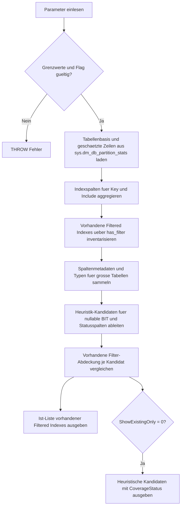

# FilteredIndexCoverageMap.sql

Dieses Skript kartiert vorhandene `Filtered Indexes` in der aktuellen Datenbank und ergaenzt sie um eine konservative Heuristikliste fuer moegliche weitere Filter-Praedikate. Der Fokus liegt auf Metadaten, Review-Unterstuetzung und Unterricht, nicht auf einer automatischen Indexempfehlung.

## Uebersicht

<!-- SQLDOC:SUMMARY_TABLE:BEGIN -->
| Feld | Wert |
|---|---|
| Script | [FilteredIndexCoverageMap.sql](FilteredIndexCoverageMap.sql) |
| Version | `1.0` |
| Typ | `diagnostic-query` |
| Kapitel | `26_Indexes_Basics` |
| Sicherheit | `read-only` |
| Zweck | Kartiert vorhandene Filtered Indexes und leitet konservative Kandidaten fuer moegliche Filter-Praedikate ab. |
<!-- SQLDOC:SUMMARY_TABLE:END -->

## Einordnung

Im Kapitel `26_Indexes_Basics` schliesst dieses Skript die Luecke zwischen einer reinen Indexinventur und der Frage, wo Filtered Indexes bereits bewusst eingesetzt werden oder auf grossen Tabellen moeglicherweise sinnvoll waeren. Die zweite Ausgabe bleibt absichtlich heuristisch und liefert nur Review-Ansatzpunkte.

## Annahmen

- Das Skript arbeitet rein lesend auf Systemkatalogen und `sys.dm_db_partition_stats`.
- Bestehende Filtered Indexes werden direkt aus `sys.indexes.has_filter` und `filter_definition` gelesen.
- Moegliche Kandidaten beruhen nur auf Metadatenmustern wie `NULL`-faehigen Spalten, `BIT`-Flags und generischen Statusspalten.
- Ein Template wie `[Status] = <target-status>` ist bewusst unvollstaendig und muss mit realen Werten, Selektivitaet und Workload validiert werden.

## Anwendungsfall

Die erste Ausgabe zeigt, wo Filtered Indexes bereits existieren, inklusive Schluesselspalten, Include-Liste und Filterdefinition. Die zweite Ausgabe liefert pro grosser Tabelle konservative Kandidaten fuer Review-Gespraeche, etwa `IS NOT NULL`- oder Flag-basierte Filter auf aktive Teilmengen.

## Parameter

<!-- SQLDOC:PARAMETERS_TABLE:BEGIN -->
| Parameter | SQL-Typ | Pflicht | Beschreibung |
|---|---|---|---|
| `@SchemaName` | `SYSNAME` | Nein | Optionaler Filter auf ein Schema. |
| `@TableName` | `SYSNAME` | Nein | Optionaler Filter auf einen Tabellennamen. |
| `@MinRowCount` | `BIGINT` | Nein | Mindestanzahl geschaetzter Zeilen fuer Heuristik-Kandidaten. |
| `@ShowExistingOnly` | `BIT` | Nein | Zeigt bei `1` nur vorhandene Filtered Indexes, bei `0` auch heuristische Kandidaten. |
<!-- SQLDOC:PARAMETERS_TABLE:END -->

## Abhaengigkeiten

<!-- SQLDOC:DEPENDENCIES_LIST:BEGIN -->
- `sys.tables`
- `sys.schemas`
- `sys.indexes`
- `sys.index_columns`
- `sys.columns`
- `sys.types`
- `sys.dm_db_partition_stats`
- `CTE`
<!-- SQLDOC:DEPENDENCIES_LIST:END -->

## Hinweise

- `FilteredIndexInventory` ist die belastbare Ist-Sicht auf bereits angelegte Filtered Indexes.
- `FilteredIndexHeuristicCandidates` ist nur eine Review-Hilfe und ersetzt keine Analyse von Histogrammen, Predicate-Nutzung oder Query Store.
- `HasColumnNamedInExistingFilter` prueft nur, ob der Spaltenname in einer vorhandenen Filterdefinition auftaucht; semantische Gleichheit wird nicht bewiesen.

## Versionshistorie

<!-- SQLDOC:VERSION_HISTORY_TABLE:BEGIN -->
| Version | Datum | User | Beschreibung |
|---|---|---|---|
| `1.0` | `2026-04-17` | `ER` | Erstversion fuer die Karte vorhandener und moeglicher Filtered Indexes |
<!-- SQLDOC:VERSION_HISTORY_TABLE:END -->

## Ablauf

<!-- SQLDOC:MERMAID:BEGIN -->

<!-- SQLDOC:MERMAID:END -->

## SQL-Code

<!-- SQLDOC:SQL_CODE:BEGIN -->
```sql
/*
BEGIN:SQL-HEADER v1
---
sql_header: v1
script_name: "FilteredIndexCoverageMap.sql"
script_version: "1.0"
script_type: "diagnostic-query"
chapter: "26_Indexes_Basics"
purpose: >
  Kartiert vorhandene Filtered Indexes und leitet aus Tabellen- und
  Spaltenmetadaten konservative Kandidaten fuer moegliche Filter-Praedikate
  ab.
parameters:
  - name: "@SchemaName"
    sql_type: "SYSNAME"
    direction: "IN"
    required: false
    description: "Optionaler Filter auf ein Schema"
  - name: "@TableName"
    sql_type: "SYSNAME"
    direction: "IN"
    required: false
    description: "Optionaler Filter auf einen Tabellennamen"
  - name: "@MinRowCount"
    sql_type: "BIGINT"
    direction: "IN"
    required: false
    description: "Mindestanzahl geschaetzter Zeilen fuer Heuristik-Kandidaten"
  - name: "@ShowExistingOnly"
    sql_type: "BIT"
    direction: "IN"
    required: false
    description: "1 = nur vorhandene Filtered Indexes zeigen, 0 = vorhandene und moegliche Kandidaten"
result_sets:
  - name: "FilteredIndexInventory"
    description: "Vorhandene Filtered Indexes mit Definition, Schluesseln und Include-Spalten"
  - name: "FilteredIndexHeuristicCandidates"
    description: "Konservative Metadaten-Heuristiken fuer moegliche Filtered-Index-Praedikate"
dependencies:
  - "sys.tables"
  - "sys.schemas"
  - "sys.indexes"
  - "sys.index_columns"
  - "sys.columns"
  - "sys.types"
  - "sys.dm_db_partition_stats"
  - "CTE"
safety:
  level: "read-only"
  writes_data: false
documentation:
  markdown_file: "T-SQL/26_Indexes_Basics/SQLScripts/FilteredIndexCoverageMap.md"
  sync_blocks:
    - "SUMMARY_TABLE"
    - "PARAMETERS_TABLE"
    - "DEPENDENCIES_LIST"
    - "VERSION_HISTORY_TABLE"
    - "SQL_CODE"
  mermaid:
    mode: "ai-agent-from-sql"
    source: "script-body"
main_responsible:
  name: "Erhard Rainer"
  initials: "ER"
version_history:
  - version: "1.0"
    date: "2026-04-17"
    user: "ER"
    description: "Erstversion fuer die Karte vorhandener und moeglicher Filtered Indexes"
notes:
  - "Moegliche Kandidaten werden rein heuristisch aus Metadaten abgeleitet und sind keine automatische Index-Empfehlung"
  - "Ohne Datenverteilung und Workload-Analyse bleiben Filter-Praedikate bewusst bei konservativen Templates wie IS NOT NULL oder BIT-Flags"
---
END:SQL-HEADER v1
*/

SET NOCOUNT ON;

DECLARE @SchemaName SYSNAME = NULL;
DECLARE @TableName SYSNAME = NULL;
DECLARE @MinRowCount BIGINT = 10000;
DECLARE @ShowExistingOnly BIT = 0;

IF @MinRowCount < 0
BEGIN
    THROW 50000, '@MinRowCount darf nicht negativ sein.', 1;
END;

IF @ShowExistingOnly NOT IN (0, 1)
BEGIN
    THROW 50000, '@ShowExistingOnly muss 0 oder 1 sein.', 1;
END;

;WITH TableBase AS
(
    SELECT
        s.name AS SchemaName,
        t.name AS TableName,
        t.object_id,
        SUM(ps.row_count) AS EstimatedRowCount
    FROM sys.tables AS t
    INNER JOIN sys.schemas AS s
        ON s.schema_id = t.schema_id
    INNER JOIN sys.dm_db_partition_stats AS ps
        ON ps.object_id = t.object_id
       AND ps.index_id IN (0, 1)
    WHERE t.is_ms_shipped = 0
      AND (@SchemaName IS NULL OR s.name = @SchemaName)
      AND (@TableName IS NULL OR t.name = @TableName)
    GROUP BY
        s.name,
        t.name,
        t.object_id
),
IndexColumns AS
(
    SELECT
        i.object_id,
        i.index_id,
        STRING_AGG(CASE WHEN ic.is_included_column = 0 AND ic.key_ordinal > 0 THEN QUOTENAME(c.name) END, ', ')
            WITHIN GROUP (ORDER BY ic.key_ordinal) AS KeyColumns,
        STRING_AGG(CASE WHEN ic.is_included_column = 1 THEN QUOTENAME(c.name) END, ', ')
            WITHIN GROUP (ORDER BY ic.index_column_id) AS IncludeColumns
    FROM sys.indexes AS i
    INNER JOIN sys.index_columns AS ic
        ON ic.object_id = i.object_id
       AND ic.index_id = i.index_id
    INNER JOIN sys.columns AS c
        ON c.object_id = ic.object_id
       AND c.column_id = ic.column_id
    WHERE i.is_hypothetical = 0
    GROUP BY
        i.object_id,
        i.index_id
),
ExistingFilteredIndexes AS
(
    SELECT
        DB_NAME() AS DatabaseName,
        tb.SchemaName,
        tb.TableName,
        i.name AS IndexName,
        i.type_desc AS IndexType,
        tb.EstimatedRowCount,
        COALESCE(ic.KeyColumns, '(no key columns)') AS KeyColumns,
        COALESCE(ic.IncludeColumns, '(no include columns)') AS IncludeColumns,
        i.filter_definition AS FilterDefinition,
        CAST(i.is_unique AS BIT) AS IsUnique,
        CAST(i.is_disabled AS BIT) AS IsDisabled,
        i.fill_factor AS FillFactor
    FROM TableBase AS tb
    INNER JOIN sys.indexes AS i
        ON i.object_id = tb.object_id
    LEFT JOIN IndexColumns AS ic
        ON ic.object_id = i.object_id
       AND ic.index_id = i.index_id
    WHERE i.has_filter = 1
      AND i.is_hypothetical = 0
),
ColumnBase AS
(
    SELECT
        tb.SchemaName,
        tb.TableName,
        tb.object_id,
        tb.EstimatedRowCount,
        c.column_id,
        c.name AS ColumnName,
        c.is_nullable,
        CAST(CASE WHEN c.is_identity = 1 OR c.is_computed = 1 THEN 1 ELSE 0 END AS BIT) AS IsGeneratedColumn,
        ty.name AS TypeName,
        LOWER(c.name) AS ColumnNameLower
    FROM TableBase AS tb
    INNER JOIN sys.columns AS c
        ON c.object_id = tb.object_id
    INNER JOIN sys.types AS ty
        ON ty.user_type_id = c.user_type_id
    WHERE c.is_hidden = 0
),
CandidateColumns AS
(
    SELECT
        DB_NAME() AS DatabaseName,
        cb.SchemaName,
        cb.TableName,
        cb.EstimatedRowCount,
        cb.ColumnName,
        cb.TypeName,
        CandidateClass,
        PredicateTemplate,
        ReviewReason,
        SuggestedKeyRole,
        PriorityRank
    FROM ColumnBase AS cb
    CROSS APPLY
    (
        VALUES
        (
            CASE
                WHEN cb.IsGeneratedColumn = 0
                 AND cb.EstimatedRowCount >= @MinRowCount
                 AND cb.is_nullable = 1
                    THEN 'nullable-column'
            END,
            CASE
                WHEN cb.IsGeneratedColumn = 0
                 AND cb.EstimatedRowCount >= @MinRowCount
                 AND cb.is_nullable = 1
                    THEN QUOTENAME(cb.ColumnName) + ' IS NOT NULL'
            END,
            CASE
                WHEN cb.IsGeneratedColumn = 0
                 AND cb.EstimatedRowCount >= @MinRowCount
                 AND cb.is_nullable = 1
                    THEN 'Viele Abfragen ignorieren NULL-Werte; ein Filter auf NOT NULL ist ein konservatives Ausgangsmuster.'
            END,
            CASE
                WHEN cb.IsGeneratedColumn = 0
                 AND cb.EstimatedRowCount >= @MinRowCount
                 AND cb.is_nullable = 1
                    THEN 'column-as-leading-key'
            END,
            1
        ),
        (
            CASE
                WHEN cb.IsGeneratedColumn = 0
                 AND cb.EstimatedRowCount >= @MinRowCount
                 AND cb.TypeName = 'bit'
                    THEN 'bit-flag'
            END,
            CASE
                WHEN cb.IsGeneratedColumn = 0
                 AND cb.EstimatedRowCount >= @MinRowCount
                 AND cb.TypeName = 'bit'
                 AND cb.ColumnNameLower LIKE 'is%deleted%'
                    THEN QUOTENAME(cb.ColumnName) + ' = 0'
                WHEN cb.IsGeneratedColumn = 0
                 AND cb.EstimatedRowCount >= @MinRowCount
                 AND cb.TypeName = 'bit'
                    THEN QUOTENAME(cb.ColumnName) + ' = 1'
            END,
            CASE
                WHEN cb.IsGeneratedColumn = 0
                 AND cb.EstimatedRowCount >= @MinRowCount
                 AND cb.TypeName = 'bit'
                    THEN 'BIT-Spalten eignen sich haeufig fuer kleine aktive Teilmengen und klare Praedikat-Templates.'
            END,
            CASE
                WHEN cb.IsGeneratedColumn = 0
                 AND cb.EstimatedRowCount >= @MinRowCount
                 AND cb.TypeName = 'bit'
                    THEN 'flag-filter'
            END,
            2
        ),
        (
            CASE
                WHEN cb.IsGeneratedColumn = 0
                 AND cb.EstimatedRowCount >= @MinRowCount
                 AND cb.ColumnNameLower IN ('status', 'state')
                    THEN 'status-column-template'
            END,
            CASE
                WHEN cb.IsGeneratedColumn = 0
                 AND cb.EstimatedRowCount >= @MinRowCount
                 AND cb.ColumnNameLower IN ('status', 'state')
                    THEN QUOTENAME(cb.ColumnName) + ' = <target-status>'
            END,
            CASE
                WHEN cb.IsGeneratedColumn = 0
                 AND cb.EstimatedRowCount >= @MinRowCount
                 AND cb.ColumnNameLower IN ('status', 'state')
                    THEN 'Status-Spalten koennen schmale Teilmengen abbilden, muessen aber mit realen Werten und Query-Mustern validiert werden.'
            END,
            CASE
                WHEN cb.IsGeneratedColumn = 0
                 AND cb.EstimatedRowCount >= @MinRowCount
                 AND cb.ColumnNameLower IN ('status', 'state')
                    THEN 'status-segment'
            END,
            3
        )
    ) AS heuristics (CandidateClass, PredicateTemplate, ReviewReason, SuggestedKeyRole, PriorityRank)
    WHERE heuristics.CandidateClass IS NOT NULL
),
CandidateCoverage AS
(
    SELECT
        cc.DatabaseName,
        cc.SchemaName,
        cc.TableName,
        cc.EstimatedRowCount,
        cc.ColumnName,
        cc.TypeName,
        cc.CandidateClass,
        cc.PredicateTemplate,
        cc.ReviewReason,
        cc.SuggestedKeyRole,
        cc.PriorityRank,
        COUNT(efi.IndexName) AS ExistingFilteredIndexCount,
        MAX(CASE WHEN efi.FilterDefinition LIKE '%' + cc.ColumnName + '%' THEN 1 ELSE 0 END) AS HasColumnNamedInExistingFilter
    FROM CandidateColumns AS cc
    LEFT JOIN ExistingFilteredIndexes AS efi
        ON efi.SchemaName = cc.SchemaName
       AND efi.TableName = cc.TableName
    GROUP BY
        cc.DatabaseName,
        cc.SchemaName,
        cc.TableName,
        cc.EstimatedRowCount,
        cc.ColumnName,
        cc.TypeName,
        cc.CandidateClass,
        cc.PredicateTemplate,
        cc.ReviewReason,
        cc.SuggestedKeyRole,
        cc.PriorityRank
)
SELECT
    efi.DatabaseName,
    efi.SchemaName,
    efi.TableName,
    efi.IndexName,
    efi.IndexType,
    efi.EstimatedRowCount,
    efi.KeyColumns,
    efi.IncludeColumns,
    efi.FilterDefinition,
    efi.IsUnique,
    efi.IsDisabled,
    efi.FillFactor
FROM ExistingFilteredIndexes AS efi
ORDER BY
    efi.SchemaName,
    efi.TableName,
    efi.IndexName;

SELECT
    cc.DatabaseName,
    cc.SchemaName,
    cc.TableName,
    cc.EstimatedRowCount,
    cc.ColumnName,
    cc.TypeName,
    cc.CandidateClass,
    cc.PredicateTemplate,
    cc.SuggestedKeyRole,
    cc.ExistingFilteredIndexCount,
    CAST(cc.HasColumnNamedInExistingFilter AS BIT) AS HasColumnNamedInExistingFilter,
    CASE
        WHEN cc.HasColumnNamedInExistingFilter = 1 THEN 'existing-filter-on-same-column-name'
        WHEN cc.ExistingFilteredIndexCount > 0 THEN 'table-already-uses-other-filters'
        ELSE 'no-filtered-index-detected'
    END AS CoverageStatus,
    cc.ReviewReason,
    CASE
        WHEN cc.HasColumnNamedInExistingFilter = 1 THEN 'Spalte erscheint bereits in einer Filterdefinition; Konsistenz und Ueberschneidung pruefen.'
        WHEN cc.ExistingFilteredIndexCount > 0 THEN 'Tabelle nutzt bereits Filtered Indexes; moegliche Erweiterung nur gegen reale Query-Muster bewerten.'
        ELSE 'Nur als Startpunkt fuer Review verwenden und Selektivitaet mit Datenverteilung gegenpruefen.'
    END AS SuggestedAction
FROM CandidateCoverage AS cc
WHERE @ShowExistingOnly = 0
ORDER BY
    cc.PriorityRank,
    cc.EstimatedRowCount DESC,
    cc.SchemaName,
    cc.TableName,
    cc.ColumnName;
```
<!-- SQLDOC:SQL_CODE:END -->
