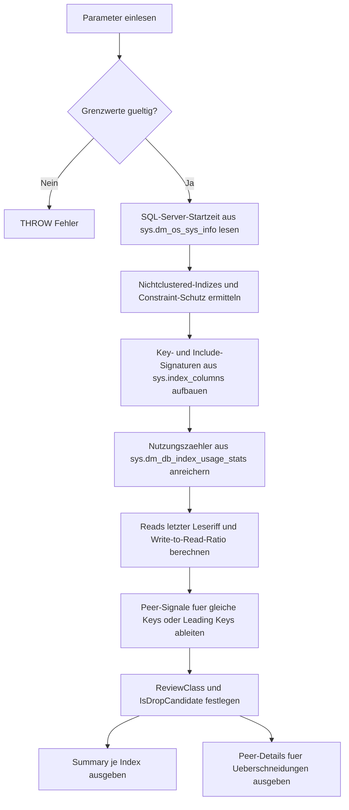

# IndexCandidateForDropReview.sql

Dieses Skript erstellt eine konservative Review-Liste fuer moegliche Drop-Kandidaten unter Nichtclustered-Indizes. Es kombiniert Nutzungszaehler seit dem letzten SQL-Server-Start mit Schreiblast, Constraint-Schutz und einfachen Ueberschneidungssignalen zu Schwesterindizes, ohne daraus automatisch einen Loeschauftrag abzuleiten.

## Uebersicht

<!-- SQLDOC:SUMMARY_TABLE:BEGIN -->
| Feld | Wert |
|---|---|
| Script | [IndexCandidateForDropReview.sql](IndexCandidateForDropReview.sql) |
| Version | `1.0` |
| Typ | `diagnostic-query` |
| Kapitel | `26_Indexes_Basics` |
| Sicherheit | `read-only` |
| Zweck | Reviewt moegliche Drop-Kandidaten unter Nichtclustered-Indizes anhand von Nutzungszaehlern, Schreiblast und Index-Ueberschneidungen. |
<!-- SQLDOC:SUMMARY_TABLE:END -->

## Einordnung

Im Kapitel `26_Indexes_Basics` schliesst dieses Skript die Luecke zwischen reiner Nutzungsanzeige und konkreter Review-Frage: Welche Nichtclustered-Indizes kosten vermutlich Write-Overhead, ohne in derselben Beobachtungsphase sichtbar zu lesen? Der Fokus liegt auf einer didaktischen Erstpruefung, nicht auf automatischer Bereinigung.

## Annahmen

- Das Skript arbeitet rein lesend auf den Systemkatalogen und DMVs der aktuellen Datenbank.
- `sys.dm_db_index_usage_stats` zeigt nur Aktivitaet seit dem letzten SQL-Server-Start; fehlende Reads koennen durch Reset, seltene Jobs oder saisonale Last erklaert sein.
- Primary Keys und Unique Constraints werden explizit als geschuetzt behandelt und nicht als Drop-Kandidaten markiert.
- Das Ueberschneidungssignal nutzt einfache Key- und Include-Signaturen; es ersetzt keine vollstaendige Plan-, Filter- oder Predicate-Analyse.

## Anwendungsfall

Die Summary-Ausgabe priorisiert Indizes mit wenig oder keiner Leselast, hoher Schreiblast oder offensichtlicher Ueberschneidung zu Schwesterindizes. Die Detailausgabe zeigt die zugehoerigen Peer-Indizes mit gleichem Leading-Key oder identischer Key-Signatur, damit eine moegliche Konsolidierung gezielt geprueft werden kann.

## Parameter

<!-- SQLDOC:PARAMETERS_TABLE:BEGIN -->
| Parameter | SQL-Typ | Pflicht | Beschreibung |
|---|---|---|---|
| `@SchemaName` | `SYSNAME` | Nein | Optionaler Filter auf ein Schema. |
| `@TableName` | `SYSNAME` | Nein | Optionaler Filter auf einen Tabellennamen. |
| `@MaxReadsBeforeReview` | `BIGINT` | Nein | Maximale Summe aus Seeks, Scans und Lookups fuer einen Review-Kandidaten. |
| `@MinWriteToReadRatio` | `DECIMAL(10,2)` | Nein | Mindestverhaeltnis von Writes zu Reads fuer write-heavy Review-Kandidaten. |
| `@MinDaysSinceLastRead` | `INT` | Nein | Mindestanzahl an Tagen ohne Leseriff seit dem letzten User-Read. |
| `@ShowOnlyFlagged` | `BIT` | Nein | Zeigt bei `1` nur markierte Review-Kandidaten, bei `0` alle geprueften Indizes. |
<!-- SQLDOC:PARAMETERS_TABLE:END -->

## Abhaengigkeiten

<!-- SQLDOC:DEPENDENCIES_LIST:BEGIN -->
- `sys.tables`
- `sys.schemas`
- `sys.indexes`
- `sys.key_constraints`
- `sys.index_columns`
- `sys.columns`
- `sys.dm_db_index_usage_stats`
- `sys.dm_os_sys_info`
- `CTE`
<!-- SQLDOC:DEPENDENCIES_LIST:END -->

## Hinweise

- `IndexDropCandidateSummary` zeigt bewusst auch Schutz- und Beobachtungsklassen, damit die Review-Logik transparent bleibt.
- `UsageWindowDays` macht sichtbar, wie lang die aktuelle DMV-Beobachtungsphase seit dem letzten SQL-Server-Start ist.
- Ein Signal wie `review-covered-by-peer` bedeutet nur, dass ein Schwesterindex strukturell aehnlich wirkt; Filter, INCLUDE-Details und reale Plannutzung muessen separat validiert werden.

## Versionshistorie

<!-- SQLDOC:VERSION_HISTORY_TABLE:BEGIN -->
| Version | Datum | User | Beschreibung |
|---|---|---|---|
| `1.0` | `2026-04-17` | `ER` | Erstversion fuer das Review moeglicher Drop-Kandidaten unter Nichtclustered-Indizes |
<!-- SQLDOC:VERSION_HISTORY_TABLE:END -->

## Ablauf

<!-- SQLDOC:MERMAID:BEGIN -->

<!-- SQLDOC:MERMAID:END -->

## SQL-Code

<!-- SQLDOC:SQL_CODE:BEGIN -->
```sql
/*
BEGIN:SQL-HEADER v1
---
sql_header: v1
script_name: "IndexCandidateForDropReview.sql"
script_version: "1.0"
script_type: "diagnostic-query"
chapter: "26_Indexes_Basics"
purpose: >
  Reviewt moegliche Drop-Kandidaten unter Nichtclustered-Indizes anhand von
  Nutzungszaehlern, Schreiblast, Constraint-Schutz und einfachen
  Ueberschneidungssignalen zu Schwesterindizes.
parameters:
  - name: "@SchemaName"
    sql_type: "SYSNAME"
    direction: "IN"
    required: false
    description: "Optionaler Filter auf ein Schema"
  - name: "@TableName"
    sql_type: "SYSNAME"
    direction: "IN"
    required: false
    description: "Optionaler Filter auf einen Tabellennamen"
  - name: "@MaxReadsBeforeReview"
    sql_type: "BIGINT"
    direction: "IN"
    required: false
    description: "Maximale Summe aus Seeks Scans und Lookups fuer einen Review-Kandidaten"
  - name: "@MinWriteToReadRatio"
    sql_type: "DECIMAL(10,2)"
    direction: "IN"
    required: false
    description: "Mindestverhaeltnis von Writes zu Reads fuer write-heavy Review-Kandidaten"
  - name: "@MinDaysSinceLastRead"
    sql_type: "INT"
    direction: "IN"
    required: false
    description: "Mindestanzahl an Tagen ohne Leseriff seit dem letzten User-Read"
  - name: "@ShowOnlyFlagged"
    sql_type: "BIT"
    direction: "IN"
    required: false
    description: "1 = nur markierte Review-Kandidaten, 0 = alle geprueften Indizes"
result_sets:
  - name: "IndexDropCandidateSummary"
    description: "Uebersicht je Nichtclustered-Index mit Nutzungs- und Review-Signalen"
  - name: "IndexOverlapDetail"
    description: "Detailansicht zu Schwesterindizes mit gleichem Key-Signatur- oder Leading-Key-Signal"
dependencies:
  - "sys.tables"
  - "sys.schemas"
  - "sys.indexes"
  - "sys.key_constraints"
  - "sys.index_columns"
  - "sys.columns"
  - "sys.dm_db_index_usage_stats"
  - "sys.dm_os_sys_info"
  - "CTE"
safety:
  level: "read-only"
  writes_data: false
documentation:
  markdown_file: "T-SQL/26_Indexes_Basics/SQLScripts/IndexCandidateForDropReview.md"
  sync_blocks:
    - "SUMMARY_TABLE"
    - "PARAMETERS_TABLE"
    - "DEPENDENCIES_LIST"
    - "VERSION_HISTORY_TABLE"
    - "SQL_CODE"
  mermaid:
    mode: "ai-agent-from-sql"
    source: "script-body"
main_responsible:
  name: "Erhard Rainer"
  initials: "ER"
version_history:
  - version: "1.0"
    date: "2026-04-17"
    user: "ER"
    description: "Erstversion fuer das Review moeglicher Drop-Kandidaten unter Nichtclustered-Indizes"
notes:
  - "Nutzungszaehler stammen aus sys.dm_db_index_usage_stats und gelten nur seit dem letzten SQL-Server-Start"
  - "Ein Review-Kandidat ist keine automatische Drop-Empfehlung und muss gegen Workload, Constraints und Deployments validiert werden"
---
END:SQL-HEADER v1
*/

SET NOCOUNT ON;

DECLARE @SchemaName SYSNAME = NULL;
DECLARE @TableName SYSNAME = NULL;
DECLARE @MaxReadsBeforeReview BIGINT = 100;
DECLARE @MinWriteToReadRatio DECIMAL(10,2) = 20.00;
DECLARE @MinDaysSinceLastRead INT = 30;
DECLARE @ShowOnlyFlagged BIT = 1;

IF @MaxReadsBeforeReview < 0
BEGIN
    THROW 50000, '@MaxReadsBeforeReview darf nicht negativ sein.', 1;
END;

IF @MinWriteToReadRatio < 0
BEGIN
    THROW 50000, '@MinWriteToReadRatio darf nicht negativ sein.', 1;
END;

IF @MinDaysSinceLastRead < 0
BEGIN
    THROW 50000, '@MinDaysSinceLastRead darf nicht negativ sein.', 1;
END;

IF @ShowOnlyFlagged NOT IN (0, 1)
BEGIN
    THROW 50000, '@ShowOnlyFlagged muss 0 oder 1 sein.', 1;
END;

;WITH ServerWindow AS
(
    SELECT
        osi.sqlserver_start_time,
        DATEDIFF(DAY, osi.sqlserver_start_time, SYSDATETIME()) AS UsageWindowDays
    FROM sys.dm_os_sys_info AS osi
),
TargetIndexes AS
(
    SELECT
        s.name AS SchemaName,
        t.name AS TableName,
        t.object_id,
        i.index_id,
        i.name AS IndexName,
        i.type_desc,
        i.is_unique,
        i.is_primary_key,
        i.is_unique_constraint,
        i.has_filter,
        i.filter_definition,
        i.fill_factor,
        kc.name AS ConstraintName
    FROM sys.tables AS t
    INNER JOIN sys.schemas AS s
        ON s.schema_id = t.schema_id
    INNER JOIN sys.indexes AS i
        ON i.object_id = t.object_id
    LEFT JOIN sys.key_constraints AS kc
        ON kc.parent_object_id = i.object_id
       AND kc.unique_index_id = i.index_id
    WHERE t.is_ms_shipped = 0
      AND i.type = 2
      AND i.is_hypothetical = 0
      AND i.is_disabled = 0
      AND (@SchemaName IS NULL OR s.name = @SchemaName)
      AND (@TableName IS NULL OR t.name = @TableName)
),
ColumnRoles AS
(
    SELECT
        ti.SchemaName,
        ti.TableName,
        ti.object_id,
        ti.index_id,
        ti.IndexName,
        ic.index_column_id,
        ic.key_ordinal,
        ic.is_included_column,
        c.name AS ColumnName
    FROM TargetIndexes AS ti
    INNER JOIN sys.index_columns AS ic
        ON ic.object_id = ti.object_id
       AND ic.index_id = ti.index_id
    INNER JOIN sys.columns AS c
        ON c.object_id = ic.object_id
       AND c.column_id = ic.column_id
),
KeyColumns AS
(
    SELECT
        cr.object_id,
        cr.index_id,
        MIN(CASE WHEN cr.key_ordinal = 1 THEN cr.ColumnName END) AS LeadingKeyColumn,
        STRING_AGG(CASE WHEN cr.key_ordinal > 0 THEN QUOTENAME(cr.ColumnName) END, ', ')
            WITHIN GROUP (ORDER BY cr.key_ordinal) AS KeySignature
    FROM ColumnRoles AS cr
    WHERE cr.key_ordinal > 0
    GROUP BY
        cr.object_id,
        cr.index_id
),
IncludeColumns AS
(
    SELECT
        cr.object_id,
        cr.index_id,
        STRING_AGG(CASE WHEN cr.is_included_column = 1 THEN QUOTENAME(cr.ColumnName) END, ', ')
            WITHIN GROUP (ORDER BY cr.index_column_id) AS IncludeSignature,
        COUNT(CASE WHEN cr.is_included_column = 1 THEN 1 END) AS IncludeColumnCount
    FROM ColumnRoles AS cr
    GROUP BY
        cr.object_id,
        cr.index_id
),
UsageStats AS
(
    SELECT
        ius.object_id,
        ius.index_id,
        ISNULL(ius.user_seeks, 0) AS user_seeks,
        ISNULL(ius.user_scans, 0) AS user_scans,
        ISNULL(ius.user_lookups, 0) AS user_lookups,
        ISNULL(ius.user_updates, 0) AS user_updates,
        ius.last_user_seek,
        ius.last_user_scan,
        ius.last_user_lookup,
        ius.last_user_update
    FROM sys.dm_db_index_usage_stats AS ius
    WHERE ius.database_id = DB_ID()
),
IndexBase AS
(
    SELECT
        DB_NAME() AS DatabaseName,
        ti.SchemaName,
        ti.TableName,
        ti.object_id,
        ti.index_id,
        ti.IndexName,
        ti.type_desc AS IndexType,
        CAST(ti.is_unique AS BIT) AS IsUnique,
        CAST(ti.is_primary_key AS BIT) AS IsPrimaryKey,
        CAST(ti.is_unique_constraint AS BIT) AS IsUniqueConstraint,
        ti.ConstraintName,
        CAST(ti.has_filter AS BIT) AS HasFilter,
        ti.filter_definition AS FilterDefinition,
        ti.fill_factor AS FillFactor,
        kc.LeadingKeyColumn,
        kc.KeySignature,
        ic.IncludeSignature,
        ISNULL(ic.IncludeColumnCount, 0) AS IncludeColumnCount,
        ISNULL(us.user_seeks, 0) AS UserSeeks,
        ISNULL(us.user_scans, 0) AS UserScans,
        ISNULL(us.user_lookups, 0) AS UserLookups,
        ISNULL(us.user_updates, 0) AS UserUpdates,
        us.last_user_seek AS LastUserSeek,
        us.last_user_scan AS LastUserScan,
        us.last_user_lookup AS LastUserLookup,
        us.last_user_update AS LastUserUpdate,
        sw.sqlserver_start_time,
        sw.UsageWindowDays
    FROM TargetIndexes AS ti
    INNER JOIN ServerWindow AS sw
        ON 1 = 1
    LEFT JOIN KeyColumns AS kc
        ON kc.object_id = ti.object_id
       AND kc.index_id = ti.index_id
    LEFT JOIN IncludeColumns AS ic
        ON ic.object_id = ti.object_id
       AND ic.index_id = ti.index_id
    LEFT JOIN UsageStats AS us
        ON us.object_id = ti.object_id
       AND us.index_id = ti.index_id
),
Metrics AS
(
    SELECT
        ib.*,
        ib.UserSeeks + ib.UserScans + ib.UserLookups AS TotalReads,
        CASE
            WHEN ib.LastUserSeek IS NULL AND ib.LastUserScan IS NULL AND ib.LastUserLookup IS NULL THEN NULL
            ELSE
                (
                    SELECT MAX(v.LastReadAt)
                    FROM (VALUES (ib.LastUserSeek), (ib.LastUserScan), (ib.LastUserLookup)) AS v(LastReadAt)
                )
        END AS LastUserRead,
        CAST(
            CASE
                WHEN ib.UserSeeks + ib.UserScans + ib.UserLookups = 0
                    THEN CASE WHEN ib.UserUpdates > 0 THEN 999999.00 ELSE 0.00 END
                ELSE 1.0 * ib.UserUpdates / NULLIF(ib.UserSeeks + ib.UserScans + ib.UserLookups, 0)
            END AS DECIMAL(18,2)
        ) AS WriteToReadRatio
    FROM IndexBase AS ib
),
PeerSignals AS
(
    SELECT
        a.object_id,
        a.index_id,
        SUM(CASE WHEN a.LeadingKeyColumn IS NOT NULL AND a.LeadingKeyColumn = b.LeadingKeyColumn THEN 1 ELSE 0 END) AS PeerSameLeadingKeyCount,
        SUM(CASE WHEN a.KeySignature = b.KeySignature THEN 1 ELSE 0 END) AS ExactKeyPeerCount,
        SUM(CASE
            WHEN a.KeySignature = b.KeySignature
             AND ISNULL(a.IncludeSignature, '') <> ISNULL(b.IncludeSignature, '')
             AND (
                    ISNULL(b.IncludeSignature, '') = ''
                    OR CHARINDEX(ISNULL(a.IncludeSignature, ''), ISNULL(b.IncludeSignature, '')) > 0
                 )
            THEN 1
            ELSE 0
        END) AS CoveringPeerCount
    FROM Metrics AS a
    INNER JOIN Metrics AS b
        ON b.object_id = a.object_id
       AND b.index_id <> a.index_id
    GROUP BY
        a.object_id,
        a.index_id
),
Classified AS
(
    SELECT
        m.DatabaseName,
        m.SchemaName,
        m.TableName,
        m.object_id,
        m.index_id,
        m.IndexName,
        m.IndexType,
        m.IsUnique,
        m.IsPrimaryKey,
        m.IsUniqueConstraint,
        m.ConstraintName,
        m.HasFilter,
        m.FilterDefinition,
        m.FillFactor,
        m.LeadingKeyColumn,
        m.KeySignature,
        m.IncludeSignature,
        m.IncludeColumnCount,
        m.UserSeeks,
        m.UserScans,
        m.UserLookups,
        m.UserUpdates,
        m.TotalReads,
        m.WriteToReadRatio,
        m.LastUserRead,
        m.LastUserUpdate,
        CASE
            WHEN m.LastUserRead IS NULL THEN NULL
            ELSE DATEDIFF(DAY, m.LastUserRead, SYSDATETIME())
        END AS DaysSinceLastRead,
        m.sqlserver_start_time AS SqlServerStartTime,
        m.UsageWindowDays,
        ISNULL(ps.PeerSameLeadingKeyCount, 0) AS PeerSameLeadingKeyCount,
        ISNULL(ps.ExactKeyPeerCount, 0) AS ExactKeyPeerCount,
        ISNULL(ps.CoveringPeerCount, 0) AS CoveringPeerCount,
        CAST(
            CASE
                WHEN m.IsPrimaryKey = 1 OR m.IsUniqueConstraint = 1 THEN 0
                WHEN m.TotalReads = 0 AND m.UserUpdates > 0 THEN 1
                WHEN m.TotalReads <= @MaxReadsBeforeReview
                 AND m.WriteToReadRatio >= @MinWriteToReadRatio
                 AND (
                        m.LastUserRead IS NULL
                        OR DATEDIFF(DAY, m.LastUserRead, SYSDATETIME()) >= @MinDaysSinceLastRead
                     )
                    THEN 1
                WHEN ISNULL(ps.CoveringPeerCount, 0) > 0
                 AND m.TotalReads <= @MaxReadsBeforeReview
                    THEN 1
                ELSE 0
            END AS BIT
        ) AS IsDropCandidate,
        CASE
            WHEN m.IsPrimaryKey = 1 THEN 'protected-primary-key'
            WHEN m.IsUniqueConstraint = 1 THEN 'protected-unique-constraint'
            WHEN m.TotalReads = 0 AND m.UserUpdates > 0 THEN 'review-unused-write-overhead'
            WHEN m.TotalReads <= @MaxReadsBeforeReview
             AND m.WriteToReadRatio >= @MinWriteToReadRatio
             AND (
                    m.LastUserRead IS NULL
                    OR DATEDIFF(DAY, m.LastUserRead, SYSDATETIME()) >= @MinDaysSinceLastRead
                 )
                THEN 'review-write-heavy-low-read'
            WHEN ISNULL(ps.CoveringPeerCount, 0) > 0
             AND m.TotalReads <= @MaxReadsBeforeReview
                THEN 'review-covered-by-peer'
            WHEN m.TotalReads > @MaxReadsBeforeReview THEN 'keep-active'
            ELSE 'observe'
        END AS ReviewClass
    FROM Metrics AS m
    LEFT JOIN PeerSignals AS ps
        ON ps.object_id = m.object_id
       AND ps.index_id = m.index_id
)
SELECT
    c.DatabaseName,
    c.SchemaName,
    c.TableName,
    c.IndexName,
    c.IndexType,
    c.IsUnique,
    c.IsPrimaryKey,
    c.IsUniqueConstraint,
    c.ConstraintName,
    c.HasFilter,
    c.FilterDefinition,
    c.LeadingKeyColumn,
    c.KeySignature,
    c.IncludeSignature,
    c.IncludeColumnCount,
    c.UserSeeks,
    c.UserScans,
    c.UserLookups,
    c.UserUpdates,
    c.TotalReads,
    c.WriteToReadRatio,
    c.LastUserRead,
    c.LastUserUpdate,
    c.DaysSinceLastRead,
    c.PeerSameLeadingKeyCount,
    c.ExactKeyPeerCount,
    c.CoveringPeerCount,
    c.SqlServerStartTime,
    c.UsageWindowDays,
    c.ReviewClass,
    c.IsDropCandidate,
    CASE c.ReviewClass
        WHEN 'protected-primary-key' THEN 'Index ist als Primary Key geschuetzt und kein Drop-Kandidat.'
        WHEN 'protected-unique-constraint' THEN 'Index ist ueber eine Unique Constraint geschuetzt und kein Drop-Kandidat.'
        WHEN 'review-unused-write-overhead' THEN 'Seit dem letzten SQL-Server-Start wurden keine Reads, aber Updates registriert.'
        WHEN 'review-write-heavy-low-read' THEN 'Schreiblast ueberwiegt deutlich, waehrend Reads niedrig oder lange ausgeblieben sind.'
        WHEN 'review-covered-by-peer' THEN 'Ein Schwesterindex mit identischer Key-Signatur scheint die Include-Abdeckung zu uebernehmen.'
        WHEN 'keep-active' THEN 'Index zeigt mehr Reads als der konfigurierte Review-Grenzwert.'
        ELSE 'Index bleibt zur Beobachtung sichtbar, ohne aktuelles Drop-Signal.'
    END AS CandidateReason,
    CASE c.ReviewClass
        WHEN 'protected-primary-key' THEN 'Beibehalten; fachliche Schluesseldefinition zuerst pruefen.'
        WHEN 'protected-unique-constraint' THEN 'Beibehalten; Constraint-Schutz vor jeder Designaenderung klaeren.'
        WHEN 'review-unused-write-overhead' THEN 'Mit Ausfuehrungsplaenen, Deployments und saisonaler Last validieren, bevor ein Drop erwogen wird.'
        WHEN 'review-write-heavy-low-read' THEN 'Mit Query Store oder Plan Cache gegenpruefen und mit dem verantwortlichen Team abstimmen.'
        WHEN 'review-covered-by-peer' THEN 'Schwesterindex in Definition, Filter und Nutzung vergleichen; moegliche Konsolidierung pruefen.'
        WHEN 'keep-active' THEN 'Als aktiv genutzt belassen und nur im groesseren Designkontext ueberarbeiten.'
        ELSE 'Weiter beobachten oder mit realer Workload validieren.'
    END AS SuggestedAction
FROM Classified AS c
WHERE @ShowOnlyFlagged = 0
   OR c.IsDropCandidate = 1
ORDER BY
    c.IsDropCandidate DESC,
    c.TotalReads ASC,
    c.WriteToReadRatio DESC,
    c.SchemaName,
    c.TableName,
    c.IndexName;

SELECT
    c.DatabaseName,
    c.SchemaName,
    c.TableName,
    c.IndexName,
    c.ReviewClass,
    c.IsDropCandidate,
    c.KeySignature,
    c.IncludeSignature,
    p.IndexName AS PeerIndexName,
    p.KeySignature AS PeerKeySignature,
    p.IncludeSignature AS PeerIncludeSignature,
    p.TotalReads AS PeerTotalReads,
    p.UserUpdates AS PeerUserUpdates,
    p.ReviewClass AS PeerReviewClass,
    CASE
        WHEN c.KeySignature = p.KeySignature
         AND ISNULL(c.IncludeSignature, '') = ISNULL(p.IncludeSignature, '')
            THEN 'exact-shape-match'
        WHEN c.KeySignature = p.KeySignature
         AND (
                ISNULL(p.IncludeSignature, '') = ''
                OR CHARINDEX(ISNULL(c.IncludeSignature, ''), ISNULL(p.IncludeSignature, '')) > 0
             )
            THEN 'peer-covers-same-key'
        WHEN c.LeadingKeyColumn = p.LeadingKeyColumn
            THEN 'same-leading-key'
        ELSE 'other-peer'
    END AS OverlapSignal
FROM Classified AS c
INNER JOIN Classified AS p
    ON p.object_id = c.object_id
   AND p.index_id <> c.index_id
WHERE (
        c.KeySignature = p.KeySignature
        OR c.LeadingKeyColumn = p.LeadingKeyColumn
      )
  AND (@ShowOnlyFlagged = 0 OR c.IsDropCandidate = 1)
ORDER BY
    c.IsDropCandidate DESC,
    c.SchemaName,
    c.TableName,
    c.IndexName,
    OverlapSignal,
    p.IndexName;

```
<!-- SQLDOC:SQL_CODE:END -->
