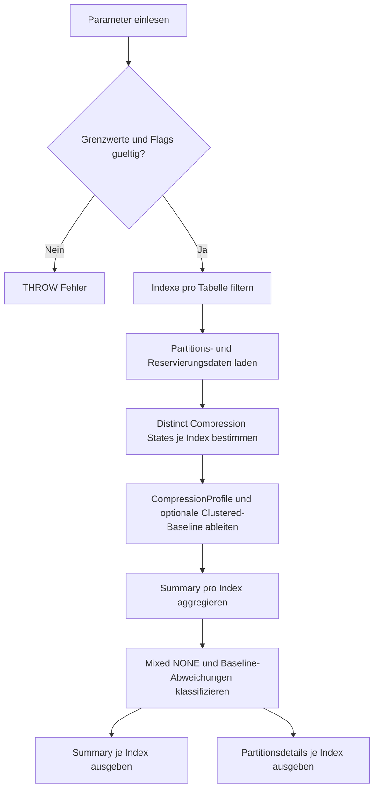

# IndexCompressionReview.sql

Dieses Skript zeigt die Kompressionseinstellungen von Indizes in der aktuellen Datenbank und markiert auffaellige Muster wie gemischte Partitionskompression, groessere unkomprimierte Indizes oder Abweichungen zu einer einheitlichen Clustered-Baseline. Es bleibt bewusst bei einer lesenden Diagnose und formuliert daraus keine automatische Rebuild-Anweisung.

## Uebersicht

<!-- SQLDOC:SUMMARY_TABLE:BEGIN -->
| Feld | Wert |
|---|---|
| Script | [IndexCompressionReview.sql](IndexCompressionReview.sql) |
| Version | `1.0` |
| Typ | `diagnostic-query` |
| Kapitel | `26_Indexes_Basics` |
| Sicherheit | `read-only` |
| Zweck | Zeigt Kompressionseinstellungen von Indizes und markiert gemischte oder unerwartete Abweichungen. |
<!-- SQLDOC:SUMMARY_TABLE:END -->

## Einordnung

Im Kapitel `26_Indexes_Basics` schliesst dieses Skript die Luecke zwischen reiner Indexinventur und einer gezielten Sicht auf Datenkompression. Es eignet sich fuer Unterricht, Reviews und erste Betriebsdiagnosen, wenn sichtbar werden soll, ob Partitionen unterschiedlich komprimiert sind oder ob groessere Indizes komplett ohne Kompression laufen.

## Annahmen

- Das Skript arbeitet rein lesend auf Systemkatalogen, `sys.partitions` und `sys.dm_db_partition_stats`.
- `ReservedPages` dient nur als grobe Groessennaehertung und nicht als exakte Kapazitaetsmessung.
- Eine Abweichung zur Clustered-Baseline ist nur dann ein Signal, wenn der Clustered Index selbst eine einheitliche Kompression ueber alle Partitionen hat.
- `NONE` wird nur dann als Review-Signal markiert, wenn `@TreatNoneAsDeviation = 1` gesetzt ist und der Index den konfigurierten Groessenschwellwert erreicht.

## Anwendungsfall

Die Summary-Ausgabe priorisiert groessere Indizes mit gemischter oder auffaelliger Kompression. Die Partitionsdetailansicht zeigt anschliessend, welche Partitionen welchen Kompressionsstatus tragen. Das ist besonders nuetzlich fuer partitionierte Tabellen, heterogene Wartungslaeufe oder den Vergleich zwischen Clustered- und Nonclustered-Strategien.

## Parameter

<!-- SQLDOC:PARAMETERS_TABLE:BEGIN -->
| Parameter | SQL-Typ | Pflicht | Beschreibung |
|---|---|---|---|
| `@SchemaName` | `SYSNAME` | Nein | Optionaler Filter auf ein Schema. |
| `@TableName` | `SYSNAME` | Nein | Optionaler Filter auf einen Tabellennamen. |
| `@MinReservedPages` | `BIGINT` | Nein | Mindestanzahl reservierter Seiten fuer die Summary-Ausgabe. |
| `@ShowOnlyDifferences` | `BIT` | Nein | Zeigt bei `1` nur Indizes mit Review-Signal, bei `0` alle geprueften Indizes. |
| `@TreatNoneAsDeviation` | `BIT` | Nein | Behandelt bei `1` groessere unkomprimierte Indizes als Review-Signal. |
<!-- SQLDOC:PARAMETERS_TABLE:END -->

## Abhaengigkeiten

<!-- SQLDOC:DEPENDENCIES_LIST:BEGIN -->
- `sys.tables`
- `sys.schemas`
- `sys.indexes`
- `sys.partitions`
- `sys.dm_db_partition_stats`
- `CTE`
<!-- SQLDOC:DEPENDENCIES_LIST:END -->

## Hinweise

- `CompressionProfile` zeigt die reale Partitionsfolge im Format `P<n>=<Compression>`.
- `review-mixed-compression` ist oft bei partitionierten Tabellen sinnvoll, sollte aber bewusst dokumentiert sein.
- `review-differs-from-clustered-baseline` ist nur ein Konsistenzsignal; Nonclustered-Indizes duerfen absichtlich anders komprimiert sein.
- `ReservedMB` ist als schnelle Einordnung fuer Unterricht und Review gedacht.

## Versionshistorie

<!-- SQLDOC:VERSION_HISTORY_TABLE:BEGIN -->
| Version | Datum | User | Beschreibung |
|---|---|---|---|
| `1.0` | `2026-04-17` | `ER` | Erstversion fuer das Review von Index-Kompressionseinstellungen |
<!-- SQLDOC:VERSION_HISTORY_TABLE:END -->

## Ablauf

<!-- SQLDOC:MERMAID:BEGIN -->

<!-- SQLDOC:MERMAID:END -->

## SQL-Code

<!-- SQLDOC:SQL_CODE:BEGIN -->
```sql
/*
BEGIN:SQL-HEADER v1
---
sql_header: v1
script_name: "IndexCompressionReview.sql"
script_version: "1.0"
script_type: "diagnostic-query"
chapter: "26_Indexes_Basics"
purpose: >
  Zeigt die Kompressionseinstellungen von Indizes, markiert gemischte oder
  unerwartete Partitionsmuster und macht grobe Abweichungen zum
  Tabellen-Baseline-Index sichtbar.
parameters:
  - name: "@SchemaName"
    sql_type: "SYSNAME"
    direction: "IN"
    required: false
    description: "Optionaler Filter auf ein Schema"
  - name: "@TableName"
    sql_type: "SYSNAME"
    direction: "IN"
    required: false
    description: "Optionaler Filter auf einen Tabellennamen"
  - name: "@MinReservedPages"
    sql_type: "BIGINT"
    direction: "IN"
    required: false
    description: "Mindestanzahl reservierter Seiten fuer die Summary-Ausgabe"
  - name: "@ShowOnlyDifferences"
    sql_type: "BIT"
    direction: "IN"
    required: false
    description: "1 = nur Indizes mit Review-Signal, 0 = alle geprueften Indizes"
  - name: "@TreatNoneAsDeviation"
    sql_type: "BIT"
    direction: "IN"
    required: false
    description: "1 = NONE auf groesseren Indizes als Review-Signal behandeln"
result_sets:
  - name: "IndexCompressionSummary"
    description: "Uebersicht je Index mit Kompressionsprofil und Review-Signal"
  - name: "IndexCompressionPartitionDetail"
    description: "Detailansicht je Partition fuer gemischte oder abweichende Kompression"
dependencies:
  - "sys.tables"
  - "sys.schemas"
  - "sys.indexes"
  - "sys.partitions"
  - "sys.dm_db_partition_stats"
  - "CTE"
safety:
  level: "read-only"
  writes_data: false
documentation:
  markdown_file: "T-SQL/26_Indexes_Basics/SQLScripts/IndexCompressionReview.md"
  sync_blocks:
    - "SUMMARY_TABLE"
    - "PARAMETERS_TABLE"
    - "DEPENDENCIES_LIST"
    - "VERSION_HISTORY_TABLE"
    - "SQL_CODE"
  mermaid:
    mode: "ai-agent-from-sql"
    source: "script-body"
main_responsible:
  name: "Erhard Rainer"
  initials: "ER"
version_history:
  - version: "1.0"
    date: "2026-04-17"
    user: "ER"
    description: "Erstversion fuer das Review von Index-Kompressionseinstellungen"
notes:
  - "Kompressionsabweichungen sind nur Diagnose-Signale und keine automatische Rebuild-Empfehlung"
  - "Reserved Pages werden aus sys.dm_db_partition_stats als grobe Groessennaehertung verwendet"
---
END:SQL-HEADER v1
*/

SET NOCOUNT ON;

DECLARE @SchemaName SYSNAME = NULL;
DECLARE @TableName SYSNAME = NULL;
DECLARE @MinReservedPages BIGINT = 128;
DECLARE @ShowOnlyDifferences BIT = 1;
DECLARE @TreatNoneAsDeviation BIT = 1;

IF @MinReservedPages < 0
BEGIN
    THROW 50000, '@MinReservedPages darf nicht negativ sein.', 1;
END;

IF @ShowOnlyDifferences NOT IN (0, 1)
BEGIN
    THROW 50000, '@ShowOnlyDifferences muss 0 oder 1 sein.', 1;
END;

IF @TreatNoneAsDeviation NOT IN (0, 1)
BEGIN
    THROW 50000, '@TreatNoneAsDeviation muss 0 oder 1 sein.', 1;
END;

;WITH TargetIndexes AS
(
    SELECT
        s.name AS SchemaName,
        t.name AS TableName,
        t.object_id,
        i.index_id,
        i.name AS IndexName,
        i.type_desc AS IndexType,
        i.fill_factor,
        i.has_filter,
        i.filter_definition
    FROM sys.tables AS t
    INNER JOIN sys.schemas AS s
        ON s.schema_id = t.schema_id
    INNER JOIN sys.indexes AS i
        ON i.object_id = t.object_id
    WHERE t.is_ms_shipped = 0
      AND i.index_id > 0
      AND i.is_hypothetical = 0
      AND i.is_disabled = 0
      AND (@SchemaName IS NULL OR s.name = @SchemaName)
      AND (@TableName IS NULL OR t.name = @TableName)
),
PartitionCompression AS
(
    SELECT
        ti.SchemaName,
        ti.TableName,
        ti.object_id,
        ti.index_id,
        ti.IndexName,
        ti.IndexType,
        ti.fill_factor,
        ti.has_filter,
        ti.filter_definition,
        p.partition_number,
        p.rows,
        p.data_compression_desc,
        ps.reserved_page_count,
        ps.used_page_count
    FROM TargetIndexes AS ti
    INNER JOIN sys.partitions AS p
        ON p.object_id = ti.object_id
       AND p.index_id = ti.index_id
    INNER JOIN sys.dm_db_partition_stats AS ps
        ON ps.object_id = p.object_id
       AND ps.index_id = p.index_id
       AND ps.partition_id = p.partition_id
),
CompressionStates AS
(
    SELECT DISTINCT
        pc.object_id,
        pc.index_id,
        pc.data_compression_desc
    FROM PartitionCompression AS pc
),
CompressionCounts AS
(
    SELECT
        cs.object_id,
        cs.index_id,
        COUNT(*) AS DistinctCompressionStates
    FROM CompressionStates AS cs
    GROUP BY
        cs.object_id,
        cs.index_id
),
CompressionProfiles AS
(
    SELECT
        pc.object_id,
        pc.index_id,
        STRING_AGG(
            CONCAT(
                'P',
                CONVERT(VARCHAR(12), pc.partition_number),
                '=',
                pc.data_compression_desc
            ),
            ', '
        ) WITHIN GROUP (ORDER BY pc.partition_number) AS CompressionProfile
    FROM PartitionCompression AS pc
    GROUP BY
        pc.object_id,
        pc.index_id
),
ClusteredBaseline AS
(
    SELECT
        pc.object_id,
        MIN(pc.data_compression_desc) AS ClusteredCompressionBaseline
    FROM PartitionCompression AS pc
    INNER JOIN CompressionCounts AS cc
        ON cc.object_id = pc.object_id
       AND cc.index_id = pc.index_id
    WHERE pc.index_id = 1
      AND cc.DistinctCompressionStates = 1
    GROUP BY
        pc.object_id
),
IndexSummary AS
(
    SELECT
        DB_NAME() AS DatabaseName,
        pc.SchemaName,
        pc.TableName,
        pc.object_id,
        pc.index_id,
        pc.IndexName,
        pc.IndexType,
        pc.fill_factor AS FillFactor,
        CAST(pc.has_filter AS BIT) AS HasFilter,
        pc.filter_definition AS FilterDefinition,
        COUNT(*) AS PartitionCount,
        SUM(pc.rows) AS TotalRows,
        SUM(pc.reserved_page_count) AS ReservedPages,
        SUM(pc.used_page_count) AS UsedPages,
        MAX(pc.data_compression_desc) AS CompressionStateWhenUniform,
        cc.DistinctCompressionStates,
        cp.CompressionProfile,
        cb.ClusteredCompressionBaseline
    FROM PartitionCompression AS pc
    INNER JOIN CompressionCounts AS cc
        ON cc.object_id = pc.object_id
       AND cc.index_id = pc.index_id
    INNER JOIN CompressionProfiles AS cp
        ON cp.object_id = pc.object_id
       AND cp.index_id = pc.index_id
    LEFT JOIN ClusteredBaseline AS cb
        ON cb.object_id = pc.object_id
    GROUP BY
        pc.SchemaName,
        pc.TableName,
        pc.object_id,
        pc.index_id,
        pc.IndexName,
        pc.IndexType,
        pc.fill_factor,
        pc.has_filter,
        pc.filter_definition,
        cc.DistinctCompressionStates,
        cp.CompressionProfile,
        cb.ClusteredCompressionBaseline
),
Classified AS
(
    SELECT
        s.*,
        CAST(CASE WHEN s.DistinctCompressionStates > 1 THEN 1 ELSE 0 END AS BIT) AS HasMixedCompression,
        CAST(CASE
            WHEN s.ClusteredCompressionBaseline IS NULL THEN 0
            WHEN s.DistinctCompressionStates = 1
             AND s.CompressionStateWhenUniform <> s.ClusteredCompressionBaseline
                THEN 1
            ELSE 0
        END AS BIT) AS DiffersFromClusteredBaseline,
        CAST(CASE
            WHEN s.DistinctCompressionStates > 1 THEN 1
            WHEN @TreatNoneAsDeviation = 1
             AND s.DistinctCompressionStates = 1
             AND s.CompressionStateWhenUniform = 'NONE'
             AND s.ReservedPages >= @MinReservedPages
                THEN 1
            WHEN s.ClusteredCompressionBaseline IS NOT NULL
             AND s.DistinctCompressionStates = 1
             AND s.CompressionStateWhenUniform <> s.ClusteredCompressionBaseline
                THEN 1
            ELSE 0
        END AS BIT) AS IsCompressionDeviation,
        CASE
            WHEN s.DistinctCompressionStates > 1 THEN 'review-mixed-compression'
            WHEN @TreatNoneAsDeviation = 1
             AND s.DistinctCompressionStates = 1
             AND s.CompressionStateWhenUniform = 'NONE'
             AND s.ReservedPages >= @MinReservedPages
                THEN 'review-none-on-larger-index'
            WHEN s.ClusteredCompressionBaseline IS NOT NULL
             AND s.DistinctCompressionStates = 1
             AND s.CompressionStateWhenUniform <> s.ClusteredCompressionBaseline
                THEN 'review-differs-from-clustered-baseline'
            ELSE 'aligned'
        END AS CompressionClass
    FROM IndexSummary AS s
)
SELECT
    c.DatabaseName,
    c.SchemaName,
    c.TableName,
    c.IndexName,
    c.IndexType,
    c.PartitionCount,
    c.TotalRows,
    c.ReservedPages,
    CAST(c.ReservedPages * 8.0 / 1024.0 AS DECIMAL(18,2)) AS ReservedMB,
    c.UsedPages,
    c.CompressionStateWhenUniform,
    c.DistinctCompressionStates,
    c.CompressionProfile,
    c.ClusteredCompressionBaseline,
    c.FillFactor,
    c.HasFilter,
    c.FilterDefinition,
    c.HasMixedCompression,
    c.DiffersFromClusteredBaseline,
    c.CompressionClass,
    c.IsCompressionDeviation,
    CASE c.CompressionClass
        WHEN 'review-mixed-compression' THEN 'Index verwendet unterschiedliche Kompressionsarten ueber mehrere Partitionen.'
        WHEN 'review-none-on-larger-index' THEN 'Groesserer Index ist komplett unkomprimiert.'
        WHEN 'review-differs-from-clustered-baseline' THEN 'Index weicht von der einheitlichen Kompressionsbasis des Clustered Index ab.'
        ELSE 'Kein unmittelbares Review-Signal unter den gewaehlten Regeln.'
    END AS CompressionFinding,
    CASE c.CompressionClass
        WHEN 'review-mixed-compression' THEN 'Partitionierungs- oder Wartungsstrategie pruefen, bevor ein Rebuild erwogen wird.'
        WHEN 'review-none-on-larger-index' THEN 'Mit CPU-, IO- und Wartungszielen abgleichen, ob ROW oder PAGE sinnvoll sein koennte.'
        WHEN 'review-differs-from-clustered-baseline' THEN 'Abweichung fachlich begruenden oder fuer konsistente Wartung dokumentieren.'
        ELSE 'Als Baseline dokumentieren und nur bei Workload-Aenderungen erneut pruefen.'
    END AS SuggestedAction
FROM Classified AS c
WHERE c.ReservedPages >= @MinReservedPages
  AND (@ShowOnlyDifferences = 0 OR c.IsCompressionDeviation = 1)
ORDER BY
    c.IsCompressionDeviation DESC,
    c.ReservedPages DESC,
    c.SchemaName,
    c.TableName,
    c.IndexName;

SELECT
    c.DatabaseName,
    c.SchemaName,
    c.TableName,
    c.IndexName,
    c.IndexType,
    pc.partition_number AS PartitionNumber,
    pc.rows AS PartitionRows,
    pc.data_compression_desc AS PartitionCompression,
    pc.reserved_page_count AS PartitionReservedPages,
    CAST(pc.reserved_page_count * 8.0 / 1024.0 AS DECIMAL(18,2)) AS PartitionReservedMB,
    pc.used_page_count AS PartitionUsedPages,
    c.ClusteredCompressionBaseline,
    c.CompressionClass,
    c.IsCompressionDeviation,
    CASE
        WHEN c.HasMixedCompression = 1 THEN 'Partition gehoert zu einem Index mit gemischter Kompression.'
        WHEN c.DiffersFromClusteredBaseline = 1 THEN 'Partition erbt die uniforme, aber abweichende Index-Kompression.'
        WHEN @TreatNoneAsDeviation = 1
         AND pc.data_compression_desc = 'NONE'
         AND c.ReservedPages >= @MinReservedPages
            THEN 'Partition ist unkomprimiert und Teil eines groesseren Index.'
        ELSE 'Partition dient als Baseline-Detail.'
    END AS PartitionFinding
FROM Classified AS c
INNER JOIN PartitionCompression AS pc
    ON pc.object_id = c.object_id
   AND pc.index_id = c.index_id
WHERE c.ReservedPages >= @MinReservedPages
  AND (
        @ShowOnlyDifferences = 0
        OR c.IsCompressionDeviation = 1
      )
ORDER BY
    c.IsCompressionDeviation DESC,
    c.SchemaName,
    c.TableName,
    c.IndexName,
    pc.partition_number;
```
<!-- SQLDOC:SQL_CODE:END -->
