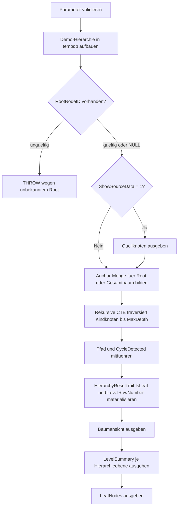

# RecursiveCteHierarchyStarter.sql

Dieses Startskript zeigt eine typische rekursive CTE fuer Hierarchie- und Baumdarstellungen in T-SQL. Die Demo-Daten bilden eine kleine Organisationsstruktur ab, damit sich Anchor-Menge, rekursiver Schritt, Pfadaufbau und Blattknoten ohne produktive Abhaengigkeiten nachvollziehen lassen.

## Uebersicht

<!-- SQLDOC:SUMMARY_TABLE:BEGIN -->
| Feld | Wert |
|---|---|
| Script | [RecursiveCteHierarchyStarter.sql](RecursiveCteHierarchyStarter.sql) |
| Version | `1.0` |
| Typ | `didactic-lab` |
| Kapitel | `61_SubQuery_CTE_TMP` |
| Sicherheit | `read-only-tempdb` |
| Zweck | Startskript fuer rekursive CTEs zur Hierarchie- und Baumdarstellung. |
<!-- SQLDOC:SUMMARY_TABLE:END -->

## Einordnung

Die Umsetzung konzentriert sich auf das Standardmuster einer rekursiven CTE: Root-Knoten bestimmen, Kindknoten ueber `ParentNodeID` nachladen, die aktuelle Tiefe mitfuehren und gleichzeitig einen lesbaren Pfad fuer die Baumdarstellung aufbauen. Die Auswertung ist so gehalten, dass sie sowohl fuer Unterricht als auch fuer erste Experimente mit `MAXRECURSION` und Hierarchiefiltern nutzbar bleibt.

## Annahmen

- Das Skript ist eine didaktische Erstversion mit Demo-Knoten in `tempdb`.
- Die Hierarchie wird als Adjazenzliste mit `NodeID` und `ParentNodeID` modelliert.
- Ein optionaler Root-Filter startet die Rekursion an einem Teilbaum statt immer am Gesamtbaum.
- Zyklen werden nicht repariert, sondern ueber den Traversierungspfad erkannt und fuer weitere Rekursion abgeschnitten.

## Anwendungsfall

Das Skript eignet sich als Einstieg fuer Organisationsbaeume, Kategorien, Menues oder andere parent-child-Strukturen. Es zeigt erst die Ausgangsdaten, traversiert danach die Hierarchie mit Level- und Pfadangaben und liefert zum Schluss kompakte Zusammenfassungen je Ebene und fuer Blattknoten.

## Parameter

<!-- SQLDOC:PARAMETERS_TABLE:BEGIN -->
| Parameter | SQL-Typ | Pflicht | Beschreibung |
|---|---|---|---|
| `@RootNodeID` | `INT` | Nein | Optionale Startwurzel; `NULL` verwendet alle Root-Knoten. |
| `@MaxDepth` | `INT` | Nein | Begrenzt die Traversierungstiefe der rekursiven CTE. |
| `@ShowSourceData` | `BIT` | Nein | Gibt bei `1` die Demo-Knoten vor der Rekursion aus. |
<!-- SQLDOC:PARAMETERS_TABLE:END -->

## Abhaengigkeiten

<!-- SQLDOC:DEPENDENCIES_LIST:BEGIN -->
- `tempdb` fuer temporaere Tabellen
- rekursive CTE
- `ROW_NUMBER()`
- `OPTION (MAXRECURSION ...)`
<!-- SQLDOC:DEPENDENCIES_LIST:END -->

## Hinweise

- Die Anchor-Menge besteht aus allen Root-Knoten oder genau dem uebergebenen `@RootNodeID`.
- `TraversalPath` dient als einfacher Schutz gegen offensichtliche Zyklen innerhalb derselben Traversierung.
- `DisplayPath` macht die Reihenfolge der rekursiv gefundenen Knoten lesbar und eignet sich direkt fuer Baum-Reports.
- `IsLeaf` wird nach der Rekursion ueber vorhandene Kinder bestimmt und trennt Endknoten von Zwischenknoten.

## Versionshistorie

<!-- SQLDOC:VERSION_HISTORY_TABLE:BEGIN -->
| Version | Datum | User | Beschreibung |
|---|---|---|---|
| `1.0` | `2026-04-17` | `ER` | Erstversion des didaktischen Startskripts fuer rekursive CTE-Hierarchien |
<!-- SQLDOC:VERSION_HISTORY_TABLE:END -->

## Ablauf

<!-- SQLDOC:MERMAID:BEGIN -->

<!-- SQLDOC:MERMAID:END -->

## SQL-Code

<!-- SQLDOC:SQL_CODE:BEGIN -->
```sql
/*
BEGIN:SQL-HEADER v1
---
sql_header: v1
script_name: "RecursiveCteHierarchyStarter.sql"
script_version: "1.0"
script_type: "didactic-lab"
chapter: "61_SubQuery_CTE_TMP"

purpose: >
  Demonstriert rekursive CTEs fuer Hierarchie- und Baumdarstellungen in
  T-SQL. Das Skript baut eine kleine Organisationshierarchie in tempdb auf,
  traversiert sie ab einer optionalen Wurzel, erkennt einfache Zyklen ueber
  einen Pfadstring und liefert sowohl die Baumansicht als auch kompakte
  Auswertungen je Ebene und fuer Blattknoten.

parameters:
  - name: "@RootNodeID"
    sql_type: "INT"
    direction: "IN"
    required: false
    description: "Optionale Startwurzel; NULL = alle Root-Knoten verwenden"
  - name: "@MaxDepth"
    sql_type: "INT"
    direction: "IN"
    required: false
    description: "Maximale Traversierungstiefe innerhalb der rekursiven CTE"
  - name: "@ShowSourceData"
    sql_type: "BIT"
    direction: "IN"
    required: false
    description: "1 = Vorschau der Demo-Knoten vor der Rekursion ausgeben"

result_sets:
  - name: "SourceNodes"
    description: "Optionale Vorschau der Hierarchieknoten mit Parent-Bezug"
  - name: "HierarchyTraversal"
    description: "Rekursive Baumansicht mit Level, Pfad und Blattmarkierung"
  - name: "LevelSummary"
    description: "Verdichtete Kennzahlen je Hierarchieebene"
  - name: "LeafNodes"
    description: "Alle erreichten Blattknoten der Traversierung"

dependencies:
  - "tempdb temporary tables"
  - "recursive CTE"
  - "ROW_NUMBER()"
  - "OPTION (MAXRECURSION ...)"

safety:
  level: "read-only-tempdb"
  writes_data: false

documentation:
  markdown_file: "T-SQL/61_SubQuery_CTE_TMP/SQLScripts/RecursiveCteHierarchyStarter.md"
  sync_blocks:
    - "SUMMARY_TABLE"
    - "PARAMETERS_TABLE"
    - "DEPENDENCIES_LIST"
    - "VERSION_HISTORY_TABLE"
    - "SQL_CODE"
  mermaid:
    mode: "ai-agent-from-sql"
    source: "script-body"

main_responsible:
  name: "Erhard Rainer"
  initials: "ER"

version_history:
  - version: "1.0"
    date: "2026-04-17"
    user: "ER"
    description: "Erstversion des didaktischen Startskripts fuer rekursive CTE-Hierarchien"

notes:
  - "Die Demo-Hierarchie liegt komplett in tempdb und setzt keine produktiven Tabellen voraus"
  - "Zyklen werden didaktisch ueber den Traversierungspfad erkannt und vor weiterer Rekursion abgeschnitten"
---
END:SQL-HEADER v1
*/

SET NOCOUNT ON;

DECLARE @RootNodeID INT = NULL;
DECLARE @MaxDepth INT = 6;
DECLARE @ShowSourceData BIT = 1;

IF @MaxDepth IS NULL OR @MaxDepth < 1
BEGIN
    THROW 50000, '@MaxDepth muss groesser oder gleich 1 sein.', 1;
END;

IF @ShowSourceData NOT IN (0, 1)
BEGIN
    THROW 50001, '@ShowSourceData muss 0 oder 1 sein.', 1;
END;

DROP TABLE IF EXISTS #OrgNode;
DROP TABLE IF EXISTS #HierarchyResult;

CREATE TABLE #OrgNode
(
    NodeID         INT          NOT NULL PRIMARY KEY,
    ParentNodeID   INT          NULL,
    NodeType       VARCHAR(20)  NOT NULL,
    NodeName       VARCHAR(80)  NOT NULL,
    SortOrder      INT          NOT NULL
);

INSERT INTO #OrgNode
(
    NodeID,
    ParentNodeID,
    NodeType,
    NodeName,
    SortOrder
)
VALUES
    (10, NULL, 'Division',   'Executive Board',      10),
    (20, 10,   'Department', 'Data Platform',        10),
    (30, 10,   'Department', 'Business Apps',        20),
    (40, 20,   'Team',       'Integration Team',     10),
    (50, 20,   'Team',       'Analytics Team',       20),
    (60, 30,   'Team',       'ERP Team',             10),
    (70, 40,   'Role',       'ETL Specialist',       10),
    (80, 40,   'Role',       'API Engineer',         20),
    (90, 50,   'Role',       'BI Analyst',           10),
    (100, 50,  'Role',       'Data Modeler',         20),
    (110, 60,  'Role',       'Process Consultant',   10),
    (120, 60,  'Role',       'Test Coordinator',     20);

IF @RootNodeID IS NOT NULL
   AND NOT EXISTS
   (
       SELECT 1
       FROM #OrgNode AS n
       WHERE n.NodeID = @RootNodeID
   )
BEGIN
    THROW 50002, '@RootNodeID verweist auf keinen vorhandenen Demo-Knoten.', 1;
END;

IF @ShowSourceData = 1
BEGIN
    SELECT
        n.NodeID,
        n.ParentNodeID,
        n.NodeType,
        n.NodeName,
        n.SortOrder
    FROM #OrgNode AS n
    ORDER BY
        ISNULL(n.ParentNodeID, 0),
        n.SortOrder,
        n.NodeID;
END;

;WITH HierarchySeed AS
(
    SELECT
        n.NodeID,
        n.ParentNodeID,
        n.NodeType,
        n.NodeName,
        n.SortOrder,
        CAST(0 AS INT) AS HierarchyLevel,
        CAST(CONCAT('/', n.NodeID, '/') AS VARCHAR(4000)) AS TraversalPath,
        CAST(n.NodeName AS VARCHAR(4000)) AS DisplayPath,
        CAST(0 AS BIT) AS CycleDetected
    FROM #OrgNode AS n
    WHERE
        (@RootNodeID IS NULL AND n.ParentNodeID IS NULL)
        OR n.NodeID = @RootNodeID

    UNION ALL

    SELECT
        child.NodeID,
        child.ParentNodeID,
        child.NodeType,
        child.NodeName,
        child.SortOrder,
        parent.HierarchyLevel + 1 AS HierarchyLevel,
        CAST(parent.TraversalPath + CAST(child.NodeID AS VARCHAR(20)) + '/' AS VARCHAR(4000)) AS TraversalPath,
        CAST(parent.DisplayPath + ' > ' + child.NodeName AS VARCHAR(4000)) AS DisplayPath,
        CAST
        (
            CASE
                WHEN parent.TraversalPath LIKE '%/' + CAST(child.NodeID AS VARCHAR(20)) + '/%' THEN 1
                ELSE 0
            END
            AS BIT
        ) AS CycleDetected
    FROM HierarchySeed AS parent
    INNER JOIN #OrgNode AS child
        ON child.ParentNodeID = parent.NodeID
    WHERE parent.CycleDetected = 0
      AND parent.HierarchyLevel < @MaxDepth
)
SELECT
    hs.NodeID,
    hs.ParentNodeID,
    hs.NodeType,
    hs.NodeName,
    hs.SortOrder,
    hs.HierarchyLevel,
    hs.TraversalPath,
    hs.DisplayPath,
    hs.CycleDetected,
    CASE
        WHEN EXISTS
        (
            SELECT 1
            FROM #OrgNode AS child
            WHERE child.ParentNodeID = hs.NodeID
        ) THEN CAST(0 AS BIT)
        ELSE CAST(1 AS BIT)
    END AS IsLeaf,
    ROW_NUMBER() OVER
    (
        PARTITION BY hs.HierarchyLevel
        ORDER BY hs.DisplayPath, hs.NodeID
    ) AS LevelRowNumber
INTO #HierarchyResult
FROM HierarchySeed AS hs
OPTION (MAXRECURSION 100);

SELECT
    hr.NodeID,
    hr.ParentNodeID,
    hr.NodeType,
    hr.NodeName,
    hr.HierarchyLevel,
    REPLICATE('    ', hr.HierarchyLevel) + hr.NodeName AS IndentedNodeName,
    hr.DisplayPath,
    hr.TraversalPath,
    hr.IsLeaf,
    hr.CycleDetected,
    hr.LevelRowNumber
FROM #HierarchyResult AS hr
ORDER BY
    hr.DisplayPath,
    hr.NodeID;

SELECT
    hr.HierarchyLevel,
    COUNT(*) AS NodesOnLevel,
    SUM(CASE WHEN hr.IsLeaf = 1 THEN 1 ELSE 0 END) AS LeafNodesOnLevel,
    MIN(hr.NodeName) AS AlphabeticalFirstNode,
    MAX(hr.NodeName) AS AlphabeticalLastNode
FROM #HierarchyResult AS hr
GROUP BY
    hr.HierarchyLevel
ORDER BY
    hr.HierarchyLevel;

SELECT
    hr.NodeID,
    hr.NodeType,
    hr.NodeName,
    hr.HierarchyLevel,
    hr.DisplayPath
FROM #HierarchyResult AS hr
WHERE hr.IsLeaf = 1
ORDER BY
    hr.DisplayPath,
    hr.NodeID;
```
<!-- SQLDOC:SQL_CODE:END -->
