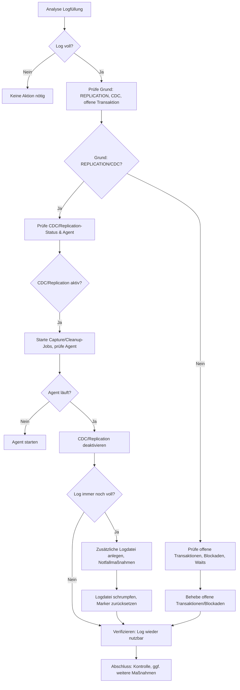

```mermaid
graph TD
    A[Analyse Logfüllung] --> B{Log voll?}
    B -- Nein --> Z[Keine Aktion nötig]
    B -- Ja --> C[Prüfe Grund: REPLICATION, CDC, offene Transaktion]
    C --> D{Grund: REPLICATION/CDC?}
    D -- Nein --> E[Prüfe offene Transaktionen, Blockaden, Waits]
    E --> F[Behebe offene Transaktionen/Blockaden]
    D -- Ja --> G[Prüfe CDC/Replication-Status & Agent]
    G --> H{CDC/Replication aktiv?}
    H -- Ja --> I[Starte Capture/Cleanup-Jobs, prüfe Agent]
    I --> J{Agent läuft?}
    J -- Nein --> K[Agent starten]
    J -- Ja --> L[CDC/Replication deaktivieren]
    L --> M{Log immer noch voll?}
    M -- Ja --> N[Zusätzliche Logdatei anlegen, Notfallmaßnahmen]
    N --> O[Logdatei schrumpfen, Marker zurücksetzen]
    M -- Nein --> P[Verifizieren: Log wieder nutzbar]
    O --> P
    F --> P
    P --> Q[Abschluss: Kontrolle, ggf. weitere Maßnahmen]
```
