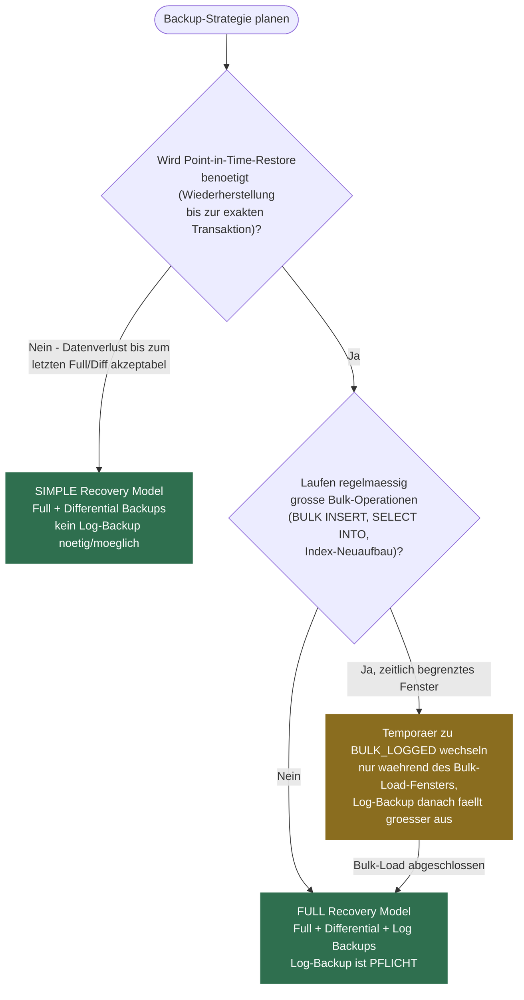
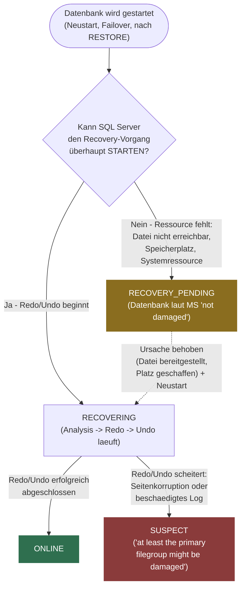
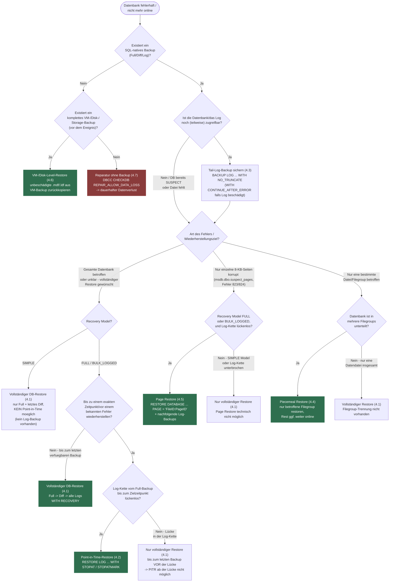

# T-SQL Backup & Restore – Strategien  
*Backup-Typen, Recovery-Modelle, Point-in-Time-Restores, Log-Ketten & Copy-Only*

## Inhaltsverzeichnis

- [1 | Begriffsdefinition](#1--begriffsdefinition)
- [2 | Struktur (Backup-Themen)](#2--struktur-backup-themen)
  - [2.1 | Grundlagen: Recovery Models, Planung & RPO/RTO](#21--grundlagen-recovery-models-planung--rporto)
  - [2.2 | Backup-Konzepte im Detail: Full, Differential, Log, Copy-Only](#22--backup-konzepte-im-detail-full-differential-log-copy-only)
  - [2.3 | Entscheidungshilfe: Welches Backup-Konzept für welches Recovery Model?](#23--entscheidungshilfe-welches-backup-konzept-für-welches-recovery-model)
  - [2.4 | BACKUP DATABASE/LOG – Syntax & Optionen](#24--backup-databaselog--syntax--optionen)
  - [2.5 | Performance: Striping, Compression, BUFFERCOUNT](#25--performance-striping-compression-buffercount)
  - [2.6 | Sicherheit: Verschlüsselung, TDE & Schutz der Dateien](#26--sicherheit-verschlüsselung-tde--schutz-der-dateien)
  - [2.7 | Backups in die Cloud: `TO URL` (Azure Blob)](#27--backups-in-die-cloud-to-url-azure-blob)
  - [2.8 | Verifikation & Integrität: VERIFYONLY, CHECKSUM, Test-Restores](#28--verifikation--integrität-verifyonly-checksum-test-restores)
  - [2.9 | Automatisierung & Aufräumen: Wartung, msdb, Retention](#29--automatisierung--aufräumen-wartung-msdb-retention)
  - [2.10 | HA/DR-Integration: AG, Log Shipping & Copy-Only](#210--hadr-integration-ag-log-shipping--copy-only)
  - [2.11 | Anti-Patterns & Checkliste](#211--anti-patterns--checkliste)
- [3 | Datenbank-Status: Wie es dazu kommt und was er bedeutet](#3--datenbank-status-wie-es-dazu-kommt-und-was-er-bedeutet)
  - [3.0 | DBCC CHECKDB: Konsistenzprüfung vor jeder Statusbewertung](#30--dbcc-checkdb-konsistenzprüfung-vor-jeder-statusbewertung)
  - [3.1 | Status auslesen](#31--status-auslesen)
  - [3.2 | Die Zustände im Detail: Wie sie entstehen und was sie bedeuten](#32--die-zustände-im-detail-wie-sie-entstehen-und-was-sie-bedeuten)
  - [3.3 | Ist SUSPECT ein fehlgeschlagenes RECOVERY_PENDING? Die genaue Zustandskette](#33--ist-suspect-ein-fehlgeschlagenes-recovery_pending-die-genaue-zustandskette)
  - [3.4 | Typische Root Causes: Wodurch RECOVERY_PENDING/SUSPECT in der Praxis tatsächlich ausgelöst wird](#34--typische-root-causes-wodurch-recovery_pendingsuspect-in-der-praxis-tatsächlich-ausgelöst-wird)
  - [3.5 | Sonderfall: Restore bricht wegen Speicherplatzmangel ab](#35--sonderfall-restore-bricht-wegen-speicherplatzmangel-ab)
  - [3.6 | Weiterführende Informationen zu Kapitel 3](#36--weiterführende-informationen-zu-kapitel-3)
- [4 | Restores](#4--restores)
  - [4.0 | Entscheidungsdiagramm: Welche Restore-Art passt?](#40--entscheidungsdiagramm-welche-restore-art-passt)
  - [4.1 | Vollständiger Datenbank-Restore (Full/Diff/Log-Kette)](#41--vollständiger-datenbank-restore-fulldifflog-kette)
  - [4.2 | Point-in-Time-Restore (PITR) & Marked Transactions](#42--point-in-time-restore-pitr--marked-transactions)
  - [4.3 | Tail-Log-Restore (Notfallwiederherstellung)](#43--tail-log-restore-notfallwiederherstellung)
  - [4.4 | Piecemeal Restore (File-/Filegroup-Restore)](#44--piecemeal-restore-file-filegroup-restore)
  - [4.5 | Page Restore (gezielte Seitenwiederherstellung)](#45--page-restore-gezielte-seitenwiederherstellung)
  - [4.6 | VM-/Disk-Level-Restore (Wiederherstellung ohne SQL-natives Backup)](#46--vm-disk-level-restore-wiederherstellung-ohne-sql-natives-backup)
  - [4.7 | Reparatur ohne Backup (`DBCC CHECKDB ... REPAIR_ALLOW_DATA_LOSS`)](#47--reparatur-ohne-backup-dbcc-checkdb--repair_allow_data_loss)
  - [4.8 | Übersichtstabelle: Restore-Arten im Vergleich](#48--übersichtstabelle-restore-arten-im-vergleich)
- [5 | Weiterführende Informationen](#5--weiterführende-informationen)

---

## 1 | Begriffsdefinition

| SQL-Term | Beschreibung |
|---|---|
| **Recovery Model** | Steuert Log-Verhalten & Wiederherstellbarkeit: **FULL**, **SIMPLE**, **BULK_LOGGED**. |
| **Full Backup** | Vollständige Kopie der DB inkl. Teile des Logs zur Konsistenz; Basis für **Differential**. |
| **Differential Backup** | Änderungen seit **letztem Full** (Differential Base). Schneller restore: Full + letztes Diff (+ Logs, falls FULL/BULK_LOGGED). |
| **Transaction Log Backup** | Sichert Log-Sequenz (**LSN-Chain**) – Voraussetzung für Point-in-Time & Log-Verkürzung im **FULL/BULK_LOGGED**. |
| **Copy-Only Backup** | Spezial-Backup, das **Differential Base nicht verändert** (Full) bzw. **Log-Chain nicht beeinflusst** (Log). |
| **Tail-Log Backup** | Sichert **letzten Log-Abschnitt** bei Ausfall **vor** RESTORE (sofern Log zugreifbar). |
| **LSN / Log Chain** | Log Sequence Number – lückenlose Kette an Log-Backups; Lücken → kein vollständiger Restore. |
| **PITR (Point-in-Time)** | Wiederherstellung bis `STOPAT` (Zeit) oder `STOPATMARK` (markierte Transaktion) mit Full/Diff/Logs. |
| **NORECOVERY/RECOVERY/STANDBY** | RESTORE-Modi in Ketten: **NORECOVERY** hält DB „restorefähig“, **RECOVERY** schließt ab, **STANDBY** = read-only mit Undo-File. |
| **File/Filegroup Backup** | Teilbackups großer DBs – kombiniert mit **Piecemeal Restore**. |
| **Page Restore** | Selektives Wiederherstellen korrupter **Daten-Seiten** (8 KB) aus Backups. |
| **Striped Backup** | Parallel auf mehrere Dateien (Medienfamilien) schreiben → Durchsatz/Redundanz. |
| **Backup Compression** | Komprimiert Backups (CPU vs. I/O-Trade-off). |
| **Backup Encryption** | Verschlüsselt Backups (Zertifikat/Asym. Key); **TDE** erfordert Schlüssel/Cert beim Restore. |
| **VERIFYONLY/CHECKSUM** | `RESTORE VERIFYONLY`/`WITH CHECKSUM` – **Erkennungs**-, nicht **Korrektur**-Prüfungen. |
| **Backup to URL** | Sicherung nach **Azure Blob Storage** (`TO URL`/`CREDENTIAL`/Managed Identity). |
| **msdb-Historie** | Backup-Metadaten: `msdb.dbo.backupset`, `backupmediafamily`, `backupfile`. |
| **RPO/RTO** | Recovery Point/Time Objective – definiert **Intervall** der Backups und **Restore-Zeit**. |

---

## 2 | Struktur (Backup-Themen)

### 2.1 | Grundlagen: Recovery Models, Planung & RPO/RTO
> **Kurzbeschreibung:** Log-Verhalten der drei Recovery Models (FULL/SIMPLE/BULK_LOGGED), Bulk-Operationen, Ziele definieren und passende Backup-Kombinationen auswählen.

Das **Recovery Model** ist die grundlegendste Entscheidung jeder Backup-Strategie — es legt fest, wie SQL Server das Transaktionslog behandelt, und bestimmt damit direkt, welche Backup-Typen überhaupt sinnvoll sind (siehe [Abschnitt 2.3](#23--entscheidungshilfe-welches-backup-konzept-für-welches-recovery-model)):

- **SIMPLE:** Das Log wird nach jedem Checkpoint automatisch abgeschnitten (truncated) — es gibt keine fortlaufende Log-Kette, daher sind **keine** Log-Backups möglich.
- **FULL:** Das Log wächst so lange, bis ein Log-Backup durchgeführt wird — das ermöglicht eine lückenlose Log-Kette und damit Point-in-Time-Restores, verlangt aber regelmäßige Log-Backups (siehe [Anti-Pattern in 2.11](#211--anti-patterns--checkliste)).
- **BULK_LOGGED:** Eine Variante von FULL, die bestimmte Massenoperationen (`BULK INSERT`, `SELECT INTO`, Index-Neuaufbau) minimal loggt statt vollständig — reduziert die Logdatei-Last bei großen Bulk-Loads, schränkt aber Point-in-Time-Restore für Log-Backups ein, die eine solche Operation enthalten.

Aus dem Recovery Model ergibt sich unmittelbar das erreichbare **RPO** (Recovery Point Objective — wie viel Datenverlust im Ernstfall akzeptiert wird) und **RTO** (Recovery Time Objective — wie schnell wiederhergestellt werden muss). Beide Ziele sollten **vor** der technischen Umsetzung festgelegt werden, da sie die Wahl von Recovery Model und Backup-Kombination bestimmen, nicht umgekehrt.

- 📓 **Notebook:**  
  [`08_01_backup_planning_rpo_rto.ipynb`](08_01_backup_planning_rpo_rto.ipynb) · [`08_02_recovery_models_basics.ipynb`](08_02_recovery_models_basics.ipynb)
- 🎥 **YouTube:**  
  - [SQL Server Backup Strategy Overview](https://www.youtube.com/results?search_query=sql+server+backup+strategy+overview)
  - [Recovery Models Explained](https://www.youtube.com/results?search_query=sql+server+recovery+models)
- 📘 **Docs:**  
  - [Backup Overview (SQL Server)](https://learn.microsoft.com/en-us/sql/relational-databases/backup-restore/back-up-and-restore-of-sql-server-databases)
  - [Recovery Models](https://learn.microsoft.com/en-us/sql/relational-databases/backup-restore/recovery-models-sql-server)

---

### 2.2 | Backup-Konzepte im Detail: Full, Differential, Log, Copy-Only
> **Kurzbeschreibung:** Differential-Base, Log-Kette, Einsatz von Copy-Only ohne Basis zu stören.

Jedes Backup-Konzept hat eine klare Beziehung zum Recovery Model, unter dem es sinnvoll ist:

- **Full Backup:** Vollständige Kopie der Datenbank inklusive der zur Konsistenz nötigen Log-Teile. Funktioniert unter **allen drei** Recovery Models und ist immer die Basis, auf der Differential- und Log-Backups aufbauen.
- **Differential Backup:** Sichert nur die Änderungen seit dem letzten Full-Backup (der "Differential Base"). Ebenfalls unter **allen drei** Recovery Models nutzbar — reduziert Backup-Größe/-Dauer gegenüber wiederholten Full-Backups, ersetzt aber kein Log-Backup und ermöglicht selbst kein PITR.
- **Transaction Log Backup:** Sichert die fortlaufende Log-Sequenz (LSN-Kette). Nur unter **FULL** und **BULK_LOGGED** möglich — unter SIMPLE gibt es keine fortlaufende Kette, die gesichert werden könnte. Ist die Voraussetzung für Point-in-Time-Restore und für die Begrenzung des Log-Wachstums.
- **Copy-Only Backup:** Ein Full- oder Log-Backup, das bewusst **nicht** in die reguläre Backup-Kette eingreift — die Differential-Base bleibt unverändert (bei Full) bzw. die Log-Kette wird nicht beeinflusst (bei Log). Sinnvoll für Ad-hoc-Sicherungen (z. B. vor einem riskanten Deployment), ohne die produktive Backup-Strategie zu stören.

- 📓 **Notebook:**  
  [`08_03_backup_types_and_copyonly.ipynb`](08_03_backup_types_and_copyonly.ipynb)
- 🎥 **YouTube:**  
  - [Full vs Diff vs Log vs Copy-Only](https://www.youtube.com/results?search_query=sql+server+full+differential+log+copy-only)
- 📘 **Docs:**  
  - [Differential Backups](https://learn.microsoft.com/en-us/sql/relational-databases/backup-restore/differential-backups-sql-server)  
  - [Copy-Only Backups](https://learn.microsoft.com/en-us/sql/relational-databases/backup-restore/copy-only-backups-sql-server)

---

### 2.3 | Entscheidungshilfe: Welches Backup-Konzept für welches Recovery Model?

Die folgende Tabelle fasst zusammen, welche Backup-Typen unter welchem Recovery Model überhaupt möglich sind, welchen Datenverlust (RPO) das jeweils bedeutet, und ob ein Point-in-Time-Restore erreichbar ist — belegt anhand der offiziellen Microsoft-Referenz zu [Recovery Models](https://learn.microsoft.com/en-us/sql/relational-databases/backup-restore/recovery-models-sql-server) (Abschnitt "Recovery time and recovery point objectives"):

| Recovery Model | Sinnvolle Backup-Typen | RPO (Datenverlust im Ernstfall) | Point-in-Time-Restore |
|---|---|---|---|
| **SIMPLE** | Full, Differential — **kein** Log-Backup möglich (keine fortlaufende Log-Kette) | Alle Änderungen seit dem letzten Full-/Differential-Backup gehen verloren | **Nicht möglich** — nur Wiederherstellung bis zum Ende eines Backups |
| **FULL** | Full, Differential, Log — Log-Backup ist **zwingend** erforderlich, sonst wächst das Log unbegrenzt | Praktisch kein Datenverlust, sofern das Log intakt und die Log-Kette lückenlos ist | Bis zur exakten Sekunde/Transaktion möglich (`STOPAT`/`STOPATMARK`) |
| **BULK_LOGGED** | Full, Differential, Log — meist **temporär** anstelle von FULL während großer Bulk-Loads eingesetzt | Kein Datenverlust, außer das Log ist beschädigt oder eine minimal geloggte Bulk-Operation liegt im betroffenen Zeitraum | Nur bis zum **Ende** des Log-Backups möglich, wenn dieses eine Bulk-Operation enthält — kein `STOPAT` innerhalb dieses Backups |

**Praktische Konsequenz:**

- Wird **kein** Point-in-Time-Restore benötigt und ist ein Datenverlust bis zum letzten Full-/Differential-Backup akzeptabel (z. B. bei reinen Reporting-/Staging-Datenbanken, die aus einer Quelle neu befüllbar sind), ist **SIMPLE** die einfachste, wartungsärmste Wahl — kein Log-Backup-Management nötig.
- Wird **minimaler Datenverlust und PITR** benötigt (der Regelfall für produktive Datenbanken), ist **FULL** die richtige Wahl — vorausgesetzt, Log-Backups laufen tatsächlich regelmäßig (siehe Anti-Pattern in [2.11](#211--anti-patterns--checkliste)).
- **BULK_LOGGED** ist kein dauerhafter Ersatz für FULL, sondern ein **temporäres Fenster**: vor einem großen Bulk-Load aktivieren, danach zurück zu FULL wechseln, um die volle PITR-Fähigkeit wiederherzustellen.



- 📘 Microsoft Learn: [Recovery Models – Abschnitt "Recovery time and recovery point objectives"](https://learn.microsoft.com/en-us/sql/relational-databases/backup-restore/recovery-models-sql-server) — offizielle RPO/RTO-Vergleichstabelle je Recovery Model.
- 📘 Microsoft Learn: [Restore to a Point in Time (Full Recovery Model)](https://learn.microsoft.com/en-us/sql/relational-databases/backup-restore/restore-a-sql-server-database-to-a-point-in-time-full-recovery-model) — Details zur PITR-Einschränkung bei BULK_LOGGED.
- 📘 Microsoft Learn: [Backup Overview (SQL Server)](https://learn.microsoft.com/en-us/sql/relational-databases/backup-restore/backup-overview-sql-server) — "The recovery model of database determines its backup and restore requirements."

---

### 2.4 | BACKUP DATABASE/LOG – Syntax & Optionen
> **Kurzbeschreibung:** `WITH COMPRESSION`, `CHECKSUM`, `STATS`, `INIT/FORMAT`, Striping (`TO DISK = ... , ...`).

- 📓 **Notebook:**  
  [`08_04_backup_syntax_options.ipynb`](08_04_backup_syntax_options.ipynb)
- 🎥 **YouTube:**  
  - [BACKUP DATABASE Tutorial](https://www.youtube.com/results?search_query=sql+server+backup+database+tutorial)
- 📘 **Docs:**  
  - [`BACKUP DATABASE`](https://learn.microsoft.com/en-us/sql/t-sql/statements/backup-transact-sql)

---

### 2.5 | Performance: Striping, Compression, BUFFERCOUNT
> **Kurzbeschreibung:** Mehrere Ziele (Striping), Transfergrößen, `MAXTRANSFERSIZE`, `BLOCKSIZE`, IO/CPU abwägen.

- 📓 **Notebook:**  
  [`08_10_backup_performance_tuning.ipynb`](08_10_backup_performance_tuning.ipynb)
- 🎥 **YouTube:**  
  - [Speed Up Backups](https://www.youtube.com/results?search_query=sql+server+backup+performance+striped)
- 📘 **Docs:**  
  - [Optimize Backup and Restore Performance](https://learn.microsoft.com/en-us/sql/relational-databases/backup-restore/tune-performance-of-backup-operations)

---

### 2.6 | Sicherheit: Verschlüsselung, TDE & Schutz der Dateien
> **Kurzbeschreibung:** Backup Encryption (Cert/Asym), TDE-Key-Export, Offsite/Immutability (3-2-1-Regel).

- 📓 **Notebook:**  
  [`08_11_backup_encryption_tde_security.ipynb`](08_11_backup_encryption_tde_security.ipynb)
- 🎥 **YouTube:**  
  - [Encrypted Backups & TDE](https://www.youtube.com/results?search_query=sql+server+backup+encryption+tde)
- 📘 **Docs:**  
  - [Backup Encryption](https://learn.microsoft.com/en-us/sql/relational-databases/backup-restore/backup-encryption)  
  - [TDE – Export/Import Keys](https://learn.microsoft.com/en-us/sql/relational-databases/security/encryption/transparent-data-encryption)

---

### 2.7 | Backups in die Cloud: `TO URL` (Azure Blob)
> **Kurzbeschreibung:** Sicherungen direkt nach Azure Blob (SAS/Credential/MI), Throttling & Kosten.

- 📓 **Notebook:**  
  [`08_12_backup_to_url_azure_blob.ipynb`](08_12_backup_to_url_azure_blob.ipynb)
- 🎥 **YouTube:**  
  - [Backup to URL Demo](https://www.youtube.com/results?search_query=sql+server+backup+to+url+azure+blob)
- 📘 **Docs:**  
  - [SQL Server Backup to URL](https://learn.microsoft.com/en-us/sql/relational-databases/backup-restore/sql-server-backup-to-url)

---

### 2.8 | Verifikation & Integrität: VERIFYONLY, CHECKSUM, Test-Restores
> **Kurzbeschreibung:** Prüfen, ob das Backup **lesbar** ist; Restore-Probe, `DBCC CHECKDB` nach Restore.

- 📓 **Notebook:**  
  [`08_13_verify_checksum_testrestore.ipynb`](08_13_verify_checksum_testrestore.ipynb)
- 🎥 **YouTube:**  
  - [Restore VERIFYONLY vs CHECKSUM](https://www.youtube.com/results?search_query=sql+server+restore+verifyonly+checksum)
- 📘 **Docs:**  
  - [`RESTORE VERIFYONLY`](https://learn.microsoft.com/en-us/sql/t-sql/statements/restore-statements-verifyonly-transact-sql)  
  - [Backup Checksums](https://learn.microsoft.com/en-us/sql/relational-databases/backup-restore/backup-checksums-sql-server)

---

### 2.9 | Automatisierung & Aufräumen: Wartung, msdb, Retention
> **Kurzbeschreibung:** Jobs/Plans/Skripte, `msdb`-Historie, Lösch-/Kopier-Policies, Reporting.

**Welche Wege gibt es überhaupt, ein Backup einzurichten?** Alle folgenden Ansätze laufen letztlich über denselben Container — den **SQL Server Agent Job** — der aus einem oder mehreren Job Steps mit definiertem Erfolgs-/Fehlerpfad besteht und über Schedules zeit- oder ereignisgesteuert (oder manuell) gestartet wird; zulässige Step-Typen umfassen u. a. T-SQL-Skripte, Betriebssystemkommandos (`CmdExec`), PowerShell-Skripte und SSIS-Pakete ([SQL Server Agent](https://learn.microsoft.com/en-us/ssms/agent/sql-server-agent), [Manage Job Steps](https://learn.microsoft.com/en-us/ssms/agent/manage-job-steps)). Die konkreten Wege, ein Backup darin einzubetten:

- **Maintenance Plans (SSMS-Wizard):** Erzeugt im Hintergrund ein Integration-Services-(SSIS-)Paket, das von einem Agent Job ausgeführt wird. Vorteil: schnell per GUI eingerichtet, inklusive Backup, `DBCC CHECKDB`, Index-/Statistik-Wartung und Cleanup in gruppierbaren Subplänen. Nachteil: erzeugt oft wenig granulares T-SQL (z. B. Index-Rebuild für alle statt selektiv betroffene Tabellen), ist schlecht skript-/versionierbar und wird in unternehmenskritischen Umgebungen häufig nicht empfohlen ([Maintenance Plans](https://learn.microsoft.com/en-us/sql/relational-databases/maintenance-plans/maintenance-plans)).
- **T-SQL direkt in einem Agent Job:** Der klassische, seit Jahren bewährte Standardweg — ein Job Step vom Typ "Transact-SQL Script (T-SQL)" enthält `BACKUP DATABASE`/`BACKUP LOG`-Statements und läuft nach einem definierten Zeitplan. Voll transparent, versionierbar und ohne Zusatzsoftware nutzbar ([Schedule a Backup](https://learn.microsoft.com/en-us/sql/relational-databases/backup-restore/schedule-database-backup-operation-ssms)).
- **Ola Hallengren's SQL Server Maintenance Solution:** Eine kostenlose, äußerst weit verbreitete Sammlung von Stored Procedures (`DatabaseBackup`, `DatabaseIntegrityCheck`, `IndexOptimize`), die über ein einziges Installationsskript eingerichtet wird — dieses legt die Prozeduren und passende Agent Jobs samt Zeitplänen automatisch an. Gilt in der Praxis als De-facto-Standardalternative zu Maintenance Plans, da es deutlich mehr Flexibilität, Logging, Fehlerbehandlung und Best-Practice-Konfiguration (intelligentes Backup-Scheduling, Verify, Komprimierung) mitbringt und breit community-erprobt ist ([ola.hallengren.com](https://ola.hallengren.com/)).
- **PowerShell:** Microsofts offizielles `SqlServer`-Modul stellt das Cmdlet `Backup-SqlDatabase` bereit — funktional nahe an einem einfachen `BACKUP`-Statement. Das Community-Modul **dbatools** (Open Source) bietet mit `Backup-DbaDatabase` deutlich mehr Automatisierungslogik: Pfadvalidierung, automatische Ausschlüsse (z. B. `tempdb`), Dateiname-Platzhalter, strukturierte Rückgabewerte und Massenoperationen über viele Instanzen/Datenbanken hinweg — dbatools gilt als das mächtigere, DBA-fokussierte Pendant zum schlankeren offiziellen Cmdlet ([Backup-SqlDatabase](https://learn.microsoft.com/en-us/powershell/module/sqlserver/backup-sqldatabase), [Backup-DbaDatabase](https://dbatools.io/Backup-DbaDatabase/)). Ein PowerShell-Skript läuft dabei selbst wieder typischerweise als eigener Agent-Job-Step-Typ ([PowerShell Script Job Step](https://learn.microsoft.com/en-us/ssms/agent/create-a-powershell-script-job-step)).
- **Python:** Kein offizielles Microsoft-Pattern, sondern ein Community-Ansatz — meist über `pyodbc`/`pymssql`, um `BACKUP DATABASE`-Statements per Cursor abzusetzen (dabei laufen Backup/Restore über ODBC asynchron mit mehreren Result Sets, weshalb ohne eine `cursor.nextset()`-Schleife der tatsächliche Erfolg nicht zuverlässig erkannt wird), oder per `subprocess`-Aufruf von `sqlcmd`/PowerShell. Im Vergleich zu Agent Jobs, Ola Hallengren oder PowerShell deutlich unüblicher und meist nur sinnvoll, wenn das Backup ohnehin Teil einer größeren Python-Orchestrierung (z. B. einer Datenpipeline) ist.
- **Weitere Wege:** Für **Azure SQL Database** gibt es keinen klassischen SQL Server Agent — dort übernehmen **Elastic Jobs** (T-SQL über viele Datenbanken hinweg geplant ausführen) oder Azure Automation/Runbooks diese Rolle, während **Azure SQL Managed Instance** SQL Server Agent nativ weiter unterstützt ([Elastic Jobs](https://learn.microsoft.com/en-us/azure/azure-sql/database/elastic-jobs-overview)). `dbatools` bietet zudem mit `Install-DbaMaintenanceSolution` einen PowerShell-Wrapper, der Ola Hallengrens Lösung automatisiert installiert und pflegt. Daneben existieren kommerzielle Drittanbieter-Tools (z. B. Redgate SQL Backup, Veeam, SqlBak) mit eigener Scheduling-, Kompressions- und Cloud-Offsite-Funktionalität oberhalb der nativen `BACKUP`-Engine.

**Praktische Einordnung:** Für die meisten Umgebungen ist entweder ein einfacher T-SQL-Agent-Job (kleine, wenige Datenbanken) oder Ola Hallengrens Lösung (mehrere Datenbanken, produktive Umgebungen) die richtige Wahl. Maintenance Plans eignen sich für sehr einfache Szenarien ohne hohe Ansprüche an Granularität; PowerShell/dbatools lohnt sich, sobald Backups über mehrere Instanzen hinweg orchestriert werden müssen; Python bleibt die Ausnahme für Fälle, in denen das Backup ohnehin in eine bestehende Nicht-SQL-Automatisierung eingebettet wird.

**Weiterführende Artikel zu den einzelnen Automatisierungswegen:**

*Microsoft Learn:*
- 📘 [SQL Server Agent](https://learn.microsoft.com/en-us/ssms/agent/sql-server-agent) — Überblick über den Agent-Dienst und seine Rolle bei geplanten administrativen Aufgaben.
- 📘 [Create SQL Server Agent Jobs](https://learn.microsoft.com/en-us/ssms/agent/create-jobs) — Jobs erstellen über SSMS, T-SQL oder SMO.
- 📘 [Configure a User to Create and Manage SQL Server Agent Jobs](https://learn.microsoft.com/en-us/ssms/agent/configure-a-user-to-create-and-manage-sql-server-agent-jobs) — Berechtigungskonzept (Agent-Rollen, `sysadmin`) für die Job-Verwaltung.
- 📘 [Use the Maintenance Plan Wizard](https://learn.microsoft.com/en-us/sql/relational-databases/maintenance-plans/use-the-maintenance-plan-wizard) — Schritt-für-Schritt-Anleitung zum SSMS-Wizard.
- 📘 [Create a Full Database Backup – SQL Server](https://learn.microsoft.com/en-us/sql/relational-databases/backup-restore/create-a-full-database-backup-sql-server) — T-SQL-Grundlagen für vollständige Backups.
- 📘 [Restore-SqlDatabase (SqlServer-Modul)](https://learn.microsoft.com/en-us/powershell/module/sqlserver/restore-sqldatabase) — Gegenstück zu `Backup-SqlDatabase`.
- 📘 [Create and manage elastic jobs by using PowerShell](https://learn.microsoft.com/en-us/azure/azure-sql/database/elastic-jobs-powershell-create) — praktische Anleitung zu Azure Elastic Jobs.
- 📘 [Automation in Azure SQL overview](https://learn.microsoft.com/en-us/azure/azure-sql/database/job-automation-overview) — Übersicht der Automatisierungsoptionen (Elastic Jobs, Agent, Automation) in Azure SQL.

*Ola Hallengren – Maintenance Solution:*
- 📝 [SQL Server Backup – Ola Hallengren](https://ola.hallengren.com/sql-server-backup.html) — detaillierte Parameterdokumentation der `DatabaseBackup`-Prozedur.
- 📝 [SQL Server Integrity Check – Ola Hallengren](https://ola.hallengren.com/sql-server-integrity-check.html) — Parameter/Optionen der `DBCC CHECKDB`-Integration.
- 📝 [SQL Server Maintenance Solution Downloads](https://ola.hallengren.com/downloads.html) — Download-Seite mit dem Installationsskript `MaintenanceSolution.sql`.
- 📝 Brent Ozar: [How to Configure Ola Hallengren's IndexOptimize Maintenance Script](https://www.brentozar.com/archive/2014/12/tweaking-defaults-ola-hallengrens-maintenance-scripts/) — typische Parameteranpassungen aus der Praxis.

*dbatools-Dokumentation:*
- 📝 [Backup-DbaDatabase](https://docs.dbatools.io/Backup-DbaDatabase.html) — vollständige Cmdlet-Referenz inkl. Kompression, Verschlüsselung, Striping, Azure-Blob-Ziel.
- 📝 [Restore-DbaDatabase](https://docs.dbatools.io/Restore-DbaDatabase.html) — Gegenstück zum Wiederherstellen, relevant als Backup-Workflow-Ergänzung.

*Experten-Blogs (Best Practices, Kritik, Vergleiche):*
- 📝 Brent Ozar: [Backups 3: Setting Up Maintenance Plans](https://www.brentozar.com/training/fundamentals-database-administration/backups-3-setting-up-maintenance-plans/) — wann Maintenance Plans sinnvoll sind (und wann nicht).
- 📝 Brent Ozar: [Backups 4: Setting Up Ola Hallengren's Maintenance Scripts](https://www.brentozar.com/training/fundamentals-database-administration/ola-setup-34m/) — direkter Vergleich Maintenance Plans vs. Ola-Skripte.
- 📝 Paul Randal (SQLskills): [Planning a backup strategy – where to start?](https://www.sqlskills.com/blogs/paul/planning-a-backup-strategy-where-to-start/) — Backup-Strategie von der Restore-Anforderung her denken.
- 📝 MSSQLTips: [SQL Server Agent Job Management](https://www.mssqltips.com/sqlservertip/2139/sql-server-agent-job-management/) — Best Practices zur Verwaltung/Überwachung von Agent-Jobs.
- 📝 MSSQLTips: [Invoking SQL Server Database Backups with PowerShell](https://www.mssqltips.com/sqlservertip/4223/invoking-sql-server-database-backups-with-powershell/) — Praxisbeispiel für PowerShell-basierte Backup-Automatisierung.
- 📝 MSSQLTips: [Automate SQL Server Backups using SQLCMD and Windows Task Scheduler](https://www.mssqltips.com/sqlservertip/7683/automate-sql-server-backups-sqlcmd-windows-task-scheduler/) — skriptbasierter Weg außerhalb des Agents.
- 📝 SQL Nuggets: [Backing Up Databases With The dbatools PowerShell Module](https://sqlnuggets.com/backing-up-databases-with-the-dbatools-powershell-module/) — Praxisvergleich natives Cmdlet vs. dbatools.

*Python-basierte Automatisierung:*
- 📝 freeCodeCamp: [How to Automate SQL Database Backups Using Python](https://www.freecodecamp.org/news/automate-sql-database-backups-using-python/) — Tutorial mit `pyodbc`, inkl. Hinweis auf asynchrone `BACKUP`-Result-Sets.
- 📝 [MS SQL Backup with Python and pyodbc](https://mindless.gr/2012/09/ms-sql-backup-with-python-and-pyodbc/) — kompaktes Codebeispiel für `BACKUP DATABASE` via `pyodbc`.

- 📓 **Notebook:**  
  [`08_14_automation_msdb_retention.ipynb`](08_14_automation_msdb_retention.ipynb)
- 🎥 **YouTube:**  
  - [Automate SQL Backups](https://www.youtube.com/results?search_query=sql+server+automate+backups+ola+hallengren)
- 📘 **Docs:**  
  - [msdb Backup History Tables](https://learn.microsoft.com/en-us/sql/relational-databases/system-tables/backup-and-restore-tables-msdb-database)
  - [SQL Server Agent](https://learn.microsoft.com/en-us/ssms/agent/sql-server-agent)
  - [Maintenance Plans](https://learn.microsoft.com/en-us/sql/relational-databases/maintenance-plans/maintenance-plans)
  - [Backup-SqlDatabase (SqlServer-Modul)](https://learn.microsoft.com/en-us/powershell/module/sqlserver/backup-sqldatabase)
  - [Backup-DbaDatabase (dbatools)](https://dbatools.io/Backup-DbaDatabase/)
  - [Ola Hallengren's SQL Server Maintenance Solution](https://ola.hallengren.com/)

---

### 2.10 | HA/DR-Integration: AG, Log Shipping & Copy-Only
> **Kurzbeschreibung:** Backup-Präferenzen in **Always On AG**, Sekundärknoten-Backups, Log Shipping-Ketten, Copy-Only bei Ad-hoc.

- 📓 **Notebook:**  
  [`08_15_hadr_ag_logshipping_backups.ipynb`](08_15_hadr_ag_logshipping_backups.ipynb)
- 🎥 **YouTube:**  
  - [AG Backup Preferences](https://www.youtube.com/results?search_query=sql+server+availability+groups+backup+preferences)
- 📘 **Docs:**  
  - [Backups on Always On Availability Groups](https://learn.microsoft.com/en-us/sql/database-engine/availability-groups/windows/active-secondaries-backup-on-secondary-replicas)  
  - [Log Shipping](https://learn.microsoft.com/en-us/sql/database-engine/log-shipping/about-log-shipping-sql-server)

---

### 2.11 | Anti-Patterns & Checkliste
> **Kurzbeschreibung:** Nur Full-Backups im FULL-Model (ohne Log), keine Restore-Tests, Copy-Only falsch eingesetzt, Differential-Basen zerstört, LSN-Lücken, ungeprüfte Verschlüsselungs-Keys, fehlende Offsite/Immutability, `msdb`-Cleanup vergessen.

**Der klassische Fall aus 2.3:** Eine Datenbank läuft im **FULL Recovery Model**, aber es werden nie Log-Backups durchgeführt (nur gelegentliche Full-Backups). Das führt zu einer doppelten Fehlfunktion, belegt in Microsofts Troubleshooting zu [Fehler 9002 (volles Transaktionslog)](https://learn.microsoft.com/en-us/sql/relational-databases/logs/troubleshoot-a-full-transaction-log-sql-server-error-9002): Das Log kann nur durch ein Log-Backup abgeschnitten (truncated) werden — ohne Log-Backup wächst es unbegrenzt, bis der Datenträger voll ist oder `MAXSIZE` erreicht wird. **Gleichzeitig** entfällt trotz FULL Model der eigentliche Vorteil (Point-in-Time-Restore), da keine Log-Backup-Kette existiert, die dafür nötig wäre. Diese Kombination ist damit weder in der Wiederherstellbarkeit noch im Ressourcenverbrauch besser als SIMPLE — nur mit dem zusätzlichen Risiko eines vollgelaufenen Logs. Richtig ist: entweder tatsächlich regelmäßige Log-Backups im FULL Model einplanen, oder bei fehlendem PITR-Bedarf konsequent auf SIMPLE wechseln.

- 📓 **Notebook:**  
  [`08_16_backup_restore_antipatterns_checklist.ipynb`](08_16_backup_restore_antipatterns_checklist.ipynb)
- 🎥 **YouTube:**  
  - [Common Backup/Restore Mistakes](https://www.youtube.com/results?search_query=sql+server+backup+restore+mistakes)
- 📘 **Docs/Blog:**  
  - [Backup/Restore Best Practices](https://learn.microsoft.com/en-us/sql/relational-databases/backup-restore/back-up-and-restore-of-sql-server-databases#best-practices)
  - [Troubleshoot a Full Transaction Log (Error 9002)](https://learn.microsoft.com/en-us/sql/relational-databases/logs/troubleshoot-a-full-transaction-log-sql-server-error-9002)

---

## 3 | Datenbank-Status: Wie es dazu kommt und was er bedeutet

Bevor über die passende Restore-Art entschieden werden kann, muss zuerst klar sein, **in welchem Zustand sich die Datenbank gerade befindet** — SQL Server zeigt das über `sys.databases.state_desc`. Dieses Kapitel erklärt, wie es zu den einzelnen Zuständen kommt und was jeweils zu tun ist.

### 3.0 | DBCC CHECKDB: Konsistenzprüfung vor jeder Statusbewertung

Der Status `ONLINE` allein sagt nichts darüber aus, ob eine Datenbank tatsächlich **konsistent** ist — dafür ist `DBCC CHECKDB` zuständig. Dieser Abschnitt erklärt genau, was der Befehl prüft, wie sein Ergebnis zu lesen ist, und warum eine Datenbank mit tausenden gemeldeten Fehlern trotzdem als `ONLINE` angezeigt werden kann.

#### 3.0.1 | Was DBCC CHECKDB tatsächlich prüft

`DBCC CHECKDB` führt intern drei Prüfungen nacheinander aus ([Microsoft Learn](https://learn.microsoft.com/en-us/sql/t-sql/database-console-commands/dbcc-checkdb-transact-sql)):

- **`DBCC CHECKALLOC` — Allocation-Check:** Prüft die *physische Buchhaltung* der Seiten-/Extent-Zuordnung anhand der `GAM`-, `SGAM`-, `PFS`- und `IAM`-Seiten. Jeder Extent muss eindeutig entweder als frei oder genau einer Tabelle/einem Index zugeordnet sein — nur bestimmte Bit-Kombinationen dieser vier Strukturen sind gültig. Ein Allocation-Fehler bedeutet z. B., dass eine Seite zwei Objekten gleichzeitig "gehört" oder als frei markiert ist, obwohl sie Daten enthält ([Paul Randal: Inside The Storage Engine](https://www.sqlskills.com/blogs/paul/inside-the-storage-engine-gam-sgam-pfs-and-other-allocation-maps/)).
- **`DBCC CHECKTABLE`** (für jede Tabelle/View): Prüft die *logische* Struktur — Seiten-Header-Integrität, korrekte Verkettung der Seiten im B-Tree/Heap, Übereinstimmung jedes Nonclustered-Index-Eintrags mit der Basistabelle, Duplikate/Überlappungen in Indizes, sowie neu berechnete berechnete Spalten ([Paul Randal: CHECKDB From Every Angle](https://www.sqlskills.com/blogs/paul/checkdb-from-every-angle-complete-description-of-all-checkdb-stages/)).
- **`DBCC CHECKCATALOG`:** Prüft die referenzielle Konsistenz zwischen den Systemkatalog-Tabellen selbst (`sys.objects`, `sys.columns`, `sys.indexes` usw.).

**`PHYSICAL_ONLY`** beschränkt die Prüfung auf Seiten-Header-Integrität und Checksummen (erkennt Torn Pages und Hardware-/I/O-Fehler), überspringt aber die vollen logischen Checks — deutlich schneller, aber weniger gründlich; empfohlen für häufige Läufe, ein vollständiger `CHECKDB` sollte dennoch regelmäßig laufen ([Microsoft Learn](https://learn.microsoft.com/en-us/sql/t-sql/database-console-commands/dbcc-checkdb-transact-sql)).

#### 3.0.2 | Das Skript in diesem Kapitel

[SQLScripts/CheckDbAllDatabases.sql](SQLScripts/CheckDbAllDatabases.sql) (Doku: [SQLScripts/CheckDbAllDatabases.md](SQLScripts/CheckDbAllDatabases.md)) führt `DBCC CHECKDB` für alle (oder gezielt ausgewählte) Datenbanken der Instanz nacheinander aus, zeigt vor jeder Prüfung eine Fortschrittsmeldung mit Zähler, misst die Dauer millisekundengenau und protokolliert am Ende jede Datenbank mit Status (`OK`/`FAILED`/`SKIPPED`) in einer zusammenfassenden Tabelle. Es ist rein diagnostisch — für eine anschließende Reparatur siehe [SuspectDatabaseRepairWithoutBackup.sql](SQLScripts/SuspectDatabaseRepairWithoutBackup.sql) bzw. [RecoveryPendingRepairWithoutBackup.sql](SQLScripts/RecoveryPendingRepairWithoutBackup.sql).

#### 3.0.3 | Ein Beispiel aus der Praxis, Zeile für Zeile erklärt

```text
Pruefe jetzt: [BI_Logging] (1 von 1)
Gestartet um 2026-08-14 08:20:30.284.
CHECKDB found 0 allocation errors and 13034 consistency errors not associated with any single object.
CHECKDB found 0 allocation errors and 34 consistency errors in table 'LW_RowComparison' (object ID 18099105).
CHECKDB found 0 allocation errors and 206 consistency errors in table 'log.History' (object ID 581577110).
CHECKDB found 0 allocation errors and 19664 consistency errors in table 'log.LogDetails' (object ID 773577794).
CHECKDB found 0 allocation errors and 8 consistency errors in table 'LW_Counts' (object ID 1557580587).
CHECKDB found 0 allocation errors and 40 consistency errors in table 'SAP_Counts' (object ID 1701581100).
CHECKDB found 0 allocation errors and 9 consistency errors in table 'log.JobLog' (object ID 1845581613).
CHECKDB found 0 allocation errors and 32995 consistency errors in database 'BI_Logging'.
repair_allow_data_loss is the minimum repair level for the errors found by DBCC CHECKDB (BI_Logging).
Abgeschlossen um 2026-08-14 08:28:23.414 (Dauer: 473.130 Sekunden).
```

**`0 allocation errors`** — die physische Seiten-/Extent-Buchhaltung (GAM/SGAM/PFS/IAM) ist über die gesamte Datenbank hinweg intakt. Das eigentliche Problem liegt ausschließlich auf der logischen Ebene.

**`consistency errors` je Tabelle** — jede Zeile mit `in table '...'` listet die Anzahl logischer Fehler, die `CHECKTABLE` für genau dieses Objekt gefunden hat (z. B. defekte Seiten-Verkettung, Index-Diskrepanzen). Auffällig: Die Fehler konzentrieren sich stark auf `log.LogDetails` (19.664 von 32.995 Fehlern) — plausibel, aber nicht durch eine offizielle Quelle belegbar, ist die Erklärung über das schiere Datenvolumen: Log-/Historientabellen sind typischerweise die mit Abstand am stärksten beschriebenen und größten Tabellen einer Datenbank, wodurch bei einem systemweiten I/O-Problem statistisch die meisten betroffenen Seiten dort landen — nicht, weil Log-Tabellen strukturell anfälliger wären.

**`13034 consistency errors not associated with any single object`** — Fehler, die *keinem* Objekt eindeutig zugeordnet werden konnten. Das betrifft typischerweise Datenseiten (meist in einem Heap), die keine erkennbare B-Tree-Verkettung zu einem Objekt mehr haben, oder Fehler in `CHECKCATALOG`-übergreifenden Systemkatalog-Referenzen. SQL Server kann in diesem Fall nicht mehr sicher bestimmen, zu welcher Tabelle die Seite gehört — die Reparatur bedeutet dann das vollständige Entfernen der Seite (siehe Paul Randal, [Foren-Erklärung genau dieser Formulierung](https://microsoft.public.sqlserver.server.narkive.com/TbKqDYAE/consistency-errors-not-associated-with-any-single-object)).

**Die Rechnung geht exakt auf:** 34 + 206 + 19.664 + 8 + 40 + 9 = **19.961** objektgebundene Fehler. 32.995 (Gesamtsumme laut `in database 'BI_Logging'`) − 19.961 = **13.034** — exakt die Zahl der nicht zuordenbaren Fehler aus der ersten Zeile. Das ist kein Zufall: Die datenbankweite Summe ist immer *objektgebundene Fehler + nicht zuordenbare Fehler*, auch wenn die nicht zuordenbaren Fehler in der objektweisen Auflistung selbst nicht auftauchen.

**`repair_allow_data_loss is the minimum repair level`** — mindestens einer der gefundenen Fehlertypen lässt sich **nicht** mit dem verlustfreien `REPAIR_REBUILD` beheben (das nur z. B. fehlende Nonclustered-Index-Einträge neu aufbaut). Es bleibt nur `REPAIR_ALLOW_DATA_LOSS`, das ganze Zeilen, Seiten oder Seitenfolgen dauerhaft entfernen kann. Die Meldung ist eine *Mindestangabe* — sie garantiert nicht, dass danach alles behoben ist, nur dass dies die niedrigste Stufe ist, die überhaupt einen Reparaturversuch erlaubt (siehe [Troubleshoot database consistency errors – Microsoft Learn](https://learn.microsoft.com/en-us/troubleshoot/sql/database-engine/database-file-operations/troubleshoot-dbcc-checkdb-errors)).

**Praktische Konsequenz:** Bei diesem Befund zuerst prüfen, ob ein brauchbares Backup existiert (siehe Kapitel 4) — `REPAIR_ALLOW_DATA_LOSS` ist erst das letzte Mittel, wenn kein Restore möglich ist.

#### 3.0.4 | Warum zeigt `sys.databases` trotzdem `ONLINE` an?

Das ist der Punkt, der am häufigsten zu Verwirrung führt: Eine Datenbank mit 32.995 gemeldeten Konsistenzfehlern kann weiterhin problemlos als `ONLINE` in `sys.databases.state_desc` erscheinen — das ist **kein Widerspruch**, sondern eine Folge davon, dass `state_desc` und `DBCC CHECKDB` zwei völlig unabhängige Prüfmechanismen sind:

- **`state_desc` spiegelt nur, ob die Crash-Recovery-Maschinerie erfolgreich war** (siehe Abschnitt 3.3): Konnte die Datenbank beim letzten Start ihr Transaktionslog erfolgreich anwenden (Redo/Undo) und ist sie seitdem für Verbindungen geöffnet, steht sie auf `ONLINE` — unabhängig davon, ob einzelne Datenseiten inhaltlich beschädigt sind. SQL Server prüft beim normalen Hochfahren **nicht** automatisch jede einzelne Datenseite auf logische Konsistenz; das wäre bei jedem Neustart extrem teuer.
- **`DBCC CHECKDB` ist eine bewusst separate, aktiv anzustoßende Prüfung**, die tief in die Seitenstruktur, Index-Verkettungen und Systemkatalog-Referenzen hineinschaut — Dinge, die für den reinen Start-/Zugriffs-Mechanismus von SQL Server gar nicht relevant sind. Ein Client kann sich verbinden, `SELECT`s gegen unbeschädigte Tabellen/Seiten ausführen und normal arbeiten, während zeitgleich andere Seiten oder Tabellen (wie hier `log.LogDetails`) bereits inkonsistent sind — SQL Server merkt das erst, wenn genau diese beschädigte Seite tatsächlich gelesen/geschrieben wird (dann typischerweise mit Fehler 823/824), oder eben wenn `DBCC CHECKDB` aktiv danach sucht.
- **`SUSPECT` entsteht nur, wenn die Crash Recovery selbst (Redo/Undo) an einer Beschädigung scheitert** (siehe Abschnitt 3.3) — nicht bereits dann, wenn irgendwo in der Datenbank beschädigte Seiten liegen, die die Recovery gar nicht betreten musste. Corruption in einer selten gelesenen Tabelle oder in Bereichen außerhalb des aktiven Log-Redo-Pfads bleibt für den Startvorgang unsichtbar.
- **Praktische Konsequenz:** `ONLINE` bedeutet nur *"die Datenbank ist zugreifbar"*, nicht *"die Datenbank ist konsistent"*. Deshalb ist eine regelmäßige, proaktive `DBCC CHECKDB`-Prüfung (siehe [CheckDbAllDatabases.sql](SQLScripts/CheckDbAllDatabases.sql)) unverzichtbar — ohne sie können Datenbanken monatelang unbemerkt mit fortschreitender Korruption weiterlaufen, bis zufällig eine betroffene Seite gelesen wird oder ein Neustart die Recovery über genau diesen beschädigten Bereich zwingt und die Datenbank dann erst `SUSPECT` wird.

#### 3.0.5 | Weiterführende Informationen zu DBCC CHECKDB

- 📘 Microsoft Learn: [DBCC CHECKDB (Transact-SQL)](https://learn.microsoft.com/en-us/sql/t-sql/database-console-commands/dbcc-checkdb-transact-sql) — offizielle Referenz: Syntax, alle Optionen (`PHYSICAL_ONLY`, `DATA_PURITY`, `TABLOCK`, Repair-Level), Beispiel-Ausgaben.
- 📘 Microsoft Learn: [Troubleshoot database consistency errors reported by DBCC CHECKDB](https://learn.microsoft.com/en-us/troubleshoot/sql/database-engine/database-file-operations/troubleshoot-dbcc-checkdb-errors) — offizieller Troubleshooting-Guide inkl. der Meldung "repair_allow_data_loss is the minimum repair level".
- 📝 Paul Randal (SQLskills, Originalautor von `DBCC CHECKDB`): [CHECKDB From Every Angle: Complete description of all CHECKDB stages](https://www.sqlskills.com/blogs/paul/checkdb-from-every-angle-complete-description-of-all-checkdb-stages/) — detaillierte interne Phasenbeschreibung.
- 📝 Paul Randal: [Inside The Storage Engine: GAM, SGAM, PFS and other allocation maps](https://www.sqlskills.com/blogs/paul/inside-the-storage-engine-gam-sgam-pfs-and-other-allocation-maps/) — Grundlagenartikel zu den Strukturen, die der Allocation-Check prüft.
- 📝 Paul Randal: [CHECKDB From Every Angle: Can CHECKDB repair everything?](https://www.sqlskills.com/blogs/paul/checkdb-from-every-angle-can-checkdb-repair-everything/) — Grenzen der Reparatur, warum `REPAIR_ALLOW_DATA_LOSS` manchmal unausweichlich ist.
- 📝 Paul Randal: [Misconceptions around database repair](https://www.sqlskills.com/blogs/paul/misconceptions-around-database-repair/) — räumt mit gängigen Irrtümern zu DBCC-Repair auf, betont die Backup-Priorität.
- 📝 Paul Randal: [CHECKDB From Every Angle: Consistency Checking Options for a VLDB](https://www.sqlskills.com/blogs/paul/checkdb-from-every-angle-consistency-checking-options-for-a-vldb/) — Performance-Strategien für sehr große Datenbanken (Filegroup-Rotation, Wochenpläne).
- 📝 Paul Randal: ["consistency errors not associated with any single object" — Erklärung der genauen Formulierung](https://microsoft.public.sqlserver.server.narkive.com/TbKqDYAE/consistency-errors-not-associated-with-any-single-object).
- 📝 Erin Stellato (SQLskills): [DBCC CHECKDB Parallel Checks and SQL Server Edition](https://www.sqlskills.com/blogs/erin/dbcc-checkdb-parallel-checks-and-sql-server-edition/) — Parallelität von `CHECKDB` je nach Edition, relevant für Performance-Planung.
- 📝 Erin Stellato (SQLskills): [Capturing DBCC CHECKDB Output](https://www.sqlskills.com/blogs/erin/capturing-dbcc-checkdb-output/) — Praxisleitfaden zum Erfassen und Auswerten von `CHECKDB`-Ausgaben in Agent-Jobs.
- 📝 Brent Ozar: [3 Ways to Run DBCC CHECKDB Faster](https://www.brentozar.com/archive/2020/08/3-ways-to-run-dbcc-checkdb-faster/) — praxisnahe Performance-Tipps (`PHYSICAL_ONLY`, `MAXDOP`, Backup-Restore-Strategie).

---

### 3.1 | Status auslesen

```sql
SELECT name, state_desc, recovery_model_desc, user_access_desc
FROM sys.databases;
```

Für eine vollständige, sofort einsetzbare Abfrage mit Klartext-Einordnung und Kritikalitäts-Sortierung siehe [SQLScripts/DatabaseStatusOverview.sql](SQLScripts/DatabaseStatusOverview.sql) (Doku: [SQLScripts/DatabaseStatusOverview.md](SQLScripts/DatabaseStatusOverview.md)) — das Skript ordnet jeden Status direkt in Klartext ein und sortiert kritische Zustände (`SUSPECT`, `RECOVERY_PENDING`, `EMERGENCY`) an den Anfang der Ausgabe. Zeigt es eine betroffene Datenbank an, hilft als nächster Schritt [SQLScripts/SuspectOrRecoveryPendingDatabaseRootCauseCheck.sql](SQLScripts/SuspectOrRecoveryPendingDatabaseRootCauseCheck.sql) (Doku: [SQLScripts/SuspectOrRecoveryPendingDatabaseRootCauseCheck.md](SQLScripts/SuspectOrRecoveryPendingDatabaseRootCauseCheck.md)), die konkrete Ursache automatisiert einzugrenzen (Dateizugriff, Speicherplatz, Seitenkorruption, Errorlog).

### 3.2 | Die Zustände im Detail: Wie sie entstehen und was sie bedeuten

| Status | Wie es dazu kommt | Bedeutung | Erforderliches Handeln |
|---|---|---|---|
| **ONLINE** | Normalzustand — die Datenbank ist vollständig hochgefahren und für Lese-/Schreibzugriffe verfügbar. | Alles in Ordnung. | Keins. |
| **RESTORING** | Ein `RESTORE DATABASE`/`RESTORE LOG` läuft gerade, oder eine vorherige Restore-Kette wurde mit `WITH NORECOVERY` abgebrochen und wartet auf den nächsten Schritt (weiteres Backup oder `WITH RECOVERY`). | Die Datenbank befindet sich mitten in einem manuell gesteuerten Wiederherstellungsvorgang. | Restore-Kette fortsetzen (nächstes Backup einspielen) oder mit `WITH RECOVERY` abschließen. Läuft die Kette unerwartet lange oder hängt fest (z. B. wegen Speicherplatzmangels), siehe Abschnitt 3.5. |
| **RECOVERING** | SQL Server durchläuft nach einem Neustart, einem Failover oder direkt nach einem Restore automatisch die **Crash Recovery** (Analysis → Redo → Undo), um die Datenbank anhand des Transaktionslogs wieder in einen konsistenten Zustand zu bringen. | Übergangszustand, der bei sauberem Log i.d.R. **automatisch** und **temporär** durchlaufen wird. | I.d.R. keins — abwarten. Bei sehr großen Logs oder vielen offenen Transaktionen kann dies dauern; bleibt die Datenbank ungewöhnlich lange in `RECOVERING`, Errorlog auf Fortschritt prüfen. |
| **RECOVERY_PENDING** | Die Crash Recovery (siehe `RECOVERING`) konnte **gar nicht erst starten** — typischerweise weil eine Datendatei fehlt, gesperrt oder nicht erreichbar ist, der Datenträger voll ist, oder SQL Server aus einem anderen Ressourcengrund nicht mit der Recovery beginnen kann. | SQL Server "weiß", dass etwas fehlt, hat aber noch nicht versucht, das Log tatsächlich anzuwenden — anders als bei `SUSPECT` ist meist noch kein Recovery-Versuch fehlgeschlagen, sondern er konnte nicht beginnen. Die Datenbank ist über `sys.databases`/`sys.master_files` i.d.R. noch lesbar (kein `Msg 926`). | Manueller Eingriff durch einen DBA: Ursache beheben (z. B. fehlende Datei bereitstellen, Speicherplatz freigeben, Berechtigung korrigieren) und die Datenbank danach neu starten lassen (`ALTER DATABASE ... SET ONLINE`) bzw. mit [SQLScripts/RecoveryPendingRepairWithoutBackup.sql](SQLScripts/RecoveryPendingRepairWithoutBackup.sql) (Doku: [SQLScripts/RecoveryPendingRepairWithoutBackup.md](SQLScripts/RecoveryPendingRepairWithoutBackup.md)) prüfen/reparieren. |
| **SUSPECT** | Die Crash Recovery **wurde versucht, ist aber fehlgeschlagen** — meist wegen Seitenkorruption (`msdb.dbo.suspect_pages`, Fehler 823/824) oder eines beschädigten Transaktionslogs, das nicht angewendet werden konnte. | Die Datenbank gilt als potenziell inkonsistent und verweigert **jeden** Zugriff (auch rein lesende Abfragen) mit `Msg 926`, solange sie nicht per `ALTER DATABASE ... SET EMERGENCY` zugänglich gemacht wurde. | Manueller Eingriff zwingend erforderlich: siehe Kapitel 4 (Restores) — je nach Backup-Lage vollständiger Restore, Page Restore, VM-/Disk-Level-Restore oder als letztes Mittel [SQLScripts/SuspectDatabaseRepairWithoutBackup.sql](SQLScripts/SuspectDatabaseRepairWithoutBackup.sql) (Doku: [SQLScripts/SuspectDatabaseRepairWithoutBackup.md](SQLScripts/SuspectDatabaseRepairWithoutBackup.md)). |
| **EMERGENCY** | Wird **nicht** von SQL Server automatisch gesetzt, sondern bewusst manuell per `ALTER DATABASE ... SET EMERGENCY` aktiviert — meist als Zwischenschritt, um eine `SUSPECT`-Datenbank überhaupt wieder lesbar zu machen. | Die Datenbank ist nur eingeschränkt (meist `READ_ONLY`, `SINGLE_USER`) zugänglich, i.d.R. zu reinen Diagnose- oder Reparaturzwecken. | Sollte nie ein Dauerzustand sein — nach Abschluss der Reparatur/Extraktion entweder `SET ONLINE`/`SET MULTI_USER` oder die Datenbank gezielt verwerfen (siehe [SQLScripts/DropDatabaseCompletely.sql](SQLScripts/DropDatabaseCompletely.sql), Doku: [SQLScripts/DropDatabaseCompletely.md](SQLScripts/DropDatabaseCompletely.md)). |
| **OFFLINE** | Eine Datenbank wurde bewusst per `ALTER DATABASE ... SET OFFLINE` deaktiviert, z. B. um Dateien zu verschieben, auszutauschen oder für einen VM-/Disk-Level-Restore freizugeben. | Kontrollierter, gewollter Zustand. | `ALTER DATABASE ... SET ONLINE`, sobald die zugrunde liegende Wartungsaktion abgeschlossen ist. |
| **COPYING** | Nur bei Azure SQL Database: Die Datenbank wird gerade als Kopiervorgang (`CREATE DATABASE ... AS COPY OF`) angelegt. | Übergangszustand, temporär. | Abwarten, bis der Kopiervorgang abgeschlossen ist. |

### 3.3 | Ist SUSPECT ein fehlgeschlagenes RECOVERY_PENDING? Die genaue Zustandskette

**Kurze Antwort: Nein.** `SUSPECT` ist **kein** Folgezustand von `RECOVERY_PENDING`. Beide Zustände entstehen aus unterschiedlichen Ursachen und an unterschiedlichen Stellen im Startvorgang — sie sind **zwei getrennte, parallele Zweige**, keine lineare Kette. Das ist ein häufiges Missverständnis, deshalb hier die exakte, an der offiziellen Microsoft-Dokumentation verifizierte Zustandslogik.

**Wörtliche Definitionen laut Microsoft Learn** ([Database States](https://learn.microsoft.com/en-us/sql/relational-databases/databases/database-states?view=sql-server-ver17)):

- **RECOVERING:** *"Database is being recovered. The recovering process is a transient state; the database automatically becomes online if the recovery succeeds. **If the recovery fails, the database becomes suspect.**"*
- **RECOVERY PENDING:** *"SQL Server has encountered a resource-related error during recovery. **The database isn't damaged**, but files might be missing or system resource limitations might be preventing it from starting."*
- **SUSPECT:** *"At least the primary filegroup is suspect and **might be damaged**. The database can't be recovered during startup of SQL Server."*

Der entscheidende Satz steht bei `RECOVERING`, nicht bei `RECOVERY_PENDING`: **`SUSPECT` entsteht ausschließlich aus einem fehlgeschlagenen `RECOVERING`-Vorgang** (Redo/Undo lief tatsächlich und scheiterte an einer Beschädigung). `RECOVERY_PENDING` wird in der Microsoft-Doku an keiner Stelle als Vorstufe zu `SUSPECT` beschrieben — im Gegenteil, die Datenbank gilt dabei explizit als *"not damaged"*.

**Der eigentliche Unterschied liegt im Zeitpunkt des Scheiterns:**

| | RECOVERY_PENDING | SUSPECT |
|---|---|---|
| **Wann tritt es auf?** | *Bevor* der eigentliche Redo/Undo-Vorgang (`RECOVERING`) überhaupt beginnen kann | *Während* der Redo/Undo-Vorgang (`RECOVERING`) bereits läuft |
| **Was fehlt/schlägt fehl?** | Eine Ressource ist nicht verfügbar (Datei fehlt/gesperrt, Speicherplatz, Systemressource) — SQL Server weiß, dass Recovery nötig ist, kann aber nicht starten | Der Redo- oder Undo-Vorgang selbst scheitert an beschädigten Daten (Seitenkorruption) oder einem beschädigten Log, das nicht angewendet werden kann |
| **Ist die Datenbank beschädigt?** | Laut Microsoft explizit **nein** — reines Ressourcenproblem | Laut Microsoft **ja, möglicherweise** — mindestens die primäre Filegroup gilt als potenziell beschädigt |

Diese Einordnung deckt sich mit der Praxiserfahrung von Paul Randal (SQLskills, Mitentwickler von `DBCC CHECKDB`) in [Search Engine Q&A #4](https://www.sqlskills.com/blogs/paul/search-engine-qa-4-using-emergency-mode-to-access-a-recovery-pending-or-suspect-database/): *"SQL Server knows that recovery needs to be run on the database but something is preventing recovery from starting"* (RECOVERY_PENDING) — ohne jede Garantie, dass die Recovery bei Behebung des Problems tatsächlich scheitern würde.

**Die korrekte Zustandskette beim Hochfahren einer Datenbank:**



**Wichtige Lesehinweise zum Diagramm:**

- Der Pfeil von `RECOVERY_PENDING` zurück zu `RECOVERING` (gestrichelt) ist **kein automatischer Übergang**, sondern setzt voraus, dass die blockierende Ursache manuell behoben und die Datenbank neu gestartet/online genommen wird. Erst dann beginnt der eigentliche Redo/Undo-Vorgang — und *dieser* könnte anschließend ebenfalls fehlschlagen und in `SUSPECT` münden. Ein direkter Übergang `RECOVERY_PENDING → SUSPECT` ohne den Zwischenschritt `RECOVERING` ist nach den offiziellen Zustandsdefinitionen nicht vorgesehen.
- Es gibt **kein offizielles, grafisches Zustandsdiagramm von Microsoft** — die obige Darstellung ist eine Synthese aus den wörtlichen Zustandsdefinitionen der Microsoft-Dokumentation, keine 1:1-Übernahme eines Original-Diagramms.
- Die numerischen `state`-Werte in `sys.databases` (0=ONLINE, 1=RESTORING, 2=RECOVERING, 3=RECOVERY_PENDING, 4=SUSPECT, 5=EMERGENCY, 6=OFFLINE, 7=COPYING) folgen einer internen Enum-Reihenfolge und sind **keine Aussage über eine zeitliche Abfolge** — Zustand 3 kommt nummerisch vor Zustand 4, aber das bedeutet nicht, dass RECOVERY_PENDING zeitlich vor SUSPECT durchlaufen wird.

**Praktische Konsequenz:** Zeigt `DatabaseStatusOverview.sql` eine Datenbank als `RECOVERY_PENDING`, ist die Wahrscheinlichkeit hoch, dass die Datenbank **noch nicht beschädigt** ist und sich das Problem durch Beheben der Ressourcenursache (siehe [RecoveryPendingRepairWithoutBackup.md](SQLScripts/RecoveryPendingRepairWithoutBackup.md)) ohne Datenverlust lösen lässt. Erst wenn danach ein erneuter Recovery-Versuch tatsächlich fehlschlägt, wird `SUSPECT` erreicht — und damit auch erst dann der datenverlustbehaftete Reparaturpfad relevant ([SuspectDatabaseRepairWithoutBackup.md](SQLScripts/SuspectDatabaseRepairWithoutBackup.md)).

### 3.4 | Typische Root Causes: Wodurch RECOVERY_PENDING/SUSPECT in der Praxis tatsächlich ausgelöst wird

Die Tabelle in 3.2 beschreibt die **mechanische** Ursache auf SQL-Server-Ebene (Crash Recovery schlägt fehl bzw. kann nicht starten). Dahinter steht aber fast immer ein konkretes Ereignis auf **Infrastrukturebene**, das SQL Server mitten in einem schreibenden Vorgang oder beim Hochfahren gestört hat:

| Root Cause | Typischer betroffener Status | Wie es dazu kommt |
|---|---|---|
| **Fehlgeschlagenes/erzwungenes Windows-Update mit Neustart** | `RECOVERY_PENDING`, seltener `SUSPECT` | Ein Windows-Update erzwingt einen Neustart, während SQL Server gerade schreibend auf Daten-/Logdateien zugreift (z. B. während eines aktiven Checkpoints oder einer laufenden Transaktion). Der Dienst wird nicht sauber heruntergefahren, sondern abrupt beendet — vergleichbar mit einem Stromausfall. Startet SQL Server danach neu, muss die Crash Recovery greifen; gelingt das nicht (z. B. weil eine Datei durch den harten Abbruch inkonsistent wurde oder das Update selbst Dateien am Datenträger verschoben/gesperrt hat), bleibt die Datenbank in `RECOVERY_PENDING` oder `SUSPECT` hängen. |
| **Dateisystemfehler / Storage-Probleme** | `SUSPECT` (Seitenkorruption) | Fehlerhafte Sektoren, ein RAID-Controller-Fehler, ein Firmware-Bug im Storage, oder ein unsauber getrenntes Netzlaufwerk/SAN können dazu führen, dass einzelne 8-KB-Seiten beim Schreiben oder Lesen beschädigt werden (Fehler 823/824, sichtbar in `msdb.dbo.suspect_pages`). SQL Server erkennt das beim nächsten Zugriff und markiert die Datenbank als `SUSPECT`. |
| **Voller Datenträger während eines Schreibvorgangs** | `RECOVERY_PENDING`, teils `SUSPECT` | Läuft der Datenträger mit den Daten- oder Logdateien während eines aktiven Vorgangs (Transaktion, Checkpoint, Autogrowth) voll, kann SQL Server die Operation nicht abschließen. Bei einem darauffolgenden Neustart fehlt dann ggf. ein konsistenter Zustand, den die Crash Recovery erwartet. |
| **Fehlende/verschobene/umbenannte Datendatei** | `RECOVERY_PENDING` | Eine `.mdf`/`.ndf`/`.ldf`-Datei wurde versehentlich gelöscht, auf ein anderes Laufwerk verschoben, oder ein Laufwerksbuchstabe hat sich geändert (z. B. nach einem Neustart mit anderer Laufwerkszuordnung). SQL Server findet die Datei am erwarteten Pfad nicht mehr und kann die Recovery gar nicht erst starten. |
| **Antivirus-/Backup-Software greift auf offene Datenbankdateien zu** | `RECOVERY_PENDING`, seltener `SUSPECT` | Ein Virenscanner oder ein Backup-Agent, der `.mdf`/`.ldf`-Dateien fälschlich in seinen Scan-/Sicherungsbereich einbezieht (statt sie über die SQL-Server-VSS-Writer-Schnittstelle korrekt zu behandeln), kann Dateisperren verursachen oder Dateien in einem inkonsistenten Moment kopieren/verschieben. |
| **Plötzlicher Stromausfall / harter Server-Reset** | `RECOVERY_PENDING`, `SUSPECT` | Wie beim erzwungenen Windows-Update: SQL Server wird ohne sauberen Shutdown beendet, während Daten- oder Logdateien offene, nicht committete Änderungen enthalten. |
| **Speicherengpass / Ressourcenmangel beim Hochfahren** | `RECOVERY_PENDING` | Reicht der verfügbare Arbeitsspeicher oder tempdb-Speicherplatz beim Start nicht aus, um die Crash Recovery durchzuführen, bleibt die Datenbank ebenfalls in `RECOVERY_PENDING` hängen, bis die Ressource verfügbar ist. |

**Praktischer Hinweis:** Für die Root-Cause-Analyse eines konkreten Falls automatisiert [SQLScripts/SuspectOrRecoveryPendingDatabaseRootCauseCheck.sql](SQLScripts/SuspectOrRecoveryPendingDatabaseRootCauseCheck.sql) (Doku: [SQLScripts/SuspectOrRecoveryPendingDatabaseRootCauseCheck.md](SQLScripts/SuspectOrRecoveryPendingDatabaseRootCauseCheck.md)) genau diese Kategorien: Es prüft Dateizugriff, freien Speicherplatz, bekannte Suspect Pages und durchsucht das SQL-Server-Errorlog nach passenden Einträgen (z. B. Hinweisen auf einen unsauberen Shutdown oder I/O-Fehler kurz vor dem Auftreten des Status).

### 3.5 | Sonderfall: Restore bricht wegen Speicherplatzmangel ab

Ein in der Praxis häufiger Auslöser für einen hängenden `RESTORING`-Zustand: Der Datenträger, auf den restored wird, hat **während** des Restore-Vorgangs nicht genug freien Speicherplatz — der Restore bricht ab, die Datenbank bleibt aber im `RESTORING`-Zustand hängen (weder online noch sauber abgebrochen) und blockiert damit den Datenbanknamen für einen erneuten Versuch.

**Vorgehen zum Abbrechen eines hängenden Restores:**

1. **Restore mit `WITH RECOVERY` beenden**, um die Datenbank aus dem `RESTORING`-Zustand herauszuholen:

   ```sql
   RESTORE DATABASE [DeineDatenbank] WITH RECOVERY;
   ```

   Das bringt die Datenbank je nach Fortschritt entweder in einen nutzbaren Zustand (falls der Restore fast abgeschlossen war) oder zumindest in einen Zustand, in dem sie regulär gelöscht und danach neu wiederhergestellt werden kann.

2. **Mögliche Fehlermeldung**, falls noch eine Verbindung/ein Prozess exklusiven Zugriff blockiert:

   ```text
   Msg 3101, Level 16, State 1, Line 1
   Exclusive access could not be obtained because the database is in use.
   Msg 3013, Level 16, State 1, Line 1
   RESTORE DATABASE is terminating abnormally.
   ```

   > **Anmerkung:** Auch wenn dieser Befehl fehlschlägt, befindet sich die Datenbank danach möglicherweise bereits nicht mehr im Restore-Modus — vorher `sys.databases.state_desc` erneut prüfen, bevor der nächste Schritt versucht wird.

3. **Falls `WITH RECOVERY` nicht funktioniert**, die Datenbank offline nehmen und vollständig entfernen, um danach sauber neu zu starten:

   ```sql
   ALTER DATABASE [DeineDatenbank] SET OFFLINE WITH ROLLBACK IMMEDIATE;
   DROP DATABASE [DeineDatenbank];
   ```

   Für ein robusteres, automatisiertes Vorgehen (killt aktive Verbindungen, entfernt auch am Dateisystem verbliebene Dateien via `xp_cmdshell`-Fallback) siehe [SQLScripts/DropDatabaseCompletely.sql](SQLScripts/DropDatabaseCompletely.sql) (Doku: [SQLScripts/DropDatabaseCompletely.md](SQLScripts/DropDatabaseCompletely.md)).

4. **Vor dem erneuten Restore-Versuch**: Speicherplatz auf dem Zieldatenträger sicherstellen (freien Platz prüfen, ggf. alte Backups/Logs verschieben oder ein Laufwerk mit mehr Kapazität wählen) — sonst wiederholt sich derselbe Abbruch.

---

### 3.6 | Weiterführende Informationen zu Kapitel 3

- 📘 Microsoft Learn: [Database States (SQL Server)](https://learn.microsoft.com/en-us/sql/relational-databases/databases/database-states?view=sql-server-ver17) — offizielle Referenz aller `state_desc`-Werte (ONLINE, RESTORING, RECOVERING, RECOVERY_PENDING, SUSPECT, EMERGENCY, OFFLINE, COPYING).
- 📘 Microsoft Learn: [`sys.databases` (Transact-SQL)](https://learn.microsoft.com/en-us/sql/relational-databases/system-catalog-views/sys-databases-transact-sql?view=sql-server-ver17) — Spaltenreferenz der Katalogsicht inkl. `state_desc`, Basis für die Statusabfragen in 3.1.
- 📘 Microsoft Learn: [Always On DB in recovery pending or suspect state](https://learn.microsoft.com/en-us/troubleshoot/sql/database-engine/availability-groups/alwayson-availability-databases-recovery-pending-suspect) — Troubleshooting-Guide, der den Unterschied zwischen `RECOVERY_PENDING` und `SUSPECT` konkret erklärt.
- 📘 Microsoft Learn: [Restore and Recovery Overview (SQL Server)](https://learn.microsoft.com/en-us/sql/relational-databases/backup-restore/restore-and-recovery-overview-sql-server?view=sql-server-ver17) — offizielle Beschreibung des Crash-Recovery-Prozesses (Analysis/Redo/Undo).
- 📘 Microsoft Learn: [MSSQLSERVER_824 (Database Engine Error)](https://learn.microsoft.com/en-us/sql/relational-databases/errors-events/mssqlserver-824-database-engine-error?view=sql-server-ver16) — Fehlerreferenz zur logischen Seitenkorruption, die zu `SUSPECT` führt.
- 📘 Microsoft Learn: [SQL Server diagnostics detects unreported I/O problems](https://learn.microsoft.com/lv-lv/troubleshoot/sql/database-engine/database-file-operations/diagnostics-for-unreported-io-problems) — Troubleshooting zu Fehler 823/824 und I/O-Subsystem-Problemen als Root Cause.
- 📘 Microsoft Learn: [Configure antivirus software to work with SQL Server](https://learn.microsoft.com/en-US/troubleshoot/sql/database-engine/security/antivirus-and-sql-server) — offizielle Ausschlussempfehlungen für `.mdf`/`.ldf`/`.bak`, relevant für den Root Cause "Antivirus-Konflikte".
- 📘 Microsoft Learn: [`DBCC CHECKDB` (Transact-SQL)](https://learn.microsoft.com/en-us/sql/t-sql/database-console-commands/dbcc-checkdb-transact-sql?view=sql-server-ver17) — Referenz inkl. `REPAIR_ALLOW_DATA_LOSS`, zentrales Werkzeug bei `SUSPECT`/Korruption.
- 📝 Paul Randal (SQLskills, Originalautor von `DBCC CHECKDB`): [Creating, detaching, re-attaching and fixing a suspect database](https://www.sqlskills.com/blogs/paul/creating-detaching-re-attaching-and-fixing-a-suspect-database/) — die in der Community meistzitierte Praxisanleitung zum Reparieren einer `SUSPECT`-Datenbank.
- 📝 Paul Randal (SQLskills): [Search Engine Q&A #4: Using Emergency mode to access a RECOVERY_PENDING or SUSPECT database](https://www.sqlskills.com/blogs/paul/search-engine-qa-4-using-emergency-mode-to-access-a-recovery-pending-or-suspect-database/) — Primärquelle für die exakte Abgrenzung zwischen `RECOVERY_PENDING` und `SUSPECT` in Abschnitt 3.3.
- 📝 Brent Ozar: [What to Do When DBCC CHECKDB Reports Corruption](https://www.brentozar.com/archive/2016/05/dbcc-checkdb-reports-corruption/) — operativer DBA-Blickwinkel auf gemeldete Korruption, ergänzt Paul Randals Perspektive.
- 📝 SQLServerCentral: [Recover a Database from Suspect Mode Step by Step](https://www.sqlservercentral.com/articles/recover-a-database-from-suspect-mode-step-by-step) — Community-Anleitung mit weiterem praktischen Ablauf zur Wiederherstellung aus `SUSPECT`.

---

## 4 | Restores

Dieses Kapitel bündelt alle **Arten von Restores** in SQL Server — von der kompletten Datenbankwiederherstellung bis zur gezielten Reparatur einzelner Seiten. Jede Art wird kurz und präzise beschrieben (was sie bedeutet, wann sie zum Einsatz kommt), gefolgt von den zugehörigen Lernressourcen. Eine **Übersichtstabelle** am Ende von Kapitel 4 vergleicht alle Arten auf einen Blick.

### 4.0 | Entscheidungsdiagramm: Welche Restore-Art passt?

Das folgende Diagramm führt Schritt für Schritt zur passenden Restore-Art — abhängig davon, ob überhaupt ein Backup existiert, welches Recovery Model aktiv ist (`SIMPLE` vs. `FULL`/`BULK_LOGGED`), wie die Log-Kette beschaffen ist und welcher Fehler konkret vorliegt (ganze DB betroffen, einzelne Seiten korrupt, versehentliche Datenänderung, Filegroup betroffen). Die Nummern in Klammern verweisen auf die zugehörigen Abschnitte 4.1–4.7.



**Wie das Diagramm zu lesen ist:**

- **Erste Weiche (Backup vorhanden?):** Ohne jegliches Backup (weder SQL-nativ noch VM-Ebene) bleibt nur die datenverlustbehaftete Reparatur (4.7) — rot markiert, da hier immer echte Daten verloren gehen. Existiert wenigstens ein VM-/Disk-Backup, ist der VM-/Disk-Level-Restore (4.6) fast immer vorzuziehen.
- **Tail-Log-Backup (4.3)** ist kein eigenständiges Ziel, sondern eine Pflichtstation, sobald die Datenbank/das Log noch irgendwie lesbar ist — sonst gehen die Transaktionen seit dem letzten Log-Backup unnötig verloren.
- **Recovery Model entscheidet direkt über die Optionen:** In `SIMPLE` gibt es **keine** Log-Backups, damit sind Point-in-Time-Restore (4.2) und Page Restore (4.5) **grundsätzlich ausgeschlossen** — es bleibt nur der vollständige Restore aus Full/Differential. Nur in `FULL`/`BULK_LOGGED` mit lückenloser Log-Kette sind PITR und Page Restore technisch möglich.
- **Eine Lücke in der Log-Kette** (z. B. ein fehlendes Log-Backup) begrenzt einen Point-in-Time-Restore auf den letzten Stand **vor** der Lücke — alles danach ist nur noch über ein neueres Backup nach der Lücke erreichbar, falls vorhanden.
- **Filegroup-Aufteilung ist eine Vorbedingung, keine Nachrüstoption:** Piecemeal Restore (4.4) funktioniert nur, wenn die Datenbank *im Vorfeld* in mehrere Filegroups strukturiert wurde — bei einer einzigen Datendatei bleibt nur der vollständige Restore.

### 4.1 | Vollständiger Datenbank-Restore (Full/Diff/Log-Kette)
> **Bedeutung:** Die komplette Datenbank wird aus einem Full-Backup (optional + letztem Differential, optional + allen nachfolgenden Log-Backups) wiederhergestellt. Steuerung der Kette über `WITH NORECOVERY` (weitere Backups folgen), `WITH RECOVERY` (Kette abschließen, DB wird nutzbar) oder `WITH STANDBY` (DB wird read-only mit Undo-Datei nutzbar, weitere Logs können trotzdem noch nachgezogen werden). Dies ist die **sicherste** Restore-Art, da die gesamte Datenbank konsistent aus dem Backup wiederhergestellt wird — kein Restrisiko einzelner, nicht erkannter Folgeschäden. Downtime betrifft die **gesamte** Datenbank für die Dauer des Restores.

- 📓 **Notebook:**  
  [`08_05_restore_chains_norecovery_standby.ipynb`](08_05_restore_chains_norecovery_standby.ipynb)
- 🎥 **YouTube:**  
  - [RESTORE Sequence Basics](https://www.youtube.com/results?search_query=sql+server+restore+sequence+norecovery)
- 📘 **Docs:**  
  - [`RESTORE` Statements](https://learn.microsoft.com/en-us/sql/t-sql/statements/restore-statements-transact-sql)

---

### 4.2 | Point-in-Time-Restore (PITR) & Marked Transactions
> **Bedeutung:** Eine Sonderform des vollständigen Restores, die die Wiederherstellung nicht am Ende des letzten Log-Backups stoppt, sondern gezielt bei `STOPAT` (einem konkreten Zeitpunkt) oder `STOPATMARK`/`STOPBEFOREMARK` (einer markierten, logisch konsistenten Transaktion). Damit lässt sich z. B. exakt bis kurz **vor** einem fehlerhaften `DELETE` oder einer Korruption zurückgehen, ohne spätere, noch unbeschädigte Transaktionen zu verlieren. Voraussetzung ist eine lückenlose Log-Kette bis zum gewünschten Zeitpunkt (Recovery Model `FULL`/`BULK_LOGGED`).

- 📓 **Notebook:**  
  [`08_06_point_in_time_stopat_mark.ipynb`](08_06_point_in_time_stopat_mark.ipynb)
- 🎥 **YouTube:**  
  - [Point-in-Time Restore](https://www.youtube.com/results?search_query=sql+server+point+in+time+restore)
- 📘 **Docs:**  
  - [Restore to a Point in Time](https://learn.microsoft.com/en-us/sql/relational-databases/backup-restore/restore-a-sql-server-database-to-a-point-in-time)  
  - [Marked Transactions](https://learn.microsoft.com/en-us/sql/relational-databases/backup-restore/transaction-log-marking-and-recovery)

---

### 4.3 | Tail-Log-Restore (Notfallwiederherstellung)
> **Bedeutung:** Kein eigener Restore-Typ im engeren Sinn, sondern der **vorbereitende Schritt** vor jedem Restore einer noch (teilweise) zugreifbaren, aber beschädigten Datenbank: `BACKUP LOG ... WITH NO_TRUNCATE` sichert den allerletzten, noch nicht gesicherten Log-Abschnitt, bevor die Restore-Kette beginnt — nur so gehen die Transaktionen zwischen dem letzten regulären Log-Backup und dem Ausfallzeitpunkt nicht verloren. `WITH CONTINUE_AFTER_ERROR` erlaubt das Sichern sogar bei bereits beschädigten Bereichen, auf Kosten einzelner fehlender Log-Einträge.

- 📓 **Notebook:**  
  [`08_07_tail_log_disaster_recovery.ipynb`](08_07_tail_log_disaster_recovery.ipynb)
- 🎥 **YouTube:**  
  - [Tail-Log Backup Demo](https://www.youtube.com/results?search_query=sql+server+tail+log+backup)
- 📘 **Docs:**  
  - [Tail-Log Backups](https://learn.microsoft.com/en-us/sql/relational-databases/backup-restore/tail-log-backups-sql-server)

---

### 4.4 | Piecemeal Restore (File-/Filegroup-Restore)
> **Bedeutung:** Statt der gesamten Datenbank wird nur eine einzelne Datei oder Filegroup aus einem File-/Filegroup-Backup wiederhergestellt. Sinnvoll bei sehr großen Datenbanken, die aus mehreren Filegroups bestehen (z. B. eine historische, read-only Filegroup getrennt von einer aktiven) — nur die tatsächlich betroffene Filegroup muss zurückgespielt werden, der Rest der Datenbank bleibt (je nach Edition und Konfiguration) online nutzbar. Erfordert eine durchdachte Filegroup-Architektur im Vorfeld.

- 📓 **Notebook:**  
  [`08_08_file_filegroup_piecemeal.ipynb`](08_08_file_filegroup_piecemeal.ipynb)
- 🎥 **YouTube:**  
  - [Filegroup Backup and Restore](https://www.youtube.com/results?search_query=sql+server+filegroup+backup+restore)
- 📘 **Docs:**  
  - [Full/Partial/Piecemeal Restore](https://learn.microsoft.com/en-us/sql/relational-databases/backup-restore/restore-and-recovery-overview-sql-server#piecemeal-restore)

---

### 4.5 | Page Restore (gezielte Seitenwiederherstellung)
> **Bedeutung:** Die granularste Restore-Art — statt einer ganzen Datei/Filegroup werden nur einzelne, konkret als beschädigt identifizierte 8-KB-Datenseiten (`msdb.dbo.suspect_pages`, Fehler 823/824) aus dem Backup eingespielt (`RESTORE DATABASE ... PAGE = 'FileID:PageID'`). Voraussetzung: Recovery Model `FULL`/`BULK_LOGGED`, ein Backup, das die betroffene Seite unbeschädigt enthält, und eine lückenlose Log-Kette bis zur aktuellen Zeit. Kürzeste Downtime aller Restore-Arten bei wenigen betroffenen Seiten; in Enterprise Edition sogar online möglich, während der Rest der Datenbank weiterläuft.

- 📓 **Notebook:**  
  [`08_09_page_restore_targeted.ipynb`](08_09_page_restore_targeted.ipynb)
- 🎥 **YouTube:**  
  - [Page Restore in SQL Server](https://www.youtube.com/results?search_query=sql+server+page+restore)
- 📘 **Docs:**  
  - [Restore Pages](https://learn.microsoft.com/en-us/sql/relational-databases/backup-restore/restore-pages-sql-server)

---

### 4.6 | VM-/Disk-Level-Restore (Wiederherstellung ohne SQL-natives Backup)
> **Bedeutung:** Kein SQL-Server-`RESTORE`-Befehl im eigentlichen Sinn, sondern das Zurückkopieren unbeschädigter `.mdf`/`.ldf`-Dateien aus einem **kompletten VM-/Disk-/Storage-Backup** (Hyper-V-Checkpoint, VMware-Snapshot, Cloud-Snapshot, SAN-Snapshot) auf Dateisystemebene. Kommt zum Einsatz, wenn kein SQL-natives Backup existiert, aber ein VM-Backup von vor dem Korruptions-/Ausfallereignis vorhanden ist. Bedeutet in der Regel Datenverlust für alle Transaktionen seit dem VM-Backup-Zeitpunkt (kein Tail-Log-Backup möglich, da die DB bereits nicht mehr zugreifbar ist), ist aber der SQL-nativen `REPAIR_ALLOW_DATA_LOSS`-Notlösung meist vorzuziehen, da keine Daten durch Entfernen beschädigter Seiten verloren gehen, sondern nur der Zeitstand zurückgesetzt wird.

- 📄 **Praxis-Anleitung (Wiederherstellung über ein VM-/Disk-Backup):**  
  [`SuspectOrRecoveryPendingDatabase_VMDiskLevelRestore.md`](SuspectOrRecoveryPendingDatabase_VMDiskLevelRestore.md) — Voraussetzungen, Schritt-für-Schritt-Ablauf, Datenverlust-Analyse und Risiken.

---

### 4.7 | Reparatur ohne Backup (`DBCC CHECKDB ... REPAIR_ALLOW_DATA_LOSS`)
> **Bedeutung:** **Kein echter Restore**, sondern die letzte Notlösung, wenn weder ein vollständiger Restore noch ein Page Restore noch ein VM-/Disk-Level-Restore möglich ist: `DBCC CHECKDB` entfernt beschädigte Seiten/Zeilen/Strukturen dauerhaft, um die Datenbank wieder konsistent (aber unvollständig) zu machen. Wird hier dennoch mitgeführt, da sie in der Praxis regelmäßig als letzte Eskalationsstufe neben den echten Restore-Arten steht.

- 📄 **Praxis-Anleitung (SUSPECT-/RECOVERY_PENDING-Datenbank reparieren):**  
  [`SuspectOrRecoveryPendingDatabase_RepairOptions.md`](SuspectOrRecoveryPendingDatabase_RepairOptions.md) — ausführlicher Vergleich aller Restore-Arten bei Seitenkorruption (`msdb.dbo.suspect_pages`, Fehler 823/824) und der `REPAIR_ALLOW_DATA_LOSS`-Notlösung, mit kompletten T-SQL-Befehlen am Beispiel einer Datenbank `BI_DQ`. Siehe auch [`SQLScripts/SuspectOrRecoveryPendingDatabaseRootCauseCheck.sql`](SQLScripts/SuspectOrRecoveryPendingDatabaseRootCauseCheck.sql) (Doku: [`SQLScripts/SuspectOrRecoveryPendingDatabaseRootCauseCheck.md`](SQLScripts/SuspectOrRecoveryPendingDatabaseRootCauseCheck.md)) zur automatisierten Ursachenanalyse.

---

### 4.8 | Übersichtstabelle: Restore-Arten im Vergleich

| Restore-Art | Umfang | Voraussetzung | Datenverlust | Downtime | Wann einsetzen |
|---|---|---|---|---|---|
| **Vollständiger DB-Restore** (4.1) | Gesamte Datenbank | Full-Backup, optional Diff, optional Logs | Nein (bis zum Backup-/Log-Zeitpunkt) | Gesamte DB für Restore-Dauer | Standardfall bei vorhandenem Backup; sicherste Option |
| **Point-in-Time-Restore** (4.2) | Gesamte Datenbank, bis zu einem exakten Zeitpunkt/Marker | Full/Diff + lückenlose Log-Kette, Recovery Model FULL/BULK_LOGGED | Nein bis zum gewählten Zeitpunkt | Gesamte DB für Restore-Dauer | Gezielt vor einem bekannten Fehlerereignis zurückgehen |
| **Tail-Log-Restore** (4.3) | Vorbereitender Schritt, kein eigenständiger Restore | Log noch zugreifbar | Minimiert Verlust der letzten Transaktionen | – (Vorbereitung) | Immer vor einem Restore, wenn das Log noch lesbar ist |
| **Piecemeal Restore** (4.4) | Einzelne Datei/Filegroup | File-/Filegroup-Backup-Strategie, durchdachte Filegroup-Architektur | Nein (bis zum Backup-/Log-Zeitpunkt) | Nur betroffene Filegroup; Rest ggf. weiter nutzbar | Sehr große Datenbanken mit klar getrennten Filegroups |
| **Page Restore** (4.5) | Einzelne 8-KB-Seite(n) | Full-Backup + lückenlose Log-Kette, Recovery Model FULL/BULK_LOGGED | Nein (bis zum Log-Zeitpunkt) | Kürzeste Downtime; Enterprise Edition ggf. online | Wenige, klar identifizierte beschädigte Seiten bei großer DB |
| **VM-/Disk-Level-Restore** (4.6) | Gesamte Datenbankdatei(en) auf Dateisystemebene | Vollständiges VM-/Disk-/Storage-Backup vor dem Ereignis | Transaktionen seit VM-Backup-Zeitpunkt | Abhängig vom Disk-Mount-/Kopiervorgang | Kein SQL-natives Backup vorhanden, aber VM-/Snapshot-Backup existiert |
| **Repair ohne Backup** (4.7) | Beschädigte Seiten/Zeilen (werden entfernt, nicht wiederhergestellt) | Keine (funktioniert immer, aber mit Verlust) | Ja, dauerhaft | Kurz, aber Datenintegrität unvollständig | Letztes Mittel, wenn keine der obigen Optionen möglich ist |

---

## 5 | Weiterführende Informationen

- 📘 Microsoft Learn: [Backup & Restore – Überblick](https://learn.microsoft.com/en-us/sql/relational-databases/backup-restore/back-up-and-restore-of-sql-server-databases)  
- 📘 Microsoft Learn: [Recovery-Modelle (FULL/SIMPLE/BULK_LOGGED)](https://learn.microsoft.com/en-us/sql/relational-databases/backup-restore/recovery-models-sql-server)  
- 📘 Microsoft Learn: [`BACKUP DATABASE` / `BACKUP LOG`](https://learn.microsoft.com/en-us/sql/t-sql/statements/backup-transact-sql)  
- 📘 Microsoft Learn: [`RESTORE`-Anweisungen](https://learn.microsoft.com/en-us/sql/t-sql/statements/restore-statements-transact-sql) ・ [`FILELISTONLY`/`HEADERONLY`](https://learn.microsoft.com/en-us/sql/relational-databases/backup-restore/restore-statements-filelistonly-transact-sql)  
- 📘 Microsoft Learn: [Differential-Backups](https://learn.microsoft.com/en-us/sql/relational-databases/backup-restore/differential-backups-sql-server) ・ [Copy-Only](https://learn.microsoft.com/en-us/sql/relational-databases/backup-restore/copy-only-backups-sql-server)  
- 📘 Microsoft Learn: [Point-in-Time / Marked Transactions](https://learn.microsoft.com/en-us/sql/relational-databases/backup-restore/restore-a-sql-server-database-to-a-point-in-time)  
- 📘 Microsoft Learn: [Tail-Log-Backups](https://learn.microsoft.com/en-us/sql/relational-databases/backup-restore/tail-log-backups-sql-server)  
- 📘 Microsoft Learn: [Filegroup-Backups & Piecemeal Restore](https://learn.microsoft.com/en-us/sql/relational-databases/backup-restore/restore-and-recovery-overview-sql-server#piecemeal-restore)  
- 📘 Microsoft Learn: [Page Restore](https://learn.microsoft.com/en-us/sql/relational-databases/backup-restore/restore-pages-sql-server)  
- 📘 Microsoft Learn: [Backup Compression](https://learn.microsoft.com/en-us/sql/relational-databases/backup-restore/backup-compression-sql-server) ・ [Performance-Tuning für Backups](https://learn.microsoft.com/en-us/sql/relational-databases/backup-restore/tune-performance-of-backup-operations)  
- 📘 Microsoft Learn: [Backup Encryption](https://learn.microsoft.com/en-us/sql/relational-databases/backup-restore/backup-encryption) ・ [TDE Schlüsselverwaltung](https://learn.microsoft.com/en-us/sql/relational-databases/security/encryption/transparent-data-encryption)  
- 📘 Microsoft Learn: [Backup to URL (Azure Blob)](https://learn.microsoft.com/en-us/sql/relational-databases/backup-restore/sql-server-backup-to-url)  
- 📘 Microsoft Learn: [`msdb` Backup/Restore-Tabellen](https://learn.microsoft.com/en-us/sql/relational-databases/system-tables/backup-and-restore-tables-msdb-database)  
- 📝 SQLSkills (Paul Randal): *Backup/Restore Internals & Myths* – https://www.sqlskills.com/  
- 📝 Ola Hallengren: *SQL Server Maintenance Solution (Backups/Integrity/Index)* – https://ola.hallengren.com/  
- 📝 SQLPerformance: *Backup Performance & Striping* – https://www.sqlperformance.com/?s=backup  
- 📝 Brent Ozar: *Perfect SQL Server Backups & Restores* – https://www.brentozar.com/  
- 📝 Redgate Simple Talk: *Backup Strategies & Verification* – https://www.red-gate.com/simple-talk/  
- 🎥 YouTube (Data Exposed): *SQL Server Backup & Restore Deep Dives* – Suchlink  
- 🎥 YouTube: *Point-in-Time & Tail-Log Restore Demos* – Suchlink  
