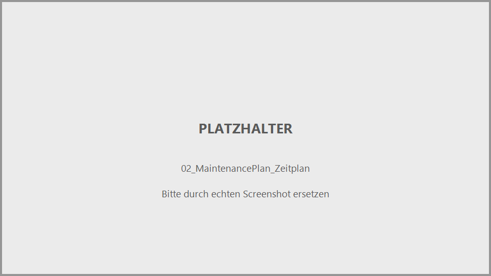
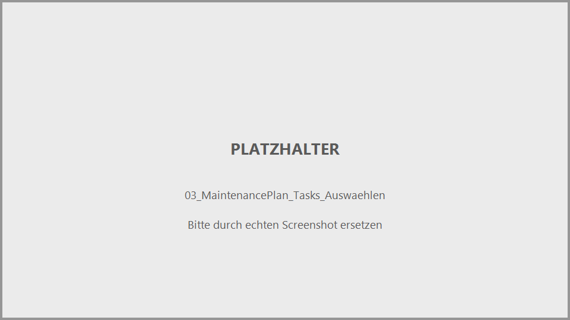
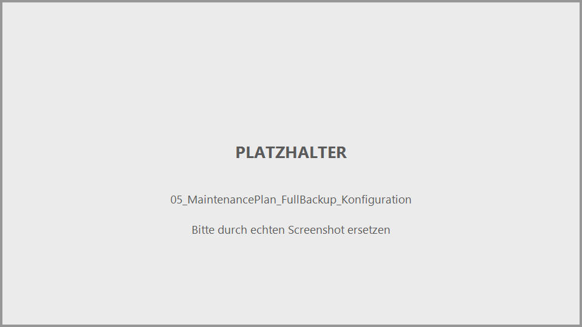
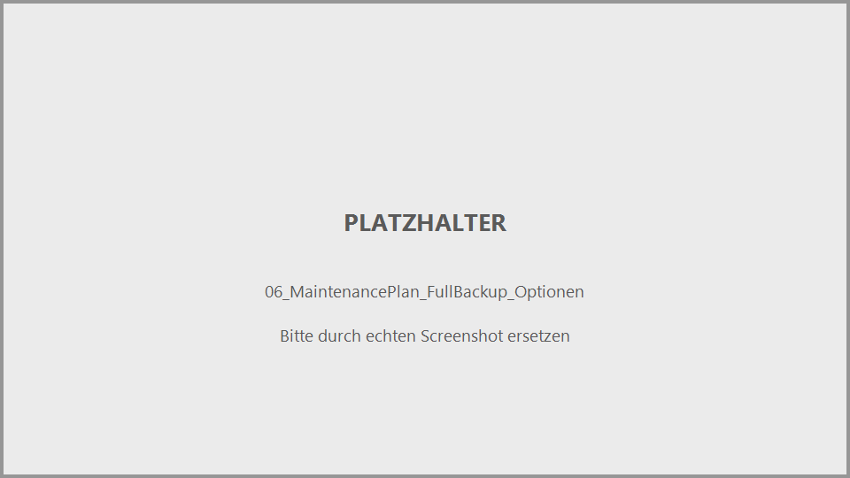
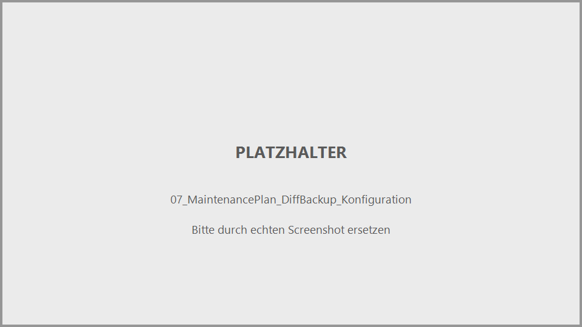
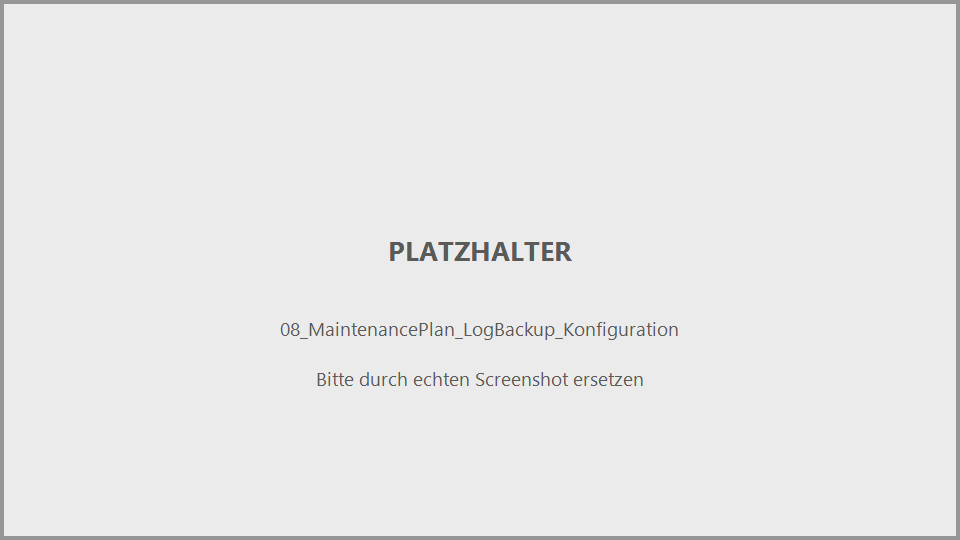
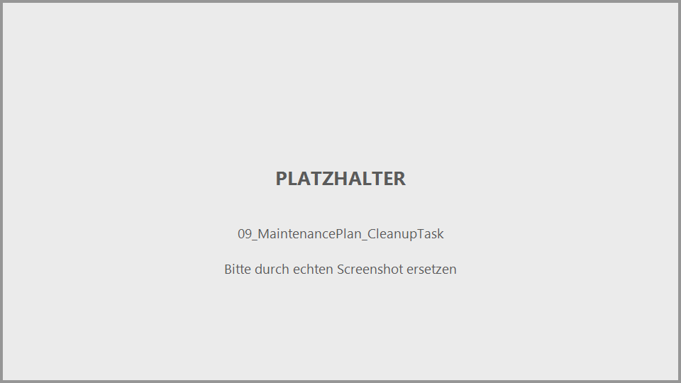
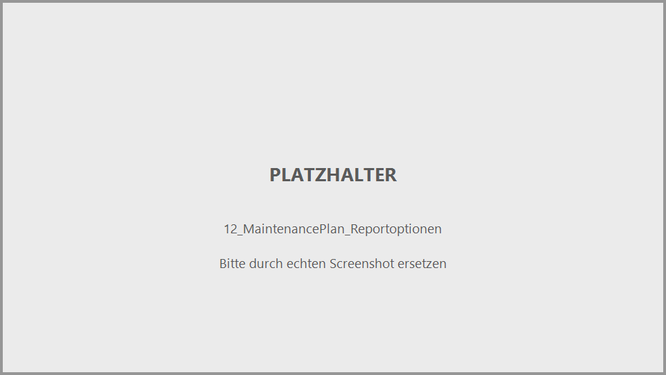
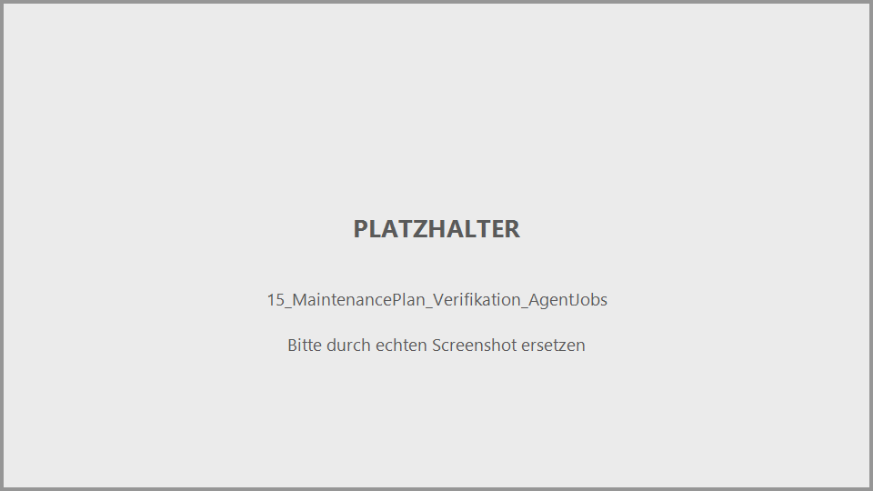
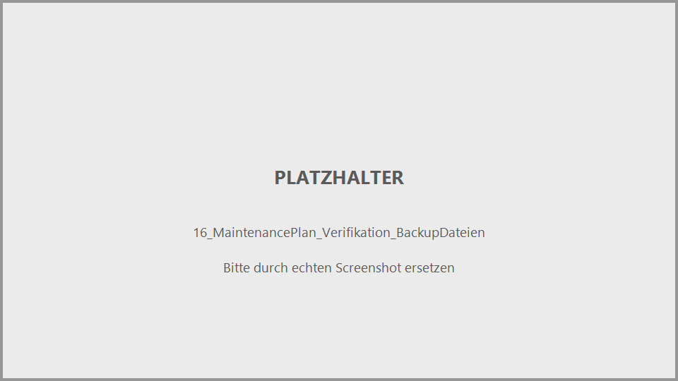

# SQL Server Backup per Maintenance Plan einrichten: Schritt-für-Schritt-Anleitung

Diese Anleitung beschreibt **ausführlich und mit Screenshot-Platzhaltern**, wie ein vollständiger Backup-Wartungsplan (Full-, Differential- und Transaction-Log-Backup, inklusive automatischer Bereinigung alter Backups) über den **SSMS Maintenance Plan Wizard** bzw. den **Maintenance Plan Designer** eingerichtet wird. Sie fasst die Inhalte aus vier recherchierten Quellen zusammen (siehe [Abschnitt 8](#8--quellen)) zu einem durchgängigen Ablauf.

Für die konzeptionelle Einordnung (Vor-/Nachteile von Maintenance Plans gegenüber T-SQL-Agent-Jobs, Ola Hallengren, PowerShell) siehe [71_BackupRestore_Strategies.md](71_BackupRestore_Strategies.md) Abschnitt 2.9.

> **Hinweis zu den Bildern:** Alle Screenshots in diesem Dokument sind aktuell **Platzhalter** (grauer Rahmen mit Beschriftung). Die Dateien liegen unter [`assets/maintenance-plan-backup/`](assets/maintenance-plan-backup/) und sind fortlaufend nummeriert (`01_...png` bis `16_...png`). Um die echten Screenshots einzufügen, einfach die jeweilige Platzhalterdatei **unter exakt demselben Dateinamen** durch den echten Screenshot ersetzen — die Markdown-Datei selbst muss dafür nicht verändert werden.

**Inhalt:** [1 Voraussetzungen](#1--voraussetzungen) · [2 Plan anlegen und Zeitplan festlegen](#2--plan-anlegen-und-zeitplan-festlegen) · [3 Tasks auswählen und anordnen](#3--tasks-auswählen-und-anordnen) · [4 Full-Backup-Task konfigurieren](#4--full-backup-task-konfigurieren) · [5 Differential- und Log-Backup-Tasks konfigurieren](#5--differential--und-log-backup-tasks-konfigurieren) · [6 Aufräumen: Cleanup- und History-Cleanup-Task](#6--aufräumen-cleanup--und-history-cleanup-task) · [7 Fertigstellen, ausführen und verifizieren](#7--fertigstellen-ausführen-und-verifizieren) · [8 Quellen](#8--quellen)

---

## 1 | Voraussetzungen

- Der Benutzer muss Mitglied der festen Serverrolle **`sysadmin`** sein — ohne diese Berechtigung ist der Knoten *Maintenance Plans* im Object Explorer gar nicht sichtbar.
- Die Serverkonfigurationsoption **`Agent XPs`** muss aktiviert sein (Maintenance Plans laufen als SQL Server Agent Jobs im Hintergrund).
- Der **SQL Server Agent**-Dienst sollte laufen, damit die erzeugten Zeitpläne tatsächlich automatisch ausgeführt werden.
- Für E-Mail-Berichte (optional, siehe [Abschnitt 7](#7--fertigstellen-ausführen-und-verifizieren)) muss **Database Mail** vorab konfiguriert sein.
- Ein Zielverzeichnis für die Backup-Dateien, das vom SQL-Server-Dienstkonto beschreibbar ist (lokal oder Netzwerkfreigabe).

---

## 2 | Plan anlegen und Zeitplan festlegen

### Schritt 1: Maintenance Plan Wizard starten

*Abbildung 1: Object Explorer → Management → Rechtsklick auf "Maintenance Plans" → Kontextmenü mit den Optionen "Maintenance Plan Wizard" und "New Maintenance Plan..."*

Im Object Explorer den Server erweitern, dann den Ordner **Management** erweitern. Rechtsklick auf **Maintenance Plans** öffnet zwei mögliche Wege:

- **Maintenance Plan Wizard** — geführter Assistent, der Schritt für Schritt durch alle Optionen führt (empfohlen für den Einstieg, in dieser Anleitung der beschriebene Weg).
- **New Maintenance Plan...** — öffnet direkt den grafischen **Designer**, in dem Tasks per Drag & Drop aus der Toolbox platziert und über Pfeile verbunden werden (empfohlen, wenn man bereits Erfahrung hat oder mehrere Tasks mit bedingter Reihenfolge — z. B. "nur bei Erfolg des vorherigen Tasks" — verknüpfen möchte, siehe [Abschnitt 6](#6--aufräumen-cleanup--und-history-cleanup-task)).

Diese Anleitung beschreibt primär den **Wizard**-Weg, da er alle notwendigen Optionen in klarer Reihenfolge abfragt; die Task-spezifischen Dialoge sind im Designer inhaltlich identisch.

Nach Auswahl von **Maintenance Plan Wizard** erscheint eine Begrüßungsseite — mit **Next** bestätigen.

### Schritt 2: Plan-Eigenschaften und Zeitplan festlegen

*Abbildung 2: Seite "Select Plan Properties" mit Namensfeld, Beschreibung, Auswahl zwischen Einzelzeitplan und Task-eigenen Zeitplänen, sowie dem Dialog "New Job Schedule" für die konkrete Terminierung.*

Auf der Seite **Select Plan Properties**:

| Feld/Option | Bedeutung |
|---|---|
| **Name** | Name des Wartungsplans, z. B. `BI_DQ_BackupPlan`. |
| **Description** | Freitext-Beschreibung. |
| **Run as** | Agent-Ausführungskonto, unter dem der Plan später läuft. |
| **Separate schedules for each task** | Jeder gewählte Task (Full-Backup, Diff-Backup, Log-Backup, Cleanup, ...) bekommt einen **eigenen** Zeitplan — sinnvoll, da Full-, Diff- und Log-Backups typischerweise unterschiedlich oft laufen sollen (siehe [Abschnitt 5](#5--differential--und-log-backup-tasks-konfigurieren)). |
| **Single schedule for the entire plan or no schedule** | Alle Tasks laufen nach demselben, einzigen Zeitplan. |

Für die in dieser Anleitung gezeigte Kombination aus Full-, Differential- und Log-Backup mit unterschiedlicher Häufigkeit ist **"Separate schedules for each task"** die richtige Wahl.

Der Zeitplan selbst wird über den Button **Change** im Dialog **New Job Schedule** definiert:

- **Name** des Zeitplans
- **Schedule type**: meist **Recurring** (wiederkehrend)
- **Frequency**: **Occurs** = Daily/Weekly/Monthly, dazu je nach Wahl weitere Felder (z. B. bei Weekly: Wochentage per Checkbox)
- **Daily frequency**: entweder **Occurs once at** (fester Zeitpunkt, z. B. 01:00:00) oder **Occurs every** (Intervall, z. B. alle 15 Minuten — relevant für Log-Backups, siehe [Abschnitt 5](#5--differential--und-log-backup-tasks-konfigurieren))
- **Duration**: **Start date**/**End date** oder **No end date**

Mit **OK** bestätigen, dann **Next**.

---

## 3 | Tasks auswählen und anordnen

### Schritt 3: Maintenance Tasks auswählen

*Abbildung 3: Seite "Select Maintenance Tasks" mit der vollständigen Checkbox-Liste aller verfügbaren Task-Typen.*

Auf der Seite **Select Maintenance Tasks** wird per Checkbox ausgewählt, welche Vorgänge der Plan ausführen soll. Für einen vollständigen Backup-Plan mit Aufräumfunktion werden folgende Tasks angehakt:

- **Back Up Database (Full)**
- **Back Up Database (Differential)**
- **Back Up Database (Transaction Log)**
- **Maintenance Cleanup Task**
- **History Cleanup Task**

Weitere verfügbare, hier nicht benötigte Tasks: Check Database Integrity, Shrink Database, Reorganize Index, Rebuild Index, Update Statistics, Execute SQL Server Agent Job.

### Schritt 4: Reihenfolge der Tasks festlegen

*Abbildung 4: Seite "Select Maintenance Task Order" mit der Liste der gewählten Tasks und den Buttons "Move Up..."/"Move Down...".*

Auf der Seite **Select Maintenance Task Order** wird die Ausführungsreihenfolge der gewählten Tasks per **Move Up...**/**Move Down...** festgelegt. Empfohlene Reihenfolge:

1. Back Up Database (Full)
2. Back Up Database (Differential)
3. Back Up Database (Transaction Log)
4. Maintenance Cleanup Task
5. History Cleanup Task

> **Hinweis:** Wurde in Schritt 2 "Separate schedules for each task" gewählt, ist diese Seite nicht editierbar — die tatsächliche Reihenfolge ergibt sich dann aus den individuellen Zeitplänen der einzelnen Tasks, nicht aus einer festen Sequenz.

Mit **Next** geht es weiter zu den Detailseiten der einzelnen Tasks — SQL Server zeigt für jeden gewählten Task-Typ eine eigene Konfigurationsseite in der oben festgelegten Reihenfolge.

---

## 4 | Full-Backup-Task konfigurieren

### Schritt 5: Datenbanken und Ziel festlegen

*Abbildung 5: Seite "Define Back Up Database (Full) Task" mit Datenbankauswahl, Backup-Komponente und Zielpfad-Konfiguration.*

Auf der Seite **Define Back Up Database (Full) Task**:

| Feld/Option | Bedeutung |
|---|---|
| **Databases** (Dropdown) | `All databases` / `System databases` / `All user databases` / `These databases` (mit individueller Checkliste). |
| **Backup component** | Radiobutton **Database** (ganze Datenbank) vs. **File and filegroups** (nur bei Auswahl einer einzelnen Datenbank verfügbar). |
| **Backup set will expire** | Checkbox + Radiobutton **After** (Anzahl Tage) oder **On** (festes Datum) — bei einem `URL`-Ziel (Azure Blob) deaktiviert. |
| **Back up to** | Radiobutton **Disk** / **Tape** / **URL**. |
| **Back up database(s) across one or more files** | Button **Add** öffnet den Dialog **Select Backup Destination** zur Pfadauswahl; **Remove**/**Contents** zur Verwaltung bestehender Ziele. |
| **If backup files exist** | Dropdown **Append** (anhängen) vs. **Overwrite** (überschreiben). |
| **Create a backup file for every database** | Erzeugt pro Datenbank eine eigene Backup-Datei statt eines gemeinsamen Sets. |
| **Create a sub-directory for each database** | Legt je Datenbank einen eigenen Unterordner an — **Achtung:** Der Unterordner erbt die Berechtigungen des übergeordneten Verzeichnisses. |
| **Folder** | Zielpfad, z. B. `\\Server\Backups\Full Backup` (lokal oder UNC). |
| **Backup file extension** | Standard `bak`. |

Beispielkonfiguration (angelehnt an die recherchierten Praxis-Tutorials): `Databases = All databases`, Zielordner `\\192.168.0.103\Backups\Full Backup`, Checkbox `Create a sub-directory for each database` aktiviert.

### Schritt 6: Erweiterte Optionen (Kompression, Verschlüsselung, Verifikation)

*Abbildung 6: Options-Bereich mit Kompression, Verifikation, Verschlüsselung sowie Block-/Transfergrößen.*

Weitere Optionen auf derselben bzw. einer zweiten Registerkarte:

| Option | Bedeutung |
|---|---|
| **Verify backup integrity** | Führt nach dem Backup ein `RESTORE VERIFYONLY` aus, um die Lesbarkeit zu prüfen (siehe [71_BackupRestore_Strategies.md](71_BackupRestore_Strategies.md) Abschnitt 2.8). |
| **Perform checksum** | Entspricht `WITH CHECKSUM` (siehe Abschnitt 2.4 im Hauptdokument). |
| **Continue on error** | Entspricht `WITH CONTINUE_AFTER_ERROR`. |
| **Backup Encryption** | Checkbox **Encrypt backup**, Dropdown-Auswahl des Algorithmus (AES 128/192/256, Triple DES) sowie Auswahl von Zertifikat/Asymmetric Key — bei **Append** deaktiviert, da eine verschlüsselte Datei nicht an ein unverschlüsseltes bestehendes Set angehängt werden kann. |
| **Block size** / **Max transfer size** | Entsprechen `WITH BLOCKSIZE`/`WITH MAXTRANSFERSIZE` (siehe Abschnitt 2.5 im Hauptdokument). |
| **Set backup compression** | Dropdown: `Use the default server setting` / `Compress backup` / `Do not compress backup`. |

Beispielkonfiguration: `Set backup compression = Compress backup`, `Backup set will expire = After 10 days`, `Backup encryption` aktiviert mit AES128 und einem vorhandenen Zertifikat, `Verify backup integrity` aktiviert.

Der Zeitplan für diesen Task wird über das Kalender-Symbol auf derselben Seite gesetzt — Beispiel: **Weekly**, Sonntag, 01:00:00 Uhr.

---

## 5 | Differential- und Log-Backup-Tasks konfigurieren

### Schritt 7: Differential-Backup-Task

*Abbildung 7: Seite "Define Back Up Database (Differential) Task" — identischer Aufbau wie beim Full-Backup, mit eigenem Zielordner und Zeitplan.*

Die Seite **Define Back Up Database (Differential) Task** ist identisch aufgebaut wie beim Full-Backup (siehe [Abschnitt 4](#4--full-backup-task-konfigurieren)), mit zwei praktischen Unterschieden:

- **Eigener Zielordner** empfohlen, z. B. `\\Server\Backups\Differential Backup` — hält Full- und Differential-Backups sauber getrennt.
- **Häufigerer Zeitplan**, da Differential-Backups typischerweise öfter laufen als Full-Backups. Beispiel: **Weekly**, Montag bis Samstag, 02:00:00 Uhr (an den Tagen ohne Full-Backup).

### Schritt 8: Transaction-Log-Backup-Task

*Abbildung 8: Seite "Define Back Up Database (Transaction Log) Task" mit kurzem Zeitintervall für häufige Log-Sicherungen.*

Die Seite **Define Back Up Database (Transaction Log) Task** ist ebenfalls identisch aufgebaut, mit folgenden Besonderheiten:

- **Backup file extension** wird üblicherweise auf `trn` gesetzt (statt `bak`), um Log-Backups auf einen Blick von Full-/Differential-Backups zu unterscheiden.
- **Eigener Zielordner**, z. B. `\\Server\Backups\Log Backup`.
- **Sehr viel häufigerer Zeitplan**: Beispiel **Daily**, `Occurs every 15 minute(s)` — Log-Backups sollten so oft laufen, wie es das gewünschte RPO (siehe [71_BackupRestore_Strategies.md](71_BackupRestore_Strategies.md) Abschnitt 2.1) erfordert.

> **Wichtig:** Ein Transaction-Log-Backup-Task ist nur sinnvoll konfigurierbar, wenn die Zieldatenbank im Recovery Model **FULL** oder **BULK_LOGGED** läuft — im **SIMPLE**-Modell existiert keine fortlaufende Log-Kette, die gesichert werden könnte (siehe [71_BackupRestore_Strategies.md](71_BackupRestore_Strategies.md) Abschnitt 2.3).

---

## 6 | Aufräumen: Cleanup- und History-Cleanup-Task

### Schritt 9: Maintenance Cleanup Task (alte Backup-Dateien löschen)

*Abbildung 9: Konfigurationsdialog des Maintenance Cleanup Tasks mit Dateityp, Ordnerpfad und Altersgrenze.*

Der **Maintenance Cleanup Task** löscht automatisch alte Backup-Dateien, damit der Zieldatenträger nicht unbegrenzt vollläuft:

| Feld/Option | Bedeutung |
|---|---|
| **Delete files of the following type** | `Backup files` oder `Maintenance Plan text reports`. |
| **Delete the specific file** vs. **Search folder and delete files based on an extension** | Einzeldatei vs. ordnerweite Suche nach Dateiendung. |
| **Folder** | Zu durchsuchender Ordner, z. B. `E:\Backup`. |
| **File extension** | z. B. `bak` (ohne führenden Punkt). |
| **Include first-level subfolders** | Bezieht Unterordner der ersten Ebene mit ein — relevant, wenn zuvor `Create a sub-directory for each database` aktiviert wurde. |
| **File age** | Löscht Dateien, die älter sind als der angegebene Wert, in der gewählten Einheit (`Hours`/`Days`/`Weeks`/`Months`/`Years`). Beispiel: `3 Days`. |

**Wichtig:** Für jeden Backup-Typ (Full/Diff/Log) empfiehlt sich ein **eigener** Cleanup-Task mit passendem Ordner und passender Dateiendung (`bak` vs. `trn`), damit z. B. Log-Backups nicht zu früh gelöscht werden, obwohl das letzte Full-Backup noch darauf angewiesen ist.

### Schritt 10: History Cleanup Task (msdb-Historie bereinigen)

*Abbildung 10: Konfigurationsdialog des History Cleanup Tasks mit den drei Historie-Kategorien und der Altersgrenze.*

Der **History Cleanup Task** verhindert, dass `msdb` durch die Protokollierung selbst unbegrenzt wächst:

- Checkbox **Backup and restore history**
- Checkbox **SQL Server Agent job history**
- Checkbox **Maintenance plan history**
- **Remove historical data older than**: Wert + Einheit, z. B. `3 day(s)` (in produktiven Umgebungen sind oft 2–4 Wochen üblich, damit ausreichend Historie für die Backup-Auswertung nach [LastBackupOverview.sql](SQLScripts/LastBackupOverview.md) erhalten bleibt).

### Schritt 11: Tasks im Designer per Erfolgspfeil verbinden

*Abbildung 11: Designer-Ansicht mit den grünen Erfolgspfeilen (Precedence Constraints), die Backup-Task, Cleanup-Task und History-Cleanup-Task in der richtigen Reihenfolge verbinden.*

**Nur relevant, wenn der Plan über "New Maintenance Plan..." (Designer) statt über den Wizard aufgebaut wird:** Im Designer werden die Tasks als Kästchen dargestellt und müssen manuell durch **Precedence Constraints** (Pfeile) verbunden werden, damit sie in der gewünschten Reihenfolge und nur bei Erfolg des Vorgängers laufen:

1. Backup-Task anklicken — am unteren Rand erscheint ein grüner Pfeil-Ansatzpunkt.
2. Pfeil bei gedrückter Maustaste zum Cleanup-Task ziehen.
3. Der Pfeil ist standardmäßig **grün** = "On Success" (Folge-Task läuft nur, wenn der vorherige erfolgreich war). Per Rechtsklick auf den Pfeil lässt sich das auf "On Failure" (rot) oder "On Completion" (blau) ändern.
4. Ebenso den Cleanup-Task mit dem History-Cleanup-Task verbinden.

Nutzt man stattdessen den **Wizard**, übernimmt dieser die Verkettung automatisch entsprechend der in [Schritt 4](#schritt-4-reihenfolge-der-tasks-festlegen) festgelegten Reihenfolge bzw. den individuellen Zeitplänen.

---

## 7 | Fertigstellen, ausführen und verifizieren

### Schritt 12: Berichtsoptionen festlegen

*Abbildung 12: Seite "Select Report Options" mit Textdatei-Export und optionalem E-Mail-Versand.*

Auf der Seite **Select Report Options**:

- Checkbox **Write a report to a text file** + **Folder location** (Speicherort für den Textbericht nach jedem Lauf).
- Checkbox **E-mail report** (setzt konfigurierte Database Mail voraus) + Dropdown **Agent operator** (Empfänger) + Dropdown **Mail profile**.

### Schritt 13: Wizard abschließen

*Abbildung 13: Seite "Complete the Wizard" mit der Zusammenfassung aller gewählten Optionen vor dem endgültigen Erstellen.*

Die Seite **Complete the Wizard** zeigt eine Zusammenfassung aller getroffenen Einstellungen. Nach Prüfung mit **Finish** bestätigen.

### Schritt 14: Ausführungsergebnis prüfen

*Abbildung 14: Fortschrittsfenster "Maintenance Wizard Progress" mit den Spalten Action, Status und Message für jeden erstellten Bestandteil.*

Das Fenster **Maintenance Wizard Progress** zeigt für jeden erstellten Bestandteil (Plan, Jobs, Zeitpläne) eine Zeile mit **Action**, **Status** (`Success`/`Failure`) und **Message**. Über die Buttons lässt sich der Bericht **als Datei speichern**, **in die Zwischenablage kopieren** oder **per E-Mail versenden**.

### Schritt 15: Verifikation über SQL Server Agent

*Abbildung 15: Object Explorer unter SQL Server Agent → Jobs mit den automatisch erzeugten Job-Einträgen für den Maintenance Plan.*

Im Object Explorer unter **SQL Server Agent → Jobs** erscheinen die automatisch angelegten Job(s) für den Plan (bei "Separate schedules for each task" ggf. mehrere Jobs, einer je Task-Gruppe). Ein Job lässt sich zur sofortigen Kontrolle per Rechtsklick → **Start Job at Step...** manuell auslösen, ohne auf den Zeitplan zu warten.

### Schritt 16: Verifikation der erzeugten Backup-Dateien

*Abbildung 16: Windows-Explorer-Ansicht des Zielordners mit den erzeugten .bak-/.trn-Dateien, ggf. in datenbankspezifischen Unterordnern.*

Abschließend im Zielordner (bzw. den datenbankspezifischen Unterordnern, falls `Create a sub-directory for each database` aktiviert wurde) prüfen, ob die erwarteten `.bak`-/`.trn`-Dateien mit plausiblem Zeitstempel und plausibler Dateigröße vorliegen. Für eine dauerhafte, automatisierte Kontrolle eignet sich zusätzlich das eigene Skript [SQLScripts/LastBackupOverview.sql](SQLScripts/LastBackupOverview.sql) (Doku: [SQLScripts/LastBackupOverview.md](SQLScripts/LastBackupOverview.md)), das Recovery Model, letztes Full-Backup und letztes Backup jeglichen Typs je Datenbank aus `msdb.dbo.backupset` gegenüberstellt.

---

## 8 | Quellen

Diese Anleitung fasst die Inhalte folgender vier Quellen zusammen:

- 📘 Microsoft Learn: [Use the Maintenance Plan Wizard](https://learn.microsoft.com/en-us/sql/relational-databases/maintenance-plans/use-the-maintenance-plan-wizard) — offizielle, vollständig durchnummerierte Referenz aller Wizard-Seiten und Optionsfelder.
- 📘 Microsoft Learn: [Schedule a Database Backup Operation Using SSMS](https://learn.microsoft.com/en-us/sql/relational-databases/backup-restore/schedule-database-backup-operation-ssms) — ergänzender, alternativer Weg über "Script Action to Job".
- 📝 SQLShack: [Automate SQL Database Backups Using Maintenance Plans](https://www.sqlshack.com/automate-sql-database-backups-using-maintenance-plans/) — Praxis-Tutorial mit konkreten Beispielwerten für Full-/Differential-/Log-Backup-Pläne.
- 📝 SQLServerCentral: [Backup and Housekeeping with Maintenance Plans](https://www.sqlservercentral.com/articles/backup-and-housekeeping-with-maintenance-plans) — Community-Tutorial mit Fokus auf Cleanup- und History-Cleanup-Task sowie Precedence Constraints im Designer.

Siehe auch [71_BackupRestore_Strategies.md](71_BackupRestore_Strategies.md) Abschnitt 2.9 für die Einordnung von Maintenance Plans gegenüber anderen Automatisierungswegen (T-SQL-Agent-Jobs, Ola Hallengren, PowerShell/dbatools, Python).
