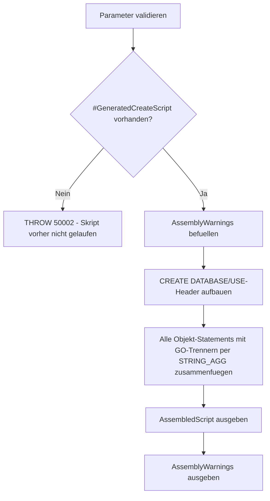

# AssembleExecutableCreateScript.sql

Dieses Skript setzt auf [SuspectDatabaseScriptSchemaOnly.sql](SuspectDatabaseScriptSchemaOnly.sql) auf und fuegt dessen Ergebnis (`#GeneratedCreateScript`, eine Zeile pro Objekt) zu **einem einzigen, zusammenhaengenden, direkt ausfuehrbaren T-SQL-Skript** zusammen. Die reine Tabellenausgabe aus `SuspectDatabaseScriptSchemaOnly.sql` ist **nicht** ohne Weiteres ausfuehrbar — es fehlen ein `CREATE DATABASE`/`USE`-Header und `GO`-Batch-Trenner zwischen den Statements.

## Uebersicht

<!-- SQLDOC:SUMMARY_TABLE:BEGIN -->
| Feld | Wert |
|---|---|
| Script | [AssembleExecutableCreateScript.sql](AssembleExecutableCreateScript.sql) |
| Version | `1.0` |
| Typ | `diagnostic` |
| Kapitel | `71_BackupRestore_Strategies` |
| Sicherheit | `read-only` |
| Zweck | Fuegt die Objekt-CREATE-Statements aus SuspectDatabaseScriptSchemaOnly.sql zu einem direkt ausfuehrbaren Gesamtskript zusammen. |
<!-- SQLDOC:SUMMARY_TABLE:END -->

## Einordnung

**Warum die Ausgabe von [SuspectDatabaseScriptSchemaOnly.sql](SuspectDatabaseScriptSchemaOnly.sql) allein nicht ausfuehrbar ist:**

1. **Kein `CREATE DATABASE`/`USE`-Kontext.** `GeneratedCreateScript` enthaelt nur Objekt-Statements (Schemas, Tabellen, ...). Ohne einen vorangestellten `CREATE DATABASE`/`USE`-Befehl laufen alle nachfolgenden `CREATE TABLE`/`CREATE VIEW` gegen die aktuell aktive Datenbank der Session, nicht gegen eine neue Zieldatenbank.
2. **Fehlende `GO`-Batch-Trenner.** `sys.sql_modules.definition` liefert bereits vollstaendige `CREATE VIEW`/`CREATE PROCEDURE`/`CREATE FUNCTION`/`CREATE TRIGGER`-Statements. SQL Server verlangt, dass diese vier Befehle **als erstes Statement in ihrem Batch** stehen — ohne `GO` zwischen zwei solchen Definitionen bricht die Ausfuehrung mit einem Syntaxfehler ab.

Dieses Skript behebt beide Punkte: Es stellt einen `CREATE DATABASE`/`USE`-Header voran und fuegt nach **jedem** Objekt-Statement ein `GO` ein, sodass das Ergebnis als eigenstaendige `.sql`-Datei gespeichert und direkt ausgefuehrt werden kann.

**Muss in derselben Session laufen:** Da `#GeneratedCreateScript` eine `#temp`-Tabelle ist, muss dieses Skript **direkt nach** [SuspectDatabaseScriptSchemaOnly.sql](SuspectDatabaseScriptSchemaOnly.sql) im selben SSMS-Query-Fenster (derselben Verbindung) ausgefuehrt werden.

## Annahmen

- Das Skript garantiert nur die **technisch zwingende** Batch-Trennung, **nicht** die logisch korrekte Reihenfolge bei verschachtelten Abhaengigkeiten (z.B. eine View, die eine andere View referenziert, die erst spaeter im Skript erzeugt wird). In diesem Fall schlaegt die Ausfuehrung mit einem "Objekt nicht gefunden"-Fehler fehl, und die betroffene Definition muss manuell nach hinten verschoben werden.
- Berechtigungen (`GRANT`/`DENY`), Trigger-Aktivierungsstatus, Extended Properties, Partitionierung und Volltextindizes werden **nicht** gescriptet — diese liegen außerhalb dessen, was `SuspectDatabaseScriptSchemaOnly.sql` erfasst.
- Das Ergebnis ist eine **einzelne `NVARCHAR(MAX)`-Zelle**. In SSMS unbedingt **Ergebnisse als Text** (nicht als Raster) anzeigen lassen (`Strg+T` vor der Ausfuehrung), da das Grid Zeilenumbrueche und Anfuehrungszeichen sonst beschaedigen kann.
- Bei sehr großen Schemata kann die Gesamtlaenge an interne Anzeige-/Kopierlimits von SSMS stoßen — in diesem Fall das Ergebnis z.B. per `SUBSTRING` splitten oder direkt per `sqlcmd -Q`/`bcp` in eine Datei exportieren, statt über das SSMS-Ergebnisraster zu kopieren.

## Anwendungsfall

Nach `SuspectDatabaseScriptSchemaOnly.sql` liegt das gerettete Schema nur als Tabelle mit Einzelzeilen vor. Um daraus tatsaechlich eine neue, leere Datenbank aufzubauen (z.B. nach [DropDatabaseCompletely.sql](DropDatabaseCompletely.sql)), soll ein fertiges `.sql`-Skript entstehen, das ohne manuelles Nacharbeiten direkt ausgefuehrt werden kann — z.B. abgelegt unter `U:\DataAnalytics\_CreateDB_Scripts\BI_DQ_20260813.sql`.

## Parameter

<!-- SQLDOC:PARAMETERS_TABLE:BEGIN -->
| Parameter | SQL-Typ | Pflicht | Beschreibung |
|---|---|---|---|
| `@NewDatabaseName` | `SYSNAME` | Ja | Name, unter dem die neue, leere Datenbank angelegt werden soll (kann identisch zum urspruenglichen Namen sein). |
| `@IncludeCreateDatabaseStatement` | `BIT` | Nein | `1` (Default) = fuegt `CREATE DATABASE` + `USE` am Anfang ein; `0` = nur `USE`, falls die Datenbank bereits existiert. |
<!-- SQLDOC:PARAMETERS_TABLE:END -->

## Abhaengigkeiten

<!-- SQLDOC:DEPENDENCIES_LIST:BEGIN -->
- `#GeneratedCreateScript` (aus [SuspectDatabaseScriptSchemaOnly.sql](SuspectDatabaseScriptSchemaOnly.sql), muss in derselben Session bereits befuellt sein)
- `STRING_AGG`
<!-- SQLDOC:DEPENDENCIES_LIST:END -->

## Hinweise

- `AssembledScript` enthaelt das komplette Skript als eine einzige Textzelle: `CREATE DATABASE`/`USE`-Header, gefolgt von jedem Objekt-Statement mit vorangestelltem Kommentar (Objekttyp + Name) und nachfolgendem `GO`.
- Die Sortierung folgt derselben Kategorien-Reihenfolge wie in `SuspectDatabaseScriptSchemaOnly.sql` (Schemas → Tabellen → Key-/Default-/Check-Constraints → Foreign Keys → Indizes → Sequences → Synonyme → SQL-Module).
- `AssemblyWarnings` listet die bekannten Grenzen der automatischen Zusammenstellung, insbesondere die fehlende Abhaengigkeitsanalyse zwischen Views/Procedures/Functions untereinander.
- Vor der Ausfuehrung in Produktion **immer zuerst in einer Testumgebung validieren**.
- Falls `#GeneratedCreateScript` nicht existiert (Skript wurde nicht direkt nach `SuspectDatabaseScriptSchemaOnly.sql` in derselben Session ausgefuehrt), bricht das Skript mit einer klaren Fehlermeldung ab (`THROW 50002`).

## Versionshistorie

<!-- SQLDOC:VERSION_HISTORY_TABLE:BEGIN -->
| Version | Datum | User | Beschreibung |
|---|---|---|---|
| `1.0` | `2026-08-13` | `ER` | Erstversion: fuegt #GeneratedCreateScript zu einem einzigen ausfuehrbaren Skript mit CREATE DATABASE/USE-Header und GO-Trennern zusammen |
<!-- SQLDOC:VERSION_HISTORY_TABLE:END -->

## Ablauf

<!-- SQLDOC:MERMAID:BEGIN -->

<!-- SQLDOC:MERMAID:END -->

## SQL-Code

<!-- SQLDOC:SQL_CODE:BEGIN -->
```sql
/*
BEGIN:SQL-HEADER v1
---
sql_header: v1
script_name: "AssembleExecutableCreateScript.sql"
script_version: "1.0"
script_type: "diagnostic"
chapter: "71_BackupRestore_Strategies"
purpose: >
  Setzt auf SuspectDatabaseScriptSchemaOnly.sql auf und fuegt dessen
  Ergebnis (#GeneratedCreateScript, eine Zeile pro Objekt) zu EINEM
  zusammenhaengenden, direkt ausfuehrbaren T-SQL-Skript zusammen. Die reine
  Tabellenausgabe aus SuspectDatabaseScriptSchemaOnly.sql ist NICHT ohne
  Weiteres ausfuehrbar: Es fehlen ein CREATE DATABASE/USE-Header und
  GO-Batch-Trenner zwischen den Statements - insbesondere CREATE VIEW,
  CREATE PROCEDURE, CREATE FUNCTION und CREATE TRIGGER erfordern laut
  SQL-Server-Regel, das erste Statement in ihrem Batch zu sein. Dieses
  Skript muss in DERSELBEN Session direkt NACH
  SuspectDatabaseScriptSchemaOnly.sql ausgefuehrt werden, da es auf die dort
  angelegte #GeneratedCreateScript-Tabelle zugreift.

parameters:
  - name: "@NewDatabaseName"
    sql_type: "SYSNAME"
    direction: "IN"
    required: true
    description: "Name, unter dem die neue, leere Datenbank angelegt werden soll (kann identisch zum urspruenglichen Namen sein, z.B. nach vorherigem DropDatabaseCompletely.sql)"
  - name: "@IncludeCreateDatabaseStatement"
    sql_type: "BIT"
    direction: "IN"
    required: false
    description: "1 (Default) = fuegt CREATE DATABASE + USE am Anfang des generierten Skripts ein; 0 = nur USE, falls die Datenbank bereits existiert"

result_sets:
  - name: "AssembledScript"
    description: "EINE Zeile mit dem kompletten, zusammenhaengenden T-SQL-Skript inkl. CREATE DATABASE/USE-Header und GO-Trennern - als NVARCHAR(MAX), zum Kopieren in eine .sql-Datei (z.B. per 'Ergebnisse als Text', nicht als Raster, um Zeilenumbrueche nicht zu beschaedigen)"
  - name: "AssemblyWarnings"
    description: "Hinweise auf bekannte Grenzen der automatischen Zusammenstellung (z.B. keine Abhaengigkeitsanalyse zwischen verschachtelten Views)"

dependencies:
  - "#GeneratedCreateScript (aus SuspectDatabaseScriptSchemaOnly.sql, muss in derselben Session bereits befuellt sein)"
  - "STRING_AGG"

safety:
  level: "read-only"
  writes_data: false

documentation:
  markdown_file: "T-SQL/71_BackupRestore_Strategies/SQLScripts/AssembleExecutableCreateScript.md"
  sync_blocks:
    - "SUMMARY_TABLE"
    - "PARAMETERS_TABLE"
    - "DEPENDENCIES_LIST"
    - "VERSION_HISTORY_TABLE"
    - "SQL_CODE"
  mermaid:
    mode: "ai-agent-from-sql"
    source: "script-body"

main_responsible:
  name: "Erhard Rainer"
  initials: "ER"

version_history:
  - version: "1.0"
    date: "2026-08-13"
    user: "ER"
    description: "Erstversion: fuegt #GeneratedCreateScript zu einem einzigen ausfuehrbaren Skript mit CREATE DATABASE/USE-Header und GO-Trennern zusammen"

notes:
  - "Dieses Skript ersetzt NICHT die Notwendigkeit einer manuellen Pruefung. Es garantiert nur die technisch zwingenden Mindestanforderungen (Batch-Trennung fuer CREATE VIEW/PROC/FUNCTION/TRIGGER), NICHT die logisch korrekte Reihenfolge bei verschachtelten Abhaengigkeiten (z.B. View A verwendet View B)."
  - "Muss in DERSELBEN SSMS-Session/Query-Fenster direkt nach SuspectDatabaseScriptSchemaOnly.sql ausgefuehrt werden, da #temp-Tabellen nur innerhalb derselben Session existieren."
  - "Das Ergebnis ist eine einzelne NVARCHAR(MAX)-Zelle. In SSMS: Ergebnisse als TEXT (nicht als Raster) anzeigen lassen (Strg+T vor der Ausfuehrung, oder Rechtsklick auf das Ergebnis > 'Ergebnisse speichern als'), damit Zeilenumbrueche und Anfuehrungszeichen nicht durch das Grid beschaedigt werden."
  - "Bei sehr grossen Schemata kann die Gesamtlaenge an interne Anzeige-/Kopierlimits von SSMS stossen; in diesem Fall AssembledScript in mehrere Teile splitten (z.B. per SUBSTRING) oder direkt per bcp/sqlcmd -Q in eine Datei exportieren."
---
END:SQL-HEADER v1
*/

SET NOCOUNT ON;

-- 1. Parameter vorbereiten
DECLARE @NewDatabaseName SYSNAME = N'BI_DQ';
DECLARE @IncludeCreateDatabaseStatement BIT = 1;

IF @NewDatabaseName IS NULL OR LTRIM(RTRIM(@NewDatabaseName)) = N''
BEGIN
    THROW 50000, '@NewDatabaseName darf nicht leer sein.', 1;
END;

IF @IncludeCreateDatabaseStatement IS NULL OR @IncludeCreateDatabaseStatement NOT IN (0, 1)
BEGIN
    THROW 50001, '@IncludeCreateDatabaseStatement muss 0 oder 1 sein.', 1;
END;

IF OBJECT_ID('tempdb..#GeneratedCreateScript') IS NULL
BEGIN
    THROW 50002, '#GeneratedCreateScript wurde nicht gefunden. Dieses Skript muss in derselben Session direkt NACH SuspectDatabaseScriptSchemaOnly.sql ausgefuehrt werden.', 1;
END;

-- 2. Hinweise auf bekannte Grenzen der Zusammenstellung
DROP TABLE IF EXISTS #AssemblyWarnings;
CREATE TABLE #AssemblyWarnings
(
    WarningOrder INT           NOT NULL,
    WarningText  NVARCHAR(600) NOT NULL
);

INSERT INTO #AssemblyWarnings (WarningOrder, WarningText)
VALUES
    (1, N'GO-Trenner werden nach JEDEM Statement gesetzt - das erfuellt die SQL-Server-Pflicht, dass CREATE VIEW/PROCEDURE/FUNCTION/TRIGGER als erstes Statement im Batch stehen muessen.'),
    (2, N'Die Reihenfolge zwischen Views/Procedures/Functions/Trigger untereinander (alle als SQL_MODULE gruppiert) folgt KEINER Abhaengigkeitsanalyse. Referenziert View A View B, kann die generierte Reihenfolge falsch sein - in diesem Fall schlaegt die Ausfuehrung mit einem Objektnicht-gefunden-Fehler fehl und die betroffene Definition muss manuell nach hinten verschoben werden.'),
    (3, N'Berechtigungen (GRANT/DENY), Trigger-Aktivierungsstatus, Extended Properties, Partitionierung und Volltextindizes werden NICHT gescriptet.'),
    (4, N'Pruefe AssembledScript vor der Ausfuehrung in einer Testumgebung, nicht direkt in Produktion.');

-- 3. Das eigentliche, zusammenhaengende Skript zusammenbauen
DROP TABLE IF EXISTS #AssembledScript;
CREATE TABLE #AssembledScript
(
    ScriptText NVARCHAR(MAX) NOT NULL
);

DECLARE @Header NVARCHAR(MAX) = N'';

IF @IncludeCreateDatabaseStatement = 1
BEGIN
    SET @Header = N'IF DB_ID(''' + @NewDatabaseName + N''') IS NULL' + CHAR(13) + CHAR(10) +
                  N'BEGIN' + CHAR(13) + CHAR(10) +
                  N'    CREATE DATABASE ' + QUOTENAME(@NewDatabaseName) + N';' + CHAR(13) + CHAR(10) +
                  N'END;' + CHAR(13) + CHAR(10) +
                  N'GO' + CHAR(13) + CHAR(10) + CHAR(13) + CHAR(10);
END;

SET @Header = @Header +
    N'USE ' + QUOTENAME(@NewDatabaseName) + N';' + CHAR(13) + CHAR(10) +
    N'GO' + CHAR(13) + CHAR(10) + CHAR(13) + CHAR(10);

INSERT INTO #AssembledScript (ScriptText)
SELECT
    @Header +
    STRING_AGG(
        CAST(
            N'-- ' + gcs.ObjectType +
            CASE WHEN gcs.SchemaName IS NOT NULL THEN N': ' + gcs.SchemaName + N'.' ELSE N': ' END +
            ISNULL(gcs.ObjectName, N'') + CHAR(13) + CHAR(10) +
            gcs.CreateScript + CHAR(13) + CHAR(10) +
            N'GO'
        AS NVARCHAR(MAX)),
        CHAR(13) + CHAR(10) + CHAR(13) + CHAR(10)
    ) WITHIN GROUP (
        ORDER BY
            CASE gcs.ObjectType
                WHEN 'SCHEMA' THEN 1
                WHEN 'TABLE' THEN 2
                WHEN 'KEY_CONSTRAINT' THEN 3
                WHEN 'DEFAULT_CONSTRAINT' THEN 4
                WHEN 'CHECK_CONSTRAINT' THEN 5
                WHEN 'FOREIGN_KEY' THEN 6
                WHEN 'INDEX' THEN 7
                WHEN 'SEQUENCE' THEN 8
                WHEN 'SYNONYM' THEN 9
                ELSE 10
            END,
            gcs.ScriptOrder
    )
FROM #GeneratedCreateScript AS gcs;

-- 4. Ergebnisse ausgeben
SELECT
    a.ScriptText AS AssembledScript
FROM #AssembledScript AS a;

SELECT
    w.WarningOrder,
    w.WarningText
FROM #AssemblyWarnings AS w
ORDER BY
    w.WarningOrder;

PRINT N'Zusammenstellung abgeschlossen. AssembledScript in SSMS als TEXT (nicht Raster) anzeigen (Strg+T vor der Ausfuehrung) und als .sql-Datei speichern, z.B. U:\DataAnalytics\_CreateDB_Scripts\' + @NewDatabaseName + N'_' + CONVERT(NVARCHAR(8), GETDATE(), 112) + N'.sql. Vor Ausfuehrung in Produktion zuerst in einer Testumgebung validieren - siehe AssemblyWarnings fuer bekannte Grenzen.';
```
<!-- SQLDOC:SQL_CODE:END -->
