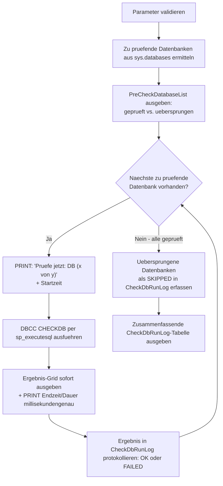

# CheckDbAllDatabases.sql

Dieses Skript führt `DBCC CHECKDB` für alle (oder gezielt ausgewählte) Datenbanken der Instanz nacheinander aus und gibt das Ergebnis **jeder Datenbank sofort nach ihrer eigenen Prüfung** aus — nicht erst gesammelt am Ende des gesamten Laufs. Damit lässt sich der Fortschritt live mitverfolgen, und ein Fehler bei einer Datenbank blockiert nicht die Prüfung der übrigen.

## Übersicht

<!-- SQLDOC:SUMMARY_TABLE:BEGIN -->
| Feld | Wert |
|---|---|
| Script | [CheckDbAllDatabases.sql](CheckDbAllDatabases.sql) |
| Version | `1.1` |
| Typ | `diagnostic` |
| Kapitel | `71_BackupRestore_Strategies` |
| Sicherheit | `read-only` |
| Zweck | Führt DBCC CHECKDB für alle Datenbanken der Instanz nacheinander aus, mit sofortiger Ausgabe je Datenbank und abschließendem Laufprotokoll. |
<!-- SQLDOC:SUMMARY_TABLE:END -->

## Einordnung

Dieses Skript ist **rein diagnostisch** (kein `REPAIR_ALLOW_DATA_LOSS`, keine Datenänderung) und ergänzt die anderen Skripte in diesem Kapitel um eine instanzweite, proaktive Konsistenzprüfung — statt reaktiv erst nach dem Auftreten eines `SUSPECT`-Zustands zu handeln. Siehe [DatabaseStatusOverview.sql](DatabaseStatusOverview.sql) (Doku: [DatabaseStatusOverview.md](DatabaseStatusOverview.md)) für eine reine Statusübersicht ohne Konsistenzprüfung, und [SuspectOrRecoveryPendingDatabaseRootCauseCheck.sql](SuspectOrRecoveryPendingDatabaseRootCauseCheck.sql) (Doku: [SuspectOrRecoveryPendingDatabaseRootCauseCheck.md](SuspectOrRecoveryPendingDatabaseRootCauseCheck.md)) für die gezielte Ursachenanalyse bereits betroffener Datenbanken.

Ist eine Datenbank bereits `SUSPECT` oder `RECOVERY_PENDING`, wird sie von diesem Skript standardmäßig **übersprungen** (siehe `@SkipOfflineOrInaccessible`), da `DBCC CHECKDB` dort ohnehin mit einem Zugriffsfehler abbricht. Für diesen Fall stattdessen [SuspectDatabaseRepairWithoutBackup.sql](SuspectDatabaseRepairWithoutBackup.sql) bzw. [RecoveryPendingRepairWithoutBackup.sql](RecoveryPendingRepairWithoutBackup.sql) verwenden.

## Annahmen

- `DBCC CHECKDB` wird **ohne** Reparaturoption ausgeführt (`WITH NO_INFOMSGS, ALL_ERRORMSGS`) — das Skript ändert keine Daten.
- Jede Datenbank wird als eigener dynamischer Batch per `sp_executesql` ausgeführt, damit die Ausgabe als **eigenes Ergebnis-Grid** in SSMS erscheint, direkt nachdem diese eine Datenbank geprüft wurde.
- Ein Fehler bei einer einzelnen Datenbank (z. B. weil sie zwischenzeitlich offline geht) wird per `TRY/CATCH` abgefangen und im Laufprotokoll (`CheckDbRunLog`) vermerkt — die Prüfung der übrigen Datenbanken läuft trotzdem weiter.
- Bei sehr großen Datenbanken kann `DBCC CHECKDB` erheblich I/O- und CPU-intensiv sein und lange dauern — das Skript sollte nicht ungeprüft während der Hauptlastzeit auf Produktionsinstanzen eingeplant werden.

## Anwendungsfall

Regelmäßige, proaktive Konsistenzprüfung aller Datenbanken einer Instanz (z. B. als Wartungsjob), oder ein einmaliger, gezielter Gesamtcheck nach einem Vorfall (Stromausfall, fehlgeschlagenes Windows-Update, Storage-Ausfall), um herauszufinden, ob neben der bereits bekannten, betroffenen Datenbank auch andere Datenbanken auf derselben Instanz Anzeichen von Korruption zeigen.

## Parameter

<!-- SQLDOC:PARAMETERS_TABLE:BEGIN -->
| Parameter | SQL-Typ | Pflicht | Beschreibung |
|---|---|---|---|
| `@IncludeSystemDatabases` | `BIT` | Nein | `1` = auch `master`/`model`/`msdb`/`tempdb` prüfen; `0` (Default) = nur Benutzerdatenbanken. |
| `@OnlyDatabaseName` | `SYSNAME` | Nein | Wenn angegeben, wird ausschließlich diese eine Datenbank geprüft (ungeachtet `@IncludeSystemDatabases`); `NULL` (Default) prüft alle passenden Datenbanken. |
| `@SkipOfflineOrInaccessible` | `BIT` | Nein | `1` (Default) = Datenbanken, die nicht `ONLINE` sind (z. B. `OFFLINE`, `RESTORING`, `RECOVERY_PENDING`, `SUSPECT`), werden übersprungen und nur protokolliert, da `DBCC CHECKDB` dort ohnehin fehlschlägt; `0` = Prüfung trotzdem versuchen. |
<!-- SQLDOC:PARAMETERS_TABLE:END -->

## Abhängigkeiten

<!-- SQLDOC:DEPENDENCIES_LIST:BEGIN -->
- `sys.databases`
- `DBCC CHECKDB`
<!-- SQLDOC:DEPENDENCIES_LIST:END -->

## Hinweise

- `PreCheckDatabaseList` zeigt vorab, welche Datenbanken in diesem Lauf tatsächlich geprüft und welche übersprungen werden (samt Grund) — bevor die erste `DBCC CHECKDB`-Prüfung überhaupt startet.
- **Vor** jeder einzelnen Prüfung gibt das Skript per `PRINT` eine Fortschrittsmeldung der Form `Pruefe jetzt: [DB] (x von y)` aus, gefolgt von der Startzeit — so ist sofort ersichtlich, welche Datenbank gerade an der Reihe ist, unabhängig davon, ob die Prüfung danach erfolgreich ist oder mit einem Fehler abbricht.
- Für jede tatsächlich geprüfte Datenbank erscheint ein **eigenes Ergebnis-Grid** mit der regulären `DBCC CHECKDB`-Ausgabe, direkt im Anschluss an die jeweilige Prüfung — nicht gesammelt am Ende.
- Die Dauer je Datenbank wird **millisekundengenau** gestoppt (`DATEDIFF(MILLISECOND, ...)`) und sowohl in der `PRINT`-Ausgabe als auch in der abschließenden Protokolltabelle mit drei Nachkommastellen angezeigt (z. B. `12.345` Sekunden).
- `CheckDbRunLog` am Ende fasst den gesamten Lauf in einer **zusammenfassenden Tabelle** zusammen: je Datenbank Status (`OK`/`FAILED`/`SKIPPED`), Fehlermeldung (falls vorhanden), Start-/Endzeit und Dauer in Sekunden (`DurationSeconds`, `DECIMAL(10,3)`) — sortiert nach Status, sodass fehlgeschlagene Prüfungen zuoberst stehen.
- Für eine anschließende Reparatur (`REPAIR_ALLOW_DATA_LOSS` o. ä.) ist dieses Skript **nicht** vorgesehen — es ist ausschließlich diagnostisch. Zeigt `DBCC CHECKDB` Fehler, siehe [SuspectDatabaseRepairWithoutBackup.sql](SuspectDatabaseRepairWithoutBackup.sql) bzw. [RecoveryPendingRepairWithoutBackup.sql](RecoveryPendingRepairWithoutBackup.sql).

## Versionshistorie

<!-- SQLDOC:VERSION_HISTORY_TABLE:BEGIN -->
| Version | Datum | User | Beschreibung |
|---|---|---|---|
| `1.0` | `2026-08-14` | `ER` | Erstversion: DBCC CHECKDB für alle Datenbanken nacheinander per dynamischem SQL, Ausgabe direkt nach jeder einzelnen Prüfung, mit vorgeschaltetem Status-Filter und abschließendem Laufprotokoll |
| `1.1` | `2026-08-14` | `ER` | PRINT-Fortschrittsmeldung 'Pruefe jetzt: <DB> (x von y)' wird jetzt VOR dem Start jeder Prüfung ausgegeben, nicht erst mit der Startzeit vermischt. Dauer wird per DATEDIFF(MILLISECOND, ...) millisekundengenau gemessen und sowohl in der PRINT-Ausgabe als auch in der DurationSeconds-Spalte des abschließenden CheckDbRunLog mit drei Nachkommastellen angezeigt. |
<!-- SQLDOC:VERSION_HISTORY_TABLE:END -->

## Ablauf

<!-- SQLDOC:MERMAID:BEGIN -->

<!-- SQLDOC:MERMAID:END -->

## SQL-Code

<!-- SQLDOC:SQL_CODE:BEGIN -->
```sql
/*
BEGIN:SQL-HEADER v1
---
sql_header: v1
script_name: "CheckDbAllDatabases.sql"
script_version: "1.1"
script_type: "diagnostic"
chapter: "71_BackupRestore_Strategies"
purpose: >
  Fuehrt DBCC CHECKDB fuer alle (oder gezielt ausgewaehlte) Datenbanken der
  Instanz nacheinander aus und gibt das Ergebnis JEDER Datenbank sofort nach
  ihrer eigenen Pruefung aus (kein gesammeltes Endergebnis am Schluss). Vor
  jeder Pruefung wird per PRINT angezeigt, welche Datenbank gerade an der
  Reihe ist (samt Fortschrittszaehler), die Dauer wird millisekundengenau
  gestoppt, und am Ende steht eine zusammenfassende Protokolltabelle. So
  laesst sich der Fortschritt live mitverfolgen, und ein Fehler bei einer
  Datenbank blockiert nicht die Pruefung der uebrigen.

parameters:
  - name: "@IncludeSystemDatabases"
    sql_type: "BIT"
    direction: "IN"
    required: false
    description: "1 = auch master/model/msdb/tempdb pruefen; 0 (Default) = nur Benutzerdatenbanken"
  - name: "@OnlyDatabaseName"
    sql_type: "SYSNAME"
    direction: "IN"
    required: false
    description: "Wenn angegeben, wird ausschliesslich diese eine Datenbank geprueft (ungeachtet @IncludeSystemDatabases); NULL (Default) prueft alle passenden Datenbanken"
  - name: "@SkipOfflineOrInaccessible"
    sql_type: "BIT"
    direction: "IN"
    required: false
    description: "1 (Default) = Datenbanken, die nicht ONLINE sind (z.B. OFFLINE, RESTORING, RECOVERY_PENDING, SUSPECT), werden uebersprungen und nur protokolliert, da DBCC CHECKDB dort ohnehin fehlschlaegt; 0 = Pruefung trotzdem versuchen"

result_sets:
  - name: "PreCheckDatabaseList"
    description: "Liste aller Datenbanken, die in diesem Lauf geprueft bzw. uebersprungen werden, samt Status"
  - name: "DBCC CHECKDB-Ausgabe je Datenbank"
    description: "Fuer jede tatsaechlich gepruefte Datenbank ein eigenes Ergebnis-Grid mit der regulaeren DBCC CHECKDB-Ausgabe (WITH NO_INFOMSGS, ALL_ERRORMSGS), direkt im Anschluss an die jeweilige Pruefung ausgegeben"
  - name: "CheckDbRunLog"
    description: "Abschliessendes Protokoll: je Datenbank Status (OK/FAILED/SKIPPED), Fehlermeldung falls vorhanden, sowie Start- und Endzeit der jeweiligen Pruefung"

dependencies:
  - "sys.databases"
  - "DBCC CHECKDB"

safety:
  level: "read-only"
  writes_data: false

documentation:
  markdown_file: "T-SQL/71_BackupRestore_Strategies/SQLScripts/CheckDbAllDatabases.md"
  sync_blocks:
    - "SUMMARY_TABLE"
    - "PARAMETERS_TABLE"
    - "DEPENDENCIES_LIST"
    - "VERSION_HISTORY_TABLE"
    - "SQL_CODE"
  mermaid:
    mode: "ai-agent-from-sql"
    source: "script-body"

main_responsible:
  name: "Erhard Rainer"
  initials: "ER"

version_history:
  - version: "1.0"
    date: "2026-08-14"
    user: "ER"
    description: "Erstversion: DBCC CHECKDB fuer alle Datenbanken nacheinander per dynamischem SQL, Ausgabe direkt nach jeder einzelnen Pruefung, mit vorgeschaltetem Status-Filter und abschliessendem Laufprotokoll"
  - version: "1.1"
    date: "2026-08-14"
    user: "ER"
    description: "PRINT-Fortschrittsmeldung 'Pruefe jetzt: <DB> (x von y)' wird jetzt VOR dem Start jeder Pruefung ausgegeben, nicht erst mit der Startzeit vermischt. Dauer wird per DATEDIFF(MILLISECOND, ...) millisekundengenau gemessen und sowohl in der PRINT-Ausgabe als auch in der DurationSeconds-Spalte des abschliessenden CheckDbRunLog mit drei Nachkommastellen angezeigt."

notes:
  - "DBCC CHECKDB ist rein lesend (ohne REPAIR-Option) und aendert keine Daten; bei sehr grossen Datenbanken kann die Pruefung dennoch erheblich I/O- und CPU-intensiv sein und laenger dauern - nicht ungeprueft waehrend der Hauptlast-Zeit auf Produktionsinstanzen einplanen."
  - "Datenbanken, die nicht ONLINE sind (z.B. SUSPECT, RECOVERY_PENDING, OFFLINE), werden bei @SkipOfflineOrInaccessible = 1 (Default) uebersprungen, da DBCC CHECKDB dort ohnehin mit einem Zugriffsfehler abbricht. Fuer die Diagnose einer bereits SUSPECT/RECOVERY_PENDING-Datenbank stattdessen SuspectOrRecoveryPendingDatabaseRootCauseCheck.sql bzw. die entsprechenden Repair-Skripte verwenden."
  - "Jede Datenbank wird als eigener dynamischer Batch per sp_executesql ausgefuehrt; ein Fehler bei einer Datenbank (z.B. weil sie zwischenzeitlich offline geht) wird per TRY/CATCH abgefangen und im CheckDbRunLog protokolliert, blockiert aber nicht die Pruefung der uebrigen Datenbanken."
  - "Die eigentliche DBCC CHECKDB-Ausgabe erscheint in SSMS als eigenes Ergebnis-Grid pro Datenbank, direkt nachdem diese Datenbank geprueft wurde - nicht erst gesammelt am Ende des gesamten Laufs."
  - "Fuer eine anschliessende Reparatur (REPAIR_ALLOW_DATA_LOSS o.ae.) NICHT dieses Skript verwenden, sondern SuspectDatabaseRepairWithoutBackup.sql bzw. RecoveryPendingRepairWithoutBackup.sql - dieses Skript ist ausschliesslich diagnostisch."
---
END:SQL-HEADER v1
*/

SET NOCOUNT ON;

-- 1. Parameter vorbereiten
DECLARE @IncludeSystemDatabases BIT = 0;
DECLARE @OnlyDatabaseName SYSNAME = NULL;
DECLARE @SkipOfflineOrInaccessible BIT = 1;

IF @IncludeSystemDatabases IS NULL OR @IncludeSystemDatabases NOT IN (0, 1)
BEGIN
    THROW 50000, '@IncludeSystemDatabases muss 0 oder 1 sein.', 1;
END;

IF @SkipOfflineOrInaccessible IS NULL OR @SkipOfflineOrInaccessible NOT IN (0, 1)
BEGIN
    THROW 50001, '@SkipOfflineOrInaccessible muss 0 oder 1 sein.', 1;
END;

IF @OnlyDatabaseName IS NOT NULL AND NOT EXISTS (SELECT 1 FROM sys.databases WHERE name = @OnlyDatabaseName)
BEGIN
    THROW 50002, 'Die in @OnlyDatabaseName angegebene Datenbank wurde nicht in sys.databases gefunden.', 1;
END;

-- 2. Zu pruefende Datenbanken ermitteln
DROP TABLE IF EXISTS #DatabasesToCheck;
CREATE TABLE #DatabasesToCheck
(
    DatabaseName SYSNAME      NOT NULL,
    StateDesc    NVARCHAR(60) NOT NULL,
    WillBeSkipped BIT         NOT NULL,
    SkipReason   VARCHAR(200) NULL
);

INSERT INTO #DatabasesToCheck (DatabaseName, StateDesc, WillBeSkipped, SkipReason)
SELECT
    d.name,
    d.state_desc,
    CASE WHEN @SkipOfflineOrInaccessible = 1 AND d.state_desc <> 'ONLINE' THEN 1 ELSE 0 END,
    CASE WHEN @SkipOfflineOrInaccessible = 1 AND d.state_desc <> 'ONLINE'
         THEN 'Uebersprungen: Status ist ' + d.state_desc + ' statt ONLINE.'
         ELSE NULL
    END
FROM sys.databases AS d
WHERE (@OnlyDatabaseName IS NOT NULL AND d.name = @OnlyDatabaseName)
   OR (@OnlyDatabaseName IS NULL
       AND (@IncludeSystemDatabases = 1 OR d.name NOT IN ('master', 'model', 'msdb', 'tempdb')));

-- 3. Vorab-Uebersicht ausgeben: welche Datenbanken werden geprueft, welche uebersprungen
SELECT
    dtc.DatabaseName,
    dtc.StateDesc,
    dtc.WillBeSkipped,
    dtc.SkipReason
FROM #DatabasesToCheck AS dtc
ORDER BY
    dtc.WillBeSkipped,
    dtc.DatabaseName;

-- 4. Laufprotokoll vorbereiten
DROP TABLE IF EXISTS #CheckDbRunLog;
CREATE TABLE #CheckDbRunLog
(
    RunOrder     INT IDENTITY(1,1) NOT NULL,
    DatabaseName SYSNAME           NOT NULL,
    Status       VARCHAR(20)       NOT NULL,
    ErrorDetail  NVARCHAR(2000)    NULL,
    StartTime    DATETIME2(3)      NULL,
    EndTime      DATETIME2(3)      NULL
);

-- 5. Je Datenbank DBCC CHECKDB ausfuehren und Ergebnis SOFORT ausgeben
DECLARE @CurrentDatabaseName SYSNAME;
DECLARE @Sql NVARCHAR(MAX);
DECLARE @StartTime DATETIME2(3);
DECLARE @EndTime DATETIME2(3);
DECLARE @DurationMs BIGINT;
DECLARE @CurrentIndex INT = 0;
DECLARE @TotalCount INT = (SELECT COUNT(*) FROM #DatabasesToCheck WHERE WillBeSkipped = 0);

DECLARE DatabaseCursor CURSOR LOCAL FAST_FORWARD FOR
    SELECT DatabaseName FROM #DatabasesToCheck WHERE WillBeSkipped = 0 ORDER BY DatabaseName;

OPEN DatabaseCursor;
FETCH NEXT FROM DatabaseCursor INTO @CurrentDatabaseName;

WHILE @@FETCH_STATUS = 0
BEGIN
    SET @CurrentIndex = @CurrentIndex + 1;

    -- Fortschrittsmeldung VOR dem eigentlichen Start ausgeben, damit sofort ersichtlich
    -- ist, welche Datenbank gerade geprueft wird - unabhaengig davon, ob die Pruefung
    -- danach erfolgreich ist oder mit einem Fehler abbricht.
    PRINT N'--------------------------------------------------------------------------------';
    PRINT N'Pruefe jetzt: ' + QUOTENAME(@CurrentDatabaseName) + N' (' + CAST(@CurrentIndex AS NVARCHAR(10)) + N' von ' + CAST(@TotalCount AS NVARCHAR(10)) + N')';

    SET @StartTime = SYSDATETIME();
    PRINT N'Gestartet um ' + CONVERT(NVARCHAR(30), @StartTime, 121) + N'.';

    BEGIN TRY
        -- DBCC CHECKDB direkt (ohne WITH TABLERESULTS) ausfuehren, damit die Ausgabe
        -- als eigenes Ergebnis-Grid unmittelbar nach dieser Datenbank erscheint.
        SET @Sql = N'DBCC CHECKDB (' + QUOTENAME(@CurrentDatabaseName, N'''') + N') WITH NO_INFOMSGS, ALL_ERRORMSGS;';
        EXEC sp_executesql @Sql;

        SET @EndTime = SYSDATETIME();
        SET @DurationMs = DATEDIFF(MILLISECOND, @StartTime, @EndTime);

        PRINT N'Abgeschlossen um ' + CONVERT(NVARCHAR(30), @EndTime, 121)
            + N' (Dauer: ' + CAST(@DurationMs / 1000 AS NVARCHAR(20)) + N'.' + RIGHT('000' + CAST(@DurationMs % 1000 AS NVARCHAR(3)), 3) + N' Sekunden).';

        INSERT INTO #CheckDbRunLog (DatabaseName, Status, ErrorDetail, StartTime, EndTime)
        VALUES (@CurrentDatabaseName, 'OK', NULL, @StartTime, @EndTime);
    END TRY
    BEGIN CATCH
        SET @EndTime = SYSDATETIME();

        PRINT N'FEHLER bei DBCC CHECKDB fuer ' + QUOTENAME(@CurrentDatabaseName) + N': ' + ERROR_MESSAGE();

        INSERT INTO #CheckDbRunLog (DatabaseName, Status, ErrorDetail, StartTime, EndTime)
        VALUES (@CurrentDatabaseName, 'FAILED', ERROR_MESSAGE(), @StartTime, @EndTime);
    END CATCH;

    FETCH NEXT FROM DatabaseCursor INTO @CurrentDatabaseName;
END;

CLOSE DatabaseCursor;
DEALLOCATE DatabaseCursor;

-- 6. Uebersprungene Datenbanken ebenfalls im Laufprotokoll vermerken
INSERT INTO #CheckDbRunLog (DatabaseName, Status, ErrorDetail, StartTime, EndTime)
SELECT
    dtc.DatabaseName,
    'SKIPPED',
    dtc.SkipReason,
    NULL,
    NULL
FROM #DatabasesToCheck AS dtc
WHERE dtc.WillBeSkipped = 1;

-- 7. Abschliessendes Laufprotokoll ausgeben
SELECT
    rl.RunOrder,
    rl.DatabaseName,
    rl.Status,
    rl.ErrorDetail,
    rl.StartTime,
    rl.EndTime,
    CAST(DATEDIFF(MILLISECOND, rl.StartTime, rl.EndTime) / 1000.0 AS DECIMAL(10,3)) AS DurationSeconds
FROM #CheckDbRunLog AS rl
ORDER BY
    CASE rl.Status WHEN 'FAILED' THEN 0 WHEN 'OK' THEN 1 ELSE 2 END,
    rl.DatabaseName;

PRINT N'--------------------------------------------------------------------------------';
PRINT N'Alle Pruefungen abgeschlossen. Details je Datenbank siehe CheckDbRunLog sowie die einzelnen DBCC CHECKDB-Ergebnis-Grids oberhalb.';
```
<!-- SQLDOC:SQL_CODE:END -->
