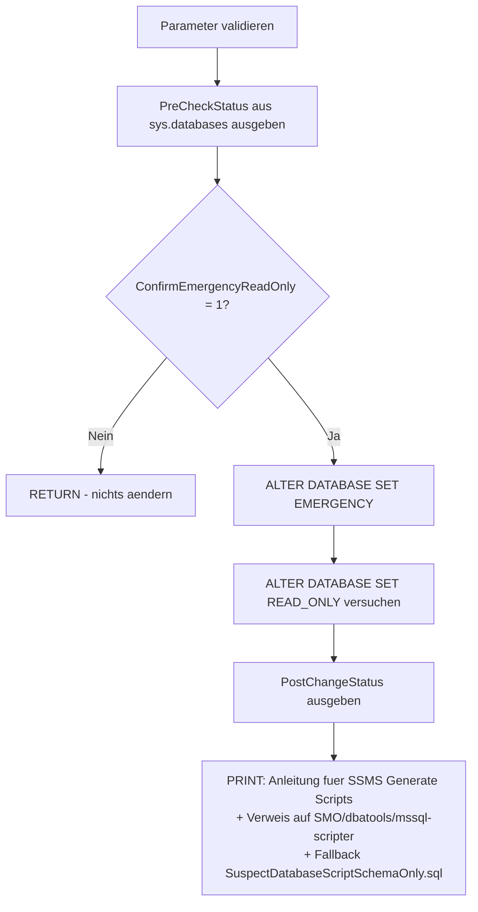

# DatabaseEmergencyReadOnlyForGenerateScripts.sql

Dieses Skript versetzt eine `SUSPECT`-Datenbank **nur** in `EMERGENCY` + `READ_ONLY` (**kein** Reparaturversuch, **kein** `SINGLE_USER WITH ROLLBACK IMMEDIATE`, **keine** eigene Schema-Extraktion) und gibt anschliessend eine konkrete Anleitung aus, wie das Schema danach komfortabel per **SSMS "Generate Scripts"** oder einer der programmatischen Alternativen (SMO/PowerShell, `dbatools`, `mssql-scripter`) gesichert werden kann. Es ist die schlanke Ergaenzung zu [SuspectDatabaseScriptSchemaOnly.sql](SuspectDatabaseScriptSchemaOnly.sql), das stattdessen selbst per T-SQL objektweise extrahiert.

## Uebersicht

<!-- SQLDOC:SUMMARY_TABLE:BEGIN -->
| Feld | Wert |
|---|---|
| Script | [DatabaseEmergencyReadOnlyForGenerateScripts.sql](DatabaseEmergencyReadOnlyForGenerateScripts.sql) |
| Version | `1.0` |
| Typ | `remediation` |
| Kapitel | `71_BackupRestore_Strategies` |
| Sicherheit | `destructive-limited` (aendert Datenbankeigenschaften, aber keine Daten/Reparatur) |
| Zweck | Versetzt eine SUSPECT-Datenbank nur nach EMERGENCY + READ_ONLY und verweist danach auf SSMS Generate Scripts bzw. dessen programmatische Alternativen. |
<!-- SQLDOC:SUMMARY_TABLE:END -->

## Einordnung

Dieses Skript ist **eigenstaendig** und ergaenzt zwei bereits vorhandene Skripte in diesem Kapitel:

- [SuspectDatabaseRepairWithoutBackup.sql](SuspectDatabaseRepairWithoutBackup.sql) — versucht die destruktive Reparatur (`DBCC CHECKDB ... REPAIR_ALLOW_DATA_LOSS`). Dieses Skript hier tut das **nicht**.
- [SuspectDatabaseScriptSchemaOnly.sql](SuspectDatabaseScriptSchemaOnly.sql) — macht denselben `EMERGENCY`/`READ_ONLY`-Wechsel, extrahiert danach aber **zusaetzlich** selbst objektweise das Schema per T-SQL (mit `TRY/CATCH` je Objekttyp und `CompletenessCheck`). Dieses Skript hier verzichtet bewusst auf die eigene Extraktion und verweist stattdessen auf **SSMS Generate Scripts** — siehe [SSMS_GenerateScripts_Anleitung.md](../SSMS_GenerateScripts_Anleitung.md).

Siehe auch [SuspectOrRecoveryPendingDatabase_RepairOptions.md](../SuspectOrRecoveryPendingDatabase_RepairOptions.md) fuer den Gesamtzusammenhang aller Reparaturoptionen bei `SUSPECT`/`RECOVERY_PENDING`.

**Wann diesen Weg statt `SuspectDatabaseScriptSchemaOnly.sql` waehlen?** Wenn eine **vollstaendigere** Schema-Extraktion gewuenscht ist, als das eigene T-SQL-Skript liefern kann — SSMS Generate Scripts (bzw. SMO/`dbatools`) erfasst zusaetzlich Users, Berechtigungen (`GRANT`/`DENY`), SQL Assemblies, User-Defined Types und User-Defined Table Types, die das eigene Skript nicht abdeckt (siehe [SSMS_GenerateScripts_Anleitung.md](../SSMS_GenerateScripts_Anleitung.md) Abschnitt 2).

**Achtung — moeglicher Abbruch bei beschaedigten Metadaten:** SSMS Generate Scripts (und die darunterliegende SMO-Technologie) fragt Objekte i.d.R. **pauschal je Objekttyp** ab, nicht objektweise mit einzelnem Fehlerabfang wie [SuspectDatabaseScriptSchemaOnly.sql](SuspectDatabaseScriptSchemaOnly.sql). Ist eine einzelne Metadatenseite beschaedigt, kann der Wizard/SMO **beim ersten betroffenen Objekt komplett abbrechen**, statt nur dieses eine Objekt auszulassen (siehe [SSMS_GenerateScripts_Anleitung.md](../SSMS_GenerateScripts_Anleitung.md) Abschnitt 3.1 und 3.3). In diesem Fall ist [SuspectDatabaseScriptSchemaOnly.sql](SuspectDatabaseScriptSchemaOnly.sql) der robustere Fallback.

## Annahmen

- Die Datenbank ist `SUSPECT` (oder in einem vergleichbar unlesbaren Zustand) und muss erst durch `SET EMERGENCY` wieder ansprechbar gemacht werden, bevor Systemkataloge — egal ob per eigenem T-SQL oder per SMO/Generate Scripts — ueberhaupt gelesen werden koennen.
- `SET READ_ONLY` kann fehlschlagen (z.B. wenn Recovery-Aktionen noch ausstehen); das Skript protokolliert dies per `PRINT` und faehrt im reinen `EMERGENCY`-Modus fort.
- Ob eine anschliessende Schema-Extraktion per Generate Scripts/SMO tatsaechlich vollstaendig gelingt, haengt — wie bei [SuspectDatabaseScriptSchemaOnly.sql](SuspectDatabaseScriptSchemaOnly.sql) auch — davon ab, ob die betroffenen Metadaten-Seiten selbst beschaedigt sind.
- Das Skript schreibt nichts in die Daten der Zieldatenbank; es aendert ausschliesslich die Datenbankeigenschaften `EMERGENCY`/`READ_ONLY`.

## Anwendungsfall

Eine Datenbank ist `SUSPECT`, ein Backup fehlt, und statt der eigenen (T-SQL-basierten, aber in der Objektabdeckung eingeschraenkten) Schema-Extraktion soll die komfortablere, vollstaendigere **SSMS Generate Scripts**-Funktion (oder eine ihrer programmatischen Alternativen) genutzt werden, sobald die Datenbank wieder lesbar ist.

## Parameter

<!-- SQLDOC:PARAMETERS_TABLE:BEGIN -->
| Parameter | SQL-Typ | Pflicht | Beschreibung |
|---|---|---|---|
| `@TargetDatabaseName` | `SYSNAME` | Ja | Name der SUSPECT-Datenbank, die fuer eine anschliessende Schema-Extraktion per Generate Scripts lesbar gemacht werden soll, z.B. `'BI_DQ'`. |
| `@ConfirmEmergencyReadOnly` | `BIT` | Ja | Muss explizit auf `1` gesetzt werden, um die Datenbank in `EMERGENCY`/`READ_ONLY` zu versetzen. Bei `0` (Default) wird nur der aktuelle Status angezeigt und nichts geaendert. |
<!-- SQLDOC:PARAMETERS_TABLE:END -->

## Abhaengigkeiten

<!-- SQLDOC:DEPENDENCIES_LIST:BEGIN -->
- `sys.databases`
- `ALTER DATABASE`
<!-- SQLDOC:DEPENDENCIES_LIST:END -->

## Hinweise

- `PreCheckStatus` zeigt den aktuellen Status der Datenbank aus `sys.databases`, bevor irgendetwas geaendert wird.
- Bei `@ConfirmEmergencyReadOnly = 0` bricht das Skript nach der Statusanzeige per `RETURN` ab — es passiert nichts weiter.
- Bei `@ConfirmEmergencyReadOnly = 1`: `ALTER DATABASE SET EMERGENCY`, danach der Versuch `ALTER DATABASE SET READ_ONLY` (schlaegt dieser fehl, laeuft das Skript im reinen `EMERGENCY`-Modus weiter — per `PRINT` protokolliert).
- `PostChangeStatus` zeigt den Status nach dem Wechsel.
- Am Ende gibt das Skript per `PRINT` eine konkrete Schritt-fuer-Schritt-Anleitung fuer SSMS Generate Scripts aus (Objekt-Explorer → Tasks → Generate Scripts..., "Script entire database and all database objects", Advanced-Optionen fuer Indexes/Triggers/Permissions/Users, als eine zusammenhaengende Datei statt "One file per object" speichern) sowie einen Verweis auf die programmatischen Alternativen (SMO/PowerShell, `dbatools Export-DbaScript`, `mssql-scripter`) — Details siehe [SSMS_GenerateScripts_Anleitung.md](../SSMS_GenerateScripts_Anleitung.md) Abschnitte 1, 6.4 und 7.
- Nach erfolgreicher Extraktion sollte die Zieldatenbank **nicht** dauerhaft im `EMERGENCY`-Modus verbleiben. Sie kann vollstaendig entfernt werden — dafuer gibt es [DropDatabaseCompletely.sql](DropDatabaseCompletely.sql) — und aus dem per Generate Scripts (bzw. SMO/`dbatools`/`mssql-scripter`) erzeugten Skript neu aufgebaut werden.

## Versionshistorie

<!-- SQLDOC:VERSION_HISTORY_TABLE:BEGIN -->
| Version | Datum | User | Beschreibung |
|---|---|---|---|
| `1.0` | `2026-08-13` | `ER` | Erstversion: schlanke Variante von SuspectDatabaseScriptSchemaOnly.sql ohne eigene T-SQL-Schema-Extraktion - versetzt die Datenbank nur nach EMERGENCY + READ_ONLY und verweist anschliessend auf SSMS Generate Scripts bzw. die programmatischen Alternativen (SMO/PowerShell, dbatools, mssql-scripter) aus SSMS_GenerateScripts_Anleitung.md. |
<!-- SQLDOC:VERSION_HISTORY_TABLE:END -->

## Ablauf

<!-- SQLDOC:MERMAID:BEGIN -->

<!-- SQLDOC:MERMAID:END -->

## SQL-Code

<!-- SQLDOC:SQL_CODE:BEGIN -->
```sql
/*
BEGIN:SQL-HEADER v1
---
sql_header: v1
script_name: "DatabaseEmergencyReadOnlyForGenerateScripts.sql"
script_version: "1.0"
script_type: "remediation"
chapter: "71_BackupRestore_Strategies"
purpose: >
  Versetzt eine SUSPECT-Datenbank NUR in EMERGENCY + READ_ONLY (kein REPAIR,
  kein SINGLE_USER WITH ROLLBACK IMMEDIATE, keine eigene Schema-Extraktion),
  um sie ueberhaupt wieder lesbar zu machen. Im Unterschied zu
  SuspectDatabaseScriptSchemaOnly.sql liest dieses Skript die Systemkataloge
  NICHT selbst objektweise aus, sondern gibt am Ende lediglich eine Anleitung
  aus, wie das Schema anschliessend komfortabel per SSMS "Generate Scripts"
  (Tasks -> Generate Scripts...) oder einem der programmatischen Wege
  (SMO/PowerShell, dbatools Export-DbaScript, mssql-scripter) extrahiert
  werden kann - siehe SSMS_GenerateScripts_Anleitung.md.

parameters:
  - name: "@TargetDatabaseName"
    sql_type: "SYSNAME"
    direction: "IN"
    required: true
    description: "Name der SUSPECT-Datenbank, die fuer eine anschliessende Schema-Extraktion per Generate Scripts lesbar gemacht werden soll, z.B. 'BI_DQ'"
  - name: "@ConfirmEmergencyReadOnly"
    sql_type: "BIT"
    direction: "IN"
    required: true
    description: "Muss explizit auf 1 gesetzt werden, um die Datenbank in EMERGENCY + READ_ONLY zu versetzen; bei 0 (Default) wird nur der aktuelle Status angezeigt und nichts geaendert"

result_sets:
  - name: "PreCheckStatus"
    description: "Status der Zieldatenbank aus sys.databases vor jeder Aenderung"
  - name: "PostChangeStatus"
    description: "Status der Zieldatenbank nach dem Wechsel nach EMERGENCY + READ_ONLY (nur wenn @ConfirmEmergencyReadOnly = 1)"

dependencies:
  - "sys.databases"
  - "ALTER DATABASE"

safety:
  level: "destructive-limited"
  writes_data: false

documentation:
  markdown_file: "T-SQL/71_BackupRestore_Strategies/SQLScripts/DatabaseEmergencyReadOnlyForGenerateScripts.md"
  sync_blocks:
    - "SUMMARY_TABLE"
    - "PARAMETERS_TABLE"
    - "DEPENDENCIES_LIST"
    - "VERSION_HISTORY_TABLE"
    - "SQL_CODE"
  mermaid:
    mode: "ai-agent-from-sql"
    source: "script-body"

main_responsible:
  name: "Erhard Rainer"
  initials: "ER"

version_history:
  - version: "1.0"
    date: "2026-08-13"
    user: "ER"
    description: "Erstversion: schlanke Variante von SuspectDatabaseScriptSchemaOnly.sql ohne eigene T-SQL-Schema-Extraktion - versetzt die Datenbank nur nach EMERGENCY + READ_ONLY und verweist anschliessend auf SSMS Generate Scripts bzw. die programmatischen Alternativen (SMO/PowerShell, dbatools, mssql-scripter) aus SSMS_GenerateScripts_Anleitung.md."

notes:
  - "Dieses Skript aendert die Datenbankeigenschaften (EMERGENCY, READ_ONLY), fuehrt aber KEIN DBCC CHECKDB REPAIR_ALLOW_DATA_LOSS und KEINE eigene Objekt-Extraktion durch - es ist NICHT identisch mit SuspectDatabaseRepairWithoutBackup.sql oder SuspectDatabaseScriptSchemaOnly.sql."
  - "Ob SSMS Generate Scripts (bzw. SMO/dbatools/mssql-scripter) im EMERGENCY-Modus tatsaechlich erfolgreich durchlaeuft, haengt davon ab, ob die benoetigten Metadaten-Seiten selbst beschaedigt sind. SMO fragt Objekte i.d.R. pauschal je Objekttyp ab (nicht objektweise mit TRY/CATCH wie SuspectDatabaseScriptSchemaOnly.sql) und kann daher beim ersten beschaedigten Objekt komplett abbrechen, statt nur dieses eine Objekt auszulassen."
  - "Bricht Generate Scripts/SMO wegen beschaedigter Metadaten ab, ist SuspectDatabaseScriptSchemaOnly.sql (objektweise TRY/CATCH-Extraktion direkt ueber Systemkataloge) der robustere Fallback."
  - "Siehe SSMS_GenerateScripts_Anleitung.md Abschnitt 3.1 fuer die Einschraenkungen des Wizards bei nicht vollstaendig lesbaren Datenbanken, und Abschnitt 7 fuer die programmatischen Alternativen (SMO/PowerShell, dbatools Export-DbaScript, mssql-scripter, sqlpackage)."
  - "Solange @ConfirmEmergencyReadOnly = 0 ist, aendert das Skript nichts an der Datenbank."
  - "Nach Abschluss sollte die Datenbank NICHT dauerhaft im EMERGENCY-Modus verbleiben; sie kann nach erfolgreicher Schema-Extraktion verworfen und aus dem generierten Skript neu aufgebaut werden (DROP DATABASE + CREATE DATABASE + generiertes Skript)."
---
END:SQL-HEADER v1
*/

SET NOCOUNT ON;

-- 1. Parameter vorbereiten
DECLARE @TargetDatabaseName SYSNAME = N'BI_DQ';
DECLARE @ConfirmEmergencyReadOnly BIT = 0;

IF @TargetDatabaseName IS NULL OR LTRIM(RTRIM(@TargetDatabaseName)) = N''
BEGIN
    THROW 50000, '@TargetDatabaseName darf nicht leer sein.', 1;
END;

IF NOT EXISTS (SELECT 1 FROM sys.databases WHERE name = @TargetDatabaseName)
BEGIN
    THROW 50001, 'Die angegebene Datenbank wurde nicht in sys.databases gefunden.', 1;
END;

IF @ConfirmEmergencyReadOnly IS NULL OR @ConfirmEmergencyReadOnly NOT IN (0, 1)
BEGIN
    THROW 50002, '@ConfirmEmergencyReadOnly muss 0 oder 1 sein.', 1;
END;

-- 2. Vorab-Status anzeigen (rein lesend)
SELECT
    d.name                    AS DatabaseName,
    d.database_id             AS DatabaseId,
    d.state_desc              AS StateDesc,
    d.recovery_model_desc     AS RecoveryModel,
    d.user_access_desc        AS UserAccessDesc,
    d.is_read_only            AS IsReadOnly,
    @ConfirmEmergencyReadOnly AS ConfirmEmergencyReadOnlyFlag
FROM sys.databases AS d
WHERE d.name = @TargetDatabaseName;

IF @ConfirmEmergencyReadOnly <> 1
BEGIN
    PRINT N'@ConfirmEmergencyReadOnly = 0: Es wurde nichts an der Datenbank geaendert. Zum Wechsel nach EMERGENCY + READ_ONLY @ConfirmEmergencyReadOnly auf 1 setzen.';
    RETURN;
END;

-- 3. Datenbank NUR in EMERGENCY + READ_ONLY versetzen (kein REPAIR, kein SINGLE_USER WITH ROLLBACK IMMEDIATE)
DECLARE @Sql NVARCHAR(MAX);

PRINT N'Versetze ' + QUOTENAME(@TargetDatabaseName) + N' in EMERGENCY + READ_ONLY, um die Datenbank fuer Generate Scripts lesbar zu machen (keine Reparatur, keine Datenaenderung).';

SET @Sql = N'ALTER DATABASE ' + QUOTENAME(@TargetDatabaseName) + N' SET EMERGENCY;';
EXEC sp_executesql @Sql;

BEGIN TRY
    SET @Sql = N'ALTER DATABASE ' + QUOTENAME(@TargetDatabaseName) + N' SET READ_ONLY;';
    EXEC sp_executesql @Sql;
END TRY
BEGIN CATCH
    PRINT N'Hinweis: SET READ_ONLY schlug fehl (' + ERROR_MESSAGE() + N'). Fahre trotzdem im EMERGENCY-Modus fort.';
END CATCH;

-- 4. Ergebnis pruefen
SELECT
    d.name                AS DatabaseName,
    d.database_id         AS DatabaseId,
    d.state_desc          AS StateDesc,
    d.recovery_model_desc AS RecoveryModel,
    d.user_access_desc    AS UserAccessDesc,
    d.is_read_only        AS IsReadOnly
FROM sys.databases AS d
WHERE d.name = @TargetDatabaseName;

-- 5. Naechster Schritt: Schema-Extraktion NICHT hier im Skript, sondern ueber
--    SSMS Generate Scripts bzw. eine der programmatischen Alternativen ausfuehren.
PRINT N'--------------------------------------------------------------------------------';
PRINT N'Datenbank ' + QUOTENAME(@TargetDatabaseName) + N' steht jetzt (falls erfolgreich) in EMERGENCY + READ_ONLY.';
PRINT N'Naechster Schritt: Schema jetzt per SSMS "Generate Scripts" sichern.';
PRINT N'  1. Im Objekt-Explorer Rechtsklick auf ' + QUOTENAME(@TargetDatabaseName) + N' -> Tasks -> Generate Scripts...';
PRINT N'  2. "Script entire database and all database objects" waehlen.';
PRINT N'  3. Unter "Set Scripting Options" -> Advanced ggf. Indexes, Triggers, Permissions,';
PRINT N'     Extended Properties und Users mit aktivieren (im SMO-Default oft ausgeschaltet).';
PRINT N'  4. Ergebnis als EINE zusammenhaengende .sql-Datei speichern (nicht "One file per object"),';
PRINT N'     um die Objektreihenfolge zu erhalten - siehe SSMS_GenerateScripts_Anleitung.md Abschnitt 6.4.';
PRINT N'';
PRINT N'Alternativ programmatisch ohne GUI (z.B. fuer Automatisierung): SMO/PowerShell,';
PRINT N'dbatools Export-DbaScript oder mssql-scripter - siehe SSMS_GenerateScripts_Anleitung.md Abschnitt 7.';
PRINT N'';
PRINT N'Falls Generate Scripts/SMO wegen beschaedigter Metadaten abbricht: SuspectDatabaseScriptSchemaOnly.sql';
PRINT N'als Fallback verwenden (liest Systemkataloge objektweise mit TRY/CATCH aus, bricht bei';
PRINT N'einem beschaedigten Objekt nicht komplett ab).';
PRINT N'--------------------------------------------------------------------------------';
```
<!-- SQLDOC:SQL_CODE:END -->
