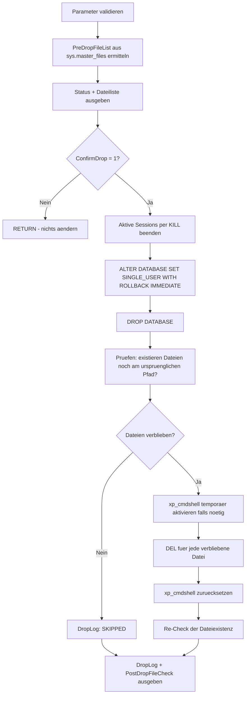

# DropDatabaseCompletely.sql

Dieses Skript entfernt eine Datenbank **vollstaendig**: Es killt aktive Verbindungen, setzt die Datenbank in `SINGLE_USER WITH ROLLBACK IMMEDIATE`, fuehrt `DROP DATABASE` aus und prueft anschliessend, ob alle physischen Dateien (`.mdf`/`.ndf`/`.ldf`) tatsaechlich vom Dateisystem entfernt wurden. Bei zuvor `SUSPECT`/`EMERGENCY`-Datenbanken entfernt `DROP DATABASE` die Dateien manchmal nicht zuverlaessig — dafuer gibt es einen `xp_cmdshell`-Fallback, der verbliebene Dateien nachtraeglich vom Betriebssystem loescht.

## Uebersicht

<!-- SQLDOC:SUMMARY_TABLE:BEGIN -->
| Feld | Wert |
|---|---|
| Script | [DropDatabaseCompletely.sql](DropDatabaseCompletely.sql) |
| Version | `1.0` |
| Typ | `remediation` |
| Kapitel | `71_BackupRestore_Strategies` |
| Sicherheit | `destructive` (killt Verbindungen, entfernt DB und Dateien unwiderruflich) |
| Zweck | Entfernt eine Datenbank inkl. aller physischen Dateien vollstaendig, mit Fallback fuer verbliebene Dateien. |
<!-- SQLDOC:SUMMARY_TABLE:END -->

## Einordnung

Dieses Skript ist der letzte Schritt im Zusammenhang mit [SuspectOrRecoveryPendingDatabase_RepairOptions.md](../SuspectOrRecoveryPendingDatabase_RepairOptions.md), [SuspectDatabaseRepairWithoutBackup.sql](SuspectDatabaseRepairWithoutBackup.sql) und [SuspectDatabaseScriptSchemaOnly.sql](SuspectDatabaseScriptSchemaOnly.sql): Wenn eine Datenbank nicht mehr gerettet werden kann (oder ihr Schema bereits erfolgreich extrahiert wurde), wird sie hier endgueltig entfernt, um Platz fuer einen Neuaufbau zu schaffen. Es ist aber ein eigenstaendiges, allgemein verwendbares Skript und nicht auf den SUSPECT-Kontext beschraenkt.

## Annahmen

- Systemdatenbanken (`master`, `model`, `msdb`, `tempdb`) sind explizit ausgeschlossen und fuehren zu einem Fehler.
- Solange `@ConfirmDrop = 0` (Default) ist, wird nichts geaendert — es werden nur der aktuelle Status und die zugehoerigen Dateipfade angezeigt.
- Der `xp_cmdshell`-Fallback (Schritt 5) greift nur, wenn nach `DROP DATABASE` tatsaechlich noch Dateien am urspruenglichen Pfad gefunden werden. War `xp_cmdshell` vorher deaktiviert, wird es nur temporaer aktiviert und danach wieder in den urspruenglichen Zustand zurueckgesetzt (auch im Fehlerfall, per eigenem `CATCH`-Block).
- Aktivieren von `xp_cmdshell` erfordert `sysadmin`-Rechte und kann je nach Sicherheitsrichtlinie unerwuenscht sein — im Zweifel vorher mit DBA/Sicherheitsteam abstimmen.
- Es gibt **kein Undo**. Falls Unsicherheit besteht, vorher ein Backup ziehen oder zumindest das Schema per [SuspectDatabaseScriptSchemaOnly.sql](SuspectDatabaseScriptSchemaOnly.sql) sichern.

## Anwendungsfall

Eine Datenbank soll komplett entfernt werden — z.B. weil sie irreparabel beschaedigt ist (nach gescheitertem `REPAIR_ALLOW_DATA_LOSS`), nicht mehr benoetigt wird, oder vor einem Neuaufbau aus einem geretteten Schema Platz geschaffen werden muss. `DROP DATABASE` allein reicht manchmal nicht aus, wenn die Datenbank vorher in einem inkonsistenten Zustand (`SUSPECT`/`EMERGENCY`) war und SQL Server die Dateisperren nicht vollstaendig freigibt.

## Parameter

<!-- SQLDOC:PARAMETERS_TABLE:BEGIN -->
| Parameter | SQL-Typ | Pflicht | Beschreibung |
|---|---|---|---|
| `@TargetDatabaseName` | `SYSNAME` | Ja | Name der Datenbank, die vollstaendig entfernt werden soll, z.B. `'BI_DQ'`. Systemdatenbanken sind ausgeschlossen. |
| `@ConfirmDrop` | `BIT` | Ja | Muss explizit auf `1` gesetzt werden, um die Datenbank tatsaechlich zu droppen. Bei `0` (Default) werden nur Status und Dateipfade angezeigt. |
<!-- SQLDOC:PARAMETERS_TABLE:END -->

## Abhaengigkeiten

<!-- SQLDOC:DEPENDENCIES_LIST:BEGIN -->
- `sys.databases`
- `sys.master_files`
- `sys.dm_exec_sessions`
- `sys.dm_os_file_exists`
- `xp_cmdshell`
- `DROP DATABASE`
<!-- SQLDOC:DEPENDENCIES_LIST:END -->

## Hinweise

- `PreDropFileList` zeigt alle physischen Dateien der Zieldatenbank (aus `sys.master_files`), **bevor** irgendetwas geloescht wird.
- Bei `@ConfirmDrop = 0` bricht das Skript nach der Statusanzeige per `RETURN` ab.
- Bei `@ConfirmDrop = 1` laeuft der destruktive Ablauf: (1) alle aktiven Sessions auf die Datenbank per `KILL` beenden, (2) `ALTER DATABASE ... SET SINGLE_USER WITH ROLLBACK IMMEDIATE` als zusaetzliche Absicherung, (3) `DROP DATABASE`, (4) Pruefen, ob die urspruenglichen Dateien noch existieren, (5) falls ja: `xp_cmdshell`-Fallback zum Nachloeschen.
- `DropLog` protokolliert jeden Einzelschritt mit `OK`/`FAILED`/`SKIPPED` und ggf. der Fehlermeldung — so ist jederzeit nachvollziehbar, an welcher Stelle etwas nicht wie erwartet lief.
- `PostDropFileCheck` zeigt je urspruenglicher Datei, ob sie nach dem gesamten Ablauf noch auf dem Dateisystem existiert (`FileExistsAfter = 1`) oder erfolgreich entfernt wurde (`0`).
- Der `KILL`-Schritt fuer einzelne Sessions ist selbst gegen Fehler abgesichert (z.B. wenn eine Session zwischen Ermittlung und `KILL`-Aufruf bereits beendet wurde) — ein einzelner fehlgeschlagener `KILL` bricht das Skript nicht ab.
- Abschliessende `PRINT`-Meldung fasst zusammen, ob die Datenbank inkl. aller Dateien vollstaendig entfernt wurde oder ob noch manuell nachgearbeitet werden muss.

## Versionshistorie

<!-- SQLDOC:VERSION_HISTORY_TABLE:BEGIN -->
| Version | Datum | User | Beschreibung |
|---|---|---|---|
| `1.0` | `2026-08-13` | `ER` | Erstversion: Aktive Verbindungen killen, SINGLE_USER, DROP DATABASE, Dateicheck und xp_cmdshell-Fallback zum Nachloeschen verbliebener mdf/ndf/ldf-Dateien |
<!-- SQLDOC:VERSION_HISTORY_TABLE:END -->

## Ablauf

<!-- SQLDOC:MERMAID:BEGIN -->

<!-- SQLDOC:MERMAID:END -->

## SQL-Code

<!-- SQLDOC:SQL_CODE:BEGIN -->
```sql
/*
BEGIN:SQL-HEADER v1
---
sql_header: v1
script_name: "DropDatabaseCompletely.sql"
script_version: "1.0"
script_type: "remediation"
chapter: "71_BackupRestore_Strategies"
purpose: >
  Entfernt eine Datenbank vollstaendig: killt aktive Verbindungen, setzt die
  Datenbank in SINGLE_USER WITH ROLLBACK IMMEDIATE, fuehrt DROP DATABASE aus
  und prueft danach, ob alle physischen Dateien (mdf/ndf/ldf) tatsaechlich
  vom Dateisystem entfernt wurden. Bei SUSPECT/EMERGENCY-Datenbanken oder
  offline befindlichen Dateien entfernt DROP DATABASE die Dateien manchmal
  nicht zuverlaessig - fuer diesen Fall enthaelt das Skript einen
  xp_cmdshell-Fallback, der verbliebene Dateien nachtraeglich vom
  Betriebssystem loescht. Der destruktive Ablauf laeuft nur, wenn
  @ConfirmDrop explizit auf 1 gesetzt wurde.

parameters:
  - name: "@TargetDatabaseName"
    sql_type: "SYSNAME"
    direction: "IN"
    required: true
    description: "Name der Datenbank, die vollstaendig entfernt werden soll, z.B. 'BI_DQ'"
  - name: "@ConfirmDrop"
    sql_type: "BIT"
    direction: "IN"
    required: true
    description: "Muss explizit auf 1 gesetzt werden, um die Datenbank tatsaechlich zu droppen; bei 0 (Default) werden nur der aktuelle Status und die zugehoerigen Dateipfade angezeigt"

result_sets:
  - name: "PreDropFileList"
    description: "Alle physischen Dateien (mdf/ndf/ldf) der Zieldatenbank vor dem Drop, ermittelt aus sys.master_files"
  - name: "DropLog"
    description: "Protokoll der einzelnen Schritte (Verbindungen killen, SINGLE_USER, DROP DATABASE, Dateicheck, ggf. Nachloeschen) mit Status und Fehlermeldung"
  - name: "PostDropFileCheck"
    description: "Prueft je urspruenglicher Datei, ob sie nach dem Drop noch auf dem Dateisystem existiert (per sys.dm_os_file_exists, sofern verfuegbar, sonst per xp_cmdshell dir)"

dependencies:
  - "sys.databases"
  - "sys.master_files"
  - "sys.dm_exec_sessions"
  - "sys.dm_os_file_exists"
  - "xp_cmdshell"
  - "DROP DATABASE"

safety:
  level: "destructive"
  writes_data: true

documentation:
  markdown_file: "T-SQL/71_BackupRestore_Strategies/SQLScripts/DropDatabaseCompletely.md"
  sync_blocks:
    - "SUMMARY_TABLE"
    - "PARAMETERS_TABLE"
    - "DEPENDENCIES_LIST"
    - "VERSION_HISTORY_TABLE"
    - "SQL_CODE"
  mermaid:
    mode: "ai-agent-from-sql"
    source: "script-body"

main_responsible:
  name: "Erhard Rainer"
  initials: "ER"

version_history:
  - version: "1.0"
    date: "2026-08-13"
    user: "ER"
    description: "Erstversion: Aktive Verbindungen killen, SINGLE_USER, DROP DATABASE, Dateicheck und xp_cmdshell-Fallback zum Nachloeschen verbliebener mdf/ndf/ldf-Dateien"

notes:
  - "Dies ist ein SCHREIBENDES, DESTRUKTIVES Skript. Es beendet aktive Verbindungen zwangsweise und entfernt die Datenbank inklusive aller Dateien unwiderruflich."
  - "xp_cmdshell wird nur temporaer aktiviert, wenn es zuvor deaktiviert war, und danach wieder auf den urspruenglichen Zustand zurueckgesetzt. Das Aktivieren von xp_cmdshell erfordert sysadmin-Rechte und kann je nach Sicherheitsrichtlinie unerwuenscht sein - im Zweifel vorher mit dem DBA/Sicherheitsteam abstimmen."
  - "Der xp_cmdshell-Fallback greift nur, wenn nach DROP DATABASE noch Dateien am urspruenglichen Pfad gefunden werden (z.B. bei zuvor SUSPECT/EMERGENCY-Datenbanken, wo SQL Server die Dateien nicht immer zuverlaessig freigibt)."
  - "Vor Ausfuehrung sicherstellen, dass die Datenbank tatsaechlich nicht mehr benoetigt wird - es gibt kein Undo. Bei Unsicherheit vorher ein Backup ziehen oder das Schema per SuspectDatabaseScriptSchemaOnly.sql sichern."
---
END:SQL-HEADER v1
*/

SET NOCOUNT ON;

-- 1. Parameter vorbereiten
DECLARE @TargetDatabaseName SYSNAME = N'BI_DQ';
DECLARE @ConfirmDrop BIT = 0;

IF @TargetDatabaseName IS NULL OR LTRIM(RTRIM(@TargetDatabaseName)) = N''
BEGIN
    THROW 50000, '@TargetDatabaseName darf nicht leer sein.', 1;
END;

IF NOT EXISTS (SELECT 1 FROM sys.databases WHERE name = @TargetDatabaseName)
BEGIN
    THROW 50001, 'Die angegebene Datenbank wurde nicht in sys.databases gefunden.', 1;
END;

IF @TargetDatabaseName IN (N'master', N'model', N'msdb', N'tempdb')
BEGIN
    THROW 50002, 'Systemdatenbanken (master/model/msdb/tempdb) duerfen mit diesem Skript nicht entfernt werden.', 1;
END;

IF @ConfirmDrop IS NULL OR @ConfirmDrop NOT IN (0, 1)
BEGIN
    THROW 50003, '@ConfirmDrop muss 0 oder 1 sein.', 1;
END;

DROP TABLE IF EXISTS #PreDropFileList;
CREATE TABLE #PreDropFileList
(
    FileId       INT           NOT NULL,
    LogicalName  SYSNAME       NOT NULL,
    PhysicalName NVARCHAR(260) NOT NULL,
    FileTypeDesc NVARCHAR(60)  NOT NULL
);

INSERT INTO #PreDropFileList (FileId, LogicalName, PhysicalName, FileTypeDesc)
SELECT
    mf.file_id,
    mf.name,
    mf.physical_name,
    mf.type_desc
FROM sys.master_files AS mf
JOIN sys.databases AS d ON d.database_id = mf.database_id
WHERE d.name = @TargetDatabaseName;

-- 2. Vorab-Ausgabe: Status + betroffene Dateien (rein lesend)
SELECT
    d.name                AS DatabaseName,
    d.database_id         AS DatabaseId,
    d.state_desc          AS StateDesc,
    d.recovery_model_desc AS RecoveryModel,
    @ConfirmDrop           AS ConfirmDropFlag
FROM sys.databases AS d
WHERE d.name = @TargetDatabaseName;

SELECT
    pfl.FileId,
    pfl.LogicalName,
    pfl.PhysicalName,
    pfl.FileTypeDesc
FROM #PreDropFileList AS pfl
ORDER BY
    pfl.FileId;

IF @ConfirmDrop <> 1
BEGIN
    PRINT N'@ConfirmDrop = 0: Es wurde nichts geaendert. Zum tatsaechlichen Loeschen der Datenbank @ConfirmDrop auf 1 setzen.';
    RETURN;
END;

-- 3. Destruktiven Ablauf durchfuehren
DROP TABLE IF EXISTS #DropLog;
CREATE TABLE #DropLog
(
    StepOrder   INT           NOT NULL,
    StepName    VARCHAR(60)   NOT NULL,
    Status      VARCHAR(20)   NOT NULL,
    ErrorDetail NVARCHAR(2000) NULL
);

DECLARE @Sql NVARCHAR(MAX);
DECLARE @DbId INT = DB_ID(@TargetDatabaseName);

PRINT N'ACHTUNG: @ConfirmDrop = 1 - entferne Datenbank ' + QUOTENAME(@TargetDatabaseName) + N' vollstaendig inkl. aller Dateien.';

-- 3a. Aktive Verbindungen killen
BEGIN TRY
    DECLARE @Spid INT;
    DECLARE SpidCursor CURSOR LOCAL FAST_FORWARD FOR
        SELECT session_id FROM sys.dm_exec_sessions WHERE database_id = @DbId AND session_id <> @@SPID;

    OPEN SpidCursor;
    FETCH NEXT FROM SpidCursor INTO @Spid;
    WHILE @@FETCH_STATUS = 0
    BEGIN
        SET @Sql = N'KILL ' + CAST(@Spid AS NVARCHAR(10)) + N';';
        BEGIN TRY
            EXEC (@Sql);
        END TRY
        BEGIN CATCH
            -- Session kann zwischenzeitlich bereits beendet worden sein; das ist kein Abbruchgrund.
            PRINT N'Hinweis: KILL fuer Session ' + CAST(@Spid AS NVARCHAR(10)) + N' schlug fehl (' + ERROR_MESSAGE() + N').';
        END CATCH;
        FETCH NEXT FROM SpidCursor INTO @Spid;
    END;
    CLOSE SpidCursor;
    DEALLOCATE SpidCursor;

    INSERT INTO #DropLog (StepOrder, StepName, Status, ErrorDetail) VALUES (1, 'KILL_CONNECTIONS', 'OK', NULL);
END TRY
BEGIN CATCH
    INSERT INTO #DropLog (StepOrder, StepName, Status, ErrorDetail) VALUES (1, 'KILL_CONNECTIONS', 'FAILED', ERROR_MESSAGE());
END CATCH;

-- 3b. SINGLE_USER WITH ROLLBACK IMMEDIATE (fasst uebrige Verbindungen zusammen ab)
BEGIN TRY
    SET @Sql = N'ALTER DATABASE ' + QUOTENAME(@TargetDatabaseName) + N' SET SINGLE_USER WITH ROLLBACK IMMEDIATE;';
    EXEC sp_executesql @Sql;

    INSERT INTO #DropLog (StepOrder, StepName, Status, ErrorDetail) VALUES (2, 'SET_SINGLE_USER', 'OK', NULL);
END TRY
BEGIN CATCH
    INSERT INTO #DropLog (StepOrder, StepName, Status, ErrorDetail) VALUES (2, 'SET_SINGLE_USER', 'FAILED', ERROR_MESSAGE());
END CATCH;

-- 3c. DROP DATABASE
BEGIN TRY
    SET @Sql = N'DROP DATABASE ' + QUOTENAME(@TargetDatabaseName) + N';';
    EXEC sp_executesql @Sql;

    INSERT INTO #DropLog (StepOrder, StepName, Status, ErrorDetail) VALUES (3, 'DROP_DATABASE', 'OK', NULL);
END TRY
BEGIN CATCH
    INSERT INTO #DropLog (StepOrder, StepName, Status, ErrorDetail) VALUES (3, 'DROP_DATABASE', 'FAILED', ERROR_MESSAGE());
END CATCH;

-- 4. Pruefen, ob nach dem Drop noch Dateien am urspruenglichen Pfad existieren
DROP TABLE IF EXISTS #PostDropFileCheck;
CREATE TABLE #PostDropFileCheck
(
    PhysicalName    NVARCHAR(260) NOT NULL,
    FileExistsAfter BIT           NULL
);

BEGIN TRY
    INSERT INTO #PostDropFileCheck (PhysicalName, FileExistsAfter)
    SELECT
        pfl.PhysicalName,
        fe.file_exists
    FROM #PreDropFileList AS pfl
    CROSS APPLY sys.dm_os_file_exists(pfl.PhysicalName) AS fe;

    INSERT INTO #DropLog (StepOrder, StepName, Status, ErrorDetail) VALUES (4, 'POST_DROP_FILE_CHECK', 'OK', NULL);
END TRY
BEGIN CATCH
    INSERT INTO #DropLog (StepOrder, StepName, Status, ErrorDetail) VALUES (4, 'POST_DROP_FILE_CHECK', 'FAILED', ERROR_MESSAGE());
END CATCH;

-- 5. xp_cmdshell-Fallback: verbliebene Dateien nachtraeglich vom Dateisystem loeschen
IF EXISTS (SELECT 1 FROM #PostDropFileCheck WHERE FileExistsAfter = 1)
BEGIN
    DECLARE @XpCmdshellWasEnabled BIT;

    SELECT @XpCmdshellWasEnabled = CAST(value_in_use AS BIT)
    FROM sys.configurations
    WHERE name = 'xp_cmdshell';

    BEGIN TRY
        IF @XpCmdshellWasEnabled = 0
        BEGIN
            EXEC sp_configure 'show advanced options', 1; RECONFIGURE;
            EXEC sp_configure 'xp_cmdshell', 1; RECONFIGURE;
        END;

        DECLARE @FileToDelete NVARCHAR(260);
        DECLARE FileCursor CURSOR LOCAL FAST_FORWARD FOR
            SELECT PhysicalName FROM #PostDropFileCheck WHERE FileExistsAfter = 1;

        OPEN FileCursor;
        FETCH NEXT FROM FileCursor INTO @FileToDelete;
        WHILE @@FETCH_STATUS = 0
        BEGIN
            SET @Sql = N'DEL /F /Q "' + @FileToDelete + N'"';
            EXEC master..xp_cmdshell @Sql, NO_OUTPUT;
            FETCH NEXT FROM FileCursor INTO @FileToDelete;
        END;
        CLOSE FileCursor;
        DEALLOCATE FileCursor;

        IF @XpCmdshellWasEnabled = 0
        BEGIN
            EXEC sp_configure 'xp_cmdshell', 0; RECONFIGURE;
            EXEC sp_configure 'show advanced options', 0; RECONFIGURE;
        END;

        INSERT INTO #DropLog (StepOrder, StepName, Status, ErrorDetail) VALUES (5, 'XP_CMDSHELL_FILE_CLEANUP', 'OK', NULL);
    END TRY
    BEGIN CATCH
        INSERT INTO #DropLog (StepOrder, StepName, Status, ErrorDetail) VALUES (5, 'XP_CMDSHELL_FILE_CLEANUP', 'FAILED', ERROR_MESSAGE());

        IF @XpCmdshellWasEnabled = 0
        BEGIN
            BEGIN TRY
                EXEC sp_configure 'xp_cmdshell', 0; RECONFIGURE;
                EXEC sp_configure 'show advanced options', 0; RECONFIGURE;
            END TRY
            BEGIN CATCH
                PRINT N'Hinweis: xp_cmdshell konnte nach dem Fehler nicht wieder deaktiviert werden - bitte manuell pruefen.';
            END CATCH;
        END;
    END CATCH;

    -- Finaler Re-Check nach dem Cleanup
    UPDATE pdc
    SET FileExistsAfter = fe.file_exists
    FROM #PostDropFileCheck AS pdc
    CROSS APPLY sys.dm_os_file_exists(pdc.PhysicalName) AS fe;
END
ELSE
BEGIN
    INSERT INTO #DropLog (StepOrder, StepName, Status, ErrorDetail)
    VALUES (5, 'XP_CMDSHELL_FILE_CLEANUP', 'SKIPPED', 'Keine verbliebenen Dateien gefunden - DROP DATABASE hat bereits alle Dateien entfernt.');
END;

-- 6. Ergebnisse ausgeben
SELECT
    dl.StepOrder,
    dl.StepName,
    dl.Status,
    dl.ErrorDetail
FROM #DropLog AS dl
ORDER BY
    dl.StepOrder;

SELECT
    pdc.PhysicalName,
    pdc.FileExistsAfter
FROM #PostDropFileCheck AS pdc
ORDER BY
    pdc.PhysicalName;

IF EXISTS (SELECT 1 FROM #PostDropFileCheck WHERE FileExistsAfter = 1)
BEGIN
    PRINT N'ACHTUNG: Es sind weiterhin Dateien vorhanden. Bitte PostDropFileCheck pruefen und die verbliebenen Dateien manuell entfernen (z.B. Datei durch anderen Prozess gesperrt).';
END
ELSE
BEGIN
    PRINT N'Datenbank ' + QUOTENAME(@TargetDatabaseName) + N' wurde vollstaendig entfernt, alle Dateien sind vom Dateisystem geloescht.';
END;
```
<!-- SQLDOC:SQL_CODE:END -->
