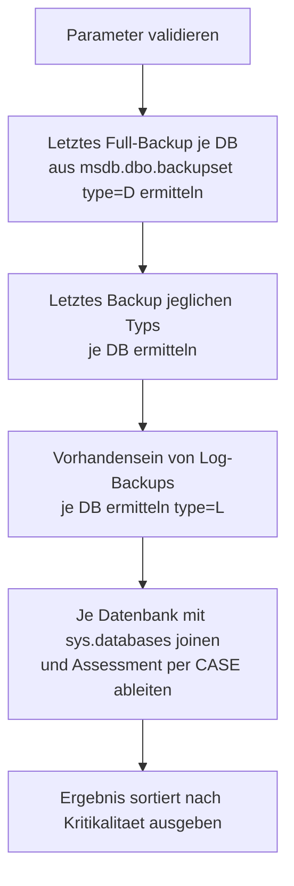

# LastBackupOverview.sql

Dieses Skript zeigt je Datenbank der Instanz das **Recovery Model**, den Zeitpunkt des **letzten Full-Backups** sowie den Zeitpunkt des **letzten Backups jeglichen Typs** (Full, Differential, Log, File/Filegroup, Partial) aus `msdb.dbo.backupset` — inklusive einer Klartext-Einordnung, die typische Backup-Lücken und Auffälligkeiten (z. B. fehlendes Full-Backup, überfällige Backups, Log-Backups trotz `SIMPLE` Recovery Model) direkt sichtbar macht.

## Übersicht

<!-- SQLDOC:SUMMARY_TABLE:BEGIN -->
| Feld | Wert |
|---|---|
| Script | [LastBackupOverview.sql](LastBackupOverview.sql) |
| Version | `1.0` |
| Typ | `query` |
| Kapitel | `71_BackupRestore_Strategies` |
| Sicherheit | `read-only` |
| Zweck | Zeigt je Datenbank Recovery Model, letztes Full-Backup und letztes Backup jeglichen Typs, mit Klartext-Einordnung von Auffälligkeiten. |
<!-- SQLDOC:SUMMARY_TABLE:END -->

## Einordnung

Dieses Skript ergänzt die Backup-Konzept-Entscheidungshilfe aus [71_BackupRestore_Strategies.md](../71_BackupRestore_Strategies.md) Abschnitt 2.3 ("Welches Backup-Konzept für welches Recovery Model?") um eine konkrete, sofort einsetzbare Bestandsaufnahme: Statt nur zu wissen, welches Backup-Konzept *zu einem gegebenen Recovery Model passt*, zeigt dieses Skript, **ob die tatsächlich konfigurierte Backup-Strategie einer Instanz überhaupt zu ihrem jeweiligen Recovery Model passt** — z. B. ob eine Datenbank im `FULL`-Model tatsächlich Log-Backups erhält, oder ob überhaupt jemals ein Full-Backup gelaufen ist.

Für eine tiefere Prüfung der Log-Kette (LSN-Lücken, vollständige Backup-Historie mit Dateipfaden) siehe die Abfrage in [SuspectOrRecoveryPendingDatabase_RepairOptions.md](../SuspectOrRecoveryPendingDatabase_RepairOptions.md) Abschnitt 5.

## Annahmen

- Die Auswertung basiert **ausschließlich** auf der Backup-Historie in `msdb.dbo.backupset` — existieren Backups, deren Historie durch einen Retention-/Cleanup-Job bereits gelöscht wurde, zeigt das Skript korrekt "kein Backup gefunden" an, auch wenn physisch noch Backup-Dateien existieren.
- `tempdb` wird grundsätzlich nicht gesichert und erhält daher eine eigene, neutrale Einordnung ("Info") statt als kritisch/auffällig markiert zu werden.
- `msdb.dbo.backupset.type`: `D` = Database (Full), `I` = Differential, `L` = Log, `F` = File/Filegroup, `G`/`Q` = Differential File/Partial, `P` = Partial. Für "letztes Full-Backup" wird gezielt `type = 'D'` ausgewertet, für "letztes Backup überhaupt" alle Typen.
- Reines Leseskript ohne Seiteneffekte.

## Anwendungsfall

Regelmäßige (z. B. tägliche) Kontrolle, ob alle Datenbanken einer Instanz noch innerhalb der erwarteten Backup-Intervalle gesichert werden, und ob die tatsächliche Backup-Praxis zum konfigurierten Recovery Model passt — etwa nach der Einrichtung neuer Datenbanken, nach Änderungen an Wartungsplänen, oder als Bestandteil eines allgemeinen Instanz-Gesundheitschecks.

## Parameter

<!-- SQLDOC:PARAMETERS_TABLE:BEGIN -->
| Parameter | SQL-Typ | Pflicht | Beschreibung |
|---|---|---|---|
| `@WarnAfterHoursSinceLastFull` | `INT` | Nein | Schwellwert in Stunden: Liegt das letzte Full-Backup länger zurück (oder existiert keins), wird die Datenbank als auffällig markiert. Default `24`. |
| `@WarnAfterHoursSinceLastBackup` | `INT` | Nein | Schwellwert in Stunden: Liegt das letzte Backup jeglichen Typs länger zurück (oder existiert keins), wird die Datenbank als auffällig markiert. Default `24`. |
<!-- SQLDOC:PARAMETERS_TABLE:END -->

## Abhängigkeiten

<!-- SQLDOC:DEPENDENCIES_LIST:BEGIN -->
- `sys.databases`
- `msdb.dbo.backupset`
<!-- SQLDOC:DEPENDENCIES_LIST:END -->

## Hinweise

- `LastFullBackup`/`HoursSinceLastFullBackup` zeigen Zeitpunkt und Alter des letzten Backups mit `type = 'D'` (Full) je Datenbank.
- `LastBackupAnyType`/`LastBackupType`/`HoursSinceLastBackup` zeigen Zeitpunkt, Typ (in Klartext) und Alter des zuletzt abgeschlossenen Backups jeglichen Typs.
- `Assessment` fasst die Lage in Klartext zusammen, mit folgender Priorität (in dieser Reihenfolge geprüft, auch für die Sortierung der Ausgabe genutzt):
  1. `tempdb` → neutrale Info-Meldung (wird nie gesichert).
  2. Noch nie ein Full-Backup gefunden → `Kritisch`.
  3. `SIMPLE` Recovery Model, aber Log-Backups in der Historie vorhanden → `Auffaellig` (Hinweis auf kürzlichen Recovery-Model-Wechsel oder fehlkonfigurierte Jobs).
  4. Letztes Full-Backup älter als `@WarnAfterHoursSinceLastFull` → `Achtung`.
  5. Letztes Backup (jeglichen Typs) älter als `@WarnAfterHoursSinceLastBackup` → `Achtung`.
  6. `FULL`/`BULK_LOGGED` Recovery Model, aber noch nie ein Log-Backup gefunden → `Achtung` (Log wächst unbegrenzt, kein Point-in-Time-Restore möglich — siehe Anti-Pattern in [71_BackupRestore_Strategies.md](../71_BackupRestore_Strategies.md) Abschnitt 2.11).
  7. Ansonsten → `OK`.
- Die Ergebnisliste ist so sortiert, dass die kritischsten Datenbanken zuoberst erscheinen.

## Versionshistorie

<!-- SQLDOC:VERSION_HISTORY_TABLE:BEGIN -->
| Version | Datum | User | Beschreibung |
|---|---|---|---|
| `1.0` | `2026-08-14` | `ER` | Erstversion: letztes Full-Backup und letztes Backup jeglichen Typs je Datenbank aus msdb.dbo.backupset, inkl. Recovery Model und Klartext-Einordnung (fehlendes Full-Backup, überfällige Backups, Log-Backup trotz SIMPLE Model) |
<!-- SQLDOC:VERSION_HISTORY_TABLE:END -->

## Ablauf

<!-- SQLDOC:MERMAID:BEGIN -->

<!-- SQLDOC:MERMAID:END -->

## SQL-Code

<!-- SQLDOC:SQL_CODE:BEGIN -->
```sql
/*
BEGIN:SQL-HEADER v1
---
sql_header: v1
script_name: "LastBackupOverview.sql"
script_version: "1.0"
script_type: "query"
chapter: "71_BackupRestore_Strategies"
purpose: >
  Zeigt je Datenbank der Instanz das Recovery Model, den Zeitpunkt des
  letzten Full-Backups sowie den Zeitpunkt des letzten Backups ueberhaupt
  (Full, Differential oder Log) aus msdb.dbo.backupset. Ergaenzt eine
  Klartext-Einordnung (u.a. Recovery Model, Alter des letzten Backups,
  fehlendes Full-Backup, sowie Auffaelligkeiten wie Log-Backups trotz
  SIMPLE Recovery Model), um Backup-Luecken auf einen Blick zu erkennen.

parameters:
  - name: "@WarnAfterHoursSinceLastFull"
    sql_type: "INT"
    direction: "IN"
    required: false
    description: "Schwellwert in Stunden: Liegt das letzte Full-Backup laenger zurueck (oder existiert keins), wird die Datenbank in der Ausgabe als auffaellig markiert; Default 24"
  - name: "@WarnAfterHoursSinceLastBackup"
    sql_type: "INT"
    direction: "IN"
    required: false
    description: "Schwellwert in Stunden: Liegt das letzte Backup jeglichen Typs laenger zurueck (oder existiert keins), wird die Datenbank in der Ausgabe als auffaellig markiert; Default 24"

result_sets:
  - name: "LastBackupOverview"
    description: "Je Datenbank: Recovery Model, Zeitpunkt/Alter des letzten Full-Backups, Zeitpunkt/Alter des letzten Backups jeglichen Typs, sowie eine Klartext-Einordnung moeglicher Auffaelligkeiten"

dependencies:
  - "sys.databases"
  - "msdb.dbo.backupset"

safety:
  level: "read-only"
  writes_data: false

documentation:
  markdown_file: "T-SQL/71_BackupRestore_Strategies/SQLScripts/LastBackupOverview.md"
  sync_blocks:
    - "SUMMARY_TABLE"
    - "PARAMETERS_TABLE"
    - "DEPENDENCIES_LIST"
    - "VERSION_HISTORY_TABLE"
    - "SQL_CODE"
  mermaid:
    mode: "ai-agent-from-sql"
    source: "script-body"

main_responsible:
  name: "Erhard Rainer"
  initials: "ER"

version_history:
  - version: "1.0"
    date: "2026-08-14"
    user: "ER"
    description: "Erstversion: letztes Full-Backup und letztes Backup jeglichen Typs je Datenbank aus msdb.dbo.backupset, inkl. Recovery Model und Klartext-Einordnung (fehlendes Full-Backup, ueberfaellige Backups, Log-Backup trotz SIMPLE Model)"

notes:
  - "Reines Leseskript ohne Seiteneffekte; greift ausschliesslich auf sys.databases und msdb.dbo.backupset zu."
  - "msdb.dbo.backupset.type: 'D' = Database (Full), 'I' = Differential, 'L' = Log, 'F' = File/Filegroup, 'G'/'P' = Differential File/Partial. Dieses Skript wertet fuer 'letztes Full-Backup' gezielt type = 'D' aus, fuer 'letztes Backup ueberhaupt' alle Typen."
  - "Eine Datenbank im SIMPLE Recovery Model, fuer die dennoch Log-Backups (type = 'L') in msdb existieren, ist ein Hinweis auf einen kuerzlichen Wechsel des Recovery Models oder eine fehlkonfigurierte Backup-Job-Kette - wird als Auffaelligkeit ausgegeben."
  - "Ist msdb.dbo.backupset leer oder wurde die Backup-Historie zwischenzeitlich bereinigt (siehe msdb-Retention-Jobs), zeigt das Skript korrekt 'kein Backup gefunden' an, auch wenn tatsaechlich Backups existieren, deren Historie geloescht wurde - die Ausgabe basiert ausschliesslich auf der msdb-Historie, nicht auf dem Dateisystem."
  - "tempdb wird grundsaetzlich nicht gesichert und daher mit einer eigenen Klartext-Einordnung versehen statt als 'auffaellig' markiert zu werden."
  - "Fuer eine tiefere Pruefung der Log-Kette (LSN-Luecken) siehe die Backup-Historie-Abfrage in SuspectOrRecoveryPendingDatabase_RepairOptions.md Abschnitt 5."
---
END:SQL-HEADER v1
*/

SET NOCOUNT ON;

-- 1. Parameter vorbereiten
DECLARE @WarnAfterHoursSinceLastFull INT = 24;
DECLARE @WarnAfterHoursSinceLastBackup INT = 24;

IF @WarnAfterHoursSinceLastFull IS NULL OR @WarnAfterHoursSinceLastFull <= 0
BEGIN
    THROW 50000, '@WarnAfterHoursSinceLastFull muss ein positiver Wert sein.', 1;
END;

IF @WarnAfterHoursSinceLastBackup IS NULL OR @WarnAfterHoursSinceLastBackup <= 0
BEGIN
    THROW 50001, '@WarnAfterHoursSinceLastBackup muss ein positiver Wert sein.', 1;
END;

-- 2. Letztes Full-Backup je Datenbank ermitteln (type = 'D' = Database/Full)
DROP TABLE IF EXISTS #LastFullBackup;
CREATE TABLE #LastFullBackup
(
    DatabaseName    SYSNAME  NOT NULL,
    LastFullBackup  DATETIME NULL
);

INSERT INTO #LastFullBackup (DatabaseName, LastFullBackup)
SELECT
    bs.database_name,
    MAX(bs.backup_finish_date)
FROM msdb.dbo.backupset AS bs
WHERE bs.type = 'D'
GROUP BY bs.database_name;

-- 3. Letztes Backup jeglichen Typs je Datenbank ermitteln (Full/Diff/Log/File/Partial)
DROP TABLE IF EXISTS #LastAnyBackup;
CREATE TABLE #LastAnyBackup
(
    DatabaseName   SYSNAME      NOT NULL,
    LastAnyBackup  DATETIME     NULL,
    LastBackupType CHAR(1)      NULL
);

INSERT INTO #LastAnyBackup (DatabaseName, LastAnyBackup, LastBackupType)
SELECT
    bs.database_name,
    bs.backup_finish_date,
    bs.type
FROM msdb.dbo.backupset AS bs
INNER JOIN (
    SELECT database_name, MAX(backup_finish_date) AS MaxFinishDate
    FROM msdb.dbo.backupset
    GROUP BY database_name
) AS latest
    ON latest.database_name = bs.database_name
   AND latest.MaxFinishDate = bs.backup_finish_date;

-- 4. Auffaelligkeit ermitteln: existieren Log-Backups (type = 'L') fuer eine Datenbank,
--    die aktuell im SIMPLE Recovery Model laeuft?
DROP TABLE IF EXISTS #LogBackupExists;
CREATE TABLE #LogBackupExists
(
    DatabaseName SYSNAME NOT NULL
);

INSERT INTO #LogBackupExists (DatabaseName)
SELECT DISTINCT bs.database_name
FROM msdb.dbo.backupset AS bs
WHERE bs.type = 'L';

-- 5. Ergebnis je Datenbank zusammenstellen und Klartext-Einordnung ableiten
SELECT
    d.name                                                        AS DatabaseName,
    d.recovery_model_desc                                         AS RecoveryModel,
    d.state_desc                                                  AS StateDesc,
    lfb.LastFullBackup                                            AS LastFullBackup,
    DATEDIFF(HOUR, lfb.LastFullBackup, GETDATE())                 AS HoursSinceLastFullBackup,
    lab.LastAnyBackup                                             AS LastBackupAnyType,
    CASE lab.LastBackupType
        WHEN 'D' THEN 'Full'
        WHEN 'I' THEN 'Differential'
        WHEN 'L' THEN 'Log'
        WHEN 'F' THEN 'File/Filegroup'
        WHEN 'G' THEN 'Differential File'
        WHEN 'P' THEN 'Partial'
        WHEN 'Q' THEN 'Differential Partial'
        ELSE lab.LastBackupType
    END                                                            AS LastBackupType,
    DATEDIFF(HOUR, lab.LastAnyBackup, GETDATE())                  AS HoursSinceLastBackup,
    CASE
        WHEN d.name = 'tempdb'
            THEN 'Info - tempdb wird grundsaetzlich nicht gesichert.'
        WHEN lfb.LastFullBackup IS NULL
            THEN 'Kritisch - fuer diese Datenbank wurde noch NIE ein Full-Backup gefunden (laut msdb-Historie).'
        WHEN d.recovery_model_desc = 'SIMPLE' AND EXISTS (SELECT 1 FROM #LogBackupExists AS lbe WHERE lbe.DatabaseName = d.name)
            THEN 'Auffaellig - Datenbank ist aktuell SIMPLE, msdb enthaelt aber Log-Backups. Hinweis auf einen kuerzlichen Recovery-Model-Wechsel oder eine fehlkonfigurierte Backup-Job-Kette.'
        WHEN DATEDIFF(HOUR, lfb.LastFullBackup, GETDATE()) > @WarnAfterHoursSinceLastFull
            THEN 'Achtung - letztes Full-Backup liegt laenger als ' + CAST(@WarnAfterHoursSinceLastFull AS VARCHAR(10)) + ' Stunden zurueck.'
        WHEN DATEDIFF(HOUR, lab.LastAnyBackup, GETDATE()) > @WarnAfterHoursSinceLastBackup
            THEN 'Achtung - letztes Backup (jeglichen Typs) liegt laenger als ' + CAST(@WarnAfterHoursSinceLastBackup AS VARCHAR(10)) + ' Stunden zurueck.'
        WHEN d.recovery_model_desc IN ('FULL', 'BULK_LOGGED') AND NOT EXISTS (SELECT 1 FROM #LogBackupExists AS lbe WHERE lbe.DatabaseName = d.name)
            THEN 'Achtung - Recovery Model ist ' + d.recovery_model_desc + ', aber es wurde noch NIE ein Log-Backup gefunden. Log waechst unbegrenzt, Point-in-Time-Restore nicht moeglich.'
        ELSE 'OK - Full- und Backup-Historie unauffaellig.'
    END                                                            AS Assessment
FROM sys.databases AS d
LEFT JOIN #LastFullBackup AS lfb
    ON lfb.DatabaseName = d.name
LEFT JOIN #LastAnyBackup AS lab
    ON lab.DatabaseName = d.name
ORDER BY
    CASE
        WHEN d.name = 'tempdb' THEN 9
        WHEN lfb.LastFullBackup IS NULL THEN 0
        WHEN d.recovery_model_desc = 'SIMPLE' AND EXISTS (SELECT 1 FROM #LogBackupExists AS lbe WHERE lbe.DatabaseName = d.name) THEN 1
        WHEN DATEDIFF(HOUR, lfb.LastFullBackup, GETDATE()) > @WarnAfterHoursSinceLastFull THEN 2
        WHEN DATEDIFF(HOUR, lab.LastAnyBackup, GETDATE()) > @WarnAfterHoursSinceLastBackup THEN 3
        WHEN d.recovery_model_desc IN ('FULL', 'BULK_LOGGED') AND NOT EXISTS (SELECT 1 FROM #LogBackupExists AS lbe WHERE lbe.DatabaseName = d.name) THEN 4
        ELSE 8
    END,
    d.name;
```
<!-- SQLDOC:SQL_CODE:END -->
